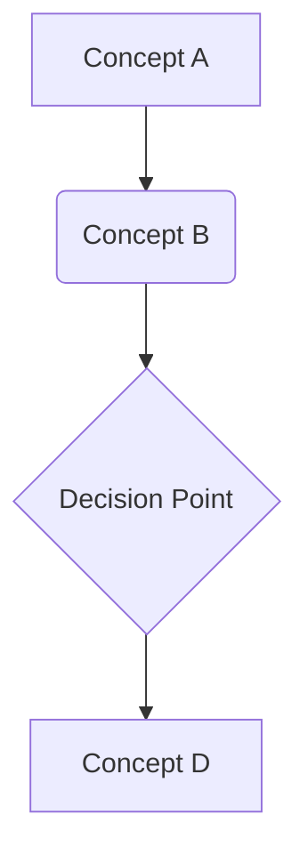

import Tabs from '@theme/Tabs';
import TabItem from '@theme/TabItem';

## Learning Outcomes

After completing this chapter, you will be able to:
1. [Learning outcome 1 with measurable action verb]
2. [Learning outcome 2 with measurable action verb]
3. [Learning outcome 3 with measurable action verb]
4. [Learning outcome 4 with measurable action verb]
5. [Learning outcome 5 with measurable action verb]
6. [Learning outcome 6 with measurable action verb]
7. [Learning outcome 7 with measurable action verb]
8. [Learning outcome 8 with measurable action verb]

## Gherkin Specifications

### Scenario 1: [Title]
- **Given** [initial context]
- **When** [event happens]
- **Then** [expected outcome]

### Scenario 2: [Title]
- **Given** [initial context]
- **When** [event happens]
- **Then** [expected outcome]

### Scenario 3: [Title]
- **Given** [initial context]
- **When** [event happens]
- **Then** [expected outcome]

### Scenario 4: [Title]
- **Given** [initial context]
- **When** [event happens]
- **Then** [expected outcome]

### Scenario 5: [Title]
- **Given** [initial context]
- **When** [event happens]
- **Then** [expected outcome]

## Theory & Intuition

[Provide theoretical background with analogies]

Think of [concept] like [analogy from everyday life]. Just as [analogy explanation], in robotics [concept application]. This helps understand [key insight].

## Core Concepts

<Tabs
  defaultValue="diagram"
  values={[
    {label: 'Mermaid Diagram', value: 'diagram'},
    {label: 'Table', value: 'table'},
  ]}>
  <TabItem value="diagram">



  </TabItem>
  <TabItem value="table">

| Term | Definition | Example |
|------|------------|---------|
| Example | Definition | Usage |

  </TabItem>
</Tabs>

## Hands-On Labs

<Tabs
  defaultValue="lab1"
  values={[
    {label: 'Lab 1', value: 'lab1'},
    {label: 'Lab 2', value: 'lab2'},
    {label: 'Lab 3', value: 'lab3'},
  ]}>
  <TabItem value="lab1">

### Lab 1: [Title]

#### Objective
[Describe what the lab teaches]

#### Required Components
- [List required components/simulators]

#### Steps
1. [Step 1 with detailed instructions]
2. [Step 2 with detailed instructions]
3. [Step 3 with detailed instructions]

#### Code Example
```python
# Example code
print("Hello, Robotics!")
```

#### Expected Outcome
[Description of what the student should observe]

  </TabItem>
  <TabItem value="lab2">
    <!-- Additional lab content -->
  </TabItem>
  <TabItem value="lab3">
    <!-- Additional lab content -->
  </TabItem>
</Tabs>

## Sim-to-Real Notes

[Notes on how to apply this concept to real hardware, such as Jetson Orin Nano or Unitree G1/Go2]

- **Hardware considerations**: [Specific hardware notes]
- **Differences from simulation**: [Key differences to be aware of]
- **Practical tips**: [Practical advice for implementation]

## Multiple Choice Questions

1. Question text?
   - A) Option A
   - B) Option B
   - C) Option C
   - D) Option D

   **Correct Answer: B** - Explanation of why B is correct

2. Question text?
   - A) Option A
   - B) Option B
   - C) Option C
   - D) Option D

   **Correct Answer: A** - Explanation of why A is correct

3. Question text?
   - A) Option A
   - B) Option B
   - C) Option C
   - D) Option D

   **Correct Answer: C** - Explanation of why C is correct

4. Question text?
   - A) Option A
   - B) Option B
   - C) Option C
   - D) Option D

   **Correct Answer: D** - Explanation of why D is correct

5. Question text?
   - A) Option A
   - B) Option B
   - C) Option C
   - D) Option D

   **Correct Answer: A** - Explanation of why A is correct

6. Question text?
   - A) Option A
   - B) Option B
   - C) Option C
   - D) Option D

   **Correct Answer: B** - Explanation of why B is correct

7. Question text?
   - A) Option A
   - B) Option B
   - C) Option C
   - D) Option D

   **Correct Answer: C** - Explanation of why C is correct

8. Question text?
   - A) Option A
   - B) Option B
   - C) Option C
   - D) Option D

   **Correct Answer: D** - Explanation of why D is correct

9. Question text?
   - A) Option A
   - B) Option B
   - C) Option C
   - D) Option D

   **Correct Answer: A** - Explanation of why A is correct

10. Question text?
    - A) Option A
    - B) Option B
    - C) Option C
    - D) Option D

    **Correct Answer: B** - Explanation of why B is correct

11. Question text?
    - A) Option A
    - B) Option B
    - C) Option C
    - D) Option D

    **Correct Answer: C** - Explanation of why C is correct

12. Question text?
    - A) Option A
    - B) Option B
    - C) Option C
    - D) Option D

    **Correct Answer: D** - Explanation of why D is correct

13. Question text?
    - A) Option A
    - B) Option B
    - C) Option C
    - D) Option D

    **Correct Answer: A** - Explanation of why A is correct

14. Question text?
    - A) Option A
    - B) Option B
    - C) Option C
    - D) Option D

    **Correct Answer: B** - Explanation of why B is correct

15. Question text?
    - A) Option A
    - B) Option B
    - C) Option C
    - D) Option D

    **Correct Answer: C** - Explanation of why C is correct

## Further Reading

1. [ROS 2 Documentation](https://docs.ros.org/en/humble/) - Official ROS 2 documentation
2. [Docusaurus Guide](https://docusaurus.io/docs) - Official Docusaurus documentation
3. [Robotics Stack Exchange](https://robotics.stackexchange.com/) - Community Q&A for robotics
4. [ROS 2 Tutorials](https://docs.ros.org/en/humble/Tutorials.html) - ROS 2 learning tutorials
5. [GitHub Repository](https://github.com/robotics-textbook/physical-ai-humanoid-robotics) - Source code repository for this textbook
6. [Open Robotics](https://www.openrobotics.org/) - Open-source robotics foundation