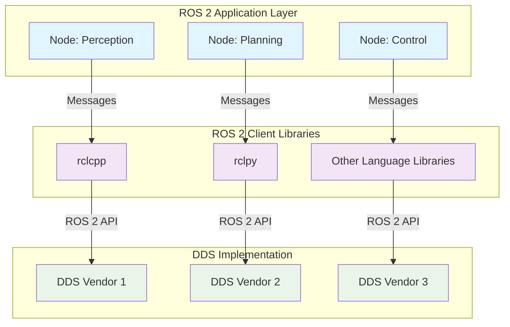

import Tabs from '@theme/Tabs';
import TabItem from '@theme/TabItem';
import DocCardList from '@theme/DocCardList';
import Link from '@docusaurus/Link';
import ChapterProgress from '@site/src/components/ChapterProgress';
import ModuleProgress from '@site/src/components/ModuleProgress';
import QAValidation from '@site/src/components/QAValidation';

<ChapterProgress chapterId="chapter-1-intro-ros" />
<ModuleProgress moduleId="module-1-ros" />
<QAValidation chapterId="chapter-1-intro-ros" title="Chapter 1 - Introduction to ROS 2 Architecture" />

## Learning Outcomes

After completing this chapter, you will be able to:
1. Explain the architecture of ROS 2 and its differences from ROS 1
2. Identify the key middleware components of ROS 2
3. Describe the DDS (Data Distribution Service) concept and its role in ROS 2
4. Understand the purpose of client libraries like rclcpp and rclpy
5. Navigate the ROS 2 ecosystem and identify appropriate tools
6. Explain the concept of ROS 2 distributions and their lifecycle
7. Identify when to use ROS 2 vs alternative robotic frameworks
8. Evaluate the security features of ROS 2 for robotic applications

## Gherkin Specifications

### Scenario 1: Understanding ROS 2 Architecture
- **Given** a robotic system with distributed components
- **When** implementing communication patterns
- **Then** nodes exchange data reliably with appropriate Quality of Service (QoS)

### Scenario 2: Middleware Selection
- **Given** a robot with specific requirements for real-time performance
- **When** choosing the appropriate DDS implementation
- **Then** the system meets timing requirements with minimal latency

### Scenario 3: Client Library Usage
- **Given** a robot with both Python and C++ components
- **When** implementing communication between nodes
- **Then** nodes in different languages can communicate seamlessly

### Scenario 4: Ecosystem Navigation
- **Given** a need to implement a specific robot functionality
- **When** searching for appropriate packages and tools
- **Then** the correct ROS 2 packages are identified and integrated

### Scenario 5: Distribution Selection
- **Given** a specific hardware platform and use case
- **When** choosing a ROS 2 distribution
- **Then** the selected distribution supports all required features

## Theory & Intuition

Think of ROS 2 as the central nervous system of a robot. Just as our nervous system allows different parts of our body to communicate and coordinate, ROS 2 provides the infrastructure for different robot software components to work together.

In biological systems, signals travel along neurons using chemical and electrical processes. Similarly, in ROS 2, data travels between nodes using the Data Distribution Service (DDS) as the underlying middleware. This middleware handles the complex tasks of message routing, discovery, and delivery, so that robotic applications can focus on their core functionality.

ROS 2's architecture is designed for real-world robotics applications where reliability, real-time performance, and security are critical. This is a major evolution from ROS 1, which was primarily designed for research purposes.

## Core Concepts

<Tabs
  defaultValue="diagram"
  values={[
    {label: 'Architecture Diagram', value: 'diagram'},
    {label: 'Key Concepts Table', value: 'table'},
  ]}>
  <TabItem value="diagram">



  </TabItem>
  <TabItem value="table">

| Concept | Definition | Example |
|---------|------------|---------|
| Node | A process that performs computation | Navigation node, perception node |
| Topic | Named bus over which nodes exchange messages | /cmd_vel for velocity commands |
| Service | Synchronous request/response communication | Get map service for maps |
| Action | Asynchronous goal-based communication | Navigation to goal action |
| Package | Collection of related resources | Navigation2 package |

  </TabItem>
</Tabs>

## Hands-On Labs

<Tabs
  defaultValue="lab1"
  values={[
    {label: 'Lab 1: ROS 2 Environment Setup', value: 'lab1'},
    {label: 'Lab 2: Creating Your First Node', value: 'lab2'},
    {label: 'Lab 3: Understanding DDS Concepts', value: 'lab3'},
  ]}>
  <TabItem value="lab1">

### Lab 1: ROS 2 Environment Setup

#### Objective
Learn to set up a ROS 2 development environment and verify the installation.

#### Required Components
- Linux-based OS (Ubuntu 22.04 recommended)
- Terminal access
- Internet connection

#### Steps
1. Update locale settings:
   ```bash
   locale  # Check for C.UTF-8
   sudo locale-gen en_US en_US.UTF-8
   sudo update-locale LC_ALL=en_US.UTF-8 LANG=en_US.UTF-8
   export LANG=en_US.UTF-8
   ```

2. Add the ROS 2 apt repository:
   ```bash
   sudo apt update && sudo apt install curl gnupg lsb-release
   sudo curl -sSL https://raw.githubusercontent.com/ros/rosdistro/master/ros.key -o /usr/share/keyrings/ros-archive-keyring.gpg
   echo "deb [arch=$(dpkg --print-architecture) signed-by=/usr/share/keyrings/ros-archive-keyring.gpg] http://packages.ros.org/ros2/ubuntu $(source /etc/os-release && echo $UBUNTU_CODENAME) main" | sudo tee /etc/apt/sources.list.d/ros2.list > /dev/null
   ```

3. Install ROS 2 Humble Hawksbill:
   ```bash
   sudo apt update
   sudo apt install ros-humble-desktop
   ```

4. Source the ROS 2 environment:
   ```bash
   source /opt/ros/humble/setup.bash
   ```

5. Verify the installation:
   ```bash
   printenv | grep -i ros
   ```

#### Code Example
```bash
# Check ROS 2 version
ros2 --version

# List available commands
ros2 --help
```

#### Expected Outcome
Successful installation of ROS 2 with all required packages and proper environment variables set.

  </TabItem>
  <TabItem value="lab2">

### Lab 2: Creating Your First Node

#### Objective
Create a simple ROS 2 node that publishes "Hello, Robot!" messages.

#### Required Components
- ROS 2 environment from Lab 1
- Text editor
- Terminal

#### Steps
1. Create a new workspace:
   ```bash
   mkdir -p ~/ros2_ws/src
   cd ~/ros2_ws
   ```

2. Source the ROS 2 environment:
   ```bash
   source /opt/ros/humble/setup.bash
   ```

3. Create a new package:
   ```bash
   cd ~/ros2_ws/src
   ros2 pkg create --build-type ament_python my_first_ros2_pkg
   ```

4. Edit the Python node file:
   ```bash
   nano ~/ros2_ws/src/my_first_ros2_pkg/my_first_ros2_pkg/simple_publisher.py
   ```

5. Add the following code:
   ```python
   import rclpy
   from rclpy.node import Node
   from std_msgs.msg import String

   class SimplePublisher(Node):
       def __init__(self):
           super().__init__('simple_publisher')
           self.publisher_ = self.create_publisher(String, 'topic', 10)
           timer_period = 0.5  # seconds
           self.timer = self.create_timer(timer_period, self.timer_callback)
           self.i = 0

       def timer_callback(self):
           msg = String()
           msg.data = f'Hello, Robot! {self.i}'
           self.publisher_.publish(msg)
           self.get_logger().info(f'Publishing: "{msg.data}"')
           self.i += 1

   def main(args=None):
       rclpy.init(args=args)
       simple_publisher = SimplePublisher()
       rclpy.spin(simple_publisher)
       simple_publisher.destroy_node()
       rclpy.shutdown()

   if __name__ == '__main__':
       main()
   ```

6. Make the file executable:
   ```bash
   chmod +x ~/ros2_ws/src/my_first_ros2_pkg/my_first_ros2_pkg/simple_publisher.py
   ```

7. Build and run:
   ```bash
   cd ~/ros2_ws
   source /opt/ros/humble/setup.bash
   colcon build --packages-select my_first_ros2_pkg
   source install/setup.bash
   ros2 run my_first_ros2_pkg simple_publisher
   ```

#### Code Example
```python
# Publisher node code (as shown in the steps)
```

#### Expected Outcome
Node successfully publishing "Hello, Robot!" messages at 2Hz to the ROS 2 topic.

  </TabItem>
  <TabItem value="lab3">

### Lab 3: Understanding DDS Concepts

#### Objective
Explore different DDS implementations and compare their behavior with ROS 2.

#### Required Components
- ROS 2 environment with multiple DDS vendors
- Terminal access

#### Steps
1. Check currently used RMW implementation:
   ```bash
   printenv | grep RMW
   ```

2. List available RMW implementations:
   ```bash
   # Set RMW to Cyclone DDS
   export RMW_IMPLEMENTATION=rmw_cyclonedx_cpp
   
   # Or set to Fast DDS
   export RMW_IMPLEMENTATION=rmw_fastrtps_cpp
   ```

3. Run two terminals with different RMW implementations:
   Terminal 1:
   ```bash
   export RMW_IMPLEMENTATION=rmw_cyclonedx_cpp
   ros2 run my_first_ros2_pkg simple_publisher
   ```
   
   Terminal 2:
   ```bash
   export RMW_IMPLEMENTATION=rmw_fastrtps_cpp
   ros2 topic echo /topic std_msgs/msg/String
   ```

4. Observe whether communication succeeds between different implementations.

#### Expected Outcome
Understanding that different DDS implementations can interoperate, demonstrating the flexibility of ROS 2's middleware layer.

  </TabItem>
</Tabs>

## Sim-to-Real Notes

- **Hardware considerations**: When implementing ROS 2 on embedded robotics hardware, memory and CPU constraints may require careful selection of DDS implementation
- **Differences from simulation**: Real robots have stricter timing requirements and may need different QoS settings than simulation
- **Practical tips**: Always test your ROS 2 applications on real hardware early in development to identify any platform-specific issues

## Multiple Choice Questions

1. What does DDS stand for in the context of ROS 2?
   - A) Data Distribution Service
   - B) Distributed Development System
   - C) Dynamic Data Sharing
   - D) Direct Data Synchronization

   **Correct Answer: A** - DDS stands for Data Distribution Service, which is the middleware layer that ROS 2 uses for communication between nodes.

2. Which of the following is NOT a communication pattern in ROS 2?
   - A) Topics
   - B) Services
   - C) Actions
   - D) Functions

   **Correct Answer: D** - Functions are not a ROS 2 communication pattern. The main patterns are Topics, Services, and Actions.

3. What is the default ROS 2 distribution mentioned in the textbook?
   - A) Foxy
   - B) Galactic
   - C) Humble
   - D) Iron

   **Correct Answer: C** - Humble Hawksbill is mentioned as the default distribution in the examples (Ubuntu 22.04 recommended).

4. Which client library is used for C++ in ROS 2?
   - A) rclpy
   - B) rclcpp
   - C) roscpp
   - D) roslib

   **Correct Answer: B** - rclcpp is the client library used for C++ in ROS 2.

5. What is the primary advantage of using DDS as the middleware in ROS 2?
   - A) Faster computation
   - B) Better graphics rendering
   - C) Improved security and real-time performance
   - D) Simpler API

   **Correct Answer: C** - DDS was specifically chosen to address security and real-time performance requirements that were limitations in ROS 1.

6. How do you properly source a ROS 2 installation in bash?
   - A) source /opt/ros/humble/setup.sh
   - B) source /opt/ros/humble/setup.bash
   - C) export ROS_ROOT=/opt/ros/humble
   - D) ros2 source humble

   **Correct Answer: B** - The correct command is source /opt/ros/humble/setup.bash.

7. Which command creates a new ROS 2 package?
   - A) ros2 create pkg_name
   - B) ros2 pkg create pkg_name
   - C) catkin_create_pkg pkg_name
   - D) new-ros2-package pkg_name

   **Correct Answer: B** - ros2 pkg create pkg_name is the correct command to create a new ROS 2 package.

8. What is the recommended approach for building ROS 2 packages?
   - A) catkin_make
   - B) colcon build
   - C) make build
   - D) cmake build

   **Correct Answer: B** - colcon build is the recommended tool for building ROS 2 packages.

9. What does RMW stand for in ROS 2?
   - A) Robot Middleware Wrapper
   - B) ROS Middleware
   - C) Robotic Master Work
   - D) Runtime Middleware Work

   **Correct Answer: B** - RMW stands for ROS Middleware, which allows ROS 2 to work with different DDS implementations.

10. How do you create a publisher in ROS 2 using Python?
    - A) self.create_publisher(Type, 'topic_name', queue_size)
    - B) self.create_publisher('topic_name', Type, buffer_size)
    - C) self.create_publisher(Type, 'topic_name', qos_profile)
    - D) publisher = Publisher(Type, 'topic_name')

    **Correct Answer: C** - self.create_publisher(Type, 'topic_name', qos_profile) is the correct syntax in ROS 2.

11. What is the primary difference between a Service and an Action in ROS 2?
    - A) Services are synchronous, Actions are asynchronous
    - B) Actions are synchronous, Services are asynchronous
    - C) There is no difference
    - D) Services are for sensors, Actions are for movement

    **Correct Answer: A** - Services are synchronous request/response, while Actions are asynchronous goal-based communication.

12. What does the acronym QoS stand for in ROS 2?
    - A) Quality of Service
    - B) Quick Operating System
    - C) Queue of Signaling
    - D) Quantum Operating System

    **Correct Answer: A** - QoS stands for Quality of Service, which defines policies for message delivery.

13. Which of the following is a valid ROS 2 workspace directory structure?
    - A) ~/workspace/src
    - B) ~/ros2_workspace/source
    - C) ~/ros2_ws/src
    - D) All of the above

    **Correct Answer: D** - All of these are valid workspace directory structures for ROS 2.

14. What command is used to list available ROS 2 topics?
    - A) ros2 list topics
    - B) ros2 show topics
    - C) ros2 topic list
    - D) ros2 list --topics

    **Correct Answer: C** - ros2 topic list is the correct command to list available topics.

15. What is the primary purpose of the rclpy library?
    - A) To provide C++ interfaces to ROS 2
    - B) To provide Python interfaces to ROS 2
    - C) To manage ROS 2 packages
    - D) To handle DDS communication

    **Correct Answer: B** - rclpy provides Python interfaces to ROS 2, allowing Python programs to interact with ROS 2.

## Further Reading

1. [ROS 2 Documentation](https://docs.ros.org/en/humble/) - Official ROS 2 documentation and tutorials
2. [DDS Specification](https://www.omg.org/spec/DDS/) - The OMG DDS specification that ROS 2 is based on
3. [ROS 2 Design Papers](https://arxiv.org/abs/1712.08722) - Academic paper on ROS 2 design principles
4. [Real-Time ROS 2 Applications](https://ieeexplore.ieee.org/document/9147341) - Research paper about real-time capabilities
5. [ROS 2 Security](https://design.ros2.org/articles/ros2_security.html) - Article on security features in ROS 2
6. [RMW Implementation Guide](https://github.com/ros2/rmw) - Repository with information about different RMW implementations

## Chapter Navigation

<div class="pagination-nav">
  <div class="pagination-nav__item">
    <Link className="pagination-nav__link" to="/modules/module-1-ros/chapter-2-nodes-communication/">
      <div className="pagination-nav__sublabel">Next</div>
      <div className="pagination-nav__label">Chapter 2: Nodes and Communication Primitives →</div>
    </Link>
  </div>
</div>