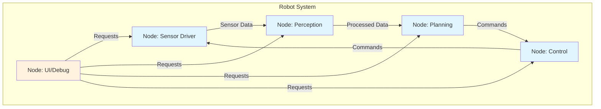

import Tabs from '@theme/Tabs';
import TabItem from '@theme/TabItem';
import Link from '@docusaurus/Link';
import ChapterProgress from '@site/src/components/ChapterProgress';
import ModuleProgress from '@site/src/components/ModuleProgress';

<ChapterProgress chapterId="chapter-2-nodes-communication" />
<ModuleProgress moduleId="module-1-ros" />

## Learning Outcomes

After completing this chapter, you will be able to:
1. Create and implement ROS 2 nodes in both Python and C++
2. Understand the node lifecycle and management in ROS 2
3. Design effective node architectures for robotic applications
4. Configure node parameters and handle parameter callbacks
5. Implement proper error handling and node shutdown procedures
6. Utilize node composition to optimize performance
7. Debug node communication issues effectively
8. Evaluate when to use separate nodes versus composition

## Gherkin Specifications

### Scenario 1: Node Creation
- **Given** a need to implement a specific robot function
- **When** creating a new ROS 2 node
- **Then** the node properly initializes and handles its intended functionality

### Scenario 2: Node Communication
- **Given** multiple nodes in a robot system
- **When** establishing communication between nodes
- **Then** data flows correctly according to the communication pattern used

### Scenario 3: Node Management
- **Given** a running robot system with multiple nodes
- **When** managing node lifecycle events
- **Then** nodes start, run, and shut down gracefully

### Scenario 4: Parameter Configuration
- **Given** a node that needs configurable behavior
- **When** setting and retrieving parameters
- **Then** the node adjusts its behavior according to the parameters

### Scenario 5: Error Handling
- **Given** a node encountering an error condition
- **When** executing error handling procedures
- **Then** the node fails gracefully without affecting the overall system

## Theory & Intuition

Think of nodes in ROS 2 as specialized organs in a biological system. Just as your heart pumps blood, your eyes process visual information, and your brain makes decisions, each ROS 2 node performs a specific function within the robotic system. 

In biological systems, organs are connected through various pathways (blood vessels, neural pathways) to exchange information and substances. Similarly, ROS 2 nodes communicate through topics, services, and actions. The node itself is the processing unit, but its interactions with other nodes through these communication primitives are what allow the robot to function as a coordinated system.

Nodes can be implemented in different programming languages (Python, C++, etc.) and still communicate effectively, just as biological systems use common chemical signals (hormones, neurotransmitters) regardless of the organ type.

## Core Concepts

<Tabs
  defaultValue="diagram"
  values={[
    {label: 'Node Communication Patterns', value: 'diagram'},
    {label: 'Node Management Table', value: 'table'},
  ]}>
  <TabItem value="diagram">



  </TabItem>
  <TabItem value="table">

| Concept | Purpose | Use Case |
|---------|---------|----------|
| Node | Processing unit that performs computation | Navigation, perception, control |
| Lifecycle | Management of node states (config, activate, etc.) | Safe robot operation |
| Parameters | Configuration values for node behavior | Thresholds, algorithm settings |
| Composition | Combining multiple nodes in a single process | Performance optimization |
| Namespaces | Organizing nodes and topics | Large systems with many nodes |

  </TabItem>
</Tabs>

## Hands-On Labs

<Tabs
  defaultValue="lab1"
  values={[
    {label: 'Lab 1: Creating a Node with Parameters', value: 'lab1'},
    {label: 'Lab 2: Node Communication Patterns', value: 'lab2'},
    {label: 'Lab 3: Node Composition', value: 'lab3'},
  ]}>
  <TabItem value="lab1">

### Lab 1: Creating a Node with Parameters

#### Objective
Create a node that accepts and responds to parameter configuration.

#### Required Components
- ROS 2 environment
- Text editor
- Terminal access

#### Steps
1. Create a new package:
   ```bash
   cd ~/ros2_ws/src
   ros2 pkg create --build-type ament_python param_demo_pkg
   ```

2. Create the node file:
   ```bash
   nano ~/ros2_ws/src/param_demo_pkg/param_demo_pkg/parameter_node.py
   ```

3. Add the following code:
   ```python
   import rclpy
   from rclpy.node import Node
   from rclpy.parameter import Parameter

   class ParameterNode(Node):
       def __init__(self):
           super().__init__('parameter_node')
           
           # Declare parameters with default values
           self.declare_parameter('frequency', 1.0)
           self.declare_parameter('message', 'Hello from parameter node')
           self.declare_parameter('max_attempts', 5)
           
           # Get parameter values
           self.frequency = self.get_parameter('frequency').value
           self.message = self.get_parameter('message').value
           self.max_attempts = self.get_parameter('max_attempts').value
           
           # Setup timer based on frequency parameter
           timer_period = 1.0 / self.frequency
           self.timer = self.create_timer(timer_period, self.timer_callback)
           
           # Counter for attempts
           self.attempt_count = 0
           
           self.get_logger().info(
               f'Node initialized with frequency={self.frequency}, '
               f'message="{self.message}", max_attempts={self.max_attempts}'
           )

       def timer_callback(self):
           if self.attempt_count < self.max_attempts:
               self.get_logger().info(f'Attempt {self.attempt_count + 1}: {self.message}')
               self.attempt_count += 1
           else:
               self.get_logger().info('Max attempts reached, stopping.')
               # Cancel timer to stop the node
               self.timer.cancel()

   def main(args=None):
       rclpy.init(args=args)
       parameter_node = ParameterNode()
       rclpy.spin(parameter_node)
       parameter_node.destroy_node()
       rclpy.shutdown()

   if __name__ == '__main__':
       main()
   ```

4. Make the file executable and build:
   ```bash
   chmod +x ~/ros2_ws/src/param_demo_pkg/param_demo_pkg/parameter_node.py
   cd ~/ros2_ws
   colcon build --packages-select param_demo_pkg
   source install/setup.bash
   ```

5. Run with default parameters:
   ```bash
   ros2 run param_demo_pkg parameter_node
   ```

6. Run with custom parameters:
   ```bash
   ros2 run param_demo_pkg parameter_node --ros-args -p frequency:=2.0 -p message:="Custom message" -p max_attempts:=3
   ```

#### Code Example
```python
# Parameter declaration and usage as shown in the steps
```

#### Expected Outcome
Node successfully running with configurable parameters that affect its behavior.

  </TabItem>
  <TabItem value="lab2">

### Lab 2: Node Communication Patterns

#### Objective
Implement all three communication patterns (topics, services, actions) in a coordinated system.

#### Required Components
- ROS 2 environment
- Text editor
- Terminal access

#### Steps
1. Create a new package for communication demo:
   ```bash
   cd ~/ros2_ws/src
   ros2 pkg create --build-type ament_python communication_demo_pkg --dependencies rclpy std_msgs example_interfaces
   ```

2. Create the main node file:
   ```bash
   nano ~/ros2_ws/src/communication_demo_pkg/communication_demo_pkg/communication_node.py
   ```

3. Add the following code:
   ```python
   import rclpy
   from rclpy.node import Node
   from rclpy.action import ActionClient
   from rclpy.callback_groups import ReentrantCallbackGroup
   from rclpy.executors import MultiThreadedExecutor
   from std_msgs.msg import String
   from example_interfaces.srv import AddTwoInts
   from example_interfaces.action import Fibonacci

   class CommunicationNode(Node):
       def __init__(self):
           super().__init__('communication_node')
           
           # Topic publisher
           self.publisher = self.create_publisher(String, 'topic_demo', 10)
           
           # Topic subscriber
           self.subscription = self.create_subscription(
               String,
               'topic_demo',
               self.topic_callback,
               10)
           
           # Service server
           self.service = self.create_service(AddTwoInts, 'add_two_ints', self.service_callback)
           
           # Action client
           self.action_client = ActionClient(self, Fibonacci, 'fibonacci')
           
           # Timer to periodically publish messages
           self.timer = self.create_timer(2.0, self.publish_message)
           
       def topic_callback(self, msg):
           self.get_logger().info(f'Received topic message: {msg.data}')
           
       def service_callback(self, request, response):
           result = request.a + request.b
           response.sum = result
           self.get_logger().info(f'Returning {request.a} + {request.b} = {response.sum}')
           return response
           
       def publish_message(self):
           msg = String()
           msg.data = f'Hello, this is the communication demo node! Timestamp: {self.get_clock().now()}'
           self.publisher.publish(msg)
           self.get_logger().info(f'Published: {msg.data}')

   def main(args=None):
       rclpy.init(args=args)
       communication_node = CommunicationNode()
       
       executor = MultiThreadedExecutor()
       executor.add_node(communication_node)
       
       try:
           executor.spin()
       except KeyboardInterrupt:
           pass
       
       communication_node.destroy_node()
       rclpy.shutdown()

   if __name__ == '__main__':
       main()
   ```

4. Make executable and build:
   ```bash
   chmod +x ~/ros2_ws/src/communication_demo_pkg/communication_demo_pkg/communication_node.py
   cd ~/ros2_ws
   colcon build --packages-select communication_demo_pkg
   source install/setup.bash
   ```

5. Run the node:
   ```bash
   ros2 run communication_demo_pkg communication_node
   ```

6. Test the different communication patterns in separate terminals:
   - Topic subscription: `ros2 topic echo /topic_demo std_msgs/msg/String`
   - Service call: `ros2 service call /add_two_ints example_interfaces/srv/AddTwoInts "{a: 1, b: 2}"`
   - Action goal: `ros2 action send_goal /fibonacci example_interfaces/action/Fibonacci "{order: 5}"`

#### Expected Outcome
Node successfully implementing all three ROS 2 communication patterns and other nodes/clients able to interact with it.

  </TabItem>
  <TabItem value="lab3">

### Lab 3: Node Composition

#### Objective
Understand how to compose multiple nodes in a single process to reduce overhead.

#### Required Components
- ROS 2 environment
- Text editor
- Terminal access

#### Steps
1. Create a package for composition demo:
   ```bash
   cd ~/ros2_ws/src
   ros2 pkg create --build-type ament_python composition_demo_pkg --dependencies rclpy std_msgs
   ```

2. Create the first node component:
   ```bash
   nano ~/ros2_ws/src/composition_demo_pkg/composition_demo_pkg/publisher_component.py
   ```

3. Add the following code:
   ```python
   import rclpy
   from rclpy.node import Node
   from std_msgs.msg import String

   class PublisherComponent(Node):
       def __init__(self):
           super().__init__('publisher_component')
           self.publisher = self.create_publisher(String, 'composed_topic', 10)
           timer_period = 0.5  # seconds
           self.timer = self.create_timer(timer_period, self.timer_callback)
           self.i = 0

       def timer_callback(self):
           msg = String()
           msg.data = f'Composed publisher message: {self.i}'
           self.publisher.publish(msg)
           self.get_logger().info(f'Publishing: "{msg.data}"')
           self.i += 1
   ```

4. Create the second node component:
   ```bash
   nano ~/ros2_ws/src/composition_demo_pkg/composition_demo_pkg/subscriber_component.py
   ```

5. Add the following code:
   ```python
   import rclpy
   from rclpy.node import Node
   from std_msgs.msg import String

   class SubscriberComponent(Node):
       def __init__(self):
           super().__init__('subscriber_component')
           self.subscription = self.create_subscription(
               String,
               'composed_topic',
               self.listener_callback,
               10)
           self.subscription  # prevent unused variable warning

       def listener_callback(self, msg):
           self.get_logger().info(f'Subscribed to composed_topic: "{msg.data}"')
   ```

6. Create the main composition file:
   ```bash
   nano ~/ros2_ws/src/composition_demo_pkg/composition_demo_pkg/composition_main.py
   ```

7. Add the following code:
   ```python
   import rclpy
   from rclpy.node import Node
   from publisher_component import PublisherComponent
   from subscriber_component import SubscriberComponent

   def main(args=None):
       rclpy.init(args=args)
       
       # Create a container node
       container = Node('composition_container')
       
       # Create the component nodes
       publisher_node = PublisherComponent()
       subscriber_node = SubscriberComponent()
       
       # Create an executor and add all nodes
       executor = rclpy.executors.MultiThreadedExecutor()
       executor.add_node(publisher_node)
       executor.add_node(subscriber_node)
       executor.add_node(container)
       
       try:
           executor.spin()
       except KeyboardInterrupt:
           pass
       
       # Cleanup
       publisher_node.destroy_node()
       subscriber_node.destroy_node()
       container.destroy_node()
       rclpy.shutdown()

   if __name__ == '__main__':
       main()
   ```

8. Make executable and build:
   ```bash
   chmod +x ~/ros2_ws/src/composition_demo_pkg/composition_demo_pkg/composition_main.py
   cd ~/ros2_ws
   colcon build --packages-select composition_demo_pkg
   source install/setup.bash
   ```

9. Run the composed nodes:
   ```bash
   ros2 run composition_demo_pkg composition_main
   ```

#### Expected Outcome
Two nodes (publisher and subscriber) running in a single process, demonstrating composition to reduce communication overhead.

  </TabItem>
</Tabs>

## Sim-to-Real Notes

- **Hardware considerations**: When running ROS 2 nodes on embedded systems with limited resources, node composition can help reduce the overhead of inter-process communication
- **Differences from simulation**: In real robots, nodes may need to handle hardware-specific timing constraints and error conditions
- **Practical tips**: Always design nodes with proper error handling and graceful degradation to ensure robot safety

## Multiple Choice Questions

1. What is the primary purpose of a ROS 2 node?
   - A) To store data permanently
   - B) To perform computation and communicate with other components
   - C) To manage the operating system
   - D) To replace the need for programming

   **Correct Answer: B** - Nodes perform computation and communicate with other components in the ROS 2 system.

2. How do you declare a parameter in a ROS 2 node using Python?
   - A) self.declare_param('name', default_value)
   - B) self.set_parameter('name', default_value)
   - C) self.declare_parameter('name', default_value)
   - D) parameter = Parameter('name', default_value)

   **Correct Answer: C** - self.declare_parameter('name', default_value) is the correct method.

3. Which of the following is NOT a communication pattern in ROS 2?
   - A) Topic
   - B) Service
   - C) Action
   - D) Function

   **Correct Answer: D** - Function is not a ROS 2 communication pattern.

4. What is node composition in ROS 2?
   - A) Combining multiple nodes into a single process
   - B) Breaking a node into smaller nodes
   - C) Copying one node to create another
   - D) Deleting unnecessary nodes

   **Correct Answer: A** - Node composition combines multiple nodes into a single process to reduce overhead.

5. How do you create a publisher in a ROS 2 node?
   - A) self.create_publisher('topic_name', Type, queue_size)
   - B) self.create_publisher(Type, 'topic_name', qos_profile)
   - C) publisher = Publisher(Type, 'topic_name')
   - D) self.add_publisher(Type, 'topic_name')

   **Correct Answer: B** - self.create_publisher(Type, 'topic_name', qos_profile) is the correct syntax.

6. What command can be used to list all running ROS 2 nodes?
   - A) ros2 list nodes
   - B) ros2 node ls
   - C) ros2 run list
   - D) ros2 show nodes

   **Correct Answer: B** - ros2 node ls lists all running ROS 2 nodes.

7. When should you use an Action instead of a Service in ROS 2?
   - A) For all communications
   - B) For short, synchronous requests
   - C) For long-running tasks with feedback
   - D) For parameter configuration

   **Correct Answer: C** - Actions are appropriate for long-running tasks that provide feedback during execution.

8. What is the correct way to get a parameter value in ROS 2?
   - A) self.get_param('param_name')
   - B) self.get_parameter('param_name').value
   - C) self.read_parameter('param_name')
   - D) param = Parameter('param_name')

   **Correct Answer: B** - self.get_parameter('param_name').value is the correct method.

9. What happens when you call self.destroy_node() in ROS 2?
   - A) The node pauses execution
   - B) The node restarts
   - C) The node cleans up resources and shuts down
   - D) The node changes its name

   **Correct Answer: C** - destroy_node() cleans up resources and prepares the node for shutdown.

10. How do you create a subscription to a topic in ROS 2?
    - A) self.create_subscription(Type, 'topic_name', callback, queue_size)
    - B) self.subscribe(Type, 'topic_name', callback)
    - C) self.create_subscription('topic_name', Type, callback, qos_profile)
    - D) self.add_subscription(Type, 'topic_name', callback)

    **Correct Answer: A** - self.create_subscription(Type, 'topic_name', callback, queue_size) is the correct syntax.

11. What is the purpose of the rclpy.node.Node class?
    - A) To create GUI interfaces
    - B) To serve as the base class for ROS 2 Python nodes
    - C) To handle hardware drivers
    - D) To manage system memory

    **Correct Answer: B** - Node is the base class for creating ROS 2 Python nodes.

12. Which command runs a ROS 2 node with specific parameters?
    - A) ros2 node run pkg_name node_name param:=value
    - B) ros2 run pkg_name node_name --params param:=value
    - C) ros2 run pkg_name node_name --ros-args -p param_name:=value
    - D) ros2 launch pkg_name node_name --param value

    **Correct Answer: C** - ros2 run pkg_name node_name --ros-args -p param_name:=value is the correct syntax.

13. What is the difference between synchronous and asynchronous communication in ROS 2?
    - A) Synchronous is faster
    - B) Synchronous waits for response, asynchronous continues execution
    - C) Asynchronous uses more memory
    - D) There is no difference

    **Correct Answer: B** - Synchronous communication waits for a response before continuing, while asynchronous continues execution.

14. Which ROS 2 feature allows multiple nodes to be managed in a single process?
    - A) Node groups
    - B) Node composition
    - C) Node clustering
    - D) Node synchronization

    **Correct Answer: B** - Node composition allows multiple nodes to be managed in a single process.

15. In ROS 2, how do you handle multiple callbacks that might execute simultaneously?
    - A) Use only one callback per node
    - B) Implement callback groups like ReentrantCallbackGroup
    - C) Turn off multithreading
    - D) Use global variables

    **Correct Answer: B** - Callback groups like ReentrantCallbackGroup handle multiple simultaneous callbacks.

## Further Reading

1. [ROS 2 Node Concepts](https://docs.ros.org/en/humble/Concepts/Basic/About-Nodes.html) - Official documentation on ROS 2 nodes
2. [ROS 2 Parameters Guide](https://docs.ros.org/en/humble/How-To-Guides/Using-Parameters-in-a-class-CPP.html) - Guide on using parameters in nodes
3. [Node Composition Tutorial](https://docs.ros.org/en/humble/Tutorials/Intermediate/Composition.html) - Tutorial on node composition
4. [ROS 2 Communication Patterns](https://docs.ros.org/en/humble/Concepts/About-Topics.html) - Detailed explanation of communication patterns
5. [Node Lifecycle Management](https://design.ros2.org/articles/node_lifecycle.html) - Design article on node lifecycle
6. [ROS 2 Threading Model](https://docs.ros.org/en/humble/Concepts/About-Executors.html) - Information about executors and threading

## Chapter Navigation

<div class="pagination-nav">
  <div class="pagination-nav__item pagination-nav__item--prev">
    <Link className="pagination-nav__link" to="/modules/module-1-ros/chapter-1-intro-ros/">
      <div className="pagination-nav__sublabel">Previous</div>
      <div className="pagination-nav__label">← Chapter 1: Introduction to ROS 2 Architecture</div>
    </Link>
  </div>
  <div class="pagination-nav__item pagination-nav__item--next">
    <Link className="pagination-nav__link" to="/modules/module-1-ros/chapter-3-topics-publishers/">
      <div className="pagination-nav__sublabel">Next</div>
      <div className="pagination-nav__label">Chapter 3: Topics and Publishers/Subscribers →</div>
    </Link>
  </div>
</div>