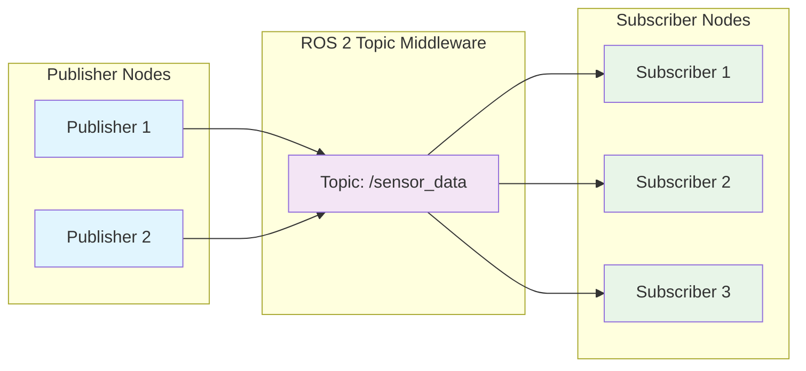

import Tabs from '@theme/Tabs';
import TabItem from '@theme/TabItem';
import Link from '@docusaurus/Link';

## Learning Outcomes

After completing this chapter, you will be able to:
1. Implement publishers and subscribers for topic-based communication
2. Define and use custom message types in ROS 2
3. Configure Quality of Service (QoS) settings appropriately for different use cases
4. Handle message serialization and deserialization effectively
5. Design efficient topic architectures for robotic systems
6. Debug and monitor topic-based communication
7. Apply latching and transient local QoS policies when appropriate
8. Evaluate the impact of network topology on topic communication

## Gherkin Specifications

### Scenario 1: Topic Communication
- **Given** a publisher-node and subscriber-node connected via a topic
- **When** the publisher sends messages at a defined rate
- **Then** the subscriber receives messages reliably within QoS parameters

### Scenario 2: Message Type Definition
- **Given** a custom data structure to be shared between nodes
- **When** defining a message type in .msg format
- **Then** the message can be used in publishers and subscribers

### Scenario 3: QoS Configuration
- **Given** a topic with specific timing and reliability requirements
- **When** configuring appropriate QoS policies
- **Then** the communication meets the specified requirements

### Scenario 4: Message Synchronization
- **Given** multiple nodes publishing related information
- **When** implementing synchronization strategies
- **Then** related messages are properly matched for processing

### Scenario 5: Topic Monitoring
- **Given** a running ROS 2 system with topics
- **When** monitoring the topics with diagnostic tools
- **Then** system performance and health are accurately assessed

## Theory & Intuition

Think of topics and publishers/subscribers in ROS 2 like a radio broadcasting system. A publisher is like a radio station that continuously broadcasts information, while a subscriber is like a radio receiver that tunes in to listen to specific stations. 

Just as you can tune multiple radios to the same station and they all receive the same broadcast simultaneously, multiple subscribers can listen to the same topic and receive the same messages. The publisher doesn't need to know how many subscribers are listening, just as a radio station doesn't know how many radios are tuned in.

In radio systems, different stations broadcast on different frequencies to avoid interference. Similarly, in ROS 2, different topics have unique names to avoid message confusion. The publisher decides what information to broadcast and how frequently, while subscribers decide which topics to listen to and how often to check for new messages.

## Core Concepts

<Tabs
  defaultValue="diagram"
  values={[
    {label: 'Topic Communication Model', value: 'diagram'},
    {label: 'QoS Policy Table', value: 'table'},
  ]}>
  <TabItem value="diagram">



  </TabItem>
  <TabItem value="table">

| QoS Policy | Purpose | Use Case |
|------------|---------|----------|
| Reliability | Guarantees message delivery | Critical commands, state info |
| Durability | Persistence of messages | Configuration, static maps |
| History | Number of messages to store | Recent sensor data, commands |
| Deadline | Maximum time between messages | Time-critical systems |
| Lifespan | Maximum age of messages | Cached data with expiry |

  </TabItem>
</Tabs>

## Hands-On Labs

<Tabs
  defaultValue="lab1"
  values={[
    {label: 'Lab 1: Basic Publisher-Subscriber', value: 'lab1'},
    {label: 'Lab 2: Custom Message Types', value: 'lab2'},
    {label: 'Lab 3: QoS Configuration', value: 'lab3'},
  ]}>
  <TabItem value="lab1">

### Lab 1: Basic Publisher-Subscriber

#### Objective
Create a publisher node that sends messages and a subscriber node that receives them.

#### Required Components
- ROS 2 environment
- Text editor
- Terminal access

#### Steps
1. Create a new package:
   ```bash
   cd ~/ros2_ws/src
   ros2 pkg create --build-type ament_python topic_demo_pkg --dependencies rclpy std_msgs
   ```

2. Create the publisher node:
   ```bash
   nano ~/ros2_ws/src/topic_demo_pkg/topic_demo_pkg/publisher_node.py
   ```

3. Add the following code:
   ```python
   import rclpy
   from rclpy.node import Node
   from std_msgs.msg import String

   class PublisherNode(Node):
       def __init__(self):
           super().__init__('publisher_node')
           self.publisher = self.create_publisher(String, 'topic_demo', 10)
           timer_period = 0.5  # seconds
           self.timer = self.create_timer(timer_period, self.timer_callback)
           self.i = 0

       def timer_callback(self):
           msg = String()
           msg.data = f'Hello, this is message {self.i} from publisher node'
           self.publisher.publish(msg)
           self.get_logger().info(f'Publishing: "{msg.data}"')
           self.i += 1

   def main(args=None):
       rclpy.init(args=args)
       publisher_node = PublisherNode()
       rclpy.spin(publisher_node)
       publisher_node.destroy_node()
       rclpy.shutdown()

   if __name__ == '__main__':
       main()
   ```

4. Create the subscriber node:
   ```bash
   nano ~/ros2_ws/src/topic_demo_pkg/topic_demo_pkg/subscriber_node.py
   ```

5. Add the following code:
   ```python
   import rclpy
   from rclpy.node import Node
   from std_msgs.msg import String

   class SubscriberNode(Node):
       def __init__(self):
           super().__init__('subscriber_node')
           self.subscription = self.create_subscription(
               String,
               'topic_demo',
               self.listener_callback,
               10)
           self.subscription  # prevent unused variable warning

       def listener_callback(self, msg):
           self.get_logger().info(f'I heard: "{msg.data}"')

   def main(args=None):
       rclpy.init(args=args)
       subscriber_node = SubscriberNode()
       rclpy.spin(subscriber_node)
       subscriber_node.destroy_node()
       rclpy.shutdown()

   if __name__ == '__main__':
       main()
   ```

6. Make both files executable:
   ```bash
   chmod +x ~/ros2_ws/src/topic_demo_pkg/topic_demo_pkg/publisher_node.py
   chmod +x ~/ros2_ws/src/topic_demo_pkg/topic_demo_pkg/subscriber_node.py
   ```

7. Build the package:
   ```bash
   cd ~/ros2_ws
   colcon build --packages-select topic_demo_pkg
   source install/setup.bash
   ```

8. Run the publisher in one terminal:
   ```bash
   ros2 run topic_demo_pkg publisher_node
   ```

9. Run the subscriber in another terminal:
   ```bash
   ros2 run topic_demo_pkg subscriber_node
   ```

#### Expected Outcome
Subscriber node successfully receiving and displaying messages from the publisher node at 2Hz rate.

  </TabItem>
  <TabItem value="lab2">

### Lab 2: Custom Message Types

#### Objective
Define and use custom message types for more complex data structures.

#### Required Components
- ROS 2 environment
- Text editor
- Terminal access

#### Steps
1. Create a package for custom messages:
   ```bash
   cd ~/ros2_ws/src
   ros2 pkg create --build-type ament_cmake custom_msg_pkg
   ```

2. Create the message directory:
   ```bash
   mkdir -p ~/ros2_ws/src/custom_msg_pkg/msg
   ```

3. Create the custom message definition:
   ```bash
   nano ~/ros2_ws/src/custom_msg_pkg/msg/RobotInfo.msg
   ```

4. Add the message definition:
   ```text
   # Custom message for robot information
   string name
   float64 battery_level
   int32[] joint_positions
   geometry_msgs/Pose current_pose
   ```

5. Edit the CMakeLists.txt to include message generation:
   ```bash
   nano ~/ros2_ws/src/custom_msg_pkg/CMakeLists.txt
   ```

6. Add the following lines after the find_package calls:
   ```cmake
   find_package(rosidl_default_generators REQUIRED)
   find_package(geometry_msgs REQUIRED)

   rosidl_generate_interfaces(${PROJECT_NAME}
     "msg/RobotInfo.msg"
     DEPENDENCIES geometry_msgs
   )

   ament_export_dependencies(rosidl_default_runtime)
   ```

7. Add the required dependency to package.xml:
   ```bash
   nano ~/ros2_ws/src/custom_msg_pkg/package.xml
   ```

8. Add these dependencies in the package.xml:
   ```xml
   <depend>geometry_msgs</depend>
   <buildtool_depend>rosidl_default_generators</buildtool_depend>
   <exec_depend>rosidl_default_runtime</exec_depend>
   <member_of_group>rosidl_interface_packages</member_of_group>
   ```

9. Create publisher and subscriber for the custom message (Python):
   ```bash
   mkdir -p ~/ros2_ws/src/custom_msg_pkg/topic_demo
   nano ~/ros2_ws/src/custom_msg_pkg/topic_demo/publisher_custom.py
   ```

10. Add the publisher code:
    ```python
    import rclpy
    from rclpy.node import Node
    from geometry_msgs.msg import Pose
    # Import your custom message
    from custom_msg_pkg.msg import RobotInfo

    class CustomPublisher(Node):
        def __init__(self):
            super().__init__('custom_publisher')
            self.publisher = self.create_publisher(RobotInfo, 'robot_info', 10)
            timer_period = 1.0  # seconds
            self.timer = self.create_timer(timer_period, self.timer_callback)
            self.i = 0

        def timer_callback(self):
            msg = RobotInfo()
            msg.name = f'Robot_{self.i}'
            msg.battery_level = 100.0 - (self.i * 2.5)  # Decreasing battery
            msg.joint_positions = [0, 45, 90, self.i * 10]  # Simulated joint positions
            
            # Set pose message
            msg.current_pose.position.x = 1.0
            msg.current_pose.position.y = 2.0
            msg.current_pose.position.z = 0.0
            msg.current_pose.orientation.w = 1.0
            
            self.publisher.publish(msg)
            self.get_logger().info(f'Publishing robot info: {msg.name}, battery: {msg.battery_level}%')
            self.i += 1

    def main(args=None):
        rclpy.init(args=args)
        custom_publisher = CustomPublisher()
        rclpy.spin(custom_publisher)
        custom_publisher.destroy_node()
        rclpy.shutdown()

    if __name__ == '__main__':
        main()
    ```

11. Create the subscriber for the custom message:
    ```bash
    nano ~/ros2_ws/src/custom_msg_pkg/topic_demo/subscriber_custom.py
    ```

12. Add the subscriber code:
    ```python
    import rclpy
    from rclpy.node import Node
    # Import your custom message
    from custom_msg_pkg.msg import RobotInfo

    class CustomSubscriber(Node):
        def __init__(self):
            super().__init__('custom_subscriber')
            self.subscription = self.create_subscription(
                RobotInfo,
                'robot_info',
                self.listener_callback,
                10)
            self.subscription  # prevent unused variable warning

        def listener_callback(self, msg):
            self.get_logger().info(
                f'Robot: {msg.name}, Battery: {msg.battery_level}%, '
                f'Joints: {msg.joint_positions}, '
                f'Pose: ({msg.current_pose.position.x}, {msg.current_pose.position.y})'
            )

    def main(args=None):
        rclpy.init(args=args)
        custom_subscriber = CustomSubscriber()
        rclpy.spin(custom_subscriber)
        custom_subscriber.destroy_node()
        rclpy.shutdown()

    if __name__ == '__main__':
        main()
    ```

13. Update the setup.py to include the Python nodes:
    ```bash
    nano ~/ros2_ws/src/custom_msg_pkg/setup.py
    ```

14. Add the entry points for executables:
    ```python
    from setuptools import setup

    package_name = 'custom_msg_pkg'

    setup(
        name=package_name,
        version='0.0.0',
        packages=[package_name],
        data_files=[
            ('share/ament_index/resource_index/packages',
                ['resource/' + package_name]),
            ('share/' + package_name, ['package.xml']),
        ],
        install_requires=['setuptools'],
        zip_safe=True,
        maintainer='Your Name',
        maintainer_email='you@example.com',
        description='Custom message package',
        license='Apache License 2.0',
        tests_require=['pytest'],
        entry_points={
            'console_scripts': [
                'pub_custom = topic_demo.publisher_custom:main',
                'sub_custom = topic_demo.subscriber_custom:main',
            ],
        },
    )
    ```

15. Build the package:
    ```bash
    cd ~/ros2_ws
    colcon build --packages-select custom_msg_pkg
    source install/setup.bash
    ```

16. Run the publisher and subscriber:
    ```bash
    # Terminal 1
    ros2 run custom_msg_pkg pub_custom
    
    # Terminal 2
    ros2 run custom_msg_pkg sub_custom
    ```

#### Expected Outcome
Custom message with robot information successfully published and received by the custom message publisher/subscriber nodes.

  </TabItem>
  <TabItem value="lab3">

### Lab 3: QoS Configuration

#### Objective
Explore different Quality of Service (QoS) configurations and their impact on topic communication.

#### Required Components
- ROS 2 environment
- Text editor
- Terminal access

#### Steps
1. Create a new package for QoS demo:
   ```bash
   cd ~/ros2_ws/src
   ros2 pkg create --build-type ament_python qos_demo_pkg --dependencies rclpy std_msgs
   ```

2. Create the publisher with QoS options:
   ```bash
   nano ~/ros2_ws/src/qos_demo_pkg/qos_demo_pkg/qos_publisher.py
   ```

3. Add the following code:
   ```python
   import rclpy
   from rclpy.node import Node
   from rclpy.qos import QoSProfile, QoSReliabilityPolicy, QoSHistoryPolicy
   from std_msgs.msg import String

   class QoSPublisher(Node):
       def __init__(self):
           super().__init__('qos_publisher')
           
           # Create different QoS profiles
           # Reliable profile - guarantees delivery
           reliable_qos = QoSProfile(
               depth=10,
               reliability=QoSReliabilityPolicy.RELIABLE,
               history=QoSHistoryPolicy.KEEP_LAST
           )
           
           # Best effort profile - faster but no guarantee
           best_effort_qos = QoSProfile(
               depth=10,
               reliability=QoSReliabilityPolicy.BEST_EFFORT,
               history=QoSHistoryPolicy.KEEP_LAST
           )
           
           # Create publishers with different QoS
           self.reliable_publisher = self.create_publisher(String, 'reliable_topic', reliable_qos)
           self.best_effort_publisher = self.create_publisher(String, 'best_effort_topic', best_effort_qos)
           
           # Timer for both publishers
           timer_period = 1.0  # seconds
           self.timer = self.create_timer(timer_period, self.timer_callback)
           self.i = 0

       def timer_callback(self):
           msg = String()
           msg.data = f'Message {self.i} - Time: {self.get_clock().now().nanoseconds}'
           
           # Publish to both topics
           self.reliable_publisher.publish(msg)
           self.best_effort_publisher.publish(msg)
           
           self.get_logger().info(f'Published reliable: "{msg.data}"')
           self.get_logger().info(f'Published best effort: "{msg.data}"')
           
           self.i += 1

   def main(args=None):
       rclpy.init(args=args)
       qos_publisher = QoSPublisher()
       rclpy.spin(qos_publisher)
       qos_publisher.destroy_node()
       rclpy.shutdown()

   if __name__ == '__main__':
       main()
   ```

4. Create the subscriber with QoS options:
   ```bash
   nano ~/ros2_ws/src/qos_demo_pkg/qos_demo_pkg/qos_subscriber.py
   ```

5. Add the following code:
   ```python
   import rclpy
   from rclpy.node import Node
   from rclpy.qos import QoSProfile, QoSReliabilityPolicy, QoSHistoryPolicy
   from std_msgs.msg import String

   class QoSSubscriber(Node):
       def __init__(self):
           super().__init__('qos_subscriber')
           
           # QoS profiles matching the publishers
           reliable_qos = QoSProfile(
               depth=10,
               reliability=QoSReliabilityPolicy.RELIABLE,
               history=QoSHistoryPolicy.KEEP_LAST
           )
           
           best_effort_qos = QoSProfile(
               depth=10,
               reliability=QoSReliabilityPolicy.BEST_EFFORT,
               history=QoSHistoryPolicy.KEEP_LAST
           )
           
           # Create subscriptions with different QoS
           self.reliable_subscription = self.create_subscription(
               String,
               'reliable_topic',
               self.reliable_callback,
               reliable_qos)
               
           self.best_effort_subscription = self.create_subscription(
               String,
               'best_effort_topic',
               self.best_effort_callback,
               best_effort_qos)
               
           self.get_logger().info('QoS Subscriber initialized')

       def reliable_callback(self, msg):
           self.get_logger().info(f'Received RELIABLE: "{msg.data}"')

       def best_effort_callback(self, msg):
           self.get_logger().info(f'Received BEST EFFORT: "{msg.data}"')

   def main(args=None):
       rclpy.init(args=args)
       qos_subscriber = QoSSubscriber()
       rclpy.spin(qos_subscriber)
       qos_subscriber.destroy_node()
       rclpy.shutdown()

   if __name__ == '__main__':
       main()
   ```

6. Make both files executable:
   ```bash
   chmod +x ~/ros2_ws/src/qos_demo_pkg/qos_demo_pkg/qos_publisher.py
   chmod +x ~/ros2_ws/src/qos_demo_pkg/qos_demo_pkg/qos_subscriber.py
   ```

7. Build the package:
   ```bash
   cd ~/ros2_ws
   colcon build --packages-select qos_demo_pkg
   source install/setup.bash
   ```

8. Run the publisher in one terminal:
   ```bash
   ros2 run qos_demo_pkg qos_publisher
   ```

9. Run the subscriber in another terminal:
   ```bash
   ros2 run qos_demo_pkg qos_subscriber
   ```

#### Expected Outcome
Subscriber successfully handling messages from both reliable and best-effort publishers, demonstrating different QoS behavior.

  </TabItem>
</Tabs>

## Sim-to-Real Notes

- **Hardware considerations**: When using topics with real sensors, ensure QoS reliability settings are appropriate for the sensor's characteristics
- **Differences from simulation**: Real robots may experience more message loss due to network issues, requiring more robust QoS configurations
- **Practical tips**: Use transient local durability for configuration or map topics that new subscribers should receive immediately

## Multiple Choice Questions

1. What is the primary characteristic of topic-based communication in ROS 2?
   - A) Synchronous request/response
   - B) Asynchronous publish/subscribe
   - C) Point-to-point connection
   - D) File-based data exchange

   **Correct Answer: B** - Topic-based communication is asynchronous publish/subscribe.

2. How do you create a publisher with a specific QoS profile in Python?
   - A) self.create_publisher(Type, 'topic', queue_size, qos_profile)
   - B) self.create_publisher(Type, 'topic', qos_profile)
   - C) self.create_publisher('topic', Type, qos_settings)
   - D) publisher = Publisher(Type, 'topic', qos_profile)

   **Correct Answer: B** - self.create_publisher(Type, 'topic', qos_profile) is the correct syntax.

3. What does QoS stand for in ROS 2?
   - A) Quality of Service
   - B) Quick Operating System
   - C) Query and Subscription
   - D) Queue of Signals

   **Correct Answer: A** - QoS stands for Quality of Service.

4. Which QoS policy determines whether messages are guaranteed to be delivered?
   - A) History
   - B) Deadline
   - C) Reliability
   - D) Durability

   **Correct Answer: C** - Reliability policy determines message delivery guarantees.

5. What is the purpose of the "depth" parameter when creating a publisher?
   - A) The number of subscribers allowed
   - B) The maximum message size
   - C) The number of messages to queue for late-joining subscribers
   - D) The network depth for transmission

   **Correct Answer: C** - Depth specifies how many messages to queue for late-joining subscribers.

6. In a topic communication pattern, how many publishers can there be?
   - A) Only one
   - B) At most two
   - C) Multiple publishers are allowed
   - D) Depends on the subscriber count

   **Correct Answer: C** - Multiple publishers can publish to the same topic.

7. How do you create a subscription to a topic in ROS 2?
   - A) self.create_subscription(Type, 'topic_name', callback, queue_size)
   - B) self.create_subscription('topic_name', Type, callback, qos_profile)
   - C) self.subscribe(Type, 'topic_name', callback)
   - D) self.add_subscription(Type, 'topic_name', callback)

   **Correct Answer: A** - self.create_subscription(Type, 'topic_name', callback, queue_size) is the correct syntax.

8. What is the difference between RELIABLE and BEST_EFFORT QoS reliability policies?
   - A) There is no difference
   - B) RELIABLE ensures delivery, BEST_EFFORT does not
   - C) BEST_EFFORT is faster than RELIABLE
   - D) Both ensure delivery but with different methods

   **Correct Answer: B** - RELIABLE ensures delivery while BEST_EFFORT does not guarantee delivery.

9. Which command can be used to echo messages from a topic?
   - A) ros2 listen /topic_name
   - B) ros2 echo /topic_name
   - C) ros2 topic echo /topic_name
   - D) ros2 show /topic_name

   **Correct Answer: C** - ros2 topic echo /topic_name is the correct command.

10. What is the purpose of the Durability QoS policy?
    - A) To control message delivery speed
    - B) To determine how messages persist for late joiners
    - C) To set message size limits
    - D) To establish network connections

    **Correct Answer: B** - Durability policy determines how messages persist for late-joining subscribers.

11. Which QoS policy controls how many messages to store?
    - A) Reliability
    - B) Deadline
    - C) History
    - D) Lifespan

    **Correct Answer: C** - History policy controls how many messages to store.

12. What is a common use case for TRANSIENT_LOCAL durability?
    - A) High-speed sensor data
    - B) Configuration and map topics
    - C) Temporary messages
    - D) Debugging information

    **Correct Answer: B** - TRANSIENT_LOCAL is commonly used for configuration and map topics that new subscribers should receive immediately.

13. Which ROS 2 command shows information about a topic?
    - A) ros2 info /topic_name
    - B) ros2 topic info /topic_name
    - C) ros2 show /topic_name
    - D) ros2 topic details /topic_name

    **Correct Answer: B** - ros2 topic info /topic_name shows topic information including QoS settings.

14. Can a subscriber connect to a publisher with incompatible QoS settings?
    - A) Yes, always
    - B) Only if they match exactly
    - C) Sometimes, depending on QoS compatibility rules
    - D) No, never

    **Correct Answer: C** - Compatibility depends on specific QoS policy compatibility rules.

15. What is the default depth value when creating publishers/subscribers?
    - A) 1
    - B) 5
    - C) 10
    - D) Unlimited

    **Correct Answer: C** - The default depth value is 10.

## Further Reading

1. [ROS 2 Topics Documentation](https://docs.ros.org/en/humble/Concepts/Basic/About-Topics.html) - Official documentation on ROS 2 topics
2. [ROS 2 QoS Reference](https://docs.ros.org/en/humble/Concepts/About-Quality-of-Service.html) - Quality of Service policies in ROS 2
3. [Message Type Definition](https://docs.ros.org/en/humble/How-To-Guides/Defining-custom-interfaces.html) - Guide on defining custom message types
4. [ROS 2 Topic Tools](https://docs.ros.org/en/humble/Reference/Tools.html#topic-command-tools) - Reference for topic-related command-line tools
5. [QoS Configuration Guide](https://github.com/ros2/rmw/blob/master/rmw/DESIGN.md#qos-policies) - Design documentation on QoS policies
6. [ROS 2 Message Generation](https://docs.ros.org/en/humble/Tutorials/Beginner-Client-Libraries/Creating-Your-First-ROS2-Message-Package.html) - Tutorial on creating custom messages

## Chapter Navigation

<div class="pagination-nav">
  <div class="pagination-nav__item pagination-nav__item--prev">
    <Link className="pagination-nav__link" to="/modules/module-1-ros/chapter-2-nodes-communication/">
      <div className="pagination-nav__sublabel">Previous</div>
      <div className="pagination-nav__label">← Chapter 2: Nodes and Communication Primitives</div>
    </Link>
  </div>
  <div class="pagination-nav__item pagination-nav__item--next">
    <Link className="pagination-nav__link" to="/modules/module-1-ros/chapter-4-services-actions/">
      <div className="pagination-nav__sublabel">Next</div>
      <div className="pagination-nav__label">Chapter 4: Services and Actions →</div>
    </Link>
  </div>
</div>