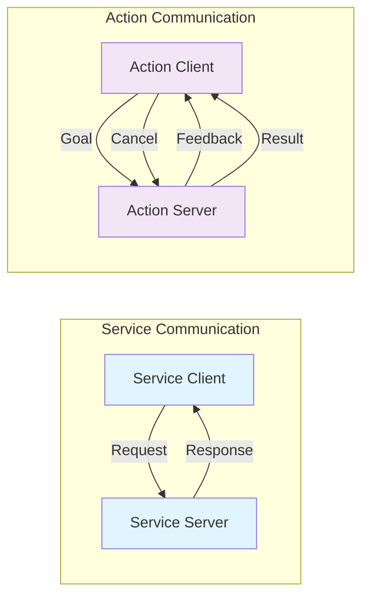

import Tabs from '@theme/Tabs';
import TabItem from '@theme/TabItem';
import Link from '@docusaurus/Link';

## Learning Outcomes

After completing this chapter, you will be able to:
1. Implement service-based communication patterns in ROS 2
2. Create and use action-based communication for long-running tasks
3. Determine when to use services vs. actions vs. topics
4. Design effective service and action interfaces
5. Handle errors and exceptional conditions in services and actions
6. Integrate services and actions with other ROS 2 components
7. Monitor and debug service and action communication
8. Evaluate performance trade-offs between different communication patterns

## Gherkin Specifications

### Scenario 1: Service Communication
- **Given** a robot system with a service provider and client
- **When** the client sends a request to the service
- **Then** the server processes the request and returns an appropriate response

### Scenario 2: Action Execution
- **Given** a robot with a long-running task to execute
- **When** an action goal is sent to the action server
- **Then** the task executes with feedback and result provided

### Scenario 3: Communication Pattern Selection
- **Given** a specific robot communication requirement
- **When** selecting between topics, services, and actions
- **Then** the most appropriate communication pattern is chosen

### Scenario 4: Service Error Handling
- **Given** a service request that encounters an error
- **When** the error is processed by the service server
- **Then** an appropriate error response is provided to the client

### Scenario 5: Action Feedback
- **Given** an executing action with progress feedback
- **When** the client requests status updates
- **Then** the current progress is reported accurately

## Theory & Intuition

Think of services and actions in ROS 2 like different types of customer support interactions. A service is like calling a support line where you ask a specific question and get a direct answer (request/response). An action is like reporting a complex issue that requires multiple steps and time to resolve, where you receive periodic updates on progress (feedback) and a final resolution (result).

Services are synchronous from the client's perspective - they send a request and wait for a response, just like asking a question and waiting for an answer. Actions, on the other hand, are asynchronous - you send a goal and continue with other tasks, receiving feedback periodically until the action completes.

## Core Concepts

<Tabs
  defaultValue="diagram"
  values={[
    {label: 'Service vs Action Model', value: 'diagram'},
    {label: 'Usage Patterns Table', value: 'table'},
  ]}>
  <TabItem value="diagram">



  </TabItem>
  <TabItem value="table">

| Pattern | Type | Use Case | Example |
|---------|------|----------|---------|
| Service | Request/Response | Quick queries | Get robot status |
| Action | Goal/Feedback/Result | Long-running tasks | Navigate to goal |
| Topic | Publish/Subscribe | Continuous data | Sensor readings |

  </TabItem>
</Tabs>

## Hands-On Labs

<Tabs
  defaultValue="lab1"
  values={[
    {label: 'Lab 1: Basic Service Implementation', value: 'lab1'},
    {label: 'Lab 2: Action Server and Client', value: 'lab2'},
    {label: 'Lab 3: Error Handling in Services', value: 'lab3'},
  ]}>
  <TabItem value="lab1">

### Lab 1: Basic Service Implementation

#### Objective
Create a simple service server and client that adds two numbers.

#### Required Components
- ROS 2 environment
- Text editor
- Terminal access

#### Steps
1. Create a new package:
   ```bash
   cd ~/ros2_ws/src
   ros2 pkg create --build-type ament_python service_demo_pkg --dependencies rclpy example_interfaces
   ```

2. Create the service server:
   ```bash
   nano ~/ros2_ws/src/service_demo_pkg/service_demo_pkg/service_server.py
   ```

3. Add the following code:
   ```python
   import rclpy
   from rclpy.node import Node
   from example_interfaces.srv import AddTwoInts

   class ServiceServer(Node):
       def __init__(self):
           super().__init__('service_server')
           self.srv = self.create_service(AddTwoInts, 'add_two_ints', self.add_callback)

       def add_callback(self, request, response):
           response.sum = request.a + request.b
           self.get_logger().info(f'Returning {request.a} + {request.b} = {response.sum}')
           return response

   def main(args=None):
       rclpy.init(args=args)
       service_server = ServiceServer()
       rclpy.spin(service_server)
       service_server.destroy_node()
       rclpy.shutdown()

   if __name__ == '__main__':
       main()
   ```

4. Create the service client:
   ```bash
   nano ~/ros2_ws/src/service_demo_pkg/service_demo_pkg/service_client.py
   ```

5. Add the following code:
   ```python
   import sys
   import rclpy
   from rclpy.node import Node
   from example_interfaces.srv import AddTwoInts

   class ServiceClient(Node):
       def __init__(self):
           super().__init__('service_client')
           self.cli = self.create_client(AddTwoInts, 'add_two_ints')
           while not self.cli.wait_for_service(timeout_sec=1.0):
               self.get_logger().info('Service not available, waiting again...')
           self.req = AddTwoInts.Request()

       def send_request(self, a, b):
           self.req.a = a
           self.req.b = b
           future = self.cli.call_async(self.req)
           rclpy.spin_until_future_complete(self, future)
           return future.result()

   def main(args=None):
       rclpy.init(args=args)
       service_client = ServiceClient()
       response = service_client.send_request(int(sys.argv[1]), int(sys.argv[2]))
       service_client.get_logger().info(f'Result of add_two_ints: {response.sum}')
       service_client.destroy_node()
       rclpy.shutdown()

   if __name__ == '__main__':
       main()
   ```

6. Make both files executable:
   ```bash
   chmod +x ~/ros2_ws/src/service_demo_pkg/service_demo_pkg/service_server.py
   chmod +x ~/ros2_ws/src/service_demo_pkg/service_demo_pkg/service_client.py
   ```

7. Build the package:
   ```bash
   cd ~/ros2_ws
   colcon build --packages-select service_demo_pkg
   source install/setup.bash
   ```

8. Run the service server in one terminal:
   ```bash
   ros2 run service_demo_pkg service_server
   ```

9. Run the client in another terminal:
   ```bash
   ros2 run service_demo_pkg service_client 4 5
   ```

#### Expected Outcome
Service client successfully sending numbers to server and receiving the sum (9 for 4+5).

  </TabItem>
  <TabItem value="lab2">

### Lab 2: Action Server and Client

#### Objective
Implement an action server that generates a Fibonacci sequence and a client that requests it.

#### Required Components
- ROS 2 environment
- Text editor
- Terminal access

#### Steps
1. Create a new package for action demo:
   ```bash
   cd ~/ros2_ws/src
   ros2 pkg create --build-type ament_python action_demo_pkg --dependencies rclpy example_interfaces
   ```

2. Create the action server:
   ```bash
   nano ~/ros2_ws/src/action_demo_pkg/action_demo_pkg/action_server.py
   ```

3. Add the following code:
   ```python
   import time
   import rclpy
   from rclpy.action import ActionServer
   from rclpy.node import Node
   from example_interfaces.action import Fibonacci

   class FibonacciActionServer(Node):
       def __init__(self):
           super().__init__('fibonacci_action_server')
           self._action_server = ActionServer(
               self,
               Fibonacci,
               'fibonacci',
               self.execute_callback)

       def execute_callback(self, goal_handle):
           self.get_logger().info('Executing goal...')
           
           feedback_msg = Fibonacci.Feedback()
           feedback_msg.sequence = [0, 1]
           
           for i in range(1, goal_handle.request.order):
               if goal_handle.is_cancel_requested:
                   goal_handle.canceled()
                   self.get_logger().info('Goal canceled')
                   return Fibonacci.Result()
               
               feedback_msg.sequence.append(feedback_msg.sequence[i] + feedback_msg.sequence[i-1])
               
               self.get_logger().info(f'Publishing feedback: {feedback_msg.sequence}')
               goal_handle.publish_feedback(feedback_msg)
               
               time.sleep(1)  # Simulate processing time
           
           goal_handle.succeed()
           result = Fibonacci.Result()
           result.sequence = feedback_msg.sequence
           self.get_logger().info(f'Returning result: {result.sequence}')
           
           return result

   def main(args=None):
       rclpy.init(args=args)
       fibonacci_action_server = FibonacciActionServer()
       rclpy.spin(fibonacci_action_server)
       fibonacci_action_server.destroy_node()
       rclpy.shutdown()

   if __name__ == '__main__':
       main()
   ```

4. Create the action client:
   ```bash
   nano ~/ros2_ws/src/action_demo_pkg/action_demo_pkg/action_client.py
   ```

5. Add the following code:
   ```python
   import time
   import rclpy
   from rclpy.action import ActionClient
   from rclpy.node import Node
   from example_interfaces.action import Fibonacci

   class FibonacciActionClient(Node):
       def __init__(self):
           super().__init__('fibonacci_action_client')
           self._action_client = ActionClient(
               self,
               Fibonacci,
               'fibonacci')

       def send_goal(self, order):
           goal_msg = Fibonacci.Goal()
           goal_msg.order = order
           
           self._action_client.wait_for_server()
           future = self._action_client.send_goal_async(
               goal_msg,
               feedback_callback=self.feedback_callback)
               
           rclpy.spin_until_future_complete(self, future)
           goal_handle = future.result()
           
           if not goal_handle.accepted:
               self.get_logger().info('Goal rejected')
               return
           
           self.get_logger().info('Goal accepted')
           
           result_future = goal_handle.get_result_async()
           rclpy.spin_until_future_complete(self, result_future)
           return result_future.result().result

       def feedback_callback(self, feedback_msg):
           self.get_logger().info(f'Received feedback: {feedback_msg.feedback.sequence}')

   def main(args=None):
       rclpy.init(args=args)
       action_client = FibonacciActionClient()
       
       goal_order = 5
       self.get_logger().info(f'Sending goal with order {goal_order}...')
       future = action_client.send_goal(goal_order)
       
       self.get_logger().info(f'Result: {future.sequence}')
       action_client.destroy_node()
       rclpy.shutdown()

   if __name__ == '__main__':
       main()
   ```

6. Make both files executable:
   ```bash
   chmod +x ~/ros2_ws/src/action_demo_pkg/action_demo_pkg/action_server.py
   chmod +x ~/ros2_ws/src/action_demo_pkg/action_demo_pkg/action_client.py
   ```

7. Build the package:
   ```bash
   cd ~/ros2_ws
   colcon build --packages-select action_demo_pkg
   source install/setup.bash
   ```

8. Run the action server in one terminal:
   ```bash
   ros2 run action_demo_pkg action_server
   ```

9. Run the client in another terminal:
   ```bash
   ros2 run action_demo_pkg action_client
   ```

#### Expected Outcome
Action client requesting Fibonacci sequence and receiving feedback during execution, followed by the complete result.

  </TabItem>
  <TabItem value="lab3">

### Lab 3: Error Handling in Services

#### Objective
Implement proper error handling in ROS 2 services.

#### Required Components
- ROS 2 environment with service implementation
- Text editor
- Terminal access

#### Steps
1. Create a new package for error handling demo:
   ```bash
   cd ~/ros2_ws/src
   ros2 pkg create --build-type ament_python error_handling_pkg --dependencies rclpy example_interfaces
   ```

2. Create a server with error handling:
   ```bash
   nano ~/ros2_ws/src/error_handling_pkg/error_handling_pkg/error_server.py
   ```

3. Add the following code:
   ```python
   import rclpy
   from rclpy.node import Node
   from example_interfaces.srv import AddTwoInts

   class ErrorHandlingServer(Node):
       def __init__(self):
           super().__init__('error_handling_server')
           self.srv = self.create_service(AddTwoInts, 'safe_add', self.safe_add_callback)

       def safe_add_callback(self, request, response):
           # Check for potential issues
           if request.a == 0 and request.b == 0:
               self.get_logger().warn('Both inputs are zero')
           elif abs(request.a) > 1000 or abs(request.b) > 1000:
               self.get_logger().error('Input values are too large')
               response.sum = 0  # Return a safe default
               return response
           
           response.sum = request.a + request.b
           self.get_logger().info(f'Calculated: {request.a} + {request.b} = {response.sum}')
           return response

   def main(args=None):
       rclpy.init(args=args)
       error_server = ErrorHandlingServer()
       rclpy.spin(error_server)
       error_server.destroy_node()
       rclpy.shutdown()

   if __name__ == '__main__':
       main()
   ```

4. Create an improved client that handles server errors:
   ```bash
   nano ~/ros2_ws/src/error_handling_pkg/error_handling_pkg/error_client.py
   ```

5. Add the following code:
   ```python
   import sys
   import rclpy
   from rclpy.node import Node
   from example_interfaces.srv import AddTwoInts

   class ErrorHandlingClient(Node):
       def __init__(self):
           super().__init__('error_handling_client')
           self.cli = self.create_client(AddTwoInts, 'safe_add')
           while not self.cli.wait_for_service(timeout_sec=1.0):
               self.get_logger().info('Service not available, waiting again...')
           self.req = AddTwoInts.Request()

       def send_request(self, a, b):
           self.req.a = a
           self.req.b = b
           future = self.cli.call_async(self.req)
           rclpy.spin_until_future_complete(self, future)
           return future.result()

   def main(args=None):
       rclpy.init(args=args)
       
       if len(sys.argv) != 3:
           print("Usage: ros2 run error_handling_pkg error_client <a> <b>")
           return
       
       error_client = ErrorHandlingClient()
       a = int(sys.argv[1])
       b = int(sys.argv[2])
       
       try:
           response = error_client.send_request(a, b)
           if response:
               error_client.get_logger().info(f'Result: {a} + {b} = {response.sum}')
           else:
               error_client.get_logger().error('Service call failed')
       except Exception as e:
           error_client.get_logger().error(f'Exception during service call: {e}')
       
       error_client.destroy_node()
       rclpy.shutdown()

   if __name__ == '__main__':
       main()
   ```

6. Make both files executable:
   ```bash
   chmod +x ~/ros2_ws/src/error_handling_pkg/error_handling_pkg/error_server.py
   chmod +x ~/ros2_ws/src/error_handling_pkg/error_handling_pkg/error_client.py
   ```

7. Build the package:
   ```bash
   cd ~/ros2_ws
   colcon build --packages-select error_handling_pkg
   source install/setup.bash
   ```

8. Run the error handling server in one terminal:
   ```bash
   ros2 run error_handling_pkg error_server
   ```

9. Test with normal values:
   ```bash
   ros2 run error_handling_pkg error_client 5 7
   ```

10. Test with large values to trigger error handling:
    ```bash
    ros2 run error_handling_pkg error_client 2000 1000
    ```

#### Expected Outcome
Service properly handles different error conditions and provides appropriate responses.

  </TabItem>
</Tabs>

## Sim-to-Real Notes

- **Hardware considerations**: When using services with hardware components, consider timeouts for operations that might fail due to hardware unavailability
- **Differences from simulation**: Real hardware operations often take longer than simulation, so adjust service timeouts accordingly
- **Practical tips**: Use actions for hardware operations that provide progress feedback, like moving to a position or charging a battery

## Multiple Choice Questions

1. What is the main difference between a service and an action in ROS 2?
   - A) Services are faster than actions
   - B) Services are synchronous, actions are asynchronous with feedback
   - C) Actions can only be used for navigation
   - D) There is no difference, they are interchangeable

   **Correct Answer: B** - Services are synchronous request/response, while actions are asynchronous with feedback capability.

2. Which of the following is NOT part of an action interface?
   - A) Goal
   - B) Feedback
   - C) Result
   - D) Topic

   **Correct Answer: D** - Topics are not part of an action interface; goals, feedback, and results are.

3. What command is used to send an action goal from the command line?
   - A) ros2 action send /action_name
   - B) ros2 action send_goal /action_name
   - C) ros2 send action /action_name
   - D) ros2 call action /action_name

   **Correct Answer: B** - ros2 action send_goal /action_name is the correct command.

4. Which interface would be most appropriate for requesting a robot's current battery level?
   - A) Action
   - B) Topic
   - C) Service
   - D) Parameter

   **Correct Answer: C** - A service is most appropriate for a simple request/response like getting battery level.

5. What interface would be most appropriate for commanding a robot to navigate to a specific location?
   - A) Topic
   - B) Service
   - C) Action
   - D) Parameter

   **Correct Answer: C** - An action is most appropriate because navigation is a long-running task that provides feedback.

6. In a service callback function, what is the expected return value?
   - A) True or False for success
   - B) The response object
   - C) None
   - D) A string with status

   **Correct Answer: B** - The service callback must return the response object.

7. What happens when an action client requests cancellation?
   - A) The action stops immediately
   - B) The server receives a cancellation request and handles it appropriately
   - C) The action completes normally
   - D) The client disconnects

   **Correct Answer: B** - The server receives the cancellation request and handles it according to its implementation.

8. Which command can be used to list available ROS 2 services?
   - A) ros2 list services
   - B) ros2 service list
   - C) ros2 show services
   - D) ros2 services

   **Correct Answer: B** - ros2 service list shows available services.

9. What is the correct way to check if a service is available before calling it?
   - A) Check if the service name exists
   - B) Use wait_for_service() method
   - C) Try calling it and catch exceptions
   - D) Always assume services are available

   **Correct Answer: B** - Use the wait_for_service() method to check service availability.

10. Which ROS 2 interface is most appropriate for publishing sensor data continuously?
    - A) Service
    - B) Action
    - C) Topic
    - D) Parameter

    **Correct Answer: C** - Topics are most appropriate for continuous data publication like sensor readings.

11. What method is used to create an action server in ROS 2?
    - A) self.create_action_server()
    - B) self.create_service(ActionType, name, callback)
    - C) self.create_action_server(ActionType, name, callback)
    - D) action_server = ActionServer()

    **Correct Answer: C** - self.create_action_server(ActionType, name, callback) creates an action server.

12. In an action server, how do you publish feedback to the client?
    - A) self.feedback.publish()
    - B) goal_handle.publish_feedback()
    - C) self.publish_feedback()
    - D) feedback_msg.publish()

    **Correct Answer: B** - goal_handle.publish_feedback() is used to publish feedback in an action server.

13. What is the difference between a service and a parameter in ROS 2?
    - A) No difference, they are the same
    - B) Services are for computation results, parameters are for configuration
    - C) Parameters are faster than services
    - D) Services are for hardware, parameters are for software

    **Correct Answer: B** - Services provide computation or operation results, while parameters provide configuration values.

14. When should you use a service instead of a topic in ROS 2?
    - A) For all communications
    - B) For one-time requests with responses
    - C) For continuous data publishing
    - D) For debugging only

    **Correct Answer: B** - Services are appropriate for one-time requests that require a specific response.

15. What happens to an action when the client goes offline?
    - A) The action immediately stops
    - B) The action continues running until completion
    - C) The action pauses waiting for the client
    - D) The action resets to initial state

    **Correct Answer: B** - The action continues running until completion regardless of the client status, though the client won't receive updates if offline.

## Further Reading

1. [ROS 2 Services Documentation](https://docs.ros.org/en/humble/Concepts/About-Services.html) - Official documentation on ROS 2 services
2. [ROS 2 Actions Guide](https://docs.ros.org/en/humble/Tutorials/Actions/Understanding-ROS2-Actions.html) - Tutorial on ROS 2 actions
3. [Service Implementation Tutorial](https://docs.ros.org/en/humble/Tutorials/Services/Understanding-ROS2-Services.html) - Step-by-step service implementation
4. [Action vs Service vs Topic](https://docs.ros.org/en/humble/Concepts/About-Topics.html#comparing-communication-options) - Comparison of communication patterns
5. [Error Handling in ROS 2](https://docs.ros.org/en/humble/Tutorials/Beginner-Client-Libraries/Logging-and-ROS2.html) - Best practices for error handling
6. [ROS 2 Action Tools](https://docs.ros.org/en/humble/Reference/Tools.html#action-command-tools) - Command-line tools for actions

## Chapter Navigation

<div class="pagination-nav">
  <div class="pagination-nav__item pagination-nav__item--prev">
    <Link className="pagination-nav__link" to="/modules/module-1-ros/chapter-3-topics-publishers/">
      <div className="pagination-nav__sublabel">Previous</div>
      <div className="pagination-nav__label">← Chapter 3: Topics and Publishers/Subscribers</div>
    </Link>
  </div>
  <div class="pagination-nav__item pagination-nav__item--next">
    <Link className="pagination-nav__link" to="/modules/module-1-ros/chapter-5-parameters-launch/">
      <div className="pagination-nav__sublabel">Next</div>
      <div className="pagination-nav__label">Chapter 5: Parameters and Launch Systems →</div>
    </Link>
  </div>
</div>