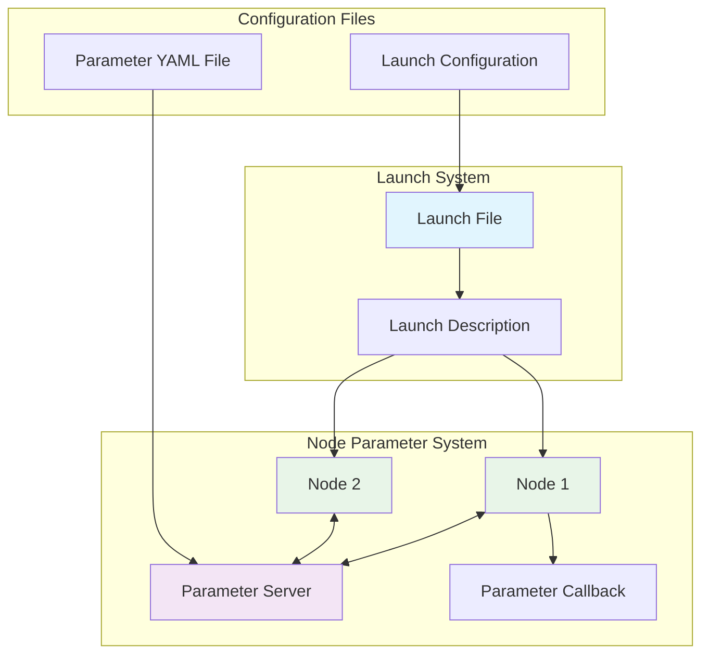

import Tabs from '@theme/Tabs';
import TabItem from '@theme/TabItem';
import Link from '@docusaurus/Link';

## Learning Outcomes

After completing this chapter, you will be able to:
1. Declare and use parameters in ROS 2 nodes
2. Implement parameter callbacks for dynamic reconfiguration
3. Create and use launch files to manage complex robot systems
4. Configure parameters through launch files
5. Implement node composition in launch files
6. Design parameter validation and error handling
7. Use parameter files (YAML) for configuration management
8. Debug parameter-related issues in ROS 2 systems

## Gherkin Specifications

### Scenario 1: Parameter Declaration
- **Given** a node that needs configurable behavior
- **When** parameters are properly declared
- **Then** the node can accept configuration from launch files or command line

### Scenario 2: Parameter Validation
- **Given** a node with parameter constraints
- **When** invalid parameter values are provided
- **Then** the node handles the error appropriately

### Scenario 3: Launch System Execution
- **Given** a robot system with multiple nodes
- **When** the launch file is executed
- **Then** all nodes start with correct parameters and dependencies

### Scenario 4: Dynamic Parameter Reconfiguration
- **Given** a running node with reconfigurable parameters
- **When** parameter values change during execution
- **Then** the node adapts its behavior accordingly

### Scenario 5: Parameter File Management
- **Given** multiple robots requiring similar configurations
- **When** parameter files are created and reused
- **Then** robot deployment becomes more efficient and consistent

## Theory & Intuition

Think of parameters in ROS 2 like the configuration knobs and switches on a complex electronic device. Just as you can adjust the volume, bass, and treble on an audio system without opening it up, ROS 2 parameters allow you to configure a robot system's behavior without recompiling code.

Launch systems are like the power strip and remote control for the entire robot. Rather than plugging in each component separately, a launch file allows you to start all the necessary nodes at once, with the right parameters, in the correct order, and with proper dependencies managed.

Parameters are especially valuable for settings that might change between different robots, environments, or use cases, such as sensor offsets, algorithm thresholds, or robot-specific dimensions. This makes your code more reusable and adaptable to different scenarios without code changes.

## Core Concepts

<Tabs
  defaultValue="diagram"
  values={[
    {label: 'Parameter and Launch Architecture', value: 'diagram'},
    {label: 'Parameter Types Table', value: 'table'},
  ]}>
  <TabItem value="diagram">



  </TabItem>
  <TabItem value="table">

| Parameter Type | Purpose | Example |
|----------------|---------|---------|
| Integer | Count or index values | Joint limits, timeout values |
| Double | Decimal values | Sensor offsets, gains |
| String | Text configuration | Robot names, file paths |
| Boolean | True/false switches | Enable/disable options |
| List | Multiple values | Joint names, color values |

  </TabItem>
</Tabs>

## Hands-On Labs

<Tabs
  defaultValue="lab1"
  values={[
    {label: 'Lab 1: Basic Parameter Usage', value: 'lab1'},
    {label: 'Lab 2: Launch File Creation', value: 'lab2'},
    {label: 'Lab 3: Parameter Files and Validation', value: 'lab3'},
  ]}>
  <TabItem value="lab1">

### Lab 1: Basic Parameter Usage

#### Objective
Create a node that uses parameters to configure its behavior.

#### Required Components
- ROS 2 environment
- Text editor
- Terminal access

#### Steps
1. Create a new package:
   ```bash
   cd ~/ros2_ws/src
   ros2 pkg create --build-type ament_python param_demo_pkg --dependencies rclpy std_msgs
   ```

2. Create the parameter node:
   ```bash
   nano ~/ros2_ws/src/param_demo_pkg/param_demo_pkg/param_node.py
   ```

3. Add the following code:
   ```python
   import rclpy
   from rclpy.node import Node
   from std_msgs.msg import String

   class ParamNode(Node):
       def __init__(self):
           super().__init__('param_node')
           
           # Declare parameters with default values
           self.declare_parameter('robot_name', 'default_robot')
           self.declare_parameter('max_velocity', 1.0)
           self.declare_parameter('safety_enabled', True)
           self.declare_parameter('joint_names', ['joint1', 'joint2', 'joint3'])
           
           # Get parameter values
           self.robot_name = self.get_parameter('robot_name').value
           self.max_velocity = self.get_parameter('max_velocity').value
           self.safety_enabled = self.get_parameter('safety_enabled').value
           self.joint_names = self.get_parameter('joint_names').value
           
           # Create publisher
           self.publisher = self.create_publisher(String, 'robot_status', 10)
           
           # Timer to publish status
           timer_period = 1.0
           self.timer = self.create_timer(timer_period, self.timer_callback)
           
           self.get_logger().info(
               f'Node initialized with: '
               f'robot_name={self.robot_name}, '
               f'max_velocity={self.max_velocity}, '
               f'safety_enabled={self.safety_enabled}, '
               f'joint_names={self.joint_names}'
           )

       def timer_callback(self):
           msg = String()
           status_msg = (
               f'Robot: {self.robot_name}, '
               f'Velocity Limit: {self.max_velocity}, '
               f'Safety: {"ON" if self.safety_enabled else "OFF"}, '
               f'Joints: {len(self.joint_names)}'
           )
           msg.data = status_msg
           self.publisher.publish(msg)
           self.get_logger().info(f'Published: {msg.data}')

   def main(args=None):
       rclpy.init(args=args)
       param_node = ParamNode()
       rclpy.spin(param_node)
       param_node.destroy_node()
       rclpy.shutdown()

   if __name__ == '__main__':
       main()
   ```

4. Make the file executable:
   ```bash
   chmod +x ~/ros2_ws/src/param_demo_pkg/param_demo_pkg/param_node.py
   ```

5. Build the package:
   ```bash
   cd ~/ros2_ws
   colcon build --packages-select param_demo_pkg
   source install/setup.bash
   ```

6. Run with default parameters:
   ```bash
   ros2 run param_demo_pkg param_node
   ```

7. Run with custom parameters:
   ```bash
   ros2 run param_demo_pkg param_node --ros-args -p robot_name:=my_robot -p max_velocity:=2.5 -p safety_enabled:=false
   ```

#### Expected Outcome
Node successfully running with configurable parameters that affect its behavior.

  </TabItem>
  <TabItem value="lab2">

### Lab 2: Launch File Creation

#### Objective
Create a launch file to start multiple nodes with parameters.

#### Required Components
- ROS 2 environment
- Text editor
- Terminal access
- The param_demo_pkg from Lab 1

#### Steps
1. Create a launch file directory:
   ```bash
   mkdir -p ~/ros2_ws/src/param_demo_pkg/launch
   ```

2. Create the launch file:
   ```bash
   nano ~/ros2_ws/src/param_demo_pkg/launch/robot_system.launch.py
   ```

3. Add the following code:
   ```python
   from launch import LaunchDescription
   from launch.actions import DeclareLaunchArgument
   from launch.substitutions import LaunchConfiguration
   from launch_ros.actions import Node

   def generate_launch_description():
       # Declare launch arguments
       robot_name_arg = DeclareLaunchArgument(
           'robot_name',
           default_value='default_robot',
           description='Robot name'
       )
       
       max_velocity_arg = DeclareLaunchArgument(
           'max_velocity',
           default_value='1.0',
           description='Maximum velocity for the robot'
       )
       
       safety_enabled_arg = DeclareLaunchArgument(
           'safety_enabled',
           default_value='true',
           description='Enable safety features'
       )
       
       # Get launch configurations
       robot_name = LaunchConfiguration('robot_name')
       max_velocity = LaunchConfiguration('max_velocity')
       safety_enabled = LaunchConfiguration('safety_enabled')
       
       # Create the robot node
       robot_node = Node(
           package='param_demo_pkg',
           executable='param_node',  # Note: executable name matches entry point
           name='robot_node',
           parameters=[
               {
                   'robot_name': robot_name,
                   'max_velocity': max_velocity,
                   'safety_enabled': safety_enabled,
                   'joint_names': ['base_joint', 'shoulder_joint', 'elbow_joint']
               }
           ],
           output='screen'
       )
       
       # Add another node with different parameters
       second_robot_node = Node(
           package='param_demo_pkg',
           executable='param_node',
           name='second_robot_node',
           parameters=[
               {
                   'robot_name': 'second_robot',
                   'max_velocity': 0.5,
                   'safety_enabled': True,
                   'joint_names': ['joint_a', 'joint_b']
               }
           ],
           output='screen'
       )
       
       return LaunchDescription([
           robot_name_arg,
           max_velocity_arg,
           safety_enabled_arg,
           robot_node,
           second_robot_node
       ])
   ```

4. Update the package.xml to include launch files:
   ```bash
   nano ~/ros2_ws/src/param_demo_pkg/package.xml
   ```

5. Add these lines before the closing `</package>` tag:
   ```xml
   <export>
     <build_type>ament_python</build_type>
   </export>
   ```

6. Update setup.py to include the launch files:
   ```bash
   nano ~/ros2_ws/src/param_demo_pkg/setup.py
   ```

7. Update the data_files section:
   ```python
   import os
   from glob import glob
   from setuptools import setup

   package_name = 'param_demo_pkg'

   setup(
       name=package_name,
       version='0.0.0',
       packages=[package_name],
       data_files=[
           ('share/ament_index/resource_index/packages',
               ['resource/' + package_name]),
           ('share/' + package_name, ['package.xml']),
           # Include launch directory
           (os.path.join('share', package_name, 'launch'), glob('launch/*.launch.py')),
       ],
       install_requires=['setuptools'],
       zip_safe=True,
       maintainer='Your Name',
       maintainer_email='you@example.com',
       description='Parameter demonstration package',
       license='Apache License 2.0',
       tests_require=['pytest'],
       entry_points={
           'console_scripts': [
               'param_node = param_demo_pkg.param_node:main',
           ],
       },
   )
   ```

8. Build the package:
   ```bash
   cd ~/ros2_ws
   colcon build --packages-select param_demo_pkg
   source install/setup.bash
   ```

9. Run the launch file with default parameters:
   ```bash
   ros2 launch param_demo_pkg robot_system.launch.py
   ```

10. Run the launch file with custom parameters:
    ```bash
    ros2 launch param_demo_pkg robot_system.launch.py robot_name:=launch_robot max_velocity:=3.0
    ```

#### Expected Outcome
Launch file successfully starting multiple nodes with appropriate parameters.

  </TabItem>
  <TabItem value="lab3">

### Lab 3: Parameter Files and Validation

#### Objective
Use YAML parameter files for configuration and implement parameter callbacks.

#### Required Components
- ROS 2 environment
- Text editor
- Terminal access

#### Steps
1. Create a new package for parameter validation:
   ```bash
   cd ~/ros2_ws/src
   ros2 pkg create --build-type ament_python param_validation_pkg --dependencies rclpy std_msgs
   ```

2. Create the node with parameter validation and callbacks:
   ```bash
   nano ~/ros2_ws/src/param_validation_pkg/param_validation_pkg/validation_node.py
   ```

3. Add the following code:
   ```python
   import rclpy
   from rclpy.node import Node
   from rclpy.parameter import Parameter
   from std_msgs.msg import String

   class ValidationNode(Node):
       def __init__(self):
           super().__init__('validation_node')
           
           # Declare parameters with default values
           self.declare_parameter('robot_name', 'default_robot')
           self.declare_parameter('max_velocity', 1.0)
           self.declare_parameter('safety_enabled', True)
           self.declare_parameter('control_mode', 'velocity')  # velocity, position, effort
           
           # Register parameter callback
           self.add_on_set_parameters_callback(self.parameter_callback)
           
           # Initialize values
           self.max_velocity = self.get_parameter('max_velocity').value
           self.safety_enabled = self.get_parameter('safety_enabled').value
           self.control_mode = self.get_parameter('control_mode').value
           
           # Create publisher
           self.publisher = self.create_publisher(String, 'validation_status', 10)
           
           # Timer to publish status
           timer_period = 2.0
           self.timer = self.create_timer(timer_period, self.timer_callback)
           
           self.get_logger().info('Validation node initialized with parameters')

       def parameter_callback(self, params):
           """
           Callback function to validate parameters before they are set
           """
           successful = True
           reason = ''
           
           for param in params:
               if param.name == 'max_velocity':
                   if param.value > 5.0:
                       successful = False
                       reason = 'max_velocity cannot exceed 5.0'
                       self.get_logger().error(f'Invalid parameter value: {reason}')
                   elif param.value <= 0:
                       successful = False
                       reason = 'max_velocity must be positive'
                       self.get_logger().error(f'Invalid parameter value: {reason}')
                   else:
                       self.max_velocity = param.value
                       self.get_logger().info(f'Updated max_velocity to {param.value}')
                       
               elif param.name == 'control_mode':
                   valid_modes = ['velocity', 'position', 'effort']
                   if param.value not in valid_modes:
                       successful = False
                       reason = f'control_mode must be one of {valid_modes}'
                       self.get_logger().error(f'Invalid parameter value: {reason}')
                   else:
                       self.control_mode = param.value
                       self.get_logger().info(f'Updated control_mode to {param.value}')
                       
               elif param.name == 'safety_enabled':
                   self.safety_enabled = param.value
                   self.get_logger().info(f'Updated safety_enabled to {param.value}')
           return SetParametersResult(successful=successful, reason=reason)

       def timer_callback(self):
           msg = String()
           status_msg = (
               f'Validation Status: '
               f'Velocity Limit: {self.max_velocity}, '
               f'Safety: {"ON" if self.safety_enabled else "OFF"}, '
               f'Mode: {self.control_mode}'
           )
           msg.data = status_msg
           self.publisher.publish(msg)
           self.get_logger().info(f'Published: {msg.data}')

   def main(args=None):
       rclpy.init(args=args)
       validation_node = ValidationNode()
       rclpy.spin(validation_node)
       validation_node.destroy_node()
       rclpy.shutdown()

   # Import SetParametersResult at the module level
   from rclpy.parameter import Parameter
   from rclpy.node import Node
   from rcl_interfaces.msg import SetParametersResult

   # Re-define the callback with proper imports
   def parameter_callback(self, params):
       successful = True
       reason = ''
       
       for param in params:
           if param.name == 'max_velocity':
               if param.value > 5.0:
                   successful = False
                   reason = 'max_velocity cannot exceed 5.0'
                   self.get_logger().error(f'Invalid parameter value: {reason}')
               elif param.value <= 0:
                   successful = False
                   reason = 'max_velocity must be positive'
                   self.get_logger().error(f'Invalid parameter value: {reason}')
               else:
                   self.max_velocity = param.value
                   self.get_logger().info(f'Updated max_velocity to {param.value}')
                   
           elif param.name == 'control_mode':
               valid_modes = ['velocity', 'position', 'effort']
               if param.value not in valid_modes:
                   successful = False
                   reason = f'control_mode must be one of {valid_modes}'
                   self.get_logger().error(f'Invalid parameter value: {reason}')
               else:
                   self.control_mode = param.value
                   self.get_logger().info(f'Updated control_mode to {param.value}')
                   
           elif param.name == 'safety_enabled':
               self.safety_enabled = param.value
               self.get_logger().info(f'Updated safety_enabled to {param.value}')
       return SetParametersResult(successful=successful, reason=reason)

   # Patch the callback method
   ValidationNode.parameter_callback = parameter_callback


   if __name__ == '__main__':
       main()
   ```

4. We need to fix the code by properly defining the callback function. Let's create a corrected version:
   ```bash
   nano ~/ros2_ws/src/param_validation_pkg/param_validation_pkg/validation_node.py
   ```

5. Add the correct code:
   ```python
   import rclpy
   from rclpy.node import Node
   from rclpy.parameter import Parameter
   from rcl_interfaces.msg import SetParametersResult
   from std_msgs.msg import String

   class ValidationNode(Node):
       def __init__(self):
           super().__init__('validation_node')
           
           # Declare parameters with default values
           self.declare_parameter('robot_name', 'default_robot')
           self.declare_parameter('max_velocity', 1.0)
           self.declare_parameter('safety_enabled', True)
           self.declare_parameter('control_mode', 'velocity')  # velocity, position, effort
           
           # Initialize values
           self.max_velocity = self.get_parameter('max_velocity').value
           self.safety_enabled = self.get_parameter('safety_enabled').value
           self.control_mode = self.get_parameter('control_mode').value
           
           # Register parameter callback
           self.add_on_set_parameters_callback(self.parameter_callback)
           
           # Create publisher
           self.publisher = self.create_publisher(String, 'validation_status', 10)
           
           # Timer to publish status
           timer_period = 2.0
           self.timer = self.create_timer(timer_period, self.timer_callback)
           
           self.get_logger().info('Validation node initialized with parameters')

       def parameter_callback(self, params):
           """
           Callback function to validate parameters before they are set
           """
           successful = True
           reason = ''
           
           for param in params:
               if param.name == 'max_velocity':
                   if param.value > 5.0:
                       successful = False
                       reason = 'max_velocity cannot exceed 5.0'
                       self.get_logger().error(f'Invalid parameter value: {reason}')
                   elif param.value <= 0:
                       successful = False
                       reason = 'max_velocity must be positive'
                       self.get_logger().error(f'Invalid parameter value: {reason}')
                   else:
                       self.max_velocity = param.value
                       self.get_logger().info(f'Updated max_velocity to {param.value}')
                       
               elif param.name == 'control_mode':
                   valid_modes = ['velocity', 'position', 'effort']
                   if param.value not in valid_modes:
                       successful = False
                       reason = f'control_mode must be one of {valid_modes}'
                       self.get_logger().error(f'Invalid parameter value: {reason}')
                   else:
                       self.control_mode = param.value
                       self.get_logger().info(f'Updated control_mode to {param.value}')
                       
               elif param.name == 'safety_enabled':
                   self.safety_enabled = param.value
                   self.get_logger().info(f'Updated safety_enabled to {param.value}')
                   
           return SetParametersResult(successful=successful, reason=reason)

       def timer_callback(self):
           msg = String()
           status_msg = (
               f'Validation Status: '
               f'Velocity Limit: {self.max_velocity}, '
               f'Safety: {"ON" if self.safety_enabled else "OFF"}, '
               f'Mode: {self.control_mode}'
           )
           msg.data = status_msg
           self.publisher.publish(msg)
           self.get_logger().info(f'Published: {msg.data}')

   def main(args=None):
       rclpy.init(args=args)
       validation_node = ValidationNode()
       rclpy.spin(validation_node)
       validation_node.destroy_node()
       rclpy.shutdown()

   if __name__ == '__main__':
       main()
   ```

6. Create a parameter YAML file:
   ```bash
   mkdir -p ~/ros2_ws/src/param_validation_pkg/config
   nano ~/ros2_ws/src/param_validation_pkg/config/robot_params.yaml
   ```

7. Add the following configuration:
   ```yaml
   validation_node:
     ros__parameters:
       robot_name: "validated_robot"
       max_velocity: 2.5
       safety_enabled: true
       control_mode: "velocity"
   ```

8. Create a launch file that uses the parameter file:
   ```bash
   mkdir -p ~/ros2_ws/src/param_validation_pkg/launch
   nano ~/ros2_ws/src/param_validation_pkg/launch/param_validation.launch.py
   ```

9. Add the launch file content:
   ```python
   from launch import LaunchDescription
   from launch_ros.actions import Node
   from ament_index_python.packages import get_package_share_directory
   import os

   def generate_launch_description():
       # Get the package share directory
       pkg_share = get_package_share_directory('param_validation_pkg')
       param_file = os.path.join(pkg_share, 'config', 'robot_params.yaml')
       
       # Create the validation node with parameter file
       validation_node = Node(
           package='param_validation_pkg',
           executable='validation_node',
           name='validation_node',
           parameters=[param_file],
           output='screen'
       )
       
       return LaunchDescription([
           validation_node
       ])
   ```

10. Update setup.py to include config and launch files:
    ```bash
    nano ~/ros2_ws/src/param_validation_pkg/setup.py
    ```

11. Add the necessary data files:
    ```python
    import os
    from glob import glob
    from setuptools import setup

    package_name = 'param_validation_pkg'

    setup(
        name=package_name,
        version='0.0.0',
        packages=[package_name],
        data_files=[
            ('share/ament_index/resource_index/packages',
                ['resource/' + package_name]),
            ('share/' + package_name, ['package.xml']),
            # Include config directory
            (os.path.join('share', package_name, 'config'), glob('config/*.yaml')),
            # Include launch directory
            (os.path.join('share', package_name, 'launch'), glob('launch/*.launch.py')),
        ],
        install_requires=['setuptools'],
        zip_safe=True,
        maintainer='Your Name',
        maintainer_email='you@example.com',
        description='Parameter validation demonstration package',
        license='Apache License 2.0',
        tests_require=['pytest'],
        entry_points={
            'console_scripts': [
                'validation_node = param_validation_pkg.validation_node:main',
            ],
        },
    )
    ```

12. Make the Python file executable:
    ```bash
    chmod +x ~/ros2_ws/src/param_validation_pkg/param_validation_pkg/validation_node.py
    ```

13. Build the package:
    ```bash
    cd ~/ros2_ws
    colcon build --packages-select param_validation_pkg
    source install/setup.bash
    ```

14. Test setting parameters at runtime:
    ```bash
    # Terminal 1: Start the validation node
    ros2 run param_validation_pkg validation_node
    
    # Terminal 2: Try to set a valid parameter
    ros2 param set /validation_node max_velocity 3.0
    
    # Terminal 3: Try to set an invalid parameter (should be rejected)
    ros2 param set /validation_node max_velocity 10.0
    ```

15. Run the launch file with the parameter file:
    ```bash
    ros2 launch param_validation_pkg param_validation.launch.py
    ```

#### Expected Outcome
Node successfully validates parameters using callbacks and loads configurations from YAML files.

  </TabItem>
</Tabs>

## Sim-to-Real Notes

- **Hardware considerations**: When using parameters with real hardware, ensure that velocity limits and other safety-related parameters are set appropriately for the physical robot
- **Differences from simulation**: Real robots may have more stringent parameter restrictions due to physical limitations
- **Practical tips**: Use parameter files to store robot-specific configurations that can be reused across different runs

## Multiple Choice Questions

1. How do you declare a parameter in a ROS 2 node?
   - A) self.declare_param('name', default_value)
   - B) self.set_parameter('name', default_value)
   - C) self.declare_parameter('name', default_value)
   - D) parameter = Parameter('name', default_value)

   **Correct Answer: C** - self.declare_parameter('name', default_value) is the correct method.

2. What command is used to list parameters of a running node?
   - A) ros2 param show /node_name
   - B) ros2 param list /node_name
   - C) ros2 show params /node_name
   - D) ros2 list /node_name params

   **Correct Answer: A** - ros2 param list /node_name shows parameters of a node.

3. How do you get a parameter value in ROS 2?
   - A) self.get_param('param_name')
   - B) self.get_parameter('param_name').value
   - C) self.read_parameter('param_name')
   - D) param = Parameter('param_name')

   **Correct Answer: B** - self.get_parameter('param_name').value is the correct method.

4. What is the purpose of add_on_set_parameters_callback()?
   - A) To get parameter values
   - B) To validate parameters before they are set
   - C) To declare new parameters
   - D) To reset parameters

   **Correct Answer: B** - It allows validation of parameters before they are set in the node.

5. Which launch action is used to declare arguments in a launch file?
   - A) DeclareArgument
   - B) LaunchArgument
   - C) DeclareLaunchArgument
   - D) ArgDeclaration

   **Correct Answer: C** - DeclareLaunchArgument is used to declare arguments in a launch file.

6. How do you pass parameters to a node in a launch file?
   - A) Using the args property
   - B) Using the parameters property with a list or dict
   - C) Using parameter_server configuration
   - D) Parameters cannot be passed in launch files

   **Correct Answer: B** - Using the parameters property with a list or dictionary.

7. What is the correct file extension for ROS 2 launch files?
   - A) .launch
   - B) .xml
   - C) .launch.py
   - D) .py

   **Correct Answer: C** - ROS 2 launch files use the .launch.py extension.

8. Which command is used to set a parameter on a running node?
   - A) ros2 set param /node_name param_name value
   - B) ros2 param set /node_name param_name value
   - C) ros2 change param /node_name param_name value
   - D) ros2 param update /node_name param_name value

   **Correct Answer: B** - ros2 param set /node_name param_name value is the correct command.

9. What is the recommended approach for storing complex configurations in ROS 2?
   - A) Hard code them in the source
   - B) Use environment variables
   - C) Use YAML parameter files
   - D) Store in database files

   **Correct Answer: C** - YAML parameter files are recommended for complex configurations.

10. Which launch substitution allows access to launch arguments in a launch file?
    - A) LaunchVariable
    - B) LaunchArgument
    - C) LaunchConfiguration
    - D) ArgumentValue

    **Correct Answer: C** - LaunchConfiguration allows access to launch arguments.

11. How can you check the current value of a parameter?
    - A) ros2 param get /node_name param_name
    - B) ros2 param show /node_name param_name
    - C) ros2 get param /node_name param_name
    - D) ros2 param read /node_name param_name

    **Correct Answer: A** - ros2 param get /node_name param_name retrieves the parameter value.

12. What is the purpose of parameter callbacks in ROS 2?
    - A) To trigger when parameters are declared
    - B) To validate or react when parameter values change
    - C) To reset parameters to defaults
    - D) To delete parameters

    **Correct Answer: B** - Parameter callbacks validate or react when parameter values change.

13. In a launch file, how can you conditionally include a node?
    - A) Using if-else statements
    - B) Using the condition attribute on launch actions
    - C) Launch files don't support conditional inclusion
    - D) Using parameter checks

    **Correct Answer: B** - Using the condition attribute on launch actions allows conditional inclusion.

14. What is the proper way to handle invalid parameter values?
    - A) Ignore the new value silently
    - B) Accept the value but issue a warning
    - C) Reject the parameter change using SetParametersResult
    - D) Restart the node

    **Correct Answer: C** - Use SetParametersResult to reject invalid parameter changes.

15. What is the advantage of using launch files over individual node execution?
    - A) Faster execution
    - B) Better security
    - C) Easier management of multiple nodes with proper configuration
    - D) Reduced memory usage

    **Correct Answer: C** - Launch files make it easier to manage multiple nodes with proper configuration and dependencies.

## Further Reading

1. [ROS 2 Parameters Documentation](https://docs.ros.org/en/humble/How-To-Guides/Using-Parameters-in-a-class-CPP.html) - Official guide on using parameters
2. [Launch System Guide](https://docs.ros.org/en/humble/How-To-Guides/Launch-system.html) - Comprehensive guide on ROS 2 launch system
3. [Parameter Validation](https://docs.ros.org/en/humble/Tutorials/Beginner-Client-Libraries/Parameter-Validation.html) - Tutorial on validating parameters
4. [Launch File Examples](https://github.com/ros2/launch/tree/humble/launch_testing/examples) - Example launch files
5. [Configuring Nodes with YAML](https://docs.ros.org/en/humble/Tutorials/Beginner-CLI-Tools/Configuring-ROS2-Environment.html#parameter-files) - Using YAML for parameter configuration
6. [ROS 2 Launch Actions](https://docs.ros.org/en/humble/How-To-Guides/Launch-file-different-formats.html) - Reference for launch actions

## Chapter Navigation

<div class="pagination-nav">
  <div class="pagination-nav__item pagination-nav__item--prev">
    <Link className="pagination-nav__link" to="/modules/module-1-ros/chapter-4-services-actions/">
      <div className="pagination-nav__sublabel">Previous</div>
      <div className="pagination-nav__label">← Chapter 4: Services and Actions</div>
    </Link>
  </div>
  <div class="pagination-nav__item pagination-nav__item--next">
    <Link className="pagination-nav__link" to="/modules/module-1-ros/chapter-6-packages-build/">
      <div className="pagination-nav__sublabel">Next</div>
      <div className="pagination-nav__label">Chapter 6: ROS 2 Packages and Build System →</div>
    </Link>
  </div>
</div>