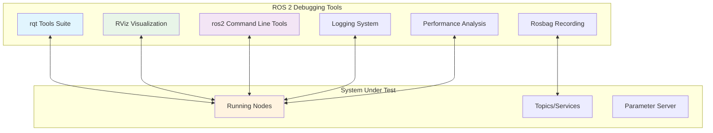

import Tabs from '@theme/Tabs';
import TabItem from '@theme/TabItem';
import Link from '@docusaurus/Link';

## Learning Outcomes

After completing this chapter, you will be able to:
1. Use rqt tools for real-time visualization and debugging of ROS 2 systems
2. Employ ros2 command-line tools for system introspection and debugging
3. Utilize RViz for 3D visualization of robot data and simulation
4. Implement proper logging practices in ROS 2 nodes
5. Profile ROS 2 applications for performance optimization
6. Use rosbag for recording and replaying ROS 2 data
7. Debug common communication and timing issues in ROS 2
8. Create custom visualization plugins for specialized applications

## Gherkin Specifications

### Scenario 1: System Visualization
- **Given** a running ROS 2 system with multiple nodes
- **When** rqt or RViz is used to visualize the system
- **Then** the system state is clearly displayed for debugging

### Scenario 2: Topic Inspection
- **Given** a ROS 2 system with active topics
- **When** ros2 topic tools are used to inspect messages
- **Then** the content and characteristics of topics are revealed

### Scenario 3: Performance Profiling
- **Given** a ROS 2 application with potential performance issues
- **When** profiling tools are applied
- **Then** bottlenecks and inefficiencies are identified

### Scenario 4: Data Recording and Playback
- **Given** a ROS 2 system with data to be analyzed
- **When** rosbag is used to record and replay data
- **Then** developers can analyze system behavior offline

### Scenario 5: Error Diagnosis
- **Given** a malfunctioning ROS 2 node or system
- **When** appropriate debugging tools are applied
- **Then** the root cause of issues is identified efficiently

## Theory & Intuition

Think of ROS 2 debugging and visualization tools like the dashboard and diagnostic systems in a modern car. Just as a car dashboard shows you the engine RPM, speed, fuel level, and potential issues, ROS 2 tools provide visibility into the state and health of your robot system.

The rqt tools are like the various gauges on a car dashboard - they each show different aspects of the system's operation in real-time. RViz is like a GPS navigation system that gives you a visual representation of where your robot is in its environment. Rosbag is like a flight data recorder that captures everything that happened during a flight for later analysis.

Just as professional mechanics use sophisticated diagnostic tools to identify issues that aren't visible to the naked eye, ROS 2 provides tools to peer into the complex interactions between nodes, messages, and system performance.

## Core Concepts

<Tabs
  defaultValue="diagram"
  values={[
    {label: 'Debugging Tool Ecosystem', value: 'diagram'},
    {label: 'Tool Categories Table', value: 'table'},
  ]}>
  <TabItem value="diagram">



  </TabItem>
  <TabItem value="table">

| Tool Category | Purpose | Common Tools |
|---------------|---------|--------------|
| Visualization | 3D/2D data display | RViz, rqt_plot |
| System Info | Node/topic inspection | ros2 node, ros2 topic |
| Recording | Data capture & playback | rosbag |
| Monitoring | Real-time metrics | rqt_graph, rqt_plot |
| Logging | Message recording | RCL logging |
| Profiling | Performance analysis | ros2 doctor, custom tools |

  </TabItem>
</Tabs>

## Hands-On Labs

<Tabs
  defaultValue="lab1"
  values={[
    {label: 'Lab 1: Using rqt for System Visualization', value: 'lab1'},
    {label: 'Lab 2: Command-Line Tools and Rosbag', value: 'lab2'},
    {label: 'Lab 3: RViz for 3D Visualization', value: 'lab3'},
  ]}>
  <TabItem value="lab1">

### Lab 1: Using rqt for System Visualization

#### Objective
Use rqt tools to visualize and debug a running ROS 2 system.

#### Required Components
- ROS 2 environment with rqt installed
- Text editor
- Terminal access

#### Steps
1. Check if rqt is installed:
   ```bash
   # This should be pre-installed with ROS 2 desktop
   ros2 pkg list | grep rqt
   ```

2. Create a simple system to visualize:
   ```bash
   cd ~/ros2_ws/src
   ros2 pkg create --build-type ament_python visualization_demo_pkg --dependencies rclpy std_msgs geometry_msgs
   ```

3. Create a node that publishes various types of data:
   ```bash
   nano ~/ros2_ws/src/visualization_demo_pkg/visualization_demo_pkg/debug_node.py
   ```

4. Add the following code:
   ```python
   import rclpy
   from rclpy.node import Node
   from std_msgs.msg import String, Float64, Int32
   from geometry_msgs.msg import Twist, PointStamped
   import math
   import time

   class DebugNode(Node):
       def __init__(self):
           super().__init__('debug_node')
           
           # Publishers for different message types
           self.string_pub = self.create_publisher(String, 'debug_string', 10)
           self.float_pub = self.create_publisher(Float64, 'debug_float', 10)
           self.int_pub = self.create_publisher(Int32, 'debug_int', 10)
           self.twist_pub = self.create_publisher(Twist, 'cmd_vel', 10)
           self.point_pub = self.create_publisher(PointStamped, 'debug_point', 10)
           
           # Timer to publish data
           timer_period = 0.1  # seconds (10 Hz)
           self.timer = self.create_timer(timer_period, self.timer_callback)
           
           self.counter = 0
           self.get_logger().info('Debug node initialized')

       def timer_callback(self):
           # Publish string message
           str_msg = String()
           str_msg.data = f'Debug message #{self.counter}'
           self.string_pub.publish(str_msg)
           
           # Publish float message (oscillating)
           float_msg = Float64()
           float_msg.data = math.sin(self.counter * 0.1) * 10.0
           self.float_pub.publish(float_msg)
           
           # Publish integer message
           int_msg = Int32()
           int_msg.data = self.counter
           self.int_pub.publish(int_msg)
           
           # Publish twist message
           twist_msg = Twist()
           twist_msg.linear.x = math.sin(self.counter * 0.1) * 0.5
           twist_msg.angular.z = math.cos(self.counter * 0.1) * 0.3
           self.twist_pub.publish(twist_msg)
           
           # Publish pointStamped message
           point_msg = PointStamped()
           point_msg.header.stamp = self.get_clock().now().to_msg()
           point_msg.header.frame_id = 'base_link'
           point_msg.point.x = math.sin(self.counter * 0.05) * 2.0
           point_msg.point.y = math.cos(self.counter * 0.05) * 2.0
           point_msg.point.z = 0.0
           self.point_pub.publish(point_msg)
           
           self.counter += 1

   def main(args=None):
       rclpy.init(args=args)
       debug_node = DebugNode()
       rclpy.spin(debug_node)
       debug_node.destroy_node()
       rclpy.shutdown()

   if __name__ == '__main__':
       main()
   ```

5. Make the file executable and update setup.py:
   ```bash
   chmod +x ~/ros2_ws/src/visualization_demo_pkg/visualization_demo_pkg/debug_node.py
   nano ~/ros2_ws/src/visualization_demo_pkg/setup.py
   ```

6. Update setup.py:
   ```python
   from setuptools import setup

   package_name = 'visualization_demo_pkg'

   setup(
       name=package_name,
       version='0.0.0',
       packages=[package_name],
       data_files=[
           ('share/ament_index/resource_index/packages',
               ['resource/' + package_name]),
           ('share/' + package_name, ['package.xml']),
       ],
       install_requires=['setuptools'],
       zip_safe=True,
       maintainer='Your Name',
       maintainer_email='you@example.com',
       description='Package for visualization debugging',
       license='Apache-2.0',
       tests_require=['pytest'],
       entry_points={
           'console_scripts': [
               'debug_node = visualization_demo_pkg.debug_node:main',
           ],
       },
   )
   ```

7. Build the package:
   ```bash
   cd ~/ros2_ws
   colcon build --packages-select visualization_demo_pkg
   source install/setup.bash
   ```

8. Run the debug node in one terminal:
   ```bash
   ros2 run visualization_demo_pkg debug_node
   ```

9. In another terminal, start rqt:
   ```bash
   rqt
   ```

10. In the rqt interface:
    - Go to Plugins > Introspection > Node Graph to see the node connections
    - Go to Plugins > Visualization > Topic Monitor to monitor topics
    - Go to Plugins > Data Visualization > Plot to plot the debug_float topic
    - Go to Plugins > Introspection > Service Caller to call services
    - Go to Plugins > Logging > Logger Level to adjust logging levels

11. Use rqt_plot to visualize the float value:
    ```bash
    rqt_plot /debug_float
    ```

12. Use rqt_graph to visualize the system:
    ```bash
    rqt_graph
    ```

#### Expected Outcome
Various rqt tools successfully visualizing the published data from the debug node.

  </TabItem>
  <TabItem value="lab2">

### Lab 2: Command-Line Tools and Rosbag

#### Objective
Use ROS 2 command-line tools for system inspection and rosbag for recording/replay.

#### Required Components
- ROS 2 environment
- Terminal access
- The debug node from Lab 1

#### Steps
1. Start the debug node (from Lab 1) in one terminal:
   ```bash
   ros2 run visualization_demo_pkg debug_node
   ```

2. In another terminal, use various command-line tools:
   ```bash
   # List all active nodes
   ros2 node list
   
   # List all active topics
   ros2 topic list
   
   # Get info about a specific topic
   ros2 topic info /debug_float
   
   # Echo messages from a topic
   ros2 topic echo /debug_string
   
   # Check the type of a topic
   ros2 topic type /cmd_vel
   
   # List all services
   ros2 service list
   
   # Get info about parameters
   ros2 param list /debug_node  # Replace with actual node name if different
   ```

3. Record data with rosbag:
   ```bash
   # Create a directory for bags
   mkdir -p ~/ros2_ws/bags
   
   # Record all topics for 10 seconds
   cd ~/ros2_ws/bags
   ros2 bag record -a -d 10 --output debug_demo_bag
   ```

4. Wait for the recording to complete, then check the recorded data:
   ```bash
   # List contents of the bag
   ros2 bag info debug_demo_bag_0.db3
   
   # Play back the recorded data
   ros2 bag play debug_demo_bag
   ```

5. Record specific topics:
   ```bash
   # Record specific topics only
   ros2 bag record /debug_string /debug_float /cmd_vel --output specific_topics_bag
   ```

6. Use ros2 doctor for system diagnostics:
   ```bash
   ros2 doctor
   ros2 doctor --report
   ```

7. Use ros2 lifecycle to check lifecycle nodes (if applicable):
   ```bash
   ros2 lifecycle nodes
   ```

8. Perform detailed topic analysis:
   ```bash
   # Get the rate of messages on a topic
   ros2 topic hz /debug_string
   
   # Echo with more detailed output
   ros2 topic echo /debug_point --field point
   ```

#### Expected Outcome
Successful use of command-line tools for system introspection and rosbag for data recording/replay.

  </TabItem>
  <TabItem value="lab3">

### Lab 3: RViz for 3D Visualization

#### Objective
Use RViz to visualize robot data and simulation environments.

#### Required Components
- ROS 2 environment with RViz
- The debug node from Lab 1
- Terminal access

#### Steps
1. Make sure the debug node from Lab 1 is still running:
   ```bash
   ros2 run visualization_demo_pkg debug_node
   ```

2. Install robot descriptions if not already available:
   ```bash
   # This package contains basic robot models
   sudo apt update
   sudo apt install ros-humble-joint-state-publisher ros-humble-robot-state-publisher
   ```

3. Launch RViz:
   ```bash
   rviz2
   ```

4. In RViz, set up a basic configuration:
   - Change the Fixed Frame to "odom" or "map" (we'll create a transform later)
   - Add displays using the "+" button in the Displays panel:
     - Add a "TF" display to show transforms
     - Add a "PointStamped" display to show our debug point
     - Add a "Marker" display for custom markers
     - Add a "RobotModel" display if you have a robot description

5. Create a simple transform publisher to create the necessary frames:
   ```bash
   cd ~/ros2_ws/src
   ros2 pkg create --build-type ament_python transform_demo_pkg --dependencies rclpy tf2_ros geometry_msgs
   ```

6. Create a transform publisher node:
   ```bash
   nano ~/ros2_ws/src/transform_demo_pkg/transform_demo_pkg/tf_publisher.py
   ```

7. Add the following code:
   ```python
   import rclpy
   from rclpy.node import Node
   from tf2_ros import TransformBroadcaster
   from geometry_msgs.msg import TransformStamped
   import math

   class StaticFramePublisher(Node):
       def __init__(self):
           super().__init__('static_tf2_broadcaster')
           
           # Declare and acquire the frame_id parameter
           self.declare_parameter('x', 0.0)
           self.declare_parameter('y', 0.0)
           self.declare_parameter('z', 0.0)
           self.declare_parameter('roll', 0.0)
           self.declare_parameter('pitch', 0.0)
           self.declare_parameter('yaw', 0.0)
           
           # Create a transform broadcaster
           self.tf_broadcaster = TransformBroadcaster(self)
           
           # Publish the transform periodically
           self.timer = self.create_timer(0.1, self.publish_transform)
           
           self.get_logger().info('TF publisher initialized')

       def publish_transform(self):
           # Read parameters
           x = self.get_parameter('x').get_parameter_value().double_value
           y = self.get_parameter('y').get_parameter_value().double_value
           z = self.get_parameter('z').get_parameter_value().double_value
           roll = self.get_parameter('roll').get_parameter_value().double_value
           pitch = self.get_parameter('pitch').get_parameter_value().double_value
           yaw = self.get_parameter('yaw').get_parameter_value().double_value
           
           # Create the tansform
           t = TransformStamped()
           
           # Set the timestamp
           t.header.stamp = self.get_clock().now().to_msg()
           
           # Set the frame IDs
           t.header.frame_id = 'odom'
           t.child_frame_id = 'base_link'
           
           # Set the translation
           t.transform.translation.x = x
           t.transform.translation.y = y
           t.transform.translation.z = z
           
           # Set the rotation using roll, pitch, yaw
           from tf2_ros import TransformBroadcaster
           from geometry_msgs.msg import TransformStamped
           import math
           
           # Calculate quaternion from roll, pitch, yaw
           cy = math.cos(yaw * 0.5)
           sy = math.sin(yaw * 0.5)
           cp = math.cos(pitch * 0.5)
           sp = math.sin(pitch * 0.5)
           cr = math.cos(roll * 0.5)
           sr = math.sin(roll * 0.5)
           
           t.transform.rotation.w = cr * cp * cy + sr * sp * sy
           t.transform.rotation.x = sr * cp * cy - cr * sp * sy
           t.transform.rotation.y = cr * sp * cy + sr * cp * sy
           t.transform.rotation.z = cr * cp * sy - sr * sp * cy
           
           # Send the transform
           self.tf_broadcaster.sendTransform(t)

   def main(args=None):
       rclpy.init(args=args)
       node = StaticFramePublisher()
       try:
           rclpy.spin(node)
       except KeyboardInterrupt:
           pass
       
       node.destroy_node()
       rclpy.shutdown()

   if __name__ == '__main__':
       main()
   ```

8. Actually, let's fix the transform publisher code:
   ```bash
   nano ~/ros2_ws/src/transform_demo_pkg/transform_demo_pkg/tf_publisher.py
   ```

9. Add the correct code:
   ```python
   import rclpy
   from rclpy.node import Node
   from tf2_ros import TransformBroadcaster
   from geometry_msgs.msg import TransformStamped
   import math

   class StaticFramePublisher(Node):
       def __init__(self):
           super().__init__('static_tf2_broadcaster')
           
           # Create a transform broadcaster
           self.tf_broadcaster = TransformBroadcaster(self)
           
           # Publish the transform periodically
           self.timer = self.create_timer(0.1, self.publish_transform)
           
           self.get_logger().info('TF publisher initialized')

       def publish_transform(self):
           # Create the transform
           t = TransformStamped()
           
           # Set the timestamp
           t.header.stamp = self.get_clock().now().to_msg()
           
           # Set the frame IDs
           t.header.frame_id = 'odom'
           t.child_frame_id = 'base_link'
           
           # Set the translation (position of base_link relative to odom)
           t.transform.translation.x = 0.0
           t.transform.translation.y = 0.0
           t.transform.translation.z = 0.0
           
           # Set the rotation (for now, no rotation)
           t.transform.rotation.w = 1.0
           t.transform.rotation.x = 0.0
           t.transform.rotation.y = 0.0
           t.transform.rotation.z = 0.0
           
           # Send the transform
           self.tf_broadcaster.sendTransform(t)

   def main(args=None):
       rclpy.init(args=args)
       node = StaticFramePublisher()
       try:
           rclpy.spin(node)
       except KeyboardInterrupt:
           pass
       
       node.destroy_node()
       rclpy.shutdown()

   if __name__ == '__main__':
       main()
   ```

10. Make the file executable and update setup.py:
    ```bash
    chmod +x ~/ros2_ws/src/transform_demo_pkg/transform_demo_pkg/tf_publisher.py
    nano ~/ros2_ws/src/transform_demo_pkg/setup.py
    ```

11. Update setup.py:
    ```python
    from setuptools import setup

    package_name = 'transform_demo_pkg'

    setup(
        name=package_name,
        version='0.0.0',
        packages=[package_name],
        data_files=[
            ('share/ament_index/resource_index/packages',
                ['resource/' + package_name]),
            ('share/' + package_name, ['package.xml']),
        ],
        install_requires=['setuptools'],
        zip_safe=True,
        maintainer='Your Name',
        maintainer_email='you@example.com',
        description='TF publisher for visualization demo',
        license='Apache-2.0',
        tests_require=['pytest'],
        entry_points={
            'console_scripts': [
                'tf_publisher = transform_demo_pkg.tf_publisher:main',
            ],
        },
    )
    ```

12. Update package.xml:
    ```bash
    nano ~/ros2_ws/src/transform_demo_pkg/package.xml
    ```

13. Add dependencies:
    ```xml
    <?xml version="1.0"?>
    <?xml-model href="http://download.ros.org/schema/package_format3.xsd" schematypens="http://www.w3.org/2001/XMLSchema"?>
    <package format="3">
      <name>transform_demo_pkg</name>
      <version>0.0.0</version>
      <description>TF publisher for visualization demo</description>
      <maintainer email="you@example.com">Your Name</maintainer>
      <license>Apache-2.0</license>

      <depend>rclpy</depend>
      <depend>tf2_ros</depend>
      <depend>geometry_msgs</depend>

      <test_depend>ament_copyright</test_depend>
      <test_depend>ament_flake8</test_depend>
      <test_depend>ament_pep257</test_depend>
      <test_depend>python3-pytest</test_depend>

      <export>
        <build_type>ament_python</build_type>
      </export>
    </package>
    ```

14. Build the package:
    ```bash
    cd ~/ros2_ws
    colcon build --packages-select transform_demo_pkg
    source install/setup.bash
    ```

15. Run the TF publisher in a new terminal:
    ```bash
    ros2 run transform_demo_pkg tf_publisher
    ```

16. In a third terminal, run RViz:
    ```bash
    rviz2
    ```

17. In RViz:
    - Change "Fixed Frame" to "odom"
    - Add a "PointStamped" display
      - Set Topic to "/debug_point"
    - Add a "TF" display to see the transform
    - Add a "Marker" display for future use
    - You should now see the point moving in 3D space based on the data from debug_node

18. Create a sample marker publisher to add more visualization:
    ```bash
    nano ~/ros2_ws/src/visualization_demo_pkg/visualization_demo_pkg/marker_publisher.py
    ```

19. Add the following code:
    ```python
    import rclpy
    from rclpy.node import Node
    from visualization_msgs.msg import Marker
    import math

    class MarkerPublisher(Node):
        def __init__(self):
            super().__init__('marker_publisher')
            
            self.publisher = self.create_publisher(Marker, 'debug_marker', 10)
            
            timer_period = 0.5  # seconds
            self.timer = self.create_timer(timer_period, self.timer_callback)
            
            self.marker_id = 0

        def timer_callback(self):
            marker = Marker()
            marker.header.frame_id = "base_link"
            marker.header.stamp = self.get_clock().now().to_msg()
            marker.ns = "debug"
            marker.id = self.marker_id
            marker.type = Marker.SPHERE
            marker.action = Marker.ADD
            
            # Position the marker in a circular pattern
            angle = self.marker_id * 0.3
            marker.pose.position.x = math.cos(angle) * 2.0
            marker.pose.position.y = math.sin(angle) * 2.0
            marker.pose.position.z = 0.0
            marker.pose.orientation.w = 1.0
            
            # Set the scale of the marker
            marker.scale.x = 0.2
            marker.scale.y = 0.2
            marker.scale.z = 0.2
            
            # Set the color (Red)
            marker.color.r = 1.0
            marker.color.g = 0.0
            marker.color.b = 0.0
            marker.color.a = 1.0  # Don't forget to set the alpha!
            
            marker.lifetime.sec = 5  # Marker will auto-delete after 5 seconds
            
            self.publisher.publish(marker)
            self.marker_id += 1

    def main(args=None):
        rclpy.init(args=args)
        marker_publisher = MarkerPublisher()
        rclpy.spin(marker_publisher)
        marker_publisher.destroy_node()
        rclpy.shutdown()

    if __name__ == '__main__':
        main()
    ```

20. Update setup.py to include this new executable:
    ```bash
    nano ~/ros2_ws/src/visualization_demo_pkg/setup.py
    ```

21. Add to entry_points:
    ```python
    entry_points={
        'console_scripts': [
            'debug_node = visualization_demo_pkg.debug_node:main',
            'marker_publisher = visualization_demo_pkg.marker_publisher:main',
        ],
    }
    ```

22. Make executable and rebuild:
    ```bash
    chmod +x ~/ros2_ws/src/visualization_demo_pkg/visualization_demo_pkg/marker_publisher.py
    cd ~/ros2_ws
    colcon build --packages-select visualization_demo_pkg
    source install/setup.bash
    ```

23. Run the marker publisher:
    ```bash
    ros2 run visualization_demo_pkg marker_publisher
    ```

24. In RViz, add a "Marker" display:
    - Set Topic to "/debug_marker"
    - You should see red spheres appearing in a circular pattern relative to the base_link frame

#### Expected Outcome
RViz successfully visualizing the robot's state, TF frames, PointStamped messages, and custom markers.

  </TabItem>
</Tabs>

## Sim-to-Real Notes

- **Hardware considerations**: When debugging real robots, logging and visualization should be used carefully to avoid affecting real-time performance
- **Differences from simulation**: Real robots may produce more intermittent data due to sensor noise or communication issues
- **Practical tips**: Use rosbag to record data from real robot runs for later analysis and debugging

## Multiple Choice Questions

1. What is the primary purpose of rqt?
   - A) To build ROS 2 packages
   - B) To provide graphical tools for visualization and debugging
   - C) To simulate robots
   - D) To manage dependencies

   **Correct Answer: B** - rqt provides graphical tools for visualization and debugging in ROS 2.

2. Which command shows all active topics in a ROS 2 system?
   - A) ros2 show topics
   - B) ros2 topic list
   - C) ros2 list topics
   - D) ros2 get topics

   **Correct Answer: B** - ros2 topic list shows all active topics.

3. What command is used to visualize the message rate on a topic?
   - A) ros2 topic rate /topic_name
   - B) ros2 topic hz /topic_name
   - C) ros2 hz /topic_name
   - D) ros2 topic freq /topic_name

   **Correct Answer: B** - ros2 topic hz /topic_name shows the message rate in Hz.

4. How do you record all topics to a bag file?
   - A) rosbag record /all
   - B) ros2 bag record -a
   - C) ros2 record --all
   - D) ros2 bag record *

   **Correct Answer: B** - ros2 bag record -a records all topics to a bag file.

5. Which tool provides 3D visualization of robot data in ROS 2?
   - A) rqt
   - B) rosplot
   - C) RViz
   - D) rosgui

   **Correct Answer: C** - RViz provides 3D visualization of robot data in ROS 2.

6. What is the purpose of the TF (Transform) system in ROS 2?
   - A) To manage network connections
   - B) To handle file transfers
   - C) To track relationships between coordinate frames
   - D) To manage topic communication

   **Correct Answer: C** - TF tracks relationships between coordinate frames.

7. Which command shows information about a specific node?
   - A) ros2 info /node_name
   - B) ros2 node info /node_name
   - C) ros2 show /node_name
   - D) ros2 get node /node_name

   **Correct Answer: B** - ros2 node info /node_name shows information about a specific node.

8. How do you view the content of a rosbag file?
   - A) ros2 bag view bag_name
   - B) ros2 bag show bag_name
   - C) ros2 bag info bag_name
   - D) ros2 info bag_name

   **Correct Answer: C** - ros2 bag info bag_name shows information about a bag file.

9. What does the ros2 doctor command do?
   - A) Repairs ROS 2 installations
   - B) Provides system diagnostics and health checks
   - C) Installs missing packages
   - D) Updates ROS 2 packages

   **Correct Answer: B** - ros2 doctor provides system diagnostics and health checks.

10. In RViz, what is a "Fixed Frame"?
    - A) A frame that cannot be changed
    - B) The reference coordinate frame for all displayed data
    - C) A frame that is always visible
    - D) A frame that stores fixed data

    **Correct Answer: B** - The "Fixed Frame" is the reference coordinate frame for all displayed data.

11. Which command displays the type of a topic?
    - A) ros2 show type /topic_name
    - B) ros2 type /topic_name
    - C) ros2 topic info /topic_name
    - D) ros2 topic type /topic_name

    **Correct Answer: D** - ros2 topic type /topic_name shows the type of a topic.

12. What is the purpose of the ros2 lifecycle commands?
    - A) To track the development process
    - B) To manage lifecycle nodes with explicit states
    - C) To monitor system performance
    - D) To handle package life cycles

    **Correct Answer: B** - ros2 lifecycle commands manage lifecycle nodes with explicit states.

13. How do you echo messages from a specific field of a complex message?
    - A) ros2 topic echo /topic_name field_name
    - B) ros2 topic echo /topic_name --field field_name
    - C) ros2 echo /topic_name field
    - D) ros2 topic show /topic_name field_name

    **Correct Answer: B** - ros2 topic echo /topic_name --field field_name echoes specific fields.

14. Which rqt plugin shows the computational graph of nodes and topics?
    - A) rqt_graph
    - B) rqt_nodes
    - C) rqt_top
    - D) rqt_console

    **Correct Answer: A** - rqt_graph shows the computational graph of nodes and topics.

15. What is the standard tool for creating custom visualization displays in RViz?
    - A) rqt plugins
    - B) RViz display plugins
    - C) ROS visualization tools
    - D) Both A and B

    **Correct Answer: D** - Both rqt plugins and RViz display plugins are used for custom visualization.

## Further Reading

1. [RViz User Guide](https://docs.ros.org/en/humble/Tutorials/Beginner-Client-Libraries/Using-Rviz.html) - Official guide to using RViz
2. [RQt Tools Documentation](https://wiki.ros.org/rqt) - Documentation for RQt tools
3. [Rosbag Guide](https://docs.ros.org/en/humble/Tutorials/Beginner-CLI-Tools/Recording-And-Playing-Back-Data.html) - Tutorial on using rosbag
4. [ROS 2 Command Line Tools](https://docs.ros.org/en/humble/Reference/Tools.html) - Reference for CLI tools
5. [TF2 Tutorials](https://docs.ros.org/en/humble/Tutorials/Intermediate/Tf2/index.html) - Tutorials for the transform library
6. [ROS 2 Logging](https://docs.ros.org/en/humble/Tutorials/Beginner-Client-Libraries/Logging-and-ROS2.html) - Guide to ROS 2 logging system

## Chapter Navigation

<div class="pagination-nav">
  <div class="pagination-nav__item pagination-nav__item--prev">
    <Link className="pagination-nav__link" to="/modules/module-1-ros/chapter-6-packages-build/">
      <div className="pagination-nav__sublabel">Previous</div>
      <div className="pagination-nav__label">← Chapter 6: ROS 2 Packages and Build System</div>
    </Link>
  </div>
  <div class="pagination-nav__item pagination-nav__item--next">
    <Link className="pagination-nav__link" to="/modules/module-2-simulation/chapter-8-gazebo-simulation/">
      <div className="pagination-nav__sublabel">Next</div>
      <div className="pagination-nav__label">Chapter 8: Gazebo Simulation Environment →</div>
    </Link>
  </div>
</div>