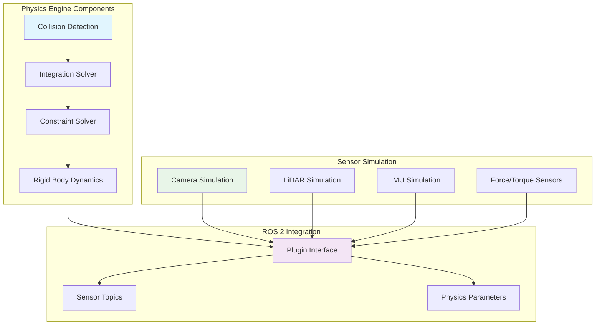

import Tabs from '@theme/Tabs';
import TabItem from '@theme/TabItem';

## Learning Outcomes

After completing this chapter, you will be able to:
1. Compare different physics engines (ODE, Bullet, DART) and their characteristics
2. Configure physics parameters for accurate simulation of robotic systems
3. Implement realistic sensor simulation with appropriate noise models
4. Tune collision detection and response parameters for performance
5. Create sensor fusion models in simulation environments
6. Debug physics-related issues in robot simulation
7. Optimize simulation performance while maintaining accuracy
8. Evaluate the differences between simulated and real sensor data

## Gherkin Specifications

### Scenario 1: Physics Engine Selection
- **Given** a robotic system with specific physics requirements
- **When** selecting an appropriate physics engine
- **Then** the simulation accurately reflects the expected physical behavior

### Scenario 2: Sensor Noise Modeling
- **Given** a robot with sensors in simulation
- **When** noise models are properly applied
- **Then** the simulated sensor data reflects real-world sensor characteristics

### Scenario 3: Collision Detection Tuning
- **Given** a simulation with complex geometries
- **When** collision parameters are optimized
- **Then** the simulation maintains performance and accuracy

### Scenario 4: Sensor Data Validation
- **Given** simulated sensor data from the robot
- **When** compared to real-world sensor data
- **Then** the differences are within acceptable tolerance levels

### Scenario 5: Performance Optimization
- **Given** a slow-running physics simulation
- **When** appropriate optimization techniques are applied
- **Then** the simulation runs faster while maintaining accuracy

## Theory & Intuition

Think of physics engines in robotics simulation like the "physics of reality" that govern how objects behave in the real world. Just as gravity pulls objects down, friction resists motion, and collisions transfer momentum in real life, physics engines in simulation enforce these same physical laws on virtual objects.

In the real world, when you drop a ball, it falls due to gravity, bounces based on its elasticity and the surface it hits, and eventually comes to rest due to friction and air resistance. Physics engines in simulation calculate these behaviors mathematically, solving equations of motion to determine how objects should move and interact.

For sensors, think of simulation as creating a "digital twin" of real sensors. A simulated camera doesn't actually "see" light but instead calculates what an image would look like based on the 3D models in the environment. Simulated LiDAR doesn't emit real laser pulses but instead calculates distances using ray tracing algorithms.

## Core Concepts

<Tabs
  defaultValue="diagram"
  values={[
    {label: 'Physics Engine Architecture', value: 'diagram'},
    {label: 'Physics Engine Comparison', value: 'table'},
  ]}>
  <TabItem value="diagram">



  </TabItem>
  <TabItem value="table">

| Physics Engine | Strengths | Weaknesses | Best Use Case |
|----------------|-----------|------------|---------------|
| ODE | Fast, stable | Limited constraints | Basic rigid body simulation |
| Bullet | Robust, feature-rich | Complex | Advanced collision detection |
| DART | Biomechanics focus | Steeper learning curve | Humanoid robotics |

  </TabItem>
</Tabs>

## Hands-On Labs

<Tabs
  defaultValue="lab1"
  values={[
    {label: 'Lab 1: Physics Engine Configuration', value: 'lab1'},
    {label: 'Lab 2: Sensor Noise Modeling', value: 'lab2'},
    {label: 'Lab 3: Sensor Fusion in Simulation', value: 'lab3'},
  ]}>
  <TabItem value="lab1">

### Lab 1: Physics Engine Configuration

#### Objective
Configure different physics engines and tune parameters for accurate simulation.

#### Required Components
- Gazebo simulation environment
- Robot model with multiple links and joints
- Text editor

#### Steps
1. Create a configuration file for physics parameters:
   ```bash
   mkdir -p ~/simulation_ws/config
   nano ~/simulation_ws/config/physics_config.world
   ```

2. Add the following world configuration with physics settings:
   ```xml
   <?xml version="1.0" ?>
   <sdf version="1.7">
     <world name="physics_demo">
       <!-- Include default atmosphere -->
       <include>
         <uri>model://ground_plane</uri>
       </include>
       <include>
         <uri>model://sun</uri>
       </include>

       <!-- Physics parameters -->
       <physics type="ode">
         <max_step_size>0.001</max_step_size>
         <real_time_factor>1.0</real_time_factor>
         <real_time_update_rate>1000</real_time_update_rate>
         <gravity>0 0 -9.8</gravity>
         <ode>
           <solver>
             <type>quick</type>
             <iters>10</iters>
             <sor>1.3</sor>
           </solver>
           <constraints>
             <cfm>0.0</cfm>
             <erp>0.2</erp>
             <contact_max_correcting_vel>100.0</contact_max_correcting_vel>
             <contact_surface_layer>0.001</contact_surface_layer>
           </constraints>
         </ode>
       </physics>

       <!-- A simple falling cube to test physics -->
       <model name="falling_cube">
         <pose>0 0 2 0 0 0</pose>
         <link name="link">
           <inertial>
             <mass>1.0</mass>
             <inertia>
               <ixx>0.166667</ixx>
               <ixy>0</ixy>
               <ixz>0</ixz>
               <iyy>0.166667</iyy>
               <iyz>0</iyz>
               <izz>0.166667</izz>
             </inertia>
           </inertial>
           <collision name="collision">
             <geometry>
               <box>
                 <size>0.2 0.2 0.2</size>
               </box>
             </geometry>
           </collision>
           <visual name="visual">
             <geometry>
               <box>
                 <size>0.2 0.2 0.2</size>
               </box>
             </geometry>
           </visual>
         </link>
       </model>

       <!-- A rolling ball to test friction -->
       <model name="rolling_ball">
         <pose>1 0 1 0 0 0</pose>
         <link name="link">
           <inertial>
             <mass>0.5</mass>
             <inertia>
               <ixx>0.01</ixx>
               <ixy>0</ixy>
               <ixz>0</ixz>
               <iyy>0.01</iyy>
               <iyz>0</iyz>
               <izz>0.01</izz>
             </inertia>
           </inertial>
           <collision name="collision">
             <geometry>
               <sphere>
                 <radius>0.1</radius>
               </sphere>
             </geometry>
             <surface>
               <friction>
                 <ode>
                   <mu>0.5</mu>
                   <mu2>0.5</mu2>
                 </ode>
               </friction>
             </surface>
           </collision>
           <visual name="visual">
             <geometry>
               <sphere>
                 <radius>0.1</radius>
               </sphere>
             </geometry>
           </visual>
         </link>
       </model>
     </world>
   </sdf>
   ```

3. Create a simple launch file to test the simulation:
   ```bash
   mkdir -p ~/simulation_ws/launch
   nano ~/simulation_ws/launch/physics_test.launch.py
   ```

4. Add the launch file content:
   ```python
   import os
   from launch import LaunchDescription
   from launch.actions import ExecuteProcess
   from ament_index_python.packages import get_package_share_directory

   def generate_launch_description():
       # Get world file path
       world_file = os.path.join(
           get_package_share_directory('simulation_practice_pkg'),
           'config', 'physics_config.world'
       )

       # Launch Gazebo with the world file
       gazebo_cmd = ExecuteProcess(
           cmd=['gazebo', world_file, '-s', 'libgazebo_ros_factory.so'],
           output='screen'
       )

       return LaunchDescription([
           gazebo_cmd
       ])
   ```

5. Launch the simulation and observe the physics behavior:
   ```bash
   # Source ROS 2 and launch
   source /opt/ros/humble/setup.bash
   gazebo ~/simulation_ws/config/physics_config.world
   ```

6. Adjust physics parameters to see their effects:
   - Try changing `max_step_size` to 0.01 (larger) and 0.0001 (smaller)
   - Modify `erp` (Error Reduction Parameter) and `cfm` (Constraint Force Mixing)
   - Experiment with different friction values (`mu`)

#### Expected Outcome
Different physics parameters producing different simulation behaviors with appropriate stability and accuracy.

  </TabItem>
  <TabItem value="lab2">

### Lab 2: Sensor Noise Modeling

#### Objective
Implement realistic sensor noise models for accurate simulation.

#### Required Components
- Gazebo with sensor plugins
- Robot model with sensors
- Text editor

#### Steps
1. Create a robot model with noisy sensors:
   ```bash
   nano ~/simulation_ws/models/noisy_sensors_robot.urdf
   ```

2. Add the URDF with noise models:
   ```xml
   <?xml version="1.0"?>
   <robot name="noisy_sensors_robot" xmlns:xacro="http://www.ros.org/wiki/xacro">
     <!-- Base link -->
     <link name="base_link">
       <inertial>
         <mass value="10.0"/>
         <inertia ixx="1.0" ixy="0.0" ixz="0.0" iyy="1.0" iyz="0.0" izz="1.0"/>
       </inertial>
       <visual>
         <geometry>
           <box size="0.5 0.5 0.2"/>
         </geometry>
       </visual>
       <collision>
         <geometry>
           <box size="0.5 0.5 0.2"/>
         </geometry>
       </collision>
     </link>

     <!-- Camera with noise -->
     <gazebo reference="base_link">
       <sensor name="noisy_camera" type="camera">
         <always_on>true</always_on>
         <visualize>true</visualize>
         <camera name="head">
           <horizontal_fov>1.047</horizontal_fov>
           <image>
             <width>640</width>
             <height>480</height>
             <format>R8G8B8</format>
           </image>
           <clip>
             <near>0.1</near>
             <far>300</far>
           </clip>
         </camera>
         <plugin name="camera_controller" filename="libgazebo_ros_camera.so">
           <frame_name>base_link</frame_name>
           <min_depth>0.1</min_depth>
           <max_depth>100</max_depth>
         </plugin>
         <!-- Add noise model -->
         <noise>
           <type>gaussian</type>
           <mean>0.0</mean>
           <stddev>0.007</stddev>
         </noise>
       </sensor>
     </gazebo>

     <!-- LiDAR with noise -->
     <gazebo reference="base_link">
       <sensor name="noisy_lidar" type="ray">
         <always_on>true</always_on>
         <visualize>true</visualize>
         <ray>
           <scan>
             <horizontal>
               <samples>720</samples>
               <resolution>1</resolution>
               <min_angle>-1.570796</min_angle>
               <max_angle>1.570796</max_angle>
             </horizontal>
           </scan>
           <range>
             <min>0.1</min>
             <max>30.0</max>
             <resolution>0.01</resolution>
           </range>
         </ray>
         <plugin name="lidar_controller" filename="libgazebo_ros_ray_sensor.so">
           <ros>
             <remapping>~/out:=scan</remapping>
           </ros>
           <output_type>sensor_msgs/LaserScan</output_type>
         </plugin>
         <!-- Add noise model -->
         <noise>
           <type>gaussian</type>
           <mean>0.0</mean>
           <stddev>0.01</stddev>
         </noise>
       </sensor>
     </gazebo>

     <!-- IMU with noise -->
     <gazebo reference="base_link">
       <sensor name="noisy_imu" type="imu">
         <always_on>true</always_on>
         <visualize>false</visualize>
         <update_rate>100</update_rate>
         <imu>
           <angular_velocity>
             <x>
               <noise type="gaussian">
                 <mean>0.0</mean>
                 <stddev>2e-4</stddev>
                 <bias_mean>0.1</bias_mean>
                 <bias_stddev>0.001</bias_stddev>
               </noise>
             </x>
             <y>
               <noise type="gaussian">
                 <mean>0.0</mean>
                 <stddev>2e-4</stddev>
                 <bias_mean>0.1</bias_mean>
                 <bias_stddev>0.001</bias_stddev>
               </noise>
             </y>
             <z>
               <noise type="gaussian">
                 <mean>0.0</mean>
                 <stddev>2e-4</stddev>
                 <bias_mean>0.1</bias_mean>
                 <bias_stddev>0.001</bias_stddev>
               </noise>
             </z>
           </angular_velocity>
           <linear_acceleration>
             <x>
               <noise type="gaussian">
                 <mean>0.0</mean>
                 <stddev>1.7e-2</stddev>
                 <bias_mean>0.1</bias_mean>
                 <bias_stddev>0.001</bias_stddev>
               </noise>
             </x>
             <y>
               <noise type="gaussian">
                 <mean>0.0</mean>
                 <stddev>1.7e-2</stddev>
                 <bias_mean>0.1</bias_mean>
                 <bias_stddev>0.001</bias_stddev>
               </noise>
             </y>
             <z>
               <noise type="gaussian">
                 <mean>0.0</mean>
                 <stddev>1.7e-2</stddev>
                 <bias_mean>0.1</bias_mean>
                 <bias_stddev>0.001</bias_stddev>
               </noise>
             </z>
           </linear_acceleration>
         </imu>
         <plugin name="imu_controller" filename="libgazebo_ros_imu_sensor.so">
           <ros>
             <remapping>~/out:=imu</remapping>
           </ros>
           <frame_name>base_link</frame_name>
         </plugin>
       </sensor>
     </gazebo>
   </robot>
   ```

3. Create a launch file for the noisy robot:
   ```bash
   nano ~/simulation_ws/launch/noisy_sensors.launch.py
   ```

4. Add the launch file content:
   ```python
   import os
   from launch import LaunchDescription
   from launch.actions import DeclareLaunchArgument, ExecuteProcess, TimerAction
   from launch.substitutions import LaunchConfiguration
   from launch_ros.actions import Node
   from ament_index_python.packages import get_package_share_directory

   def generate_launch_description():
       pkg_share = get_package_share_directory('simulation_practice_pkg')
       
       # Launch Gazebo
       start_gazebo_cmd = ExecuteProcess(
           cmd=['gazebo', '--verbose', '-s', 'libgazebo_ros_factory.so'],
           output='screen'
       )

       # Robot state publisher
       robot_state_publisher = Node(
           package='robot_state_publisher',
           executable='robot_state_publisher',
           parameters=[{
               'robot_description': open(os.path.join(pkg_share, 'models', 'noisy_sensors_robot.urdf')).read()
           }]
       )

       # Spawn robot
       spawn_robot_cmd = TimerAction(
           period=5.0,
           actions=[
               ExecuteProcess(
                   cmd=[
                       'ros2', 'run', 'gazebo_ros', 'spawn_entity.py',
                       '-entity', 'noisy_robot',
                       '-file', os.path.join(pkg_share, 'models', 'noisy_sensors_robot.urdf'),
                       '-x', '0', '-y', '0', '-z', '0.5'
                   ],
                   output='screen'
               )
           ]
       )

       # Create a node to visualize sensor data
       sensor_viewer = Node(
           package='rviz2',
           executable='rviz2',
           arguments=['-d', os.path.join(pkg_share, 'rviz', 'sensors_config.rviz')],
           output='screen'
       )

       return LaunchDescription([
           start_gazebo_cmd,
           robot_state_publisher,
           spawn_robot_cmd,
           sensor_viewer
       ])
   ```

5. Create a simple sensor subscriber to observe noise characteristics:
   ```bash
   mkdir -p ~/simulation_ws/src/sensor_analysis_pkg
   cd ~/simulation_ws/src/sensor_analysis_pkg
   ros2 pkg create --build-type ament_python sensor_analysis_pkg
   nano ~/simulation_ws/src/sensor_analysis_pkg/sensor_analysis_pkg/sensor_noise_analyzer.py
   ```

6. Add the noise analyzer code:
   ```python
   #!/usr/bin/env python3
   import rclpy
   from rclpy.node import Node
   from sensor_msgs.msg import LaserScan, Imu
   import statistics

   class SensorNoiseAnalyzer(Node):
       def __init__(self):
           super().__init__('sensor_noise_analyzer')
           
           # For LiDAR analysis
           self.scan_subscriber = self.create_subscription(
               LaserScan,
               '/noisy_robot/scan',
               self.scan_callback,
               10
           )
           
           # For IMU analysis
           self.imu_subscriber = self.create_subscription(
               Imu,
               '/noisy_robot/imu',
               self.imu_callback,
               10
           )
           
           # Data storage
           self.scan_ranges_samples = []
           self.linear_acceleration_samples = []
           
           # Timer to periodically analyze data
           self.timer = self.create_timer(5.0, self.analyze_data)

       def scan_callback(self, msg):
           # Collect range data for statistical analysis
           self.scan_ranges_samples.extend(list(msg.ranges)[:50])  # Sample first 50 ranges
           
           # Keep only recent samples
           if len(self.scan_ranges_samples) > 500:
               self.scan_ranges_samples = self.scan_ranges_samples[-500:]

       def imu_callback(self, msg):
           # Collect linear acceleration data for analysis
           acc_data = (
               msg.linear_acceleration.x,
               msg.linear_acceleration.y,
               msg.linear_acceleration.z
           )
           self.linear_acceleration_samples.append(acc_data)
           
           # Keep only recent samples
           if len(self.linear_acceleration_samples) > 500:
               self.linear_acceleration_samples = self.linear_acceleration_samples[-500:]

       def analyze_data(self):
           if self.scan_ranges_samples:
               # Calculate statistics for LiDAR noise
               filtered_ranges = [r for r in self.scan_ranges_samples if r != float('inf') and not r != r]  # Remove inf and NaN
               if filtered_ranges:
                   mean_range = statistics.mean(filtered_ranges)
                   std_range = statistics.stdev(filtered_ranges) if len(filtered_ranges) > 1 else 0
                   self.get_logger().info(f'LiDAR - Mean: {mean_range:.3f}, Std Dev: {std_range:.6f}')

           if self.linear_acceleration_samples:
               # Calculate statistics for IMU noise (Z-axis acceleration, should be around 9.8)
               z_acc_values = [sample[2] for sample in self.linear_acceleration_samples]
               if z_acc_values:
                   mean_z = statistics.mean(z_acc_values)
                   std_z = statistics.stdev(z_acc_values) if len(z_acc_values) > 1 else 0
                   self.get_logger().info(f'IMU Z-acceleration - Mean: {mean_z:.3f}, Std Dev: {std_z:.6f}')

   def main(args=None):
       rclpy.init(args=args)
       analyzer = SensorNoiseAnalyzer()
       rclpy.spin(analyzer)
       analyzer.destroy_node()
       rclpy.shutdown()

   if __name__ == '__main__':
       main()
   ```

7. Make the file executable and test the noise model:
   ```bash
   chmod +x ~/simulation_ws/src/sensor_analysis_pkg/sensor_analysis_pkg/sensor_noise_analyzer.py
   ```

8. Launch the simulation and analyzer:
   ```bash
   # Terminal 1: Launch the simulation
   ros2 launch simulation_practice_pkg noisy_sensors.launch.py
   
   # Terminal 2: Run the noise analyzer
   ros2 run sensor_analysis_pkg sensor_noise_analyzer.py
   ```

#### Expected Outcome
Simulated sensors producing data with realistic noise characteristics similar to real sensors.

  </TabItem>
  <TabItem value="lab3">

### Lab 3: Sensor Fusion in Simulation

#### Objective
Implement sensor fusion combining multiple simulated sensors for enhanced perception.

#### Required Components
- Robot with multiple sensors
- Gazebo simulation
- ROS 2 navigation stack

#### Steps
1. Create a robot model with multiple sensor types:
   ```bash
   nano ~/simulation_ws/models/fusion_robot.urdf
   ```

2. Add the multi-sensor robot definition:
   ```xml
   <?xml version="1.0"?>
   <robot name="fusion_robot" xmlns:xacro="http://www.ros.org/wiki/xacro">
     <!-- Base link -->
     <link name="base_link">
       <inertial>
         <mass value="15.0"/>
         <inertia ixx="1.5" ixy="0.0" ixz="0.0" iyy="1.5" iyz="0.0" izz="2.5"/>
       </inertial>
       <visual>
         <geometry>
           <cylinder radius="0.3" length="0.2"/>
         </geometry>
       </visual>
       <collision>
         <geometry>
           <cylinder radius="0.3" length="0.2"/>
         </geometry>
       </collision>
     </link>

     <!-- Wheel links and joints omitted for brevity -->

     <!-- Camera -->
     <gazebo reference="base_link">
       <sensor name="camera" type="camera">
         <always_on>true</always_on>
         <visualize>true</visualize>
         <camera name="head">
           <horizontal_fov>1.047</horizontal_fov>
           <image>
             <width>640</width>
             <height>480</height>
             <format>R8G8B8</format>
           </image>
           <clip>
             <near>0.1</near>
             <far>10</far>
           </clip>
         </camera>
         <plugin name="camera_controller" filename="libgazebo_ros_camera.so">
           <frame_name>base_link</frame_name>
         </plugin>
       </sensor>
     </gazebo>

     <!-- LiDAR -->
     <gazebo reference="base_link">
       <sensor name="lidar" type="ray">
         <always_on>true</always_on>
         <visualize>true</visualize>
         <ray>
           <scan>
             <horizontal>
               <samples>360</samples>
               <resolution>1</resolution>
               <min_angle>-3.14159</min_angle>
               <max_angle>3.14159</max_angle>
             </horizontal>
           </scan>
           <range>
             <min>0.1</min>
             <max>10.0</max>
             <resolution>0.01</resolution>
           </range>
         </ray>
         <plugin name="lidar_controller" filename="libgazebo_ros_ray_sensor.so">
           <ros>
             <remapping>~/out:=scan</remapping>
           </ros>
           <output_type>sensor_msgs/LaserScan</output_type>
         </plugin>
       </sensor>
     </gazebo>

     <!-- IMU -->
     <gazebo reference="base_link">
       <sensor name="imu" type="imu">
         <always_on>true</always_on>
         <visualize>false</visualize>
         <update_rate>100</update_rate>
         <imu>
           <angular_velocity>
             <x>
               <noise type="gaussian">
                 <mean>0.0</mean>
                 <stddev>2e-4</stddev>
               </noise>
             </x>
             <y>
               <noise type="gaussian">
                 <mean>0.0</mean>
                 <stddev>2e-4</stddev>
               </noise>
             </y>
             <z>
               <noise type="gaussian">
                 <mean>0.0</mean>
                 <stddev>2e-4</stddev>
               </noise>
             </z>
           </angular_velocity>
           <linear_acceleration>
             <x>
               <noise type="gaussian">
                 <mean>0.0</mean>
                 <stddev>1.7e-2</stddev>
               </noise>
             </x>
             <y>
               <noise type="gaussian">
                 <mean>0.0</mean>
                 <stddev>1.7e-2</stddev>
               </noise>
             </y>
             <z>
               <noise type="gaussian">
                 <mean>0.0</mean>
                 <stddev>1.7e-2</stddev>
               </noise>
             </z>
           </linear_acceleration>
         </imu>
         <plugin name="imu_controller" filename="libgazebo_ros_imu_sensor.so">
           <ros>
             <remapping>~/out:=imu</remapping>
           </ros>
           <frame_name>base_link</frame_name>
         </plugin>
       </sensor>
     </gazebo>

     <!-- GPS (for outdoor scenes) -->
     <gazebo reference="base_link">
       <sensor name="gps" type="gps">
         <always_on>true</always_on>
         <visualize>false</visualize>
         <update_rate>10</update_rate>
         <plugin name="gps_controller" filename="libgazebo_ros_gps.so">
           <ros>
             <remapping>~/out:=gps/fix</remapping>
           </ros>
           <frame_name>base_link</frame_name>
         </plugin>
       </sensor>
     </gazebo>
   </robot>
   ```

3. Create a sensor fusion node:
   ```bash
   nano ~/simulation_ws/src/sensor_analysis_pkg/sensor_analysis_pkg/sensor_fusion_node.py
   ```

4. Add the sensor fusion implementation:
   ```python
   #!/usr/bin/env python3
   import rclpy
   from rclpy.node import Node
   from sensor_msgs.msg import LaserScan, Imu, NavSatFix
   from geometry_msgs.msg import PoseWithCovarianceStamped
   from tf2_ros import TransformBroadcaster
   import numpy as np
   from scipy.spatial.transform import Rotation as R

   class SensorFusionNode(Node):
       def __init__(self):
           super().__init__('sensor_fusion_node')
           
           # Subscribers for different sensors
           self.scan_sub = self.create_subscription(
               LaserScan, '/fusion_robot/scan', self.scan_callback, 10)
           self.imu_sub = self.create_subscription(
               Imu, '/fusion_robot/imu', self.imu_callback, 10)
           self.gps_sub = self.create_subscription(
               NavSatFix, '/fusion_robot/gps/fix', self.gps_callback, 10)
           
           # Publisher for fused pose
           self.pose_pub = self.create_publisher(
               PoseWithCovarianceStamped, '/fused_pose', 10)
           
           # Initialize state estimates
           self.position = np.array([0.0, 0.0, 0.0])
           self.orientation = np.array([0.0, 0.0, 0.0, 1.0])  # quaternion
           self.velocity = np.array([0.0, 0.0, 0.0])
           
           # Timer for fusion updates
           self.timer = self.create_timer(0.1, self.fusion_update)  # 10 Hz

           self.get_logger().info('Sensor Fusion Node initialized')

       def scan_callback(self, msg):
           # Process LiDAR data for environment mapping
           # In a real implementation, this would update a map
           pass

       def imu_callback(self, msg):
           # Update orientation from IMU
           self.orientation = np.array([
               msg.orientation.x,
               msg.orientation.y,
               msg.orientation.z,
               msg.orientation.w
           ])

           # Integrate angular velocity to estimate position changes
           dt = 0.1  # Assuming 10Hz update rate
           angular_vel = np.array([
               msg.angular_velocity.x,
               msg.angular_velocity.y,
               msg.angular_velocity.z
           ])
           
           # Simple integration (in a real system, use proper integration)
           position_change = angular_vel * dt
           self.position += position_change

       def gps_callback(self, msg):
           # Use GPS data to correct position estimate
           # This would be more complex in a real implementation
           self.position[0] = msg.latitude  # Simplified for demo
           self.position[1] = msg.longitude
           self.position[2] = msg.altitude

       def fusion_update(self):
           # Perform sensor fusion (simplified algorithm)
           
           # Create a pose with covariance message
           pose_msg = PoseWithCovarianceStamped()
           pose_msg.header.stamp = self.get_clock().now().to_msg()
           pose_msg.header.frame_id = 'map'
           
           # Set pose (in a real implementation, this would come from the fusion algorithm)
           pose_msg.pose.pose.position.x = self.position[0]
           pose_msg.pose.pose.position.y = self.position[1]
           pose_msg.pose.pose.position.z = self.position[2]
           
           pose_msg.pose.pose.orientation.x = self.orientation[0]
           pose_msg.pose.pose.orientation.y = self.orientation[1]
           pose_msg.pose.pose.orientation.z = self.orientation[2]
           pose_msg.pose.pose.orientation.w = self.orientation[3]
           
           # Set covariance (diagonal matrix with some uncertainty values)
           covariance = [0.1, 0.0, 0.0, 0.0, 0.0, 0.0,  # Position x
                        0.0, 0.1, 0.0, 0.0, 0.0, 0.0,  # Position y
                        0.0, 0.0, 0.1, 0.0, 0.0, 0.0,  # Position z
                        0.0, 0.0, 0.0, 0.1, 0.0, 0.0,  # Orientation x
                        0.0, 0.0, 0.0, 0.0, 0.1, 0.0,  # Orientation y
                        0.0, 0.0, 0.0, 0.0, 0.0, 0.1]  # Orientation z
           
           pose_msg.pose.covariance = covariance
           
           # Publish fused pose estimate
           self.pose_pub.publish(pose_msg)
           
           self.get_logger().info(f'Fused pose: x={self.position[0]:.2f}, y={self.position[1]:.2f}')

   def main(args=None):
       rclpy.init(args=args)
       fusion_node = SensorFusionNode()
       rclpy.spin(fusion_node)
       fusion_node.destroy_node()
       rclpy.shutdown()

   if __name__ == '__main__':
       main()
   ```

5. Update the setup.py file to include the new executable:
   ```bash
   nano ~/simulation_ws/src/sensor_analysis_pkg/setup.py
   ```

6. Add the new entry point:
   ```python
   entry_points={
       'console_scripts': [
           'sensor_noise_analyzer = sensor_analysis_pkg.sensor_noise_analyzer:main',
           'sensor_fusion_node = sensor_analysis_pkg.sensor_fusion_node:main',
       ],
   }
   ```

7. Make the file executable:
   ```bash
   chmod +x ~/simulation_ws/src/sensor_analysis_pkg/sensor_analysis_pkg/sensor_fusion_node.py
   ```

8. Build and run the sensor fusion demonstration:
   ```bash
   cd ~/simulation_ws
   colcon build --packages-select sensor_analysis_pkg
   source install/setup.bash
   
   # Terminal 1: Launch the simulation
   ros2 launch simulation_practice_pkg fusion_robot.launch.py
   
   # Terminal 2: Run the sensor fusion node
   ros2 run sensor_analysis_pkg sensor_fusion_node
   ```

#### Expected Outcome
Multiple sensors contributing to a combined, more accurate perception of the environment.

  </TabItem>
</Tabs>

## Sim-to-Real Notes

- **Hardware considerations**: Real sensors typically have more complex noise patterns than simulated ones; validate simulation parameters against real sensor data
- **Differences from simulation**: Real physics engines cannot perfectly model real-world phenomena like wheel slip, surface compliance, or complex material interactions
- **Practical tips**: Start with conservative physics parameters and gradually adjust to match real robot behavior

## Multiple Choice Questions

1. Which physics engine is most commonly used in Gazebo for robotics simulation?
   - A) PhysX
   - B) Bullet
   - C) ODE (Open Dynamics Engine)
   - D) Havok

   **Correct Answer: C** - ODE (Open Dynamics Engine) is the default physics engine for Gazebo.

2. What is the purpose of the 'erp' parameter in physics engines?
   - A) Error Reduction Parameter - controls constraint error correction
   - B) Energy Recovery Parameter - recovers energy lost in collisions
   - C) Efficiency Rating Parameter - measures engine performance
   - D) Elastic Response Parameter - controls object elasticity

   **Correct Answer: A** - ERP (Error Reduction Parameter) controls how quickly constraint errors are corrected.

3. Which sensor type typically requires the most computational resources in simulation?
   - A) IMU
   - B) Odometry
   - C) LiDAR
   - D) Camera

   **Correct Answer: D** - Cameras typically require the most computational resources due to image rendering.

4. What does the 'max_step_size' parameter in physics configuration control?
   - A) Maximum distance a robot can move in one step
   - B) Maximum integration step size for physics calculations
   - C) Maximum number of physics iterations
   - D) Maximum velocity of simulated objects

   **Correct Answer: B** - 'max_step_size' controls the maximum time step for physics integration.

5. What is the primary advantage of using noise models in sensor simulation?
   - A) To make simulation run faster
   - B) To make simulation more realistic and match real-world sensor behavior
   - C) To reduce computational requirements
   - D) To simplify sensor data processing

   **Correct Answer: B** - Noise models make simulation more realistic by matching real-world sensor characteristics.

6. Which of the following is NOT a common type of noise model used in sensor simulation?
   - A) Gaussian
   - B) Uniform
   - C) Binomial
   - D) Rayleigh

   **Correct Answer: C** - Binomial is not a common noise model for sensor simulation.

7. How does the real_time_factor parameter affect simulation?
   - A) Controls how fast the simulation runs relative to real time
   - B) Adjusts the frame rate of the visualization
   - C) Changes the accuracy of physics calculations
   - D) Sets the maximum speed of simulated robots

   **Correct Answer: A** - real_time_factor controls the simulation speed relative to real time.

8. What is the difference between 'mu' and 'mu2' in ODE friction parameters?
   - A) There is no difference, they are aliases
   - B) 'mu' is primary friction, 'mu2' is secondary friction in different direction
   - C) 'mu' is static friction, 'mu2' is dynamic friction
   - D) 'mu' is for sliding, 'mu2' is for rolling friction

   **Correct Answer: B** - 'mu' is primary friction, 'mu2' is secondary friction for the second friction direction.

9. Which component is essential for implementing sensor fusion in robotics?
   - A) Kalman Filter
   - B) PID Controller
   - C) Inverse Kinematics solver
   - D) Path planner

   **Correct Answer: A** - Kalman Filters and similar techniques are essential for sensor fusion.

10. What is the primary purpose of the 'cfm' (Constraint Force Mixing) parameter?
    - A) To control the color of rendered objects
    - B) To add damping to constraint forces
    - C) To mix different constraint forces
    - D) To control constraint stiffness

    **Correct Answer: D** - CFM adds a small value to the diagonal of the constraint matrix, effectively controlling constraint stiffness.

11. In Gazebo, what is the purpose of surface layer parameters?
    - A) To control rendering quality
    - B) To add a small offset to prevent objects from getting stuck
    - C) To add visual effects to surfaces
    - D) To change material properties

    **Correct Answer: B** - Surface layer parameters add a small offset to prevent objects from getting stuck in constraints.

12. Which type of sensor typically has the highest frequency of data updates?
    - A) GPS
    - B) IMU
    - C) LiDAR
    - D) Camera

    **Correct Answer: B** - IMUs typically have the highest update frequency (often 100Hz or more).

13. What does 'real_time_update_rate' control in physics configuration?
    - A) How frequently the physics engine updates
    - B) The maximum iterations per second
    - C) How often the visualization updates
    - D) The update rate for sensor data

    **Correct Answer: A** - 'real_time_update_rate' controls the physics engine update frequency.

14. Which is NOT a common approach for sensor fusion?
    - A) Kalman Filtering
    - B) Particle Filtering
    - C) Linear Superposition
    - D) Bayesian Inference

    **Correct Answer: C** - Linear Superposition is not a standard approach for sensor fusion.

15. In simulation, why might you want to use a smaller 'max_step_size' value?
    - A) To reduce computational load
    - B) To improve accuracy and stability of physics simulation
    - C) To make the simulation run faster
    - D) To reduce memory usage

    **Correct Answer: B** - Smaller step sizes generally improve accuracy and stability at the cost of performance.

## Further Reading

1. [Gazebo Physics Documentation](http://gazebosim.org/tutorials?tut=physics) - Official Gazebo physics engine documentation
2. [ROS 2 Sensor Integration](https://docs.ros.org/en/humble/Tutorials/Advanced/Sensors.html) - Guide to integrating sensors with ROS 2
3. [Robotics Sensor Fusion Techniques](https://ieeexplore.ieee.org/document/8794321) - Research paper on sensor fusion in robotics
4. [Physics-Based Simulation for Robotics](https://arxiv.org/abs/2012.05522) - Academic paper on physics simulation for robotics
5. [Noise Modeling in Robotics Sensors](https://www.sciencedirect.com/science/article/pii/S2405896318310245) - Research on sensor noise modeling
6. [Gazebo Sensor Plugins](http://gazebosim.org/tutorials/?tut=ros_gzplugins#Sensor-Plugins) - Tutorial on using sensor plugins in Gazebo