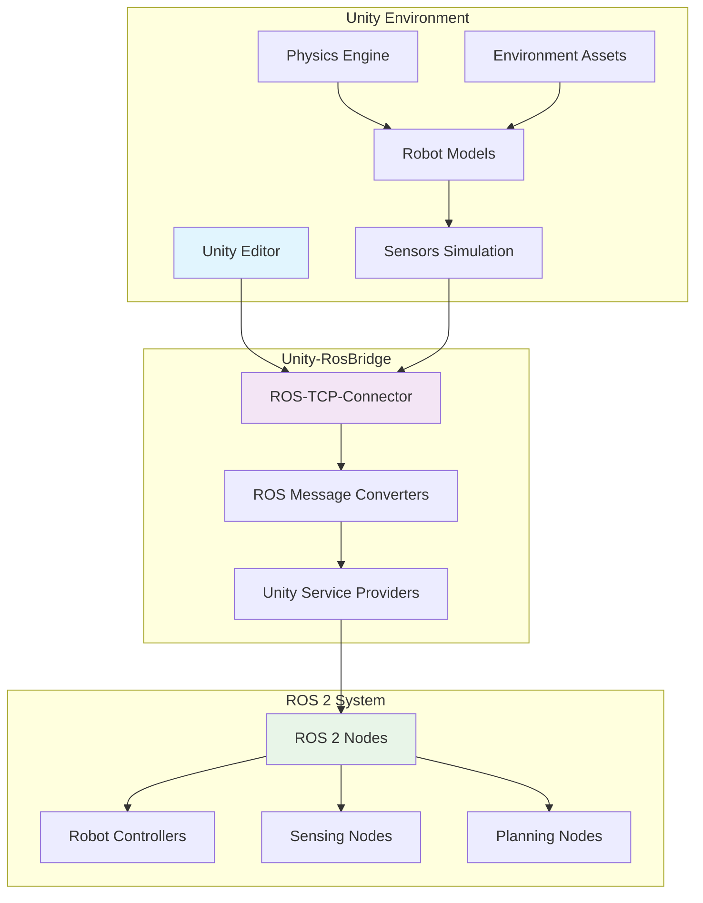

import Tabs from '@theme/Tabs';
import TabItem from '@theme/TabItem';

## Learning Outcomes

After completing this chapter, you will be able to:
1. Set up and configure Unity Robotics Hub for robot simulation
2. Import and configure robot models in Unity for robotic applications
3. Implement ROS-TCP-Connector for communication between Unity and ROS 2
4. Create realistic physics simulation environments in Unity
5. Develop sensor simulation within Unity (cameras, LiDAR, IMU)
6. Implement robot control interfaces in Unity
7. Debug and optimize Unity-ROS integration
8. Evaluate the advantages and limitations of Unity vs other simulation platforms

## Gherkin Specifications

### Scenario 1: Unity-ROS Connection
- **Given** a Unity simulation environment with ROS-TCP-Connector
- **When** establishing communication with ROS 2 nodes
- **Then** the systems exchange data reliably with appropriate message formats

### Scenario 2: Robot Model Integration
- **Given** a robot model with URDF description
- **When** importing and configuring in Unity environment
- **Then** the model maintains kinematic accuracy and visual fidelity

### Scenario 3: Sensor Simulation
- **Given** virtual sensors in Unity environment
- **When** simulating sensor outputs with realistic noise
- **Then** the data matches expected characteristics of real sensors

### Scenario 4: Physics Configuration
- **Given** a Unity scene with robot and environment
- **When** adjusting physics parameters appropriately
- **Then** robot dynamics match real-world behavior

### Scenario 5: Performance Optimization
- **Given** a Unity simulation with multiple robots
- **When** optimization techniques are applied
- **Then** the simulation runs efficiently with minimal performance impact

## Theory & Intuition

Think of Unity integration in robotics like having a professional movie studio for creating virtual robot environments. Just as filmmakers use sophisticated 3D engines to create realistic scenes, lighting, and physics for movies, robotics researchers and developers can use Unity to create highly realistic simulation environments for robots.

Unity provides the "director's chair" for your robotics simulation, allowing you to control every aspect of the environment - from creating complex terrains and buildings to controlling lighting conditions, weather effects, and material properties. The robot models in Unity become "actors" that follow the physical laws you define, with sensors that work like cameras and special effects equipment.

The ROS-TCP-Connector serves as the "script" that enables the actors (robot models in Unity) to receive commands from their directors (ROS 2 nodes) and report back their actions and sensor readings. This creates a seamless bridge between the high-fidelity visual simulation in Unity and the robotic control algorithms in ROS.

## Core Concepts

<Tabs
  defaultValue="diagram"
  values={[
    {label: 'Unity Robotics Architecture', value: 'diagram'},
    {label: 'Integration Components', value: 'table'},
  ]}>
  <TabItem value="diagram">



  </TabItem>
  <TabItem value="table">

| Component | Purpose | Unity Equivalent |
|-----------|---------|------------------|
| Robot Model | Physical representation | GameObject with colliders and joints |
| Sensors | Data acquisition | Cameras, raycasts, physics queries |
| ROS Messages | Communication format | JSON over TCP/IP |
| Controllers | Behavior implementation | C# scripts with ROS communication |
| Environment | Operating context | 3D scenes with materials and lighting |

  </TabItem>
</Tabs>

## Hands-On Labs

<Tabs
  defaultValue="lab1"
  values={[
    {label: 'Lab 1: Unity Robotics Setup', value: 'lab1'},
    {label: 'Lab 2: Robot Model Integration', value: 'lab2'},
    {label: 'Lab 3: Sensor Simulation in Unity', value: 'lab3'},
  ]}>
  <TabItem value="lab1">

### Lab 1: Unity Robotics Setup

#### Objective
Set up Unity environment with Unity Robotics Hub and establish ROS connection.

#### Required Components
- Unity Hub and Unity 2021.3 LTS or newer
- Unity Robotics Hub package
- ROS 2 environment
- Text editor

#### Steps
1. Install Unity Hub if not already installed:
   - Download from https://unity3d.com/get-unity/download
   - Install Unity Hub which manages Unity installations

2. Install Unity 2021.3 LTS or newer:
   - Open Unity Hub
   - Click "Installs" → "Add"
   - Select version 2021.3 LTS or newer
   - Make sure to include "Linux Build Support" if building for Linux

3. Create a new 3D project:
   - In Unity Hub, click "New Project"
   - Select "3D (Built-in Render Pipeline)" (not URP/HDRP for initial setup)
   - Name the project "RoboticsSimulation"
   - Create the project

4. Install Unity Robotics Hub via Package Manager:
   - In Unity, go to Window → Package Manager
   - Click the "+" button → "Add package from git URL..."
   - Add the Unity Robotics packages:
     - `com.unity.robotics.ros-tcp-connector` (https://github.com/Unity-Technologies/ROS-TCP-Connector.git?path=/com.unity.robotics.ros-tcp-connector)
     - `com.unity.robotics.urdf-importer` (https://github.com/Unity-Technologies/URDF-Importer.git?path=/com.unity.robotics.urdf-importer)

5. Download sample robot model (simple differential drive):
   - Create a folder "Assets/Robots"
   - For this lab, we'll use a simple cube-based robot representation

6. Set up the scene:
   - Create a new scene: File → New Scene
   - Add a plane for the ground: GameObject → 3D Object → Plane
   - Scale the plane to 10x10: Scale (10, 1, 10)
   - Add a simple robot model (cube with wheels):
     - Create a cube: GameObject → 3D Object → Cube
     - Position it at (0, 0.5, 0), scale (0.5, 0.2, 0.8)
     - Name it "RobotBody"

7. Add the ROS TCP Connector to the scene:
   - Right-click in Hierarchy → Create Empty
   - Name it "ROSConnection"
   - Add the ROSConnection component to it:
     - Select the ROSConnection GameObject
     - In Inspector, click "Add Component"
     - Search for "ROSConnection" and add it

8. Configure the ROS connection:
   - In the ROSConnection component:
     - Set "ROS_IP" to "127.0.0.1" (for local testing)
     - Set "ROS_TCP_PORT" to "10000" (default port)

9. Create a simple movement script:
   - In Project panel, right-click → Create → C# Script
   - Name it "RobotMover"
   - Double-click to edit in your IDE

10. Add the following C# code to RobotMover.cs:
    ```csharp
    using System.Collections;
    using System.Collections.Generic;
    using UnityEngine;
    using Unity.Robotics.ROSTCPConnector;
    using RosMessageTypes.Geometry;
    using UnityEngine.Serialization;

    public class RobotMover : MonoBehaviour
    {
        [FormerlySerializedAs("linearVelocity")] [SerializeField] float m_LinearVelocity = 0.0f;
        public float linearVelocity
        {
            get => m_LinearVelocity;
            set => m_LinearVelocity = value;
        }

        [FormerlySerializedAs("angularVelocity")] [SerializeField] float m_AngularVelocity = 0.0f;
        public float angularVelocity
        {
            get => m_AngularVelocity;
            set => m_AngularVelocity = value;
        }

        [SerializeField] float m_WheelRadius = 0.1f;
        [SerializeField] float m_AxleLength = 0.5f;

        ROSConnection m_Ros;
        const string k_RosTopicName = "cmd_vel";

        // Start is called when the script instance is enabled
        void Start()
        {
            // Get ROS connection static instance
            m_Ros = ROSConnection.GetOrCreateInstance();
            m_Ros.RegisterPublisher<TwistMsg>(k_RosTopicName);
        }

        // Update is called once per frame
        void Update()
        {
            // Create message
            TwistMsg message = new TwistMsg();
            message.linear = new Vector3Msg(linearVelocity, 0, 0);
            message.angular = new Vector3Msg(0, 0, angularVelocity);

            // Publish message to ROS
            m_Ros.Publish(k_RosTopicName, message);
        }

        // This is called every fixed physics time step
        void FixedUpdate()
        {
            // Calculate wheel velocities from command velocities
            float leftWheelVel = (linearVelocity - angularVelocity * m_AxleLength / 2) / m_WheelRadius;
            float rightWheelVel = (linearVelocity + angularVelocity * m_AxleLength / 2) / m_WheelRadius;

            // Update the robot's movement based on velocities
            transform.position += transform.forward * linearVelocity * Time.fixedDeltaTime;
            transform.Rotate(Vector3.up, Mathf.Rad2Deg * angularVelocity * Time.fixedDeltaTime);
        }
    }
    ```

11. Attach the RobotMover script to the RobotBody:
    - Select RobotBody in the hierarchy
    - Add the RobotMover script component
    - Set linearVelocity to 1.0 and angularVelocity to 0.5

12. Test the connection by running the scene:
    - Press Play in Unity
    - The cube should now move forward and rotate

#### Expected Outcome
Unity scene with basic robot model that connects to ROS and moves according to velocity commands.

  </TabItem>
  <TabItem value="lab2">

### Lab 2: Robot Model Integration

#### Objective
Import and configure a complex robot model in Unity with proper kinematics.

#### Required Components
- Unity with Robotics Hub
- Robot URDF file (e.g., a simple robotic arm or diff drive robot)
- URDF Importer package

#### Steps
1. Prepare a sample URDF file if you don't have one:
   ```bash
   mkdir -p ~/unity_robotics/urdf
   nano ~/unity_robotics/urdf/simple_robot.urdf
   ```

2. Add the following URDF definition:
   ```xml
   <?xml version="1.0"?>
   <robot name="simple_robot">
     <!-- Base Link -->
     <link name="base_link">
       <visual>
         <geometry>
           <box size="0.5 0.3 0.15"/>
         </geometry>
         <material name="blue">
           <color rgba="0 0 1 0.8"/>
         </material>
       </visual>
       <collision>
         <geometry>
           <box size="0.5 0.3 0.15"/>
         </geometry>
       </collision>
       <inertial>
         <mass value="5.0"/>
         <inertia ixx="0.1" ixy="0.0" ixz="0.0" iyy="0.1" iyz="0.0" izz="0.1"/>
       </inertial>
     </link>

     <!-- Left Wheel -->
     <joint name="left_wheel_joint" type="continuous">
       <parent link="base_link"/>
       <child link="left_wheel"/>
       <origin xyz="0 0.2 0" rpy="0 0 0"/>
       <axis xyz="0 1 0"/>
     </joint>
     <link name="left_wheel">
       <visual>
         <geometry>
           <cylinder radius="0.1" length="0.05"/>
         </geometry>
         <material name="black">
           <color rgba="0 0 0 1"/>
         </material>
       </visual>
       <collision>
         <geometry>
           <cylinder radius="0.1" length="0.05"/>
         </geometry>
       </collision>
       <inertial>
         <mass value="1.0"/>
         <inertia ixx="0.01" ixy="0.0" ixz="0.0" iyy="0.01" iyz="0.0" izz="0.01"/>
       </inertial>
     </link>

     <!-- Right Wheel -->
     <joint name="right_wheel_joint" type="continuous">
       <parent link="base_link"/>
       <child link="right_wheel"/>
       <origin xyz="0 -0.2 0" rpy="0 0 0"/>
       <axis xyz="0 1 0"/>
     </joint>
     <link name="right_wheel">
       <visual>
         <geometry>
           <cylinder radius="0.1" length="0.05"/>
         </geometry>
         <material name="black">
           <color rgba="0 0 0 1"/>
         </material>
       </visual>
       <collision>
         <geometry>
           <cylinder radius="0.1" length="0.05"/>
         </geometry>
       </collision>
       <inertial>
         <mass value="1.0"/>
         <inertia ixx="0.01" ixy="0.0" ixz="0.0" iyy="0.01" iyz="0.0" izz="0.01"/>
       </inertial>
     </link>
   </robot>
   ```

3. In Unity, open the URDF Importer:
   - Go to Unity menu: Robotics → URDF Importer
   - Click "Import new URDF"

4. Set the following parameters in the URDF Importer:
   - URDF Path: Browse to your URDF file
   - Import as: Robot
   - Package Location: Assets/URDF (create this folder if it doesn't exist)

5. After import, the robot should appear in the scene hierarchy as "simple_robot"

6. Create a controller script to manage wheel joints:
   ```csharp
   using System.Collections;
   using System.Collections.Generic;
   using UnityEngine;
   using Unity.Robotics.ROSTCPConnector;
   using RosMessageTypes.Geometry;
   using RosMessageTypes.Std;

   public class DifferentialDriveController : MonoBehaviour
   {
       [SerializeField] private GameObject leftWheel;
       [SerializeField] private GameObject rightWheel;
       
       [Header("Robot Configuration")]
       [SerializeField] private float wheelRadius = 0.1f;
       [SerializeField] private float axleLength = 0.4f;
       
       private ROSConnection ros;
       private string cmdVelTopic = "cmd_vel";
       
       // Linear and angular velocities
       private float linearVelocity = 0.0f;
       private float angularVelocity = 0.0f;

       // Start is called before the first frame update
       void Start()
       {
           ros = ROSConnection.GetOrCreateInstance();
           ros.RegisterSubscriber<TwistMsg>(cmdVelTopic, CmdVelCallback);
       }

       void CmdVelCallback(TwistMsg msg)
       {
           linearVelocity = (float)msg.linear.x;
           angularVelocity = (float)msg.angular.z;
       }

       void FixedUpdate()
       {
           // Calculate wheel velocities from differential drive kinematics
           float leftWheelVel = (linearVelocity - angularVelocity * axleLength / 2.0f) / wheelRadius;
           float rightWheelVel = (linearVelocity + angularVelocity * axleLength / 2.0f) / wheelRadius;

           // Rotate wheels
           if (leftWheel != null)
               leftWheel.transform.Rotate(Vector3.right, Mathf.Rad2Deg * leftWheelVel * Time.fixedDeltaTime);

           if (rightWheel != null)
               rightWheel.transform.Rotate(Vector3.right, Mathf.Rad2Deg * rightWheelVel * Time.fixedDeltaTime);

           // Update robot's global movement
           transform.position += transform.forward * linearVelocity * Time.fixedDeltaTime;
           transform.Rotate(Vector3.up, Mathf.Rad2Deg * angularVelocity * Time.fixedDeltaTime);
       }

       // Update is called once per frame
       void Update()
       {
           // This could be used for visualization or logging
       }
   }
   ```

7. Attach this script to the robot's base:
   - Create the C# script in Assets folder
   - Attach to the "simple_robot" GameObject
   - Drag the left and right wheel objects to the script fields

8. Add colliders and rigidbody to the base link for physics:
   - Select the base_link object in the hierarchy
   - Add a Box Collider component
   - Add a Rigidbody component
   - Configure the Rigidbody with appropriate mass and drag

9. Create a more complex environment:
   - Add a plane as the ground
   - Add obstacles (cubes, spheres) with colliders
   - Add materials for visual enhancement

10. Test the robot movement:
    - Run the Unity scene
    - Send ROS commands to verify the robot responds correctly
    ```bash
    # In a separate terminal with ROS 2 sourced:
    ros2 topic pub /cmd_vel geometry_msgs/Twist "{linear: {x: 0.5, y: 0.0, z: 0.0}, angular: {x: 0.0, y: 0.0, z: 0.2}}"
    ```

#### Expected Outcome
Properly configured robot model imported from URDF that responds to ROS commands and interacts physically with the environment.

  </TabItem>
  <TabItem value="lab3">

### Lab 3: Sensor Simulation in Unity

#### Objective
Implement various sensor simulations in Unity and integrate with ROS.

#### Required Components
- Unity with Robotics Hub
- Robot model from previous lab
- ROS 2 environment

#### Steps
1. Create a camera sensor script for the robot:
   ```csharp
   using System.Collections;
   using System.Collections.Generic;
   using UnityEngine;
   using Unity.Robotics.ROSTCPConnector;
   using RosMessageTypes.Sensor;
   using Newtonsoft.Json;

   public class CameraSensor : MonoBehaviour
   {
       [SerializeField] private Camera camera;
       [SerializeField] private string topicName = "/camera/image_raw";
       [SerializeField] private int imageWidth = 640;
       [SerializeField] private int imageHeight = 480;
       [SerializeField] private float publishRate = 30.0f; // Hz

       private ROSConnection ros;
       private RenderTexture renderTexture;
       private Texture2D texture2D;
       private float nextPublishTime;

       void Start()
       {
           ros = ROSConnection.GetOrCreateInstance();
           ros.RegisterPublisher<Unity.Robotics.ROSTCPConnector.MessageContents.SerializedImageMsg>(topicName);

           // Create render texture for camera
           renderTexture = new RenderTexture(imageWidth, imageHeight, 24);
           if (camera == null)
               camera = GetComponent<Camera>();
           camera.targetTexture = renderTexture;

           // Create Texture2D to read from RenderTexture
           texture2D = new Texture2D(imageWidth, imageHeight, TextureFormat.RGB24, false);

           nextPublishTime = Time.time;
       }

       void Update()
       {
           if (Time.time >= nextPublishTime)
           {
               PublishImage();
               nextPublishTime = Time.time + 1.0f / publishRate;
           }
       }

       void PublishImage()
       {
           // Set the RenderTexture as active
           RenderTexture.active = renderTexture;

           // Read pixels from RenderTexture to Texture2D
           texture2D.ReadPixels(new Rect(0, 0, imageWidth, imageHeight), 0, 0);
           texture2D.Apply();

           // Create image message
           var imageMsg = new Unity.Robotics.ROSTCPConnector.MessageContents.SerializedImageMsg();
           imageMsg.format = "rgb8";
           imageMsg.width = (uint)imageWidth;
           imageMsg.height = (uint)imageHeight;
           imageMsg.step = (uint)(imageWidth * 3); // 3 bytes per pixel for RGB
           
           // Convert texture to bytes
           byte[] imageData = texture2D.GetRawTextureData<byte>();
           imageMsg.data = imageData;

           // Publish the image
           ros.Publish(topicName, imageMsg);

           // Reset active RenderTexture
           RenderTexture.active = null;
       }
   }
   ```

2. Create a LiDAR sensor script:
   ```csharp
   using System.Collections;
   using System.Collections.Generic;
   using UnityEngine;
   using Unity.Robotics.ROSTCPConnector;
   using RosMessageTypes.Sensor;

   public class LidarSensor : MonoBehaviour
   {
       [Header("LIDAR Configuration")]
       [SerializeField] private string topicName = "/scan";
       [SerializeField] private int rayCount = 360;
       [SerializeField] private float angleMin = -Mathf.PI;
       [SerializeField] private float angleMax = Mathf.PI;
       [SerializeField] private float rangeMin = 0.1f;
       [SerializeField] private float rangeMax = 30.0f;
       [SerializeField] private float publishRate = 10.0f; // Hz

       private ROSConnection ros;
       private float nextPublishTime;

       void Start()
       {
           ros = ROSConnection.GetOrCreateInstance();
           ros.RegisterPublisher<LaserScanMsg>(topicName);
           nextPublishTime = Time.time;
       }

       void Update()
       {
           if (Time.time >= nextPublishTime)
           {
               PublishScan();
               nextPublishTime = Time.time + 1.0f / publishRate;
           }
       }

       void PublishScan()
       {
           // Create laser scan message
           var scanMsg = new LaserScanMsg();
           scanMsg.header = new std_msgs.HeaderMsg();
           scanMsg.header.stamp = new builtin_interfaces.TimeMsg();
           scanMsg.header.stamp.sec = (int)System.DateTime.UtcNow.Subtract(new System.DateTime(1970, 1, 1)).TotalSeconds;
           scanMsg.header.stamp.nanosec = (uint)System.DateTime.UtcNow.Millisecond * 1000000;
           scanMsg.header.frame_id = "laser_frame";

           scanMsg.angle_min = angleMin;
           scanMsg.angle_max = angleMax;
           scanMsg.angle_increment = (angleMax - angleMin) / rayCount;
           scanMsg.time_increment = 0.0f; // Not used for simulation
           scanMsg.scan_time = 1.0f / publishRate;
           scanMsg.range_min = rangeMin;
           scanMsg.range_max = rangeMax;

           // Initialize ranges array
           scanMsg.ranges = new float[rayCount];

           // Perform raycasting for each angle
           for (int i = 0; i < rayCount; i++)
           {
               float angle = angleMin + i * scanMsg.angle_increment;
               
               // Calculate direction vector
               Vector3 direction = new Vector3(Mathf.Cos(angle), 0, Mathf.Sin(angle));
               direction = transform.TransformDirection(direction);

               // Perform raycast
               RaycastHit hit;
               if (Physics.Raycast(transform.position, direction, out hit, rangeMax))
               {
                   scanMsg.ranges[i] = hit.distance;
               }
               else
               {
                   scanMsg.ranges[i] = float.PositiveInfinity; // or rangeMax for max range
               }
           }

           // Publish the scan
           ros.Publish(topicName, scanMsg);
       }
   }
   ```

3. Create an IMU sensor script:
   ```csharp
   using System.Collections;
   using System.Collections.Generic;
   using UnityEngine;
   using Unity.Robotics.ROSTCPConnector;
   using RosMessageTypes.Sensor;

   public class IMUSensor : MonoBehaviour
   {
       [Header("IMU Configuration")]
       [SerializeField] private string topicName = "/imu";
       [SerializeField] private float publishRate = 100.0f; // Hz

       private ROSConnection ros;
       private Rigidbody rb;
       private float nextPublishTime;

       void Start()
       {
           ros = ROSConnection.GetOrCreateInstance();
           ros.RegisterPublisher<ImuMsg>(topicName);
           
           // Get the rigidbody component for physics data
           rb = GetComponentInParent<Rigidbody>();
           if (rb == null)
           {
               Debug.LogError("Rigidbody not found. Please ensure this IMU sensor is attached to a physics-enabled object.");
           }

           nextPublishTime = Time.time;
       }

       void Update()
       {
           if (Time.time >= nextPublishTime)
           {
               PublishIMU();
               nextPublishTime = Time.time + 1.0f / publishRate;
           }
       }

       void PublishIMU()
       {
           var imuMsg = new ImuMsg();
           imuMsg.header = new std_msgs.HeaderMsg();
           imuMsg.header.stamp = new builtin_interfaces.TimeMsg();
           imuMsg.header.stamp.sec = (int)System.DateTime.UtcNow.Subtract(new System.DateTime(1970, 1, 1)).TotalSeconds;
           imuMsg.header.stamp.nanosec = (uint)System.DateTime.UtcNow.Millisecond * 1000000;
           imuMsg.header.frame_id = "imu_frame";

           // Set orientation (for now, assuming identity - this should be improved)
           imuMsg.orientation = new geometry_msgs.QuaternionMsg(
               transform.rotation.x, 
               transform.rotation.y, 
               transform.rotation.z, 
               transform.rotation.w
           );

           // Set orientation covariance (unknown variances)
           for (int i = 0; i < 9; i++)
               imuMsg.orientation_covariance[i] = -1; // -1 means unknown

           // Set angular velocity (from physics simulation)
           if (rb != null)
           {
               Vector3 angularVel = rb.angularVelocity;
               imuMsg.angular_velocity = new geometry_msgs.Vector3Msg(angularVel.x, angularVel.y, angularVel.z);
           }

           // Set angular velocity covariance (unknown variances)
           for (int i = 0; i < 9; i++)
               imuMsg.angular_velocity_covariance[i] = -1; // -1 means unknown

           // Set linear acceleration (from physics simulation + gravity)
           if (rb != null)
           {
               Vector3 linearAcc = rb.velocity; // Simplified representation
               Vector3 gravity = Physics.gravity;
               Vector3 totalAcc = linearAcc + gravity;
               imuMsg.linear_acceleration = new geometry_msgs.Vector3Msg(totalAcc.x, totalAcc.y, totalAcc.z);
           }

           // Set linear acceleration covariance (unknown variances)
           for (int i = 0; i < 9; i++)
               imuMsg.linear_acceleration_covariance[i] = -1; // -1 means unknown

           ros.Publish(topicName, imuMsg);
       }
   }
   ```

4. Add the sensor components to your robot:
   - Create an empty GameObject as a child of the robot's base_link
   - Name it "CameraLink" and position it at the front of the robot
   - Add the Camera component to this object and add the CameraSensor script
   - Create another empty GameObject for the LiDAR sensor, position appropriately
   - Add the LidarSensor script to the LiDAR object
   - Attach the IMUSensor script to any appropriate link of the robot

5. Create a sensor visualization script to debug sensor data:
   ```csharp
   using System.Collections;
   using System.Collections.Generic;
   using UnityEngine;

   public class SensorVisualizer : MonoBehaviour
   {
       [Header("Visualization Settings")]
       [SerializeField] private float visualizationDuration = 0.1f;
       [SerializeField] private Color rayColor = Color.red;

       private void OnValidate()
       {
           if (visualizationDuration < 0.01f)
               visualizationDuration = 0.01f;
       }

       // Visualize a ray for debugging LiDAR
       public void VisualizeRay(Vector3 origin, Vector3 direction, float distance)
       {
           Debug.DrawRay(origin, direction * distance, rayColor, visualizationDuration);
       }
   }
   ```

6. Update your robot controller to use these sensors:
   - Ensure the robot has appropriate colliders and rigidbodies
   - Test the sensor outputs by running the simulation
   - Connect to ROS 2 to verify sensor data is being published

7. Test the sensor integration:
   ```bash
   # Terminal 1: Start ROS 2 bridge (in a separate terminal)
   ros2 run ros_tcp_endpoint default_server_endpoint --ros-args -p ROS_IP:=127.0.0.1 -p ROS_TCP_PORT:=10000

   # Terminal 2: Listen to camera data
   ros2 topic echo /camera/image_raw

   # Terminal 3: Listen to LiDAR data
   ros2 topic echo /scan

   # Terminal 4: Listen to IMU data
   ros2 topic echo /imu
   ```

#### Expected Outcome
Robot model with multiple sensors (camera, LiDAR, IMU) publishing realistic data to ROS topics that can be consumed by ROS 2 nodes.

  </TabItem>
</Tabs>

## Sim-to-Real Notes

- **Hardware considerations**: Unity simulation provides high-quality visuals but may not perfectly model real sensor characteristics; validate simulation parameters against real sensor data
- **Differences from simulation**: Real sensors have different noise characteristics, latency, and update rates than simulated ones
- **Practical tips**: Use Unity primarily for perception tasks and visualization; for dynamics simulation, consider using it alongside physics engines like Gazebo

## Multiple Choice Questions

1. What is the primary purpose of the ROS-TCP-Connector in Unity robotics?
   - A) To connect Unity to the internet
   - B) To enable communication between Unity and ROS 2 over TCP/IP
   - C) To connect Unity to a database
   - D) To enable physics simulation in Unity

   **Correct Answer: B** - ROS-TCP-Connector enables communication between Unity and ROS 2 over TCP/IP.

2. Which Unity package is used to import URDF robot models?
   - A) ROS Connector
   - B) URDF Importer
   - C) Robot Builder
   - D) Physics Engine

   **Correct Answer: B** - URDF Importer is the Unity package used to import URDF robot models.

3. What is the default port used by ROS-TCP-Connector?
   - A) 8080
   - B) 10000
   - C) 11311
   - D) 5000

   **Correct Answer: B** - The default port for ROS-TCP-Connector is 10000.

4. In Unity, how can you capture camera sensor data for ROS?
   - A) Using RenderTexture and converting to ROS Image message
   - B) Using Unity's built-in video recording
   - C) Using screenshots
   - D) Using external capture software

   **Correct Answer: A** - Using RenderTexture and converting to ROS Image message is the standard approach.

5. What type of physics engine does Unity use by default?
   - A) ODE
   - B) Bullet
   - C) PhysX
   - D) DART

   **Correct Answer: C** - Unity uses PhysX as its default physics engine.

6. Which component is essential for simulating LiDAR sensors in Unity?
   - A) Mesh Collider
   - B) Raycasting
   - C) Particle System
   - D) Animation Controller

   **Correct Answer: B** - Raycasting is essential for simulating LiDAR sensors by detecting distances to objects.

7. What ROS message type is used for camera images?
   - A) sensor_msgs/LaserScan
   - B) sensor_msgs/Imu
   - C) sensor_msgs/Image
   - D) geometry_msgs/Pose

   **Correct Answer: C** - sensor_msgs/Image is the ROS message type used for camera images.

8. When using Unity for robotics simulation, what is a common approach for physics?
   - A) Only use Unity's built-in physics
   - B) Combine Unity's graphics with Gazebo's physics through plugins
   - C) Disable physics completely
   - D) Use only custom physics scripts

   **Correct Answer: B** - A common approach is to combine Unity's graphics with Gazebo's physics through plugins.

9. What is the advantage of using Unity over Gazebo for certain robotics applications?
   - A) Better physics simulation
   - B) More realistic graphics and rendering
   - C) Simpler API
   - D) Better documentation

   **Correct Answer: B** - Unity provides more realistic graphics and rendering capabilities compared to Gazebo.

10. How can you simulate IMU data in Unity?
    - A) Using only position data
    - B) Computing angular velocity from rotation changes and acceleration from physics
    - C) Using random values
    - D) Using pre-recorded data only

    **Correct Answer: B** - IMU data can be simulated by computing angular velocity from rotation changes and acceleration from physics.

11. Which ROS message type is used for LiDAR data?
    - A) sensor_msgs/Image
    - B) sensor_msgs/LaserScan
    - C) sensor_msgs/PointCloud2
    - D) geometry_msgs/Vector3

    **Correct Answer: B** - sensor_msgs/LaserScan is the ROS message type used for LiDAR data.

12. What Unity component is essential for implementing robot joint controllers?
    - A) Rigidbody
    - B) Joint components (HingeJoint, etc.)
    - C) Collider
    - D) Material

    **Correct Answer: B** - Joint components are essential for implementing robot joint controllers in Unity.

13. In Unity robotics, what is the purpose of coordinate system conversion?
    - A) To improve performance
    - B) To match ROS coordinate conventions (right-handed vs Unity's left-handed)
    - C) To reduce memory usage
    - D) To increase rendering quality

    **Correct Answer: B** - Coordinate system conversion is needed to match ROS conventions with Unity's coordinate system.

14. What is a potential limitation of using Unity for robotics simulation?
    - A) Too much realism
    - B) Less accurate physics for complex robot dynamics compared to specialized engines
    - C) Too many available sensors
    - D) Excessive documentation

    **Correct Answer: B** - Unity may have less accurate physics for complex robot dynamics compared to specialized engines like Gazebo with ODE/Bullet.

15. How is the robot's velocity typically calculated from wheel encoders in a differential drive simulation?
    - A) By measuring motor current
    - B) Using forward kinematics from wheel radii and rotational velocities
    - C) Using external GPS
    - D) Using only visual odometry

    **Correct Answer: B** - Robot velocity is calculated using forward kinematics from wheel radii and rotational velocities.

## Further Reading

1. [Unity Robotics Hub Documentation](https://github.com/Unity-Technologies/Unity-Robotics-Hub) - Official Unity Robotics documentation and examples
2. [ROS-TCP-Connector Tutorial](https://github.com/Unity-Technologies/ROS-TCP-Connector) - Guide for connecting Unity and ROS
3. [URDF Importer Guide](https://github.com/Unity-Technologies/URDF-Importer) - Documentation for importing robot models
4. [Unity for Robotics Development](https://unity.com/solutions/industrial/robotics) - Unity's robotics use cases and resources
5. [Sim-to-Real Transfer with Unity](https://arxiv.org/abs/2206.05425) - Research on using Unity for sim-to-real robotics
6. [Unity Physics vs Other Engines for Robotics](https://ieeexplore.ieee.org/document/9294567) - Comparison of physics engines for robotics applications