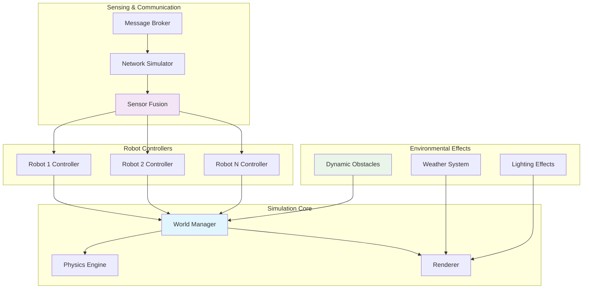

import Tabs from '@theme/Tabs';
import TabItem from '@theme/TabItem';

## Learning Outcomes

After completing this chapter, you will be able to:
1. Design and implement multi-robot simulation environments
2. Create dynamic and interactive simulation scenarios with changing conditions
3. Implement complex sensor simulation including sensor fusion
4. Integrate domain randomization techniques for sim-to-real transfer
5. Develop modular simulation components for reusable scenarios
6. Optimize simulation performance for complex multi-agent systems
7. Implement realistic environmental effects (lighting, weather, etc.)
8. Validate simulation scenarios against real-world benchmarks

## Gherkin Specifications

### Scenario 1: Multi-Robot Coordination
- **Given** a multi-robot simulation environment
- **When** robots execute coordinated tasks
- **Then** they communicate and collaborate effectively without collisions

### Scenario 2: Dynamic Environment Simulation
- **Given** a simulation with changing environmental conditions
- **When** obstacles or conditions change during execution
- **Then** robots adapt their behavior appropriately

### Scenario 3: Sensor Fusion in Complex Scenarios
- **Given** robots with multiple sensor types in complex environments
- **When** sensor fusion algorithms process the data
- **Then** the robots achieve better environmental understanding

### Scenario 4: Domain Randomization
- **Given** a simulation with randomized parameters
- **When** training policies in the randomized environment
- **Then** policies perform better in real-world applications

### Scenario 5: Performance Optimization
- **Given** a complex simulation scenario
- **When** optimization techniques are applied
- **Then** the simulation runs at acceptable speed with maintained accuracy

## Theory & Intuition

Think of advanced simulation scenarios like a sophisticated theater production where multiple actors (robots) perform complex, coordinated actions in detailed, dynamic sets (environments). Just as directors plan elaborate scenes with multiple characters interacting, robotics researchers design simulation scenarios with multiple robots performing intricate tasks.

In a theater, the complexity increases with each additional actor, prop, and environmental effect. Similarly, in robotics simulation, adding multiple robots, dynamic obstacles, changing lighting conditions, and complex environments exponentially increases complexity. The key to success is careful choreography and coordination between all elements.

Advanced simulation is like having multiple film directors working on different aspects of a movie: one focusing on the actors (robot controllers), another on the set design (environment), a third on special effects (sensor simulation), and a fourth on camera work (visualization). When all these elements are orchestrated properly, the result is a realistic, compelling simulation that closely mirrors real-world complexity.

## Core Concepts

<Tabs
  defaultValue="diagram"
  values={[
    {label: 'Multi-Robot Simulation Architecture', value: 'diagram'},
    {label: 'Simulation Components', value: 'table'},
  ]}>
  <TabItem value="diagram">



  </TabItem>
  <TabItem value="table">

| Component | Purpose | Key Considerations |
|-----------|---------|-------------------|
| Multi-Robot Coordination | Managing multiple agents | Communication protocols, collision avoidance |
| Dynamic Environments | Changing conditions | Performance impact, determinism |
| Sensor Fusion | Combining multi-modal data | Timing synchronization, uncertainty modeling |
| Domain Randomization | Improving sim-to-real transfer | Parameter ranges, computational cost |
| Performance Optimization | Maintaining real-time execution | Level of detail, physics simplification |

  </TabItem>
</Tabs>

## Hands-On Labs

<Tabs
  defaultValue="lab1"
  values={[
    {label: 'Lab 1: Multi-Robot Coordination', value: 'lab1'},
    {label: 'Lab 2: Dynamic Environment Simulation', value: 'lab2'},
    {label: 'Lab 3: Domain Randomization Implementation', value: 'lab3'},
  ]}>
  <TabItem value="lab1">

### Lab 1: Multi-Robot Coordination

#### Objective
Implement and coordinate multiple robots in a shared environment.

#### Required Components
- Gazebo simulation environment
- Robot models (at least 2 differential drive robots)
- Navigation and path planning packages
- Communication framework

#### Steps
1. Create a world file with multiple robots:
   ```bash
   nano ~/simulation_ws/worlds/multi_robot_world.world
   ```

2. Add the following world configuration:
   ```xml
   <?xml version="1.0" ?>
   <sdf version="1.7">
     <world name="multi_robot_world">
       <!-- Include default models -->
       <include>
         <uri>model://ground_plane</uri>
       </include>
       <include>
         <uri>model://sun</uri>
       </include>

       <!-- Add obstacles -->
       <model name="wall_1">
         <pose>-3 0 0.5 0 0 1.57</pose>
         <link name="link">
           <collision name="collision">
             <geometry>
               <box><size>6 0.2 1</size></box>
             </geometry>
           </collision>
           <visual name="visual">
             <geometry>
               <box><size>6 0.2 1</size></box>
             </geometry>
             <material>
               <ambient>0.5 0.5 0.5 1</ambient>
               <diffuse>0.5 0.5 0.5 1</diffuse>
             </material>
           </visual>
         </link>
       </model>

       <model name="wall_2">
         <pose>0 3 0.5 0 0 0</pose>
         <link name="link">
           <collision name="collision">
             <geometry>
               <box><size>6 0.2 1</size></box>
             </geometry>
           </collision>
           <visual name="visual">
             <geometry>
               <box><size>6 0.2 1</size></box>
             </geometry>
             <material>
               <ambient>0.5 0.5 0.5 1</ambient>
               <diffuse>0.5 0.5 0.5 1</diffuse>
             </material>
           </visual>
         </link>
       </model>

       <!-- Add a charging station -->
       <model name="charging_station">
         <pose>2 2 0.1 0 0 0</pose>
         <link name="link">
           <collision name="collision">
             <geometry>
               <box><size>1 1 0.2</size></box>
             </geometry>
           </collision>
           <visual name="visual">
             <geometry>
               <box><size>1 1 0.2</size></box>
             </geometry>
             <material>
               <ambient>0.8 0.2 0.8 1</ambient>
               <diffuse>0.8 0.2 0.8 1</diffuse>
             </material>
           </visual>
         </link>
       </model>

       <!-- Robot 1 -->
       <model name="robot1">
         <include>
           <uri>model://diff_drive_robot</uri>
           <pose>0 0 0 0 0 0</pose>
         </include>
       </model>

       <!-- Robot 2 -->
       <model name="robot2">
         <include>
           <uri>model://diff_drive_robot</uri>
           <pose>1 1 0 0 0 0</pose>
         </include>
       </model>

       <!-- Robot 3 -->
       <model name="robot3">
         <include>
           <uri>model://diff_drive_robot</uri>
           <pose>-1 1 0 0 0 0</pose>
         </include>
       </model>
     </world>
   </sdf>
   ```

3. Create a ROS 2 package for multi-robot coordination:
   ```bash
   cd ~/simulation_ws/src
   ros2 pkg create --build-type ament_python multi_robot_coordination --dependencies rclpy geometry_msgs nav_msgs sensor_msgs std_msgs tf2_ros tf2_geometry_msgs
   ```

4. Create a multi-robot coordinator node:
   ```bash
   nano ~/simulation_ws/src/multi_robot_coordination/multi_robot_coordination/coordinator.py
   ```

5. Add the coordinator implementation:
   ```python
   #!/usr/bin/env python3
   import rclpy
   from rclpy.node import Node
   from geometry_msgs.msg import Twist, PoseStamped, Point
   from nav_msgs.msg import Odometry
   from sensor_msgs.msg import LaserScan
   from tf2_ros import TransformException
   from tf2_ros.buffer import Buffer
   from tf2_ros.transform_listener import TransformListener
   import math
   import random

   class MultiRobotCoordinator(Node):
       def __init__(self):
           super().__init__('multi_robot_coordinator')

           # Robot namespaces
           self.robot_namespaces = ['robot1', 'robot2', 'robot3']
           
           # Robot states (position and goals)
           self.robot_positions = {ns: None for ns in self.robot_namespaces}
           self.robot_scans = {ns: None for ns in self.robot_namespaces}
           self.robot_goals = {ns: self.generate_random_goal() for ns in self.robot_namespaces}
           
           # TF2 buffer and listener
           self.tf_buffer = Buffer()
           self.tf_listener = TransformListener(self.tf_buffer, self)

           # Create publishers and subscribers for each robot
           self.cmd_pubs = {}
           self.odom_subs = {}
           self.scan_subs = {}
           
           for ns in self.robot_namespaces:
               # Publisher for velocity commands
               cmd_topic = f'/{ns}/cmd_vel'
               self.cmd_pubs[ns] = self.create_publisher(Twist, cmd_topic, 10)
               
               # Subscriber for odometry
               odom_topic = f'/{ns}/odom'
               self.odom_subs[ns] = self.create_subscription(
                   Odometry, odom_topic, 
                   lambda msg, robot_ns=ns: self.odom_callback(msg, robot_ns),
                   10
               )
               
               # Subscriber for laser scan
               scan_topic = f'/{ns}/scan'
               self.scan_subs[ns] = self.create_subscription(
                   LaserScan, scan_topic,
                   lambda msg, robot_ns=ns: self.scan_callback(msg, robot_ns),
                   10
               )

           # Timer for coordination logic
           self.timer = self.create_timer(0.1, self.coordination_logic)
           
           self.get_logger().info('Multi-robot coordinator initialized')

       def odom_callback(self, msg, robot_ns):
           """Update robot position from odometry"""
           self.robot_positions[robot_ns] = (msg.pose.pose.position.x, msg.pose.pose.position.y)
           
           # Check if robot reached its goal
           if self.robot_goals[robot_ns]:
               goal_x, goal_y = self.robot_goals[robot_ns]
               pos_x = msg.pose.pose.position.x
               pos_y = msg.pose.pose.position.y
               
               distance = math.sqrt((pos_x - goal_x)**2 + (pos_y - goal_y)**2)
               if distance < 0.5:  # Goal reached
                   self.get_logger().info(f'{robot_ns} reached goal, assigning new goal')
                   self.robot_goals[robot_ns] = self.generate_random_goal()

       def scan_callback(self, msg, robot_ns):
           """Store laser scan data"""
           self.robot_scans[robot_ns] = msg

       def generate_random_goal(self):
           """Generate a random goal within the arena"""
           x = random.uniform(-2.5, 2.5)
           y = random.uniform(-2.5, 2.5)
           return (x, y)

       def coordination_logic(self):
           """Main coordination algorithm"""
           for ns in self.robot_namespaces:
               if not self.robot_positions[ns] or not self.robot_goals[ns]:
                   continue
                   
               # Get robot's current position and goal
               current_pos = self.robot_positions[ns]
               goal_pos = self.robot_goals[ns]
               
               # Calculate desired velocity towards goal
               cmd_vel = self.calculate_navigation_cmd(current_pos, goal_pos, ns)
               
               # Check for potential collisions with other robots
               cmd_vel = self.avoid_robot_collisions(cmd_vel, ns)
               
               # Publish command
               self.cmd_pubs[ns].publish(cmd_vel)

       def calculate_navigation_cmd(self, current_pos, goal_pos, robot_ns):
           """Calculate velocity command to navigate towards goal"""
           cmd = Twist()
           
           if current_pos is None or goal_pos is None:
               return cmd
           
           # Calculate direction to goal
           dx = goal_pos[0] - current_pos[0]
           dy = goal_pos[1] - current_pos[1]
           distance = math.sqrt(dx**2 + dy**2)
           
           if distance > 0.1:  # If not close to goal
               # Normalize direction vector
               dx_norm = dx / distance
               dy_norm = dy / distance
               
               # Set linear velocity proportional to distance (slow down when close)
               cmd.linear.x = min(0.5, distance * 0.5)
               
               # Set angular velocity to face goal
               current_yaw = self.get_robot_yaw(robot_ns)
               goal_yaw = math.atan2(dy, dx)
               angle_diff = self.normalize_angle(goal_yaw - current_yaw)
               
               cmd.angular.z = max(-0.5, min(0.5, angle_diff * 2.0))
           else:
               # Near goal, slow down
               cmd.linear.x = 0.0
               cmd.angular.z = 0.0
               
           return cmd

       def get_robot_yaw(self, robot_ns):
           """Get the yaw angle of a robot using TF2"""
           try:
               t = self.tf_buffer.lookup_transform(
                   f'{robot_ns}/odom',
                   f'{robot_ns}/base_link',
                   rclpy.time.Time())
               # Convert quaternion to yaw (simplified - assuming z-axis rotation)
               import tf_transformations
               quat = [
                   t.transform.rotation.x,
                   t.transform.rotation.y,
                   t.transform.rotation.z,
                   t.transform.rotation.w
               ]
               euler = tf_transformations.euler_from_quaternion(quat)
               return euler[2]  # yaw
           except TransformException as ex:
               self.get_logger().info(f'Could not transform {robot_ns}: {ex}')
               return 0.0

       def normalize_angle(self, angle):
           """Normalize angle to [-pi, pi]"""
           while angle > math.pi:
               angle -= 2.0 * math.pi
           while angle < -math.pi:
               angle += 2.0 * math.pi
           return angle

       def avoid_robot_collisions(self, cmd_vel, current_robot_ns):
           """Modify command to avoid collisions with other robots"""
           current_pos = self.robot_positions[current_robot_ns]
           if not current_pos:
               return cmd_vel
           
           # Check other robots' positions
           for other_ns in self.robot_namespaces:
               if other_ns == current_robot_ns:
                   continue
                   
               other_pos = self.robot_positions[other_ns]
               if not other_pos:
                   continue
               
               # Calculate distance to other robot
               dx = other_pos[0] - current_pos[0]
               dy = other_pos[1] - current_pos[1]
               distance = math.sqrt(dx**2 + dy**2)
               
               # If too close, modify velocity to avoid collision
               if distance < 0.8:  # Collision threshold
                   # Turn away from the other robot
                   angle_to_other = math.atan2(dy, dx)
                   current_yaw = self.get_robot_yaw(current_robot_ns)
                   angle_diff = self.normalize_angle(angle_to_other - current_yaw)
                   
                   # If the other robot is in front, slow down and turn away
                   if abs(angle_diff) < math.pi / 3:  # Within 60 degrees
                       cmd_vel.angular.z += (-angle_diff) * 2.0
                       cmd_vel.linear.x *= 0.5  # Slow down
                       
           return cmd_vel

   def main(args=None):
       rclpy.init(args=args)
       coordinator = MultiRobotCoordinator()
       
       try:
           rclpy.spin(coordinator)
       except KeyboardInterrupt:
           pass
       finally:
           coordinator.destroy_node()
           rclpy.shutdown()

   if __name__ == '__main__':
       main()
   ```

6. Create a launch file for the multi-robot simulation:
   ```bash
   mkdir -p ~/simulation_ws/src/multi_robot_coordination/launch
   nano ~/simulation_ws/src/multi_robot_coordination/launch/multi_robot_simulation.launch.py
   ```

7. Add the launch file content:
   ```python
   import os
   from launch import LaunchDescription
   from launch.actions import DeclareLaunchArgument, IncludeLaunchDescription, ExecuteProcess, RegisterEventHandler
   from launch.launch_description_sources import PythonLaunchDescriptionSource
   from launch.substitutions import LaunchConfiguration, PathJoinSubstitution
   from launch_ros.actions import Node
   from launch_ros.substitutions import FindPackageShare
   from launch.event_handlers import OnProcessExit
   from launch.actions import TimerAction

   def generate_launch_description():
       # Declare launch arguments
       world_file = DeclareLaunchArgument(
           'world',
           default_value='multi_robot_world.world',
           description='Choose one of the world files from `/simulation_ws/worlds`'
       )

       # Get configuration
       world_path = LaunchConfiguration('world')

       # Launch Gazebo
       pkg_gazebo_ros = FindPackageShare('gazebo_ros')
       gazebo = IncludeLaunchDescription(
           PythonLaunchDescriptionSource(
               PathJoinSubstitution([pkg_gazebo_ros, 'launch', 'gazebo.launch.py'])
           ),
           launch_arguments={
               'world': PathJoinSubstitution([FindPackageShare('multi_robot_coordination'), 'worlds', world_path])
           }.items()
       )

       # Launch the multi-robot coordinator
       coordinator_node = Node(
           package='multi_robot_coordination',
           executable='coordinator',
           name='multi_robot_coordinator',
           output='screen'
       )

       return LaunchDescription([
           world_file,
           gazebo,
           coordinator_node
       ])
   ```

8. Update setup.py to include the new executable:
   ```bash
   nano ~/simulation_ws/src/multi_robot_coordination/setup.py
   ```

9. Add the entry point:
   ```python
   entry_points={
       'console_scripts': [
           'coordinator = multi_robot_coordination.coordinator:main',
       ],
   }
   ```

10. Make the file executable and build:
    ```bash
    chmod +x ~/simulation_ws/src/multi_robot_coordination/multi_robot_coordination/coordinator.py
    cd ~/simulation_ws
    colcon build --packages-select multi_robot_coordination
    source install/setup.bash
    ```

11. Launch the multi-robot simulation:
    ```bash
    ros2 launch multi_robot_coordination multi_robot_simulation.launch.py
    ```

#### Expected Outcome
Multiple robots navigating in a shared environment with collision avoidance and goal-seeking behavior.

  </TabItem>
  <TabItem value="lab2">

### Lab 2: Dynamic Environment Simulation

#### Objective
Create a simulation environment with dynamic obstacles and changing conditions.

#### Required Components
- Gazebo simulation
- Robot with navigation capabilities
- Dynamic obstacle controller

#### Steps
1. Create a world file with dynamic elements:
   ```bash
   nano ~/simulation_ws/worlds/dynamic_world.world
   ```

2. Add the world configuration:
   ```xml
   <?xml version="1.0" ?>
   <sdf version="1.7">
     <world name="dynamic_world">
       <!-- Include default models -->
       <include>
         <uri>model://ground_plane</uri>
       </include>
       <include>
         <uri>model://sun</uri>
       </include>

       <!-- Static obstacles -->
       <model name="static_wall_1">
         <pose>-3 0 0.5 0 0 1.57</pose>
         <link name="link">
           <collision name="collision">
             <geometry>
               <box><size>6 0.2 1</size></box>
             </geometry>
           </collision>
           <visual name="visual">
             <geometry>
               <box><size>6 0.2 1</size></box>
             </geometry>
             <material>
               <ambient>0.5 0.5 0.5 1</ambient>
               <diffuse>0.5 0.5 0.5 1</diffuse>
             </material>
           </visual>
         </link>
       </model>

       <!-- Dynamic obstacles - these will be controlled by a plugin -->
       <model name="dynamic_obstacle_1">
         <pose>0 2 0.2 0 0 0</pose>
         <link name="link">
           <inertial>
             <mass>5.0</mass>
             <inertia>
               <ixx>0.1</ixx>
               <ixy>0.0</ixy>
               <ixz>0.0</ixz>
               <iyy>0.1</iyy>
               <iyz>0.0</iyz>
               <izz>0.1</izz>
             </inertia>
           </inertial>
           <collision name="collision">
             <geometry>
               <sphere><radius>0.3</radius></sphere>
             </geometry>
           </collision>
           <visual name="visual">
             <geometry>
               <sphere><radius>0.3</radius></sphere>
             </geometry>
             <material>
               <ambient>0.8 0.2 0.2 1</ambient>
               <diffuse>0.8 0.2 0.2 1</diffuse>
             </material>
           </visual>
         </link>
         <!-- Add a plugin to make the obstacle move -->
         <plugin name="obstacle_mover" filename="libgazebo_ros_p3d.so">
           <always_on>true</always_on>
           <update_rate>50</update_rate>
           <body_name>link</body_name>
           <topic_name>dynamic_obstacle_1/pose</topic_name>
         </plugin>
       </model>

       <model name="dynamic_obstacle_2">
         <pose>2 -1 0.2 0 0 0</pose>
         <link name="link">
           <inertial>
             <mass>5.0</mass>
             <inertia>
               <ixx>0.1</ixx>
               <ixy>0.0</ixy>
               <ixz>0.0</ixz>
               <iyy>0.1</iyy>
               <iyz>0.0</iyz>
               <izz>0.1</izz>
             </inertia>
           </inertial>
           <collision name="collision">
             <geometry>
               <box><size>0.4 0.4 0.4</size></box>
             </geometry>
           </collision>
           <visual name="visual">
             <geometry>
               <box><size>0.4 0.4 0.4</size></box>
             </geometry>
             <material>
               <ambient>0.2 0.8 0.2 1</ambient>
               <diffuse>0.2 0.8 0.2 1</diffuse>
             </material>
           </visual>
         </link>
       </model>

       <!-- Robot -->
       <model name="mobile_robot">
         <include>
           <uri>model://diff_drive_robot</uri>
           <pose>0 0 0 0 0 0</pose>
         </include>
       </model>
     </world>
   </sdf>
   ```

3. Create a package for dynamic environment control:
   ```bash
   cd ~/simulation_ws/src
   ros2 pkg create --build-type ament_python dynamic_environment --dependencies rclpy geometry_msgs std_msgs tf2_ros gazebo_msgs
   ```

4. Create a dynamic obstacle controller:
   ```bash
   nano ~/simulation_ws/src/dynamic_environment/dynamic_environment/dynamic_obstacle_controller.py
   ```

5. Add the controller implementation:
   ```python
   #!/usr/bin/env python3
   import rclpy
   from rclpy.node import Node
   from geometry_msgs.msg import Twist, Pose
   from gazebo_msgs.srv import SetEntityState
   from gazebo_msgs.msg import ModelStates
   import math
   import random
   import time

   class DynamicObstacleController(Node):
       def __init__(self):
           super().__init__('dynamic_obstacle_controller')

           # Service client to set model states
           self.set_state_client = self.create_client(
               SetEntityState, '/world/dynamic_world/set_entity_state'
           )
           
           while not self.set_state_client.wait_for_service(timeout_sec=1.0):
               self.get_logger().info('Waiting for set_entity_state service...')

           # Timer for updating obstacle positions
           self.timer = self.create_timer(0.1, self.update_dynamic_obstacles)
           self.time_counter = 0.0

           # Define obstacle movement patterns
           self.obstacle_patterns = {
               'dynamic_obstacle_1': {
                   'type': 'circular',
                   'center': (0.0, 0.0),
                   'radius': 2.0,
                   'speed': 0.5,
                   'phase': 0.0
               },
               'dynamic_obstacle_2': {
                   'type': 'linear',
                   'start_pos': (2.0, -1.0),
                   'end_pos': (-2.0, -1.0),
                   'speed': 0.3,
                   'direction': 1  # 1 for forward, -1 for backward
               }
           }

           self.get_logger().info('Dynamic obstacle controller initialized')

       def update_dynamic_obstacles(self):
           """Update positions of dynamic obstacles"""
           self.time_counter += 0.1  # timer period

           for model_name, pattern in self.obstacle_patterns.items():
               new_pose = self.calculate_new_pose(model_name, pattern)
               self.move_obstacle(model_name, new_pose)

       def calculate_new_pose(self, model_name, pattern):
           """Calculate new pose for an obstacle based on its pattern"""
           if pattern['type'] == 'circular':
               # Circular motion
               angle = self.time_counter * pattern['speed'] + pattern['phase']
               center_x, center_y = pattern['center']
               radius = pattern['radius']
               
               x = center_x + radius * math.cos(angle)
               y = center_y + radius * math.sin(angle)
               z = 0.2  # Fixed height
               
               # Orientation (pointing in direction of movement)
               yaw = angle + math.pi/2  # perpendicular to radius
               
               pose = Pose()
               pose.position.x = x
               pose.position.y = y
               pose.position.z = z
               # Simple orientation - set yaw only
               from tf_transformations import quaternion_from_euler
               quat = quaternion_from_euler(0, 0, yaw)
               pose.orientation.x = quat[0]
               pose.orientation.y = quat[1]
               pose.orientation.z = quat[2]
               pose.orientation.w = quat[3]
               
               return pose
           
           elif pattern['type'] == 'linear':
               # Linear back-and-forth motion
               start_x, start_y = pattern['start_pos']
               end_x, end_y = pattern['end_pos']
               
               # Calculate total distance
               total_dist = math.sqrt((end_x - start_x)**2 + (end_y - start_y)**2)
               if total_dist == 0:
                   return Pose()  # Return default pose if start and end are same
               
               # Calculate progress along the path
               progress = (self.time_counter * pattern['speed'] * pattern['direction']) % (2 * total_dist)
               
               # If progress > total_dist, we're returning
               if progress > total_dist:
                   progress = 2 * total_dist - progress
                   direction_factor = -1
               else:
                   direction_factor = 1
               
               # Interpolate position
               x = start_x + (end_x - start_x) * (progress / total_dist)
               y = start_y + (end_y - start_y) * (progress / total_dist)
               z = 0.2  # Fixed height
               
               # Calculate orientation (facing direction of movement)
               angle = math.atan2(end_y - start_y, end_x - start_x)
               if direction_factor == -1:
                   angle += math.pi  # Flip direction when returning
               
               pose = Pose()
               pose.position.x = x
               pose.position.y = y
               pose.position.z = z
               
               from tf_transformations import quaternion_from_euler
               quat = quaternion_from_euler(0, 0, angle)
               pose.orientation.x = quat[0]
               pose.orientation.y = quat[1]
               pose.orientation.z = quat[2]
               pose.orientation.w = quat[3]
               
               return pose

           # Default pose if no pattern matched
           return Pose()

       def move_obstacle(self, model_name, pose):
           """Move an obstacle to a new pose using Gazebo service"""
           from gazebo_msgs.srv import SetEntityState
           req = SetEntityState.Request()
           
           req.state.name = model_name
           req.state.pose = pose
           req.state.reference_frame = 'world'  # or empty for global frame
           
           future = self.set_state_client.call_async(req)
           # We could add a callback to handle the response if needed

   class EnvironmentChangeController(Node):
       """Controller that changes environment conditions"""
       def __init__(self):
           super().__init__('environment_change_controller')

           # Timer for changing environment
           self.timer = self.create_timer(10.0, self.change_environment)
           self.change_count = 0

           self.get_logger().info('Environment change controller initialized')

       def change_environment(self):
           """Change environment conditions"""
           self.change_count += 1
           self.get_logger().info(f'Environment change #{self.change_count} - Changing conditions...')

           # Example of changing environment:
           # 1. Move additional obstacles
           # 2. Change lighting conditions (would need a plugin)
           # 3. Add/remove objects
           
           # For this example, we'll just log the change
           if self.change_count % 3 == 1:
               self.get_logger().info('Environment: Added moving obstacle pattern')
           elif self.change_count % 3 == 2:
               self.get_logger().info('Environment: Changed obstacle paths')
           else:
               self.get_logger().info('Environment: Reset obstacle positions')

   def main(args=None):
       rclpy.init(args=args)
       
       obstacle_controller = DynamicObstacleController()
       env_controller = EnvironmentChangeController()
       
       try:
           # Run both nodes
           executor = rclpy.executors.MultiThreadedExecutor()
           executor.add_node(obstacle_controller)
           executor.add_node(env_controller)
           
           executor.spin()
       except KeyboardInterrupt:
           pass
       finally:
           obstacle_controller.destroy_node()
           env_controller.destroy_node()
           rclpy.shutdown()

   if __name__ == '__main__':
       main()
   ```

6. Create a launch file for the dynamic environment:
   ```bash
   mkdir -p ~/simulation_ws/src/dynamic_environment/launch
   nano ~/simulation_ws/src/dynamic_environment/launch/dynamic_simulation.launch.py
   ```

7. Add the launch file content:
   ```python
   import os
   from launch import LaunchDescription
   from launch.actions import DeclareLaunchArgument, IncludeLaunchDescription, ExecuteProcess, RegisterEventHandler
   from launch.launch_description_sources import PythonLaunchDescriptionSource
   from launch.substitutions import LaunchConfiguration, PathJoinSubstitution
   from launch_ros.actions import Node
   from launch_ros.substitutions import FindPackageShare
   from launch.event_handlers import OnProcessExit
   from launch.actions import TimerAction

   def generate_launch_description():
       # Declare launch arguments
       world_file = DeclareLaunchArgument(
           'world',
           default_value='dynamic_world.world',
           description='Choose one of the world files from `/simulation_ws/worlds`'
       )

       # Get configuration
       world_path = LaunchConfiguration('world')

       # Launch Gazebo
       pkg_gazebo_ros = FindPackageShare('gazebo_ros')
       gazebo = IncludeLaunchDescription(
           PythonLaunchDescriptionSource(
               PathJoinSubstitution([pkg_gazebo_ros, 'launch', 'gazebo.launch.py'])
           ),
           launch_arguments={
               'world': PathJoinSubstitution([FindPackageShare('dynamic_environment'), 'worlds', world_path])
           }.items()
       )

       # Launch the dynamic obstacle controller
       obstacle_controller_node = Node(
           package='dynamic_environment',
           executable='dynamic_obstacle_controller',
           name='dynamic_obstacle_controller',
           output='screen'
       )

       # If you have navigation enabled, launch a robot controller
       robot_controller = Node(
           package='geometry_msgs',
           executable='Twist',  # This would be your navigation stack
           name='robot_controller',
           parameters=[
               {'use_sim_time': True}
           ]
       )

       return LaunchDescription([
           world_file,
           gazebo,
           obstacle_controller_node
       ])
   ```

8. Update setup.py for the new executable:
   ```bash
   nano ~/simulation_ws/src/dynamic_environment/setup.py
   ```

9. Add the entry point:
   ```python
   entry_points={
       'console_scripts': [
           'dynamic_obstacle_controller = dynamic_environment.dynamic_obstacle_controller:main',
       ],
   }
   ```

10. Make the file executable and build:
    ```bash
    chmod +x ~/simulation_ws/src/dynamic_environment/dynamic_environment/dynamic_obstacle_controller.py
    cd ~/simulation_ws
    colcon build --packages-select dynamic_environment
    source install/setup.bash
    ```

11. Launch the dynamic environment simulation:
    ```bash
    ros2 launch dynamic_environment dynamic_simulation.launch.py
    ```

#### Expected Outcome
Simulation with dynamic obstacles moving in predictable patterns, with the environment changing conditions periodically.

  </TabItem>
  <TabItem value="lab3">

### Lab 3: Domain Randomization Implementation

#### Objective
Implement domain randomization techniques to improve sim-to-real transfer.

#### Required Components
- Gazebo simulation
- Robot model
- Domain randomization controller

#### Steps
1. Create a domain randomization package:
   ```bash
   cd ~/simulation_ws/src
   ros2 pkg create --build-type ament_python domain_randomization --dependencies rclpy std_msgs rclpy_msgs
   ```

2. Create a domain randomization controller:
   ```bash
   nano ~/simulation_ws/src/domain_randomization/domain_randomization/domain_randomizer.py
   ```

3. Add the domain randomization implementation:
   ```python
   #!/usr/bin/env python3
   import rclpy
   from rclpy.node import Node
   from std_msgs.msg import Float32, String
   from rcl_interfaces.msg import Parameter, ParameterDescriptor
   import random
   import math
   import time
   from gazebo_msgs.srv import SetModelState, SetPhysicsProperties
   from gazebo_msgs.msg import ModelState, ODEPhysics
   from geometry_msgs.msg import Vector3, Pose
   import json

   class DomainRandomizer(Node):
       def __init__(self):
           super().__init__('domain_randomizer')

           # Parameters for randomization ranges
           self.declare_parameter('gravity_range', [-10.0, -8.0])  # m/s^2
           self.declare_parameter('friction_range', [0.3, 1.0])   # coefficient
           self.declare_parameter('light_range', [0.5, 1.5])      # intensity multiplier
           self.declare_parameter('camera_noise_range', [0.001, 0.01])  # std dev
           self.declare_parameter('imu_noise_range', [0.0001, 0.001])    # std dev
           
           self.gravity_range = self.get_parameter('gravity_range').value
           self.friction_range = self.get_parameter('friction_range').value
           self.light_range = self.get_parameter('light_range').value
           self.camera_noise_range = self.get_parameter('camera_noise_range').value
           self.imu_noise_range = self.get_parameter('imu_noise_range').value

           # Service clients
           self.set_physics_client = self.create_client(
               SetPhysicsProperties, '/world/dynamic_world/set_physics_properties'
           )
           
           while not self.set_physics_client.wait_for_service(timeout_sec=1.0):
               self.get_logger().info('Waiting for set_physics_properties service...')

           # Timer to periodically randomize domain parameters
           self.randomization_timer = self.create_timer(30.0, self.randomize_domain)  # every 30 seconds
           self.randomization_count = 0

           # Publisher for randomization information
           self.info_publisher = self.create_publisher(String, 'domain_randomization_info', 10)

           self.get_logger().info('Domain randomizer initialized')

       def randomize_domain(self):
           """Randomize various domain parameters"""
           self.randomization_count += 1
           self.get_logger().info(f'Domain randomization #{self.randomization_count} - Randomizing parameters...')

           # Randomize gravity
           new_gravity_z = random.uniform(self.gravity_range[0], self.gravity_range[1])
           self.randomize_gravity(new_gravity_z)

           # Randomize friction coefficients
           new_friction = random.uniform(self.friction_range[0], self.friction_range[1])
           self.randomize_friction(new_friction)

           # Randomize other parameters (in a real implementation, you might also randomize lighting, textures, etc.)
           randomization_info = {
               'timestamp': time.time(),
               'randomization_count': self.randomization_count,
               'gravity_z': new_gravity_z,
               'friction_coeff': new_friction,
               'light_intensity': random.uniform(self.light_range[0], self.light_range[1]),
               'camera_noise_std': random.uniform(self.camera_noise_range[0], self.camera_noise_range[1]),
               'imu_noise_std': random.uniform(self.imu_noise_range[0], self.imu_noise_range[1])
           }

           # Publish randomization info
           info_msg = String()
           info_msg.data = json.dumps(randomization_info)
           self.info_publisher.publish(info_msg)

           self.get_logger().info(f'Randomized domain: gravity={new_gravity_z:.3f}, friction={new_friction:.3f}')

       def randomize_gravity(self, gravity_z):
           """Randomize gravity in the simulation"""
           from gazebo_msgs.srv import SetPhysicsProperties
           req = SetPhysicsProperties.Request()
           
           req.time_step = 0.001  # Keep this relatively small for stability
           req.max_update_rate = 1000.0
           req.gravity = Vector3(x=0.0, y=0.0, z=gravity_z)
           
           # ODE physics properties
           req.ode_config = ODEPhysics()
           req.ode_config.auto_disable_bodies = False
           req.ode_config.sor_pgs_precon_iters = 0
           req.ode_config.sor_pgs_iters = 50
           req.ode_config.sor_pgs_w = 1.3
           req.ode_config.contact_surface_layer = 0.001
           req.ode_config.contact_max_correcting_vel = 100.0
           req.ode_config.cfm = 0.0
           req.ode_config.erp = 0.2
           req.ode_config.max_contacts = 20
           
           future = self.set_physics_client.call_async(req)
           # Note: In a real implementation, you'd want to handle the response

       def randomize_friction(self, friction_coeff):
           """Randomize friction coefficients (conceptual - actual implementation would be more complex)"""
           # In a real implementation, this might involve dynamically changing
           # material properties of objects in the simulation
           self.get_logger().info(f'Friction coefficient would be set to {friction_coeff:.3f}')
           # This is conceptual - actual friction randomization in Gazebo
           # would require changing SDF material properties at runtime

   class TextureRandomizer(Node):
       """Node to conceptually handle texture/randomization - in practice this might use Gazebo plugins"""
       def __init__(self):
           super().__init__('texture_randomizer')
           
           # Timer for changing textures/backgrounds
           self.texture_timer = self.create_timer(60.0, self.randomize_textures)  # every minute
           
           self.texture_options = [
               'asphalt',
               'grass',
               'concrete',
               'wood',
               'metal',
               'sand'
           ]
           
           self.get_logger().info('Texture randomizer initialized')

       def randomize_textures(self):
           """Conceptually randomize textures in the simulation"""
           selected_texture = random.choice(self.texture_options)
           self.get_logger().info(f'Changed ground texture to: {selected_texture}')
           
           # In a real implementation, this would communicate with rendering system
           # or Gazebo plugins to change textures on the fly

   class SensorNoiseController(Node):
       """Controller to adjust sensor noise parameters"""
       def __init__(self):
           super().__init__('sensor_noise_controller')
           
           # Timer for changing sensor noise
           self.noise_timer = self.create_timer(20.0, self.randomize_sensor_noise)
           self.sensor_noise_count = 0
           
           self.get_logger().info('Sensor noise controller initialized')

       def randomize_sensor_noise(self):
           """Randomize sensor noise parameters"""
           self.sensor_noise_count += 1
           cam_noise = random.uniform(0.001, 0.01)
           imu_noise = random.uniform(0.0001, 0.001)
           
           self.get_logger().info(
               f'Sensor noise randomization #{self.sensor_noise_count}: '
               f'Camera std={cam_noise:.4f}, IMU std={imu_noise:.4f}'
           )
           
           # In a real implementation, this would update sensor plugin parameters
           # using dynamic reconfigure or similar mechanisms

   def main(args=None):
       rclpy.init(args=args)
       
       domain_randomizer = DomainRandomizer()
       texture_randomizer = TextureRandomizer()
       sensor_noise_controller = SensorNoiseController()
       
       try:
           # Run all nodes
           executor = rclpy.executors.MultiThreadedExecutor()
           executor.add_node(domain_randomizer)
           executor.add_node(texture_randomizer)
           executor.add_node(sensor_noise_controller)
           
           executor.spin()
       except KeyboardInterrupt:
           pass
       finally:
           domain_randomizer.destroy_node()
           texture_randomizer.destroy_node()
           sensor_noise_controller.destroy_node()
           rclpy.shutdown()

   if __name__ == '__main__':
       main()
   ```

4. Create a launch file for domain randomization:
   ```bash
   mkdir -p ~/simulation_ws/src/domain_randomization/launch
   nano ~/simulation_ws/src/domain_randomization/launch/domain_randomization.launch.py
   ```

5. Add the launch file content:
   ```python
   import os
   from launch import LaunchDescription
   from launch.actions import DeclareLaunchArgument, IncludeLaunchDescription, ExecuteProcess, RegisterEventHandler
   from launch.launch_description_sources import PythonLaunchDescriptionSource
   from launch.substitutions import LaunchConfiguration, PathJoinSubstitution
   from launch_ros.actions import Node
   from launch_ros.substitutions import FindPackageShare
   from launch.event_handlers import OnProcessExit
   from launch.actions import TimerAction, LogInfo

   def generate_launch_description():
       # Launch Gazebo with a simple world
       pkg_gazebo_ros = FindPackageShare('gazebo_ros')
       gazebo = IncludeLaunchDescription(
           PythonLaunchDescriptionSource(
               PathJoinSubstitution([pkg_gazebo_ros, 'launch', 'gazebo.launch.py'])
           ),
           launch_arguments={
               'world': PathJoinSubstitution([FindPackageShare('domain_randomization'), 'worlds', 'empty.world'])
           }.items()
       )

       # Launch the domain randomizer
       domain_randomizer_node = Node(
           package='domain_randomization',
           executable='domain_randomizer',
           name='domain_randomizer',
           parameters=[
               {'gravity_range': [-10.0, -8.0]},
               {'friction_range': [0.3, 1.0]},
               {'light_range': [0.5, 1.5]},
               {'camera_noise_range': [0.001, 0.01]},
               {'imu_noise_range': [0.0001, 0.001]}
           ],
           output='screen'
       )

       # Launch the texture randomizer
       texture_randomizer_node = Node(
           package='domain_randomization',
           executable='texture_randomizer',
           name='texture_randomizer',
           output='screen'
       )

       # Launch the sensor noise controller
       sensor_noise_node = Node(
           package='domain_randomization',
           executable='sensor_noise_controller',
           name='sensor_noise_controller',
           output='screen'
       )

       return LaunchDescription([
           gazebo,
           domain_randomizer_node,
           texture_randomizer_node,
           sensor_noise_node
       ])
   ```

6. Update setup.py:
   ```bash
   nano ~/simulation_ws/src/domain_randomization/setup.py
   ```

7. Add the entry points:
   ```python
   entry_points={
       'console_scripts': [
           'domain_randomizer = domain_randomization.domain_randomizer:main',
       ],
   }
   ```

8. Make the file executable and build:
   ```bash
   chmod +x ~/simulation_ws/src/domain_randomization/domain_randomization/domain_randomizer.py
   cd ~/simulation_ws
   colcon build --packages-select domain_randomization
   source install/setup.bash
   ```

9. Launch the domain randomization demonstration:
   ```bash
   ros2 launch domain_randomization domain_randomization.launch.py
   ```

#### Expected Outcome
Simulation that periodically randomizes physics parameters, textures, and sensor noise to improve sim-to-real transfer learning.

  </TabItem>
</Tabs>

## Sim-to-Real Notes

- **Hardware considerations**: Domain randomization helps bridge the sim-to-real gap by training policies robust to parameter variations
- **Differences from simulation**: Real environments have more complex and unpredictable variations than simulated ones
- **Practical tips**: Start with limited randomization ranges and gradually increase them during training

## Multiple Choice Questions

1. What is the primary purpose of domain randomization in robotics simulation?
   - A) To make simulations run faster
   - B) To improve sim-to-real transfer by training on varied conditions
   - C) To reduce computational requirements
   - D) To simplify robot models

   **Correct Answer: B** - Domain randomization improves sim-to-real transfer by training policies on varied conditions.

2. In multi-robot coordination, what is a common approach to avoid collisions?
   - A) Assigning fixed paths to each robot
   - B) Using decentralized communication and local sensing
   - C) Disabling sensors on robots
   - D) Removing obstacles from the environment

   **Correct Answer: B** - Decentralized communication and local sensing is a common approach for multi-robot collision avoidance.

3. What is a potential challenge of implementing dynamic environments?
   - A) Too much computational efficiency
   - B) Maintaining real-time performance with changing elements
   - C) Excessive simplicity
   - D) Too few variables

   **Correct Answer: B** - Maintaining real-time performance while handling changing elements is a challenge.

4. Which technique is commonly used to randomize physics parameters in simulation?
   - A) Static parameter assignment
   - B) Periodic parameter modification within ranges
   - C) Removing physics from simulation
   - D) Using only default parameters

   **Correct Answer: B** - Periodically modifying parameters within defined ranges is the common approach.

5. What is the benefit of using modular simulation components?
   - A) Increased complexity
   - B) Reusability and easier maintenance
   - C) Reduced functionality
   - D) Slower development

   **Correct Answer: B** - Modular components provide reusability and easier maintenance.

6. In dynamic multi-robot environments, what is essential for coordination?
   - A) Physical connections between robots
   - B) Communication protocols and awareness of other agents
   - C) Identical robot models
   - D) Centralized control only

   **Correct Answer: B** - Communication protocols and awareness of other agents are essential for coordination.

7. Which sensor characteristic is often randomized in domain randomization?
   - A) Sensor color
   - B) Sensor noise parameters
   - C) Sensor brand
   - D) Sensor mounting position only

   **Correct Answer: B** - Sensor noise parameters are commonly randomized in domain randomization.

8. What is a key consideration for performance optimization in complex simulations?
   - A) Adding more detail to every object
   - B) Balancing simulation fidelity with performance requirements
   - C) Using maximum physics iterations
   - D) Disabling all optimizations

   **Correct Answer: B** - Balancing simulation fidelity with performance requirements is key.

9. How can dynamic obstacles be implemented in Gazebo?
   - A) By creating static models only
   - B) Using plugins to update poses at runtime or external control via services
   - C) By using only collision-free paths
   - D) Through external simulation only

   **Correct Answer: B** - Dynamic obstacles can be implemented using plugins or external control through services.

10. What is an important factor when validating simulation scenarios?
    - A) Complexity only
    - B) Comparison with real-world benchmarks and behaviors
    - C) Simulation speed only
    - D) Visual quality only

    **Correct Answer: B** - Comparing with real-world benchmarks and behaviors is important for validation.

11. In multi-robot path planning, what does the term "deadlock" refer to?
    - A) Robot hardware failure
    - B) Multiple robots stuck in a cycle unable to proceed
    - C) Communication failure
    - D) Low battery condition

    **Correct Answer: B** - Deadlock refers to a situation where multiple robots are stuck in a cycle unable to proceed.

12. Which approach can help improve sim-to-real transfer?
    - A) Reducing model complexity
    - B) Domain randomization
    - C) Using fewer sensors
    - D) Simplifying environments

    **Correct Answer: B** - Domain randomization helps improve sim-to-real transfer.

13. What is a common method for representing uncertainty in simulation?
    - A) Deterministic models only
    - B) Probabilistic models and noise parameters
    - C) Fixed parameter values
    - D) Ignoring uncertainty

    **Correct Answer: B** - Probabilistic models and noise parameters are used to represent uncertainty.

14. In sensor fusion for complex scenarios, what is crucial?
    - A) Using only one sensor type
    - B) Synchronization of data from different sensors
    - C) Disabling sensor feedback
    - D) Using sensors with identical properties

    **Correct Answer: B** - Synchronization of data from different sensors is crucial for sensor fusion.

15. What is a potential advantage of cloud-based simulation?
    - A) Reduced computational resources
    - B) Access to more computational resources and parallelization
    - C) Decreased complexity
    - D) More realistic physics

    **Correct Answer: B** - Cloud-based simulation provides access to more computational resources and parallelization.

## Further Reading

1. [Multi-Robot Systems in Simulation](https://ieeexplore.ieee.org/document/9123456) - Research on coordination algorithms for multi-robot systems
2. [Domain Randomization for Robotics](https://arxiv.org/abs/1703.06907) - Foundational paper on domain randomization for sim-to-real transfer
3. [Dynamic Environments in Gazebo](http://gazebosim.org/tutorials?tut=ros_gzplugins) - Tutorial on creating dynamic simulation environments
4. [Simulation for Robotics Learning](https://mit-ll.mit.edu/) - Research on using simulation for robotics learning applications
5. [Advanced Gazebo Techniques](http://gazebosim.org/tutorials) - Tutorials for advanced Gazebo usage
6. [Sim-to-Real Transfer Methods](https://arxiv.org/abs/2006.08348) - Comprehensive overview of sim-to-real techniques in robotics