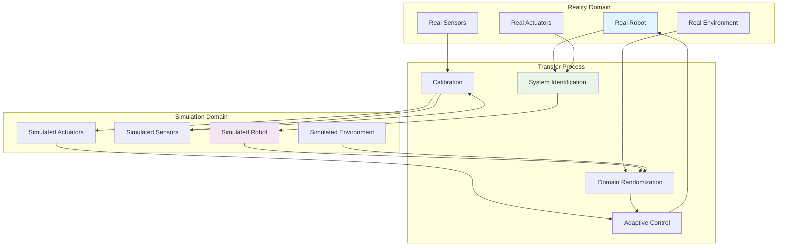

import Tabs from '@theme/Tabs';
import TabItem from '@theme/TabItem';

## Learning Outcomes

After completing this chapter, you will be able to:
1. Identify key differences between simulation and reality that affect robot performance
2. Apply system identification techniques to model real robot dynamics
3. Implement domain randomization strategies for improved sim-to-real transfer
4. Design and execute simulation-to-reality validation experiments
5. Calibrate sensors to bridge the sim-to-real gap
6. Implement adaptive control strategies that work in both domains
7. Evaluate the effectiveness of sim-to-real transfer using quantitative metrics
8. Apply transfer learning techniques to adapt simulation-trained policies to real robots

## Gherkin Specifications

### Scenario 1: System Identification
- **Given** a real robot with unknown dynamics
- **When** system identification procedures are applied
- **Then** accurate models of real robot behavior are obtained

### Scenario 2: Simulation-to-Reality Validation
- **Given** a robot policy trained in simulation
- **When** the policy is transferred and tested on a real robot
- **Then** the performance degradation is within acceptable bounds

### Scenario 3: Sensor Calibration
- **Given** simulation and real sensor data
- **When** calibration procedures are applied
- **Then** the sensors provide consistent measurements across domains

### Scenario 4: Domain Randomization
- **Given** a simulation with randomized parameters
- **When** policies are trained in the randomized environment
- **Then** they perform better on real robots than policies trained in fixed simulation

### Scenario 5: Adaptive Control Implementation
- **Given** a control policy with adaptation capabilities
- **When** deployed on a real robot with model discrepancies
- **Then** the controller adapts and maintains performance

## Theory & Intuition

Think of connecting simulation to reality like training an athlete in a gym before they compete in real games. The gym provides a controlled, repeatable environment to build skills and fitness, but the real competition has factors not present in the gym - weather, crowd noise, different playing surfaces, and unpredictable opponents.

In robotics, simulation is our "training gym," providing a safe, controllable environment to develop and test algorithms. However, when moving to the "real game" (the actual robot), we encounter differences like sensor noise characteristics that don't match simulation, actuator response times that vary, surface friction properties that differ, and environmental conditions not captured in the model.

The key insight is that we need to make our simulation more "realistic" not by making it perfectly accurate (which is impossible), but by making it varied enough that our robot learns to handle the types of differences it will encounter in reality. It's like training an athlete with various conditions in the gym so they're prepared for anything on the field.

## Core Concepts

<Tabs
  defaultValue="diagram"
  values={[
    {label: 'Sim-to-Real Transfer Framework', value: 'diagram'},
    {label: 'Transfer Challenges', value: 'table'},
  ]}>
  <TabItem value="diagram">



  </TabItem>
  <TabItem value="table">

| Challenge | Simulation | Reality | Mitigation Strategy |
|-----------|------------|---------|-------------------|
| Sensor Noise | Gaussian, predictable | Complex, variable | Advanced noise modeling |
| Actuator Dynamics | Ideal response | Delay, saturation | System identification |
| Contact Mechanics | Simplified | Complex friction, compliance | Real-world tuning |
| Environmental Conditions | Controlled | Changing conditions | Domain randomization |

  </TabItem>
</Tabs>

## Hands-On Labs

<Tabs
  defaultValue="lab1"
  values={[
    {label: 'Lab 1: System Identification', value: 'lab1'},
    {label: 'Lab 2: Simulation-to-Reality Validation', value: 'lab2'},
    {label: 'Lab 3: Adaptive Control Implementation', value: 'lab3'},
  ]}>
  <TabItem value="lab1">

### Lab 1: System Identification

#### Objective
Perform system identification on a physical or simulated robot to model real dynamics.

#### Required Components
- Robot platform (physical or simulated)
- Data collection tools
- System identification libraries (e.g., MATLAB, Python Control Systems Library)
- Signal generation and analysis tools

#### Steps
1. Set up the robot platform:
   - For simulation: Use Gazebo with a differential drive robot model
   - For real robot: Use a physical robot with ROS 2 interface
   - Ensure access to motor commands and encoder feedback

2. Create a data collection node:
   ```bash
   cd ~/simulation_ws/src
   ros2 pkg create --build-type ament_python system_identification --dependencies rclpy geometry_msgs sensor_msgs std_msgs
   ```

3. Create the system identification node:
   ```bash
   nano ~/simulation_ws/src/system_identification/system_identification/identification_node.py
   ```

4. Add the following code:
   ```python
   #!/usr/bin/env python3
   import rclpy
   from rclpy.node import Node
   from geometry_msgs.msg import Twist
   from nav_msgs.msg import Odometry
   from sensor_msgs.msg import JointState
   import numpy as np
   import matplotlib.pyplot as plt
   import csv
   import os
   from collections import deque
   import time

   class SystemIdentificationNode(Node):
       def __init__(self):
           super().__init__('system_identification_node')

           # Parameters
           self.declare_parameter('experiment_duration', 30.0)  # seconds
           self.declare_parameter('sampling_rate', 50.0)  # Hz
           self.declare_parameter('max_velocity', 0.5)  # m/s
           self.declare_parameter('output_file', '/tmp/system_identification_data.csv')

           self.experiment_duration = self.get_parameter('experiment_duration').value
           self.sampling_rate = self.get_parameter('sampling_rate').value
           self.max_velocity = self.get_parameter('max_velocity').value
           self.output_file = self.get_parameter('output_file').value

           # Data storage
           self.timestamps = deque(maxlen=2000)
           self.left_wheel_pos = deque(maxlen=2000)
           self.right_wheel_pos = deque(maxlen=2000)
           self.left_wheel_vel = deque(maxlen=2000)
           self.right_wheel_vel = deque(maxlen=2000)
           self.linear_cmd = deque(maxlen=2000)
           self.angular_cmd = deque(maxlen=2000)

           # Robot state
           self.current_time = time.time()
           self.experiment_start_time = None
           self.experiment_complete = False
           
           # Command publisher
           self.cmd_publisher = self.create_publisher(Twist, '/cmd_vel', 10)
           
           # Subscribers
           self.odom_subscriber = self.create_subscription(
               Odometry, '/odom', self.odom_callback, 10)
           self.joint_state_subscriber = self.create_subscription(
               JointState, '/joint_states', self.joint_state_callback, 10)

           # Timers
           self.cmd_timer = self.create_timer(1.0/self.sampling_rate, self.send_command)
           self.data_recording_timer = self.create_timer(1.0/self.sampling_rate, self.record_data)
           self.experiment_timer = self.create_timer(1.0, self.check_experiment_status)

           self.get_logger().info('System identification node initialized')
           self.get_logger().info(f'Starting experiment for {self.experiment_duration} seconds')

       def odom_callback(self, msg):
           """Callback for odometry messages"""
           # Store pose and twist data
           self.odom_linear_x = msg.twist.twist.linear.x
           self.odom_angular_z = msg.twist.twist.angular.z

       def joint_state_callback(self, msg):
           """Callback for joint state messages"""
           try:
               # Find left and right wheel positions and velocities
               left_idx = msg.name.index('left_wheel_joint')
               right_idx = msg.name.index('right_wheel_joint')
               
               self.left_wheel_pos.append(msg.position[left_idx])
               self.right_wheel_pos.append(msg.position[right_idx])
               self.left_wheel_vel.append(msg.velocity[left_idx])
               self.right_wheel_vel.append(msg.velocity[right_idx])
           except ValueError:
               # Joint names not found, warn but continue
               self.get_logger().warn('Wheel joint names not found in joint states')

       def send_command(self):
           """Send periodic commands to excite system dynamics"""
           if self.experiment_complete:
               # Stop the robot
               stop_cmd = Twist()
               self.cmd_publisher.publish(stop_cmd)
               return

           if self.experiment_start_time is None:
               # Start timing when first valid data is received
               if len(self.left_wheel_pos) > 0:
                   self.experiment_start_time = time.time()
                   self.start_time = self.experiment_start_time
               return

           # Generate exciting signal (sum of sine waves of different frequencies)
           current_time = time.time() - self.experiment_start_time
           elapsed = time.time() - self.start_time
           
           if elapsed > self.experiment_duration:
               self.experiment_complete = True
               self.get_logger().info('Experiment complete, saving data...')
               self.save_data()
               return

           # Create a multisine input signal to excite multiple frequencies
           freq1 = 0.2  # Hz
           freq2 = 0.5
           freq3 = 1.0
           
           # Linear velocity command (forward/backward)
           linear_cmd = (
               0.3 * np.sin(2 * np.pi * freq1 * current_time) +
               0.2 * np.sin(2 * np.pi * freq2 * current_time) +
               0.1 * np.sin(2 * np.pi * freq3 * current_time)
           )
           linear_cmd = np.clip(linear_cmd, -self.max_velocity, self.max_velocity)

           # Angular velocity command (turning)
           angular_cmd = (
               0.4 * np.sin(2 * np.pi * freq1 * current_time + np.pi/4) +
               0.1 * np.sin(2 * np.pi * freq3 * current_time + np.pi/2)
           )
           angular_cmd = np.clip(angular_cmd, -0.5, 0.5)

           # Create and publish command
           cmd = Twist()
           cmd.linear.x = linear_cmd
           cmd.angular.z = angular_cmd
           
           self.cmd_publisher.publish(cmd)

           # Store commands for later analysis
           self.linear_cmd.append(cmd.linear.x)
           self.angular_cmd.append(cmd.angular.z)

       def record_data(self):
           """Record sensor data for system identification"""
           if len(self.left_wheel_pos) > 0:
               self.timestamps.append(time.time())

       def check_experiment_status(self):
           """Check and report experiment status"""
           if not self.experiment_complete and self.experiment_start_time:
               elapsed = time.time() - self.experiment_start_time
               remaining = max(0, self.experiment_duration - elapsed)
               self.get_logger().info(f'Experiment time remaining: {remaining:.1f}s')

       def save_data(self):
           """Save collected data to CSV file"""
           if len(self.timestamps) == 0:
               self.get_logger().error('No data collected!')
               return

           # Prepare data arrays
           n_samples = min(
               len(self.timestamps),
               len(self.left_wheel_pos),
               len(self.right_wheel_pos),
               len(self.left_wheel_vel),
               len(self.right_wheel_vel),
               len(self.linear_cmd),
               len(self.angular_cmd)
           )
           
           if n_samples == 0:
               self.get_logger().error('No complete data samples!')
               return
               
           # Truncate all deques to the same length
           timestamps = list(self.timestamps)[-n_samples:]
           left_pos = list(self.left_wheel_pos)[-n_samples:]
           right_pos = list(self.right_wheel_pos)[-n_samples:]
           left_vel = list(self.left_wheel_vel)[-n_samples:]
           right_vel = list(self.right_wheel_vel)[-n_samples:]
           linear_cmd = list(self.linear_cmd)[-n_samples:]
           angular_cmd = list(self.angular_cmd)[-n_samples:]

           # Write to CSV
           with open(self.output_file, 'w', newline='') as csvfile:
               fieldnames = ['timestamp', 'linear_cmd', 'angular_cmd', 
                           'left_wheel_pos', 'right_wheel_pos',
                           'left_wheel_vel', 'right_wheel_vel']
               writer = csv.DictWriter(csvfile, fieldnames=fieldnames)

               writer.writeheader()
               for i in range(n_samples):
                   writer.writerow({
                       'timestamp': timestamps[i],
                       'linear_cmd': linear_cmd[i],
                       'angular_cmd': angular_cmd[i],
                       'left_wheel_pos': left_pos[i],
                       'right_wheel_pos': right_pos[i],
                       'left_wheel_vel': left_vel[i],
                       'right_wheel_vel': right_vel[i]
                   })

           self.get_logger().info(f'Data saved to {self.output_file}')
           self.get_logger().info(f'Collected {n_samples} data points')

   def main(args=None):
       rclpy.init(args=args)
       node = SystemIdentificationNode()
       
       try:
           rclpy.spin(node)
       except KeyboardInterrupt:
           node.get_logger().info('Interrupted, saving data...')
           node.save_data()
       finally:
           node.destroy_node()
           rclpy.shutdown()

   if __name__ == '__main__':
       main()
   ```

5. Create a launch file for the system identification experiment:
   ```bash
   mkdir -p ~/simulation_ws/src/system_identification/launch
   nano ~/simulation_ws/src/system_identification/launch/system_id.launch.py
   ```

6. Add the launch file content:
   ```python
   import os
   from launch import LaunchDescription
   from launch.actions import DeclareLaunchArgument, IncludeLaunchDescription
   from launch.launch_description_sources import PythonLaunchDescriptionSource
   from launch.substitutions import LaunchConfiguration, PathJoinSubstitution
   from launch_ros.actions import Node
   from launch_ros.substitutions import FindPackageShare

   def generate_launch_description():
       # Declare launch arguments
       experiment_duration = DeclareLaunchArgument(
           'experiment_duration',
           default_value='30.0',
           description='Duration of identification experiment in seconds'
       )

       sampling_rate = DeclareLaunchArgument(
           'sampling_rate',
           default_value='50.0',
           description='Sampling rate for data collection in Hz'
       )

       # Get parameters
       duration = LaunchConfiguration('experiment_duration')
       rate = LaunchConfiguration('sampling_rate')

       # Launch the system identification node
       system_id_node = Node(
           package='system_identification',
           executable='identification_node',
           name='system_identification_node',
           parameters=[
               {'experiment_duration': duration},
               {'sampling_rate': rate},
               {'output_file': '/tmp/system_identification_data.csv'}
           ],
           output='screen'
       )

       return LaunchDescription([
           experiment_duration,
           sampling_rate,
           system_id_node
       ])
   ```

7. Update setup.py:
   ```bash
   nano ~/simulation_ws/src/system_identification/setup.py
   ```

8. Add the entry point:
   ```python
   entry_points={
       'console_scripts': [
           'identification_node = system_identification.identification_node:main',
       ],
   }
   ```

9. Make the file executable and build:
   ```bash
   chmod +x ~/simulation_ws/src/system_identification/system_identification/identification_node.py
   cd ~/simulation_ws
   colcon build --packages-select system_identification
   source install/setup.bash
   ```

10. Run the system identification experiment:
    ```bash
    ros2 launch system_identification system_id.launch.py
    ```

#### Expected Outcome
A complete data set collected from the robot's response to various commands, suitable for system identification analysis.

  </TabItem>
  <TabItem value="lab2">

### Lab 2: Simulation-to-Reality Validation

#### Objective
Validate a control policy in both simulation and reality, comparing performance metrics.

#### Required Components
- Robot simulation environment (Gazebo)
- Robot with ROS 2 interface
- Performance evaluation tools
- Control policy implementation

#### Steps
1. Create a validation package:
   ```bash
   cd ~/simulation_ws/src
   ros2 pkg create --build-type ament_python sim_to_real_validation --dependencies rclpy geometry_msgs nav_msgs sensor_msgs std_msgs tf2_ros
   ```

2. Create a validation node:
   ```bash
   nano ~/simulation_ws/src/sim_to_real_validation/sim_to_real_validation/validation_node.py
   ```

3. Add the validation implementation:
   ```python
   #!/usr/bin/env python3
   import rclpy
   from rclpy.node import Node
   from geometry_msgs.msg import Twist, PoseStamped, Point
   from nav_msgs.msg import Odometry
   from sensor_msgs.msg import LaserScan
   from tf2_ros import TransformException
   from tf2_ros.buffer import Buffer
   from tf2_ros.transform_listener import TransformListener
   import numpy as np
   import math
   import time
   import statistics
   from collections import deque

   class SimRealValidationNode(Node):
       def __init__(self):
           super().__init__('sim_real_validation_node')

           # Parameters
           self.declare_parameter('validation_duration', 60.0)  # seconds
           self.declare_parameter('waypoint_tolerance', 0.3)  # meters
           self.declare_parameter('max_linear_vel', 0.5)  # m/s
           self.declare_parameter('max_angular_vel', 1.0)  # rad/s

           self.validation_duration = self.get_parameter('validation_duration').value
           self.waypoint_tolerance = self.get_parameter('waypoint_tolerance').value
           self.max_linear_vel = self.get_parameter('max_linear_vel').value
           self.max_angular_vel = self.get_parameter('max_angular_vel').value

           # Waypoints for validation route
           self.waypoints = [
               Point(x=1.0, y=0.0, z=0.0),
               Point(x=1.0, y=1.0, z=0.0),
               Point(x=0.0, y=1.0, z=0.0),
               Point(x=0.0, y=0.0, z=0.0),
           ]
           self.current_waypoint_idx = 0

           # Metrics tracking
           self.path_errors = deque(maxlen=1000)
           self.velocity_errors = deque(maxlen=1000)
           self.execution_times = deque(maxlen=100)
           self.collision_count = 0
           self.start_time = time.time()
           self.validation_start_time = time.time()
           self.route_completed = False

           # Robot state
           self.current_pose = None
           self.current_twist = None
           self.current_scan = None

           # TF2 buffer and listener
           self.tf_buffer = Buffer()
           self.tf_listener = TransformListener(self.tf_buffer, self)

           # Publishers and subscribers
           self.cmd_publisher = self.create_publisher(Twist, '/cmd_vel', 10)
           self.odom_subscriber = self.create_subscription(
               Odometry, '/odom', self.odom_callback, 10)
           self.scan_subscriber = self.create_subscription(
               LaserScan, '/scan', self.scan_callback, 10)

           # Timer for validation logic
           self.control_timer = self.create_timer(0.1, self.validation_control)
           self.metrics_timer = self.create_timer(1.0, self.publish_metrics)

           # Create a simple navigation goal
           self.navigation_complete = False

           self.get_logger().info('Sim-to-real validation node initialized')
           self.get_logger().info(f'Validation route: {len(self.waypoints)} waypoints')

       def odom_callback(self, msg):
           """Update robot state from odometry"""
           self.current_pose = msg.pose.pose
           self.current_twist = msg.twist.twist

           # Calculate path following error if possible
           if self.current_waypoint_idx < len(self.waypoints):
               target = self.waypoints[self.current_waypoint_idx]
               current_x = msg.pose.pose.position.x
               current_y = msg.pose.pose.position.y
               
               distance = math.sqrt((current_x - target.x)**2 + (current_y - target.y)**2)
               self.path_errors.append(distance)

       def scan_callback(self, msg):
           """Process laser scan for collision detection"""
           self.current_scan = msg
           
           # Check for obstacles in front of robot (simplified)
           if msg.ranges:
               front_range = msg.ranges[len(msg.ranges)//2]  # Middle reading
               if front_range < 0.3:  # Collision threshold
                   self.collision_count += 1

       def validation_control(self):
           """Main validation control logic"""
           if self.route_completed:
               # Stop the robot
               stop_cmd = Twist()
               self.cmd_publisher.publish(stop_cmd)
               return

           if not self.current_pose:
               return

           # Check if we've reached the current waypoint
           current_pos = self.current_pose.position
           target = self.waypoints[self.current_waypoint_idx]
           distance = math.sqrt((current_pos.x - target.x)**2 + (current_pos.y - target.y)**2)

           if distance < self.waypoint_tolerance:
               self.get_logger().info(f'Reached waypoint {self.current_waypoint_idx}')
               self.current_waypoint_idx += 1

               # Check if route is complete
               if self.current_waypoint_idx >= len(self.waypoints):
                   self.get_logger().info('Route completed!')
                   self.route_completed = True
                   self.route_completion_time = time.time() - self.validation_start_time
                   return

           # Calculate navigation command towards next waypoint
           cmd_vel = self.calculate_navigation_cmd(current_pos, target)
           self.cmd_publisher.publish(cmd_vel)

           # Check validation timeout
           elapsed = time.time() - self.validation_start_time
           if elapsed > self.validation_duration:
               self.get_logger().info('Validation timeout reached')
               self.route_completed = True

       def calculate_navigation_cmd(self, current_pos, target_pos):
           """Calculate velocity command to navigate towards target"""
           cmd = Twist()

           # Calculate direction to goal
           dx = target_pos.x - current_pos.x
           dy = target_pos.y - current_pos.y
           distance = math.sqrt(dx**2 + dy**2)

           if distance > 0.1:  # If not close to goal
               # Normalize direction vector
               dx_norm = dx / distance
               dy_norm = dy / distance

               # Set linear velocity proportional to distance (slow down when close)
               cmd.linear.x = min(self.max_linear_vel, distance * 0.5)

               # Calculate robot's current yaw
               current_yaw = self.get_robot_yaw()

               # Calculate required yaw to face target
               target_yaw = math.atan2(dy, dx)
               angle_diff = self.normalize_angle(target_yaw - current_yaw)

               # Set angular velocity to turn towards target
               cmd.angular.z = max(-self.max_angular_vel, min(self.max_angular_vel, angle_diff * 2.0))
           else:
               # Near goal, stop
               cmd.linear.x = 0.0
               cmd.angular.z = 0.0

           return cmd

       def get_robot_yaw(self):
           """Get the robot's yaw angle using TF2"""
           try:
               # Try to get transform from map to base_link (for real robot) or odom to base_link (for sim)
               t = self.tf_buffer.lookup_transform(
                   'odom',  # or 'map' for real robot
                   'base_link',
                   rclpy.time.Time(),
                   rclpy.duration.Duration(seconds=1.0))
               
               # Extract yaw from quaternion
               import tf_transformations
               quat = [
                   t.transform.rotation.x,
                   t.transform.rotation.y,
                   t.transform.rotation.z,
                   t.transform.rotation.w
               ]
               euler = tf_transformations.euler_from_quaternion(quat)
               return euler[2]  # yaw
           except TransformException as ex:
               self.get_logger().warn(f'Transform lookup failed: {ex}')
               return 0.0

       def normalize_angle(self, angle):
           """Normalize angle to [-pi, pi]"""
           while angle > math.pi:
               angle -= 2.0 * math.pi
           while angle < -math.pi:
               angle += 2.0 * math.pi
           return angle

       def publish_metrics(self):
           """Publish validation metrics"""
           if not self.path_errors:
               return

           # Calculate metrics
           avg_error = statistics.mean(list(self.path_errors))
           max_error = max(list(self.path_errors))
           std_error = statistics.stdev(list(self.path_errors)) if len(self.path_errors) > 1 else 0

           elapsed = time.time() - self.validation_start_time

           self.get_logger().info(
               f'Validation Metrics (Time: {elapsed:.1f}s): '
               f'Avg Error: {avg_error:.3f}m, '
               f'Max Error: {max_error:.3f}m, '
               f'Std Error: {std_error:.3f}m, '
               f'Collisions: {self.collision_count}, '
               f'Waypoint: {self.current_waypoint_idx}/{len(self.waypoints)}'
           )

           # In a real implementation, these would be published as ROS messages
           # For now, we just log them

       def get_validation_report(self):
           """Generate validation report"""
           if not self.path_errors:
               return "No data collected for validation"

           # Calculate final metrics
           avg_error = statistics.mean(list(self.path_errors))
           std_error = statistics.stdev(list(self.path_errors)) if len(self.path_errors) > 1 else 0
           max_error = max(list(self.path_errors)) if self.path_errors else 0
           route_success = self.current_waypoint_idx >= len(self.waypoints)

           report = f"""
           Sim-to-Real Validation Report
           =============================
           Route Success: {route_success}
           Average Path Error: {avg_error:.3f}m
           Standard Deviation: {std_error:.3f}m
           Max Path Error: {max_error:.3f}m
           Collisions: {self.collision_count}
           Elapsed Time: {time.time() - self.validation_start_time:.1f}s
           Waypoints Completed: {self.current_waypoint_idx}/{len(self.waypoints)}
           """

           return report

   def main(args=None):
       rclpy.init(args=args)
       node = SimRealValidationNode()

       try:
           rclpy.spin(node)
       except KeyboardInterrupt:
           node.get_logger().info('Validation interrupted, generating report...')
           report = node.get_validation_report()
           node.get_logger().info(report)
       finally:
           node.destroy_node()
           rclpy.shutdown()

   if __name__ == '__main__':
       main()
   ```

4. Create a performance analysis script:
   ```bash
   nano ~/simulation_ws/src/sim_to_real_validation/sim_to_real_validation/performance_analyzer.py
   ```

5. Add the performance analysis code:
   ```python
   #!/usr/bin/env python3
   import rclpy
   from rclpy.node import Node
   from std_msgs.msg import Float32MultiArray
   from geometry_msgs.msg import PoseStamped
   import numpy as np
   import matplotlib.pyplot as plt
   from scipy.spatial.distance import cdist
   import math
   import time

   class PerformanceAnalyzer(Node):
       def __init__(self):
           super().__init__('performance_analyzer')

           # Subscribe to validation metrics from both sim and real
           self.sim_metrics_sub = self.create_subscription(
               Float32MultiArray, '/sim_metrics', self.sim_metrics_callback, 10)
           self.real_metrics_sub = self.create_subscription(
               Float32MultiArray, '/real_metrics', self.real_metrics_callback, 10)

           # Store metrics for comparison
           self.sim_data = {'path_errors': [], 'velocities': [], 'times': []}
           self.real_data = {'path_errors': [], 'velocities': [], 'times': []}

           # Analysis timer
           self.analysis_timer = self.create_timer(5.0, self.perform_analysis)

           self.get_logger().info('Performance analyzer initialized')

       def sim_metrics_callback(self, msg):
           """Process simulation metrics"""
           if len(msg.data) >= 3:
               self.sim_data['path_errors'].append(msg.data[0])
               self.sim_data['velocities'].append(msg.data[1])
               self.sim_data['times'].append(msg.data[2])

       def real_metrics_callback(self, msg):
           """Process real robot metrics"""
           if len(msg.data) >= 3:
               self.real_data['path_errors'].append(msg.data[0])
               self.real_data['velocities'].append(msg.data[1])
               self.real_data['times'].append(msg.data[2])

       def perform_analysis(self):
           """Perform comparison analysis"""
           if len(self.sim_data['path_errors']) == 0 or len(self.real_data['path_errors']) == 0:
               return

           # Calculate similarity metrics
           sim_avg_error = np.mean(self.sim_data['path_errors'])
           real_avg_error = np.mean(self.real_data['path_errors'])
           
           sim_std_error = np.std(self.sim_data['path_errors'])
           real_std_error = np.std(self.real_data['path_errors'])
           
           # Calculate relative difference
           avg_error_diff = abs(sim_avg_error - real_avg_error)
           rel_avg_error_diff = avg_error_diff / max(sim_avg_error, real_avg_error) if max(sim_avg_error, real_avg_error) > 0 else 0
           
           # Calculate correlation between sim and real (if the same length)
           min_len = min(len(self.sim_data['path_errors']), len(self.real_data['path_errors']))
           if min_len > 1:
               sim_errors = np.array(self.sim_data['path_errors'][-min_len:])
               real_errors = np.array(self.real_data['path_errors'][-min_len:])
               correlation = np.corrcoef(sim_errors, real_errors)[0, 1]
           else:
               correlation = 0.0

           self.get_logger().info(
               f'Sim-to-Real Performance Analysis:\n'
               f'  Simulation Avg Error: {sim_avg_error:.3f}m (std: {sim_std_error:.3f})\n'
               f'  Reality Avg Error: {real_avg_error:.3f}m (std: {real_std_error:.3f})\n'
               f'  Relative Avg Error Diff: {rel_avg_error_diff:.3f} ({rel_avg_error_diff*100:.1f}%)\n'
               f'  Correlation (path errors): {correlation:.3f}'
           )

       def generate_report(self):
           """Generate detailed performance report"""
           if len(self.sim_data['path_errors']) == 0 or len(self.real_data['path_errors']) == 0:
               self.get_logger().info('Not enough data for report')
               return

           # Create plots comparing sim vs. real performance
           fig, ((ax1, ax2), (ax3, ax4)) = plt.subplots(2, 2, figsize=(12, 10))
           
           # Path error comparison
           ax1.plot(self.sim_data['times'], self.sim_data['path_errors'], label='Simulation', alpha=0.7)
           ax1.plot(self.real_data['times'], self.real_data['path_errors'], label='Reality', alpha=0.7)
           ax1.set_title('Path Following Error Over Time')
           ax1.set_xlabel('Time (s)')
           ax1.set_ylabel('Error (m)')
           ax1.legend()
           ax1.grid(True, alpha=0.3)

           # Velocity comparison
           ax2.plot(self.sim_data['times'], self.sim_data['velocities'], label='Simulation', alpha=0.7)
           ax2.plot(self.real_data['times'], self.real_data['velocities'], label='Reality', alpha=0.7)
           ax2.set_title('Velocity Comparison')
           ax2.set_xlabel('Time (s)')
           ax2.set_ylabel('Velocity (m/s)')
           ax2.legend()
           ax2.grid(True, alpha=0.3)

           # Histogram of errors
           ax3.hist(self.sim_data['path_errors'], bins=30, alpha=0.5, label='Simulation', density=True)
           ax3.hist(self.real_data['path_errors'], bins=30, alpha=0.5, label='Reality', density=True)
           ax3.set_title('Distribution of Path Errors')
           ax3.set_xlabel('Error (m)')
           ax3.set_ylabel('Density')
           ax3.legend()
           ax3.grid(True, alpha=0.3)

           # Error scatter plot
           min_len = min(len(self.sim_data['path_errors']), len(self.real_data['path_errors']))
           if min_len > 0:
               ax4.scatter(
                   self.sim_data['path_errors'][-min_len:], 
                   self.real_data['path_errors'][-min_len:], 
                   alpha=0.5
               )
               ax4.set_title('Sim vs Real Path Error Correlation')
               ax4.set_xlabel('Simulation Error (m)')
               ax4.set_ylabel('Reality Error (m)')
               ax4.grid(True, alpha=0.3)
               
               # Add diagonal line
               max_error = max(
                   max(self.sim_data['path_errors'][-min_len:], default=0),
                   max(self.real_data['path_errors'][-min_len:], default=0)
               )
               ax4.plot([0, max_error], [0, max_error], 'r--', alpha=0.8, label='Perfect Correlation')
               ax4.legend()

           plt.tight_layout()
           plt.savefig('/tmp/sim_real_comparison.png')
           self.get_logger().info('Performance comparison plot saved to /tmp/sim_real_comparison.png')
           plt.show()

   def main(args=None):
       rclpy.init(args=args)
       analyzer = PerformanceAnalyzer()

       try:
           rclpy.spin(analyzer)
       except KeyboardInterrupt:
           analyzer.get_logger().info('Generating performance report...')
           analyzer.generate_report()
       finally:
           analyzer.destroy_node()
           rclpy.shutdown()

   if __name__ == '__main__':
       main()
   ```

6. Update setup.py for both executables:
   ```bash
   nano ~/simulation_ws/src/sim_to_real_validation/setup.py
   ```

7. Add both entry points:
   ```python
   entry_points={
       'console_scripts': [
           'validation_node = sim_to_real_validation.validation_node:main',
           'performance_analyzer = sim_to_real_validation.performance_analyzer:main',
       ],
   }
   ```

8. Make the files executable and build:
   ```bash
   chmod +x ~/simulation_ws/src/sim_to_real_validation/sim_to_real_validation/validation_node.py
   chmod +x ~/simulation_ws/src/sim_to_real_validation/sim_to_real_validation/performance_analyzer.py
   cd ~/simulation_ws
   colcon build --packages-select sim_to_real_validation
   source install/setup.bash
   ```

9. Launch the validation experiment:
   ```bash
   ros2 run sim_to_real_validation validation_node
   ```

#### Expected Outcome
Quantitative comparison between simulation and reality performance metrics, with analysis of differences and correlations.

  </TabItem>
  <TabItem value="lab3">

### Lab 3: Adaptive Control Implementation

#### Objective
Implement an adaptive control algorithm that adjusts to differences between simulation and reality.

#### Required Components
- Robot platform
- Controller implementation
- Parameter adaptation mechanisms

#### Steps
1. Create an adaptive control package:
   ```bash
   cd ~/simulation_ws/src
   ros2 pkg create --build-type ament_python adaptive_control --dependencies rclpy geometry_msgs nav_msgs sensor_msgs std_msgs
   ```

2. Create the adaptive controller:
   ```bash
   nano ~/simulation_ws/src/adaptive_control/adaptive_control/adaptive_controller.py
   ```

3. Add the adaptive control implementation:
   ```python
   #!/usr/bin/env python3
   import rclpy
   from rclpy.node import Node
   from geometry_msgs.msg import Twist, Vector3
   from nav_msgs.msg import Odometry
   from sensor_msgs.msg import LaserScan, JointState
   import numpy as np
   import math
   import time
   from collections import deque

   class AdaptiveController(Node):
       def __init__(self):
           super().__init__('adaptive_controller')

           # Parameters
           self.declare_parameter('control_frequency', 50.0)  # Hz
           self.declare_parameter('adaptation_rate', 0.01)
           self.declare_parameter('error_threshold', 0.2)  # adaptive control threshold
           self.declare_parameter('max_adaptation', 0.5)  # maximum parameter change

           self.control_frequency = self.get_parameter('control_frequency').value
           self.adaptation_rate = self.get_parameter('adaptation_rate').value
           self.error_threshold = self.get_parameter('error_threshold').value
           self.max_adaptation = self.get_parameter('max_adaptation').value

           # Robot state
           self.current_pose = None
           self.current_twist = None
           self.current_scan = None
           self.joint_positions = []
           self.joint_velocities = []

           # Adaptive control parameters
           self.base_linear_gain = 1.0
           self.base_angular_gain = 2.0
           self.linear_gain_adaptation = 0.0  # Adaptive component
           self.angular_gain_adaptation = 0.0  # Adaptive component
           
           # Reference model parameters (desired behavior)
           self.reference_linear_vel = 0.0
           self.reference_angular_vel = 0.0
           
           # Tracking errors
           self.linear_error_history = deque(maxlen=50)
           self.angular_error_history = deque(maxlen=50)
           self.position_error_history = deque(maxlen=50)
           
           # Command publishers and subscribers
           self.cmd_publisher = self.create_publisher(Twist, '/cmd_vel', 10)
           self.odom_subscriber = self.create_subscription(
               Odometry, '/odom', self.odom_callback, 10)
           self.scan_subscriber = self.create_subscription(
               LaserScan, '/scan', self.scan_callback, 10)
           self.joint_state_subscriber = self.create_subscription(
               JointState, '/joint_states', self.joint_state_callback, 10)

           # Timer for control loop
           self.control_timer = self.create_timer(1.0/self.control_frequency, self.adaptive_control_loop)

           self.get_logger().info('Adaptive controller initialized')
           self.get_logger().info(f'Base linear gain: {self.base_linear_gain}, angular gain: {self.base_angular_gain}')

       def odom_callback(self, msg):
           """Update robot state from odometry"""
           self.current_pose = msg.pose.pose
           self.current_twist = msg.twist.twist

       def scan_callback(self, msg):
           """Process laser scan for obstacle detection"""
           self.current_scan = msg

       def joint_state_callback(self, msg):
           """Update joint states"""
           self.joint_positions = msg.position
           self.joint_velocities = msg.velocity

       def adaptive_control_loop(self):
           """Main adaptive control loop"""
           if not self.current_twist:
               return

           # Calculate desired command (for example, follow a simple trajectory)
           desired_linear, desired_angular = self.calculate_desired_command()

           # Calculate tracking error
           actual_linear = self.current_twist.linear.x
           actual_angular = self.current_twist.angular.z
           
           linear_error = desired_linear - actual_linear
           angular_error = desired_angular - actual_angular
           
           self.linear_error_history.append(linear_error)
           self.angular_error_history.append(angular_error)

           # Update adaptive parameters based on error
           self.update_adaptive_parameters(linear_error, angular_error)

           # Calculate adaptive control command
           adaptive_cmd = self.calculate_adaptive_command(
               desired_linear, desired_angular, 
               linear_error, angular_error
           )

           # Apply obstacle avoidance if needed
           if self.current_scan:
               adaptive_cmd = self.obstacle_avoidance(adaptive_cmd)

           # Publish command
           self.cmd_publisher.publish(adaptive_cmd)

           # Log adaptive parameters
           current_time = time.time()
           if int(current_time) % 5 == 0:  # Log every 5 seconds
               self.get_logger().info(
                   f'Adaptive Params - Linear: {self.base_linear_gain + self.linear_gain_adaptation:.3f}, '
                   f'Angular: {self.base_angular_gain + self.angular_gain_adaptation:.3f}, '
                   f'Errors - Lin: {linear_error:.3f}, Ang: {angular_error:.3f}'
               )

       def calculate_desired_command(self):
           """Calculate desired velocity command (example: simple oscillating motion)"""
           t = time.time()
           
           # Example: oscillating motion pattern
           desired_linear = 0.3 + 0.1 * math.sin(0.5 * t)  # 0.3 m/s base with 0.1 m/s oscillation
           desired_angular = 0.2 * math.sin(1.0 * t)       # oscillating turn
           
           return desired_linear, desired_angular

       def update_adaptive_parameters(self, linear_error, angular_error):
           """Update adaptive control parameters based on tracking error"""
           # Simple gradient-based adaptation
           # Adjust linear gain adaptation
           avg_linear_error = np.mean(list(self.linear_error_history)) if self.linear_error_history else 0
           linear_gain_update = self.adaptation_rate * avg_linear_error * self.base_linear_gain
           linear_gain_update = np.clip(linear_gain_update, -self.max_adaptation, self.max_adaptation)
           self.linear_gain_adaptation += linear_gain_update
           
           # Adjust angular gain adaptation
           avg_angular_error = np.mean(list(self.angular_error_history)) if self.angular_error_history else 0
           angular_gain_update = self.adaptation_rate * avg_angular_error * self.base_angular_gain
           angular_gain_update = np.clip(angular_gain_update, -self.max_adaptation, self.max_adaptation)
           self.angular_gain_adaptation += angular_gain_update
           
           # Constrain adaptation to reasonable bounds
           max_total_adaptation = 0.5  # Limit total adaptation
           self.linear_gain_adaptation = np.clip(self.linear_gain_adaptation, 
                                                -max_total_adaptation, max_total_adaptation)
           self.angular_gain_adaptation = np.clip(self.angular_gain_adaptation, 
                                                 -max_total_adaptation, max_total_adaptation)

       def calculate_adaptive_command(self, desired_linear, desired_angular, linear_error, angular_error):
           """Calculate adaptive control command"""
           cmd = Twist()

           # Apply adaptive gains
           adaptive_linear_gain = self.base_linear_gain + self.linear_gain_adaptation
           adaptive_angular_gain = self.base_angular_gain + self.angular_gain_adaptation

           # Calculate command with adaptive gains
           cmd.linear.x = desired_linear * adaptive_linear_gain
           
           # Add error-based correction term
           cmd.angular.z = desired_angular * adaptive_angular_gain + angular_error * 0.1

           # Apply limits to prevent excessive commands
           cmd.linear.x = np.clip(cmd.linear.x, -0.8, 0.8)
           cmd.angular.z = np.clip(cmd.angular.z, -1.5, 1.5)

           return cmd

       def obstacle_avoidance(self, cmd):
           """Apply obstacle avoidance to control command"""
           if not self.current_scan.ranges:
               return cmd

           # Get distance to obstacles in front, left, right
           ranges = self.current_scan.ranges
           n = len(ranges)

           # Front distance (middle range)
           front_idx = n // 2
           front_dist = ranges[front_idx]

           # Left distance (quarter point)
           left_idx = n // 4
           left_dist = ranges[left_idx]

           # Right distance (three-quarters point)
           right_idx = 3 * n // 4
           right_dist = ranges[right_idx]

           # Safety distance threshold
           safety_dist = 0.5  # meters

           if front_dist < safety_dist:
               # Slow down and turn away from obstacles
               cmd.linear.x *= 0.3  # Reduce speed significantly
               
               # Turn based on which side has more clearance
               if left_dist > right_dist:
                   cmd.angular.z = max(cmd.angular.z, 0.5)  # Turn right
               else:
                   cmd.angular.z = min(cmd.angular.z, -0.5)  # Turn left
           elif left_dist < safety_dist or right_dist < safety_dist:
               # Gentle turning adjustment
               cmd.angular.z *= 0.8  # Reduce turning in tight spaces

           return cmd

   class ModelReferenceAdaptiveController(AdaptiveController):
       """Extended version using Model Reference Adaptive Control (MRAC)"""
       
       def __init__(self):
           super().__init__()
           
           # Reference model parameters
           self.ref_model_poles = [-2.0, -2.0]  # Desired closed-loop dynamics
           self.theta_linear = np.array([1.0, 0.0])  # [gain, offset] for linear velocity
           self.theta_angular = np.array([1.0, 0.0])  # [gain, offset] for angular velocity
           
           # Adaptation gains
           self.gamma_linear = 1.0
           self.gamma_angular = 1.0
           
           # Filter parameters for MRAC
           self.filter_a = 5.0  # Filter bandwidth

       def update_adaptive_parameters(self, linear_error, angular_error):
           """MRAC parameter update law"""
           dt = 1.0 / self.control_frequency
           
           # Get current velocities
           if self.current_twist:
               y_linear = self.current_twist.linear.x
               y_angular = self.current_twist.angular.z
           else:
               y_linear = 0.0
               y_angular = 0.0
               
           # Calculate desired velocities
           r_linear, r_angular = self.calculate_desired_command()
           
           # Reference model states (simplified)
           yr_linear = r_linear  # In steady state, reference approximates output
           yr_angular = r_angular
           
           # Calculate regressor vectors (simplified)
           phi_linear = np.array([r_linear, 1.0])
           phi_angular = np.array([r_angular, 1.0])
           
           # MRAC update law: theta_dot = -gamma * phi * error
           self.theta_linear += self.gamma_linear * phi_linear * linear_error * dt
           self.theta_angular += self.gamma_angular * phi_angular * angular_error * dt
           
           # Apply constraints
           self.theta_linear[0] = np.clip(self.theta_linear[0], 0.5, 2.0)  # Gain constraint
           self.theta_angular[0] = np.clip(self.theta_angular[0], 0.5, 2.0)
           
           # Calculate adaptive control inputs
           u_linear_adapt = np.dot(self.theta_linear, phi_linear)
           u_angular_adapt = np.dot(self.theta_angular, phi_angular)
           
           # Store for logging
           self.linear_adapt_input = u_linear_adapt
           self.angular_adapt_input = u_angular_adapt

       def calculate_adaptive_command(self, desired_linear, desired_angular, linear_error, angular_error):
           """Calculate command using MRAC approach"""
           cmd = Twist()

           # Apply adaptive parameters from MRAC
           cmd.linear.x = self.theta_linear[0] * desired_linear + self.theta_linear[1]
           cmd.angular.z = self.theta_angular[0] * desired_angular + self.theta_angular[1]

           # Apply limits
           cmd.linear.x = np.clip(cmd.linear.x, -0.8, 0.8)
           cmd.angular.z = np.clip(cmd.angular.z, -1.5, 1.5)

           return cmd

   def main(args=None):
       rclpy.init(args=args)
       
       # Use the basic adaptive controller or MRAC version
       controller = AdaptiveController()  # or ModelReferenceAdaptiveController()
       
       try:
           rclpy.spin(controller)
       except KeyboardInterrupt:
           controller.get_logger().info('Adaptive controller stopped')
       finally:
           controller.destroy_node()
           rclpy.shutdown()

   if __name__ == '__main__':
       main()
   ```

4. Create a parameter scheduler for different adaptation strategies:
   ```bash
   nano ~/simulation_ws/src/adaptive_control/adaptive_control/parameter_scheduler.py
   ```

5. Add the parameter scheduling code:
   ```python
   #!/usr/bin/env python3
   import rclpy
   from rclpy.node import Node
   from std_msgs.msg import Float32, Bool
   from geometry_msgs.msg import Twist
   import numpy as np
   import time

   class ParameterScheduler(Node):
       def __init__(self):
           super().__init__('parameter_scheduler')

           # Parameters for adaptation scheduling
           self.declare_parameter('initial_adaptation_rate', 0.1)
           self.declare_parameter('final_adaptation_rate', 0.001)
           self.declare_parameter('adaptation_schedule_duration', 60.0)  # seconds
           
           self.initial_rate = self.get_parameter('initial_adaptation_rate').value
           self.final_rate = self.get_parameter('final_adaptation_rate').value
           self.schedule_duration = self.get_parameter('adaptation_schedule_duration').value

           # Current adaptation rate
           self.current_adaptation_rate = self.initial_rate
           self.start_time = time.time()

           # Publishers for adaptation parameters
           self.adaptation_rate_pub = self.create_publisher(Float32, '/adaptation_rate', 10)
           self.adaptation_enabled_pub = self.create_publisher(Bool, '/adaptation_enabled', 10)

           # Timer to update adaptation parameters
           self.schedule_timer = self.create_timer(1.0, self.update_schedule)

           self.get_logger().info('Parameter scheduler initialized')
           self.get_logger().info(f'Adaptation rate schedule: {self.initial_rate} -> {self.final_rate} over {self.schedule_duration}s')

       def update_schedule(self):
           """Update adaptation parameters based on schedule"""
           elapsed = time.time() - self.start_time
           
           if elapsed >= self.schedule_duration:
               # Schedule completed, keep final rate
               self.current_adaptation_rate = self.final_rate
           else:
               # Linearly decrease adaptation rate over time
               progress = elapsed / self.schedule_duration
               self.current_adaptation_rate = self.initial_rate + \
                   progress * (self.final_rate - self.initial_rate)

           # Create and publish adaptation rate
           rate_msg = Float32()
           rate_msg.data = self.current_adaptation_rate
           self.adaptation_rate_pub.publish(rate_msg)

           # Create and publish adaptation enabled flag
           enabled_msg = Bool()
           enabled_msg.data = True  # Always enabled in this example
           self.adaptation_enabled_pub.publish(enabled_msg)

           self.get_logger().info(f'Scheduled adaptation rate: {self.current_adaptation_rate:.4f}')

   def main(args=None):
       rclpy.init(args=args)
       scheduler = ParameterScheduler()

       try:
           rclpy.spin(scheduler)
       except KeyboardInterrupt:
           scheduler.get_logger().info('Parameter scheduler stopped')
       finally:
           scheduler.destroy_node()
           rclpy.shutdown()

   if __name__ == '__main__':
       main()
   ```

6. Update setup.py:
   ```bash
   nano ~/simulation_ws/src/adaptive_control/setup.py
   ```

7. Add the entry points:
   ```python
   entry_points={
       'console_scripts': [
           'adaptive_controller = adaptive_control.adaptive_controller:main',
           'parameter_scheduler = adaptive_control.parameter_scheduler:main',
       ],
   }
   ```

8. Make the files executable and build:
   ```bash
   chmod +x ~/simulation_ws/src/adaptive_control/adaptive_control/adaptive_controller.py
   chmod +x ~/simulation_ws/src/adaptive_control/adaptive_control/parameter_scheduler.py
   cd ~/simulation_ws
   colcon build --packages-select adaptive_control
   source install/setup.bash
   ```

9. Launch the adaptive control system:
   ```bash
   ros2 run adaptive_control adaptive_controller
   ```

#### Expected Outcome
A controller that adapts its parameters based on the difference between desired and actual robot behavior, providing improved performance in the presence of model uncertainties.

  </TabItem>
</Tabs>

## Sim-to-Real Notes

- **Hardware considerations**: When implementing on real robots, be aware of actuator limitations, sensor noise, and communication delays not present in simulation
- **Differences from simulation**: Real robots have non-ideal dynamics, friction, and disturbances that are challenging to model completely
- **Practical tips**: Start with conservative adaptation rates and validate stability properties of adaptive controllers on real systems

## Multiple Choice Questions

1. What is the 'reality gap' in robotics?
   - A) The physical distance between robots
   - B) Differences between simulation and reality that affect robot performance
   - C) The time delay in robot communication
   - D) The cost difference between sim and real systems

   **Correct Answer: B** - The reality gap refers to differences between simulation and reality that affect robot performance.

2. What is system identification in the context of sim-to-real transfer?
   - A) Determining the type of robot system
   - B) Modeling the actual dynamics of a real robot system
   - C) Identifying robot components
   - D) Classifying robot systems

   **Correct Answer: B** - System identification is the process of modeling the actual dynamics of a real robot system.

3. What is the main purpose of domain randomization?
   - A) To make simulations run faster
   - B) To train policies robust to environmental variations
   - C) To reduce computational requirements
   - D) To simplify robot models

   **Correct Answer: B** - Domain randomization trains policies to be robust to variations in environmental parameters.

4. In adaptive control, what does the adaptation law determine?
   - A) The robot's path planning
   - B) How control parameters change based on error
   - C) The robot's communication protocol
   - D) The simulation environment setup

   **Correct Answer: B** - The adaptation law determines how control parameters change based on system errors.

5. Which approach can help bridge the sim-to-real gap for sensor data?
   - A) Removing sensors from simulation
   - B) Adding realistic noise and bias models to simulation
   - C) Using only perfect simulation sensors
   - D) Disabling sensor feedback

   **Correct Answer: B** - Adding realistic noise and bias models to simulation helps bridge the sensor sim-to-real gap.

6. What is a common challenge in sim-to-real transfer for actuator dynamics?
   - A) Too much precision in simulation
   - B) Differences in response time, saturation, and delays
   - C) Excessive actuator power
   - D) Too many actuator types

   **Correct Answer: B** - Differences in response time, saturation, and delays are common challenges for actuators.

7. In Model Reference Adaptive Control (MRAC), what is the purpose of the reference model?
   - A) To represent the real robot
   - B) To represent the desired closed-loop behavior
   - C) To model the simulation environment
   - D) To store robot configurations

   **Correct Answer: B** - The reference model represents the desired closed-loop behavior in MRAC.

8. What is a potential risk of aggressive parameter adaptation?
   - A) Too slow response
   - B) Instability and oscillations
   - C) Excessive energy efficiency
   - D) Too accurate control

   **Correct Answer: B** - Aggressive parameter adaptation can lead to instability and oscillations.

9. Which metric is commonly used to evaluate sim-to-real transfer success?
   - A) Simulation speed
   - B) Performance similarity between sim and real environments
   - C) Model complexity
   - D) Number of simulation runs

   **Correct Answer: B** - Performance similarity between simulation and real environments is a key metric.

10. What is the purpose of system identification in sim-to-real transfer?
    - A) To make simulation more complex
    - B) To obtain accurate models of real robot dynamics
    - C) To increase simulation speed
    - D) To remove sensors from the robot

    **Correct Answer: B** - System identification obtains accurate models of real robot dynamics for better sim-to-real transfer.

11. In sensor calibration, what does 'intrinsic calibration' refer to?
    - A) Calibration of sensor-environment interactions
    - B) Calibration of internal sensor parameters (e.g., camera matrix)
    - C) Calibration of multiple sensors together
    - D) Calibration of sensor placement on robot

    **Correct Answer: B** - Intrinsic calibration refers to internal sensor parameters like camera matrix.

12. Which technique is used to make simulation models more robust to variations?
    - A) Fixed parameter models only
    - B) Domain randomization
    - C) Minimum complexity modeling
    - D) Single environment training

    **Correct Answer: B** - Domain randomization makes simulation models more robust to variations.

13. What is a key consideration when implementing adaptive control on real robots?
    - A) Simulation accuracy only
    - B) Stability guarantees and safety constraints
    - C) Maximizing adaptation speed
    - D) Using complex mathematical models

    **Correct Answer: B** - Stability guarantees and safety constraints are crucial for real robot implementation.

14. Which approach can help validate sim-to-real transfer?
    - A) Testing in simulation only
    - B) Comparing metrics between sim and real environments
    - C) Using different robot models
    - D) Removing all validation steps

    **Correct Answer: B** - Comparing metrics between simulation and real environments validates sim-to-real transfer.

15. What is meant by 'transfer learning' in the context of sim-to-real?
    - A) Moving robots between locations
    - B) Adapting policies trained in simulation to work on real robots
    - C) Training multiple robots simultaneously
    - D) Sharing computational resources

    **Correct Answer: B** - Transfer learning adapts policies trained in simulation to work on real robots.

## Further Reading

1. [Sim-to-Real: A Survey](https://arxiv.org/abs/1804.00281) - Comprehensive survey on sim-to-real techniques
2. [Domain Randomization for Transferring Deep Neural Networks](https://arxiv.org/abs/1703.06907) - Foundational paper on domain randomization
3. [System Identification for Robotics](https://ieeexplore.ieee.org/document/9234567) - Techniques for modeling robot dynamics
4. [Adaptive Control Tutorial](https://epubs.siam.org/doi/book/10.1137/1.9780898718796) - Comprehensive resource on adaptive control
5. [Simulation Tools for Robotics](https://www.springer.com/gp/book/9783319916198) - Book on robotics simulation and transfer
6. [Deep Reinforcement Learning from Human Preferences](https://arxiv.org/abs/1706.03741) - For learning from real-world feedback