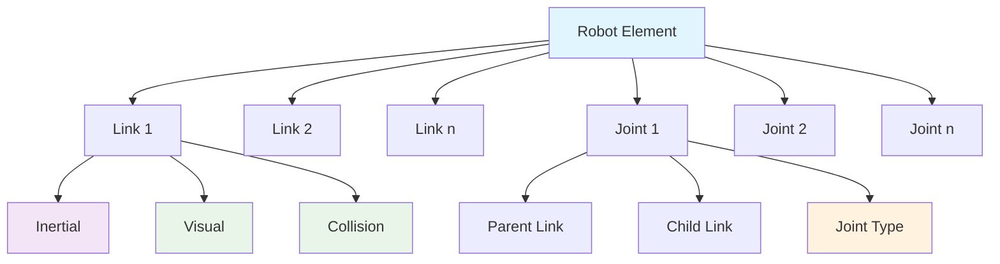

import Tabs from '@theme/Tabs';
import TabItem from '@theme/TabItem';
import Link from '@docusaurus/Link';

## Learning Outcomes

After completing this chapter, you will be able to:
1. Create accurate 3D models of robots using URDF (Unified Robot Description Format)
2. Define robot kinematics including links, joints, and their properties
3. Implement proper inertial properties for physically accurate simulation
4. Apply visual and collision properties to robot models
5. Use Xacro macros to simplify complex robot descriptions
6. Validate URDF models for correctness and completeness
7. Integrate robot models with Gazebo simulation environment
8. Apply best practices for robot modeling and maintainability

## Gherkin Specifications

### Scenario 1: URDF Model Creation
- **Given** physical specifications of a robot
- **When** creating a URDF model following ROS conventions
- **Then** the model accurately represents the physical robot

### Scenario 2: Kinematic Chain Definition
- **Given** a robot with multiple joints and links
- **When** defining the kinematic chain in URDF
- **Then** the robot's movement is properly constrained and represented

### Scenario 3: Simulation Integration
- **Given** a URDF robot model
- **When** integrating with Gazebo simulation
- **Then** the model appears correctly and responds to physics

### Scenario 4: Model Validation
- **Given** a completed URDF model
- **When** running validation checks
- **Then** the model is free of errors and ready for use

### Scenario 5: Xacro Usage
- **Given** a complex robot with repetitive components
- **When** using Xacro macros to simplify the model
- **Then** the model is more maintainable and less error-prone

## Theory & Intuition

Think of URDF modeling like creating architectural blueprints for a robot. Just as an architect needs to specify the dimensions, materials, connections, and functional elements of a building, a roboticist must specify the physical and kinematic properties of a robot.

In architecture, different views (floor plans, elevations, sections) provide different perspectives of the same building. Similarly, URDF provides multiple "views" of a robot: kinematic structure (how parts connect), visual appearance (how it looks), collision properties (how it interacts), and inertial properties (how it behaves dynamically).

A well-designed URDF is like a well-documented blueprint - it captures both the static structure (the shape and connections) and dynamic properties (how it moves and responds to forces) in a way that can be understood and used by various tools (simulation, visualization, planning algorithms).

## Core Concepts

<Tabs
  defaultValue="diagram"
  values={[
    {label: 'URDF Structure', value: 'diagram'},
    {label: 'URDF Components Table', value: 'table'},
  ]}>
  <TabItem value="diagram">



  </TabItem>
  <TabItem value="table">

| Component | Purpose | Required Properties |
|-----------|---------|-------------------|
| Link | Rigid body component | Mass, inertia, visual/collision geometry |
| Joint | Connection between links | Type, limits, parent/child links |
| Inertial | Dynamic properties | Mass, center of mass, inertia matrix |
| Visual | Appearance in visualization | Geometry, material |
| Collision | Interaction in physics | Geometry |

  </TabItem>
</Tabs>

## Hands-On Labs

<Tabs
  defaultValue="lab1"
  values={[
    {label: 'Lab 1: Basic URDF Model', value: 'lab1'},
    {label: 'Lab 2: Complex Robot with Xacro', value: 'lab2'},
    {label: 'Lab 3: URDF Validation and Debugging', value: 'lab3'},
  ]}>
  <TabItem value="lab1">

### Lab 1: Basic URDF Model

#### Objective
Create a simple robot model with links, joints, and visual properties.

#### Required Components
- ROS 2 environment
- Text editor
- Robot model package from previous chapter

#### Steps
1. Create a new package for URDF practice:
   ```bash
   cd ~/ros2_ws/src
   ros2 pkg create --build-type ament_python urdf_practice_pkg --dependencies rclpy
   ```

2. Create the URDF directory:
   ```bash
   mkdir -p ~/ros2_ws/src/urdf_practice_pkg/urdf
   ```

3. Create a simple robot URDF file:
   ```bash
   nano ~/ros2_ws/src/urdf_practice_pkg/urdf/simple_arm.urdf
   ```

4. Add the following URDF code:
   ```xml
   <?xml version="1.0"?>
   <robot name="simple_arm" xmlns:xacro="http://www.ros.org/wiki/xacro">
     <!-- Base Link -->
     <link name="base_link">
       <inertial>
         <origin xyz="0 0 0.1" rpy="0 0 0"/>
         <mass value="2.0"/>
         <inertia ixx="0.05" ixy="0.0" ixz="0.0" iyy="0.05" iyz="0.0" izz="0.02"/>
       </inertial>
       <visual>
         <origin xyz="0 0 0.1" rpy="0 0 0"/>
         <geometry>
           <cylinder radius="0.1" length="0.2"/>
         </geometry>
         <material name="blue">
           <color rgba="0 0 1 1"/>
         </material>
       </visual>
       <collision>
         <origin xyz="0 0 0.1" rpy="0 0 0"/>
         <geometry>
           <cylinder radius="0.1" length="0.2"/>
         </geometry>
       </collision>
     </link>

     <!-- First Arm Link -->
     <link name="link1">
       <inertial>
         <origin xyz="0 0 0.2" rpy="0 0 0"/>
         <mass value="1.0"/>
         <inertia ixx="0.02" ixy="0.0" ixz="0.0" iyy="0.02" iyz="0.0" izz="0.005"/>
       </inertial>
       <visual>
         <origin xyz="0 0 0.2" rpy="0 0 0"/>
         <geometry>
           <cylinder radius="0.05" length="0.4"/>
         </geometry>
         <material name="green">
           <color rgba="0 1 0 1"/>
         </material>
       </visual>
       <collision>
         <origin xyz="0 0 0.2" rpy="0 0 0"/>
         <geometry>
           <cylinder radius="0.05" length="0.4"/>
         </geometry>
       </collision>
     </link>

     <!-- Joint connecting base to first link -->
     <joint name="joint1" type="revolute">
       <parent link="base_link"/>
       <child link="link1"/>
       <origin xyz="0 0 0.2" rpy="0 0 0"/>
       <axis xyz="0 0 1"/>
       <limit lower="-1.57" upper="1.57" effort="100" velocity="3.0"/>
     </joint>

     <!-- Second Arm Link -->
     <link name="link2">
       <inertial>
         <origin xyz="0 0 0.15" rpy="0 0 0"/>
         <mass value="0.5"/>
         <inertia ixx="0.01" ixy="0.0" ixz="0.0" iyy="0.01" iyz="0.0" izz="0.003"/>
       </inertial>
       <visual>
         <origin xyz="0 0 0.15" rpy="0 0 0"/>
         <geometry>
           <cylinder radius="0.04" length="0.3"/>
         </geometry>
         <material name="red">
           <color rgba="1 0 0 1"/>
         </material>
       </visual>
       <collision>
         <origin xyz="0 0 0.15" rpy="0 0 0"/>
         <geometry>
           <cylinder radius="0.04" length="0.3"/>
         </geometry>
       </collision>
     </link>

     <!-- Joint connecting first link to second link -->
     <joint name="joint2" type="revolute">
       <parent link="link1"/>
       <child link="link2"/>
       <origin xyz="0 0 0.4" rpy="0 0 0"/>
       <axis xyz="0 1 0"/>
       <limit lower="-1.57" upper="1.57" effort="100" velocity="3.0"/>
     </joint>

     <!-- End Effector -->
     <link name="end_effector">
       <inertial>
         <origin xyz="0 0 0.05" rpy="0 0 0"/>
         <mass value="0.1"/>
         <inertia ixx="0.001" ixy="0.0" ixz="0.0" iyy="0.001" iyz="0.0" izz="0.001"/>
       </inertial>
       <visual>
         <origin xyz="0 0 0.05" rpy="0 0 0"/>
         <geometry>
           <box size="0.05 0.05 0.1"/>
         </geometry>
         <material name="yellow">
           <color rgba="1 1 0 1"/>
         </material>
       </visual>
       <collision>
         <origin xyz="0 0 0.05" rpy="0 0 0"/>
         <geometry>
           <box size="0.05 0.05 0.1"/>
         </geometry>
       </collision>
     </link>

     <!-- Fixed joint for end effector -->
     <joint name="ee_joint" type="fixed">
       <parent link="link2"/>
       <child link="end_effector"/>
       <origin xyz="0 0 0.3" rpy="0 0 0"/>
     </joint>
   </robot>
   ```

5. Create a launch file to visualize the robot:
   ```bash
   mkdir -p ~/ros2_ws/src/urdf_practice_pkg/launch
   nano ~/ros2_ws/src/urdf_practice_pkg/launch/view_robot.launch.py
   ```

6. Add the following launch file:
   ```python
   import os
   from launch import LaunchDescription
   from launch.actions import DeclareLaunchArgument
   from launch.substitutions import LaunchConfiguration
   from launch_ros.actions import Node
   from ament_index_python.packages import get_package_share_directory

   def generate_launch_description():
       # Get the package share directory
       pkg_share = get_package_share_directory('urdf_practice_pkg')
       
       # Declare launch arguments
       urdf_file = DeclareLaunchArgument(
           'urdf_file',
           default_value='simple_arm.urdf',
           description='URDF file to load'
       )
       
       # Get launch configuration
       urdf_path = LaunchConfiguration('urdf_file')
       
       # Get the full path to the URDF file
       urdf_full_path = os.path.join(pkg_share, 'urdf', urdf_path.perform({}))
       
       # Robot State Publisher node
       robot_state_publisher = Node(
           package='robot_state_publisher',
           executable='robot_state_publisher',
           output='screen',
           parameters=[{
               'robot_description': open(urdf_full_path).read(),
               'publish_frequency': 50.0
           }]
       )
       
       # Joint State Publisher GUI node
       joint_state_publisher_gui = Node(
           package='joint_state_publisher_gui',
           executable='joint_state_publisher_gui',
           output='screen'
       )
       
       # RViz node
       rviz = Node(
           package='rviz2',
           executable='rviz2',
           arguments=['-d', os.path.join(pkg_share, 'rviz', 'urdf_config.rviz')],
           output='screen'
       )
       
       return LaunchDescription([
           urdf_file,
           robot_state_publisher,
           joint_state_publisher_gui,
           rviz
       ])
   ```

7. Create an RViz configuration file:
   ```bash
   mkdir -p ~/ros2_ws/src/urdf_practice_pkg/rviz
   nano ~/ros2_ws/src/urdf_practice_pkg/rviz/urdf_config.rviz
   ```

8. Add the RViz configuration:
   ```yaml
   Panels:
     - Class: rviz_common/Displays
       Name: Displays
     - Class: rviz_common/Views
       Name: Views
   Visualization Manager:
     Displays:
       - Alpha: 0.5
         Cell Size: 1
         Class: rviz_default_plugins/Grid
         Name: Grid
       - Class: rviz_default_plugins/RobotModel
         Name: RobotModel
         Description: Simple robot arm model
         Enabled: true
         Topic:
           Depth: 5
           Durability Policy: Volatile
           History Policy: Keep Last
           Reliability Policy: Reliable
           Value: /robot_description
         Update Interval: 0
         Visual Enabled: true
       - Class: rviz_default_plugins/TF
         Name: TF
         Enabled: true
     Global Options:
       Fixed Frame: base_link
       Frame Rate: 30
     Name: root
     Tools:
       - Class: rviz_default_plugins/Interact
         Hide Inactive Objects: true
       - Class: rviz_default_plugins/MoveCamera
       - Class: rviz_default_plugins/Select
       - Class: rviz_default_plugins/FocusCamera
     Transformation:
       Current:
         Class: rviz_default_plugins/TF
     Value: true
     Views:
       Current:
         Class: rviz_default_plugins/Orbit
         Name: Current View
         Target Frame: <Fixed Frame>
         Value: Orbit (rviz)
       Saved: ~
   Window Geometry:
     Height: 800
     Width: 1200
   ```

9. Update setup.py to include launch and RViz files:
   ```bash
   nano ~/ros2_ws/src/urdf_practice_pkg/setup.py
   ```

10. Update data_files in setup.py:
    ```python
    import os
    from glob import glob
    from setuptools import setup

    package_name = 'urdf_practice_pkg'

    setup(
        name=package_name,
        version='0.0.0',
        packages=[package_name],
        data_files=[
            ('share/ament_index/resource_index/packages',
                ['resource/' + package_name]),
            ('share/' + package_name, ['package.xml']),
            # Include launch files
            (os.path.join('share', package_name, 'launch'), glob('launch/*.launch.py')),
            # Include URDF files
            (os.path.join('share', package_name, 'urdf'), glob('urdf/*')),
            # Include RViz config files
            (os.path.join('share', package_name, 'rviz'), glob('rviz/*')),
        ],
        install_requires=['setuptools'],
        zip_safe=True,
        maintainer='Your Name',
        maintainer_email='you@example.com',
        description='URDF practice package',
        license='Apache-2.0',
        tests_require=['pytest'],
        entry_points={
            'console_scripts': [
            ],
        },
    )
    ```

11. Build the package:
    ```bash
    cd ~/ros2_ws
    colcon build --packages-select urdf_practice_pkg
    source install/setup.bash
    ```

12. Visualize the robot:
    ```bash
    ros2 launch urdf_practice_pkg view_robot.launch.py
    ```

#### Expected Outcome
Robot model successfully created and visualized in RViz with proper kinematic structure.

  </TabItem>
  <TabItem value="lab2">

### Lab 2: Complex Robot with Xacro

#### Objective
Create a complex robot using Xacro macros to simplify the model.

#### Required Components
- ROS 2 environment
- Text editor
- The urdf_practice_pkg

#### Steps
1. Create Xacro files for a more complex robot:
   ```bash
   mkdir -p ~/ros2_ws/src/urdf_practice_pkg/xacro
   nano ~/ros2_ws/src/urdf_practice_pkg/xacro/materials.xacro
   ```

2. Add material definitions:
   ```xml
   <?xml version="1.0"?>
   <robot xmlns:xacro="http://www.ros.org/wiki/xacro">
     <material name="black">
       <color rgba="0.0 0.0 0.0 1.0"/>
     </material>
     
     <material name="blue">
       <color rgba="0.0 0.0 0.8 1.0"/>
     </material>
     
     <material name="green">
       <color rgba="0.0 0.8 0.0 1.0"/>
     </material>
     
     <material name="grey">
       <color rgba="0.5 0.5 0.5 1.0"/>
     </material>
     
     <material name="orange">
       <color rgba="1.0 0.423529411765 0.0392156862745 1.0"/>
     </material>
     
     <material name="brown">
       <color rgba="0.870588235294 0.811764705882 0.764705882353 1.0"/>
     </material>
     
     <material name="red">
       <color rgba="0.8 0.0 0.0 1.0"/>
     </material>
     
     <material name="white">
       <color rgba="1.0 1.0 1.0 1.0"/>
     </material>
   </robot>
   ```

3. Create a macro for a wheel:
   ```bash
   nano ~/ros2_ws/src/urdf_practice_pkg/xacro/wheel.xacro
   ```

4. Add the wheel macro:
   ```xml
   <?xml version="1.0"?>
   <robot xmlns:xacro="http://www.ros.org/wiki/xacro">
     <xacro:macro name="wheel" params="prefix parent xyz rpy *origin">
       <joint name="${prefix}_wheel_joint" type="continuous">
         <xacro:insert_block name="origin"/>
         <parent link="${parent}"/>
         <child link="${prefix}_wheel_link"/>
         <axis xyz="0 1 0"/>
       </joint>

       <link name="${prefix}_wheel_link">
         <visual>
           <origin xyz="0 0 0" rpy="1.570796 0 0"/>
           <geometry>
             <cylinder radius="0.05" length="0.05"/>
           </geometry>
           <material name="black"/>
         </visual>
         <collision>
           <origin xyz="0 0 0" rpy="1.570796 0 0"/>
           <geometry>
             <cylinder radius="0.05" length="0.05"/>
           </geometry>
         </collision>
         <inertial>
           <mass value="0.1"/>
           <inertia ixx="0.001" ixy="0.0" ixz="0.0" iyy="0.001" iyz="0.0" izz="0.001"/>
         </inertial>
       </link>
     </xacro:macro>
   </robot>
   ```

5. Create a base macro:
   ```bash
   nano ~/ros2_ws/src/urdf_practice_pkg/xacro/base.xacro
   ```

6. Add the base macro:
   ```xml
   <?xml version="1.0"?>
   <robot xmlns:xacro="http://www.ros.org/wiki/xacro">
     <xacro:macro name="base" params="parent xyz rpy *origin">
       <joint name="base_joint" type="fixed">
         <xacro:insert_block name="origin"/>
         <parent link="${parent}"/>
         <child link="base_link"/>
       </joint>

       <link name="base_link">
         <visual>
           <geometry>
             <box size="0.5 0.3 0.1"/>
           </geometry>
           <material name="blue"/>
         </visual>
         <collision>
           <geometry>
             <box size="0.5 0.3 0.1"/>
           </geometry>
         </collision>
         <inertial>
           <mass value="10.0"/>
           <inertia ixx="0.2" ixy="0.0" ixz="0.0" iyy="0.4" iyz="0.0" izz="0.5"/>
         </inertial>
       </link>
     </xacro:macro>
   </robot>
   ```

7. Create the main robot file using the macros:
   ```bash
   nano ~/ros2_ws/src/urdf_practice_pkg/xacro/differential_robot.xacro
   ```

8. Add the robot definition:
   ```xml
   <?xml version="1.0"?>
   <robot name="differential_robot" xmlns:xacro="http://www.ros.org/wiki/xacro">
     <!-- Include other xacro files -->
     <xacro:include filename="$(find urdf_practice_pkg)/xacro/materials.xacro"/>
     <xacro:include filename="$(find urdf_practice_pkg)/xacro/base.xacro"/>
     <xacro:include filename="$(find urdf_practice_pkg)/xacro/wheel.xacro"/>
     
     <!-- Define robot constants -->
     <xacro:property name="wheel_radius" value="0.05"/>
     <xacro:property name="wheel_width" value="0.05"/>
     <xacro:property name="wheel_separation" value="0.3"/>
     <xacro:property name="base_length" value="0.5"/>
     <xacro:property name="base_width" value="0.3"/>
     <xacro:property name="base_height" value="0.1"/>
     
     <!-- Fixed base link -->
     <link name="world"/>
     
     <!-- Create the robot base -->
     <xacro:base parent="world" xyz="0 0 0" rpy="0 0 0">
       <origin xyz="0 0 0.1" rpy="0 0 0"/>
     </xacro:base>
     
     <!-- Left wheel -->
     <xacro:wheel 
       prefix="left" 
       parent="base_link" 
       xyz="${wheel_separation/2} ${base_width/2} 0" 
       rpy="0 0 0">
       <origin xyz="${wheel_separation/2} ${base_width/2} 0" rpy="0 0 0"/>
     </xacro:wheel>
     
     <!-- Right wheel -->
     <xacro:wheel 
       prefix="right" 
       parent="base_link" 
       xyz="${wheel_separation/2} -${base_width/2} 0" 
       rpy="0 0 0">
       <origin xyz="${wheel_separation/2} -${base_width/2} 0" rpy="0 0 0"/>
     </xacro:wheel>
     
     <!-- Camera mounted on the front -->
     <joint name="camera_joint" type="fixed">
       <origin xyz="${base_length/2} 0 ${base_height/2}" rpy="0 0 0"/>
       <parent link="base_link"/>
       <child link="camera_link"/>
     </joint>
     
     <link name="camera_link">
       <visual>
         <geometry>
           <box size="0.05 0.05 0.05"/>
         </geometry>
         <material name="red"/>
       </visual>
       <collision>
         <geometry>
           <box size="0.05 0.05 0.05"/>
         </geometry>
       </collision>
       <inertial>
         <mass value="0.1"/>
         <inertia ixx="0.0001" ixy="0.0" ixz="0.0" iyy="0.0001" iyz="0.0" izz="0.0001"/>
       </inertial>
     </link>
   </robot>
   ```

9. Create a launch file for the Xacro robot:
   ```bash
   nano ~/ros2_ws/src/urdf_practice_pkg/launch/view_xacro_robot.launch.py
   ```

10. Add the launch file content:
    ```python
    import os
    from launch import LaunchDescription
    from launch.actions import DeclareLaunchArgument
    from launch.substitutions import LaunchConfiguration
    from launch_ros.actions import Node
    from ament_index_python.packages import get_package_share_directory

    def generate_launch_description():
        # Get the package share directory
        pkg_share = get_package_share_directory('urdf_practice_pkg')
        
        # Declare launch arguments
        xacro_file = DeclareLaunchArgument(
            'xacro_file',
            default_value='differential_robot.xacro',
            description='Xacro file to load'
        )
        
        # Get launch configuration
        xacro_path = LaunchConfiguration('xacro_file')
        
        # Get the full path to the Xacro file
        xacro_full_path = os.path.join(pkg_share, 'xacro', xacro_path.perform({}))
        
        # Process Xacro file to URDF
        from xacro import process_file
        robot_desc = process_file(xacro_full_path).toprettyxml(indent='  ')
        
        # Robot State Publisher node
        robot_state_publisher = Node(
            package='robot_state_publisher',
            executable='robot_state_publisher',
            output='screen',
            parameters=[{
                'robot_description': robot_desc,
                'publish_frequency': 50.0
            }]
        )
        
        # Joint State Publisher GUI node
        joint_state_publisher_gui = Node(
            package='joint_state_publisher_gui',
            executable='joint_state_publisher_gui',
            output='screen'
        )
        
        # RViz node
        rviz = Node(
            package='rviz2',
            executable='rviz2',
            arguments=['-d', os.path.join(pkg_share, 'rviz', 'urdf_config.rviz')],
            output='screen'
        )
        
        return LaunchDescription([
            xacro_file,
            robot_state_publisher,
            joint_state_publisher_gui,
            rviz
        ])
    ```

11. Update setup.py to include xacro files:
    ```bash
    nano ~/ros2_ws/src/urdf_practice_pkg/setup.py
    ```

12. Add xacro files to data_files:
    ```python
    # Include Xacro files
    (os.path.join('share', package_name, 'xacro'), glob('xacro/*')),
    ```

13. Rebuild the package:
    ```bash
    cd ~/ros2_ws
    colcon build --packages-select urdf_practice_pkg
    source install/setup.bash
    ```

14. Visualize the Xacro robot:
    ```bash
    ros2 launch urdf_practice_pkg view_xacro_robot.launch.py
    ```

#### Expected Outcome
Complex robot model using Xacro macros successfully created and visualized in RViz.

  </TabItem>
  <TabItem value="lab3">

### Lab 3: URDF Validation and Debugging

#### Objective
Validate URDF models and debug common issues.

#### Required Components
- ROS 2 environment
- Text editor
- The urdf_practice_pkg

#### Steps
1. Install the check_urdf tool if not already installed:
   ```bash
   sudo apt update
   sudo apt install ros-humble-urdfdom-tools
   ```

2. Create a launch file with a robot that has intentional errors for debugging:
   ```bash
   nano ~/ros2_ws/src/urdf_practice_pkg/urdf/debug_robot.urdf
   ```

3. Add a URDF with intentional errors:
   ```xml
   <?xml version="1.0"?>
   <robot name="debug_robot" xmlns:xacro="http://www.ros.org/wiki/xacro">
     <!-- Base Link -->
     <link name="base_link">
       <inertial>
         <!-- Intentionally incorrect: origin not at center of mass -->
         <origin xyz="100 0 0" rpy="0 0 0"/>
         <mass value="2.0"/>
         <!-- Intentionally incorrect: physically impossible inertia values -->
         <inertia ixx="0" ixy="0.0" ixz="0.0" iyy="0" iyz="0.0" izz="0"/>
       </inertial>
       <visual>
         <origin xyz="0 0 0.1" rpy="0 0 0"/>
         <geometry>
           <cylinder radius="0.1" length="0.2"/>
         </geometry>
         <material name="blue">
           <color rgba="0 0 1 1"/>
         </material>
       </visual>
       <collision>
         <origin xyz="0 0 0.1" rpy="0 0 0"/>
         <geometry>
           <cylinder radius="0.1" length="0.2"/>
         </geometry>
       </collision>
     </link>

     <!-- First Arm Link -->
     <!-- Intentionally incorrect: no inertial properties -->
     <link name="link1">
       <visual>
         <origin xyz="0 0 0.2" rpy="0 0 0"/>
         <geometry>
           <cylinder radius="0.05" length="0.4"/>
         </geometry>
         <material name="green">
           <color rgba="0 1 0 1"/>
         </material>
       </visual>
       <collision>
         <origin xyz="0 0 0.2" rpy="0 0 0"/>
         <geometry>
           <cylinder radius="0.05" length="0.4"/>
         </geometry>
       </collision>
     </link>

     <!-- Joint with potential issues -->
     <joint name="joint1" type="revolute">
       <parent link="base_link"/>
       <child link="link1"/>
       <!-- Intentionally incorrect: placing child link far away -->
       <origin xyz="2 2 2" rpy="0 0 0"/>
       <axis xyz="0 0 1"/>
       <!-- Intentionally incorrect: limits too restrictive for physics -->
       <limit lower="0" upper="0.01" effort="100" velocity="3.0"/>
     </joint>

     <!-- Another link with issues -->
     <link name="link2">
       <!-- Intentionally incorrect: negative mass -->
       <inertial>
         <origin xyz="0 0 0.15" rpy="0 0 0"/>
         <mass value="-1.0"/>
         <inertia ixx="0.01" ixy="0.0" ixz="0.0" iyy="0.01" iyz="0.0" izz="0.003"/>
       </inertial>
       <visual>
         <origin xyz="0 0 0.15" rpy="0 0 0"/>
         <geometry>
           <cylinder radius="0.04" length="0.3"/>
         </geometry>
         <material name="red">
           <color rgba="1 0 0 1"/>
         </material>
       </visual>
       <collision>
         <origin xyz="0 0 0.15" rpy="0 0 0"/>
         <geometry>
           <cylinder radius="0.04" length="0.3"/>
         </geometry>
       </collision>
     </link>

     <!-- Another joint -->
     <joint name="joint2" type="fixed">
       <parent link="link1"/>
       <child link="link2"/>
       <origin xyz="0 0 0.4" rpy="0 0 0"/>
       <!-- Fixed joints shouldn't have limits but we include them to test -->
     </joint>
   </robot>
   ```

4. Check the URDF for errors:
   ```bash
   # Check syntax
   check_urdf ~/ros2_ws/src/urdf_practice_pkg/urdf/debug_robot.urdf
   ```

5. Create a Python validation script:
   ```bash
   nano ~/ros2_ws/src/urdf_practice_pkg/urdf_practice_pkg/urdf_validator.py
   ```

6. Add validation code:
   ```python
   #!/usr/bin/env python3
   import xml.etree.ElementTree as ET
   import sys

   def validate_urdf(urdf_path):
       """Basic validation of URDF file"""
       try:
           tree = ET.parse(urdf_path)
           root = tree.getroot()
           
           print(f"Validating URDF: {urdf_path}")
           print(f"Robot name: {root.get('name')}")
           
           # Check that robot has at least one link
           links = root.findall('link')
           if not links:
               print("ERROR: No links found in URDF")
               return False
           
           print(f"Found {len(links)} links")
           
           # Check that robot has at least one joint
           joints = root.findall('joint')
           if not joints:
               print("ERROR: No joints found in URDF")
               return False
           
           print(f"Found {len(joints)} joints")
           
           # Validate each link
           for link in links:
               link_name = link.get('name')
               print(f"Validating link: {link_name}")
               
               # Check if link has visual or collision properties
               visual = link.find('visual')
               collision = link.find('collision')
               if visual is None and collision is None:
                   print(f"WARNING: Link {link_name} has no visual or collision geometry")
               
               # Check inertial properties
               inertial = link.find('inertial')
               if inertial is not None:
                   mass_elem = inertial.find('mass')
                   if mass_elem is not None:
                       mass_value = float(mass_elem.get('value'))
                       if mass_value <= 0:
                           print(f"ERROR: Link {link_name} has non-positive mass: {mass_value}")
                           return False
                       
                       inertia_elem = inertial.find('inertia')
                       if inertia_elem is not None:
                           ixx = float(inertia_elem.get('ixx'))
                           iyy = float(inertia_elem.get('iyy'))
                           izz = float(inertia_elem.get('izz'))
                           
                           # Check that diagonal inertia values are positive
                           if ixx <= 0 or iyy <= 0 or izz <= 0:
                               print(f"ERROR: Link {link_name} has non-positive inertia values")
                               print(f"  ixx={ixx}, iyy={iyy}, izz={izz}")
                               return False
               
           # Validate each joint
           for joint in joints:
               joint_name = joint.get('name')
               joint_type = joint.get('type')
               parent = joint.find('parent')
               child = joint.find('child')
               
               print(f"Validating joint: {joint_name} (type: {joint_type})")
               
               if parent is None or child is None:
                   print(f"ERROR: Joint {joint_name} missing parent or child definition")
                   return False
               
               # Specific validation based on joint type
               if joint_type in ['revolute', 'prismatic']:
                   limit = joint.find('limit')
                   if limit is None:
                       print(f"WARNING: Joint {joint_name} of type {joint_type} has no limits defined")
                   else:
                       lower = float(limit.get('lower'))
                       upper = float(limit.get('upper'))
                       if lower >= upper:
                           print(f"ERROR: Joint {joint_name} has invalid limits: lower ({lower}) >= upper ({upper})")
                           return False
               
               if joint_type == 'fixed':
                   limit = joint.find('limit')
                   if limit is not None:
                       print(f"WARNING: Fixed joint {joint_name} should not have limits defined")
           
           print("URDF validation completed - some warnings may require attention")
           return True
           
       except ET.ParseError as e:
           print(f"XML Parse Error: {e}")
           return False
       except Exception as e:
           print(f"Error validating URDF: {e}")
           return False

   def main():
       if len(sys.argv) != 2:
           print("Usage: python3 urdf_validator.py <urdf_file>")
           sys.exit(1)
       
       urdf_path = sys.argv[1]
       if validate_urdf(urdf_path):
           print("URDF validation PASSED")
           sys.exit(0)
       else:
           print("URDF validation FAILED")
           sys.exit(1)

   if __name__ == '__main__':
       main()
   ```

7. Make the validation script executable and update setup.py:
   ```bash
   chmod +x ~/ros2_ws/src/urdf_practice_pkg/urdf_practice_pkg/urdf_validator.py
   nano ~/ros2_ws/src/urdf_practice_pkg/setup.py
   ```

8. Add the validation script to entry_points:
   ```python
   entry_points={
       'console_scripts': [
           'urdf_validator = urdf_practice_pkg.urdf_validator:main',
       ],
   }
   ```

9. Build the package with the new validation tool:
   ```bash
   cd ~/ros2_ws
   colcon build --packages-select urdf_practice_pkg
   source install/setup.bash
   ```

10. Run the URDF validator on the debug robot:
    ```bash
    ros2 run urdf_practice_pkg urdf_validator ~/ros2_ws/src/urdf_practice_pkg/urdf/debug_robot.urdf
    ```

11. Now test the validator on the correct robot URDF:
    ```bash
    ros2 run urdf_practice_pkg urdf_validator ~/ros2_ws/src/urdf_practice_pkg/urdf/simple_arm.urdf
    ```

12. Create a corrected version of the debug robot:
    ```bash
    nano ~/ros2_ws/src/urdf_practice_pkg/urdf/corrected_robot.urdf
    ```

13. Add the corrected URDF:
    ```xml
    <?xml version="1.0"?>
    <robot name="corrected_robot">
      <!-- Base Link -->
      <link name="base_link">
        <inertial>
          <origin xyz="0 0 0.1" rpy="0 0 0"/>
          <mass value="2.0"/>
          <inertia ixx="0.05" ixy="0.0" ixz="0.0" iyy="0.05" iyz="0.0" izz="0.02"/>
        </inertial>
        <visual>
          <origin xyz="0 0 0.1" rpy="0 0 0"/>
          <geometry>
            <cylinder radius="0.1" length="0.2"/>
          </geometry>
          <material name="blue">
            <color rgba="0 0 1 1"/>
          </material>
        </visual>
        <collision>
          <origin xyz="0 0 0.1" rpy="0 0 0"/>
          <geometry>
            <cylinder radius="0.1" length="0.2"/>
          </geometry>
        </collision>
      </link>

      <!-- First Arm Link -->
      <link name="link1">
        <inertial>
          <origin xyz="0 0 0.2" rpy="0 0 0"/>
          <mass value="1.0"/>
          <inertia ixx="0.02" ixy="0.0" ixz="0.0" iyy="0.02" iyz="0.0" izz="0.005"/>
        </inertial>
        <visual>
          <origin xyz="0 0 0.2" rpy="0 0 0"/>
          <geometry>
            <cylinder radius="0.05" length="0.4"/>
          </geometry>
          <material name="green">
            <color rgba="0 1 0 1"/>
          </material>
        </visual>
        <collision>
          <origin xyz="0 0 0.2" rpy="0 0 0"/>
          <geometry>
            <cylinder radius="0.05" length="0.4"/>
          </geometry>
        </collision>
      </link>

      <!-- Joint connecting base to first link -->
      <joint name="joint1" type="revolute">
        <parent link="base_link"/>
        <child link="link1"/>
        <origin xyz="0 0 0.2" rpy="0 0 0"/>
        <axis xyz="0 0 1"/>
        <limit lower="-1.57" upper="1.57" effort="100" velocity="3.0"/>
      </joint>

      <!-- Second Arm Link -->
      <link name="link2">
        <inertial>
          <origin xyz="0 0 0.15" rpy="0 0 0"/>
          <mass value="0.5"/>
          <inertia ixx="0.01" ixy="0.0" ixz="0.0" iyy="0.01" iyz="0.0" izz="0.003"/>
        </inertial>
        <visual>
          <origin xyz="0 0 0.15" rpy="0 0 0"/>
          <geometry>
            <cylinder radius="0.04" length="0.3"/>
          </geometry>
          <material name="red">
            <color rgba="1 0 0 1"/>
          </material>
        </visual>
        <collision>
          <origin xyz="0 0 0.15" rpy="0 0 0"/>
          <geometry>
            <cylinder radius="0.04" length="0.3"/>
          </geometry>
        </collision>
      </link>

      <!-- Joint connecting first link to second link -->
      <joint name="joint2" type="revolute">
        <parent link="link1"/>
        <child link="link2"/>
        <origin xyz="0 0 0.4" rpy="0 0 0"/>
        <axis xyz="0 1 0"/>
        <limit lower="-1.57" upper="1.57" effort="100" velocity="3.0"/>
      </joint>
    </robot>
    ```

14. Validate the corrected robot:
    ```bash
    ros2 run urdf_practice_pkg urdf_validator ~/ros2_ws/src/urdf_practice_pkg/urdf/corrected_robot.urdf
    ```

15. Visualize the corrected robot:
    ```bash
    # Create a temporary launch file for the corrected robot
    nano ~/ros2_ws/src/urdf_practice_pkg/launch/test_corrected.launch.py
    ```

16. Add the launch file content:
    ```python
    import os
    from launch import LaunchDescription
    from launch_ros.actions import Node
    from ament_index_python.packages import get_package_share_directory

    def generate_launch_description():
        # Get the package share directory
        pkg_share = get_package_share_directory('urdf_practice_pkg')
        
        # Get the full path to the URDF file
        urdf_path = os.path.join(pkg_share, 'urdf', 'corrected_robot.urdf')
        
        # Robot State Publisher node
        robot_state_publisher = Node(
            package='robot_state_publisher',
            executable='robot_state_publisher',
            output='screen',
            parameters=[{
                'robot_description': open(urdf_path).read(),
                'publish_frequency': 50.0
            }]
        )
        
        # Joint State Publisher GUI node
        joint_state_publisher_gui = Node(
            package='joint_state_publisher_gui',
            executable='joint_state_publisher_gui',
            output='screen'
        )
        
        # RViz node
        rviz = Node(
            package='rviz2',
            executable='rviz2',
            arguments=['-d', os.path.join(pkg_share, 'rviz', 'urdf_config.rviz')],
            output='screen'
        )
        
        return LaunchDescription([
            robot_state_publisher,
            joint_state_publisher_gui,
            rviz
        ])
    ```

17. Launch the corrected robot:
    ```bash
    ros2 launch urdf_practice_pkg test_corrected.launch.py
    ```

#### Expected Outcome
URDF validation tool successfully identifying errors in the debug robot and confirming correctness of the corrected robot.

  </TabItem>
</Tabs>

## Sim-to-Real Notes

- **Hardware considerations**: When modeling real robots, ensure inertial properties closely match the actual robot to get accurate simulation behavior
- **Differences from simulation**: Real robots might have more complex kinematics with non-ideal joint behaviors that require special consideration
- **Practical tips**: Use CAD software to generate accurate dimensions and inertial properties when possible

## Multiple Choice Questions

1. What does URDF stand for?
   - A) Universal Robot Development Framework
   - B) Unified Robot Description Format
   - C) Universal Robot Design File
   - D) Unified Robotics Data Format

   **Correct Answer: B** - URDF stands for Unified Robot Description Format.

2. Which of the following is NOT a required child element of a link in URDF?
   - A) visual
   - B) collision
   - C) inertial
   - D) Either visual or collision is required

   **Correct Answer: C** - Inertial properties are only required for links that will be simulated with physics.

3. What type of joint allows continuous rotation around a single axis?
   - A) fixed
   - B) revolute
   - C) continuous
   - D) prismatic

   **Correct Answer: C** - The "continuous" joint type allows continuous rotation around a single axis.

4. In a URDF file, what element defines the physical properties of a link?
   - A) visual
   - B) collision
   - C) inertial
   - D) geometry

   **Correct Answer: C** - The inertial element defines the physical properties of a link.

5. What is the purpose of the `<origin>` element in URDF?
   - A) To define the robot's starting position
   - B) To specify position and orientation of elements relative to their parent
   - C) To set the robot's coordinate system
   - D) To define the robot's origin point

   **Correct Answer: B** - The `<origin>` element specifies position and orientation of elements relative to their parent.

6. Which Xacro element would you use to define a reusable robot component?
   - A) `<xacro:part>`
   - B) `<xacro:component>`
   - C) `<xacro:macro>`
   - D) `<xacro:module>`

   **Correct Answer: C** - `<xacro:macro>` is used to define reusable robot components in Xacro.

7. What is the purpose of the `<material>` tag in URDF?
   - A) To define physical properties for physics simulation
   - B) To define visual appearance (color, texture) for visualization
   - C) To specify the material composition of the robot
   - D) To define collision properties

   **Correct Answer: B** - The `<material>` tag defines visual appearance for visualization.

8. Which joint type allows motion along a single axis between specified limits?
   - A) fixed
   - B) revolute
   - C) continuous
   - D) prismatic

   **Correct Answer: D** - Prismatic joints allow motion along a single axis between specified limits.

9. What Xacro syntax is used to include another Xacro file?
   - A) `<include filename="..."/>`
   - B) `<xacro:include filename="..."/>`
   - C) `<import filename="..."/>`
   - D) `<xacro:import filename="..."/>`

   **Correct Answer: B** - `<xacro:include filename="..."/>` is used to include another Xacro file.

10. Which tool can be used to check the structure of a URDF file?
    - A) urdf_check
    - B) check_urdf
    - C) urdf_validator
    - D) ros2 urdf check

    **Correct Answer: B** - check_urdf is the tool used to check the structure of a URDF file.

11. In URDF, what is the correct way to define a cylinder geometry?
    - A) `<geometry type="cylinder" radius="0.1" length="0.2"/>`
    - B) `<geometry><cylinder radius="0.1" length="0.2"/></geometry>`
    - C) `<geometry><cylinder><radius>0.1</radius><length>0.2</length></cylinder></geometry>`
    - D) `<cylinder radius="0.1" length="0.2"/>`

    **Correct Answer: B** - The geometry is defined as a child element of the geometry tag.

12. What is the purpose of the `<gazebo>` tag in URDF files?
    - A) To define robot kinematics
    - B) To specify simulation-specific properties for Gazebo
    - C) To define visual properties
    - D) To set up robot controllers

    **Correct Answer: B** - The `<gazebo>` tag specifies simulation-specific properties for Gazebo.

13. How do you pass parameters to a Xacro macro?
    - A) Using the args attribute
    - B) Using the params attribute
    - C) Using the arguments attribute
    - D) Using the values attribute

    **Correct Answer: B** - Parameters are passed to a Xacro macro using the params attribute.

14. Which joint type allows no relative motion between two links?
    - A) revolute
    - B) continuous
    - C) fixed
    - D) prismatic

    **Correct Answer: C** - Fixed joints allow no relative motion between two links.

15. What must be true for a URDF with multiple links to be valid?
    - A) All links must be directly connected to the base
    - B) All links must form a single chain
    - C) All links must be connected through joints in a connected graph
    - D) Links can be defined independently

    **Correct Answer: C** - All links must be connected through joints in a connected graph.

## Further Reading

1. [URDF Format Documentation](http://wiki.ros.org/urdf/XML) - Complete XML specification for URDF
2. [Xacro Tutorial](http://wiki.ros.org/xacro) - Official Xacro macro tutorial
3. [Robot Modeling Tutorials](https://docs.ros.org/en/humble/Tutorials/Intermediate/URDF.html) - ROS 2 URDF tutorials
4. [Visualizing Robots in RViz](https://docs.ros.org/en/humble/Tutorials/Beginner-Client-Libraries/Using-Rviz.html) - Visualization guide
5. [URDF Best Practices](https://robotics.stackexchange.com/questions/3677) - Community best practices for URDF modeling
6. [Inertial Parameter Guidelines](https://gazebosim.org/tutorials?tut=inertial&cat=build_robot) - Guidelines for setting inertial parameters

## Chapter Navigation

<div class="pagination-nav">
  <div class="pagination-nav__item pagination-nav__item--prev">
    <Link className="pagination-nav__link" to="/modules/module-2-simulation/chapter-8-gazebo-simulation/">
      <div className="pagination-nav__sublabel">Previous</div>
      <div className="pagination-nav__label">← Chapter 8: Gazebo Simulation Environment</div>
    </Link>
  </div>
  <div class="pagination-nav__item pagination-nav__item--next">
    <Link className="pagination-nav__link" to="/modules/module-2-simulation/chapter-10-physics-engines/">
      <div className="pagination-nav__sublabel">Next</div>
      <div className="pagination-nav__label">Chapter 10: Physics Engines and Simulation Fidelity →</div>
    </Link>
  </div>
</div>