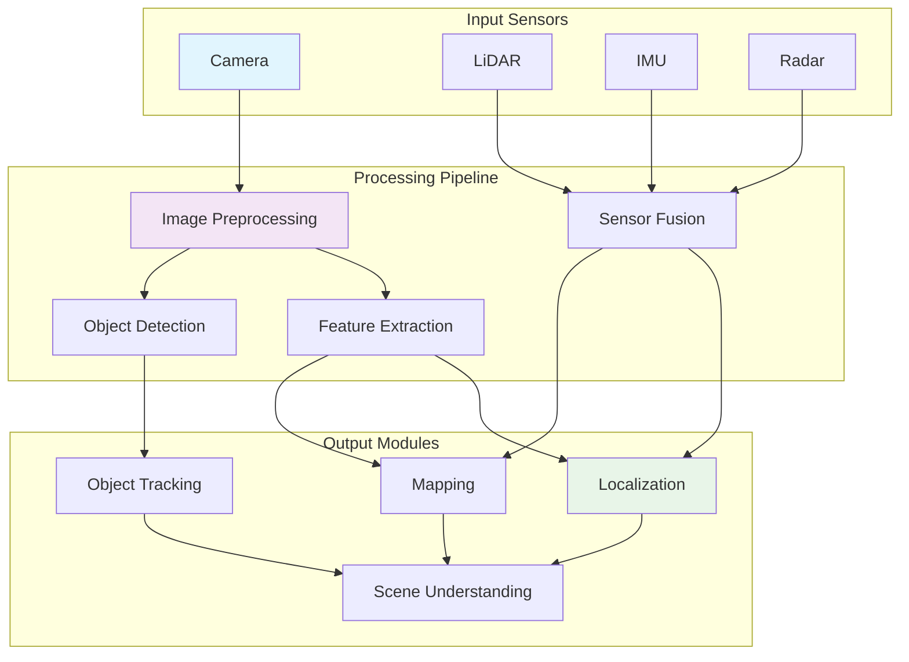

import Tabs from '@theme/Tabs';
import TabItem from '@theme/TabItem';

## Learning Outcomes

After completing this chapter, you will be able to:
1. Implement and evaluate various computer vision algorithms for robotic perception
2. Understand and apply camera models and calibration techniques
3. Extract and match features from visual input for robot localization
4. Perform object detection and tracking for robotic manipulation
5. Implement SLAM (Simultaneous Localization and Mapping) using visual input
6. Apply deep learning techniques for perception tasks in robotics
7. Fuse visual data with other sensor modalities for improved perception
8. Evaluate perception system performance and handle failure cases

## Gherkin Specifications

### Scenario 1: Camera Calibration
- **Given** a robot with a camera sensor
- **When** calibration procedure is performed with checkerboard pattern
- **Then** accurate intrinsic and extrinsic parameters are obtained

### Scenario 2: Feature Detection and Matching
- **Given** visual input from robot's environment
- **When** feature detection and matching algorithms are applied
- **Then** consistent features across frames are identified and matched

### Scenario 3: Object Detection
- **Given** an image containing objects of interest
- **When** object detection pipeline is executed
- **Then** objects are localized with accurate bounding boxes and class labels

### Scenario 4: Visual SLAM
- **Given** a sequence of images from a moving robot
- **When** visual SLAM algorithm processes the input
- **Then** robot pose is estimated and a map is constructed

### Scenario 5: Perception System Validation
- **Given** a perception system in a known environment
- **When** performance metrics are evaluated
- **Then** accuracy and robustness measures are quantified

## Theory & Intuition

Think of robot perception systems like a team of expert observers equipped with specialized tools. Each sensor is like a different type of expert: cameras are like visual specialists who can identify objects by their appearance, LiDAR sensors are like distance experts who can precisely measure spatial relationships, and IMUs are like balance and motion experts who can detect changes in orientation and acceleration.

Computer vision is like teaching a robot to "see" and understand its environment. Just as humans automatically recognize familiar objects and navigate using visual cues, robots use computer vision algorithms to interpret camera images, identify important features, and understand their spatial context.

The camera model is like understanding how the robot's "eye" works. Just as your eye has a specific field of view, focus, and distortion characteristics, robot cameras have parameters that define how 3D world points map to 2D image pixels. Understanding and calibrating these parameters is crucial for accurate perception.

Feature matching is like how you recognize a familiar landmark from different viewpoints. When you see a building from various angles, you can still identify it because certain features (corners, unique shapes) remain consistent. Similarly, robots use feature detection algorithms to identify consistent landmarks that can be matched across different views to estimate motion and build maps.

## Core Concepts

<Tabs
  defaultValue="diagram"
  values={[
    {label: 'Perception System Architecture', value: 'diagram'},
    {label: 'Algorithm Categories', value: 'table'},
  ]}>
  <TabItem value="diagram">



  </TabItem>
  <TabItem value="table">

| Algorithm Category | Purpose | Common Techniques |
|-------------------|---------|-------------------|
| Feature Detection | Identify distinctive points in images | SIFT, SURF, ORB, FAST |
| Object Detection | Locate and classify objects | YOLO, R-CNN, SSD |
| SLAM | Simultaneous localization and mapping | ORB-SLAM, RTAB-Map, LOAM |
| Image Segmentation | Partition image into semantic regions | Mask R-CNN, U-Net, DeepLab |

  </TabItem>
</Tabs>

## Hands-On Labs

<Tabs
  defaultValue="lab1"
  values={[
    {label: 'Lab 1: Camera Calibration and Image Processing', value: 'lab1'},
    {label: 'Lab 2: Feature Detection and Matching', value: 'lab2'},
    {label: 'Lab 3: Object Detection and Tracking', value: 'lab3'},
  ]}>
  <TabItem value="lab1">

### Lab 1: Camera Calibration and Image Processing

#### Objective
Implement camera calibration and basic image processing techniques for robotic vision.

#### Required Components
- ROS 2 environment
- Camera (physical or simulated)
- OpenCV library
- Calibration pattern (checkerboard)

#### Steps
1. **Create a camera processing package**:
   ```bash
   cd ~/robot_ws/src
   ros2 pkg create --build-type ament_python camera_processing --dependencies rclpy sensor_msgs cv_bridge image_geometry
   ```

2. **Create the camera calibration node**:
   ```bash
   nano ~/robot_ws/src/camera_processing/camera_processing/calibration_node.py
   ```

3. **Add the calibration implementation**:
   ```python
   #!/usr/bin/env python3
   import rclpy
   from rclpy.node import Node
   from sensor_msgs.msg import Image
   from cv_bridge import CvBridge
   import cv2
   import numpy as np
   import os

   class CameraCalibrationNode(Node):
       def __init__(self):
           super().__init__('camera_calibration_node')
           
           # Parameters
           self.declare_parameter('board_width', 9)  # Number of internal corners in width
           self.declare_parameter('board_height', 6)  # Number of internal corners in height
           self.declare_parameter('square_size', 0.025)  # Size of squares in meters
           self.declare_parameter('calibration_samples', 20)  # Number of samples for calibration
           self.declare_parameter('calibration_directory', '/tmp/calibration_images')
           
           self.board_width = self.get_parameter('board_width').value
           self.board_height = self.get_parameter('board_height').value
           self.square_size = self.get_parameter('square_size').value
           self.calibration_samples = self.get_parameter('calibration_samples').value
           self.calibration_dir = self.get_parameter('calibration_directory').value
           
           # Initialize storage for calibration
           self.obj_points = []  # 3D points in real world space
           self.img_points = []  # 2D points in image plane
           self.calibration_counter = 0
           
           # Create directory for saving calibration images
           os.makedirs(self.calibration_dir, exist_ok=True)
           
           # CV Bridge for converting ROS images to OpenCV format
           self.bridge = CvBridge()
           
           # Create subscription to camera image
           self.image_subscription = self.create_subscription(
               Image,
               '/camera/image_raw',  # Change this to your camera topic
               self.image_callback,
               10)
           
           # Create timer for image processing
           self.process_timer = self.create_timer(0.5, self.process_calibration_images)
           
           self.get_logger().info('Camera calibration node initialized')
           self.get_logger().info(f'Use checkerboard {self.board_width}x{self.board_height}, squares: {self.square_size}m')

       def image_callback(self, msg):
           """Process incoming camera images"""
           try:
               # Convert ROS Image message to OpenCV image
               cv_image = self.bridge.imgmsg_to_cv2(msg, desired_encoding='bgr8')
               
               # Store the image for calibration processing
               self.current_image = cv_image.copy()
           except Exception as e:
               self.get_logger().error(f'Error converting image: {e}')

       def process_calibration_images(self):
           """Process current image for calibration patterns"""
           if not hasattr(self, 'current_image'):
               return
           
           if self.calibration_counter >= self.calibration_samples:
               # Perform calibration if we have enough samples
               self.perform_calibration()
               return
           
           # Convert to grayscale for pattern detection
           gray = cv2.cvtColor(self.current_image, cv2.COLOR_BGR2GRAY)
           
           # Find chessboard corners
           ret, corners = cv2.findChessboardCorners(
               gray, 
               (self.board_width, self.board_height),
               cv2.CALIB_CB_ADAPTIVE_THRESH + cv2.CALIB_CB_FAST_CHECK + cv2.CALIB_CB_NORMALIZE_IMAGE
           )
           
           if ret:
               # Refine corner locations
               corners_refined = cv2.cornerSubPix(
                   gray, 
                   corners, 
                   (11, 11), 
                   (-1, -1),
                   criteria=(cv2.TERM_CRITERIA_EPS + cv2.TERM_CRITERIA_MAX_ITER, 30, 0.001)
               )
               
               # Draw and display the corners
               image_with_corners = cv2.drawChessboardCorners(
                   self.current_image.copy(), 
                   (self.board_width, self.board_height), 
                   corners_refined, 
                   ret
               )
               
               # Only add this sample if it's significantly different from previous ones
               if self.is_sample_different(corners_refined):
                   # Define real-world coordinates for the chessboard corners
                   objp = np.zeros((self.board_width * self.board_height, 3), np.float32)
                   objp[:, :2] = np.mgrid[0:self.board_width, 0:self.board_height].T.reshape(-1, 2) * self.square_size
                   
                   self.obj_points.append(objp)
                   self.img_points.append(corners_refined)
                   self.calibration_counter += 1
                   
                   # Save the image used for calibration
                   image_path = os.path.join(self.calibration_dir, f'calib_{self.calibration_counter:02d}.jpg')
                   cv2.imwrite(image_path, self.current_image)
                   
                   self.get_logger().info(f'Calibration sample {self.calibration_counter}/{self.calibration_samples} acquired')
           else:
               # Draw text indicating no pattern found
               cv2.putText(
                   self.current_image, 
                   'No calibration pattern detected', 
                   (20, 50), 
                   cv2.FONT_HERSHEY_SIMPLEX, 
                   1, 
                   (0, 0, 255), 
                   2
               )
           
           # Display the image with corners if found
           cv2.imshow('Calibration', self.current_image)
           cv2.waitKey(1)

       def is_sample_different(self, new_corners):
           """Check if the new corner sample is significantly different from previous ones"""
           if len(self.img_points) == 0:
               return True
               
           # Calculate average distance between new corners and each previous sample
           for prev_corners in self.img_points:
               # Calculate a simple distance metric between corner configurations
               if len(new_corners) == len(prev_corners):
                   diff = np.mean(np.linalg.norm(new_corners - prev_corners, axis=2))
                   if diff < 50:  # Threshold for similarity
                       return False
           
           return True

       def perform_calibration(self):
           """Perform camera calibration using collected samples"""
           if len(self.obj_points) < 10:
               self.get_logger().error(f'Insufficient samples for calibration: {len(self.obj_points)}/10 required')
               return
           
           # Prepare object points (3D points in real world space)
           h, w = self.current_image.shape[:2]
           
           # Perform camera calibration
           ret, mtx, dist, rvecs, tvecs = cv2.calibrateCamera(
               self.obj_points,
               self.img_points,
               (w, h),
               None,
               None
           )
           
           if ret:
               # Calculate reprojection error
               total_error = 0
               for i in range(len(self.obj_points)):
                   img_points2, _ = cv2.projectPoints(
                       self.obj_points[i], 
                       rvecs[i], 
                       tvecs[i], 
                       mtx, 
                       dist
                   )
                   error = cv2.norm(self.img_points[i], img_points2, cv2.NORM_L2) / len(img_points2)
                   total_error += error
               
               mean_error = total_error / len(self.obj_points)
               
               self.get_logger().info(f'Camera calibration completed successfully!')
               self.get_logger().info(f'Reprojection error: {mean_error:.4f} pixels')
               self.get_logger().info(f'Camera matrix:\n{mtx}')
               self.get_logger().info(f'Distortion coefficients: {dist.flatten()}')
               
               # Save calibration data
               calibration_data = {
                   'camera_matrix': mtx.tolist(),
                   'distortion_coefficients': dist.flatten().tolist(),
                   'image_width': w,
                   'image_height': h,
                   'reprojection_error': float(mean_error)
               }
               
               import json
               with open(os.path.join(self.calibration_dir, 'calibration_data.json'), 'w') as f:
                   json.dump(calibration_data, f, indent=2)
               
               self.get_logger().info(f'Calibration data saved to {self.calibration_dir}/calibration_data.json')
           else:
               self.get_logger().error('Camera calibration failed')

   def main(args=None):
       rclpy.init(args=args)
       node = CameraCalibrationNode()
       
       try:
           rclpy.spin(node)
       except KeyboardInterrupt:
           node.get_logger().info('Calibration node stopped by user')
       finally:
           cv2.destroyAllWindows()
           node.destroy_node()
           rclpy.shutdown()

   if __name__ == '__main__':
       main()
   ```

4. **Create an image processing node**:
   ```bash
   nano ~/robot_ws/src/camera_processing/camera_processing/image_processing_node.py
   ```

5. **Add the image processing implementation**:
   ```python
   #!/usr/bin/env python3
   import rclpy
   from rclpy.node import Node
   from sensor_msgs.msg import Image
   from cv_bridge import CvBridge
   import cv2
   import numpy as np

   class ImageProcessingNode(Node):
       def __init__(self):
           super().__init__('image_processing_node')
           
           # CV Bridge for converting ROS images to OpenCV format
           self.bridge = CvBridge()
           
           # Create subscription to camera image
           self.image_subscription = self.create_subscription(
               Image,
               '/camera/image_raw',  # Change this to your camera topic
               self.image_callback,
               10)
           
           # Create publisher for processed images
           self.processed_image_publisher = self.create_publisher(
               Image, 
               '/camera/processed_image', 
               10
           )
           
           # Create publisher for processed image (grayscale)
           self.grayscale_publisher = self.create_publisher(
               Image, 
               '/camera/grayscale', 
               10
           )
           
           self.get_logger().info('Image processing node initialized')

       def image_callback(self, msg):
           """Process incoming camera images"""
           try:
               # Convert ROS Image message to OpenCV image
               cv_image = self.bridge.imgmsg_to_cv2(msg, desired_encoding='bgr8')
               
               # Convert to grayscale
               gray = cv2.cvtColor(cv_image, cv2.COLOR_BGR2GRAY)
               
               # Apply Gaussian blur to reduce noise
               blurred = cv2.GaussianBlur(gray, (5, 5), 0)
               
               # Apply Canny edge detection
               edges = cv2.Canny(blurred, 50, 150)
               
               # Convert processed image back to ROS message
               processed_msg = self.bridge.cv2_to_imgmsg(edges, encoding='mono8')
               processed_msg.header = msg.header
               self.processed_image_publisher.publish(processed_msg)
               
               # Publish grayscale image
               gray_msg = self.bridge.cv2_to_imgmsg(gray, encoding='mono8')
               gray_msg.header = msg.header
               self.grayscale_publisher.publish(gray_msg)
               
               # Display images if in development mode
               cv2.imshow('Original', cv_image)
               cv2.imshow('Grayscale', gray)
               cv2.imshow('Edges', edges)
               cv2.waitKey(1)
               
           except Exception as e:
               self.get_logger().error(f'Error processing image: {e}')

   def main(args=None):
       rclpy.init(args=args)
       node = ImageProcessingNode()
       
       try:
           rclpy.spin(node)
       except KeyboardInterrupt:
           node.get_logger().info('Image processing node stopped by user')
       finally:
           cv2.destroyAllWindows()
           node.destroy_node()
           rclpy.shutdown()

   if __name__ == '__main__':
       main()
   ```

6. **Update setup.py**:
   ```bash
   nano ~/robot_ws/src/camera_processing/setup.py
   ```

7. **Add the entry points**:
   ```python
   entry_points={
       'console_scripts': [
           'calibration_node = camera_processing.calibration_node:main',
           'image_processing_node = camera_processing.image_processing_node:main',
       ],
   }
   ```

8. **Make the files executable and build**:
   ```bash
   chmod +x ~/robot_ws/src/camera_processing/camera_processing/calibration_node.py
   chmod +x ~/robot_ws/src/camera_processing/camera_processing/image_processing_node.py
   cd ~/robot_ws
   colcon build --packages-select camera_processing
   source install/setup.bash
   ```

9. **Run the calibration node**:
   ```bash
   ros2 run camera_processing calibration_node
   ```
   Move a checkerboard pattern in front of the camera to collect calibration samples.

#### Expected Outcome
Camera calibrated with intrinsic parameters (focal lengths, principal points, distortion coefficients) and basic image processing pipeline operational.

  </TabItem>
  <TabItem value="lab2">

### Lab 2: Feature Detection and Matching

#### Objective
Implement feature detection and matching algorithms for robot localization and mapping.

#### Required Components
- ROS 2 environment
- Camera input
- OpenCV with SIFT/SURF support
- Previous calibration parameters

#### Steps
1. **Create a feature detection package**:
   ```bash
   cd ~/robot_ws/src
   ros2 pkg create --build-type ament_python feature_detection --dependencies rclpy sensor_msgs cv_bridge geometry_msgs std_msgs
   ```

2. **Create the feature detection node**:
   ```bash
   nano ~/robot_ws/src/feature_detection/feature_detection/feature_detector_node.py
   ```

3. **Add the feature detection implementation**:
   ```python
   #!/usr/bin/env python3
   import rclpy
   from rclpy.node import Node
   from sensor_msgs.msg import Image
   from geometry_msgs.msg import Point
   from cv_bridge import CvBridge
   import cv2
   import numpy as np
   import time

   class FeatureDetectorNode(Node):
       def __init__(self):
           super().__init__('feature_detector_node')
           
           # Parameters
           self.declare_parameter('detector_type', 'orb')  # Options: 'sift', 'surf', 'orb', 'akaze'
           self.declare_parameter('max_features', 500)
           self.declare_parameter('matching_threshold', 0.7)
           
           self.detector_type = self.get_parameter('detector_type').value
           self.max_features = self.get_parameter('max_features').value
           self.matching_threshold = self.get_parameter('matching_threshold').value
           
           # CV Bridge for converting ROS images to OpenCV format
           self.bridge = CvBridge()
           
           # Create subscription to camera image
           self.image_subscription = self.create_subscription(
               Image,
               '/camera/image_raw',
               self.image_callback,
               10)
           
           # Store previous frame features for matching
           self.prev_kp = None
           self.prev_desc = None
           self.prev_time = time.time()
           
           # Initialize detector based on type
           if self.detector_type.lower() == 'sift':
               try:
                   self.detector = cv2.SIFT_create(nfeatures=self.max_features)
                   self.matcher = cv2.BFMatcher()
                   self.get_logger().info('Initialized SIFT feature detector')
               except AttributeError:
                   self.get_logger().error('SIFT not available, using ORB instead')
                   self.detector = cv2.ORB_create(nfeatures=self.max_features, edgeThreshold=15, patchSize=31)
                   self.matcher = cv2.BFMatcher(cv2.NORM_HAMMING, crossCheck=True)
                   self.detector_type = 'orb'
           elif self.detector_type.lower() == 'surf':
               try:
                   self.detector = cv2.xfeatures2d.SURF_create(400)  # SURF is in xfeatures2d
                   self.matcher = cv2.BFMatcher()
                   self.get_logger().info('Initialized SURF feature detector')
               except (AttributeError, cv2.error):
                   self.get_logger().error('SURF not available, using ORB instead')
                   self.detector = cv2.ORB_create(nfeatures=self.max_features, edgeThreshold=15, patchSize=31)
                   self.matcher = cv2.BFMatcher(cv2.NORM_HAMMING, crossCheck=True)
                   self.detector_type = 'orb'
           elif self.detector_type.lower() == 'akaze':
               try:
                   self.detector = cv2.AKAZE_create()
                   self.matcher = cv2.BFMatcher(cv2.NORM_HAMMING)
                   self.get_logger().info('Initialized AKAZE feature detector')
               except AttributeError:
                   self.get_logger().error('AKAZE not available, using ORB instead')
                   self.detector = cv2.ORB_create(nfeatures=self.max_features, edgeThreshold=15, patchSize=31)
                   self.matcher = cv2.BFMatcher(cv2.NORM_HAMMING, crossCheck=True)
                   self.detector_type = 'orb'
           else:  # Default to ORB
               self.detector = cv2.ORB_create(nfeatures=self.max_features, edgeThreshold=15, patchSize=31)
               self.matcher = cv2.BFMatcher(cv2.NORM_HAMMING, crossCheck=True)
               self.detector_type = 'orb'
           
           self.get_logger().info(f'Feature detector initialized: {self.detector_type}, max features: {self.max_features}')

       def image_callback(self, msg):
           """Process incoming camera images for feature detection and matching"""
           try:
               # Convert ROS Image message to OpenCV image
               cv_image = self.bridge.imgmsg_to_cv2(msg, desired_encoding='bgr8')
               
               # Convert to grayscale for feature detection
               gray = cv2.cvtColor(cv_image, cv2.COLOR_BGR2GRAY)
               
               # Detect features
               keypoints, descriptors = self.detector.detectAndCompute(gray, None)
               
               if descriptors is not None:
                   # Draw keypoints on the image
                   img_with_kp = cv2.drawKeypoints(
                       cv_image, 
                       keypoints, 
                       None, 
                       flags=cv2.DRAW_MATCHES_FLAGS_DRAW_RICH_KEYPOINTS
                   )
                   
                   # If we have previous features, try to match them
                   if self.prev_desc is not None:
                       # Match descriptors
                       matches = self.matcher.match(self.prev_desc, descriptors)
                       
                       # Sort matches by distance (best matches first)
                       matches = sorted(matches, key=lambda x: x.distance)
                       
                       # Apply ratio test if not using crossCheck matcher
                       if not hasattr(self.matcher, 'crossCheck') or not self.matcher.getCrossCheck():
                           # Apply distance-based filtering
                           good_matches = [m for m in matches if m.distance < 50]  # Adjust threshold as needed
                       else:
                           good_matches = matches
                       
                       # Limit the number of matches for visualization
                       good_matches = good_matches[:50]  # Show top 50 matches
                       
                       # Draw matches
                       img_matches = cv2.drawMatches(
                           self.prev_frame, self.prev_kp, 
                           cv_image, keypoints,
                           good_matches, 
                           None, 
                           flags=cv2.DrawMatchesFlags_NOT_DRAW_SINGLE_POINTS
                       )
                       
                       # Calculate transformation based on matches
                       if len(good_matches) >= 10:  # Need at least 10 points for robust estimation
                           # Extract location of good matches
                           src_pts = np.float32([self.prev_kp[m.queryIdx].pt for m in good_matches]).reshape(-1, 1, 2)
                           dst_pts = np.float32([keypoints[m.trainIdx].pt for m in good_matches]).reshape(-1, 1, 2)
                           
                           # Find homography matrix
                           H, mask = cv2.findHomography(src_pts, dst_pts, cv2.RANSAC, 5.0)
                           
                           if H is not None:
                               # Calculate camera motion (simplified)
                               translation_x = H[0, 2]
                               translation_y = H[1, 2]
                               rotation = np.arctan2(H[1, 0], H[0, 0])
                               
                               self.get_logger().info(
                                   f'Estimated motion - X: {translation_x:.3f}, Y: {translation_y:.3f}, Rot: {rotation:.3f}'
                               )
                       
                       # Display match visualization
                       cv2.imshow('Feature Matches', img_matches)
                   
                   # Display keypoint visualization
                   cv2.imshow('Detected Features', img_with_kp)
                   cv2.waitKey(1)
                   
                   # Store current frame data for next iteration
                   self.prev_kp = keypoints
                   self.prev_desc = descriptors
                   self.prev_frame = gray.copy()
               
           except Exception as e:
               self.get_logger().error(f'Error in feature detection: {e}')

   def main(args=None):
       rclpy.init(args=args)
       node = FeatureDetectorNode()
       
       try:
           rclpy.spin(node)
       except KeyboardInterrupt:
           node.get_logger().info('Feature detector node stopped by user')
       finally:
           cv2.destroyAllWindows()
           node.destroy_node()
           rclpy.shutdown()

   if __name__ == '__main__':
       main()
   ```

4. **Create the motion estimation node**:
   ```bash
   nano ~/robot_ws/src/feature_detection/feature_detection/motion_estimator_node.py
   ```

5. **Add the motion estimation implementation**:
   ```python
   #!/usr/bin/env python3
   import rclpy
   from rclpy.node import Node
   from sensor_msgs.msg import Image, CameraInfo
   from geometry_msgs.msg import TwistWithCovarianceStamped
   from cv_bridge import CvBridge
   import cv2
   import numpy as np
   import time

   class MotionEstimatorNode(Node):
       def __init__(self):
           super().__init__('motion_estimator_node')
           
           # CV Bridge for converting ROS images to OpenCV format
           self.bridge = CvBridge()
           
           # Create subscription to camera image
           self.image_subscription = self.create_subscription(
               Image,
               '/camera/image_raw',
               self.image_callback,
               10)
           
           # Camera info subscription (for intrinsic parameters)
           self.camera_info_subscription = self.create_subscription(
               CameraInfo,
               '/camera/camera_info',
               self.camera_info_callback,
               10)
           
           # Publisher for estimated motion
           self.motion_publisher = self.create_publisher(
               TwistWithCovarianceStamped, 
               '/camera/estimated_motion', 
               10
           )
           
           # Store previous frame and camera parameters
           self.prev_frame = None
           self.camera_matrix = None
           self.dist_coeffs = None
           
           # Feature detector and matcher (using ORB for real-time performance)
           self.detector = cv2.ORB_create(nfeatures=1000, edgeThreshold=15, patchSize=31)
           self.matcher = cv2.BFMatcher(cv2.NORM_HAMMING, crossCheck=False)
           
           # For more robust tracking, we'll use the Lucas-Kanade optical flow
           self.lk_params = dict(
               winSize=(21, 21),
               maxLevel=3,
               criteria=(cv2.TERM_CRITERIA_EPS | cv2.TERM_CRITERIA_COUNT, 30, 0.01)
           )
           
           self.feature_params = dict(
               maxCorners=100,
               qualityLevel=0.01,
               minDistance=10,
               blockSize=7
           )
           
           # Previous good features for tracking
           self.prev_features = None
           self.prev_time = time.time()
           
           self.get_logger().info('Motion estimator node initialized')

       def camera_info_callback(self, msg):
           """Process camera information for intrinsic parameters"""
           self.camera_matrix = np.array(msg.k).reshape(3, 3)
           self.dist_coeffs = np.array(msg.d)

       def image_callback(self, msg):
           """Process incoming camera images for motion estimation"""
           try:
               # Convert ROS Image message to OpenCV image
               cv_image = self.bridge.imgmsg_to_cv2(msg, desired_encoding='mono8')
               
               if self.prev_frame is None:
                   # Initialize first frame
                   self.prev_frame = cv_image.copy()
                   
                   # Find initial features to track
                   self.prev_features = cv2.goodFeaturesToTrack(
                       self.prev_frame,
                       mask=None,
                       **self.feature_params
                   )
                   return
               
               # Calculate optical flow using Lucas-Kanade method
               if self.prev_features is not None and len(self.prev_features) > 10:
                   # Calculate flow
                   curr_features, status, err = cv2.calcOpticalFlowPyrLK(
                       self.prev_frame, cv_image, self.prev_features, None, **self.lk_params
                   )
                   
                   # Select good points
                   good_old = self.prev_features[status == 1]
                   good_new = curr_features[status == 1]
                   
                   if len(good_new) >= 10:
                       # Calculate motion based on feature displacement
                       dx = np.mean(good_new[:, 0] - good_old[:, 0])
                       dy = np.mean(good_new[:, 1] - good_old[:, 1])
                       
                       # Estimate rotation and translation
                       # This is a simplified estimation - real implementation would use essential matrix
                       translation_x = dx * 0.001  # Convert pixel to meters (rough estimate)
                       translation_y = dy * 0.001  # Convert pixel to meters (rough estimate)
                       
                       # Calculate rotation based on change in feature positions
                       # More complex method would involve homography or fundamental matrix
                       rotation_z = np.arctan2(dy, dx) if np.sqrt(dx**2 + dy**2) > 0.1 else 0.0
                       
                       # Calculate time difference
                       curr_time = time.time()
                       dt = curr_time - self.prev_time
                       self.prev_time = curr_time
                       
                       # Publish motion estimate
                       motion_msg = TwistWithCovarianceStamped()
                       motion_msg.header.stamp = msg.header.stamp
                       motion_msg.header.frame_id = 'camera_optical_frame'
                       
                       # Linear velocity (estimated)
                       motion_msg.twist.twist.linear.x = translation_x / (dt if dt > 0 else 1.0)
                       motion_msg.twist.twist.linear.y = translation_y / (dt if dt > 0 else 1.0)
                       motion_msg.twist.twist.linear.z = 0.0
                       
                       # Angular velocity (estimated)
                       motion_msg.twist.twist.angular.x = 0.0
                       motion_msg.twist.twist.angular.y = 0.0
                       motion_msg.twist.twist.angular.z = rotation_z / (dt if dt > 0 else 1.0)
                       
                       # Covariance (set to reasonable values)
                       motion_msg.twist.covariance = [0.01, 0, 0, 0, 0, 0,   # Linear X
                                                     0, 0.01, 0, 0, 0, 0,   # Linear Y
                                                     0, 0, 0.01, 0, 0, 0,   # Linear Z
                                                     0, 0, 0, 0.1, 0, 0,    # Angular X
                                                     0, 0, 0, 0, 0.1, 0,    # Angular Y
                                                     0, 0, 0, 0, 0, 0.1]    # Angular Z
                       
                       self.motion_publisher.publish(motion_msg)
                       
                       self.get_logger().info(
                           f'Estimated motion - Lin: ({motion_msg.twist.twist.linear.x:.3f}, {motion_msg.twist.twist.linear.y:.3f}), '
                           f'Ang: {motion_msg.twist.twist.angular.z:.3f} rad/s'
                       )
                       
                       # Display tracked features
                       display_img = cv2.cvtColor(cv_image, cv2.COLOR_GRAY2BGR)
                       for i, (new, old) in enumerate(zip(good_new, good_old)):
                           a, b = new.ravel()
                           c, d = old.ravel()
                           display_img = cv2.line(display_img, (int(a), int(b)), (int(c), int(d)), (0, 255, 0), 2)
                           display_img = cv2.circle(display_img, (int(a), int(b)), 5, (0, 0, 255), -1)
                       
                       cv2.imshow('Optical Flow', display_img)
                       cv2.waitKey(1)
                   
                   # Update good features for next iteration
                   self.prev_features = good_new.reshape(-1, 1, 2)
                   self.prev_frame = cv_image.copy()
               else:
                   # Reinitialize features if tracking fails
                   self.prev_features = cv2.goodFeaturesToTrack(
                       cv_image,
                       mask=None,
                       **self.feature_params
                   )
                   self.prev_frame = cv_image.copy()
           
           except Exception as e:
               self.get_logger().error(f'Error in motion estimation: {e}')

   def main(args=None):
       rclpy.init(args=args)
       node = MotionEstimatorNode()
       
       try:
           rclpy.spin(node)
       except KeyboardInterrupt:
           node.get_logger().info('Motion estimator node stopped by user')
       finally:
           cv2.destroyAllWindows()
           node.destroy_node()
           rclpy.shutdown()

   if __name__ == '__main__':
       main()
   ```

6. **Update setup.py**:
   ```bash
   nano ~/robot_ws/src/feature_detection/setup.py
   ```

7. **Add the entry points**:
   ```python
   entry_points={
       'console_scripts': [
           'feature_detector_node = feature_detection.feature_detector_node:main',
           'motion_estimator_node = feature_detection.motion_estimator_node:main',
       ],
   }
   ```

8. **Make the files executable and build**:
   ```bash
   chmod +x ~/robot_ws/src/feature_detection/feature_detection/feature_detector_node.py
   chmod +x ~/robot_ws/src/feature_detection/feature_detection/motion_estimator_node.py
   cd ~/robot_ws
   colcon build --packages-select feature_detection
   source install/setup.bash
   ```

9. **Run the feature detection node**:
   ```bash
   ros2 run feature_detection feature_detector_node
   ```

#### Expected Outcome
Feature detection and matching operational with the ability to estimate motion between frames using visual features.

  </TabItem>
  <TabItem value="lab3">

### Lab 3: Object Detection and Tracking

#### Objective
Implement object detection and tracking for robotic manipulation tasks.

#### Required Components
- ROS 2 environment
- Camera input
- OpenCV
- YOLO or other object detection model

#### Steps
1. **Create an object detection package**:
   ```bash
   cd ~/robot_ws/src
   ros2 pkg create --build-type ament_python object_detection --dependencies rclpy sensor_msgs cv_bridge std_msgs geometry_msgs
   ```

2. **Download a YOLO model or use OpenCV's DNN module**:
   ```bash
   mkdir -p ~/robot_ws/src/object_detection/models
   cd ~/robot_ws/src/object_detection/models
   # Download YOLOv4 config and weights (example)
   # For this tutorial, we'll use the built-in DNN models
   ```

3. **Create the object detection node**:
   ```bash
   nano ~/robot_ws/src/object_detection/object_detection/object_detector_node.py
   ```

4. **Add the object detection implementation**:
   ```python
   #!/usr/bin/env python3
   import rclpy
   from rclpy.node import Node
   from sensor_msgs.msg import Image
   from geometry_msgs.msg import Point
   from cv_bridge import CvBridge
   import cv2
   import numpy as np
   import time

   class ObjectDetectorNode(Node):
       def __init__(self):
           super().__init__('object_detector_node')
           
           # Parameters
           self.declare_parameter('model_type', 'yolo')  # Options: 'yolo', 'ssd', 'r-cnn'
           self.declare_parameter('confidence_threshold', 0.5)
           self.declare_parameter('nms_threshold', 0.4)
           self.declare_parameter('model_path', '')  # Path to model file if using custom model
           
           self.model_type = self.get_parameter('model_type').value
           self.confidence_threshold = self.get_parameter('confidence_threshold').value
           self.nms_threshold = self.get_parameter('nms_threshold').value
           self.model_path = self.get_parameter('model_path').value
           
           # CV Bridge for converting ROS images to OpenCV format
           self.bridge = CvBridge()
           
           # Create subscription to camera image
           self.image_subscription = self.create_subscription(
               Image,
               '/camera/image_raw',
               self.image_callback,
               10)
           
           # Initialize the detection model
           self.detector = self.initialize_detector()
           
           # Class names for COCO dataset (commonly used)
           self.class_names = [
               'person', 'bicycle', 'car', 'motorcycle', 'airplane', 'bus', 'train', 
               'truck', 'boat', 'traffic light', 'fire hydrant', 'stop sign', 
               'parking meter', 'bench', 'bird', 'cat', 'dog', 'horse', 'sheep', 
               'cow', 'elephant', 'bear', 'zebra', 'giraffe', 'backpack', 'umbrella', 
               'handbag', 'tie', 'suitcase', 'frisbee', 'skis', 'snowboard', 
               'sports ball', 'kite', 'baseball bat', 'baseball glove', 'skateboard', 
               'surfboard', 'tennis racket', 'bottle', 'wine glass', 'cup', 'fork', 
               'knife', 'spoon', 'bowl', 'banana', 'apple', 'sandwich', 'orange', 
               'broccoli', 'carrot', 'hot dog', 'pizza', 'donut', 'cake', 'chair', 
               'couch', 'potted plant', 'bed', 'dining table', 'toilet', 'tv', 
               'laptop', 'mouse', 'remote', 'keyboard', 'cell phone', 'microwave', 
               'oven', 'toaster', 'sink', 'refrigerator', 'book', 'clock', 'vase', 
               'scissors', 'teddy bear', 'hair drier', 'toothbrush'
           ]
           
           # For tracking objects across frames
           self.tracked_objects = {}
           self.next_object_id = 0
           
           self.get_logger().info(f'Object detector initialized: {self.model_type}')

       def initialize_detector(self):
           """Initialize the object detection model"""
           if self.model_type.lower() == 'yolo':
               # For this example, we'll use OpenCV's DNN module with a pre-trained model
               # In practice, you would load a YOLO model here
               self.get_logger().info('Using OpenCV DNN with COCO pre-trained model')
               
               # Using OpenCV's DNN module with COCO pre-trained model
               net = cv2.dnn_DetectionModel('models/coco_model.pb', 'models/coco_model_config.pbtxt')
               net.setInputSize(320, 320)
               net.setInputScale(1.0 / 127.5)
               net.setInputMean((127.5, 127.5, 127.5))
               net.setInputSwapRB(True)
               
               return net
           else:
               # Using OpenCV's DNN module with a pre-trained model
               # Download the model files from OpenCV's model zoo
               config_path = 'models/ssd_mobilenet_v3_large_coco_2020_01_14.pbtxt'
               weights_path = 'models/frozen_inference_graph.pb'
               
               # If the model files don't exist, we'll use a simpler approach
               self.get_logger().info('Using simple color-based detection (fallback)')
               return None

       def detect_objects_simple(self, image):
           """Simple color-based object detection as fallback"""
           # Convert BGR to HSV
           hsv = cv2.cvtColor(image, cv2.COLOR_BGR2HSV)
           
           # Define range for a specific color (e.g., red)
           lower_red = np.array([0, 50, 50])
           upper_red = np.array([10, 255, 255])
           
           # Threshold the HSV image to get only red colors
           mask = cv2.inRange(hsv, lower_red, upper_red)
           
           # Find contours in the mask
           contours, _ = cv2.findContours(mask, cv2.RETR_EXTERNAL, cv2.CHAIN_APPROX_SIMPLE)
           
           detections = []
           for contour in contours:
               area = cv2.contourArea(contour)
               if area > 500:  # Filter out small areas
                   x, y, w, h = cv2.boundingRect(contour)
                   detections.append({
                       'class_id': 0,  # Red object
                       'confidence': 0.8,
                       'box': (x, y, w, h),
                       'center': (x + w//2, y + h//2)
                   })
           
           return detections

       def image_callback(self, msg):
           """Process incoming camera images for object detection"""
           try:
               # Convert ROS Image message to OpenCV image
               cv_image = self.bridge.imgmsg_to_cv2(msg, desired_encoding='bgr8')
               original_image = cv_image.copy()
               
               # Perform object detection
               if self.detector is not None:
                   # Using the pre-trained model
                   class_ids, confidences, boxes = self.detector.detect(cv_image, 
                                                                        confThreshold=self.confidence_threshold, 
                                                                        nmsThreshold=self.nms_threshold)
                  
                   detections = []
                   for i in range(len(class_ids)):
                       class_id = int(class_ids[i][0]) if len(class_ids[i]) > 0 else int(class_ids[i])
                       confidence = float(confidences[i][0]) if len(confidences[i]) > 0 else float(confidences[i])
                       box = boxes[i]
                       
                       x, y, w, h = box
                       detections.append({
                           'class_id': class_id,
                           'confidence': confidence,
                           'box': (x, y, w, h),
                           'center': (int(x + w/2), int(y + h/2))
                       })
               else:
                   # Use simple detection as fallback
                   detections = self.detect_objects_simple(cv_image)
               
               # Draw detections on image
               for detection in detections:
                   x, y, w, h = detection['box']
                   label = f"{self.class_names[detection['class_id']]}: {detection['confidence']:.2f}"
                   
                   # Draw bounding box
                   cv2.rectangle(cv_image, (x, y), (x + w, y + h), (0, 255, 0), 2)
                   
                   # Draw label
                   cv2.putText(cv_image, label, (x, y - 10), 
                              cv2.FONT_HERSHEY_SIMPLEX, 0.5, (0, 255, 0), 2)
                   
                   # Draw center point
                   cx, cy = detection['center']
                   cv2.circle(cv_image, (cx, cy), 5, (0, 0, 255), -1)
                   
                   # Add object ID for tracking
                   cv2.putText(cv_image, f"ID: {detection.get('id', 'N/A')}", 
                              (x, y + h + 15), cv2.FONT_HERSHEY_SIMPLEX, 0.5, (255, 0, 0), 2)
               
               # Perform object tracking across frames
               if hasattr(self, 'prev_detections'):
                   # Simple tracking by matching bounding boxes between frames
                   self.match_and_track_objects(detections)
               
               # Store current detections for next frame tracking
               self.prev_detections = detections
               
               # Display the image with detections
               cv2.imshow('Object Detection', cv_image)
               cv2.waitKey(1)
               
               # Log detection results
               self.get_logger().info(f'Detected {len(detections)} objects in frame')
               for detection in detections[:3]:  # Log first 3 detections
                   if detection['class_id'] < len(self.class_names):
                       class_name = self.class_names[detection['class_id']]
                       self.get_logger().info(f'  - {class_name} at ({detection["center"][0]}, {detection["center"][1]}) with confidence {detection["confidence"]:.2f}')
                   else:
                       self.get_logger().info(f'  - Unknown object at ({detection["center"][0]}, {detection["center"][1]}) with confidence {detection["confidence"]:.2f}')
           
           except Exception as e:
               self.get_logger().error(f'Error in object detection: {e}')

       def match_and_track_objects(self, current_detections):
           """Match current detections with previous ones to track objects"""
           # This is a simple implementation using center point distance
           # In practice, you might use more sophisticated tracking like SORT or DeepSORT
           
           for detection in current_detections:
               best_match = None
               min_distance = float('inf')
               
               # Find the closest detection from the previous frame
               for prev_detection in self.prev_detections:
                   if 'id' in prev_detection:  # Only match tracked objects
                       curr_center = detection['center']
                       prev_center = prev_detection['center']
                       
                       distance = np.sqrt((curr_center[0] - prev_center[0])**2 + 
                                        (curr_center[1] - prev_center[1])**2)
                       
                       if distance < min_distance and distance < 50:  # Threshold for matching
                           min_distance = distance
                           best_match = prev_detection['id']
               
               # Assign the same ID if a match was found
               if best_match is not None:
                   detection['id'] = best_match
               else:
                   # Assign new ID
                   detection['id'] = self.next_object_id
                   self.next_object_id += 1

   def main(args=None):
       rclpy.init(args=args)
       node = ObjectDetectorNode()
       
       try:
           rclpy.spin(node)
       except KeyboardInterrupt:
           node.get_logger().info('Object detector node stopped by user')
       finally:
           cv2.destroyAllWindows()
           node.destroy_node()
           rclpy.shutdown()

   if __name__ == '__main__':
       main()
   ```

5. **Create a more advanced object tracking node using OpenCV's tracking API**:
   ```bash
   nano ~/robot_ws/src/object_detection/object_detection/advanced_tracker_node.py
   ```

6. **Add the advanced tracking implementation**:
   ```python
   #!/usr/bin/env python3
   import rclpy
   from rclpy.node import Node
   from sensor_msgs.msg import Image
   from cv_bridge import CvBridge
   import cv2
   import numpy as np

   class AdvancedTrackerNode(Node):
       def __init__(self):
           super().__init__('advanced_tracker_node')
           
           # Parameters
           self.declare_parameter('tracker_type', 'CSRT')  # Options: 'MOSSE', 'CSRT', 'KCF', 'TLD', 'MedianFlow'
           
           self.tracker_type = self.get_parameter('tracker_type').value
           
           # CV Bridge for converting ROS images to OpenCV format
           self.bridge = CvBridge()
           
           # Create subscription to camera image
           self.image_subscription = self.create_subscription(
               Image,
               '/camera/image_raw',
               self.image_callback,
               10)
           
           # Initialize tracker
           self.init_bbox = None
           self.tracker = None
           self.tracking = False
           self.detection_mode = True  # Start in detection mode
           
           # Create mouse callback to select ROI for tracking
           cv2.namedWindow('Advanced Tracker')
           cv2.setMouseCallback('Advanced Tracker', self.mouse_callback)
           
           # For object detection before tracking
           self.detected_objects = []
           self.selected_object = None
           
           self.get_logger().info(f'Advanced tracker initialized with {self.tracker_type} algorithm')

       def mouse_callback(self, event, x, y, flags, param):
           """Mouse callback for selecting ROI"""
           if event == cv2.EVENT_LBUTTONDOWN:
               # Enter selection mode
               self.get_logger().info(f'Mouse clicked at ({x}, {y}) - Select an object to track')
               
               # If we have detected objects, find the closest one
               min_dist = float('inf')
               closest_obj = None
               
               for obj in self.detected_objects:
                   obj_x = obj['center'][0]
                   obj_y = obj['center'][1]
                   dist = np.sqrt((x - obj_x)**2 + (y - obj_y)**2)
                   
                   if dist < min_dist and dist < 30:  # 30 pixel threshold
                       min_dist = dist
                       closest_obj = obj
               
               if closest_obj:
                   self.start_tracking(closest_obj['box'])
                   self.get_logger().info(f'Starting tracking for {closest_obj["label"]}')

       def start_tracking(self, bbox):
           """Initialize tracker with selected bounding box"""
           tracker_types = ['MOSSE', 'CSRT', 'KCF', 'TLD', 'MedianFlow']
           
           if self.tracker_type in tracker_types:
               # Create tracker object
               if self.tracker_type == 'MOSSE':
                   self.tracker = cv2.TrackerMOSSE_create()
               elif self.tracker_type == 'CSRT':
                   self.tracker = cv2.TrackerCSRT_create()
               elif self.tracker_type == 'KCF':
                   self.tracker = cv2.TrackerKCF_create()
               elif self.tracker_type == 'TLD':
                   self.tracker = cv2.TrackerTLD_create()
               elif self.tracker_type == 'MedianFlow':
                   self.tracker = cv2.TrackerMedianFlow_create()
               
               self.init_bbox = tuple(map(int, bbox))
               self.tracking = True
               self.detection_mode = False
               self.get_logger().info(f'Tracking initialized with {self.tracker_type} for bbox: {self.init_bbox}')
           else:
               self.get_logger().error(f'Unsupported tracker type: {self.tracker_type}')
               self.tracker = None

       def detect_simple_objects(self, image):
           """Simple object detection using color and shape analysis"""
           # Convert to grayscale
           gray = cv2.cvtColor(image, cv2.COLOR_BGR2GRAY)
           
           # Apply Gaussian blur
           blurred = cv2.GaussianBlur(gray, (5, 5), 0)
           
           # Apply threshold
           _, thresh = cv2.threshold(blurred, 60, 255, cv2.THRESH_BINARY)
           
           # Find contours
           contours, _ = cv2.findContours(thresh, cv2.RETR_EXTERNAL, cv2.CHAIN_APPROX_SIMPLE)
           
           objects = []
           for contour in contours:
               area = cv2.contourArea(contour)
               if area > 500:  # Filter small areas
                   # Get bounding rectangle
                   x, y, w, h = cv2.boundingRect(contour)
                   
                   # Calculate aspect ratio
                   aspect_ratio = float(w) / h
                   
                   # Determine object type based on shape
                   if 0.8 <= aspect_ratio <= 1.2:
                       label = "square"
                   elif aspect_ratio > 1.5:
                       label = "rectangle"
                   elif aspect_ratio < 0.7:
                       label = "rectangle"
                   else:
                       label = "object"
                   
                   objects.append({
                       'box': (x, y, w, h),
                       'center': (x + w//2, y + h//2),
                       'label': label,
                       'area': area
                   })
           
           return objects

       def image_callback(self, msg):
           """Process incoming camera images for tracking"""
           try:
               # Convert ROS Image message to OpenCV image
               cv_image = self.bridge.imgmsg_to_cv2(msg, desired_encoding='bgr8')
               
               if not self.tracking:
                   # Detection mode: detect objects in the scene
                   self.detected_objects = self.detect_simple_objects(cv_image)
                   
                   # Draw detected objects
                   for obj in self.detected_objects:
                       x, y, w, h = obj['box']
                       label = f"{obj['label']} ({obj['area']})"
                       
                       cv2.rectangle(cv_image, (x, y), (x + w, y + h), (0, 255, 0), 2)
                       cv2.putText(cv_image, label, (x, y - 10), 
                                  cv2.FONT_HERSHEY_SIMPLEX, 0.5, (0, 255, 0), 2)
                       cv2.circle(cv_image, obj['center'], 5, (0, 0, 255), -1)
                   
                   cv2.putText(cv_image, "Detection Mode - Click on an object to track", 
                              (10, 30), cv2.FONT_HERSHEY_SIMPLEX, 0.7, (0, 0, 255), 2)
               else:
                   # Tracking mode: update tracker with new frame
                   if self.init_bbox:
                       # Initialize tracker on the first frame
                       if self.tracker is not None and self.init_bbox:
                           ok = self.tracker.init(cv_image, self.init_bbox)
                           if ok:
                               self.get_logger().info('Tracker initialized successfully')
                           else:
                               self.get_logger().error('Tracker initialization failed')
                           self.init_bbox = None  # Only initialize once
                   
                   if self.tracker is not None:
                       # Update tracker
                       ok, bbox = self.tracker.update(cv_image)
                       
                       if ok:
                           # Tracking success
                           p1 = (int(bbox[0]), int(bbox[1]))
                           p2 = (int(bbox[0] + bbox[2]), int(bbox[1] + bbox[3]))
                           cv2.rectangle(cv_image, p1, p2, (255, 0, 0), 2, 1)
                           
                           # Add tracking info
                           cv2.putText(cv_image, f"Tracking: {self.tracker_type}", 
                                      (10, 30), cv2.FONT_HERSHEY_SIMPLEX, 0.7, (255, 0, 0), 2)
                       else:
                           # Tracking failure
                           cv2.putText(cv_image, "Tracking failure detected", 
                                      (10, 30), cv2.FONT_HERSHEY_SIMPLEX, 0.7, (0, 0, 255), 2)
                           self.tracking = False
                           self.detection_mode = True
                   else:
                       self.tracking = False
                       self.detection_mode = True
               
               # Add reset instruction
               cv2.putText(cv_image, "Press 'r' to reset, 'q' to quit", 
                          (10, cv_image.shape[0] - 10), cv2.FONT_HERSHEY_SIMPLEX, 0.5, (255, 255, 255), 1)
               
               # Display the image
               cv2.imshow('Advanced Tracker', cv_image)
               
               # Handle keyboard input
               key = cv2.waitKey(1) & 0xFF
               if key == ord('q'):
                   self.get_logger().info('Quit command received')
                   cv2.destroyAllWindows()
                   rclpy.shutdown()
               elif key == ord('r'):
                   # Reset to detection mode
                   self.tracking = False
                   self.detection_mode = True
                   self.tracker = None
                   self.get_logger().info('Tracker reset to detection mode')
           
           except Exception as e:
               self.get_logger().error(f'Error in advanced tracking: {e}')

   def main(args=None):
       rclpy.init(args=args)
       node = AdvancedTrackerNode()
       
       try:
           rclpy.spin(node)
       except KeyboardInterrupt:
           node.get_logger().info('Advanced tracker node stopped by user')
       finally:
           cv2.destroyAllWindows()
           node.destroy_node()
           rclpy.shutdown()

   if __name__ == '__main__':
       main()
   ```

7. **Create a launch file for the object detection system**:
   ```bash
   mkdir -p ~/robot_ws/src/object_detection/launch
   nano ~/robot_ws/src/object_detection/launch/object_detection.launch.py
   ```

8. **Add the launch file content**:
   ```python
   import os
   from launch import LaunchDescription
   from launch.actions import DeclareLaunchArgument
   from launch.substitutions import LaunchConfiguration
   from launch_ros.actions import Node

   def generate_launch_description():
       # Declare launch arguments
       tracker_type = DeclareLaunchArgument(
           'tracker_type',
           default_value='CSRT',
           description='Object tracker type: MOSSE, CSRT, KCF, TLD, MedianFlow'
       )

       confidence_threshold = DeclareLaunchArgument(
           'confidence_threshold',
           default_value='0.5',
           description='Minimum confidence for detection'
       )

       # Get launch configurations
       tracker_type_config = LaunchConfiguration('tracker_type')
       confidence_config = LaunchConfiguration('confidence_threshold')

       # Object detector node
       object_detector_node = Node(
           package='object_detection',
           executable='object_detector_node',
           name='object_detector',
           parameters=[
               {'model_type': 'simple'},  # Using simple detection for this example
               {'confidence_threshold': confidence_config}
           ],
           output='screen'
       )

       # Advanced tracker node
       advanced_tracker_node = Node(
           package='object_detection',
           executable='advanced_tracker_node',
           name='advanced_tracker',
           parameters=[
               {'tracker_type': tracker_type_config}
           ],
           output='screen'
       )

       return LaunchDescription([
           tracker_type,
           confidence_threshold,
           object_detector_node,
           advanced_tracker_node
       ])
   ```

9. **Update setup.py**:
   ```bash
   nano ~/robot_ws/src/object_detection/setup.py
   ```

10. **Add the entry points**:
    ```python
    entry_points={
        'console_scripts': [
            'object_detector_node = object_detection.object_detector_node:main',
            'advanced_tracker_node = object_detection.advanced_tracker_node:main',
        ],
    }
    ```

11. **Make the files executable and build**:
    ```bash
    chmod +x ~/robot_ws/src/object_detection/object_detection/object_detector_node.py
    chmod +x ~/robot_ws/src/object_detection/object_detection/advanced_tracker_node.py
    cd ~/robot_ws
    colcon build --packages-select object_detection
    source install/setup.bash
    ```

12. **Run the object detection system**:
    ```bash
    ros2 launch object_detection object_detection.launch.py
    ```

#### Expected Outcome
Object detection and tracking system operational, with the ability to select and track specific objects in the camera feed.

  </TabItem>
</Tabs>

## Sim-to-Real Notes

- **Hardware considerations**: Computer vision algorithms can be computationally intensive; ensure sufficient processing power for real-time operation
- **Differences from simulation**: Real cameras have different noise characteristics, lighting conditions, and distortions compared to simulated sensors
- **Practical tips**: Use multiple algorithms for robustness; implement fallback mechanisms when detection fails; consider preprocessing for lighting compensation

## Multiple Choice Questions

1. What does the pinhole camera model describe?
   - A) How light enters a camera
   - B) The mathematical relationship between 3D world points and 2D image points
   - C) Camera hardware design
   - D) Image storage format

   **Correct Answer: B** - The pinhole camera model describes the mathematical relationship between 3D world points and 2D image points.

2. Which computer vision algorithm is commonly used for detecting distinctive features in images?
   - A) SIFT (Scale-Invariant Feature Transform)
   - B) PID Controller
   - C) Kalman Filter
   - D) Gradient Descent

   **Correct Answer: A** - SIFT is commonly used for detecting distinctive, scale-invariant features in images.

3. In stereo vision, what is disparity used to calculate?
   - A) Camera orientation
   - B) Depth or distance to objects
   - C) Image brightness
   - D) Color information

   **Correct Answer: B** - Disparity in stereo vision is used to calculate depth or distance to objects.

4. What is the purpose of camera calibration in robotics?
   - A) To adjust camera position
   - B) To determine intrinsic and extrinsic camera parameters
   - C) To change camera model
   - D) To increase camera resolution

   **Correct Answer: B** - Camera calibration determines intrinsic (internal) and extrinsic (position/orientation) camera parameters.

5. Which OpenCV function is used for corner detection?
   - A) cv2.cornerHarris()
   - B) cv2.line()
   - C) cv2.circle()
   - D) cv2.rectangle()

   **Correct Answer: A** - cv2.cornerHarris() is used for corner detection in OpenCV.

6. What is the main challenge in visual SLAM?
   - A) Too much available data
   - B) Computational requirements and feature tracking consistency
   - C) Camera hardware limitations
   - D) Lack of image data

   **Correct Answer: B** - Visual SLAM challenges include computational requirements and maintaining consistent feature tracking.

7. Which algorithm is best suited for real-time object tracking?
   - A) TLD (Tracking-Learning-Detection)
   - B) CSRT (Channel and Spatial Reliability)
   - C) MOSSE (Minimum Output Sum of Squared Error)
   - D) KCF (Kernelized Correlation Filters)

   **Correct Answer: C** - MOSSE is designed for high-speed tracking, making it suitable for real-time applications.

8. What does "bag of words" mean in computer vision?
   - A) Text processing in images
   - B) A representation of visual features using a visual vocabulary
   - C) Storing image captions
   - D) Linguistic analysis of images

   **Correct Answer: B** - Bag of words is a representation of visual features using a visual vocabulary for image retrieval and classification.

9. Which sensor fusion technique is commonly used with visual systems?
   - A) Visual-Inertial Odometry (VIO)
   - B) GPS-IMU fusion only
   - C) Pure vision systems
   - D) LiDAR-visual separation

   **Correct Answer: A** - Visual-Inertial Odometry (VIO) is a common sensor fusion technique combining visual and inertial sensors.

10. What is the primary purpose of non-maximum suppression in object detection?
    - A) To increase detection speed
    - B) To remove duplicate bounding box detections
    - C) To improve image quality
    - D) To adjust brightness

    **Correct Answer: B** - Non-maximum suppression removes duplicate bounding box detections by eliminating overlapping boxes with lower confidence.

11. In feature matching, what does the ratio test evaluate?
    - A) Camera performance
    - B) The quality of feature matches by comparing best and second-best matches
    - C) Image compression ratios
    - D) Processing time ratios

    **Correct Answer: B** - The ratio test evaluates feature match quality by comparing the distance to the best and second-best matches.

12. What is epipolar geometry in computer vision?
    - A) The geometry of camera lenses
    - B) The geometric relationship between two camera views of the same scene
    - C) Image enhancement techniques
    - D) Camera mounting geometry

    **Correct Answer: B** - Epipolar geometry is the geometric relationship between two camera views of the same scene.

13. Which deep learning architecture is commonly used for image segmentation in robotics?
    - A) U-Net
    - B) LSTM
    - C) RNN
    - D) CNN (general)

    **Correct Answer: A** - U-Net is commonly used for image segmentation tasks in robotics applications.

14. What does the fundamental matrix represent in stereo vision?
    - A) Camera intrinsic parameters
    - B) The relationship between corresponding points in stereo images
    - C) Image distortion parameters
    - D) Camera resolution settings

    **Correct Answer: B** - The fundamental matrix represents the relationship between corresponding points in stereo images.

15. How does visual odometry estimate robot motion?
    - A) By integrating wheel encoder data
    - B) By tracking visual features between consecutive frames
    - C) By using GPS coordinates
    - D) By measuring motor currents

    **Correct Answer: B** - Visual odometry estimates robot motion by tracking visual features between consecutive frames.

## Further Reading

1. [Computer Vision: Algorithms and Applications](http://szeliski.org/Book/) - Comprehensive book on computer vision algorithms
2. [Multiple View Geometry in Computer Vision](https://www.robots.ox.ac.uk/~vgg/hzbook/) - Classic text on geometric computer vision
3. [OpenCV Documentation](https://docs.opencv.org/) - Official OpenCV documentation and tutorials
4. [Visual SLAM: Why Bundle Adjust?](https://arxiv.org/abs/1502.00307) - Research on visual SLAM techniques
5. [Deep Learning for Visual SLAM](https://arxiv.org/abs/2004.03486) - Modern approaches combining deep learning with SLAM
6. [Real-Time Object Detection with YOLO](https://pjreddie.com/darknet/yolo/) - Original YOLO paper and implementation