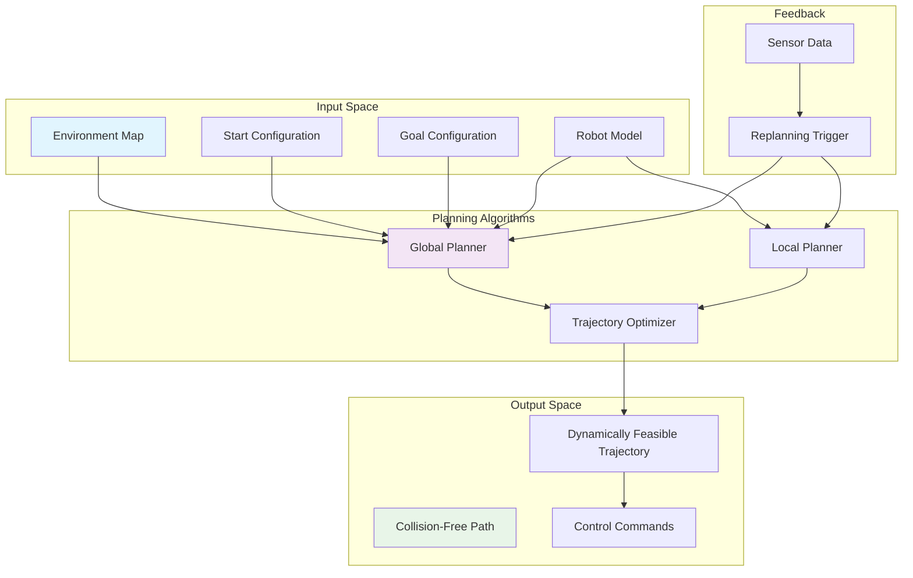

import Tabs from '@theme/Tabs';
import TabItem from '@theme/TabItem';

## Learning Outcomes

After completing this chapter, you will be able to:
1. Implement fundamental pathfinding algorithms including A*, Dijkstra, and RRT
2. Apply configuration space concepts for robot motion planning
3. Design and evaluate trajectory optimization methods for smooth robot motion
4. Integrate motion planning with perception and control systems
5. Implement dynamic path replanning for changing environments
6. Apply sampling-based motion planning techniques for high-dimensional spaces
7. Evaluate path quality metrics including safety, efficiency, and smoothness
8. Implement collision detection and avoidance algorithms for safe navigation

## Gherkin Specifications

### Scenario 1: Pathfinding in Static Environment
- **Given** a robot in a known static environment with start and goal positions
- **When** pathfinding algorithm is executed
- **Then** a valid path from start to goal is computed without collisions

### Scenario 2: Dynamic Obstacle Avoidance
- **Given** a robot navigating with moving obstacles detected
- **When** replanning algorithm is triggered
- **Then** a new collision-free path is computed considering dynamic obstacles

### Scenario 3: Trajectory Optimization
- **Given** a geometric path for the robot
- **When** trajectory optimization is applied
- **Then** a smooth, dynamically feasible trajectory is produced

### Scenario 4: Configuration Space Planning
- **Given** a robot with multiple degrees of freedom
- **When** planning algorithm operates in configuration space
- **Then** valid paths in joint space are computed avoiding configuration obstacles

### Scenario 5: Multi-Modal Motion Planning
- **Given** a robot with different motion capabilities (e.g., walking, climbing)
- **When** multi-modal planner is executed
- **Then** paths utilizing different motion modes are generated

## Theory & Intuition

Think of robot motion planning like planning a hiking route through complex terrain. A hiker needs to find a path from the trailhead to the summit, considering obstacles like cliffs, lakes, and dense forests. The hiker evaluates different possible routes, weighing factors like distance, elevation gain, and safety.

In robotics, motion planning algorithms are like sophisticated GPS systems for robots, but instead of just finding the shortest path between two points on a road map, they must consider the robot's shape, size, and movement capabilities. The algorithm works in the "configuration space" - an abstract space where each point represents a possible configuration (position and orientation) of the robot.

For a mobile robot, the configuration space might be its 2D position (x, y) and orientation (θ), while for a robotic arm, it might be the joint angles of each arm segment. Planning in this space means finding a path that avoids "configuration obstacles" - the set of robot configurations where the robot would collide with environmental obstacles.

Motion planning is like having different hiking strategies for different terrains: A* is like carefully studying your map to find the optimal route before starting, RRT (Rapidly-exploring Random Tree) is like systematically exploring unknown terrain by branching out in different directions, and trajectory optimization is like smoothing out a rough trail to make it comfortable to walk on.

## Core Concepts

<Tabs
  defaultValue="diagram"
  values={[
    {label: 'Motion Planning Architecture', value: 'diagram'},
    {label: 'Algorithm Categories', value: 'table'},
  ]}>
  <TabItem value="diagram">



  </TabItem>
  <TabItem value="table">

| Algorithm Category | Purpose | Common Examples |
|-------------------|---------|-----------------|
| Graph-based | Pathfinding on discrete grids | A*, Dijkstra, Jump Point Search |
| Sampling-based | Planning in continuous spaces | RRT, RRT*, PRM |
| Optimization-based | Smooth trajectory generation | CHOMP, TrajOpt, STOMP |
| Potential Fields | Local obstacle avoidance | Artificial Potential Fields |

  </TabItem>
</Tabs>

## Hands-On Labs

<Tabs
  defaultValue="lab1"
  values={[
    {label: 'Lab 1: A* Pathfinding Implementation', value: 'lab1'},
    {label: 'Lab 2: RRT Motion Planning', value: 'lab2'},
    {label: 'Lab 3: Trajectory Optimization', value: 'lab3'},
  ]}>
  <TabItem value="lab1">

### Lab 1: A* Pathfinding Implementation

#### Objective
Implement the A* pathfinding algorithm for grid-based navigation.

#### Required Components
- Python with standard libraries
- Visualization tools (matplotlib)
- ROS 2 environment (optional for visualization)

#### Steps
1. **Create a motion planning package**:
   ```bash
   cd ~/robot_ws/src
   ros2 pkg create --build-type ament_python motion_planning --dependencies rclpy geometry_msgs nav_msgs sensor_msgs
   ```

2. **Create the A* pathfinding node**:
   ```bash
   nano ~/robot_ws/src/motion_planning/motion_planning/astar_planner.py
   ```

3. **Add the A* implementation**:
   ```python
   #!/usr/bin/env python3
   import rclpy
   from rclpy.node import Node
   from geometry_msgs.msg import PoseStamped, Point
   from nav_msgs.msg import OccupancyGrid, Path
   from std_msgs.msg import Header
   import math
   import heapq
   import numpy as np
   from typing import List, Tuple, Optional

   class NodeItem:
       def __init__(self, x: int, y: int, g_cost: float = 0.0, h_cost: float = 0.0, parent=None):
           self.x = x
           self.y = y
           self.g_cost = g_cost  # Cost from start
           self.h_cost = h_cost  # Heuristic cost to goal
           self.f_cost = g_cost + h_cost  # Total cost
           self.parent = parent

       def __lt__(self, other):
           return self.f_cost < other.f_cost

       def __eq__(self, other):
           return self.x == other.x and self.y == other.y

   class AStarPlanner(Node):
       def __init__(self):
           super().__init__('astar_planner')
           
           # Parameters
           self.declare_parameter('resolution', 0.1)  # meters per grid cell
           self.declare_parameter('robot_radius', 0.2)  # meters
           self.declare_parameter('inflation_radius', 0.1)  # meters
           
           self.resolution = self.get_parameter('resolution').value
           self.robot_radius = self.get_parameter('robot_radius').value
           self.inflation_radius = self.get_parameter('inflation_radius').value
           
           # Publishers and subscribers
           self.grid_sub = self.create_subscription(
               OccupancyGrid,
               '/map',
               self.map_callback,
               10
           )
           
           self.path_pub = self.create_publisher(
               Path,
               '/astar_path',
               10
           )
           
           self.start_sub = self.create_subscription(
               PoseStamped,
               '/move_base_simple/goal',  # This topic is often used for goals
               self.goal_callback,
               10
           )
           
           # Map data
           self.map_data = None
           self.map_width = 0
           self.map_height = 0
           self.map_resolution = 0.0
           self.map_origin_x = 0.0
           self.map_origin_y = 0.0
           
           # Goal position (grid coordinates)
           self.goal_x = None
           self.goal_y = None
           
           self.get_logger().info('A* Planner initialized')

       def map_callback(self, msg):
           """Store the occupancy grid map"""
           self.map_data = msg.data
           self.map_width = msg.info.width
           self.map_height = msg.info.height
           self.map_resolution = msg.info.resolution
           self.map_origin_x = msg.info.origin.position.x
           self.map_origin_y = msg.info.origin.position.y
           
           self.get_logger().info(f'Map received: {self.map_width}x{self.map_height}, res: {self.map_resolution}')

       def goal_callback(self, msg):
           """Process goal pose and plan path"""
           if self.map_data is None:
               self.get_logger().warn('No map available, cannot plan path')
               return
           
           # Convert goal from world coordinates to grid coordinates
           goal_x = msg.pose.position.x
           goal_y = msg.pose.position.y
           
           grid_x = int((goal_x - self.map_origin_x) / self.map_resolution)
           grid_y = int((goal_y - self.map_origin_y) / self.map_resolution)
           
           # Validate grid coordinates
           if not (0 <= grid_x < self.map_width and 0 <= grid_y < self.map_height):
               self.get_logger().warn(f'Goal ({grid_x}, {grid_y}) out of map bounds')
               return
           
           # Check if goal cell is free
           goal_index = grid_y * self.map_width + grid_x
           if self.map_data[goal_index] > 50:  # Occupied or unknown
               self.get_logger().warn(f'Goal cell is occupied, value: {self.map_data[goal_index]}')
               return
           
           # Plan path
           path = self.astar_plan(grid_x, grid_y)
           if path:
               self.publish_path(path)
               self.get_logger().info(f'Path found with {len(path)} waypoints')
           else:
               self.get_logger().warn('No path found!')

       def heuristic(self, x1: int, y1: int, x2: int, y2: int) -> float:
           """Calculate heuristic distance (Euclidean)"""
           return math.sqrt((x1 - x2)**2 + (y1 - y2)**2)

       def is_valid_cell(self, x: int, y: int) -> bool:
           """Check if a cell is valid (within bounds and not occupied)"""
           if not (0 <= x < self.map_width and 0 <= y < self.map_height):
               return False
           
           index = y * self.map_width + x
           cell_value = self.map_data[index]
           
           # Check if cell is free (value < 50 is considered free)
           return cell_value < 50

       def get_neighbors(self, x: int, y: int) -> List[Tuple[int, int, float]]:
           """Get valid neighbors of a cell (8-directional)"""
           neighbors = []
           
           # 8-connected neighborhood
           for dx in [-1, 0, 1]:
               for dy in [-1, 0, 1]:
                   if dx == 0 and dy == 0:
                       continue
                   
                   new_x, new_y = x + dx, y + dy
                   
                   if self.is_valid_cell(new_x, new_y):
                       # Calculate cost (diagonal moves cost more)
                       cost = math.sqrt(dx*dx + dy*dy)
                       neighbors.append((new_x, new_y, cost))
           
           return neighbors

       def astar_plan(self, goal_x: int, goal_y: int) -> Optional[List[Tuple[int, int]]]:
           """Execute A* pathfinding algorithm"""
           # For this example, assume start is at (10, 10) in grid coordinates
           start_x, start_y = 10, 10
           
           # Check if start is valid
           if not self.is_valid_cell(start_x, start_y):
               self.get_logger().warn(f'Start cell ({start_x}, {start_y}) is not valid')
               return None
           
           # Initialize open and closed sets
           open_set = []
           closed_set = set()
           
           # Create start node
           start_node = NodeItem(start_x, start_y)
           start_node.g_cost = 0
           start_node.h_cost = self.heuristic(start_x, start_y, goal_x, goal_y)
           start_node.f_cost = start_node.h_cost
           
           heapq.heappush(open_set, start_node)
           
           # Track nodes for path reconstruction
           visited_nodes = {(start_x, start_y): start_node}
           
           while open_set:
               # Get node with lowest f_cost
               current_node = heapq.heappop(open_set)
               current_pos = (current_node.x, current_node.y)
               
               # Check if we reached the goal
               if current_node.x == goal_x and current_node.y == goal_y:
                   # Reconstruct path
                   path = []
                   node = current_node
                   while node:
                       path.append((node.x, node.y))
                       node = node.parent
                   path.reverse()
                   return path
               
               # Add current node to closed set
               closed_set.add(current_pos)
               
               # Explore neighbors
               for neighbor_x, neighbor_y, move_cost in self.get_neighbors(current_node.x, current_node.y):
                   neighbor_pos = (neighbor_x, neighbor_y)
                   
                   if neighbor_pos in closed_set:
                       continue
                   
                   # Calculate tentative g_cost
                   tentative_g = current_node.g_cost + move_cost
                   
                   # Check if this path is better than any previous one
                   if neighbor_pos not in visited_nodes:
                       # Create new node
                       neighbor_node = NodeItem(neighbor_x, neighbor_y)
                       neighbor_node.parent = current_node
                       neighbor_node.g_cost = tentative_g
                       neighbor_node.h_cost = self.heuristic(neighbor_x, neighbor_y, goal_x, goal_y)
                       neighbor_node.f_cost = tentative_g + neighbor_node.h_cost
                       
                       visited_nodes[neighbor_pos] = neighbor_node
                       heapq.heappush(open_set, neighbor_node)
                   else:
                       # Check if this path is better
                       existing_node = visited_nodes[neighbor_pos]
                       if tentative_g < existing_node.g_cost:
                           # Update the existing node
                           existing_node.parent = current_node
                           existing_node.g_cost = tentative_g
                           existing_node.f_cost = tentative_g + existing_node.h_cost
                           # Add to open set again to update its priority
                           heapq.heappush(open_set, existing_node)
           
           # No path found
           return None

       def publish_path(self, grid_path: List[Tuple[int, int]]):
           """Convert grid path to ROS Path message and publish"""
           path_msg = Path()
           path_msg.header = Header()
           path_msg.header.stamp = self.get_clock().now().to_msg()
           path_msg.header.frame_id = 'map'  # Assuming map frame
            
           for grid_x, grid_y in grid_path:
               # Convert grid coordinates to world coordinates
               world_x = grid_x * self.map_resolution + self.map_origin_x
               world_y = grid_y * self.map_resolution + self.map_origin_y
               
               pose = PoseStamped()
               pose.header = path_msg.header  # Use same header
               pose.pose.position.x = world_x
               pose.pose.position.y = world_y
               pose.pose.position.z = 0.0
               pose.pose.orientation.w = 1.0  # No rotation
               
               path_msg.poses.append(pose)
           
           self.path_pub.publish(path_msg)

   def main(args=None):
       rclpy.init(args=args)
       node = AStarPlanner()
       
       try:
           rclpy.spin(node)
       except KeyboardInterrupt:
           node.get_logger().info('A* planner node terminated')
       finally:
           node.destroy_node()
           rclpy.shutdown()

   if __name__ == '__main__':
       main()
   ```

4. **Create a grid visualization tool**:
   ```bash
   nano ~/robot_ws/src/motion_planning/motion_planning/grid_visualizer.py
   ```

5. **Add grid visualization code**:
   ```python
   #!/usr/bin/env python3
   import rclpy
   from rclpy.node import Node
   from nav_msgs.msg import OccupancyGrid
   from geometry_msgs.msg import PoseStamped
   import matplotlib.pyplot as plt
   import numpy as np
   import threading

   class GridVisualizer(Node):
       def __init__(self):
           super().__init__('grid_visualizer')
           
           # Store the map data
           self.map_data = None
           self.map_width = 0
           self.map_height = 0
           self.map_resolution = 1.0
           self.map_origin_x = 0.0
           self.map_origin_y = 0.0
           
           # Store start and goal positions
           self.start_pos = None
           self.goal_pos = None
           
           # Subscription to map
           self.map_sub = self.create_subscription(
               OccupancyGrid,
               '/map',
               self.map_callback,
               10
           )
           
           # Subscription to goal
           self.goal_sub = self.create_subscription(
               PoseStamped,
               '/move_base_simple/goal',
               self.goal_callback,
               10
           )
           
           # Visualization timer
           self.viz_timer = self.create_timer(1.0, self.visualize_map)
           
           self.get_logger().info('Grid visualizer initialized')

       def map_callback(self, msg):
           """Store the occupancy grid map"""
           self.map_data = np.array(msg.data).reshape((msg.info.height, msg.info.width))
           self.map_width = msg.info.width
           self.map_height = msg.info.height
           self.map_resolution = msg.info.resolution
           self.map_origin_x = msg.info.origin.position.x
           self.map_origin_y = msg.info.origin.position.y
           
           self.get_logger().info(f'Map data shape: {self.map_data.shape}')

       def goal_callback(self, msg):
           """Store goal position"""
           # Convert world coordinates to grid coordinates
           grid_x = int((msg.pose.position.x - self.map_origin_x) / self.map_resolution)
           grid_y = int((msg.pose.position.y - self.map_origin_y) / self.map_resolution)
           self.goal_pos = (grid_x, grid_y)
           
           self.get_logger().info(f'Goal position updated: world=({msg.pose.position.x}, {msg.pose.position.y}), grid=({grid_x}, {grid_y})')

       def visualize_map(self):
           """Visualize the occupancy grid map"""
           if self.map_data is not None:
               plt.figure(figsize=(10, 8))
               
               # Create the plot
               plt.imshow(self.map_data, cmap='gray', origin='lower', 
                         extent=[self.map_origin_x, 
                                self.map_origin_x + self.map_width * self.map_resolution,
                                self.map_origin_y, 
                                self.map_origin_y + self.map_height * self.map_resolution])
               
               # Mark goal position if available
               if self.goal_pos:
                   goal_x_world = self.goal_pos[0] * self.map_resolution + self.map_origin_x
                   goal_y_world = self.goal_pos[1] * self.map_resolution + self.map_origin_y
                   plt.plot(goal_x_world, goal_y_world, 'ro', markersize=10, label='Goal')
               
               # Add colorbar and labels
               plt.colorbar(label='Occupancy Value')
               plt.title('Occupancy Grid Map')
               plt.xlabel('X (meters)')
               plt.ylabel('Y (meters)')
               plt.legend()
               plt.grid(True, alpha=0.3)
               plt.tight_layout()
               
               # Show the plot (non-blocking)
               plt.show(block=False)
               
               # Pause briefly to allow the plot to update
               plt.pause(0.001)

   def main(args=None):
       rclpy.init(args=args)
       node = GridVisualizer()
       
       try:
           rclpy.spin(node)
       except KeyboardInterrupt:
           node.get_logger().info('Grid visualizer terminated')
       finally:
           node.destroy_node()
           rclpy.shutdown()

   if __name__ == '__main__':
       main()
   ```

6. **Update setup.py**:
   ```bash
   nano ~/robot_ws/src/motion_planning/setup.py
   ```

7. **Add the entry points**:
   ```python
   entry_points={
       'console_scripts': [
           'astar_planner = motion_planning.astar_planner:main',
           'grid_visualizer = motion_planning.grid_visualizer:main',
       ],
   }
   ```

8. **Make the files executable and build**:
   ```bash
   chmod +x ~/robot_ws/src/motion_planning/motion_planning/astar_planner.py
   chmod +x ~/robot_ws/src/motion_planning/motion_planning/grid_visualizer.py
   cd ~/robot_ws
   colcon build --packages-select motion_planning
   source install/setup.bash
   ```

9. **Run the A* planner**:
   ```bash
   ros2 run motion_planning astar_planner
   ```

#### Expected Outcome
A* pathfinding algorithm operational, finding collision-free paths on a grid map from start to goal positions.

  </TabItem>
  <TabItem value="lab2">

### Lab 2: RRT Motion Planning

#### Objective
Implement the RRT (Rapidly-exploring Random Tree) algorithm for motion planning in continuous spaces.

#### Required Components
- Python with standard libraries
- NumPy for mathematical operations
- Matplotlib for visualization

#### Steps
1. **Create an RRT implementation**:
   ```bash
   nano ~/robot_ws/src/motion_planning/motion_planning/rrt_planner.py
   ```

2. **Add the RRT implementation**:
   ```python
   #!/usr/bin/env python3
   import rclpy
   from rclpy.node import Node
   from geometry_msgs.msg import Point, PoseStamped
   from nav_msgs.msg import Path
   from std_msgs.msg import Header
   import numpy as np
   import math
   import random
   from typing import List, Tuple, Optional

   class RRTNode:
       def __init__(self, x: float, y: float, parent=None):
           self.x = x
           self.y = y
           self.parent = parent

   class RRTPlanner(Node):
       def __init__(self):
           super().__init__('rrt_planner')
           
           # Parameters
           self.declare_parameter('step_size', 0.5)  # meters
           self.declare_parameter('goal_radius', 0.5)  # meters
           self.declare_parameter('max_iterations', 1000)
           self.declare_parameter('map_bounds', [-10.0, 10.0, -10.0, 10.0])  # [min_x, max_x, min_y, max_y]
           
           self.step_size = self.get_parameter('step_size').value
           self.goal_radius = self.get_parameter('goal_radius').value
           self.max_iterations = self.get_parameter('max_iterations').value
           self.bounds = self.get_parameter('map_bounds').value
           
           # Publishers and subscribers
           self.path_pub = self.create_publisher(
               Path,
               '/rrt_path',
               10
           )
           
           # Goal subscription
           self.goal_sub = self.create_subscription(
               PoseStamped,
               '/move_base_simple/goal',
               self.goal_callback,
               10
           )
           
           # Start position (for this example, we'll use a fixed start)
           self.start_pos = (0.0, 0.0)  # (x, y)
           self.goal_pos = None
           
           # Obstacles definition (for this example, hard-coded)
           self.obstacles = [
               # Format: (center_x, center_y, radius)
               (2, 2, 1),
               (5, 5, 1.5),
               (-3, 4, 1),
               (3, -4, 1.2),
           ]
           
           self.get_logger().info('RRT Planner initialized')

       def goal_callback(self, msg):
           """Process goal pose and plan path with RRT"""
           goal_x = msg.pose.position.x
           goal_y = msg.pose.position.y
           self.goal_pos = (goal_x, goal_y)
           
           self.get_logger().info(f'Planning path to goal: ({goal_x}, {goal_y})')
           
           # Plan path
           path = self.rrt_plan()
           if path:
               self.publish_path(path)
               self.get_logger().info(f'RRT path found with {len(path)} waypoints')
           else:
               self.get_logger().warn('RRT: No path found!')

       def is_collision(self, point: Tuple[float, float]) -> bool:
           """Check if a point is in collision with obstacles"""
           x, y = point
           
           # Check against each circular obstacle
           for obs_x, obs_y, obs_radius in self.obstacles:
               distance = math.sqrt((x - obs_x)**2 + (y - obs_y)**2)
               if distance < obs_radius:
                   return True
           
           # Check bounds
           min_x, max_x, min_y, max_y = self.bounds
           if not (min_x <= x <= max_x and min_y <= y <= max_y):
               return True
           
           return False

       def nearest_node(self, tree: List[RRTNode], target: Tuple[float, float]) -> RRTNode:
           """Find the nearest node in the tree to the target point"""
           nearest = tree[0]
           min_dist = math.sqrt((nearest.x - target[0])**2 + (nearest.y - target[1])**2)
           
           for node in tree:
               dist = math.sqrt((node.x - target[0])**2 + (node.y - target[1])**2)
               if dist < min_dist:
                   min_dist = dist
                   nearest = node
           
           return nearest

       def new_config(self, nearest: RRTNode, target: Tuple[float, float]) -> Tuple[float, float]:
           """Generate a new configuration between nearest node and random target"""
           # Calculate direction vector
           dx = target[0] - nearest.x
           dy = target[1] - nearest.y
           dist = math.sqrt(dx*dx + dy*dy)
           
           # If distance is small enough, just return the target
           if dist < self.step_size:
               return target
           
           # Calculate new point in the direction of target, step_size away
           factor = self.step_size / dist
           new_x = nearest.x + dx * factor
           new_y = nearest.y + dy * factor
           
           return (new_x, new_y)

       def rrt_plan(self) -> Optional[List[Tuple[float, float]]]:
           """Execute RRT path planning algorithm"""
           if self.goal_pos is None:
               return None
           
           # Initialize tree with start node
           start_node = RRTNode(self.start_pos[0], self.start_pos[1])
           tree = [start_node]
           
           # Check if start or goal are in collision
           if self.is_collision(self.start_pos) or self.is_collision(self.goal_pos):
               self.get_logger().warn('Start or goal position is in collision')
               return None
           
           for i in range(self.max_iterations):
               # Randomly sample a point (bias toward goal occasionally)
               if i % 10 == 0:  # Bias toward goal every 10 iterations
                   rand_point = self.goal_pos
               else:
                   rand_point = (
                       random.uniform(self.bounds[0], self.bounds[1]),
                       random.uniform(self.bounds[2], self.bounds[3])
                   )
               
               # Find nearest node in tree
               nearest_node = self.nearest_node(tree, rand_point)
               
               # Generate new configuration
               new_pos = self.new_config(nearest_node, rand_point)
               
               # Check for collision
               if not self.is_collision(new_pos):
                   # Add new node to tree
                   new_node = RRTNode(new_pos[0], new_pos[1], nearest_node)
                   tree.append(new_node)
                   
                   # Check if we've reached the goal
                   dist_to_goal = math.sqrt(
                       (new_pos[0] - self.goal_pos[0])**2 + 
                       (new_pos[1] - self.goal_pos[1])**2
                   )
                   
                   if dist_to_goal < self.goal_radius:
                       # Reconstruct path
                       path = []
                       current = new_node
                       while current:
                           path.append((current.x, current.y))
                           current = current.parent
                       path.reverse()
                       return path
           
           # If we reach max iterations without finding path
           self.get_logger().warn(f'RRT: Max iterations ({self.max_iterations}) reached without finding path')
           return None

       def publish_path(self, path: List[Tuple[float, float]]):
           """Convert path to ROS Path message and publish"""
           path_msg = Path()
           path_msg.header = Header()
           path_msg.header.stamp = self.get_clock().now().to_msg()
           path_msg.header.frame_id = 'map'
           
           for x, y in path:
               pose = PoseStamped()
               pose.header = path_msg.header
               pose.pose.position.x = x
               pose.pose.position.y = y
               pose.pose.position.z = 0.0
               pose.pose.orientation.w = 1.0
               
               path_msg.poses.append(pose)
           
           self.path_pub.publish(path_msg)

   class RRTStarPlanner(RRTPlanner):
       """Extended RRT* implementation with rewiring capabilities"""
       
       def __init__(self):
           super().__init__()
           self.get_logger().info('RRT* Planner initialized')

       def nearest_nodes(self, tree: List[RRTNode], target: Tuple[float, float], radius: float) -> List[RRTNode]:
           """Find all nodes within a given radius of the target"""
           neighbors = []
           for node in tree:
               dist = math.sqrt((node.x - target[0])**2 + (node.y - target[1])**2)
               if dist < radius:
                   neighbors.append(node)
           return neighbors

       def rrt_plan(self) -> Optional[List[Tuple[float, float]]]:
           """Execute RRT* path planning algorithm (with rewiring)"""
           if self.goal_pos is None:
               return None
           
           # Initialize tree with start node
           start_node = RRTNode(self.start_pos[0], self.start_pos[1])
           start_node.cost = 0.0  # Cost from start
           tree = [start_node]
           
           # Check if start or goal are in collision
           if self.is_collision(self.start_pos) or self.is_collision(self.goal_pos):
               self.get_logger().warn('Start or goal position is in collision')
               return None
           
           # Calculate connection radius for RRT*
           gamma = 1.0  # Adjust as needed
           unit_ball_volume = math.pi  # 2D
           dimension = 2
           
           for i in range(self.max_iterations):
               # Randomly sample a point (bias toward goal occasionally)
               if i % 10 == 0:  # Bias toward goal every 10 iterations
                   rand_point = self.goal_pos
               else:
                   rand_point = (
                       random.uniform(self.bounds[0], self.bounds[1]),
                       random.uniform(self.bounds[2], self.bounds[3])
                   )
               
               # Find nearest node in tree
               nearest_node = self.nearest_node(tree, rand_point)
               
               # Generate new configuration
               new_pos = self.new_config(nearest_node, rand_point)
               
               # Check for collision
               if not self.is_collision(new_pos):
                   # Find neighbors within radius
                   r = gamma * math.sqrt(math.log(i+1) / (i+1))
                   neighbors = self.nearest_nodes(tree, new_pos, r)
                   
                   # Find best parent among neighbors
                   min_cost = nearest_node.cost + math.sqrt(
                       (nearest_node.x - new_pos[0])**2 + (nearest_node.y - new_pos[1])**2
                   )
                   best_parent = nearest_node
                   
                   for neighbor in neighbors:
                       dist = math.sqrt(
                           (neighbor.x - new_pos[0])**2 + (neighbor.y - new_pos[1])**2
                       )
                       cost = neighbor.cost + dist
                       
                       if cost < min_cost and not self.is_collision_path((neighbor.x, neighbor.y), new_pos):
                           min_cost = cost
                           best_parent = neighbor
                   
                   # Add new node to tree
                   new_node = RRTNode(new_pos[0], new_pos[1], best_parent)
                   new_node.cost = min_cost
                   tree.append(new_node)
                   
                   # Rewire the tree: check if new node offers better paths to neighbors
                   for neighbor in neighbors:
                       dist = math.sqrt(
                           (neighbor.x - new_pos[0])**2 + (neighbor.y - new_pos[1])**2
                       )
                       new_cost = min_cost + dist
                       
                       if new_cost < neighbor.cost and not self.is_collision_path(new_pos, (neighbor.x, neighbor.y)):
                           neighbor.parent = new_node
                           neighbor.cost = new_cost
                   
                   # Check if we've reached the goal
                   dist_to_goal = math.sqrt(
                       (new_pos[0] - self.goal_pos[0])**2 + 
                       (new_pos[1] - self.goal_pos[1])**2
                   )
                   
                   if dist_to_goal < self.goal_radius:
                       # Reconstruct path
                       path = []
                       current = new_node
                       while current:
                           path.append((current.x, current.y))
                           current = current.parent
                       path.reverse()
                       return path
           
           # If we reach max iterations without finding path
           self.get_logger().warn(f'RRT*: Max iterations ({self.max_iterations}) reached without finding path')
           return None

       def is_collision_path(self, start: Tuple[float, float], end: Tuple[float, float]) -> bool:
           """Check for collision along a straight path"""
           # Use more samples to check entire path
           dist = math.sqrt((start[0] - end[0])**2 + (start[1] - end[1])**2)
           steps = int(dist / (self.step_size / 2))  # Check more points along the path
           steps = max(1, steps)
           
           for i in range(steps + 1):
               t = i / steps
               x = start[0] + (end[0] - start[0]) * t
               y = start[1] + (end[1] - start[1]) * t
               
               if self.is_collision((x, y)):
                   return True
           
           return False

   def main(args=None):
       rclpy.init(args=args)
       node = RRTPlanner()  # or RRTStarPlanner()
       
       try:
           rclpy.spin(node)
       except KeyboardInterrupt:
           node.get_logger().info('RRT planner node terminated')
       finally:
           node.destroy_node()
           rclpy.shutdown()

   if __name__ == '__main__':
       main()
   ```

3. **Add the RRT entry point to setup.py**:
   ```bash
   nano ~/robot_ws/src/motion_planning/setup.py
   ```

4. **Update the entry points**:
   ```python
   entry_points={
       'console_scripts': [
           'astar_planner = motion_planning.astar_planner:main',
           'grid_visualizer = motion_planning.grid_visualizer:main',
           'rrt_planner = motion_planning.rrt_planner:main',
       ],
   }
   ```

5. **Make the file executable and rebuild**:
   ```bash
   chmod +x ~/robot_ws/src/motion_planning/motion_planning/rrt_planner.py
   cd ~/robot_ws
   colcon build --packages-select motion_planning
   source install/setup.bash
   ```

6. **Run the RRT planner**:
   ```bash
   ros2 run motion_planning rrt_planner
   ```

#### Expected Outcome
RRT motion planning algorithm operational, exploring the configuration space to find a path around obstacles from start to goal.

  </TabItem>
  <TabItem value="lab3">

### Lab 3: Trajectory Optimization

#### Objective
Implement trajectory optimization for generating smooth, dynamically feasible robot trajectories.

#### Required Components
- Python with NumPy and SciPy
- Optimization libraries (scipy.optimize)
- ROS 2 environment

#### Steps
1. **Create a trajectory optimization node**:
   ```bash
   nano ~/robot_ws/src/motion_planning/motion_planning/trajectory_optimizer.py
   ```

2. **Add the trajectory optimization implementation**:
   ```python
   #!/usr/bin/env python3
   import rclpy
   from rclpy.node import Node
   from geometry_msgs.msg import Point, PoseStamped, Twist
   from nav_msgs.msg import Path
   from std_msgs.msg import Header
   from motion_planning.msg import TrajectoryPoint, RobotTrajectory  # We'll define this message
   import numpy as np
   import math
   from scipy.optimize import minimize, NonlinearConstraint
   from scipy.interpolate import CubicSpline
   import matplotlib.pyplot as plt
   from typing import List, Tuple

   class TrajectoryOptimizerNode(Node):
       def __init__(self):
           super().__init__('trajectory_optimizer')
           
           # Parameters
           self.declare_parameter('max_velocity', 1.0)  # m/s
           self.declare_parameter('max_acceleration', 2.0)  # m/s^2
           self.declare_parameter('max_curvature', 1.0)  # m^-1
           self.declare_parameter('dt', 0.1)  # time step in seconds
           self.declare_parameter('smoothness_weight', 1.0)
           self.declare_parameter('obstacle_weight', 10.0)
           self.declare_parameter('feasibility_weight', 5.0)
           
           self.max_velocity = self.get_parameter('max_velocity').value
           self.max_acceleration = self.get_parameter('max_acceleration').value
           self.max_curvature = self.get_parameter('max_curvature').value
           self.dt = self.get_parameter('dt').value
           self.smoothness_weight = self.get_parameter('smoothness_weight').value
           self.obstacle_weight = self.get_parameter('obstacle_weight').value
           self.feasibility_weight = self.get_parameter('feasibility_weight').value
           
           # Publishers and subscribers
           self.path_sub = self.create_subscription(
               Path,
               '/input_path',  # Input path to smooth
               self.path_callback,
               10
           )
           
           self.optimized_path_pub = self.create_publisher(
               Path,
               '/optimized_path',
               10
           )
           
           self.velocity_profile_pub = self.create_publisher(
               Path,  # Reusing Path for visualization of velocity along trajectory
               '/velocity_profile',
               10
           )
           
           # Obstacles (for this example, hard-coded)
           self.obstacles = [
               # Format: (x, y, radius)
               (2.0, 2.0, 0.5),
               (4.0, 4.0, 0.7),
               (6.0, 1.0, 0.4),
           ]
           
           self.get_logger().info('Trajectory Optimizer initialized')

       def path_callback(self, msg):
           """Process an input path and optimize it"""
           if len(msg.poses) < 2:
               self.get_logger().warn('Input path has fewer than 2 points')
               return
           
           # Extract waypoints from input path
           waypoints = [(p.pose.position.x, p.pose.position.y) for p in msg.poses]
           
           self.get_logger().info(f'Optimizing path with {len(waypoints)} waypoints')
           
           # Optimize the trajectory
           optimized_waypoints = self.optimize_trajectory(waypoints)
           
           if optimized_waypoints:
               self.publish_optimized_path(optimized_waypoints)
               self.get_logger().info(f'Optimized path published with {len(optimized_waypoints)} points')
           else:
               self.get_logger().warn('Trajectory optimization failed')

       def optimize_trajectory(self, waypoints: List[Tuple[float, float]]) -> List[Tuple[float, float]]:
           """Optimize a trajectory to make it smooth and dynamically feasible"""
           if len(waypoints) < 2:
               return waypoints
           
           # Convert waypoints to numpy array
           path_array = np.array(waypoints)
           
           # Use cubic spline interpolation to get smooth path
           t = np.arange(len(path_array))
           
           try:
               # Create cubic splines for x and y separately
               cs_x = CubicSpline(t, path_array[:, 0])
               cs_y = CubicSpline(t, path_array[:, 1])
               
               # Create more points along the spline
               t_fine = np.linspace(0, len(path_array) - 1, num=len(path_array) * 5)  # 5x more points
               smooth_x = cs_x(t_fine)
               smooth_y = cs_y(t_fine)
               
               # Pack into optimized waypoints
               optimized_waypoints = list(zip(smooth_x, smooth_y))
               
               # Further optimization: minimize a cost function
               # Flatten the path for optimization (x0, y0, x1, y1, ...)
               initial_guess = []
               for x, y in optimized_waypoints:
                   initial_guess.extend([x, y])
               
               # Define the optimization problem
               result = minimize(
                   self.trajectory_cost_function,
                   initial_guess,
                   method='SLSQP',
                   constraints=[
                       # Add constraints for obstacles and dynamics if needed
                   ],
                   options={'maxiter': 100}
               )
               
               if result.success:
                   # Extract optimized path
                   opt_array = result.x.reshape(-1, 2)
                   return [(float(x), float(y)) for x, y in opt_array]
               else:
                   self.get_logger().warn('Optimization failed, returning spline path')
                   return optimized_waypoints
           except Exception as e:
               self.get_logger().error(f'Error in trajectory optimization: {e}')
               return waypoints  # Return original path if optimization fails

       def trajectory_cost_function(self, path_flat: np.ndarray) -> float:
           """Calculate the cost of a trajectory (to be minimized)"""
           # Reshape the flat path back to (x, y) pairs
           path = path_flat.reshape(-1, 2)
           
           if len(path) < 2:
               return float('inf')
           
           # Calculate total cost components
           smoothness_cost = self.calculate_smoothness_cost(path)
           obstacle_cost = self.calculate_obstacle_cost(path)
           feasibility_cost = self.calculate_feasibility_cost(path)
           
           total_cost = (
               self.smoothness_weight * smoothness_cost +
               self.obstacle_weight * obstacle_cost +
               self.feasibility_weight * feasibility_cost
           )
           
           return total_cost

       def calculate_smoothness_cost(self, path: np.ndarray) -> float:
           """Calculate cost based on trajectory smoothness (curvature)"""
           if len(path) < 3:
               return 0.0
           
           # Calculate curvature at each point (approximation)
           total_curvature = 0.0
           for i in range(1, len(path) - 1):
               p0 = path[i-1]
               p1 = path[i]
               p2 = path[i+1]
               
               # Calculate angle change
               v1 = p1 - p0
               v2 = p2 - p1
               
               # Calculate angle between segments
               cos_angle = np.dot(v1, v2) / (np.linalg.norm(v1) * np.linalg.norm(v2))
               cos_angle = np.clip(cos_angle, -1.0, 1.0)  # Prevent numerical errors
               angle = math.acos(cos_angle)
               
               # Curvature is related to the change in direction
               total_curvature += angle
           
           return total_curvature

       def calculate_obstacle_cost(self, path: np.ndarray) -> float:
           """Calculate cost based on proximity to obstacles"""
           total_cost = 0.0
           
           for point in path:
               min_distance = float('inf')
               
               # Find minimum distance to any obstacle
               for obs_x, obs_y, obs_radius in self.obstacles:
                   dist = math.sqrt((point[0] - obs_x)**2 + (point[1] - obs_y)**2)
                   dist = max(0.01, dist - obs_radius)  # Minimum distance to obstacle boundary
                   min_distance = min(min_distance, dist)
               
               # Add cost that increases as we get closer to obstacles
               # Use an exponential cost function: higher penalty when very close
               if min_distance < 2.0:  # Only penalize when close to obstacles
                   total_cost += math.exp(2.0 - min_distance)
           
           return total_cost

       def calculate_feasibility_cost(self, path: np.ndarray) -> float:
           """Calculate cost based on dynamic feasibility (velocity, acceleration)"""
           if len(path) < 2:
               return 0.0
           
           total_cost = 0.0
           
           # Calculate velocities and accelerations
           velocities = []
           accelerations = []
           
           for i in range(1, len(path)):
               dx = path[i][0] - path[i-1][0]
               dy = path[i][1] - path[i-1][1]
               dist = math.sqrt(dx*dx + dy*dy)
               velocity = dist / self.dt
               velocities.append(velocity)
           
           for i in range(1, len(velocities)):
               dv = velocities[i] - velocities[i-1]
               acceleration = dv / self.dt
               accelerations.append(abs(acceleration))
           
           # Penalize if velocities or accelerations exceed limits
           for v in velocities:
               if v > self.max_velocity:
                   total_cost += (v - self.max_velocity) ** 2
           
           for a in accelerations:
               if a > self.max_acceleration:
                   total_cost += (a - self.max_acceleration) ** 2
           
           return total_cost

       def publish_optimized_path(self, waypoints: List[Tuple[float, float]]):
           """Publish the optimized path as a ROS Path message"""
           path_msg = Path()
           path_msg.header = Header()
           path_msg.header.stamp = self.get_clock().now().to_msg()
           path_msg.header.frame_id = 'map'
           
           for x, y in waypoints:
               pose = PoseStamped()
               pose.header = path_msg.header
               pose.pose.position.x = x
               pose.pose.position.y = y
               pose.pose.position.z = 0.0
               pose.pose.orientation.w = 1.0
               
               path_msg.poses.append(pose)
           
           self.optimized_path_pub.publish(path_msg)

   class ModelPredictiveController(Node):
       """A simple MPC implementation for trajectory tracking"""
       
       def __init__(self):
           super().__init__('model_predictive_controller')
           
           # Parameters
           self.declare_parameter('prediction_horizon', 10)
           self.declare_parameter('dt', 0.1)
           self.declare_parameter('robot_wheelbase', 0.5)  # for bicycle model
           
           self.prediction_horizon = self.get_parameter('prediction_horizon').value
           self.dt = self.get_parameter('dt').value
           self.wheelbase = self.get_parameter('robot_wheelbase').value
           
           # Current state of the robot
           self.current_x = 0.0
           self.current_y = 0.0
           self.current_theta = 0.0
           self.current_v = 0.0
           
           # Subscriptions
           self.odom_sub = self.create_subscription(
               # We'll assume an odometry message format
               # For this example, we'll use a simple twist message to represent state
               # In practice, this would be a proper odometry message type
               PoseStamped,  # Using PoseStamped for simplicity
               '/robot_pose',  # This would come from your localization system
               self.odom_callback,
               10
           )
           
           self.trajectory_sub = self.create_subscription(
               Path,
               '/optimized_path',
               self.trajectory_callback,
               10
           )
           
           # Publisher for velocity commands
           self.cmd_vel_pub = self.create_publisher(
               Twist,
               '/cmd_vel',
               10
           )
           
           # Store reference trajectory
           self.reference_trajectory = []
           self.traj_idx = 0
           
           # Control timer
           self.control_timer = self.create_timer(self.dt, self.mpc_control)
           
           self.get_logger().info('MPC Controller initialized')

       def odom_callback(self, msg):
           """Update robot state from odometry"""
           self.current_x = msg.pose.position.x
           self.current_y = msg.pose.position.y
           
           # Convert quaternion to euler for theta
           # For simplicity, assume the robot is in 2D and only has rotation about z
           import tf_transformations
           quat = [msg.pose.orientation.x, msg.pose.orientation.y, msg.pose.orientation.z, msg.pose.orientation.w]
           euler = tf_transformations.euler_from_quaternion(quat)
           self.current_theta = euler[2]  # yaw angle

       def trajectory_callback(self, msg):
           """Store the reference trajectory"""
           self.reference_trajectory = [(p.pose.position.x, p.pose.position.y) for p in msg.poses]
           self.traj_idx = 0
           self.get_logger().info(f'Received trajectory with {len(self.reference_trajectory)} points')

       def mpc_control(self):
           """Execute MPC control loop"""
           if not self.reference_trajectory:
               # If no trajectory, stop the robot
               cmd = Twist()
               self.cmd_vel_pub.publish(cmd)
               return
           
           # Get current reference point (with look-ahead)
           if self.traj_idx < len(self.reference_trajectory):
               ref_x, ref_y = self.reference_trajectory[self.traj_idx]
               
               # Calculate position error
               dx = ref_x - self.current_x
               dy = ref_y - self.current_y
               
               # Transform to robot frame
               error_x = dx * math.cos(self.current_theta) + dy * math.sin(self.current_theta)
               error_y = -dx * math.sin(self.current_theta) + dy * math.cos(self.current_theta)
               
               # Simple proportional controller (in practice, this would be a full MPC solution)
               k_x = 1.0
               k_y = 1.0
               k_theta = 1.0
               
               # Calculate desired velocity components
               v_cmd = k_x * error_x  # Forward velocity
               omega_cmd = k_y * error_y + k_theta * math.atan2(dy, dx) - self.current_theta  # Angular velocity
               
               # Limit velocities
               v_cmd = max(-0.5, min(0.5, v_cmd))  # Limit to 0.5 m/s
               omega_cmd = max(-1.0, min(1.0, omega_cmd))  # Limit to 1.0 rad/s
               
               # Create and publish command
               cmd = Twist()
               cmd.linear.x = v_cmd
               cmd.angular.z = omega_cmd
               
               self.cmd_vel_pub.publish(cmd)
               
               # Update trajectory index based on progress
               # In a real implementation, this would be more sophisticated
               self.traj_idx = min(self.traj_idx + 1, len(self.reference_trajectory) - 1)
           else:
               # At the end of trajectory, slowly stop
               cmd = Twist()
               cmd.linear.x = 0.0
               cmd.angular.z = 0.0
               self.cmd_vel_pub.publish(cmd)

   def main(args=None):
       rclpy.init(args=args)
       
       # Initialize the trajectory optimizer
       optimizer = TrajectoryOptimizerNode()
       
       # For a complete system, you might also want the MPC controller
       controller = ModelPredictiveController()
       
       try:
           # Run both nodes
           executor = rclpy.executors.MultiThreadedExecutor()
           executor.add_node(optimizer)
           executor.add_node(controller)
           
           executor.spin()
       except KeyboardInterrupt:
           optimizer.get_logger().info('Trajectory optimizer terminated')
           controller.get_logger().info('MPC controller terminated')
       finally:
           optimizer.destroy_node()
           controller.destroy_node()
           rclpy.shutdown()

   if __name__ == '__main__':
       main()
   ```

3. **Create a path smoothing utility**:
   ```bash
   nano ~/robot_ws/src/motion_planning/motion_planning/path_smoothing.py
   ```

4. **Add path smoothing implementation**:
   ```python
   #!/usr/bin/env python3
   import rclpy
   from rclpy.node import Node
   from geometry_msgs.msg import PoseStamped
   from nav_msgs.msg import Path
   from std_msgs.msg import Header
   import numpy as np
   from scipy.ndimage import gaussian_filter1d
   from scipy.interpolate import UnivariateSpline
   import math

   class PathSmoothingNode(Node):
       def __init__(self):
           super().__init__('path_smoothing')
           
           # Parameters
           self.declare_parameter('smoothing_sigma', 1.0)
           self.declare_parameter('interpolation_points', 100)
           self.declare_parameter('max_curvature', 0.5)
           
           self.sigma = self.get_parameter('smoothing_sigma').value
           self.interp_points = self.get_parameter('interpolation_points').value
           self.max_curvature = self.get_parameter('max_curvature').value
           
           # Subscriptions and publishers
           self.path_sub = self.create_subscription(
               Path,
               '/input_path',
               self.path_callback,
               10
           )
           
           self.smoothed_path_pub = self.create_publisher(
               Path,
               '/smoothed_path',
               10
           )
           
           self.get_logger().info('Path Smoothing Node initialized')

       def path_callback(self, msg):
           """Process input path and publish smoothed version"""
           if len(msg.poses) < 3:
               # If path is too short, just publish as is
               self.smoothed_path_pub.publish(msg)
               return
           
           # Extract x and y coordinates
           x_coords = [p.pose.position.x for p in msg.poses]
           y_coords = [p.pose.position.y for p in msg.poses]
           
           # Apply Gaussian smoothing
           smoothed_x = gaussian_filter1d(x_coords, sigma=self.sigma)
           smoothed_y = gaussian_filter1d(y_coords, sigma=self.sigma)
           
           # Create new path with smoothed coordinates
           smoothed_path = Path()
           smoothed_path.header = msg.header
           
           for i in range(len(smoothed_x)):
               pose = PoseStamped()
               pose.header = msg.header
               pose.pose.position.x = smoothed_x[i]
               pose.pose.position.y = smoothed_y[i]
               pose.pose.position.z = 0.0
               pose.pose.orientation.w = 1.0
               
               smoothed_path.poses.append(pose)
           
           # Publish smoothed path
           self.smoothed_path_pub.publish(smoothed_path)
           self.get_logger().info(f'Smoothed path published with {len(smoothed_path.poses)} points')

   def main(args=None):
       rclpy.init(args=args)
       node = PathSmoothingNode()
       
       try:
           rclpy.spin(node)
       except KeyboardInterrupt:
           node.get_logger().info('Path smoothing node terminated')
       finally:
           node.destroy_node()
           rclpy.shutdown()

   if __name__ == '__main__':
       main()
   ```

5. **Update setup.py**:
   ```bash
   nano ~/robot_ws/src/motion_planning/setup.py
   ```

6. **Add the new entry points**:
   ```python
   entry_points={
       'console_scripts': [
           'astar_planner = motion_planning.astar_planner:main',
           'grid_visualizer = motion_planning.grid_visualizer:main',
           'rrt_planner = motion_planning.rrt_planner:main',
           'trajectory_optimizer = motion_planning.trajectory_optimizer:main',
           'path_smoothing = motion_planning.path_smoothing:main',
       ],
   }
   ```

7. **Make the files executable and build**:
   ```bash
   chmod +x ~/robot_ws/src/motion_planning/motion_planning/trajectory_optimizer.py
   chmod +x ~/robot_ws/src/motion_planning/motion_planning/path_smoothing.py
   cd ~/robot_ws
   colcon build --packages-select motion_planning
   source install/setup.bash
   ```

8. **Run the trajectory optimization nodes**:
   ```bash
   ros2 run motion_planning trajectory_optimizer
   ```

#### Expected Outcome
Trajectory optimization system operational, producing smooth, dynamically feasible paths from input waypoints that respect robot constraints and avoid obstacles.

  </TabItem>
</Tabs>

## Sim-to-Real Notes

- **Hardware considerations**: Motion planning algorithms can be computationally intensive; ensure sufficient processing power for real-time operation
- **Differences from simulation**: Real robots have dynamics limitations and perception uncertainties not fully captured in simulation
- **Practical tips**: Combine global planning for long-term navigation with local planning for obstacle avoidance; implement replanning triggers for dynamic environments

## Multiple Choice Questions

1. What is the main advantage of A* over Dijkstra's algorithm for pathfinding?
   - A) A* is always faster
   - B) A* uses a heuristic to guide search toward the goal
   - C) A* works in continuous spaces
   - D) A* doesn't need a grid map

   **Correct Answer: B** - A* uses a heuristic function to guide the search toward the goal, making it more efficient than Dijkstra's algorithm.

2. In RRT (Rapidly-exploring Random Tree), what is the purpose of the "steering function"?
   - A) To control the robot's steering mechanism
   - B) To find a valid path between two configurations
   - C) To determine the next node in the tree
   - D) To calculate the heuristic

   **Correct Answer: B** - The steering function in RRT finds a valid connection (path) between two configurations, respecting motion constraints.

3. What is the primary purpose of trajectory optimization?
   - A) To find any path between start and goal
   - B) To generate smooth, dynamically feasible paths
   - C) To create static maps
   - D) To implement localization

   **Correct Answer: B** - Trajectory optimization generates smooth, dynamically feasible paths that respect robot dynamics and constraints.

4. In motion planning, what does the "configuration space" (C-space) represent?
   - A) The physical environment
   - B) The space of all possible robot configurations
   - C) The robot's control system
   - D) The sensor data space

   **Correct Answer: B** - The configuration space (C-space) represents the space of all possible robot configurations (positions and orientations of all joints).

5. What is the key difference between RRT and RRT* algorithms?
   - A) RRT* uses a different distance metric
   - B) RRT* includes rewiring steps to improve solution quality over time
   - C) RRT* only works in 3D spaces
   - D) RRT requires more memory

   **Correct Answer: B** - RRT* includes rewiring steps to improve the solution quality over time, making it asymptotically optimal.

6. Which algorithm is most suitable for high-dimensional motion planning problems?
   - A) A*
   - B) Sampling-based methods like RRT
   - C) Visibility graphs
   - D) Dijkstra's algorithm

   **Correct Answer: B** - Sampling-based methods like RRT are most suitable for high-dimensional spaces because they don't discretize the entire space.

7. What does "kinodynamic planning" consider that kinematic planning does not?
   - A) Robot shape
   - B) Robot dynamics (acceleration, velocity constraints)
   - C) Environmental obstacles
   - D) Path optimality

   **Correct Answer: B** - Kinodynamic planning considers robot dynamics including acceleration and velocity constraints, while kinematic planning only considers positions.

8. In trajectory optimization, what is the purpose of a "cost function"?
   - A) To calculate execution time
   - B) To define what makes a trajectory good or bad
   - C) To measure distance traveled
   - D) To compute robot control inputs

   **Correct Answer: B** - The cost function defines what makes a trajectory good or bad, allowing optimization algorithms to find trajectories that minimize this cost.

9. What is the "visibility graph" method used for in path planning?
   - A) Visualizing the robot's camera feed
   - B) Creating a graph of direct connections between obstacle vertices
   - C) Optimizing trajectory smoothness
   - D) Detecting obstacles

   **Correct Answer: B** - The visibility graph method creates a graph connecting obstacle vertices with direct (collision-free) paths between them.

10. What is the primary challenge with sampling-based motion planning algorithms?
    - A) They only work in 2D spaces
    - B) Completeness vs. computational efficiency trade-off
    - C) They require too much memory
    - D) They always find optimal solutions

    **Correct Answer: B** - The challenge is balancing completeness (finding a solution if one exists) with computational efficiency.

11. In potential field path planning, what causes the "local minima" problem?
    - A) The robot's sensors
    - B) Attractive and repulsive fields creating points where gradient is zero but not at goal
    - C) The map resolution
    - D) Robot dynamics

    **Correct Answer: B** - Local minima occur when the combination of attractive and repulsive potential fields creates points where the gradient is zero but the robot is not at the goal.

12. What is the main advantage of using splines in trajectory generation?
    - A) They require less memory
    - B) They provide smooth, continuous paths with continuous derivatives
    - C) They always find optimal paths
    - D) They work without obstacles

    **Correct Answer: B** - Splines provide smooth, continuous paths with continuous derivatives, which is important for robot dynamics.

13. What does "anytime" mean in the context of motion planning algorithms?
    - A) The algorithm works at any time of day
    - B) The algorithm can provide progressively better solutions over time
    - C) The algorithm has constant time complexity
    - D) The algorithm is always optimal

    **Correct Answer: B** - Anytime algorithms can provide progressively better solutions over time, allowing early termination with a reasonable solution.

14. In model predictive control (MPC) for trajectory tracking, what is optimized at each time step?
    - A) The entire trajectory from start to goal
    - B) A finite prediction horizon of future states and controls
    - C) The robot's kinematic parameters
    - D) The sensor configurations

    **Correct Answer: B** - MPC optimizes a finite prediction horizon of future states and controls at each time step, using receding horizon control.

15. When dealing with dynamic obstacles, what is an important consideration for motion planning?
    - A) Only static map obstacles matter
    - B) Trajectory replanning and temporal path constraints
    - C) Static paths are sufficient
    - D) Dynamic obstacles move too fast to matter

    **Correct Answer: B** - With dynamic obstacles, trajectory replanning and incorporating temporal path constraints are important considerations.

## Further Reading

1. [Principles of Robot Motion](https://mitpress.mit.edu/books/principles-robot-motion) - Comprehensive textbook on robot motion planning
2. [Sampling-based Algorithms in Motion Planning](https://www.cs.cmu.edu/~maxim/lattice-planning.pdf) - Survey of sampling-based methods
3. [Trajectory Optimization for Autonomous Systems](https://arxiv.org/abs/2003.00652) - Modern approaches to trajectory optimization
4. [Motion Planning in Complex Environments](https://ieeexplore.ieee.org/document/8283595) - Techniques for challenging environments
5. [Model Predictive Control for Robotics](https://www.sciencedirect.com/science/article/pii/S2405896318311822) - MPC applications in robotics
6. [Real-time Motion Planning](https://arxiv.org/abs/1903.01997) - Methods for real-time applications