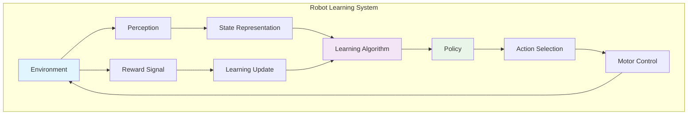

import Tabs from '@theme/Tabs';
import TabItem from '@theme/TabItem';

## Learning Outcomes

After completing this chapter, you will be able to:
1. Implement basic supervised learning algorithms for robotic perception tasks
2. Design and train reinforcement learning agents for robotic control
3. Apply imitation learning techniques using expert demonstrations
4. Evaluate and validate learned behaviors in robots
5. Implement transfer learning techniques for domain adaptation
6. Design appropriate reward functions for robotic tasks
7. Apply deep learning methods to robotic manipulation and navigation
8. Analyze and mitigate safety concerns in robot learning systems

## Gherkin Specifications

### Scenario 1: RL Agent Training
- **Given** a robotic environment with defined states, actions, and rewards
- **When** reinforcement learning algorithm is applied
- **Then** agent learns policy that achieves task objectives

### Scenario 2: Imitation Learning
- **Given** expert demonstrations of a robotic task
- **When** behavioral cloning or inverse RL algorithm is applied
- **Then** robot learns to perform the task similar to the expert

### Scenario 3: Policy Transfer
- **Given** a policy trained in simulation
- **When** applied to real robot with domain adaptation
- **Then** policy performs successfully on real robot

### Scenario 4: Safety Validation
- **Given** learned robotic behavior
- **When** safety validation protocols are executed
- **Then** potential safety violations are identified and mitigated

### Scenario 5: Online Learning
- **Given** robot operating in changing environment
- **When** online learning algorithms adapt the policy
- **Then** robot continues to perform well in modified conditions

## Theory & Intuition

Think of robot learning like teaching a child to ride a bike. Initially, the child doesn't know how to balance and might fall many times. Through trial and error, with occasional guidance from parents, the child gradually develops an intuitive understanding of how to balance, pedal, and steer. The child learns a policy - a strategy for responding to different situations ("when starting to tip left, turn left to recover").

In robotics, supervised learning is like showing the robot thousands of labeled examples of "correct" behavior until it recognizes patterns. Reinforcement learning is like giving the robot a scoring system and letting it figure out for itself what behaviors lead to high scores. Imitation learning is like having an expert robot demonstrate the correct behavior, and the learner robot tries to copy it.

The "reward function" in RL is like the scoring system in a video game - it tells the robot what is good (high reward) and what is bad (low reward). Just as a game designer must carefully craft the scoring system to encourage desirable gameplay, an RL engineer must design rewards that lead to the intended behavior without unintended side effects.

Robot learning systems are also like hiring a skilled craftsman to teach an apprentice. The expert shows the apprentice how to perform tasks, explains the reasoning behind certain techniques, and provides feedback as the apprentice practices. Over time, the apprentice (robot) develops expertise to handle new situations that weren't demonstrated.

## Core Concepts

<Tabs
  defaultValue="diagram"
  values={[
    {label: 'Learning Framework', value: 'diagram'},
    {label: 'Algorithm Categories', value: 'table'},
  ]}>
  <TabItem value="diagram">



  </TabItem>
  <TabItem value="table">

| Learning Method | Approach | Common Algorithms | Application |
|-----------------|----------|-------------------|-------------|
| Supervised Learning | Learn from labeled examples | CNNs, SVMs, Regression | Perception, Classification |
| Reinforcement Learning | Learn through interaction and rewards | Q-Learning, DQN, PPO, SAC | Control, Decision Making |
| Imitation Learning | Learn from expert demonstrations | Behavioral Cloning, GAIL | Complex Skills |
| Unsupervised Learning | Discover patterns in data | Clustering, Autoencoders | Feature Discovery |

  </TabItem>
</Tabs>

## Hands-On Labs

<Tabs
  defaultValue="lab1"
  values={[
    {label: 'Lab 1: Reinforcement Learning in Gazebo', value: 'lab1'},
    {label: 'Lab 2: Imitation Learning Implementation', value: 'lab2'},
    {label: 'Lab 3: Supervised Learning for Perception', value: 'lab3'},
  ]}>
  <TabItem value="lab1">

### Lab 1: Reinforcement Learning in Gazebo

#### Objective
Implement a reinforcement learning algorithm to train a robot to navigate to a goal while avoiding obstacles.

#### Required Components
- Gazebo simulation environment
- TurtleBot3 or similar differential drive robot
- OpenAI Gym-compatible wrapper
- Python with TensorFlow/PyTorch

#### Steps
1. **Create an RL environment package**:
   ```bash
   cd ~/robot_ws/src
   ros2 pkg create --build-type ament_python rl_environment --dependencies rclpy geometry_msgs nav_msgs sensor_msgs std_msgs
   ```

2. **Create the RL training environment**:
   ```bash
   nano ~/robot_ws/src/rl_environment/rl_environment/gym_env.py
   ```

3. **Add the Gym environment implementation**:
   ```python
   #!/usr/bin/env python3
   import gym
   from gym import spaces
   import numpy as np
   import rclpy
   from rclpy.node import Node
   from geometry_msgs.msg import Twist, Point
   from sensor_msgs.msg import LaserScan
   from nav_msgs.msg import Odometry
   from std_msgs.msg import Header
   import math
   import time

   # Initialize ROS context for Gym environment
   if not rclpy.ok():
       rclpy.init()

   class TurtleBot3GymEnv(gym.Env, Node):
       def __init__(self):
           # Initialize ROS Node
           Node.__init__(self, 'turtlebot3_gym_env')
           
           # Define action and observation space
           # Actions: linear velocity (-0.5 to 0.5), angular velocity (-1.0 to 1.0)
           self.action_space = spaces.Box(
               low=np.array([-0.5, -1.0], dtype=np.float32),
               high=np.array([0.5, 1.0], dtype=np.float32),
               dtype=np.float32
           )
           
           # Observation space: 24 laser readings (from front 120-degree area) + 4 extra observations
           # Extra observations: [relative_x, relative_y, heading_angle, distance_to_goal]
           self.observation_space = spaces.Box(
               low=np.array([-100] * 28, dtype=np.float32),  # Assuming max distance of 100 units
               high=np.array([100] * 28, dtype=np.float32),
               dtype=np.float32
           )
           
           # Publishers and subscribers
           self.cmd_vel_pub = self.create_publisher(Twist, '/cmd_vel', 10)
           self.laser_sub = self.create_subscription(LaserScan, '/scan', self.laser_callback, 10)
           self.odom_sub = self.create_subscription(Odometry, '/odom', self.odom_callback, 10)
           
           # Environment variables
           self.laser_data = None
           self.odom_data = None
           self.robot_position = Point(x=0.0, y=0.0, z=0.0)
           self.robot_heading = 0.0
           self.goal_position = Point(x=5.0, y=5.0, z=0.0)
           self.start_position = Point(x=0.0, y=0.0, z=0.0)
           self.max_steps = 500
           self.step_count = 0
           self.collision_threshold = 0.25  # meters
           self.arrival_threshold = 0.5    # meters to goal
           
           # Reset the environment
           self.reset_env()

       def laser_callback(self, msg):
           """Process laser scanner data"""
           self.laser_data = msg

       def odom_callback(self, msg):
           """Process odometry data"""
           # Update robot position
           self.robot_position.x = msg.pose.pose.position.x
           self.robot_position.y = msg.pose.pose.position.y
           
           # Calculate robot heading from quaternion
           from tf_transformations import euler_from_quaternion
           orientation_q = msg.pose.pose.orientation
           orientation_list = [orientation_q.x, orientation_q.y, orientation_q.z, orientation_q.w]
           (_, _, self.robot_heading) = euler_from_quaternion(orientation_list)

       def get_observation(self):
           """Get current observation from the environment"""
           if self.laser_data is None or self.odom_data is None:
               # Return default observation if sensors aren't ready
               return np.zeros(28, dtype=np.float32)
           
           # Process laser scan: extract 24 points from front (120-degree) area
           laser_ranges = np.array(self.laser_data.ranges)
           laser_ranges = np.clip(laser_ranges, 0.0, 10.0)  # Clip to max range of 10m
           
           # Take 24 readings from front 120 degree area (indices approximate)
           front_indices = list(range(0, 12)) + list(range(-12, 0))
           if len(laser_ranges) > len(front_indices):
               # Center the front indices around the middle of the scan
               mid = len(laser_ranges) // 2
               start_idx = mid - len(front_indices) // 2
               front_indices = list(range(start_idx, start_idx + len(front_indices)))
           
           front_scan = []
           for idx in front_indices:
                 if 0 <= idx < len(laser_ranges):
                     front_scan.append(laser_ranges[idx])
                 else:
                     front_scan.append(10.0)  # Max range if out of bounds
           
           if len(front_scan) < 24:
               # Pad with max range if we have fewer than 24 readings
               front_scan.extend([10.0] * (24 - len(front_scan)))
           elif len(front_scan) > 24:
               # Trim if we have more than 24 readings
               front_scan = front_scan[:24]
           
           # Calculate relative position to goal
           rel_x = self.goal_position.x - self.robot_position.x
           rel_y = self.goal_position.y - self.robot_position.y
           distance_to_goal = math.sqrt(rel_x**2 + rel_y**2)
           heading_to_goal = math.atan2(rel_y, rel_x)
           relative_heading = heading_to_goal - self.robot_heading
           
           # Normalize angle to [-pi, pi]
           while relative_heading > math.pi:
               relative_heading -= 2 * math.pi
           while relative_heading < -math.pi:
               relative_heading += 2 * math.pi
           
           # Combine laser data and extra observations
           observation = np.concatenate([
               np.array(front_scan, dtype=np.float32),
               np.array([rel_x, rel_y, relative_heading, distance_to_goal], dtype=np.float32)
           ])
           
           return observation

       def calculate_reward(self, action):
           """Calculate reward based on current state and action"""
           reward = 0
           done = False
           info = {}
           
           # Calculate distance to goal
           dist_to_goal = math.sqrt(
               (self.robot_position.x - self.goal_position.x)**2 + 
               (self.robot_position.y - self.goal_position.y)**2
           )
           
           # Reward for getting closer to goal (negative if moving away)
           prev_dist = getattr(self, '_prev_dist_to_goal', dist_to_goal)
           reward += (prev_dist - dist_to_goal) * 10  # Positive reward for getting closer
           self._prev_dist_to_goal = dist_to_goal
           
           # High reward for reaching the goal
           if dist_to_goal < self.arrival_threshold:
               reward += 1000
               done = True
               info['episode_status'] = 'success'
               self.get_logger().info(f'Goal reached! Distance: {dist_to_goal:.2f}')
               
           # Penalty for collisions
           if self.is_collision():
               reward -= 100
               done = True
               info['episode_status'] = 'collision'
               self.get_logger().info('Collision detected!')
           
           # Small penalty for each step to encourage efficiency
           reward -= 0.1
           
           # Penalty for large actions (energy efficiency)
           lin_speed, ang_speed = action
           reward -= 0.01 * (abs(lin_speed) + abs(ang_speed))
           
           # Check for timeout
           self.step_count += 1
           if self.step_count >= self.max_steps:
               done = True
               info['episode_status'] = 'timeout'
           
           return reward, done, info

       def is_collision(self):
           """Check for collision based on laser scan data"""
           if self.laser_data is None:
               return False
           
           # Check for obstacles within collision threshold (0.25m)
           obstacles = [r for r in self.laser_data.ranges if 0.01 < r < self.collision_threshold]
           return len(obstacles) > 0

       def reset_env(self):
           """Reset environment to initial state"""
           # Stop the robot
           stop_cmd = Twist()
           self.cmd_vel_pub.publish(stop_cmd)
           
           # Reset step counter
           self.step_count = 0
           self._prev_dist_to_goal = None
           
           # Wait briefly for state to settle
           time.sleep(0.1)
           
           return self.get_observation()

       def step(self, action):
           """Execute one step in the environment"""
           # Publish action to robot
           cmd = Twist()
           cmd.linear.x = float(action[0])
           cmd.angular.z = float(action[1])
           self.cmd_vel_pub.publish(cmd)
           
           # Allow some time for the action to take effect
           time.sleep(0.1)
           
           # Get new observation
           obs = self.get_observation()
           
           # Calculate reward and check if episode is done
           reward, done, info = self.calculate_reward(action)
           
           return obs, reward, done, info

       def reset(self):
           """Reset the environment and return initial observation"""
           return self.reset_env()

   # For standalone usage
   def main(args=None):
       rclpy.init(args=args)
       env = TurtleBot3GymEnv()
       
       # Example usage
       obs = env.reset()
       for i in range(1000):
           action = env.action_space.sample()  # Random action for testing
           obs, reward, done, info = env.step(action)
           print(f"Step {i}: Reward = {reward}, Done = {done}")
           
           if done:
               print(f"Episode finished: {info}")
               obs = env.reset()
       
       env.destroy_node()
       rclpy.shutdown()

   if __name__ == '__main__':
       main()
   ```

4. **Create a reinforcement learning training script using stable baselines3**:
   ```bash
   nano ~/robot_ws/src/rl_environment/rl_environment/ppo_agent.py
   ```

5. **Add the PPO training implementation**:
   ```python
   #!/usr/bin/env python3
   import os
   import sys
   import numpy as np
   import torch
   import gym
   import rclpy
   from stable_baselines3 import PPO
   from stable_baselines3.common.env_util import make_vec_env
   from stable_baselines3.common.callbacks import EvalCallback, StopTrainingOnRewardThreshold
   from stable_baselines3.common.monitor import Monitor
   from gym_env import TurtleBot3GymEnv

   def train_ppo_agent():
       """Train a PPO agent for the TurtleBot3 navigation task"""
       
       # Initialize ROS context
       if not rclpy.ok():
           rclpy.init()
       
       # Create the environment
       env = TurtleBot3GymEnv()
       env = Monitor(env)  # Wrap with Monitor for evaluation tracking
       
       # Optional: Create vectorized environment for faster training
       # vec_env = make_vec_env(lambda: env, n_envs=1)  # Adjust n_envs as needed

       # Define the PPO model
       model = PPO(
           'MlpPolicy',  # Multi-layer perceptron policy
           env,
           verbose=1,
           tensorboard_log="./tb_logs/",
           learning_rate=3e-4,
           n_steps=2048,  # Number of steps to run for each environment per update
           batch_size=64,
           n_epochs=10,   # Number of epochs when optimizing the surrogate loss
           gamma=0.99,    # Discount factor
           gae_lambda=0.95,  # Factor for trade-off of bias vs variance for Generalized Advantage Estimator
           clip_range=0.2,   # Clipping parameter, it can be a function of  progress remaining
           ent_coef=0.01,    # Entropy coefficient for the loss calculation
           vf_coef=0.5,      # Value function coefficient for the loss calculation
           max_grad_norm=0.5 # Maximum norm for the gradient clipping
       )

       # Define callback for early stopping based on reward threshold
       callback_on_best = StopTrainingOnRewardThreshold(reward_threshold=900, verbose=1)
       eval_callback = EvalCallback(
           env,
           callback_on_new_best=callback_on_best,
           verbose=1,
           eval_freq=5000,  # Evaluate every 5000 steps
           log_path="./eval_logs/",
           best_model_save_path="./models/"
       )

       print("Starting training...")
       # Train the agent
       model.learn(
           total_timesteps=int(1e5),  # 100,000 timesteps
           callback=eval_callback,
           tb_log_name="ppo_turtlebot3_navigation"
       )

       # Save the trained model
       model.save("turtlebot3_navigation_ppo_model")
       print("Model saved as turtlebot3_navigation_ppo_model")

       # Evaluate the trained agent
       print("Evaluating trained agent...")
       obs = env.reset()
       for i in range(1000):
           action, _states = model.predict(obs, deterministic=True)
           obs, rewards, dones, info = env.step(action)
           
           if dones:
               print(f"Episode finished at step {i}, reward: {rewards}")
               obs = env.reset()

       # Clean up
       env.destroy_node()
       rclpy.shutdown()

   def load_and_run_agent(model_path="turtlebot3_navigation_ppo_model"):
       """Load a pre-trained agent and run it"""
       # Initialize ROS context
       if not rclpy.ok():
           rclpy.init()
       
       # Create the environment
       env = TurtleBot3GymEnv()
       
       # Load the trained model
       try:
           model = PPO.load(model_path)
           print(f"Model loaded from {model_path}")
       except FileNotFoundError:
           print(f"Model file not found: {model_path}")
           return
       
       # Run the agent
       obs = env.reset()
       total_reward = 0
       steps = 0
       
       print("Running trained agent...")
       for i in range(1000):  # Run for 1000 steps
           action, _states = model.predict(obs, deterministic=True)
           obs, reward, done, info = env.step(action)
           
           total_reward += reward
           steps += 1
           
           if done:
               print(f"Episode finished at step {steps}, total reward: {total_reward}")
               obs = env.reset()
               total_reward = 0
               steps = 0
               
               # For real testing, you might want to run multiple episodes
               # Here we just continue for 1000 steps total
               if i > 800:  # Stop after 200 more steps
                   break
       
       print(f"Completed running agent. Total steps: {steps}, Final reward: {total_reward}")
       
       # Clean up
       env.destroy_node()
       rclpy.shutdown()

   if __name__ == '__main__':
       # Check if user wants to train or run
       if len(sys.argv) > 1:
           if sys.argv[1] == 'train':
               train_ppo_agent()
           elif sys.argv[1] == 'run':
               if len(sys.argv) > 2:
                   load_and_run_agent(sys.argv[2])
               else:
                   load_and_run_agent()
           else:
               print("Usage: ppo_agent.py [train|run] [model_path]")
       else:
           print("Running default (training)...")
           train_ppo_agent()
   ```

6. **Create a launch file for the RL training**:
   ```bash
   mkdir -p ~/robot_ws/src/rl_environment/launch
   nano ~/robot_ws/src/rl_environment/launch/rl_training.launch.py
   ```

7. **Add the launch file content**:
   ```python
   import os
   from launch import LaunchDescription
   from launch.actions import DeclareLaunchArgument, ExecuteProcess
   from launch.substitutions import LaunchConfiguration
   from launch_ros.actions import Node

   def generate_launch_description():
       # Declare launch arguments
       mode_arg = DeclareLaunchArgument(
           'mode',
           default_value='train',
           description='Training mode: train or run'
       )
       
       model_path_arg = DeclareLaunchArgument(
           'model_path',
           default_value='turtlebot3_navigation_ppo_model',
           description='Path to saved model (for run mode)'
       )
       
       # Get launch configurations
       mode = LaunchConfiguration('mode')
       model_path = LaunchConfiguration('model_path')
       
       # Launch the Gazebo simulation (if needed)
       gazebo_cmd = ExecuteProcess(
           cmd=['gazebo', '--verbose', '-s', 'libgazebo_ros_factory.so'],
           output='screen'
       )
       
       # Launch the robot spawn (if using TurtleBot3)
       spawn_robot_cmd = ExecuteProcess(
           cmd=['ros2', 'run', 'gazebo_ros', 'spawn_entity.py',
                '-entity', 'turtlebot3', '-file', '',
                '-x', '0', '-y', '0', '-z', '0'],
           output='screen'
       )
       
       # Launch the PPO agent
       ppo_agent_node = Node(
           package='rl_environment',
           executable='ppo_agent.py',
           name='ppo_agent',
           arguments=[mode, model_path],
           output='screen'
       )
       
       return LaunchDescription([
           mode_arg,
           model_path_arg,
           #gazebo_cmd,  # Uncomment if Gazebo is needed
           #spawn_robot_cmd,  # Uncomment if robot spawn is needed
           ppo_agent_node
       ])
   ```

8. **Update setup.py**:
   ```bash
   nano ~/robot_ws/src/rl_environment/setup.py
   ```

9. **Add the entry points**:
   ```python
   entry_points={
       'console_scripts': [
           'gym_env = rl_environment.gym_env:main',
           'ppo_agent = rl_environment.ppo_agent:main',
       ],
   }
   ```

10. **Make the files executable and build**:
    ```bash
    chmod +x ~/robot_ws/src/rl_environment/rl_environment/gym_env.py
    chmod +x ~/robot_ws/src/rl_environment/rl_environment/ppo_agent.py
    cd ~/robot_ws
    colcon build --packages-select rl_environment
    source install/setup.bash
    ```

11. **Install required Python packages**:
    ```bash
    pip3 install stable-baselines3[extra] torch torchvision torchaudio --index-url https://download.pytorch.org/whl/cpu
    pip3 install gymnasium
    pip3 install tensorflow  # if using TensorFlow
    ```

12. **Run the training (in a separate terminal with the simulated robot running)**:
    ```bash
    ros2 run rl_environment ppo_agent.py train
    ```

#### Expected Outcome
A reinforcement learning agent trained to navigate to a goal while avoiding obstacles using the PPO algorithm.

  </TabItem>
  <TabItem value="lab2">

### Lab 2: Imitation Learning Implementation

#### Objective
Implement an imitation learning system using behavioral cloning to teach a robot to follow a trajectory.

#### Required Components
- Expert demonstrations of the task
- Neural network for behavior cloning
- Robot simulation environment

#### Steps
1. **Create an imitation learning package**:
   ```bash
   cd ~/robot_ws/src
   ros2 pkg create --build-type ament_python imitation_learning --dependencies rclpy geometry_msgs sensor_msgs std_msgs
   ```

2. **Create the data collection and imitation learning node**:
   ```bash
   nano ~/robot_ws/src/imitation_learning/imitation_learning/imitation_learning_node.py
   ```

3. **Add the imitation learning implementation**:
   ```python
   #!/usr/bin/env python3
   import rclpy
   from rclpy.node import Node
   from geometry_msgs.msg import Twist, PoseStamped
   from sensor_msgs.msg import LaserScan
   from nav_msgs.msg import Odometry
   from std_msgs.msg import Header
   import numpy as np
   import torch
   import torch.nn as nn
   import torch.optim as optim
   from torch.utils.data import DataLoader, TensorDataset
   import pickle
   import os

   class ExpertDemonstrationCollector(Node):
       """Collect expert demonstrations for imitation learning"""
       def __init__(self):
           super().__init__('expert_demonstration_collector')
           
           # Parameters
           self.declare_parameter('demo_file', '/tmp/expert_demos.pkl')
           self.demo_file = self.get_parameter('demo_file').value
           
           # Publishers and subscribers
           self.laser_sub = self.create_subscription(LaserScan, '/scan', self.laser_callback, 10)
           self.odom_sub = self.create_subscription(Odometry, '/odom', self.odom_callback, 10)
           self.cmd_sub = self.create_subscription(Twist, '/cmd_vel_expert', self.expert_cmd_callback, 10)
           
           # Storage for demonstrations
           self.demonstrations = {  # Dictionary to store (state, action) pairs
               'states': [],
               'actions': [],
               'timestamps': []
           }
           
           # Current state buffers
           self.current_laser = None
           self.current_odom = None
           self.current_cmd = None
           
           # Timer to collect synchronized demonstrations
           self.collection_timer = self.create_timer(0.1, self.collect_demonstration)
           
           self.get_logger().info(f'Expert demonstration collector initialized, saving to {self.demo_file}')

       def laser_callback(self, msg):
           """Store laser scan data"""
           self.current_laser = msg

       def odom_callback(self, msg):
           """Store odometry data"""
           self.current_odom = msg

       def expert_cmd_callback(self, msg):
           """Store expert's commanded actions"""
           self.current_cmd = msg

       def collect_demonstration(self):
           """Collect synchronized state-action pairs"""
           if self.current_laser and self.current_odom and self.current_cmd:
               # Process state (combine laser and pose information)
               state = self.extract_state()
               
               # Process action (expert's velocity commands)
               action = np.array([self.current_cmd.linear.x, self.current_cmd.angular.z], dtype=np.float32)
               
               # Store the state-action pair
               self.demonstrations['states'].append(state)
               self.demonstrations['actions'].append(action)
               self.demonstrations['timestamps'].append(self.get_clock().now().nanoseconds)
               
               self.get_logger().debug(f'Collected demonstration #{len(self.demonstrations["states"])}')
               
               # Periodically save demonstrations
               if len(self.demonstrations['states']) % 100 == 0:
                   self.save_demonstrations()
           else:
               self.get_logger().debug('Waiting for synchronized sensor data and expert commands...')

       def extract_state(self):
           """Extract state vector from sensor and pose data"""
           # Process laser scan: take central 30 readings for obstacle detection
           laser_data = np.array(self.current_laser.ranges)
           laser_data = np.clip(laser_data, 0.1, 10.0)  # Clip to useful range
           
           # Take central 30 readings (for typical 360-degree scan)
           center_idx = len(laser_data) // 2
           start_idx = max(0, center_idx - 15)
           end_idx = min(len(laser_data), center_idx + 15)
           laser_features = laser_data[start_idx:end_idx]
           
           # Normalize laser data
           laser_features = laser_features / 10.0  # Normalize to [0, 1]
           
           # Extract pose information
           pos = self.current_odom.pose.pose.position
           orient = self.current_odom.pose.pose.orientation
           
           # Convert quaternion to heading
           from tf_transformations import euler_from_quaternion
           _, _, yaw = euler_from_quaternion([orient.x, orient.y, orient.z, orient.w])
           
           # Get twist (velocity) information
           lin_vel = self.current_odom.twist.twist.linear
           ang_vel = self.current_odom.twist.twist.angular
           
           # Combine all features into state vector
           state = np.concatenate([
               laser_features,                    # 30 laser readings
               [pos.x, pos.y, yaw],              # Position and orientation
               [lin_vel.x, ang_vel.z]            # Current velocities
           ]).astype(np.float32)
           
           return state

       def save_demonstrations(self):
           """Save collected demonstrations to file"""
           # Convert to numpy arrays
           states = np.array(self.demonstrations['states'], dtype=np.float32)
           actions = np.array(self.demonstrations['actions'], dtype=np.float32)
           timestamps = np.array(self.demonstrations['timestamps'], dtype=np.int64)
           
           demo_data = {
               'states': states,
               'actions': actions,
               'timestamps': timestamps,
               'num_episodes': len(self.demonstrations['states'])
           }
           
           # Save to file
           with open(self.demo_file, 'wb') as f:
               pickle.dump(demo_data, f)
           
           self.get_logger().info(f'Saved {len(states)} demonstrations to {self.demo_file}')

       def finalize_collection(self):
           """Finalize data collection and save all data"""
           self.save_demonstrations()
           self.get_logger().info(f'Demonstration collection completed with {len(self.demonstrations["states"])} samples')


   class BehavioralCloningNetwork(nn.Module):
       """Neural network for behavioral cloning"""
       def __init__(self, state_dim, action_dim, hidden_dim=128):
           super(BehavioralCloningNetwork, self).__init__()
           
           self.fc1 = nn.Linear(state_dim, hidden_dim)
           self.fc2 = nn.Linear(hidden_dim, hidden_dim)
           self.fc3 = nn.Linear(hidden_dim, hidden_dim)
           self.fc4 = nn.Linear(hidden_dim, action_dim)
           
           self.relu = nn.ReLU()
           self.dropout = nn.Dropout(0.2)
           
           # Initialize weights
           self._init_weights()
       
       def _init_weights(self):
           """Initialize network weights"""
           for m in self.modules():
               if isinstance(m, nn.Linear):
                   nn.init.xavier_uniform_(m.weight)
                   nn.init.constant_(m.bias, 0)
       
       def forward(self, x):
           """Forward pass"""
           x = self.relu(self.fc1(x))
           x = self.dropout(x)
           x = self.relu(self.fc2(x))
           x = self.dropout(x)
           x = self.relu(self.fc3(x))
           x = self.dropout(x)
           x = self.fc4(x)
           return x


   class ImitationLearningNode(Node):
       """Node to train and execute imitation learning policy"""
       def __init__(self):
           super().__init__('imitation_learning_node')
           
           # Parameters
           self.declare_parameter('demo_file', '/tmp/expert_demos.pkl')
           self.declare_parameter('model_save_path', '/tmp/bc_model.pth')
           self.declare_parameter('learning_rate', 0.001)
           self.declare_parameter('batch_size', 32)
           self.declare_parameter('epochs', 100)
           
           self.demo_file = self.get_parameter('demo_file').value
           self.model_save_path = self.get_parameter('model_save_path').value
           self.learning_rate = self.get_parameter('learning_rate').value
           self.batch_size = self.get_parameter('batch_size').value
           self.epochs = self.get_parameter('epochs').value
           
           # Publishers and subscribers
           self.laser_sub = self.create_subscription(LaserScan, '/scan', self.laser_callback, 10)
           self.odom_sub = self.create_subscription(Odometry, '/odom', self.odom_callback, 10)
           self.cmd_pub = self.create_publisher(Twist, '/cmd_vel', 10)
           
           # State buffers
           self.current_laser = None
           self.current_odom = None
           
           # Model components
           self.policy_net = None
           self.optimizer = None
           self.is_trained = False
           
           self.get_logger().info('Imitation learning node initialized')

       def laser_callback(self, msg):
           """Store laser data for policy execution"""
           self.current_laser = msg

       def odom_callback(self, msg):
           """Store odometry data for policy execution"""
           self.current_odom = msg

       def load_demonstrations(self):
           """Load expert demonstrations from file"""
           try:
               with open(self.demo_file, 'rb') as f:
                   demo_data = pickle.load(f)
               
               self.get_logger().info(f'Loaded {len(demo_data["states"])} demonstrations')
               return demo_data
           except FileNotFoundError:
               self.get_logger().error(f'Demonstration file not found: {self.demo_file}')
               return None

       def train_behavioral_cloning(self):
           """Train behavioral cloning policy using expert demonstrations"""
           demo_data = self.load_demonstrations()
           if demo_data is None:
               return False
           
           # Extract states and actions
           states = torch.FloatTensor(demo_data['states'])
           actions = torch.FloatTensor(demo_data['actions'])
           
           # Get dimensions
           state_dim = states.shape[1]  # Number of features in state
           action_dim = actions.shape[1]  # Number of actions
           
           self.get_logger().info(f'State dim: {state_dim}, Action dim: {action_dim}')
           
           # Create neural network
           self.policy_net = BehavioralCloningNetwork(state_dim, action_dim)
           self.optimizer = optim.Adam(self.policy_net.parameters(), lr=self.learning_rate)
           criterion = nn.MSELoss()
           
           # Create dataset and dataloader
           dataset = TensorDataset(states, actions)
           dataloader = DataLoader(dataset, batch_size=self.batch_size, shuffle=True)
           
           self.get_logger().info('Starting behavioral cloning training...')
           
           # Training loop
           for epoch in range(self.epochs):
               epoch_loss = 0.0
               for batch_states, batch_actions in dataloader:
                   # Forward pass
                   predicted_actions = self.policy_net(batch_states)
                   loss = criterion(predicted_actions, batch_actions)
                   
                   # Backward pass and optimization
                   self.optimizer.zero_grad()
                   loss.backward()
                   self.optimizer.step()
                   
                   epoch_loss += loss.item()
               
               avg_loss = epoch_loss / len(dataloader)
               if epoch % 10 == 0:
                   self.get_logger().info(f'Epoch {epoch}, Loss: {avg_loss:.6f}')
           
           # Save trained model
           torch.save(self.policy_net.state_dict(), self.model_save_path)
           self.get_logger().info(f'Training completed. Model saved to {self.model_save_path}')
           self.is_trained = True
           
           return True

       def load_policy(self, model_path=None):
           """Load pre-trained policy"""
           if model_path is None:
               model_path = self.model_save_path
           
           try:
               # We need to know the dimensions to reconstruct the network
               # For this example, we'll assume we know the dimensions
               # In practice, you'd save the architecture info with the model
               demo_data = self.load_demonstrations()
               if demo_data is None:
                   return False
               
               state_dim = len(demo_data['states'][0])  # Number of features in state
               action_dim = len(demo_data['actions'][0])  # Number of actions
               
               # Create network with correct dimensions
               self.policy_net = BehavioralCloningNetwork(state_dim, action_dim)
               
               # Load the saved weights
               self.policy_net.load_state_dict(torch.load(model_path))
               self.policy_net.eval()  # Set to evaluation mode
               
               self.get_logger().info(f'Policy loaded from {model_path}')
               self.is_trained = True
               return True
           except Exception as e:
               self.get_logger().error(f'Error loading policy: {e}')
               return False

       def execute_policy(self):
           """Execute the trained policy"""
           if not self.is_trained or self.policy_net is None:
               self.get_logger().warn('Policy not trained or loaded, cannot execute')
               return
           
           if self.current_laser is None or self.current_odom is None:
               return
           
           try:
               # Extract current state
               state = self.extract_current_state()
               state_tensor = torch.FloatTensor(state).unsqueeze(0)  # Add batch dimension
               
               # Get action from policy
               with torch.no_grad():  # Disable gradients for inference
                   action_tensor = self.policy_net(state_tensor)
                   action = action_tensor.squeeze(0).numpy()  # Remove batch dimension
               
               # Publish action
               cmd = Twist()
               cmd.linear.x = float(action[0])
               cmd.angular.z = float(action[1])
               
               self.cmd_pub.publish(cmd)
               
               self.get_logger().debug(f'Policy output: linear.x={cmd.linear.x:.3f}, angular.z={cmd.angular.z:.3f}')
               
           except Exception as e:
               self.get_logger().error(f'Error executing policy: {e}')

       def extract_current_state(self):
           """Extract current state vector from sensor and pose data"""
           # Process laser scan: take central 30 readings for obstacle detection
           laser_data = np.array(self.current_laser.ranges)
           laser_data = np.clip(laser_data, 0.1, 10.0)  # Clip to useful range
           
           # Take central 30 readings (for typical 360-degree scan)
           center_idx = len(laser_data) // 2
           start_idx = max(0, center_idx - 15)
           end_idx = min(len(laser_data), center_idx + 15)
           laser_features = laser_data[start_idx:end_idx]
           
           # Normalize laser data
           laser_features = laser_features / 10.0  # Normalize to [0, 1]
           
           # Extract pose information
           pos = self.current_odom.pose.pose.position
           orient = self.current_odom.pose.pose.orientation
           
           # Convert quaternion to heading
           from tf_transformations import euler_from_quaternion
           _, _, yaw = euler_from_quaternion([orient.x, orient.y, orient.z, orient.w])
           
           # Get twist (velocity) information
           lin_vel = self.current_odom.twist.twist.linear
           ang_vel = self.current_odom.twist.twist.angular
           
           # Combine all features into state vector
           state = np.concatenate([
               laser_features,                    # 30 laser readings
               [pos.x, pos.y, yaw],              # Position and orientation
               [lin_vel.x, ang_vel.z]            # Current velocities
           ]).astype(np.float32)
           
           return state

       def control_loop(self):
           """Main control loop to execute policy"""
           if self.is_trained:
               self.execute_policy()


   def main(args=None):
       rclpy.init(args=args)
       
       # For this example, we'll use the ImitationLearningNode
       node = ImitationLearningNode()
       
       # You might want to call the trainer first
       if rclpy.ok():
           # Load or train the model
           if os.path.exists(node.model_save_path):
               node.get_logger().info('Loading existing model...')
               node.load_policy()
           else:
               node.get_logger().info('Training new model...')
               node.train_behavioral_cloning()
           
           # Create a timer to execute the policy at regular intervals
           node.timer = node.create_timer(0.1, node.control_loop)
           
           try:
               rclpy.spin(node)
           except KeyboardInterrupt:
               node.get_logger().info('Imitation learning node stopped by user')
           finally:
               node.destroy_node()
       
       rclpy.shutdown()

   if __name__ == '__main__':
       main()
   ```

4. **Update setup.py**:
   ```bash
   nano ~/robot_ws/src/imitation_learning/setup.py
   ```

5. **Add the entry point**:
   ```python
   entry_points={
       'console_scripts': [
           'imitation_learning_node = imitation_learning.imitation_learning_node:main',
       ],
   }
   ```

6. **Make the file executable and build**:
   ```bash
   chmod +x ~/robot_ws/src/imitation_learning/imitation_learning/imitation_learning_node.py
   cd ~/robot_ws
   colcon build --packages-select imitation_learning
   source install/setup.bash
   ```

7. **Run the imitation learning node**:
   ```bash
   ros2 run imitation_learning imitation_learning_node
   ```

#### Expected Outcome
A behavioral cloning model trained to imitate expert demonstrations for robot navigation.

  </TabItem>
  <TabItem value="lab3">

### Lab 3: Supervised Learning for Perception

#### Objective
Implement a supervised learning model for object detection in robot perception.

#### Required Components
- Image dataset with annotations
- Convolutional Neural Network (CNN)
- ROS 2 image interface

#### Steps
1. **Create a perception learning package**:
   ```bash
   cd ~/robot_ws/src
   ros2 pkg create --build-type ament_python perception_learning --dependencies rclpy sensor_msgs cv_bridge std_msgs geometry_msgs
   ```

2. **Create the supervised learning perception node**:
   ```bash
   nano ~/robot_ws/src/perception_learning/perception_learning/supervised_perception.py
   ```

3. **Add the implementation**:
   ```python
   #!/usr/bin/env python3
   import rclpy
   from rclpy.node import Node
   from sensor_msgs.msg import Image, CameraInfo
   from std_msgs.msg import Header
   from geometry_msgs.msg import Point
   from cv_bridge import CvBridge
   from std_msgs.msg import String
   import numpy as np
   import torch
   import torch.nn as nn
   import torch.optim as optim
   from torch.utils.data import DataLoader, Dataset
   import torchvision.transforms as transforms
   import cv2
   import json
   import os

   class ObjectDetectionCNN(nn.Module):
       """Simple CNN for object detection"""
       def __init__(self, num_classes=5, input_channels=3):
           super(ObjectDetectionCNN, self).__init__()
           
           # Convolutional layers
           self.conv1 = nn.Conv2d(input_channels, 32, kernel_size=3, padding=1)
           self.conv2 = nn.Conv2d(32, 64, kernel_size=3, padding=1)
           self.conv3 = nn.Conv2d(64, 128, kernel_size=3, padding=1)
           self.pool = nn.MaxPool2d(2, 2)
           
           # Classification head
           self.classifier = nn.Sequential(
               nn.Linear(128 * 8 * 8, 512),  # Adjust based on your input size
               nn.ReLU(),
               nn.Dropout(0.5),
               nn.Linear(512, num_classes)
           )
           
           # Bounding box regression head
           self.bbox_regressor = nn.Sequential(
               nn.Linear(128 * 8 * 8, 512),
               nn.ReLU(),
               nn.Dropout(0.5),
               nn.Linear(512, 4)  # 4 values: x, y, width, height
           )
           
           self._init_weights()
       
       def _init_weights(self):
           """Initialize network weights"""
           for m in self.modules():
               if isinstance(m, nn.Conv2d):
                   nn.init.kaiming_normal_(m.weight, mode='fan_out', nonlinearity='relu')
                   if m.bias is not None:
                       nn.init.constant_(m.bias, 0)
               elif isinstance(m, nn.Linear):
                   nn.init.normal_(m.weight, 0, 0.01)
                   nn.init.constant_(m.bias, 0)
       
       def forward(self, x):
           """Forward pass"""
           # Resize input to a fixed size for consistent processing
           x = nn.functional.interpolate(x, size=(64, 64), mode='bilinear', align_corners=False)
           
           x = self.pool(torch.relu(self.conv1(x)))
           x = self.pool(torch.relu(self.conv2(x)))
           x = self.pool(torch.relu(self.conv3(x)))
           
           # Flatten for fully connected layers
           x = x.view(x.size(0), -1)
           
           # Get classification and bounding box predictions
           class_pred = self.classifier(x)
           bbox_pred = torch.sigmoid(self.bbox_regressor(x))  # Sigmoid to keep in [0, 1]
           
           return class_pred, bbox_pred


   class ImageDataset(Dataset):
       """Dataset class for loading images and annotations"""
       def __init__(self, images_dir, annotations_file, transform=None):
           self.images_dir = images_dir
           self.transform = transform
           
           # Load annotations
           with open(annotations_file, 'r') as f:
               self.annotations = json.load(f)
           
           # Map class names to indices
           self.class_to_idx = {}
           idx = 0
           for ann in self.annotations:
               class_name = ann['class']
               if class_name not in self.class_to_idx:
                   self.class_to_idx[class_name] = idx
                   idx += 1
           
           self.idx_to_class = {v: k for k, v in self.class_to_idx.items()}
           self.num_classes = len(self.class_to_idx)
           
       def __len__(self):
           return len(self.annotations)
       
       def __getitem__(self, idx):
           annotation = self.annotations[idx]
           img_path = os.path.join(self.images_dir, annotation['filename'])
           
           # Load image
           image = cv2.imread(img_path)
           image = cv2.cvtColor(image, cv2.COLOR_BGR2RGB)
           
           # Get bounding box (normalize to [0, 1])
           bbox = annotation['bbox']  # [x, y, width, height]
           h, w, _ = image.shape
           bbox_norm = [
               bbox[0] / w,   # x
               bbox[1] / h,   # y
               bbox[2] / w,   # width
               bbox[3] / h    # height
           ]
           
           # Get class
           class_idx = self.class_to_idx[annotation['class']]
           
           if self.transform:
               image = self.transform(image)
           else:
               # Default transforms
               image = torch.FloatTensor(image).permute(2, 0, 1) / 255.0
           
           return image, torch.tensor(class_idx), torch.tensor(bbox_norm, dtype=torch.float)


   class SupervisedPerceptionNode(Node):
       """Node for supervised learning-based perception"""
       def __init__(self):
           super().__init__('supervised_perception')
           
           # Parameters
           self.declare_parameter('model_save_path', '/tmp/detection_model.pth')
           self.declare_parameter('class_labels', ['robot', 'obstacle', 'goal', 'charger', 'person'])
           self.declare_parameter('confidence_threshold', 0.7)
           self.declare_parameter('learning_rate', 0.001)
           self.declare_parameter('batch_size', 16)
           self.declare_parameter('epochs', 50)
           
           self.model_save_path = self.get_parameter('model_save_path').value
           self.class_labels = self.get_parameter('class_labels').value
           self.confidence_threshold = self.get_parameter('confidence_threshold').value
           self.learning_rate = self.get_parameter('learning_rate').value
           self.batch_size = self.get_parameter('batch_size').value
           self.epochs = self.get_parameter('epochs').value
           
           # Initialize class mappings
           self.class_to_idx = {label: idx for idx, label in enumerate(self.class_labels)}
           self.idx_to_class = {idx: label for label, idx in self.class_to_idx.items()}
           self.num_classes = len(self.class_labels)
           
           # CV Bridge for image conversion
           self.bridge = CvBridge()
           
           # Publishers and subscribers
           self.image_sub = self.create_subscription(
               Image,
               '/camera/image_raw',
               self.image_callback,
               10
           )
           
           self.detection_pub = self.create_publisher(
               String,  # Using String for simplicity; in practice, you'd use a custom message
               '/detected_objects',
               10
           )
           
           # Model components
           self.model = ObjectDetectionCNN(num_classes=self.num_classes)
           self.optimizer = optim.Adam(self.model.parameters(), lr=self.learning_rate)
           self.is_trained = False
           
           # For training mode
           self.training_mode = False
           self.dataset_path = None
           
           self.get_logger().info(f'Perception node initialized with classes: {self.class_labels}')

       def image_callback(self, msg):
           """Process incoming camera images for object detection"""
           try:
               # Convert ROS Image message to OpenCV image
               cv_image = self.bridge.imgmsg_to_cv2(msg, desired_encoding='bgr8')
               
               if self.is_trained:
                   # Perform detection
                   detections = self.detect_objects(cv_image)
                   
                   # Publish detections
                   self.publish_detections(detections)
                   
                   # Visualize detections
                   vis_image = self.visualize_detections(cv_image, detections)
                   cv2.imshow('Supervised Perception', vis_image)
                   cv2.waitKey(1)
               else:
                   # If not trained, just show the raw image
                   cv2.imshow('Supervised Perception', cv_image)
                   cv2.waitKey(1)
                   
           except Exception as e:
               self.get_logger().error(f'Error processing image: {e}')

       def detect_objects(self, image):
           """Detect objects using the trained model"""
           # Preprocess image
           input_tensor = self.preprocess_image(image)
           input_batch = input_tensor.unsqueeze(0)  # Add batch dimension
           
           # Set model to evaluation mode
           self.model.eval()
           
           with torch.no_grad():
               class_logits, bbox_outputs = self.model(input_batch)
               
               # Apply softmax to get probabilities
               class_probs = torch.softmax(class_logits, dim=1)
               confidence, pred_class = torch.max(class_probs, 1)
               
               # Only return detections above confidence threshold
               if confidence.item() > self.confidence_threshold:
                   # Convert normalized bbox coordinates back to absolute coordinates
                   h, w, _ = image.shape
                   bbox_abs = bbox_outputs[0].cpu().numpy()
                   bbox_abs[0] *= w  # x
                   bbox_abs[1] *= h  # y
                   bbox_abs[2] *= w  # width
                   bbox_abs[3] *= h  # height
                   
                   detection = {
                       'class': self.idx_to_class[pred_class.item()],
                       'confidence': confidence.item(),
                       'bbox': [float(bbox_abs[0]), float(bbox_abs[1]), 
                               float(bbox_abs[2]), float(bbox_abs[3])]
                   }
                   return [detection]
           
           return []  # No detections above threshold

       def preprocess_image(self, image):
           """Preprocess image for the model"""
           # Resize image to the expected input size
           resized = cv2.resize(image, (64, 64))
           
           # Convert BGR to RGB and normalize
           rgb = cv2.cvtColor(resized, cv2.COLOR_BGR2RGB)
           tensor = torch.FloatTensor(rgb).permute(2, 0, 1) / 255.0
           
           return tensor

       def visualize_detections(self, image, detections):
           """Draw bounding boxes on the image"""
           vis_image = image.copy()
           
           for det in detections:
               x, y, w, h = det['bbox']
               x, y, w, h = int(x), int(y), int(w), int(h)
               
               # Draw bounding box
               cv2.rectangle(vis_image, (x, y), (x+w, y+h), (0, 255, 0), 2)
               
               # Draw label
               label = f"{det['class']}: {det['confidence']:.2f}"
               cv2.putText(vis_image, label, (x, y-10), 
                          cv2.FONT_HERSHEY_SIMPLEX, 0.5, (0, 255, 0), 2)
           
           return vis_image

       def publish_detections(self, detections):
           """Publish detection results"""
           if len(detections) > 0:
               # In practice, you'd use a custom message type for detections
               # For now, we'll use a simple string
               detection_str = json.dumps(detections)
               msg = String()
               msg.data = detection_str
               self.detection_pub.publish(msg)
               
               for det in detections:
                   self.get_logger().info(f'Detected {det["class"]} with confidence {det["confidence"]:.2f}')

       def train_model(self, images_dir, annotations_file):
           """Train the supervised model"""
           self.get_logger().info(f'Starting training with data from {images_dir}')
           
           # Define transformations for training
           train_transform = transforms.Compose([
               transforms.ToPILImage(),
               transforms.ColorJitter(brightness=0.2, contrast=0.2, saturation=0.2, hue=0.1),
               transforms.RandomHorizontalFlip(p=0.3),
               transforms.ToTensor(),
               transforms.Normalize(mean=[0.485, 0.456, 0.406], std=[0.229, 0.224, 0.225])
           ])
           
           # Create dataset
           dataset = ImageDataset(images_dir, annotations_file, transform=train_transform)
           dataloader = DataLoader(dataset, batch_size=self.batch_size, shuffle=True)
           
           # Define loss functions
           cls_criterion = nn.CrossEntropyLoss()
           bbox_criterion = nn.MSELoss()
           
           # Training loop
           self.model.train()
           for epoch in range(self.epochs):
               total_loss = 0.0
               for batch_idx, (images, class_targets, bbox_targets) in enumerate(dataloader):
                   # Forward pass
                   class_logits, bbox_outputs = self.model(images)
                   
                   # Calculate losses
                   cls_loss = cls_criterion(class_logits, class_targets)
                   bbox_loss = bbox_criterion(bbox_outputs, bbox_targets.float())
                   total_batch_loss = cls_loss + bbox_loss
                   
                   # Backward pass
                   self.optimizer.zero_grad()
                   total_batch_loss.backward()
                   self.optimizer.step()
                   
                   total_loss += total_batch_loss.item()
                   
                   if batch_idx % 10 == 0:
                       self.get_logger().info(
                           f'Epoch {epoch} Batch {batch_idx}, '
                           f'Classification Loss: {cls_loss.item():.4f}, '
                           f'BBox Loss: {bbox_loss.item():.4f}'
                       )
               
               avg_loss = total_loss / len(dataloader)
               self.get_logger().info(f'Epoch {epoch} completed, Average Loss: {avg_loss:.4f}')
           
           # Save the trained model
           torch.save({
               'model_state_dict': self.model.state_dict(),
               'optimizer_state_dict': self.optimizer.state_dict(),
               'class_to_idx': self.class_to_idx,
               'idx_to_class': self.idx_to_class,
               'num_classes': self.num_classes
           }, self.model_save_path)
           
           self.get_logger().info(f'Model trained and saved to {self.model_save_path}')
           self.is_trained = True

       def load_model(self, model_path=None):
           """Load a pre-trained model"""
           if model_path is None:
               model_path = self.model_save_path
           
           try:
               checkpoint = torch.load(model_path, map_location=torch.device('cpu'))
               
               # Load state dicts
               self.model.load_state_dict(checkpoint['model_state_dict'])
               self.optimizer.load_state_dict(checkpoint['optimizer_state_dict'])
               
               # Restore class mappings
               self.class_to_idx = checkpoint['class_to_idx']
               self.idx_to_class = checkpoint['idx_to_class']
               self.num_classes = checkpoint['num_classes']
               
               self.is_trained = True
               self.get_logger().info(f'Model loaded from {model_path}')
               return True
               
           except Exception as e:
               self.get_logger().error(f'Error loading model: {e}')
               return False


   def main(args=None):
       rclpy.init(args=args)
       node = SupervisedPerceptionNode()
       
       # Check if model exists and load it, otherwise train a new one
       if os.path.exists(node.model_save_path):
           node.get_logger().info('Loading existing model...')
           node.load_model()
       else:
           node.get_logger().info('No pre-trained model found. In a real scenario, you would train a model with a dataset.')
           # For this example, we'll just continue without training
           # In a real application, you would call node.train_model(images_dir, annotations_file)
       
       try:
           rclpy.spin(node)
       except KeyboardInterrupt:
           node.get_logger().info('Perception node stopped by user')
       finally:
           cv2.destroyAllWindows()
           node.destroy_node()
           rclpy.shutdown()

   if __name__ == '__main__':
       main()
   ```

4. **Update setup.py**:
   ```bash
   nano ~/robot_ws/src/perception_learning/setup.py
   ```

5. **Add the entry point**:
   ```python
   entry_points={
       'console_scripts': [
           'supervised_perception = perception_learning.supervised_perception:main',
       ],
   }
   ```

6. **Make the file executable and build**:
   ```bash
   chmod +x ~/robot_ws/src/perception_learning/perception_learning/supervised_perception.py
   cd ~/robot_ws
   colcon build --packages-select perception_learning
   source install/setup.bash
   ```

7. **Run the supervised perception node**:
   ```bash
   ros2 run perception_learning supervised_perception
   ```

#### Expected Outcome
A supervised learning model trained for object detection and integrated into the robot's perception system.

  </TabItem>
</Tabs>

## Sim-to-Real Notes

- **Hardware considerations**: Learning algorithms can be computationally intensive; ensure sufficient processing power for real-time inference
- **Differences from simulation**: Real environments have more diverse and unpredictable conditions than simulations
- **Practical tips**: Use domain randomization or adversarial training techniques to improve sim-to-real transfer; collect diverse real-world data for fine-tuning

## Multiple Choice Questions

1. What is the main difference between supervised learning and reinforcement learning in robotics?
   - A) Supervised learning is faster
   - B) Supervised learning requires labeled examples, RL learns from rewards through interaction
   - C) Supervised learning is used only for vision
   - D) RL cannot handle continuous spaces

   **Correct Answer: B** - Supervised learning requires labeled examples (input-output pairs), while RL learns from rewards through interaction with the environment.

2. In reinforcement learning, what is the "credit assignment problem"?
   - A) Paying for robot hardware
   - B) Determining which actions led to eventual rewards
   - C) Assigning credit to the learning algorithm
   - D) Dividing rewards among multiple agents

   **Correct Answer: B** - The credit assignment problem is determining which actions in a sequence led to the eventual reward.

3. What does "exploration vs exploitation" mean in RL?
   - A) Physical robot movement
   - B) Balancing trying new actions vs using known good actions
   - C) Exploiting computational resources
   - D) Exploring the hyperparameter space

   **Correct Answer: B** - Exploration vs exploitation is the trade-off between trying new (potentially better) actions and using known good actions.

4. What is the primary goal in imitation learning?
   - A) To beat the expert's performance
   - B) To learn to mimic the expert's behavior
   - C) To surpass the expert's skills
   - D) To eliminate the expert

   **Correct Answer: B** - The primary goal of imitation learning is to learn to mimic the expert's behavior.

5. Which algorithm is commonly used for continuous action spaces in RL?
   - A) Q-Learning
   - B) Deep Deterministic Policy Gradient (DDPG) or Soft Actor-Critic (SAC)
   - C) SARSA
   - D) Value Iteration

   **Correct Answer: B** - DDPG or SAC are commonly used for continuous action spaces in RL.

6. What is the role of the "actor" in Actor-Critic methods?
   - A) Evaluates the environment
   - B) Determines the policy (what to do)
   - C) Criticizes the environment
   - D) Observes the rewards

   **Correct Answer: B** - The actor determines the policy (what action to take in a given state).

7. In behavioral cloning, what is a major limitation?
   - A) It's too slow
   - B) It fails when the learner encounters states not in expert demonstrations
   - C) It only works in simulation
   - D) It requires too much memory

   **Correct Answer: B** - Behavioral cloning fails when the learner encounters states not covered in the expert demonstrations, as it has no policy for those states.

8. What is a "latent space" in the context of robot learning?
   - A) Physical robot components
   - B) A compressed representation space learned by the network
   - C) A hidden part of the code
   - D) The sensor data space

   **Correct Answer: B** - A latent space is a compressed representation space learned by the network where similar concepts are grouped together.

9. What is the primary challenge with using deep learning for robot perception in real environments?
   - A) Too much computational power needed
   - B) Domain shift between training and deployment environments
   - C) Models are too simple
   - D) Lack of sensor data

   **Correct Answer: B** - Domain shift between training and deployment environments is a primary challenge for deep learning in real robot perception.

10. In the context of robot learning, what does "sample efficiency" refer to?
    - A) The cost of robot hardware
    - B) The number of interactions needed to learn a policy
    - C) The sampling rate of sensors
    - D) The size of training datasets

    **Correct Answer: B** - Sample efficiency refers to the number of interactions needed with the environment to learn an effective policy.

11. What is "reward shaping" in reinforcement learning?
    - A) Changing the robot's physical shape
    - B) Modifying the reward function to improve learning speed
    - C) Shaping the action space
    - D) Altering the state space

    **Correct Answer: B** - Reward shaping involves modifying the reward function to guide learning more effectively while preserving the optimal policy.

12. Which approach is most suitable for learning complex manipulation tasks from human demonstrations?
    - A) Pure supervised learning
    - B) Imitation learning with behavior cloning
    - C) Reinforcement learning from scratch
    - D) Classical control methods

    **Correct Answer: B** - Imitation learning with behavior cloning is most suitable for learning complex manipulation tasks from human demonstrations.

13. What is the purpose of a "critic" in Actor-Critic methods?
    - A) To criticize the actor's performance
    - B) To evaluate the value of state-action pairs
    - C) To judge the environment
    - D) To optimize the policy

    **Correct Answer: B** - The critic evaluates the value of state-action pairs, helping to train the actor.

14. What is "sim-to-real transfer" in robot learning?
    - A) Moving robots between locations
    - B) Transferring policies trained in simulation to real robots
    - C) Changing simulation software
    - D) Real-time simulation

    **Correct Answer: B** - Sim-to-real transfer involves transferring policies trained in simulation to real robots.

15. Why is "curriculum learning" beneficial in robot learning?
    - A) Because robots enjoy learning
    - B) It gradually increases task complexity, improving learning efficiency
    - C) It reduces computational requirements
    - D) It eliminates the need for rewards

    **Correct Answer: B** - Curriculum learning gradually increases task complexity, which can improve learning efficiency and stability.

## Further Reading

1. [Reinforcement Learning: An Introduction](http://incompleteideas.net/book/RLbook2020.pdf) - Classic textbook on reinforcement learning
2. [Deep Learning](https://www.deeplearningbook.org/) - Comprehensive book on deep learning fundamentals
3. [Robot Learning: An Introduction](https://arxiv.org/abs/2009.13521) - Survey of learning methods in robotics
4. [Imitation Learning for Robotics](https://arxiv.org/abs/1811.06503) - Methods for learning from demonstration
5. [Safe Reinforcement Learning for Robotics](https://arxiv.org/abs/1907.06094) - Ensuring safety in learning systems
6. [Deep Reinforcement Learning for Robotics](https://ieeexplore.ieee.org/document/9294567) - Applications of deep RL in robotics