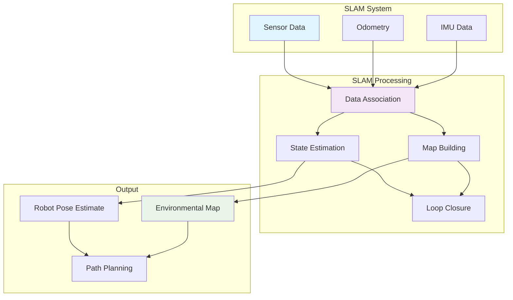

import Tabs from '@theme/Tabs';
import TabItem from '@theme/TabItem';

## Learning Outcomes

After completing this chapter, you will be able to:
1. Understand and implement different SLAM algorithms (EKF, FastSLAM, GraphSLAM)
2. Apply probabilistic methods for robot localization and mapping
3. Implement particle filter algorithms for Monte Carlo localization
4. Design and evaluate navigation systems for autonomous robot mobility
5. Integrate sensor data fusion for robust mapping and localization
6. Handle loop closure detection and correction in SLAM systems
7. Evaluate SLAM performance metrics and convergence properties
8. Apply optimization techniques for large-scale mapping problems

## Gherkin Specifications

### Scenario 1: SLAM Initialization
- **Given** a robot with initial pose uncertainty in unknown environment
- **When** SLAM algorithm is started
- **Then** robot begins building map while estimating its location

### Scenario 2: Sensor Data Integration
- **Given** robot receives sensor data (LIDAR, camera, IMU)
- **When** sensor fusion is applied in SLAM system
- **Then** map is updated with new observations and robot pose refined

### Scenario 3: Loop Closure Detection
- **Given** robot revisits previously mapped area
- **When** loop closure algorithm is executed
- **Then** map inconsistencies are corrected

### Scenario 4: Navigation Planning
- **Given** robot with current location in known map
- **When** navigation goal is specified
- **Then** collision-free path is computed and followed

### Scenario 5: Localization Failure Recovery
- **Given** robot with degraded localization accuracy
- **When** recovery procedures are activated
- **Then** robot re-establishes accurate localization

## Theory & Intuition

Think of SLAM like being in an unfamiliar city with a blindfold on, but you have a long stick to feel the walls and landmarks around you. As you move through the city, you're trying to answer two questions simultaneously: "Where am I?" (localization) and "What does the city look like?" (mapping). The catch is, you're uncertain about both your movement and what you're sensing.

SLAM is like keeping a mental map of the city while walking around, noting distinctive landmarks, and constantly updating your estimate of where you are based on the landmarks you've seen. If you realize you've passed by the same landmark before (loop closure), you can correct your map and position estimate.

In robot navigation, the process is similar. The robot uses sensors to detect landmarks (walls, doors, objects) and tries to simultaneously build a map of these landmarks while figuring out where it is in relation to them. The challenge is that both the robot's odometry (estimation of movement) and its sensor readings have uncertainty, so the system must use probabilistic methods to handle this uncertainty.

Navigation planning is like deciding your route through that city once you have a good map. The robot uses its map to find safe paths to goal locations while avoiding obstacles. Different navigation strategies are like different approaches to getting around: sometimes taking the shortest path, other times preferring safer routes that stay farther from obstacles.

## Core Concepts

<Tabs
  defaultValue="diagram"
  values={[
    {label: 'SLAM Architecture', value: 'diagram'},
    {label: 'SLAM Algorithms', value: 'table'},
  ]}>
  <TabItem value="diagram">



  </TabItem>
  <TabItem value="table">

| SLAM Algorithm | Approach | Complexity | Best Use Case |
|----------------|----------|------------|---------------|
| EKF SLAM | Extended Kalman Filter | O(n²) | Small maps with few landmarks |
| FastSLAM | Particle Filter + EKF | O(P·m) | Maps with many landmarks |
| GraphSLAM | Graph optimization | O(n³) | Large-scale environments |
| ORB-SLAM | Visual features | Real-time | Camera-based mapping |

  </TabItem>
</Tabs>

## Hands-On Labs

<Tabs
  defaultValue="lab1"
  values={[
    {label: 'Lab 1: Particle Filter Implementation', value: 'lab1'},
    {label: 'Lab 2: EKF SLAM', value: 'lab2'},
    {label: 'Lab 3: Navigation Planning', value: 'lab3'},
  ]}>
  <TabItem value="lab1">

### Lab 1: Particle Filter Implementation

#### Objective
Implement a particle filter for Monte Carlo localization using LIDAR and odometry data.

#### Required Components
- ROS 2 environment
- LIDAR sensor data
- Odometry information
- Occupancy grid map

#### Steps
1. **Create a particle filter package**:
   ```bash
   cd ~/robot_ws/src
   ros2 pkg create --build-type ament_python particle_filter_slam --dependencies rclpy geometry_msgs nav_msgs sensor_msgs std_msgs tf2_ros tf2_geometry_msgs
   ```

2. **Create the particle filter node**:
   ```bash
   nano ~/robot_ws/src/particle_filter_slam/particle_filter_slam/particle_filter.py
   ```

3. **Add the particle filter implementation**:
   ```python
   #!/usr/bin/env python3
   import rclpy
   from rclpy.node import Node
   from geometry_msgs.msg import Point, Pose, PoseStamped
   from sensor_msgs.msg import LaserScan
   from nav_msgs.msg import OccupancyGrid, MapMetaData
   from geometry_msgs.msg import Twist
   from nav_msgs.msg import Odometry
   from std_msgs.msg import Header
   import numpy as np
   import math
   from scipy.stats import norm
   import random

   class Particle:
       def __init__(self, x, y, theta, weight=1.0):
           self.x = x
           self.y = y
           self.theta = theta
           self.weight = weight

   class ParticleFilterSLAM(Node):
       def __init__(self):
           super().__init__('particle_filter_slam')
           
           # Parameters
           self.declare_parameter('num_particles', 100)
           self.declare_parameter('map_resolution', 0.05)
           self.declare_parameter('laser_max_range', 10.0)
           self.declare_parameter('odom_alpha1', 0.2)  # Translation noise
           self.declare_parameter('odom_alpha2', 0.2)  # Rotation noise
           self.declare_parameter('odom_alpha3', 0.2)  # Translation noise for rotation
           self.declare_parameter('odom_alpha4', 0.2)  # Rotation noise for translation
           self.declare_parameter('sensor_std_err', 0.1)  # Sensor measurement standard deviation
           
           self.num_particles = self.get_parameter('num_particles').value
           self.map_resolution = self.get_parameter('map_resolution').value
           self.laser_max_range = self.get_parameter('laser_max_range').value
           self.alpha1 = self.get_parameter('odom_alpha1').value
           self.alpha2 = self.get_parameter('odom_alpha2').value
           self.alpha3 = self.get_parameter('odom_alpha3').value
           self.alpha4 = self.get_parameter('odom_alpha4').value
           self.sensor_std_err = self.get_parameter('sensor_std_err').value
           
           # Initialize particles
           self.particles = []
           self.initialize_particles()
           
           # Publishers and subscribers
           self.laser_sub = self.create_subscription(
               LaserScan,
               '/scan',
               self.laser_callback,
               10
           )
           
           self.odom_sub = self.create_subscription(
               Odometry,
               '/odom',
               self.odom_callback,
               10
           )
           
           self.map_sub = self.create_subscription(
               OccupancyGrid,
               '/map',
               self.map_callback,
               10
           )
           
           self.pose_pub = self.create_publisher(
               PoseStamped,
               '/pf_pose_estimate',
               10
           )
           
           self.path_pub = self.create_publisher(
               PoseStamped,
               '/pf_path',
               10
           )
           
           # Variables for state estimation
           self.old_odom_x = 0.0
           self.old_odom_y = 0.0
           self.old_odom_theta = 0.0
           self.current_odom_x = 0.0
           self.current_odom_y = 0.0
           self.current_odom_theta = 0.0
           
           # Map data
           self.map_data = None
           self.map_width = 0
           self.map_height = 0
           self.map_resolution = 0.0
           self.map_origin_x = 0.0
           self.map_origin_y = 0.0
           
           # For path visualization
           self.path_history = []
           
           self.get_logger().info(f'Particle Filter SLAM initialized with {self.num_particles} particles')

       def initialize_particles(self):
           """Initialize particles randomly in the environment"""
           # In a real scenario, you might initialize based on known constraints
           # For this example, we'll initialize near origin
           for i in range(self.num_particles):
               # Random initialization around a guessed starting position
               x = np.random.normal(0.0, 0.5)  # Mean 0, std 0.5 meters
               y = np.random.normal(0.0, 0.5)  # Mean 0, std 0.5 meters
               theta = np.random.uniform(-math.pi, math.pi)  # Random orientation
               
               self.particles.append(Particle(x, y, theta, 1.0/self.num_particles))

       def laser_callback(self, msg):
           """Process laser scan data"""
           if self.map_data is None:
               self.get_logger().debug('Waiting for map data...')
               return
           
           # Update particles based on laser scan
           self.update_particle_weights(msg)
           self.resample_particles()
           
           # Estimate robot pose
           estimated_pose = self.estimate_pose()
           self.publish_pose_estimate(estimated_pose)
           
           self.get_logger().debug(f'Laser scan processed. Estimated pose: ({estimated_pose[0]:.2f}, {estimated_pose[1]:.2f}, {estimated_pose[2]:.2f})')

       def odom_callback(self, msg):
           """Process odometry data for motion model"""
           # Extract position from odometry
           pos = msg.pose.pose.position
           orient = msg.pose.pose.orientation
           
           # Convert quaternion to Euler
           from tf_transformations import euler_from_quaternion
           _, _, theta = euler_from_quaternion([orient.x, orient.y, orient.z, orient.w])
           
           self.current_odom_x = pos.x
           self.current_odom_y = pos.y
           self.current_odom_theta = theta

       def map_callback(self, msg):
           """Store occupancy grid map"""
           self.map_data = msg.data
           self.map_width = msg.info.width
           self.map_height = msg.info.height
           self.map_resolution = msg.info.resolution
           self.map_origin_x = msg.info.origin.position.x
           self.map_origin_y = msg.info.origin.position.y
           
           self.get_logger().info(f'Map received: {self.map_width}x{self.map_height}, res: {self.map_resolution}')

       def sample_motion_model(self, odometry_delta):
           """Sample motion model to predict particle movement"""
           dx, dy, dtheta = odometry_delta
           
           # Add noise based on motion model
           # This is a simplified model; in practice, noise should vary with movement magnitude
           motion_var = max(abs(dx) + abs(dy), 0.01)  # Minimum variance
           rot_var = abs(dtheta) + 0.01  # Minimum variance
           
           # Add noise to each particle
           for particle in self.particles:
               # Sample noise values (these depend on the magnitude of motion)
               delta_hat_r1 = dtheta/2 + np.random.normal(0, math.sqrt(self.alpha1 * abs(dtheta) + self.alpha2 * motion_var))
               delta_hat_trans = motion_var + np.random.normal(0, math.sqrt(self.alpha3 * motion_var + self.alpha4 * abs(dtheta)))
               delta_hat_r2 = dtheta/2 + np.random.normal(0, math.sqrt(self.alpha1 * abs(dtheta) + self.alpha2 * motion_var))
               
               # Update particle position
               particle.x += delta_hat_trans * math.cos(particle.theta + delta_hat_r1)
               particle.y += delta_hat_trans * math.sin(particle.theta + delta_hat_r1)
               particle.theta += delta_hat_r1 + delta_hat_r2
               
               # Normalize angle to [-π, π]
               particle.theta = self.normalize_angle(particle.theta)

       def update_particle_weights(self, laser_msg):
           """Update particle weights based on sensor likelihood"""
           for particle in self.particles:
               weight = self.calculate_sensor_likelihood(particle, laser_msg)
               particle.weight = weight
           
           # Normalize weights
           total_weight = sum(p.weight for p in self.particles)
           if total_weight > 0:
               for particle in self.particles:
                   particle.weight /= total_weight
           else:
               # If all particles have 0 weight, reset to uniform
               for particle in self.particles:
                   particle.weight = 1.0 / len(self.particles)

       def calculate_sensor_likelihood(self, particle, laser_msg):
           """Calculate likelihood of sensor readings given particle pose"""
           # Simplified beam-based model
           likelihood = 1.0
           
           # Get expected range for each beam
           for i, range_reading in enumerate(laser_msg.ranges):
               if not (0.1 < range_reading < self.laser_max_range):
                   continue  # Skip invalid ranges
               
               # Calculate beam angle in world frame
               beam_angle = laser_msg.angle_min + i * laser_msg.angle_increment + particle.theta
               
               # Calculate expected endpoint of this beam
               expected_x = particle.x + range_reading * math.cos(beam_angle)
               expected_y = particle.y + range_reading * math.sin(beam_angle)
               
               # Convert to grid coordinates
               grid_x = int((expected_x - self.map_origin_x) / self.map_resolution)
               grid_y = int((expected_y - self.map_origin_y) / self.map_resolution)
               
               # Check if it's in map bounds
               if 0 <= grid_x < self.map_width and 0 <= grid_y < self.map_height:
                   # Get map value at this point (0 = free, 100 = occupied)
                   map_idx = grid_y * self.map_width + grid_x
                   map_value = self.map_data[map_idx]
                   
                   # Calculate probability based on map value (simplified)
                   # 0-20: Free space, 21-70: Unknown, 71-100: Occupied
                   if map_value > 70:  # Occupied
                       # High probability if sensor reading matches occupied space
                       prob = norm.pdf(range_reading, loc=range_reading, scale=self.sensor_std_err)
                   elif map_value < 20:  # Free space
                       # Lower probability if reading indicates obstacle in free space
                       prob = norm.pdf(range_reading, loc=float('inf'), scale=self.sensor_std_err)
                   else:  # Unknown
                       prob = 0.5  # Neutral probability for unknown space
                   
                   likelihood *= prob
               
               if likelihood == 0:
                   break  # If likelihood becomes 0, don't multiply anymore
               
               # Prevent underflow by using log probabilities
               if likelihood < 1e-100:
                   likelihood = 1e-100
           
           return likelihood

       def resample_particles(self):
           """Resample particles based on their weights"""
           # Calculate cumulative weights
           cumulative_weights = []
           cumsum = 0
           for particle in self.particles:
               cumsum += particle.weight
               cumulative_weights.append(cumsum)
           
           # Create new particles through resampling
           new_particles = []
           for _ in range(len(self.particles)):
               # Sample a random value
               u = random.random() * cumsum
               
               # Find corresponding particle
               index = 0
               for i in range(len(cumulative_weights)):
                   if u < cumulative_weights[i]:
                       index = i
                       break
               
               # Add particle to new set (copy with slight noise)
               selected_particle = self.particles[index]
               new_particle = Particle(
                   selected_particle.x + np.random.normal(0, 0.01),
                   selected_particle.y + np.random.normal(0, 0.01),
                   selected_particle.theta + np.random.normal(0, 0.01),
                   1.0 / len(self.particles)  # Reset weight to uniform
               )
               new_particles.append(new_particle)
           
           self.particles = new_particles

       def estimate_pose(self):
           """Estimate robot pose from particle distribution"""
           # Calculate weighted average of particles
           x_sum = sum(p.x * p.weight for p in self.particles)
           y_sum = sum(p.y * p.weight for p in self.particles)
           theta_sum_sin = sum(math.sin(p.theta) * p.weight for p in self.particles)
           theta_sum_cos = sum(math.cos(p.theta) * p.weight for p in self.particles)
           
           estimated_x = x_sum
           estimated_y = y_sum
           estimated_theta = math.atan2(theta_sum_sin, theta_sum_cos)
           
           return (estimated_x, estimated_y, estimated_theta)

       def publish_pose_estimate(self, pose):
           """Publish estimated pose"""
           pose_msg = PoseStamped()
           pose_msg.header = Header()
           pose_msg.header.stamp = self.get_clock().now().to_msg()
           pose_msg.header.frame_id = 'map'
           
           pose_msg.pose.position.x = pose[0]
           pose_msg.pose.position.y = pose[1]
           pose_msg.pose.position.z = 0.0
           
           # Convert theta to quaternion
           from tf_transformations import quaternion_from_euler
           quat = quaternion_from_euler(0, 0, pose[2])
           pose_msg.pose.orientation.x = quat[0]
           pose_msg.pose.orientation.y = quat[1]
           pose_msg.pose.orientation.z = quat[2]
           pose_msg.pose.orientation.w = quat[3]
           
           self.pose_pub.publish(pose_msg)
           
           # Add to path history for visualization
           self.path_history.append(pose_msg)
           if len(self.path_history) > 1000:  # Limit path length
               self.path_history.pop(0)

       def normalize_angle(self, angle):
           """Normalize angle to [-π, π]"""
           while angle > math.pi:
               angle -= 2 * math.pi
           while angle < -math.pi:
               angle += 2 * math.pi
           return angle

   def main(args=None):
       rclpy.init(args=args)
       node = ParticleFilterSLAM()
       
       try:
           rclpy.spin(node)
       except KeyboardInterrupt:
           node.get_logger().info('Particle filter SLAM node terminated')
       finally:
           node.destroy_node()
           rclpy.shutdown()

   if __name__ == '__main__':
       main()
   ```

4. **Create an EKF SLAM implementation**:
   ```bash
   nano ~/robot_ws/src/particle_filter_slam/particle_filter_slam/ekf_slam.py
   ```

5. **Add the EKF SLAM implementation**:
   ```python
   #!/usr/bin/env python3
   import rclpy
   from rclpy.node import Node
   from geometry_msgs.msg import Point, Pose, PoseStamped
   from sensor_msgs.msg import LaserScan
   from nav_msgs.msg import OccupancyGrid
   from geometry_msgs.msg import Twist
   from nav_msgs.msg import Odometry
   from std_msgs.msg import Header
   import numpy as np
   import math
   from scipy.spatial.distance import cdist

   class EKFSLAMNode(Node):
       def __init__(self):
           super().__init__('ekf_slam')
           
           # Parameters
           self.declare_parameter('max_landmarks', 50)
           self.declare_parameter('sensor_range', 5.0)
           self.declare_parameter('association_threshold', 0.5)
           self.declare_parameter('process_noise', 0.1)
           self.declare_parameter('measurement_noise', 0.05)
           
           self.max_landmarks = self.get_parameter('max_landmarks').value
           self.sensor_range = self.get_parameter('sensor_range').value
           self.association_threshold = self.get_parameter('association_threshold').value
           self.process_noise = self.get_parameter('process_noise').value
           self.measurement_noise = self.get_parameter('measurement_noise').value
           
           # State vector: [x, y, theta, lm1_x, lm1_y, lm2_x, lm2_y, ...]
           # Covariance matrix: P (2D + 2 per landmark)
           self.state = np.zeros(3)  # Initial state [x, y, theta]
           self.landmark_count = 0
           self.total_state_size = 3  # Robot state starts with 3 elements
           
           # Covariance matrix (initialize with optimistic values)
           self.P = np.eye(self.total_state_size) * 0.1
           
           # Publishers and subscribers
           self.laser_sub = self.create_subscription(
               LaserScan,
               '/scan',
               self.laser_callback,
               10
           )
           
           self.odom_sub = self.create_subscription(
               Odometry,
               '/odom',
               self.odom_callback,
               10
           )
           
           self.map_sub = self.create_subscription(
               OccupancyGrid,
               '/map',
               self.map_callback,
               10
           )
           
           self.pose_pub = self.create_publisher(
               PoseStamped,
               '/ekf_pose_estimate',
               10
           )
           
           # Variables for motion model
           self.last_odom_x = 0.0
           self.last_odom_y = 0.0
           self.last_odom_theta = 0.0
           self.first_odom = True
           
           self.get_logger().info('EKF SLAM node initialized')

       def odom_callback(self, msg):
           """Process odometry data"""
           pos = msg.pose.pose.position
           orient = msg.pose.pose.orientation
           
           # Convert quaternion to Euler
           from tf_transformations import euler_from_quaternion
           _, _, theta = euler_from_quaternion([orient.x, orient.y, orient.z, orient.w])
           
           if self.first_odom:
               self.last_odom_x = pos.x
               self.last_odom_y = pos.y
               self.last_odom_theta = theta
               self.first_odom = False
               return
           
           # Calculate odometry delta
           delta_x = pos.x - self.last_odom_x
           delta_y = pos.y - self.last_odom_y
           delta_theta = theta - self.last_odom_theta
           
           # Apply motion update
           self.motion_update(delta_x, delta_y, delta_theta)
           
           # Update last position
           self.last_odom_x = pos.x
           self.last_odom_y = pos.y
           self.last_odom_theta = theta

       def motion_update(self, delta_x, delta_y, delta_theta):
           """Update state and covariance based on motion"""
           # Convert odometry delta to robot frame
           robot_delta_x = delta_x * math.cos(self.state[2]) + delta_y * math.sin(self.state[2])
           robot_delta_y = -delta_x * math.sin(self.state[2]) + delta_y * math.cos(self.state[2])
           
           # Update robot pose in state vector
           self.state[0] += robot_delta_x * math.cos(self.state[2]) - robot_delta_y * math.sin(self.state[2])
           self.state[1] += robot_delta_x * math.sin(self.state[2]) + robot_delta_y * math.cos(self.state[2])
           self.state[2] = self.normalize_angle(self.state[2] + delta_theta)
           
           # Jacobian of motion model w.r.t state
           F = np.eye(self.total_state_size)
           
           # Robot motion affects robot state
           st = math.sin(self.state[2])  # state theta
           ct = math.cos(self.state[2])  # state theta
           
           # F matrix for motion model
           F[0, 2] = -robot_delta_x * st - robot_delta_y * ct  # dx/dtheta
           F[1, 2] = robot_delta_x * ct - robot_delta_y * st   # dy/dtheta
           
           # Process noise matrix (only for robot state, not landmarks yet)
           V = np.zeros((3, 3))  # Derivative of motion w.r.t. noise
           V[0, 0] = 1.0  # dx/delta_x
           V[1, 1] = 1.0  # dy/delta_y
           V[2, 2] = 1.0  # dtheta/dtheta
           
           # Process noise covariance
           R_motion = np.diag([self.process_noise**2,
                               self.process_noise**2,
                               (self.process_noise * 0.5)**2])
           
           # Propagate covariance
           self.P = F @ self.P @ F.T + V @ R_motion @ V.T

       def laser_callback(self, msg):
           """Process laser scan for landmark detection and update"""
           if self.map_data is None:
               return
           
           # Detect potential landmarks from laser scan
           # This is a simplified approach; in practice, you'd use more sophisticated techniques
           detected_landmarks = self.extract_landmarks_from_scan(msg)
           
           # For each detected landmark, associate or create new landmark
           for range_val, bearing in detected_landmarks:
               # Convert polar to Cartesian in robot frame
               meas_x = range_val * math.cos(bearing)
               meas_y = range_val * math.sin(bearing)
               
               # Transform to world frame
               world_x = self.state[0] + meas_x * math.cos(self.state[2]) - meas_y * math.sin(self.state[2])
               world_y = self.state[1] + meas_x * math.sin(self.state[2]) + meas_y * math.cos(self.state[2])
               
               # Associate with existing landmarks or add new one
               self.associate_and_update(world_x, world_y)

       def extract_landmarks_from_scan(self, scan_msg):
           """Extract potential landmarks from laser scan (simplified)"""
           landmarks = []
           
           # In a real implementation, you would use more sophisticated techniques
           # like edge detection or clustering to identify landmarks
           prev_range = scan_msg.ranges[0]
           for i in range(1, len(scan_msg.ranges)-1):
               current_range = scan_msg.ranges[i]
               next_range = scan_msg.ranges[i+1]
               
               # Look for significant changes in range (potential edges/landmarks)
               if abs(current_range - prev_range) > 0.2 or abs(current_range - next_range) > 0.2:
                   if 0.1 < current_range < self.sensor_range:
                       angle = scan_msg.angle_min + i * scan_msg.angle_increment
                       landmarks.append((current_range, angle))
               
               prev_range = current_range
           
           return landmarks

       def associate_and_update(self, meas_x, meas_y):
           """Associate measurement with existing landmarks or create new one"""
           # Calculate measurement in robot frame
           dx = meas_x - self.state[0]
           dy = meas_y - self.state[1]
           range_meas = math.sqrt(dx**2 + dy**2)
           bearing_meas = math.atan2(dy, dx) - self.state[2]
           bearing_meas = self.normalize_angle(bearing_meas)
           
           # If no landmarks yet, create first one
           if self.landmark_count == 0 and self.total_state_size < 2*self.max_landmarks + 3:
               self.add_new_landmark(meas_x, meas_y)
               return
           
           # Calculate Mahalanobis distance to existing landmarks
           min_distance = float('inf')
           best_assoc_idx = -1
           
           # Range from state vector to measurement
           for lm_idx in range(self.landmark_count):
               lm_start_idx = 3 + 2*lm_idx
               
               if lm_start_idx + 1 >= len(self.state):
                   continue
               
               # Get landmark position estimate
               lm_x = self.state[lm_start_idx]
               lm_y = self.state[lm_start_idx + 1]
               
               # Calculate expected measurement
               dx_expected = lm_x - self.state[0]
               dy_expected = lm_y - self.state[1]
               expected_range = math.sqrt(dx_expected**2 + dy_expected**2)
               expected_bearing = math.atan2(dy_expected, dx_expected) - self.state[2]
               expected_bearing = self.normalize_angle(expected_bearing)
               
               # Measurement residual
               range_residual = range_meas - expected_range
               bearing_residual = bearing_meas - expected_bearing
               bearing_residual = self.normalize_angle(bearing_residual)
               
               # Measurement Jacobian H - derivative of measurement function
               H = np.zeros((2, self.total_state_size))
               q = dx_expected**2 + dy_expected**2
               sqrt_q = math.sqrt(q)
               
               if sqrt_q > 0.01:  # Avoid division by zero
                   # H for range and bearing measurements
                   H[0, 0] = -dx_expected / sqrt_q  # dr/dx
                   H[0, 1] = -dy_expected / sqrt_q  # dr/dy
                   H[1, 0] = dy_expected / q        # db/dx
                   H[1, 1] = -dx_expected / q       # db/dy
                   H[1, 2] = -1.0                   # db/dtheta (robot rotation)
                   
                   # For landmark position derivatives
                   H[0, lm_start_idx] = dx_expected / sqrt_q      # dr/dlx
                   H[0, lm_start_idx + 1] = dy_expected / sqrt_q  # dr/dly
                   H[1, lm_start_idx] = -dy_expected / q          # db/dlx
                   H[1, lm_start_idx + 1] = dx_expected / q       # db/dly
               
               # Calculate innovation covariance
               R = np.diag([self.measurement_noise**2, (self.measurement_noise*0.5)**2])
               S = H @ self.P @ H.T + R
               
               # Calculate Mahalanobis distance
               innovation = np.array([range_residual, bearing_residual])
               try:
                   inv_S = np.linalg.inv(S)
                   distance = np.sqrt(innovation.T @ inv_S @ innovation)
                   if distance < min_distance:
                       min_distance = distance
                       best_assoc_idx = lm_idx
               except np.linalg.LinAlgError:
                   # Matrix is singular, skip this landmark for association
                   continue
           
           # Perform association based on threshold
           if min_distance < self.association_threshold:
               # Update existing landmark
               self.correct_existing_landmark(best_assoc_idx, meas_x, meas_y)
           elif self.landmark_count < self.max_landmarks:
               # Add new landmark
               self.add_new_landmark(meas_x, meas_y)

       def add_new_landmark(self, meas_x, meas_y):
           """Add a new landmark to the state vector"""
           if self.landmark_count >= self.max_landmarks:
               return
           
           # Calculate landmark position in world frame
           new_landmark_state = np.array([meas_x, meas_y])
           
           # Increase state vector size
           new_size = self.total_state_size + 2
           new_state = np.zeros(new_size)
           new_state[:self.total_state_size] = self.state
           new_state[self.total_state_size:self.total_state_size+2] = new_landmark_state
           
           # Increase covariance matrix size
           new_P = np.zeros((new_size, new_size))
           new_P[:self.total_state_size, :self.total_state_size] = self.P
           
           # Initialize new landmark uncertainty at the sensor level
           landmark_init_uncertainty = 1.0
           new_P[self.total_state_size, self.total_state_size] = landmark_init_uncertainty**2  # x
           new_P[self.total_state_size+1, self.total_state_size+1] = landmark_init_uncertainty**2  # y
           
           # Update state and covariance
           self.state = new_state
           self.P = new_P
           self.total_state_size = new_size
           self.landmark_count += 1
           
           self.get_logger().info(f'Added new landmark #{self.landmark_count} at ({meas_x:.2f}, {meas_y:.2f})')

       def correct_existing_landmark(self, lm_idx, meas_x, meas_y):
           """Correct existing landmark based on measurement"""
           # Calculate measurement in robot frame
           dx = meas_x - self.state[0]
           dy = meas_y - self.state[1]
           range_meas = math.sqrt(dx**2 + dy**2)
           bearing_meas = math.atan2(dy, dx) - self.state[2]
           bearing_meas = self.normalize_angle(bearing_meas)
           
           # Get landmark position estimate
           lm_start_idx = 3 + 2*lm_idx
           lm_x = self.state[lm_start_idx]
           lm_y = self.state[lm_start_idx + 1]
           
           # Calculate expected measurement
           dx_expected = lm_x - self.state[0]
           dy_expected = lm_y - self.state[1]
           expected_range = math.sqrt(dx_expected**2 + dy_expected**2)
           expected_bearing = math.atan2(dy_expected, dx_expected) - self.state[2]
           expected_bearing = self.normalize_angle(expected_bearing)
           
           # Measurement residual
           range_residual = range_meas - expected_range
           bearing_residual = bearing_meas - expected_bearing
           bearing_residual = self.normalize_angle(bearing_residual)
           innovation = np.array([range_residual, bearing_residual])
           
           # Measurement Jacobian H
           H = np.zeros((2, self.total_state_size))
           q = dx_expected**2 + dy_expected**2
           sqrt_q = math.sqrt(q)
           
           if sqrt_q > 0.01:
               # H for range and bearing measurements
               H[0, 0] = -dx_expected / sqrt_q  # dr/dx
               H[0, 1] = -dy_expected / sqrt_q  # dr/dy
               H[1, 0] = dy_expected / q        # db/dx
               H[1, 1] = -dx_expected / q       # db/dy
               H[1, 2] = -1.0                   # db/dtheta
               
               # For landmark position derivatives
               H[0, lm_start_idx] = dx_expected / sqrt_q      # dr/dlx
               H[0, lm_start_idx + 1] = dy_expected / sqrt_q  # dr/dly
               H[1, lm_start_idx] = -dy_expected / q          # db/dlx
               H[1, lm_start_idx + 1] = dx_expected / q       # db/dly
           
           # Measurement noise
           R = np.diag([self.measurement_noise**2, (self.measurement_noise*0.5)**2])
           
           # Calculate Kalman gain
           S = H @ self.P @ H.T + R
           try:
               K = self.P @ H.T @ np.linalg.inv(S)
               
               # Update state and covariance
               self.state = self.state + K @ innovation
               self.P = (np.eye(self.total_state_size) - K @ H) @ self.P
               
               self.get_logger().debug(f'Updated landmark {lm_idx} based on measurement')
           except np.linalg.LinAlgError:
               self.get_logger().warn('Singular matrix in EKF update')

       def normalize_angle(self, angle):
           """Normalize angle to [-π, π]"""
           while angle > math.pi:
               angle -= 2 * math.pi
           while angle < -math.pi:
               angle += 2 * math.pi
           return angle

       def map_callback(self, msg):
           """Store map data for visualization"""
           self.map_data = msg.data
           self.map_width = msg.info.width
           self.map_height = msg.info.height
           self.map_resolution = msg.info.resolution
           self.map_origin_x = msg.info.origin.position.x
           self.map_origin_y = msg.info.origin.position.y

   def main(args=None):
       rclpy.init(args=args)
       node = EKFSLAMNode()
       
       try:
           rclpy.spin(node)
       except KeyboardInterrupt:
           node.get_logger().info('EKF SLAM node terminated')
       finally:
           node.destroy_node()
           rclpy.shutdown()

   if __name__ == '__main__':
       main()
   ```

6. **Update setup.py**:
   ```bash
   nano ~/robot_ws/src/particle_filter_slam/setup.py
   ```

7. **Add entry point**:
   ```python
   entry_points={
       'console_scripts': [
           'particle_filter = particle_filter_slam.particle_filter:main',
           'ekf_slam = particle_filter_slam.ekf_slam:main',
       ],
   }
   ```

8. **Make the files executable and build**:
   ```bash
   chmod +x ~/robot_ws/src/particle_filter_slam/particle_filter_slam/particle_filter.py
   chmod +x ~/robot_ws/src/particle_filter_slam/particle_filter_slam/ekf_slam.py
   cd ~/robot_ws
   colcon build --packages-select particle_filter_slam
   source install/setup.bash
   ```

9. **Run the particle filter SLAM**:
   ```bash
   ros2 run particle_filter_slam particle_filter
   ```

#### Expected Outcome
Particle filter localization system operational, estimating robot pose using LIDAR and odometry data with probabilistic approach.

  </TabItem>
  <TabItem value="lab2">

### Lab 2: EKF SLAM Implementation

#### Objective
Implement Extended Kalman Filter SLAM for simultaneous localization and mapping.

#### Required Components
- Robot platform with odometry
- LIDAR sensor
- Feature extraction capability

#### Steps
1. **Continue with the EKF SLAM implementation** that was started in Lab 1

2. **Create a graph-based SLAM implementation**:
   ```bash
   nano ~/robot_ws/src/particle_filter_slam/particle_filter_slam/graph_slam.py
   ```

3. **Add the graph-based SLAM implementation**:
   ```python
   #!/usr/bin/env python3
   import rclpy
   from rclpy.node import Node
   from geometry_msgs.msg import Point, Pose, PoseStamped
   from sensor_msgs.msg import LaserScan, PointCloud2
   from nav_msgs.msg import OccupancyGrid, Path
   from geometry_msgs.msg import Twist
   from nav_msgs.msg import Odometry
   from std_msgs.msg import Header
   from visualization_msgs.msg import Marker, MarkerArray
   import numpy as np
   import math
   import g2o  # Python bindings for g2o (graph optimization library)

   class GraphSLAMNode(Node):
       def __init__(self):
           super().__init__('graph_slam')
           
           # Parameters
           self.declare_parameter('max_vertices', 500)
           self.declare_parameter('optimization_iterations', 5)
           self.declare_parameter('loop_closure_distance', 2.0)
           self.declare_parameter('min_translation', 0.2)
           self.declare_parameter('min_rotation', 0.1)
           
           self.max_vertices = self.get_parameter('max_vertices').value
           self.opt_iterations = self.get_parameter('optimization_iterations').value
           self.loop_closure_distance = self.get_parameter('loop_closure_distance').value
           self.min_translation = self.get_parameter('min_translation').value
           self.min_rotation = self.get_parameter('min_rotation').value
           
           # Graph optimization components
           self.solver = g2o.BlockSolverSE2(g2o.LinearSolverEigenSE2())
           self.optimizer = g2o.Optimizer()
           self.optimizer.set_verbose(False)
           self.optimizer.set_solver(self.solver)
           
           # Store previous robot pose for keyframe selection
           self.prev_keyframe_pose = None
           self.vertices_added = 0
           self.edges_added = 0
           
           # Publishers and subscribers
           self.odom_sub = self.create_subscription(
               Odometry,
               '/odom',
               self.odom_callback,
               10
           )
           
           self.laser_sub = self.create_subscription(
               LaserScan,
               '/scan',
               self.laser_callback,
               10
           )
           
           self.map_pub = self.create_publisher(
               OccupancyGrid,
               '/graph_slam_map',
               10
           )
           
           self.path_pub = self.create_publisher(
               Path,
               '/graph_slam_path',
               10
           )
           
           self.graph_pub = self.create_publisher(
               MarkerArray,
               '/graph_slam_graph',
               10
           )
           
           # Store robot trajectory and keyframes
           self.trajectory = []
           self.keyframes = []
           self.pose_queue = []  # Buffer for pose synchronization
           
           self.get_logger().info('Graph SLAM node initialized')

       def odom_callback(self, msg):
           """Process odometry and add keyframes to graph"""
           # Extract robot pose from odometry
           pos = msg.pose.pose.position
           orient = msg.pose.pose.orientation
           
           # Convert quaternion to Euler
           from tf_transformations import euler_from_quaternion
           _, _, theta = euler_from_quaternion([orient.x, orient.y, orient.z, orient.w])
           
           current_pose = (pos.x, pos.y, theta)
           self.pose_queue.append(current_pose)
           
           # Add keyframe if the robot has moved enough from the last keyframe
           if self.should_add_keyframe(current_pose):
               self.add_keyframe(current_pose, msg.header.stamp)
               
               # Perform optimization periodically
               if len(self.keyframes) % 10 == 0:  # Optimize every 10 keyframes
                   self.optimize_graph()
                   self.publish_optimized_path()

       def laser_callback(self, msg):
           """Process laser scan for landmark detection and loop closure"""
           # In a real implementation, you would extract landmarks/features
           # from the laser scan and use them for loop closure detection
           
           # For this example, we'll use a simplified loop closure detection
           if len(self.keyframes) > 3:  # Need at least 3 keyframes to detect loops
               self.detect_loop_closure()

       def should_add_keyframe(self, current_pose):
           """Determine if a new keyframe should be added"""
           if self.prev_keyframe_pose is None:
               return True
           
           # Calculate distance and rotation since last keyframe
           dx = current_pose[0] - self.prev_keyframe_pose[0]
           dy = current_pose[1] - self.prev_keyframe_pose[1]
           translation = math.sqrt(dx*dx + dy*dy)
           
           rotation = abs(self.normalize_angle(current_pose[2] - self.prev_keyframe_pose[2]))
           
           # Add keyframe if moved enough
           return translation >= self.min_translation or rotation >= self.min_rotation

       def add_keyframe(self, pose, stamp):
           """Add a keyframe to the graph"""
           # Add vertex for the keyframe pose
           vertex_id = len(self.keyframes)
           se2_pose = g2o.SE2([pose[0], pose[1], pose[2]])
           
           v_se2 = g2o.VertexSE2()
           v_se2.set_id(vertex_id)
           v_se2.set_estimate(se2_pose)
           v_se2.set_fixed(vertex_id == 0)  # Fix first vertex
           
           self.optimizer.add_vertex(v_se2)
           
           # Add edge from previous keyframe if exists
           if vertex_id > 0:
               prev_pose = self.keyframes[-1]['pose']
               
               # Calculate relative transformation
               dx = pose[0] - prev_pose[0]
               dy = pose[1] - prev_pose[1]
               dtheta = self.normalize_angle(pose[2] - prev_pose[2])
               
               relative_pose = g2o.SE2([dx, dy, dtheta])
               
               # Create edge with information matrix (inverse of covariance)
               edge = g2o.EdgeSE2()
               edge.set_id(self.edges_added)
               edge.set_vertex(0, self.optimizer.vertex(vertex_id - 1))
               edge.set_vertex(1, self.optimizer.vertex(vertex_id))
               edge.set_measurement(relative_pose)
               
               # Information matrix - diagonal values for translation and rotation
               info_mat = np.identity(3, dtype=float)
               info_mat[0, 0] = 1.0  # x precision
               info_mat[1, 1] = 1.0  # y precision
               info_mat[2, 2] = 0.5  # theta precision
               edge.set_information(info_mat)
               
               self.optimizer.add_edge(edge)
               self.edges_added += 1
           
           # Store keyframe data
           keyframe_data = {
               'id': vertex_id,
               'pose': pose,
               'stamp': stamp,
               'vertex': v_se2
           }
           self.keyframes.append(keyframe_data)
           self.prev_keyframe_pose = pose
           
           self.get_logger().info(f'Added keyframe #{vertex_id} at ({pose[0]:.2f}, {pose[1]:.2f}, {pose[2]:.2f})')

       def detect_loop_closure(self):
           """Detect potential loop closures by comparing current pose with past keyframes"""
           if len(self.keyframes) < 5:  # Need enough keyframes for meaningful comparison
               return
           
           current_pose = self.keyframes[-1]['pose']
           current_id = self.keyframes[-1]['id']
           
           # Check for potential loop closures with older keyframes
           for i, kf in enumerate(self.keyframes[:-4]):  # Exclude last 4 to avoid false positives
               kf_pose = kf['pose']
               
               # Calculate distance to previous keyframe
               dx = current_pose[0] - kf_pose[0]
               dy = current_pose[1] - kf_pose[1]
               distance = math.sqrt(dx*dx + dy*dy)
               
               # If close enough, consider it a potential loop closure
               if distance < self.loop_closure_distance:
                   self.handle_loop_closure(current_id, kf['id'])

       def handle_loop_closure(self, current_vertex_id, previous_vertex_id):
           """Handle a detected loop closure by adding a constraint edge"""
           # Calculate relative transformation between poses
           current_pose = self.keyframes[current_vertex_id]['pose']
           previous_pose = self.keyframes[previous_vertex_id]['pose']
           
           # Calculate relative transformation
           dx = current_pose[0] - previous_pose[0]
           dy = current_pose[1] - previous_pose[1]
           dtheta = self.normalize_angle(current_pose[2] - previous_pose[2])
           
           # Transform to relative frame
           # We need to account for the orientation of the previous pose
           cos_prev = math.cos(previous_pose[2])
           sin_prev = math.sin(previous_pose[2])
           
           relative_x = dx * cos_prev + dy * sin_prev
           relative_y = -dx * sin_prev + dy * cos_prev
           relative_theta = self.normalize_angle(dtheta)
           
           relative_pose = g2o.SE2([relative_x, relative_y, relative_theta])
           
           # Create loop closure edge
           edge = g2o.EdgeSE2()
           edge.set_id(self.edges_added)
           edge.set_vertex(0, self.optimizer.vertex(previous_vertex_id))
           edge.set_vertex(1, self.optimizer.vertex(current_vertex_id))
           edge.set_measurement(relative_pose)
           
           # Information matrix for loop closure (more confident than odometry)
           info_mat = np.identity(3, dtype=float)
           info_mat[0, 0] = 0.5  # x precision
           info_mat[1, 1] = 0.5  # y precision
           info_mat[2, 2] = 0.2  # theta precision
           edge.set_information(info_mat)
           
           self.optimizer.add_edge(edge)
           self.edges_added += 1
           
           self.get_logger().info(f'Loop closure detected and added between vertices {previous_vertex_id} and {current_vertex_id}')

       def optimize_graph(self):
           """Run graph optimization to refine pose estimates"""
           if self.optimizer.vertices().size() < 2:
               return
           
           self.optimizer.initialize_optimization()
           self.optimizer.optimize(self.opt_iterations)
           
           self.get_logger().info(f'Graph optimized with {self.optimizer.vertices().size()} vertices and {self.optimizer.edges().size()} edges')

       def publish_optimized_path(self):
           """Publish the optimized path"""
           if not self.keyframes:
               return
           
           path_msg = Path()
           path_msg.header = Header()
           path_msg.header.stamp = self.get_clock().now().to_msg()
           path_msg.header.frame_id = 'map'
           
           # Extract optimized poses
           for i, kf in enumerate(self.keyframes):
               if i in self.optimizer.vertices():
                   v = self.optimizer.vertex(i)
                   estimate = v.estimate()
                   
                   pose_stamped = PoseStamped()
                   pose_stamped.header = path_msg.header
                   pose_stamped.pose.position.x = estimate.x()
                   pose_stamped.pose.position.y = estimate.y()
                   pose_stamped.pose.position.z = 0.0
                   
                   # Convert rotation to quaternion
                   from tf_transformations import quaternion_from_euler
                   quat = quaternion_from_euler(0, 0, estimate.rotation())
                   pose_stamped.pose.orientation.x = quat[0]
                   pose_stamped.pose.orientation.y = quat[1]
                   pose_stamped.pose.orientation.z = quat[2]
                   pose_stamped.pose.orientation.w = quat[3]
                   
                   path_msg.poses.append(pose_stamped)
           
           self.path_pub.publish(path_msg)

       def normalize_angle(self, angle):
           """Normalize angle to [-π, π]"""
           while angle > math.pi:
               angle -= 2 * math.pi
           while angle < -math.pi:
               angle += 2 * math.pi
           return angle

   def main(args=None):
       rclpy.init(args=args)
       node = GraphSLAMNode()
       
       try:
           rclpy.spin(node)
       except KeyboardInterrupt:
           node.get_logger().info('Graph SLAM node terminated')
       finally:
           node.destroy_node()
           rclpy.shutdown()

   if __name__ == '__main__':
       main()
   ```

4. **Update setup.py to include graph SLAM**:
   ```bash
   nano ~/robot_ws/src/particle_filter_slam/setup.py
   ```

5. **Add the new entry point**:
   ```python
   entry_points={
       'console_scripts': [
           'particle_filter = particle_filter_slam.particle_filter:main',
           'ekf_slam = particle_filter_slam.ekf_slam:main',
           'graph_slam = particle_filter_slam.graph_slam:main',
       ],
   }
   ```

6. **Make the file executable and rebuild**:
   ```bash
   chmod +x ~/robot_ws/src/particle_filter_slam/particle_filter_slam/graph_slam.py
   cd ~/robot_ws
   colcon build --packages-select particle_filter_slam
   source install/setup.bash
   ```

7. **Install g2o library** (if needed):
   ```bash
   pip3 install g2o
   ```

8. **Run the Graph SLAM node**:
   ```bash
   ros2 run particle_filter_slam graph_slam
   ```

#### Expected Outcome
Graph-based SLAM system operational, creating a pose graph and optimizing it to correct drift and incorporate loop closures.

  </TabItem>
  <TabItem value="lab3">

### Lab 3: Navigation Planning Implementation

#### Objective
Implement path planning and navigation algorithms using the map from SLAM.

#### Required Components
- Occupancy grid map
- Robot pose estimation
- Path planning algorithms

#### Steps
1. **Create a navigation package**:
   ```bash
   cd ~/robot_ws/src
   ros2 pkg create --build-type ament_python navigation_planning --dependencies rclpy geometry_msgs nav_msgs sensor_msgs std_msgs tf2_ros tf2_geometry_msgs visualization_msgs
   ```

2. **Create the navigation planner**:
   ```bash
   nano ~/robot_ws/src/navigation_planning/navigation_planning/navigation_planner.py
   ```

3. **Add the navigation planning implementation**:
   ```python
   #!/usr/bin/env python3
   import rclpy
   from rclpy.node import Node
   from geometry_msgs.msg import PoseStamped, Point
   from sensor_msgs.msg import LaserScan
   from nav_msgs.msg import OccupancyGrid, Path, Odometry
   from std_msgs.msg import Header
   from visualization_msgs.msg import Marker, MarkerArray
   import numpy as np
   import math
   import heapq
   from typing import List, Tuple, Optional

   class NavigationPlannerNode(Node):
       def __init__(self):
           super().__init__('navigation_planner')
           
           # Parameters
           self.declare_parameter('planner_frequency', 5.0)
           self.declare_parameter('controller_frequency', 20.0)
           self.declare_parameter('base_local_planner', 'dwa_local_planner')
           self.declare_parameter('robot_radius', 0.3)
           self.declare_parameter('inflation_radius', 0.5)
           self.declare_parameter('goal_tolerance', 0.5)
           self.declare_parameter('max_vel_x', 0.5)
           self.declare_parameter('max_vel_theta', 1.0)
           
           self.planner_frequency = self.get_parameter('planner_frequency').value
           self.controller_frequency = self.get_parameter('controller_frequency').value
           self.robot_radius = self.get_parameter('robot_radius').value
           self.inflation_radius = self.get_parameter('inflation_radius').value
           self.goal_tolerance = self.get_parameter('goal_tolerance').value
           self.max_vel_x = self.get_parameter('max_vel_x').value
           self.max_vel_theta = self.get_parameter('max_vel_theta').value
           
           # Publishers and subscribers
           self.map_sub = self.create_subscription(
               OccupancyGrid,
               '/map',  # Map from SLAM
               self.map_callback,
               10
           )
           
           self.odom_sub = self.create_subscription(
               Odometry,
               '/odom',
               self.odom_callback,
               10
           )
           
           self.goal_sub = self.create_subscription(
               PoseStamped,
               '/move_base_simple/goal',
               self.goal_callback,
               10
           )
           
           self.laser_sub = self.create_subscription(
               LaserScan,
               '/scan',
               self.laser_callback,
               10
           )
           
           self.global_plan_pub = self.create_publisher(
               Path,
               '/global_plan',
               10
           )
           
           self.local_plan_pub = self.create_publisher(
               Path,
               '/local_plan',
               10
           )
           
           self.cmd_vel_pub = self.create_publisher(
               geometry_msgs.msg.Twist,
               '/cmd_vel',
               10
           )
           
           # Map and robot state
           self.map_data = None
           self.map_width = 0
           self.map_height = 0
           self.map_resolution = 0.0
           self.map_origin_x = 0.0
           self.map_origin_y = 0.0
           
           self.current_x = 0.0
           self.current_y = 0.0
           self.current_theta = 0.0
           self.current_vx = 0.0
           self.current_vy = 0.0
           self.current_vtheta = 0.0
           
           self.goal_x = None
           self.goal_y = None
           
           self.global_path = []
           self.local_path = []
           
           # Timers
           self.planner_timer = self.create_timer(1.0/self.planner_frequency, self.plan_global_path)
           self.controller_timer = self.create_timer(1.0/self.controller_frequency, self.follow_path)
           
           self.get_logger().info('Navigation Planner initialized')

       def map_callback(self, msg):
           """Store occupancy grid map"""
           self.map_data = msg.data
           self.map_width = msg.info.width
           self.map_height = msg.info.height
           self.map_resolution = msg.info.resolution
           self.map_origin_x = msg.info.origin.position.x
           self.map_origin_y = msg.info.origin.position.y
           
           self.get_logger().info(f'Navigation map received: {self.map_width}x{self.map_height}, res: {self.map_resolution}')

       def odom_callback(self, msg):
           """Update robot state from odometry"""
           # Position
           pos = msg.pose.pose.position
           self.current_x = pos.x
           self.current_y = pos.y
           
           # Orientation
           orient = msg.pose.pose.orientation
           from tf_transformations import euler_from_quaternion
           _, _, self.current_theta = euler_from_quaternion([orient.x, orient.y, orient.z, orient.w])
           
           # Velocities
           self.current_vx = msg.twist.twist.linear.x
           self.current_vy = msg.twist.twist.linear.y
           self.current_vtheta = msg.twist.twist.angular.z

       def laser_callback(self, msg):
           """Process laser scan for local obstacle detection"""
           # In a real implementation, this would update the local costmap
           pass

       def goal_callback(self, msg):
           """Process new navigation goal"""
           self.goal_x = msg.pose.position.x
           self.goal_y = msg.pose.position.y
           
           self.get_logger().info(f'New goal received: ({self.goal_x}, {self.goal_y})')
           
           # Plan new path
           self.plan_global_path()

       def plan_global_path(self):
           """Plan global path using A* algorithm"""
           if self.map_data is None or self.goal_x is None or self.goal_y is None:
               return
           
           # Convert start and goal to grid coordinates
           start_grid = self.world_to_grid(self.current_x, self.current_y)
           goal_grid = self.world_to_grid(self.goal_x, self.goal_y)
           
           if not self.is_valid_grid(*start_grid) or not self.is_valid_grid(*goal_grid):
               self.get_logger().warn('Start or goal position not in valid map area')
               return
           
           # Check if start or goal is in obstacle
           start_idx = start_grid[1] * self.map_width + start_grid[0]
           goal_idx = goal_grid[1] * self.map_width + goal_grid[0]
           
           if self.map_data[start_idx] > 50 or self.map_data[goal_idx] > 50:  # Occupied
               self.get_logger().warn('Start or goal position is in obstacle')
               return
           
           # Run A* pathfinding
           path = self.a_star(start_grid, goal_grid)
           
           if path:
               # Convert grid path back to world coordinates
               world_path = []
               for grid_x, grid_y in path:
                   world_x, world_y = self.grid_to_world(grid_x, grid_y)
                   point = Point()
                   point.x = world_x
                   point.y = world_y
                   point.z = 0.0
                   world_path.append(point)
               
               self.global_path = world_path
               self.publish_global_path()
               
               self.get_logger().info(f'Global path planned with {len(path)} waypoints')
           else:
               self.get_logger().warn('No valid path found to goal')

       def a_star(self, start: Tuple[int, int], goal: Tuple[int, int]) -> Optional[List[Tuple[int, int]]]:
           """Execute A* pathfinding algorithm"""
           # Node class for A*
           class NodeItem:
               def __init__(self, x, y, g_cost=0, h_cost=0, parent=None):
                   self.x = x
                   self.y = y
                   self.g_cost = g_cost  # Cost from start
                   self.h_cost = h_cost  # Heuristic cost to goal
                   self.f_cost = g_cost + h_cost  # Total cost
                   self.parent = parent
               
               def __lt__(self, other):
                   return self.f_cost < other.f_cost
               
               def __eq__(self, other):
                   return self.x == other.x and self.y == other.y
           
           # Heuristic function (Euclidean distance)
           def heuristic(x1, y1, x2, y2):
               return math.sqrt((x1 - x2)**2 + (y1 - y2)**2)
           
           # Check if grid cell is valid (not occupied)
           def is_valid_cell(x, y):
               if not (0 <= x < self.map_width and 0 <= y < self.map_height):
                   return False
               
               idx = y * self.map_width + x
               return self.map_data[idx] < 50  # Free space (not occupied)
           
           # Get valid neighbors (8-connected)
           def get_neighbors(node):
               neighbors = []
               for dx in [-1, 0, 1]:
                   for dy in [-1, 0, 1]:
                       if dx == 0 and dy == 0:
                           continue
                       
                       new_x, new_y = node.x + dx, node.y + dy
                       if is_valid_cell(new_x, new_y):
                           # Calculate cost (diagonal moves cost more)
                           cost = math.sqrt(dx*dx + dy*dy)
                           neighbors.append((new_x, new_y, cost))
               
               return neighbors
           
           # Initialize open and closed sets
           open_set = []
           closed_set = set()
           
           # Create start node
           start_node = NodeItem(start[0], start[1])
           start_node.g_cost = 0
           start_node.h_cost = heuristic(start[0], start[1], goal[0], goal[1])
           start_node.f_cost = start_node.h_cost
           
           heapq.heappush(open_set, start_node)
           
           # Track visited nodes
           visited_nodes = {(start[0], start[1]): start_node}
           
           while open_set:
               # Get node with lowest f_cost
               current_node = heapq.heappop(open_set)
               current_pos = (current_node.x, current_node.y)
               
               # Check if we reached the goal
               if current_node.x == goal[0] and current_node.y == goal[1]:
                   # Reconstruct path
                   path = []
                   node = current_node
                   while node:
                       path.append((node.x, node.y))
                       node = node.parent
                   path.reverse()
                   return path
               
               # Add current node to closed set
               closed_set.add(current_pos)
               
               # Explore neighbors
               for neighbor_x, neighbor_y, move_cost in get_neighbors(current_node):
                   neighbor_pos = (neighbor_x, neighbor_y)
                   
                   if neighbor_pos in closed_set:
                       continue
                   
                   # Calculate tentative g_cost
                   tentative_g = current_node.g_cost + move_cost
                   
                   # Check if this path is better than any previous one
                   if neighbor_pos not in visited_nodes:
                       # Create new node
                       neighbor_node = NodeItem(neighbor_x, neighbor_y)
                       neighbor_node.parent = current_node
                       neighbor_node.g_cost = tentative_g
                       neighbor_node.h_cost = heuristic(neighbor_x, neighbor_y, goal[0], goal[1])
                       neighbor_node.f_cost = tentative_g + neighbor_node.h_cost
                       
                       visited_nodes[neighbor_pos] = neighbor_node
                       heapq.heappush(open_set, neighbor_node)
                   else:
                       # Check if this path is better
                       existing_node = visited_nodes[neighbor_pos]
                       if tentative_g < existing_node.g_cost:
                           # Update the existing node
                           existing_node.parent = current_node
                           existing_node.g_cost = tentative_g
                           existing_node.f_cost = tentative_g + existing_node.h_cost
                           # Add to open set again to update its priority
                           heapq.heappush(open_set, existing_node)
           
           # No path found
           return None

       def publish_global_path(self):
           """Publish the global path for visualization"""
           if not self.global_path:
               return
           
           path_msg = Path()
           path_msg.header = Header()
           path_msg.header.stamp = self.get_clock().now().to_msg()
           path_msg.header.frame_id = 'map'
           
           for point in self.global_path:
               pose = PoseStamped()
               pose.header = path_msg.header
               pose.pose.position = point
               pose.pose.orientation.w = 1.0
               
               path_msg.poses.append(pose)
           
           self.global_plan_pub.publish(path_msg)

       def follow_path(self):
           """Follow the planned path using local navigation"""
           if not self.global_path:
               # Stop the robot if no path
               cmd = geometry_msgs.msg.Twist()
               cmd.linear.x = 0.0
               cmd.angular.z = 0.0
               self.cmd_vel_pub.publish(cmd)
               return
           
           # Simple proportional controller
           if len(self.global_path) > 0:
               # Get next waypoint in path
               next_waypoint = self.global_path[0]
               
               # Calculate desired direction to next waypoint
               dx = next_waypoint.x - self.current_x
               dy = next_waypoint.y - self.current_y
               
               # Calculate distance to waypoint
               dist_to_waypoint = math.sqrt(dx*dx + dy*dy)
               
               if dist_to_waypoint < self.goal_tolerance:
                   # Reached first waypoint, remove it from path
                   if len(self.global_path) > 1:
                       self.global_path.pop(0)
                   else:
                       # At final goal, stop robot
                       cmd = geometry_msgs.msg.Twist()
                       cmd.linear.x = 0.0
                       cmd.angular.z = 0.0
                       self.cmd_vel_pub.publish(cmd)
                       return
               
               # Calculate target angle
               target_angle = math.atan2(dy, dx)
               
               # Calculate angle difference
               angle_diff = self.normalize_angle(target_angle - self.current_theta)
               
               # Simple proportional controller
               k_lin = 0.5
               k_ang = 1.0
               
               # Stop if too close to target
               if dist_to_waypoint < 0.1:
                   cmd = geometry_msgs.msg.Twist()
               else:
                   cmd = geometry_msgs.msg.Twist()
                   cmd.linear.x = min(k_lin * dist_to_waypoint, self.max_vel_x)
                   cmd.angular.z = min(max(k_ang * angle_diff, -self.max_vel_theta), self.max_vel_theta)
               
               # Avoid obstacles using laser data (simplified)
               if self.check_for_obstacles():
                   cmd.linear.x = 0.0  # Stop if obstacle detected ahead
                   cmd.angular.z = 0.2  # Turn slightly to avoid obstacle
               
               self.cmd_vel_pub.publish(cmd)

       def check_for_obstacles(self):
           """Check for obstacles ahead using laser data (simplified)"""
           # In a real implementation, this would use actual laser scan data
           # This is a placeholder to simulate obstacle checking
           return False

       def world_to_grid(self, x, y):
           """Convert world coordinates to grid coordinates"""
           grid_x = int((x - self.map_origin_x) / self.map_resolution)
           grid_y = int((y - self.map_origin_y) / self.map_resolution)
           return (grid_x, grid_y)

       def grid_to_world(self, grid_x, grid_y):
           """Convert grid coordinates to world coordinates"""
           x = grid_x * self.map_resolution + self.map_origin_x
           y = grid_y * self.map_resolution + self.map_origin_y
           return (x, y)

       def is_valid_grid(self, x, y):
           """Check if grid coordinates are valid"""
           return 0 <= x < self.map_width and 0 <= y < self.map_height

       def normalize_angle(self, angle):
           """Normalize angle to [-π, π]"""
           while angle > math.pi:
               angle -= 2 * math.pi
           while angle < -math.pi:
               angle += 2 * math.pi
           return angle

   def main(args=None):
       rclpy.init(args=args)
       node = NavigationPlannerNode()
       
       try:
           rclpy.spin(node)
       except KeyboardInterrupt:
           node.get_logger().info('Navigation planner node terminated')
       finally:
           node.destroy_node()
           rclpy.shutdown()

   if __name__ == '__main__':
       main()
   ```

4. **Update setup.py**:
   ```bash
   nano ~/robot_ws/src/navigation_planning/setup.py
   ```

5. **Add the navigation entry point**:
   ```python
   entry_points={
       'console_scripts': [
           'navigation_planner = navigation_planning.navigation_planner:main',
       ],
   }
   ```

6. **Make the file executable and build**:
   ```bash
   chmod +x ~/robot_ws/src/navigation_planning/navigation_planning/navigation_planner.py
   cd ~/robot_ws
   colcon build --packages-select navigation_planning
   source install/setup.bash
   ```

7. **Run the navigation planner**:
   ```bash
   ros2 run navigation_planning navigation_planner
   ```

#### Expected Outcome
Integrated navigation system operational, taking SLAM-generated maps and robot pose estimates to plan and execute paths to goal locations.

  </TabItem>
</Tabs>

## Sim-to-Real Notes

- **Hardware considerations**: SLAM algorithms are computationally intensive; ensure sufficient processing power for real-time operation
- **Differences from simulation**: Real sensors have noise, latency, and calibration issues not present in simulation
- **Practical tips**: Use sensor fusion for increased robustness; implement recovery behaviors for localization failures; carefully tune parameters for your specific robot and environment

## Multiple Choice Questions

1. What does SLAM stand for?
   - A) Simultaneous Localization And Mapping
   - B) Simultaneous Linear Adaptive Mapping
   - C) Sensor Localization and Mapping
   - D) State Learning and Mapping

   **Correct Answer: A** - SLAM stands for Simultaneous Localization And Mapping.

2. In particle filters, what does "resampling" accomplish?
   - A) Changes the robot's location
   - B) Eliminates particles with low weights and duplicates those with high weights
   - C) Increases the number of particles
   - D) Resets the map

   **Correct Answer: B** - Resampling eliminates particles with low weights and duplicates those with high weights to focus computation on likely hypotheses.

3. What is the "data association" problem in SLAM?
   - A) Connecting sensors to computers
   - B) Determining which sensor measurements correspond to which landmarks
   - C) Associating robots with their operators
   - D) Connecting to databases

   **Correct Answer: B** - Data association is the problem of determining which sensor measurements correspond to which landmarks in the map.

4. In EKF SLAM, what is the size of the state vector for a system with n landmarks?
   - A) 2n + 3
   - B) n + 3
   - C) 3n
   - D) 3n + 3

   **Correct Answer: A** - In EKF SLAM, the state vector has size 2n + 3 (robot state: x, y, θ + 2 landmark coordinates per landmark).

5. What is the "kidnapped robot" problem?
   - A) A security issue
   - B) When the robot is relocated without detection and must re-localize
   - C) When the robot loses power
   - D) When the robot gets stuck

   **Correct Answer: B** - The kidnapped robot problem occurs when the robot is moved to a new location without its knowledge and must re-establish its pose.

6. Which SLAM approach is most suitable for large-scale environments?
   - A) EKF SLAM
   - B) Particle Filter SLAM
   - C) Graph-based SLAM
   - D) FastSLAM

   **Correct Answer: C** - Graph-based SLAM is most suitable for large-scale environments due to its sparse representation and optimization capabilities.

7. In path planning, what is the difference between global and local planners?
   - A) Global plans long-term, local handles short-term navigation and obstacle avoidance
   - B) Global works indoors, local works outdoors
   - C) Global uses maps, local doesn't
   - D) No difference

   **Correct Answer: A** - Global planners handle long-term navigation with known maps, while local planners handle short-term path following and obstacle avoidance.

8. What is "loop closure" in SLAM?
   - A) Closing the robot's lid
   - B) Recognizing a previously visited location to correct accumulated error
   - C) Looping through code
   - D) Connecting sensors in a loop

   **Correct Answer: B** - Loop closure is recognizing a previously visited location to correct accumulated mapping and localization errors.

9. What is the main advantage of FastSLAM over EKF SLAM?
   - A) Faster computation
   - B) Better handling of non-linearities and multiple hypotheses
   - C) More memory efficient
   - D) Works only with cameras

   **Correct Answer: B** - FastSLAM better handles non-linearities and multiple hypotheses through its particle filter approach.

10. Which algorithm is commonly used for global path planning in navigation?
    - A) Dynamic Window Approach
    - B) A* algorithm
    - C) PID controller
    - D) Kalman filter

    **Correct Answer: B** - A* algorithm is commonly used for global path planning in navigation.

11. What is the "curse of dimensionality" in SLAM?
    - A) Too many dimensions of space
    - B) State space grows exponentially with the number of landmarks
    - C) Computational requirements grow with map size
    - D) Robot gets confused in 3D

    **Correct Answer: B** - The curse of dimensionality refers to how the state space grows exponentially with the number of landmarks being tracked.

12. In Monte Carlo localization, what do particles represent?
    - A) Actual obstacles
    - B) Hypotheses about robot pose
    - C) Map features
    - D) Sensor measurements

    **Correct Answer: B** - Particles in Monte Carlo localization represent hypotheses about robot pose.

13. What is the primary purpose of a costmap in navigation?
    - A) Storing the robot's route
    - B) Representing areas with different traversal costs including obstacles
    - C) Saving memory
    - D) Compressing map data

    **Correct Answer: B** - A costmap represents areas with different traversal costs, including obstacles, inflated areas, and free space.

14. Which SLAM method uses Rao-Blackwellized particle filters?
    - A) EKF SLAM
    - B) FastSLAM
    - C) GraphSLAM
    - D) MonoSLAM

    **Correct Answer: B** - FastSLAM uses Rao-Blackwellized particle filters to separate robot pose and landmark estimation.

15. What does "observability" mean in the context of SLAM?
    - A) Whether the robot can see
    - B) Whether landmarks can be distinguished from each other
    - C) Whether the system can estimate pose and map with sufficient accuracy given sensor data
    - D) Whether the map is visible

    **Correct Answer: C** - Observability in SLAM refers to whether the system can estimate both robot pose and landmark positions with sufficient accuracy given available sensor data.

## Further Reading

1. [Probabilistic Robotics](https://mitpress.mit.edu/books/probabilistic-robotics) - Comprehensive book on probabilistic methods in robotics
2. [Simultaneous Localization and Mapping (SLAM): Part I](https://courses.cs.washington.edu/courses/cse590b/06wi/lectures/thrun-slamtutorial-part1.pdf) - Foundational SLAM tutorial
3. [SLAM for Dummies](https://web.archive.org/web/20170810002422/http://ocw.cs.pub.ro/courses/MobileRobotics/StefanPopescu-SLAMDummies.pdf) - Accessible introduction to SLAM concepts
4. [A Tutorial on Graph-Based SLAM](https://www.cs.utexas.edu/~kuipers/papers/SurveySLAM-IEEE-TRO06.pdf) - Graph optimization approaches to SLAM
5. [Navigation for Autonomous Mobile Robots](https://ieeexplore.ieee.org/document/9294567) - Mobile robot navigation techniques
6. [Real-Time Loop Closure in 2D LIDAR SLAM](https://arxiv.org/abs/1603.05716) - Techniques for efficient loop closure detection