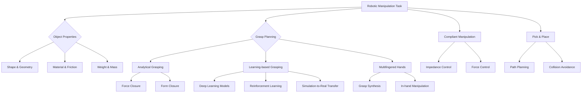

import Tabs from '@theme/Tabs';
import TabItem from '@theme/TabItem';

## Learning Outcomes

After completing this chapter, you will be able to:
1. Analyze the fundamental principles of robotic manipulation and grasping.
2. Design and implement analytical grasp planning algorithms for various object types.
3. Apply learning-based grasping techniques using machine learning models.
4. Evaluate grasp stability and quality metrics for different robotic hands.
5. Integrate perception and manipulation systems for object manipulation tasks.
6. Implement multi-fingered hand control for complex manipulation scenarios.
7. Assess challenges in compliant manipulation and adaptive grasping.
8. Design pick-and-place operations in both simulation and real-world environments.

## Gherkin Specifications

<Tabs
  defaultValue="spec1"
  values={[
    {label: 'Specification 1', value: 'spec1'},
    {label: 'Specification 2', value: 'spec2'},
    {label: 'Specification 3', value: 'spec3'},
    {label: 'Specification 4', value: 'spec4'},
    {label: 'Specification 5', value: 'spec5'},
  ]}>
  <TabItem value="spec1">

### Given a manipulator robot, When attempting to grasp an object, Then it should identify graspable points on the object surface

```gherkin
Given a robotic manipulator with a gripper positioned near an object
When the system analyzes the object's geometry and surface properties
Then it determines optimal grasp points that ensure stable grasping
```

  </TabItem>
  <TabItem value="spec2">

### Given grasp points identified, When executing a grasp, Then the robot should achieve stable contact without object slippage

```gherkin
Given a set of calculated grasp points on an object
When the manipulator approaches and closes its gripper around the object
Then the grasp should maintain sufficient friction to prevent object slippage during movement
```

  </TabItem>
  <TabItem value="spec3">

### Given a learned grasp model, When presented with novel objects, Then it should predict successful grasp points

```gherkin
Given a trained machine learning model for grasp prediction
When presented with an unseen object in a cluttered environment
Then the system should predict feasible grasp points with high success probability
```

  </TabItem>
  <TabItem value="spec4">

### Given a multi-fingered robotic hand, When manipulating an object, Then it should execute dexterous manipulation

```gherkin
Given a robot hand with multiple fingers and tactile sensors
When executing manipulation tasks requiring repositioning of the object
Then the system should perform in-hand manipulation to achieve the desired object pose
```

  </TabItem>
  <TabItem value="spec5">

### Given a compliant manipulation task, When interacting with the environment, Then it should apply appropriate forces

```gherkin
Given a manipulation task requiring compliance (e.g. inserting a peg into a hole)
When the robot interacts with the environment
Then it should adapt its stiffness and apply appropriate forces for the task
```

  </TabItem>
</Tabs>

## Theory & Intuition

Robotic manipulation and grasping form the cornerstone of dexterous robot interaction with the physical world. Think of your own hand: when you need to pick up a coffee cup, your brain instantly evaluates its shape, weight, fragility, and handle position to determine the best way to grasp it. Similarly, robotic manipulation systems must intelligently perceive objects and plan how to interact with them.

The fundamental challenge in robotic manipulation lies in the complex interaction between the robot, the object being manipulated, and the environment. Unlike simple point-to-point movement, manipulation requires careful consideration of contact mechanics, friction, stability, and the ability to reconfigure object poses through controlled motion.

Grasping is not just about closing fingers around an object—it's about establishing stable contact points that allow for controlled manipulation. The quality of a grasp depends on multiple factors including the grasp type (e.g., precision vs. power grasp), the geometric relationship between fingertips and object surfaces, friction coefficients, and the intended manipulation task.

Modern approaches to manipulation combine classical analytical methods with data-driven machine learning techniques. While analytical methods provide mathematical guarantees under certain assumptions, learning-based methods can handle complex, real-world scenarios where traditional approaches fail due to modeling inaccuracies or environmental uncertainties.

## Core Concepts

<Tabs
  defaultValue="diagram"
  values={[
    {label: 'Mermaid Diagram', value: 'diagram'},
    {label: 'Concept Table', value: 'table'},
  ]}>
  <TabItem value="diagram">



  </TabItem>
  <TabItem value="table">

| Concept | Definition | Application |
|--------|------------|-------------|
| Force Closure | Ability of a grasp to maintain contact under any external wrench | Ensuring stable grasps for object manipulation |
| Form Closure | Geometric condition for stable grasp without external forces | Passive grasp stability analysis |
| Grasp Quality Metrics | Quantitative measures of grasp stability and dexterity | Evaluating and comparing different grasp configurations |
| In-hand Manipulation | Repositioning objects using finger motions while maintaining grasp | Dextrous manipulation without releasing objects |
| Compliance Control | Controlling robot impedance during contact tasks | Safe interaction with uncertain environments |
| Tactile Sensing | Sensing contact forces, slip, and texture | Feedback for grasp adjustment and exploration |

  </TabItem>
</Tabs>

## Hands-On Labs

<Tabs
  defaultValue="lab1"
  values={[
    {label: 'Lab 1: Analytical Grasp Planning', value: 'lab1'},
    {label: 'Lab 2: Learning-based Grasping', value: 'lab2'},
    {label: 'Lab 3: Simulation-to-Real Transfer', value: 'lab3'},
  ]}>
  <TabItem value="lab1">

### Lab 1: Analytical Grasp Planning with ROS 2

#### Objective
Implement analytical grasp planning algorithms to compute stable grasp configurations for simple geometric objects.

#### Prerequisites
- Basic understanding of ROS 2 and TF transforms
- Knowledge of geometry_msgs and sensor_msgs
- Familiarity with robot simulation (Gazebo/Isaac Sim)

#### Steps
1. Set up the simulation environment with a robotic manipulator (e.g., UR5 or Panda arm) and simple objects
2. Implement a grasp planner that computes grasp poses based on object geometry
3. Create a grasp quality evaluator using force closure criteria
4. Test the grasp planner with various geometric objects (cubes, cylinders, spheres)

#### Code Example
```python
#!/usr/bin/env python3
import rclpy
from rclpy.node import Node
from geometry_msgs.msg import Pose, Point
from sensor_msgs.msg import PointCloud2
import numpy as np
from scipy.spatial.transform import Rotation as R

class AnalyticalGraspPlanner(Node):
    def __init__(self):
        super().__init__('analytical_grasp_planner')
        self.subscription = self.create_subscription(
            PointCloud2,
            '/object_pointcloud',
            self.pointcloud_callback,
            10)
        self.grasp_publisher = self.create_publisher(Pose, '/grasp_pose', 10)
        
    def pointcloud_callback(self, msg):
        # Process point cloud to find grasp candidates
        grasp_poses = self.compute_grasps_from_pointcloud(msg)
        
        for grasp_pose in grasp_poses:
            quality = self.evaluate_grasp_quality(grasp_pose)
            if quality > 0.8:  # Threshold for good grasp
                self.grasp_publisher.publish(grasp_pose)
                break  # Execute first good grasp
    
    def compute_grasps_from_pointcloud(self, pointcloud_msg):
        # Convert pointcloud to numpy array (simplified)
        # In practice, use PCL or similar for robust processing
        points = self.pointcloud_to_array(pointcloud_msg)
        
        # Find surface normals and potential grasp points
        grasp_poses = []
        for i in range(0, len(points), 10):  # Sample points
            point = points[i]
            # Compute grasp pose perpendicular to surface normal
            grasp_pose = self.compute_grasp_pose(point)
            grasp_poses.append(grasp_pose)
        
        return grasp_poses
    
    def compute_grasp_pose(self, surface_point):
        # Simplified grasp pose computation
        pose = Pose()
        pose.position = Point(x=surface_point[0], y=surface_point[1], z=surface_point[2])
        
        # Simple grasp orientation (perpendicular to surface)
        # In practice, compute from surface normal
        rotation = R.from_euler('xyz', [0, 0, 0])
        pose.orientation.x = rotation.as_quat()[0]
        pose.orientation.y = rotation.as_quat()[1]
        pose.orientation.z = rotation.as_quat()[2]
        pose.orientation.w = rotation.as_quat()[3]
        
        return pose
        
    def evaluate_grasp_quality(self, pose):
        # Simplified grasp quality evaluation
        # In practice, compute force closure or other metrics
        return np.random.random()  # Random quality for simulation
        
def main(args=None):
    rclpy.init(args=args)
    grasp_planner = AnalyticalGraspPlanner()
    
    try:
        rclpy.spin(grasp_planner)
    except KeyboardInterrupt:
        pass
    finally:
        grasp_planner.destroy_node()
        rclpy.shutdown()

if __name__ == '__main__':
    main()
```

#### Expected Outcome
The robot should compute and execute stable grasp configurations on simple geometric objects based on analytical models of the objects' geometry.

  </TabItem>
  <TabItem value="lab2">

### Lab 2: Learning-based Grasping with NVIDIA Isaac Sim

#### Objective
Implement a deep learning-based grasping system using NVIDIA Isaac Sim and transfer learning to real hardware.

#### Prerequisites
- NVIDIA Isaac Sim installation
- Understanding of ROS 2 and machine learning concepts
- Basic knowledge of PyTorch/TensorFlow

#### Steps
1. Set up NVIDIA Isaac Sim with a robotic manipulator and object models
2. Create a dataset of grasp attempts with associated success labels
3. Train a convolutional neural network to predict grasp quality
4. Deploy the trained model in simulation and test real-world transfer

#### Code Example
```python
#!/usr/bin/env python3
import torch
import torch.nn as nn
import numpy as np
from torchvision import transforms
from PIL import Image

class GraspQualityNet(nn.Module):
    def __init__(self, num_classes=2):  # binary classification (success/failure)
        super(GraspQualityNet, self).__init__()
        
        # Convolutional layers for image processing
        self.conv_layers = nn.Sequential(
            nn.Conv2d(4, 32, kernel_size=5, padding=2),  # 4 channels: RGB + depth
            nn.ReLU(inplace=True),
            nn.MaxPool2d(kernel_size=2, stride=2),
            
            nn.Conv2d(32, 64, kernel_size=5, padding=2),
            nn.ReLU(inplace=True),
            nn.MaxPool2d(kernel_size=2, stride=2),
            
            nn.Conv2d(64, 128, kernel_size=3, padding=1),
            nn.ReLU(inplace=True),
            nn.AdaptiveAvgPool2d((4, 4))
        )
        
        # Fully connected layers for grasping decision
        self.fc_layers = nn.Sequential(
            nn.Linear(128 * 4 * 4, 512),
            nn.ReLU(inplace=True),
            nn.Dropout(0.5),
            nn.Linear(512, 128),
            nn.ReLU(inplace=True),
            nn.Linear(128, num_classes)
        )
    
    def forward(self, x, grasp_params):
        x = self.conv_layers(x)
        x = x.view(x.size(0), -1)
        
        # Concatenate with grasp parameters
        x = torch.cat((x, grasp_params), dim=1)
        
        x = self.fc_layers(x)
        return x

class GraspPredictionNode:
    def __init__(self):
        # Load pre-trained model
        self.model = GraspQualityNet()
        self.model.load_state_dict(torch.load('grasp_model.pth'))
        self.model.eval()
        
        # Transformation pipeline
        self.transform = transforms.Compose([
            transforms.Resize((64, 64)),
            transforms.ToTensor(),
        ])
    
    def predict_grasp_quality(self, image, grasp_pose):
        # Process image and grasp parameters
        img_tensor = self.transform(image).unsqueeze(0)
        
        # Convert grasp pose to feature vector
        grasp_params = self.pose_to_features(grasp_pose)
        grasp_tensor = torch.tensor(grasp_params, dtype=torch.float32).unsqueeze(0)
        
        # Get prediction
        with torch.no_grad():
            output = self.model(img_tensor, grasp_tensor)
            probabilities = torch.softmax(output, dim=1)
            success_prob = probabilities[0][1].item()  # probability of success
        
        return success_prob
    
    def pose_to_features(self, pose):
        # Convert pose to feature vector [x, y, z, qx, qy, qz, qw]
        features = [
            pose.position.x, pose.position.y, pose.position.z,
            pose.orientation.x, pose.orientation.y, 
            pose.orientation.z, pose.orientation.w
        ]
        return features

# Example usage
def main():
    grasp_predictor = GraspPredictionNode()
    
    # Simulated image and grasp pose
    # In practice, these would come from perception system
    fake_image = Image.new('RGB', (64, 64), color='red')
    fake_grasp_pose = type('Pose', (), {})()
    fake_grasp_pose.position = type('Point', (), {})()
    fake_grasp_pose.position.x = 0.5
    fake_grasp_pose.position.y = 0.0
    fake_grasp_pose.position.z = 0.1
    fake_grasp_pose.orientation = type('Quaternion', (), {})()
    fake_grasp_pose.orientation.x = 0.0
    fake_grasp_pose.orientation.y = 0.0
    fake_grasp_pose.orientation.z = 0.0
    fake_grasp_pose.orientation.w = 1.0
    
    success_prob = grasp_predictor.predict_grasp_quality(fake_image, fake_grasp_pose)
    print(f"Predicted grasp success probability: {success_prob:.3f}")

if __name__ == "__main__":
    main()
```

#### Expected Outcome
A trained neural network that can predict grasp success probability for new object configurations with reasonable accuracy (>70% on test set).

  </TabItem>
  <TabItem value="lab3">

### Lab 3: Multi-fingered Hand Control and In-hand Manipulation

#### Objective
Implement control strategies for multi-fingered hands to perform in-hand manipulation tasks.

#### Prerequisites
- Multi-fingered hand simulation (e.g., Allegro Hand or Shadow Hand)
- Understanding of joint position/force control
- Knowledge of kinematics (forward and inverse)

#### Steps
1. Set up a multi-fingered hand simulation in Gazebo
2. Implement joint position controllers for finger movements
3. Create a manipulation controller that can reposition objects in-hand
4. Test with different objects and manipulation tasks

#### Code Example
```python
#!/usr/bin/env python3
import rclpy
from rclpy.node import Node
from std_msgs.msg import Float64MultiArray
from sensor_msgs.msg import JointState
import numpy as np

class MultiFingeredHandController(Node):
    def __init__(self):
        super().__init__('multi_fingered_hand_controller')
        
        # Publishers for joint commands
        self.joint_cmd_publisher = self.create_publisher(
            Float64MultiArray, 
            '/hand_joint_commands', 
            10
        )
        
        # Subscriber for current joint states
        self.joint_state_subscriber = self.create_subscription(
            JointState,
            '/hand_joint_states',
            self.joint_state_callback,
            10
        )
        
        # Initialize joint positions
        self.current_joint_positions = [0.0] * 16  # 16 joints for Allegro hand
        self.target_joint_positions = [0.0] * 16
        
        # Timer for control loop
        self.timer = self.create_timer(0.01, self.control_loop)  # 100Hz
        
    def joint_state_callback(self, msg):
        self.current_joint_positions = list(msg.position)
    
    def execute_grasp(self, grasp_type='power'):
        """Execute a specific grasp type"""
        if grasp_type == 'power':
            # Power grasp - fingers wrap around object
            self.target_joint_positions = [
                0.5, 0.8, 0.8, 0.8,  # Thumb
                0.0, 0.8, 0.8, 0.8,  # Index
                0.0, 0.8, 0.8, 0.8,  # Middle
                0.0, 0.8, 0.8, 0.8   # Ring
            ]
        elif grasp_type == 'precision':
            # Precision grasp - fingertips oppose each other
            self.target_joint_positions = [
                0.2, 0.5, 0.5, 0.3,  # Thumb
                0.2, 0.7, 0.7, 0.3,  # Index
                0.0, 0.0, 0.0, 0.0,  # Middle
                0.0, 0.0, 0.0, 0.0   # Ring
            ]
    
    def in_hand_manipulation(self, object_repositioning='rotate'):
        """Perform in-hand manipulation"""
        if object_repositioning == 'rotate':
            # Rotate object by slightly adjusting finger positions
            # This is a simplified approach; in reality, more complex coordination is needed
            base_positions = self.current_joint_positions
            
            # Apply small adjustments to achieve rotation
            adjustments = [
                0.05, 0.0, 0.0, 0.0,  # Thumb
                -0.05, 0.0, 0.0, 0.0,  # Index
                0.0, 0.0, 0.0, 0.0,    # Middle
                0.0, 0.0, 0.0, 0.0     # Ring
            ]
            
            self.target_joint_positions = [
                pos + adj for pos, adj in zip(base_positions, adjustments)
            ]
    
    def control_loop(self):
        """Send joint commands to achieve target positions"""
        msg = Float64MultiArray()
        msg.data = self.target_joint_positions
        self.joint_cmd_publisher.publish(msg)

def main(args=None):
    rclpy.init(args=args)
    hand_controller = MultiFingeredHandController()
    
    # Execute a precision grasp followed by in-hand manipulation
    hand_controller.execute_grasp('precision')
    
    # Wait a bit for grasp to complete
    rclpy.spin_once(hand_controller, timeout_sec=2.0)
    
    # Now perform in-hand manipulation to rotate the object
    hand_controller.in_hand_manipulation('rotate')
    
    try:
        rclpy.spin(hand_controller)
    except KeyboardInterrupt:
        pass
    finally:
        hand_controller.destroy_node()
        rclpy.shutdown()

if __name__ == '__main__':
    main()
```

#### Expected Outcome
The multi-fingered hand should successfully execute precision grasps and perform simple in-hand manipulation tasks like rotating objects.

  </TabItem>
</Tabs>

## Sim-to-Real Notes

When transferring manipulation and grasping systems from simulation to real hardware, several factors become critical:

1. **Model Accuracy**: Simulation models must accurately represent real-world physics, including friction, compliance, and sensor noise. Use system identification techniques to tune simulation parameters to match real robot behavior.

2. **Sensor Calibration**: Tactile sensors, cameras, and other perception systems need careful calibration. For grasping, even small errors in object pose estimation can lead to grasp failures.

3. **Domain Randomization**: To improve sim-to-real transfer, train your grasp planning algorithms with randomized physical parameters (friction coefficients, object poses, lighting conditions, etc.) to increase robustness.

4. **Real-time Performance**: Ensure algorithms run efficiently on embedded hardware. Real manipulation requires rapid response to maintain stability during contact interaction.

5. **Safety Considerations**: Implement velocity and torque limits to prevent damage during contact. Always test on non-fragile objects first.

For the Jetson Orin Nano platform, optimize neural networks using TensorRT for efficient inference. For the Unitree robots with manipulator arms, consider the limited workspace and payload constraints when planning manipulation tasks.

## Multiple Choice Questions

<Tabs
  defaultValue="mcq1"
  values={[
    {label: 'Q1-3', value: 'mcq1'},
    {label: 'Q4-6', value: 'mcq2'},
    {label: 'Q7-9', value: 'mcq3'},
    {label: 'Q10-12', value: 'mcq4'},
    {label: 'Q13-15', value: 'mcq5'},
  ]}>
  <TabItem value="mcq1">

1. **What is the primary difference between force closure and form closure in robotic grasping?**
   - A) Force closure requires actuation while form closure does not
   - B) Force closure is geometric while form closure is dynamic
   - C) Force closure can resist any external wrench through applied forces, form closure through geometry alone
   - D) Form closure requires friction while force closure does not

   **Correct Answer: C** - Force closure can resist any external wrench through applied forces, form closure through geometric constraint alone. This distinction is crucial for understanding grasp stability.

2. **Which type of grasp is typically used for delicate objects requiring high precision?**
   - A) Power grasp
   - B) Cylindrical grasp
   - C) Precision grasp
   - D) Spherical grasp

   **Correct Answer: C** - Precision grasp uses fingertips and is ideal for delicate objects requiring fine manipulation.

3. **What is the primary purpose of in-hand manipulation?**
   - A) To move the entire robot arm
   - B) To reposition objects using only finger motions while maintaining grasp
   - C) To increase grip force
   - D) To switch between different objects

   **Correct Answer: B** - In-hand manipulation allows repositioning objects without releasing them, enabling complex manipulation tasks.

  </TabItem>
  <TabItem value="mcq2">

4. **Which sensory feedback is most critical for detecting slip during grasping?**
   - A) Visual feedback
   - B) Tactile sensors
   - C) Joint encoders
   - D) Accelerometers

   **Correct Answer: B** - Tactile sensors detect micro-movements and vibrations associated with slip, which is critical for maintaining grasp stability.

5. **What does "dexterity" refer to in robotic manipulation?**
   - A) Speed of movement
   - B) Ability to handle a wide range of objects and tasks
   - C) Maximum payload capacity
   - D) Repeatability accuracy

   **Correct Answer: B** - Dexterity refers to the ability to perform various manipulation tasks with different objects and environments.

6. **Which approach is most suitable for grasping unknown objects with complex geometries?**
   - A) Analytical methods only
   - B) Learning-based methods with large training datasets
   - C) Fixed trajectory planning
   - D) Manual programming for each object

   **Correct Answer: B** - Learning-based methods can generalize to novel objects better than purely analytical approaches.

  </TabItem>
  <TabItem value="mcq3">

7. **What is the primary advantage of compliant manipulation?**
   - A) Increased rigidity
   - B) Ability to safely interact with uncertain environments
   - C) Maximum speed
   - D) Reduced computational requirements

   **Correct Answer: B** - Compliant manipulation allows robots to adapt to uncertainties in the environment and safely interact with fragile objects.

8. **Which grasp type would be most appropriate for lifting a wine glass?**
   - A) Power grasp
   - B) Lateral grasp
   - C) Circular grasp
   - D) Precision grasp

   **Correct Answer: C** - The circular grasp (or cylindrical grasp) is ideal for holding cylindrical objects like wine glasses.

9. **What is the most important factor in achieving successful grasp transfer from simulation to reality?**
   - A) Identical rendering
   - B) Accurate physical properties modeling and domain randomization
   - C) Same lighting conditions
   - D) Identical object materials

   **Correct Answer: B** - Accurate modeling of physical properties combined with domain randomization is key for effective sim-to-real transfer.

  </TabItem>
  <TabItem value="mcq4">

10. **In multi-fingered hand control, what is "force distribution"?**
    - A) How forces are allocated among the fingers
    - B) How force is applied to the object
    - C) How force is measured by sensors
    - D) How force limits are set

    **Correct Answer: A** - Force distribution refers to how the total required force is allocated among individual fingers to maintain grasp stability.

11. **Which technique is used to detect if an object has slipped from the gripper?**
    - A) Velocity tracking
    - B) Joint position monitoring
    - C) Tactile sensing or visual tracking
    - D) Torque monitoring

    **Correct Answer: C** - Tactile sensing or visual tracking can detect object slip, which is critical for grasp maintenance.

12. **What is the main challenge in dexterous manipulation with underactuated hands?**
    - A) Too many actuators to control
    - B) Limited ability to achieve arbitrary finger configurations
    - C) High cost
    - D) Heavy weight

    **Correct Answer: B** - Underactuated hands have fewer actuators than degrees of freedom, limiting their ability to achieve arbitrary finger configurations.

  </TabItem>
  <TabItem value="mcq5">

13. **Which learning approach is most effective for robotic grasping in highly variable environments?**
    - A) Supervised learning only
    - B) Reinforcement learning with simulation pre-training
    - C) Rule-based programming
    - D) Pure analytical methods

    **Correct Answer: B** - Reinforcement learning with simulation pre-training combines the benefits of both model-free and model-based approaches.

14. **What is the purpose of grasp quality metrics?**
    - A) To measure the robot's speed
    - B) To evaluate the stability and dexterity of a grasp configuration
    - C) To calibrate sensors
    - D) To determine object weight

    **Correct Answer: B** - Grasp quality metrics evaluate how stable and dexterous a grasp configuration is under various conditions.

15. **Which of the following is NOT considered an advantage of learning-based grasping over analytical methods?**
    - A) Ability to handle unknown objects
    - B) Better performance in cluttered environments
    - C) Mathematical guarantees of grasp stability
    - D) Adaptability to real-world uncertainties

    **Correct Answer: C** - Learning-based methods typically do not provide mathematical guarantees like analytical methods do, which is actually a disadvantage in some safety-critical applications.

  </TabItem>
</Tabs>

## Further Reading

<Tabs
  defaultValue="ref1"
  values={[
    {label: 'Research Papers', value: 'ref1'},
    {label: 'Books', value: 'ref2'},
    {label: 'Tutorials', value: 'ref3'},
    {label: 'Tools & Frameworks', value: 'ref4'},
  ]}>
  <TabItem value="ref1">

### Research Papers

1. [Grasp Synthesis of Novel Objects using New Deep Learning Approaches](https://arxiv.org/abs/2005.13063) - A comprehensive review of deep learning methods for robotic grasping of novel objects.

2. [A Survey on Robotic Grasping: State-of-the-Art and Future Directions](https://arxiv.org/abs/2103.04332) - An in-depth survey covering both analytical and learning-based approaches to robotic grasping.

3. [Dexterity from Compliances: A Perspective](https://ieeexplore.ieee.org/document/8972481) - Discusses the role of compliance in achieving dexterous manipulation capabilities.

4. [Learning Synergies for Robotic Grasping from In-Hand Manipulation](https://ieeexplore.ieee.org/document/9135958) - Explores how robots can learn effective grasping strategies through self-supervised exploration.

5. [Real-time Grasp Synthesis for Unknown Objects](https://journals.sagepub.com/doi/10.1177/0278364919843486) - Presents methods for rapid grasp planning of unknown objects suitable for real-time applications.

  </TabItem>
  <TabItem value="ref2">

### Books

1. [Handbook of Robotics](https://link.springer.com/book/10.1007/978-3-319-30756-8) by Siciliano and Khatib - Comprehensive coverage of all aspects of robotics including a dedicated section on manipulation and grasping.

2. [Robotics: Control, Sensing, Vision, and Intelligence](https://www.mheducation.com/highered/product/robotics-control-sensing-vision-and-intelligence-fu-gonzalez/M9780070226257.html) by Fu, Gonzalez, and Lee - Classic text with detailed treatment of manipulator control and sensing.

3. [Introduction to Robotics: Mechanics and Control](https://www.pearson.com/en-us/subject-catalog/p/introduction-to-robotics/P200000003127/9780134062451) by John J. Craig - Excellent introduction to robot kinematics, dynamics, and control relevant to manipulation.

4. [Springer Handbook of Robotics](https://www.springer.com/gp/book/9783319308720) - Second edition with updated content on modern manipulation approaches including machine learning.

5. [Force and Touch Feedback for Teleoperators and Robots](https://mitpress.mit.edu/books/force-and-touch-feedback-teleoperators-and-robots) - Focuses on haptic feedback and compliant manipulation techniques.

  </TabItem>
  <TabItem value="ref3">

### Tutorials

1. [ROS 2 Manipulation Tutorials](https://navigation.ros.org/tutorials/index.html) - Step-by-step tutorials for implementing manipulation capabilities with ROS 2.

2. [NVIDIA Isaac Sim Manipulation Examples](https://docs.nvidia.com/isaac/packages/manipulation/index.html) - Practical examples for implementing manipulation tasks in NVIDIA Isaac Sim.

3. [Grasp Planning with MoveIt](https://moveit.picknik.ai/main/doc/tutorials/grasping/grasping_tutorial.html) - Tutorial on using MoveIt's grasp planning capabilities.

4. [Learning-Based Robotic Grasping with PyTorch](https://pytorch-robotics.readthedocs.io/) - Practical tutorial on implementing learning-based grasping with PyTorch.

5. [Gazebo Manipulation Simulation Course](https://classic.gazebosim.org/tutorials?cat=guided_b&tut=guided_b2) - Comprehensive course on setting up manipulation simulations in Gazebo.

  </TabItem>
  <TabItem value="ref4">

### Tools & Frameworks

1. [Graspit! Simulator](http://graspit-simulator.github.io/) - Open-source grasp analysis and planning simulator for robotic hands.

2. [OpenRAVE](http://openrave.org/) - Open-source robotics simulation environment with grasp planning capabilities.

3. [MoveIt](https://moveit.ros.org/) - Robot manipulation framework for ROS 2 with grasp planning capabilities.

4. [PyRobot](https://pyrobot.org/) - Python library for robot manipulation research with support for multiple robot platforms.

5. [Franka Control Interface](https://frankaemika.github.io/docs/) - Low-level interface for controlling Franka Emika robotic arms with precise manipulation capabilities.

  </TabItem>
</Tabs>