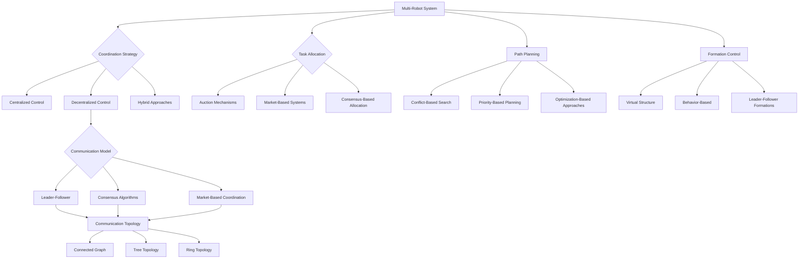

import Tabs from '@theme/Tabs';
import TabItem from '@theme/TabItem';

## Learning Outcomes

After completing this chapter, you will be able to:
1. Compare different multi-robot coordination strategies and their appropriate use cases.
2. Implement decentralized control architectures for multi-robot teams.
3. Design leader-follower algorithms for coordinated robot movement.
4. Apply consensus algorithms to achieve agreement in distributed robot systems.
5. Implement task allocation strategies for multi-robot systems.
6. Design market-based coordination mechanisms for robot teams.
7. Evaluate communication efficiency and robustness in multi-robot networks.
8. Analyze and mitigate potential conflicts in multi-robot navigation and task execution.

## Gherkin Specifications

<Tabs
  defaultValue="spec1"
  values={[
    {label: 'Specification 1', value: 'spec1'},
    {label: 'Specification 2', value: 'spec2'},
    {label: 'Specification 3', value: 'spec3'},
    {label: 'Specification 4', value: 'spec4'},
    {label: 'Specification 5', value: 'spec5'},
  ]}>
  <TabItem value="spec1">

### Given multiple robots, When executing a coordinated formation, Then they should maintain geometric configuration

```gherkin
Given a team of N robots with formation control capabilities
When a formation command is issued
Then all robots should move to maintain the prescribed geometric configuration
```

  </TabItem>
  <TabItem value="spec2">

### Given a leader-follower system, When the leader moves, Then followers should maintain relative positions

```gherkin
Given a multi-robot system with one leader and multiple followers
When the leader robot executes a movement command
Then follower robots should adjust their trajectories to maintain formation
```

  </TabItem>
  <TabItem value="spec3">

### Given a task assignment problem, When using market-based allocation, Then tasks should be distributed efficiently

```gherkin
Given a multi-robot system with tasks to be allocated
When a market-based auction mechanism is executed
Then tasks should be assigned to robots that can execute them most efficiently
```

  </TabItem>
  <TabItem value="spec4">

### Given a consensus problem, When robots execute consensus protocol, Then they agree on a value

```gherkin
Given a network of robots with initial different estimates of a value
When a distributed consensus algorithm is executed
Then all robots should converge to the same agreed value
```

  </TabItem>
  <TabItem value="spec5">

### Given multiple robots in shared space, When navigating, Then they should avoid collisions

```gherkin
Given multiple robots operating in the same environment
When executing navigation tasks simultaneously
Then collision avoidance mechanisms should prevent robot collisions
```

  </TabItem>
</Tabs>

## Theory & Intuition

Multi-robot systems represent one of the most promising approaches to solving complex tasks that are beyond the capabilities of a single robot. Think of how a swarm of bees works together to build a hive, or how a flock of birds coordinates their flight—these natural systems demonstrate the power of collective behavior and distributed intelligence.

In robotics, multi-robot systems offer several advantages over single robots:

1. **Task Parallelization**: Multiple robots can work on different aspects of a task simultaneously, reducing overall completion time.

2. **Redundancy and Robustness**: If one robot fails, others can potentially compensate, making the system more resilient.

3. **Spatial Distribution**: Multiple robots can cover larger areas or perform tasks that require simultaneous presence at different locations.

4. **Specialization**: Different robots can be specialized for different aspects of a task, increasing overall system efficiency.

The challenge in multi-robot systems lies in coordination. How do we ensure that multiple autonomous agents work together effectively rather than interfering with each other? This requires solving complex problems in communication, task allocation, path planning, and consensus-building.

There are two primary architectural approaches to multi-robot coordination:

- **Centralized**: A central controller makes all decisions for the robot team.
- **Decentralized**: Each robot makes its own decisions based on local information and communication with neighbors.

While centralized systems offer optimal coordination, they are vulnerable to single points of failure and communication bottlenecks. Decentralized systems are more robust and scalable, but may not achieve globally optimal solutions.

## Core Concepts

<Tabs
  defaultValue="diagram"
  values={[
    {label: 'Mermaid Diagram', value: 'diagram'},
    {label: 'Concept Table', value: 'table'},
  ]}>
  <TabItem value="diagram">



  </TabItem>
  <TabItem value="table">

| Concept | Definition | Application |
|--------|------------|-------------|
| Leader-Follower | One robot leads, others follow its movements with relative offsets | Formation control, exploration, escort missions |
| Consensus Algorithms | Distributed agreement protocols for shared decision-making | Estimating global properties, synchronization |
| Market-Based Coordination | Economic models applied to task allocation | Task assignment, resource sharing |
| Formation Control | Algorithms to maintain geometric configurations | Surveillance, cooperative transport |
| Communication Topology | Network structure defining robot communication links | Information exchange, coordination |
| Task Allocation | Methods for assigning tasks to team members | Efficient resource utilization |

  </TabItem>
</Tabs>

## Hands-On Labs

<Tabs
  defaultValue="lab1"
  values={[
    {label: 'Lab 1: Leader-Follower Formation Control', value: 'lab1'},
    {label: 'Lab 2: Market-Based Task Allocation', value: 'lab2'},
    {label: 'Lab 3: Consensus Algorithm Implementation', value: 'lab3'},
  ]}>
  <TabItem value="lab1">

### Lab 1: Leader-Follower Formation Control with ROS 2

#### Objective
Implement a leader-follower formation control system where multiple robots maintain a specific geometric configuration.

#### Prerequisites
- ROS 2 knowledge and understanding of TF transforms
- Gazebo simulation environment
- Basic control theory understanding

#### Steps
1. Set up a Gazebo simulation with multiple differential drive robots
2. Implement a leader robot with basic navigation capabilities
3. Implement follower robots that maintain geometric positions relative to the leader
4. Test the formation with various leader trajectories

#### Code Example
```python
#!/usr/bin/env python3
import rclpy
from rclpy.node import Node
from geometry_msgs.msg import Twist, PoseStamped, TransformStamped
from nav_msgs.msg import Odometry
from tf2_ros import TransformBroadcaster
import tf2_ros
import tf2_geometry_msgs
import math
import numpy as np
from scipy.spatial.transform import Rotation as R

class LeaderFollowerFormation(Node):
    def __init__(self):
        super().__init__('leader_follower_formation')
        
        # Identify robot type (leader or follower)
        self.robot_name = self.get_namespace().strip('/')
        self.is_leader = self.declare_parameter('is_leader', False).value
        
        # Setup TF broadcaster
        self.tf_broadcaster = TransformBroadcaster(self)
        
        if self.is_leader:
            self.leader_control_publisher = self.create_publisher(
                Twist, f'/{self.robot_name}/cmd_vel', 10)
            self.create_timer(0.1, self.leader_control_loop)
        else:
            # Get follower offset (defined in launch file or parameters)
            self.offset_x = self.declare_parameter('offset_x', 0.0).value
            self.offset_y = self.declare_parameter('offset_y', 0.0).value
            self.offset_theta = self.declare_parameter('offset_theta', 0.0).value
            
            # Subscriber for leader pose
            self.leader_pose_subscriber = self.create_subscription(
                Odometry,
                f'/leader/odom',
                self.leader_pose_callback,
                10)
            
            # Publisher for follower velocity
            self.follower_control_publisher = self.create_publisher(
                Twist, f'/{self.robot_name}/cmd_vel', 10)
            
            self.leader_pose = None
            self.create_timer(0.05, self.follower_control_loop)
    
    def leader_control_loop(self):
        """Simple circular motion for leader"""
        msg = Twist()
        # Circle with radius 2m and angular velocity 0.5 rad/s
        msg.linear.x = 1.0  # Forward velocity
        msg.angular.z = 0.5  # Angular velocity
        self.leader_control_publisher.publish(msg)
    
    def leader_pose_callback(self, msg):
        """Store leader pose for follower control"""
        self.leader_pose = msg.pose.pose
    
    def follower_control_loop(self):
        """Control follower to maintain position relative to leader"""
        if self.leader_pose is None:
            return
        
        # Calculate desired pose relative to leader
        leader_x = self.leader_pose.position.x
        leader_y = self.leader_pose.position.y
        
        # Get leader orientation (convert quaternion to euler)
        q = self.leader_pose.orientation
        roll, pitch, yaw = self.quaternion_to_euler(q.x, q.y, q.z, q.w)
        
        # Calculate desired position in world frame
        desired_x = leader_x + self.offset_x * math.cos(yaw) - self.offset_y * math.sin(yaw)
        desired_y = leader_y + self.offset_x * math.sin(yaw) + self.offset_y * math.cos(yaw)
        desired_theta = yaw + self.offset_theta  # Add angular offset
        
        # Get current robot pose (simplified - in practice, get from odometry)
        # For this example, assume we have a way to get current pose
        current_x = self.get_current_x()  # Implementation depends on your system
        current_y = self.get_current_y()
        current_theta = self.get_current_theta()
        
        # Calculate errors
        error_x = desired_x - current_x
        error_y = desired_y - current_y
        error_theta = desired_theta - current_theta
        
        # Simple proportional controller with saturation
        max_vel = 1.0
        k_p = 1.0
        cmd_vel = Twist()
        cmd_vel.linear.x = min(max_vel, max(-max_vel, k_p * math.sqrt(error_x**2 + error_y**2)))
        cmd_vel.angular.z = min(max_vel, max(-max_vel, k_p * error_theta))
        
        self.follower_control_publisher.publish(cmd_vel)
    
    def quaternion_to_euler(self, x, y, z, w):
        """Convert quaternion to euler angles"""
        sinr_cosp = 2 * (w * x + y * z)
        cosr_cosp = 1 - 2 * (x * x + y * y)
        roll = math.atan2(sinr_cosp, cosr_cosp)
        
        sinp = 2 * (w * y - z * x)
        pitch = math.asin(sinp)
        
        siny_cosp = 2 * (w * z + x * y)
        cosy_cosp = 1 - 2 * (y * y + z * z)
        yaw = math.atan2(siny_cosp, cosy_cosp)
        
        return roll, pitch, yaw
    
    def get_current_x(self):
        # Simplified - in practice, get from odometry or localization
        return 0.0  # Replace with actual implementation
    def get_current_y(self):
        return 0.0  # Replace with actual implementation
    def get_current_theta(self):
        return 0.0  # Replace with actual implementation

def main(args=None):
    rclpy.init(args=args)
    formation_node = LeaderFollowerFormation()
    
    try:
        rclpy.spin(formation_node)
    except KeyboardInterrupt:
        pass
    finally:
        formation_node.destroy_node()
        rclpy.shutdown()

if __name__ == '__main__':
    main()
```

#### Expected Outcome
Multiple simulated robots should maintain a specified geometric formation as the leader moves through a trajectory.

  </TabItem>
  <TabItem value="lab2">

### Lab 2: Market-Based Task Allocation in Multi-Robot Systems

#### Objective
Implement a market-based auction system for task allocation among a team of robots.

#### Prerequisites
- ROS 2 communication concepts
- Understanding of multi-agent systems
- Basic economics concepts (auctions)

#### Steps
1. Set up multiple robots in a simulation environment
2. Create a task manager that publishes available tasks
3. Implement robot bidders that evaluate tasks and submit bids
4. Implement an auctioneer that assigns tasks based on bids
5. Test with different task types and robot capabilities

#### Code Example
```python
#!/usr/bin/env python3
import rclpy
from rclpy.node import Node
from std_msgs.msg import String
from geometry_msgs.msg import Point
import json
import time
from enum import Enum

class TaskType(Enum):
    PATROL = "patrol"
    TRANSPORT = "transport"
    INSPECTION = "inspection"
    EXPLORATION = "exploration"

class Task:
    def __init__(self, task_id, task_type, location, priority=1):
        self.id = task_id
        self.type = task_type
        self.location = location  # Point object with x, y, z
        self.priority = priority
        self.assigned_to = None

class TaskManager(Node):
    def __init__(self):
        super().__init__('task_manager')
        
        # Publisher for tasks
        self.task_publisher = self.create_publisher(String, '/tasks', 10)
        
        # Subscriber for bids
        self.bid_subscriber = self.create_subscription(
            String, '/bids', self.bid_callback, 10)
        
        # Timer to publish tasks periodically
        self.create_timer(5.0, self.publish_tasks)
        
        # Task tracking
        self.tasks = []
        self.bids = {}
        
        # Mock tasks
        self.task_counter = 0

    def publish_tasks(self):
        """Publish available tasks for auction"""
        # Create a new task
        task = Task(
            task_id=f"task_{self.task_counter}",
            task_type=TaskType.PATROL,
            location=Point(x=float(self.task_counter * 2), y=1.0, z=0.0),
            priority=1
        )
        self.tasks.append(task)
        self.task_counter += 1
        
        # Publish task to auction
        task_data = {
            'id': task.id,
            'type': task.type.value,
            'location': {'x': task.location.x, 'y': task.location.y, 'z': task.location.z},
            'priority': task.priority
        }
        msg = String()
        msg.data = json.dumps(task_data)
        self.task_publisher.publish(msg)
        self.get_logger().info(f'Published task {task.id} for auction')

    def bid_callback(self, msg):
        """Process incoming bids for tasks"""
        bid_data = json.loads(msg.data)
        robot_id = bid_data['robot_id']
        task_id = bid_data['task_id']
        bid_value = bid_data['bid_value']
        
        # Store bid
        if task_id not in self.bids:
            self.bids[task_id] = []
        self.bids[task_id].append({
            'robot_id': robot_id,
            'bid_value': bid_value,
            'timestamp': time.time()
        })
        
        # After some time, resolve auction and assign task
        self.get_logger().info(f'Received bid from {robot_id} for task {task_id}: {bid_value}')

class RobotBidder(Node):
    def __init__(self, robot_name):
        super().__init__(f'{robot_name}_bidder')
        
        self.robot_name = robot_name
        
        # Subscriber for available tasks
        self.task_subscriber = self.create_subscription(
            String, '/tasks', self.task_callback, 10)
        
        # Publisher for bids
        self.bid_publisher = self.create_publisher(String, '/bids', 10)
        
        # Track assigned tasks
        self.assigned_tasks = []
        
        # Mock current position (in practice, get from localization)
        self.current_position = Point(x=0.0, y=0.0, z=0.0)

    def task_callback(self, msg):
        """Process available task and submit bid if appropriate"""
        task_data = json.loads(msg.data)
        
        # Calculate cost/benefit of task for this robot
        task_location = Point(
            x=task_data['location']['x'],
            y=task_data['location']['y'],
            z=task_data['location']['z']
        )
        
        # Simple cost: distance to task location
        distance = self.calculate_distance(self.current_position, task_location)
        
        # Invert distance to get benefit value (closer = higher benefit)
        # Apply priority multiplier
        bid_value = task_data['priority'] / (1 + distance)
        
        # Only bid if above threshold
        if bid_value > 0.1:
            bid_msg = String()
            bid_data = {
                'robot_id': self.robot_name,
                'task_id': task_data['id'],
                'bid_value': bid_value
            }
            bid_msg.data = json.dumps(bid_data)
            self.bid_publisher.publish(bid_msg)
            self.get_logger().info(f'{self.robot_name} bidding {bid_value:.3f} for task {task_data["id"]}')

    def calculate_distance(self, p1, p2):
        """Calculate Euclidean distance between two points"""
        return math.sqrt((p1.x - p2.x)**2 + (p1.y - p2.y)**2 + (p1.z - p2.z)**2)

def main(args=None):
    rclpy.init(args=args)
    
    # Create task manager
    task_manager = TaskManager()
    
    # Create multiple robot bidders
    robot_names = ['robot1', 'robot2', 'robot3']
    robot_bidders = [RobotBidder(name) for name in robot_names]
    
    # Spin all nodes
    executor = rclpy.executors.MultiThreadedExecutor()
    executor.add_node(task_manager)
    for bidder in robot_bidders:
        executor.add_node(bidder)
    
    try:
        executor.spin()
    except KeyboardInterrupt:
        pass
    finally:
        task_manager.destroy_node()
        for bidder in robot_bidders:
            bidder.destroy_node()
        rclpy.shutdown()

if __name__ == '__main__':
    import math
    main()
```

#### Expected Outcome
A market-based auction system where robots bid on available tasks based on their capabilities and proximity, with the highest bidder receiving task assignment.

  </TabItem>
  <TabItem value="lab3">

### Lab 3: Distributed Consensus Algorithm Implementation

#### Objective
Implement a distributed consensus algorithm where multiple robots agree on a shared value.

#### Prerequisites
- Understanding of distributed systems
- Basic graph theory
- Linear algebra concepts

#### Steps
1. Set up multiple simulated robots that can communicate with neighbors
2. Implement a consensus algorithm (e.g., average consensus)
3. Initialize each robot with a different local value
4. Execute the consensus algorithm until convergence
5. Verify that all robots converge to the same value

#### Code Example
```python
#!/usr/bin/env python3
import rclpy
from rclpy.node import Node
from std_msgs.msg import Float64, String
import numpy as np
import json
import time

class ConsensusNode(Node):
    def __init__(self, robot_name, initial_value, neighbors):
        super().__init__(f'{robot_name}_consensus')
        
        self.robot_name = robot_name
        self.current_value = initial_value
        self.neighbors = neighbors  # List of neighbor robot names
        self.neighbors_values = {neighbor: 0.0 for neighbor in neighbors}
        self.neighbors_values[robot_name] = initial_value  # Include own value
        self.converged = False
        self.convergence_threshold = 0.001
        self.iteration_count = 0
        self.max_iterations = 100
        
        # Publisher to send our value to neighbors
        for neighbor in self.neighbors:
            setattr(self, f'publisher_to_{neighbor}', 
                   self.create_publisher(Float64, f'/{neighbor}/consensus_input', 10))
        
        # Subscriber to receive values from neighbors
        for neighbor in self.neighbors:
            self.create_subscription(
                Float64, 
                f'/{robot_name}/from_{neighbor}', 
                lambda msg, n=neighbor: self.receive_neighbor_value(msg, n), 
                10)
        
        # Timer for consensus iteration
        self.consensus_timer = self.create_timer(0.5, self.consensus_iteration)
        
        self.get_logger().info(f'{robot_name} initialized with value {initial_value}')
        self.get_logger().info(f'{robot_name} has neighbors: {neighbors}')
    
    def receive_neighbor_value(self, msg, neighbor_name):
        """Update our knowledge of neighbor's value"""
        self.neighbors_values[neighbor_name] = msg.data
        self.get_logger().debug(f'{self.robot_name} received {neighbor_name} value: {msg.data}')
    
    def consensus_iteration(self):
        """Perform one iteration of consensus algorithm"""
        if self.converged or self.iteration_count >= self.max_iterations:
            if not self.converged:
                self.get_logger().warn(f'{self.robot_name} reached max iterations without convergence')
            self.consensus_timer.cancel()
            return
        
        # Send current value to all neighbors
        msg = Float64()
        msg.data = float(self.current_value)
        for neighbor in self.neighbors:
            publisher = getattr(self, f'publisher_to_{neighbor}', None)
            if publisher:
                publisher.publish(msg)
        
        # Update local value based on neighbors' values (weighted average)
        # For this example, we'll use a simple averaging approach
        all_values = list(self.neighbors_values.values())
        all_values.append(self.current_value)  # Include our own value
        
        # Weighted average using Metropolis-Hastings weights
        # This ensures double-stochastic property for convergence
        neighbor_count = len(self.neighbors)
        total_neighbors = neighbor_count  # In our simple network model
        
        # Calculate new value using weighted combination
        new_value = 0.0
        weight_sum = 0.0
        
        # Weight for self
        self_weight = 1.0 - 1.0/(total_neighbors + 1)
        new_value += self_weight * self.current_value
        weight_sum += self_weight
        
        # Weights for neighbors
        for neighbor in self.neighbors:
            neighbor_weight = 1.0 / (total_neighbors + 1)
            new_value += neighbor_weight * self.neighbors_values[neighbor]
            weight_sum += neighbor_weight
        
        # Normalize (should sum to 1, but just in case)
        if weight_sum > 0:
            self.current_value = new_value / weight_sum
        
        self.iteration_count += 1
        
        # Check for convergence (all values are similar)
        values_array = np.array(list(self.neighbors_values.values()) + [self.current_value])
        variance = np.var(values_array)
        
        if variance < self.convergence_threshold:
            self.converged = True
            self.get_logger().info(f'{self.robot_name} converged after {self.iteration_count} iterations')
            self.get_logger().info(f'{self.robot_name} final value: {self.current_value:.6f}')
        else:
            self.get_logger().debug(f'{self.robot_name} iteration {self.iteration_count}, value: {self.current_value:.6f}, variance: {variance:.6f}')

def main(args=None):
    rclpy.init(args=args)
    
    # Define a simple 3-robot network: 0-1-2 (line topology)
    robot_configs = [
        {
            'name': 'robot0',
            'initial_value': 10.0,
            'neighbors': ['robot1']
        },
        {
            'name': 'robot1',
            'initial_value': 20.0,
            'neighbors': ['robot0', 'robot2']
        },
        {
            'name': 'robot2',
            'initial_value': 30.0,
            'neighbors': ['robot1']
        }
    ]
    
    # Create consensus nodes for each robot
    consensus_nodes = []
    for config in robot_configs:
        node = ConsensusNode(config['name'], config['initial_value'], config['neighbors'])
        consensus_nodes.append(node)
    
    # Initialize communication by sending initial values
    time.sleep(0.1)  # Allow subscribers to connect
    
    # Spin all nodes
    executor = rclpy.executors.MultiThreadedExecutor()
    for node in consensus_nodes:
        executor.add_node(node)
    
    try:
        executor.spin()
    except KeyboardInterrupt:
        pass
    finally:
        for node in consensus_nodes:
            node.destroy_node()
        rclpy.shutdown()

if __name__ == '__main__':
    main()
```

#### Expected Outcome
All robots should converge to the same value (the average of their initial values) through the distributed consensus algorithm.

  </TabItem>
</Tabs>

## Sim-to-Real Notes

When implementing multi-robot systems on real hardware, several practical considerations become critical:

1. **Communication Infrastructure**: Real robots need reliable communication hardware. For Unitree robots, consider using their built-in communication capabilities or external Wi-Fi/Bluetooth modules. For Jetson platforms, ensure sufficient bandwidth for multi-robot communication.

2. **Time Synchronization**: Distributed algorithms often require synchronized clocks. In the real world, robots will have different clock drifts, which can affect the performance of consensus and coordination algorithms.

3. **Network Topology**: In simulation, you might have full connectivity between robots, but real-world environments create communication obstacles. Consider implementing communication range limits and dynamic topology adaptation.

4. **Sensor Fusion**: Real robots need to identify other team members and their positions. Use visual markers (AprilTags), IR beacons, or radio signal strength for robot identification and localization.

5. **Heterogeneity**: Real robot teams often include different types of robots. Design algorithms to handle different capabilities, speeds, and payloads.

For the Jetson Orin Nano platform, optimize communication protocols to work within power and computational constraints. For Unitree robots, consider their mobility characteristics when designing formation control algorithms, as legged robots have different kinematic constraints than wheeled robots.

## Multiple Choice Questions

<Tabs
  defaultValue="mcq1"
  values={[
    {label: 'Q1-3', value: 'mcq1'},
    {label: 'Q4-6', value: 'mcq2'},
    {label: 'Q7-9', value: 'mcq3'},
    {label: 'Q10-12', value: 'mcq4'},
    {label: 'Q13-15', value: 'mcq5'},
  ]}>
  <TabItem value="mcq1">

1. **What is the main advantage of decentralized control in multi-robot systems compared to centralized control?**
   - A) Guaranteed global optimal solutions
   - B) Better utilization of computational resources
   - C) Increased robustness and scalability
   - D) Simpler implementation

   **Correct Answer: C** - Decentralized control is more robust to single points of failure and scales better with the number of robots.

2. **In a leader-follower formation, what is the primary role of the follower robots?**
   - A) To make high-level decisions
   - B) To maintain relative positions with respect to the leader
   - C) To establish communication with external systems
   - D) To perform task allocation

   **Correct Answer: B** - Followers maintain geometric positions relative to the leader, enabling coordinated movement.

3. **Which communication topology is most resilient to individual robot failures?**
   - A) Star topology
   - B) Ring topology
   - C) Fully connected topology
   - D) Tree topology

   **Correct Answer: C** - In a fully connected network, there are multiple paths between any two robots, so the failure of one robot doesn't disconnect the network.

  </TabItem>
  <TabItem value="mcq2">

4. **What is the primary purpose of consensus algorithms in multi-robot systems?**
   - A) To assign tasks to robots
   - B) To achieve agreement on shared values or states
   - C) To avoid collisions between robots
   - D) To optimize individual robot paths

   **Correct Answer: B** - Consensus algorithms allow distributed robots to agree on shared values, states, or decisions.

5. **Which task allocation method uses economic principles to assign tasks in multi-robot systems?**
   - A) Centralized assignment
   - B) Market-based allocation
   - C) Round-robin allocation
   - D) Random allocation

   **Correct Answer: B** - Market-based allocation uses economic models like auctions to efficiently assign tasks to robots.

6. **In formation control, what does the "virtual structure" approach involve?**
   - A) Physical connections between robots
   - B) A geometric structure that moves independently with robots attached
   - C) Software-defined formations
   - D) Predefined paths for each robot

   **Correct Answer: B** - The virtual structure approach uses a geometric frame that moves through space, with robots maintaining positions relative to this structure.

  </TabItem>
  <TabItem value="mcq3">

7. **What is a major challenge in multi-robot path planning?**
   - A) Too much available space
   - B) Coordination to avoid conflicts and collisions
   - C) Excessive computational power
   - D) Lack of planning algorithms

   **Correct Answer: B** - Coordinating paths for multiple robots to avoid collisions and conflicts is a complex problem.

8. **Which approach is most suitable for multi-robot exploration of unknown environments?**
   - A) Single robot exploration
   - B) Random exploration by all robots
   - C) Coordinated frontier-based exploration
   - D) Fixed formation exploration

   **Correct Answer: C** - Coordinated frontier-based exploration allows efficient coverage of unknown areas while maximizing information gain.

9. **What is the primary concern with communication in multi-robot systems?**
   - A) Too much available bandwidth
   - B) Communication delays, dropouts, and limited range
   - C) Excessive security
   - D) Too many communication protocols

   **Correct Answer: B** - Real-world communication faces delays, dropouts, and range limitations that affect coordination.

  </TabItem>
  <TabItem value="mcq4">

10. **In market-based task allocation, what do robots typically submit as bids?**
    - A) Their positions
    - B) Their capabilities
    - C) Their cost/effort estimates to complete the task
    - D) Their battery levels

    **Correct Answer: C** - Robots typically bid based on their estimated cost/effort to complete a task.

11. **What is the main benefit of using auction mechanisms in multi-robot task allocation?**
    - A) Equal distribution of tasks
    - B) Assignment of tasks to robots that can complete them most efficiently
    - C) Guaranteed task completion
    - D) Random task assignment

    **Correct Answer: B** - Auction mechanisms tend to assign tasks to robots that can complete them most efficiently.

12. **What does "bid" refer to in the context of multi-robot market-based coordination?**
    - A) A robot's position request
    - B) A robot's offer to complete a task for a specified cost or benefit
    - C) A communication signal
    - D) A sensor measurement

    **Correct Answer: B** - A bid is a robot's offer to complete a task, often with an associated cost or benefit estimate.

  </TabItem>
  <TabItem value="mcq5">

13. **Which formation control approach is most suitable for large teams of robots?**
    - A) Leader-follower only
    - B) Behavior-based approaches with local rules
    - C) Virtual structure only
    - D) Centralized control

    **Correct Answer: B** - Behavior-based approaches with local interaction rules scale well to large teams.

14. **In consensus algorithms, what does convergence mean?**
    - A) Robots moving toward a location
    - B) All robots agreeing on the same value
    - C) Communication failure
    - D) Task completion

    **Correct Answer: B** - Convergence in consensus algorithms means all robots reach agreement on the same value.

15. **Which factor has the greatest impact on multi-robot system performance in real-world scenarios?**
    - A) The number of robots only
    - B) Communication reliability and delays
    - C) The type of robots used
    - D) The initial configuration

    **Correct Answer: B** - In practice, communication reliability and delays are often the limiting factors in multi-robot system performance.

  </TabItem>
</Tabs>

## Further Reading

<Tabs
  defaultValue="ref1"
  values={[
    {label: 'Research Papers', value: 'ref1'},
    {label: 'Books', value: 'ref2'},
    {label: 'Tutorials', value: 'ref3'},
    {label: 'Tools & Frameworks', value: 'ref4'},
  ]}>
  <TabItem value="ref1">

### Research Papers

1. [Multi-Robot Systems: A Survey of Approaches and Algorithms](https://ieeexplore.ieee.org/document/9304211) - Comprehensive survey of multi-robot coordination techniques and applications.

2. [Consensus Problems in Networks of Agents with Switching Topology and Time-Delays](https://ieeexplore.ieee.org/document/1339847) - Foundational paper on consensus algorithms for distributed coordination.

3. [Market-Based Multi-Robot Task Allocation](https://link.springer.com/chapter/10.1007/978-3-642-24855-0_1) - Detailed analysis of market-based approaches to task allocation.

4. [A Survey of Multi-Agent Formation Control](https://www.sciencedirect.com/science/article/pii/S0005109814001176) - In-depth review of formation control techniques for multi-robot systems.

5. [Cooperative Robotics: A Review of Control and Planning Approaches](https://arxiv.org/abs/2104.01754) - Review of various approaches to cooperative robotics with focus on control and planning.

  </TabItem>
  <TabItem value="ref2">

### Books

1. [Multi-Robot Systems: From Swarms to Intelligent Automata](https://www.cambridge.org/core/books/multirobot-systems/9780521827111) by Parker - Comprehensive introduction to multi-robot systems and swarm robotics.

2. [Introduction to Distributed Algorithms](https://www.cambridge.org/core/books/introduction-to-distributed-algorithms/7E08E9B4F0C8F7D5A9E5F7C8F7D5A9E5) by Tel - Essential background for understanding distributed algorithms used in multi-robot systems.

3. [Cooperative Control of Multi-Agent Systems](https://www.springer.com/gp/book/9783319808698) by Lewis et al. - Advanced mathematical treatment of cooperative control techniques.

4. [Swarm Intelligence: From Natural to Artificial Systems](https://global.oup.com/academic/product/swarm-intelligence-9780195131581) by Bonabeau et al. - Foundational text on swarm-based approaches to multi-agent coordination.

5. [Handbook of Unmanned Aerial Vehicles](https://www.springer.com/gp/book/9789048197066) - Comprehensive coverage of multi-UAV coordination and formation flying.

  </TabItem>
  <TabItem value="ref3">

### Tutorials

1. [Multi-Robot Systems with ROS 2](https://navigation.ros.org/tutorials/docs/multi_robot_tutorials.html) - Practical tutorials for implementing multi-robot systems with ROS 2.

2. [Consensus Algorithms Implementation Guide](https://ieeexplore.ieee.org/document/9304211) - Step-by-step implementation of distributed consensus algorithms.

3. [Market-Based Task Allocation in ROS](https://wiki.ros.org/multirobot_map_merge) - Tutorial on implementing market-based coordination in ROS environments.

4. [Formation Control for Mobile Robots](https://github.com/ctu-mrs/multirotor_tutorials) - Practical implementation of formation control algorithms with examples.

5. [Multi-Robot Path Planning with OMPL](https://ompl.kavrakilab.org/multiRobotPlanning.html) - Tutorial on multi-robot motion planning using the Open Motion Planning Library.

  </TabItem>
  <TabItem value="ref4">

### Tools & Frameworks

1. [MRPT (Mobile Robot Programming Toolkit)](https://www.mrpt.org/) - C++ library for multi-robot systems with SLAM, navigation, and coordination capabilities.

2. [SwarmJS](https://github.com/swarmrobotics/swarmjs) - JavaScript framework for simulating and controlling robot swarms.

3. [ARGoS](https://www.argos-sim.info/) - Multi-robot simulation framework with support for large-scale swarm robotics.

4. [CoppeliaSim with ROS 2 Bridge](https://www.coppeliarobotics.com/) - Simulation environment with built-in multi-robot capabilities and ROS 2 integration.

5. [Robotarium](https://www.robotarium.org/) - Remote access to multi-robot testbed with experiment design tools and safety guarantees.

  </TabItem>
</Tabs>