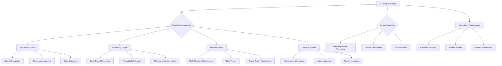

import Tabs from '@theme/Tabs';
import TabItem from '@theme/TabItem';

## Learning Outcomes

After completing this chapter, you will be able to:
1. Design cognitive architectures that combine perception, planning, and action for robotic systems.
2. Implement decision-making algorithms under uncertainty using probabilistic models.
3. Apply multi-objective optimization techniques to balance competing robotic goals.
4. Integrate reasoning and inference mechanisms into robotic control systems.
5. Develop natural language processing capabilities for human-robot interaction.
6. Implement gesture recognition and social robotics principles.
7. Evaluate the effectiveness of AI-driven decision-making in real-world robotic applications.
8. Assess the ethical implications and safety considerations in AI-integrated robotic systems.

## Gherkin Specifications

<Tabs
  defaultValue="spec1"
  values={[
    {label: 'Specification 1', value: 'spec1'},
    {label: 'Specification 2', value: 'spec2'},
    {label: 'Specification 3', value: 'spec3'},
    {label: 'Specification 4', value: 'spec4'},
    {label: 'Specification 5', value: 'spec5'},
  ]}>
  <TabItem value="spec1">

### Given sensor data and a task, When applying AI reasoning, Then robot should make appropriate decisions

```gherkin
Given a robot with sensory inputs and a task to accomplish
When the AI reasoning system processes the information and evaluates options
Then the robot should select the most appropriate action based on its goals and constraints
```

  </TabItem>
  <TabItem value="spec2">

### Given uncertain environment, When making decisions, Then robot should account for uncertainty

```gherkin
Given a robot operating in an uncertain environment with incomplete information
When making decisions about navigation or manipulation
Then the robot should consider various possible states and their probabilities
```

  </TabItem>
  <TabItem value="spec3">

### Given multiple objectives, When optimizing robot behavior, Then it should balance competing goals

```gherkin
Given a robot with multiple objectives (e.g., efficiency, safety, energy conservation)
When planning actions or trajectories
Then the robot should optimize a weighted combination of these objectives
```

  </TabItem>
  <TabItem value="spec4">

### Given human commands, When processing natural language, Then robot should execute appropriate actions

```gherkin
Given a robot with natural language processing capabilities
When receiving commands in natural language
Then the robot should interpret the command and execute the appropriate action sequence
```

  </TabItem>
  <TabItem value="spec5">

### Given social context, When interacting with humans, Then robot should follow social conventions

```gherkin
Given a robot operating in a human-populated environment
When encountering humans during task execution
Then the robot should follow social conventions and etiquette in its interactions
```

  </TabItem>
</Tabs>

## Theory & Intuition

The integration of AI into robotic systems represents the convergence of perception, reasoning, and action in a cohesive framework. Just as humans use their cognitive abilities to interpret sensory information, make decisions, and execute actions, AI-integrated robots combine these elements to achieve complex tasks autonomously.

Think of AI integration as creating a 'brain' for the robot that can process information, reason about situations, make decisions, and adapt to changing circumstances. This brain must work in real-time, integrating inputs from various sensors, considering goals and constraints, and generating appropriate actions - all while handling uncertainty, ambiguity, and the unpredictable nature of real environments.

The field of cognitive robotics draws inspiration from cognitive science and neuroscience to create artificial systems that can learn, adapt, and make decisions similar to biological systems. This approach differs from traditional robotics, which often relied on predefined behaviors and reactive control, by emphasizing learning, reasoning, and adaptive behavior.

Decision-making in robotics under uncertainty typically relies on probabilistic models that can represent and reason with uncertain information. This includes representing belief states, handling noisy sensor data, and making decisions that are robust to uncertainty. Modern approaches often combine these probabilistic models with machine learning techniques to adapt to new situations and improve performance over time.

The integration of natural language processing and social cognition enables robots to interact more naturally with humans. This involves understanding not just the literal meaning of words, but also context, intent, and social conventions. The robot must be able to engage in dialogue, understand spatial and physical references, and respond appropriately to social cues.

## Core Concepts

<Tabs
  defaultValue="diagram"
  values={[
    {label: 'Mermaid Diagram', value: 'diagram'},
    {label: 'Concept Table', value: 'table'},
  ]}>
  <TabItem value="diagram">



  </TabItem>
  <TabItem value="table">

| Concept | Definition | Application |
|--------|------------|-------------|
| Belief State | Robot's representation of uncertain world state | Planning and decision-making under uncertainty |
| Utility Function | Mathematical representation of robot's preferences | Decision optimization across multiple objectives |
| Theory of Mind | Understanding other agents' beliefs and intentions | Human-robot interaction and social robotics |
| Active Perception | Controlling sensors to gather most informative data | Efficient sensing for decision-making |
| Causal Reasoning | Understanding cause-effect relationships | Predicting outcomes of actions |
| Explainable AI | Making robot decisions interpretable to humans | Human-robot trust and collaboration |

  </TabItem>
</Tabs>

## Hands-On Labs

<Tabs
  defaultValue="lab1"
  values={[
    {label: 'Lab 1: Decision Making Under Uncertainty', value: 'lab1'},
    {label: 'Lab 2: Natural Language Command Processing', value: 'lab2'},
    {label: 'Lab 3: Multi-Objective Optimization for Robot Behavior', value: 'lab3'},
  ]}>
  <TabItem value="lab1">

### Lab 1: Decision Making Under Uncertainty with POMDP

#### Objective
Implement a Partially Observable Markov Decision Process (POMDP) for robotic decision-making in uncertain environments.

#### Prerequisites
- Understanding of probability theory and decision theory
- ROS 2 knowledge
- Basic Python programming

#### Steps
1. Set up a simple grid world environment with uncertain dynamics
2. Implement a POMDP solver for planning under uncertainty
3. Test the decision-making system in various scenarios
4. Compare the performance with deterministic planning approaches

#### Code Example
```python
#!/usr/bin/env python3
import rclpy
from rclpy.node import Node
import numpy as np
from scipy.stats import norm
import math
from enum import Enum

class Action(Enum):
    UP = 0
    DOWN = 1
    LEFT = 2
    RIGHT = 3

class POMDPDecisionMaker(Node):
    def __init__(self):
        super().__init__('pomdp_decision_maker')
        
        # Define grid world dimensions
        self.grid_size = (5, 5)
        self.goal_pos = (4, 4)
        self.start_pos = (0, 0)
        
        # Initialize belief state (probability distribution over states)
        self.belief_state = np.zeros(self.grid_size)
        self.belief_state[self.start_pos] = 1.0  # Initially certain about start position
        
        # Transition model: probability of ending up at new_state when executing action in state
        self.transition_noise = 0.1  # 10% chance of moving in unintended direction
        
        # Timer for decision making
        self.timer = self.create_timer(0.5, self.decision_cycle)
        self.decision_counter = 0
        
        # Simulated sensor model (noisy sensing of goal)
        self.sensor_noise = 0.15
        
        self.get_logger().info("POMDP Decision Maker initialized")

    def get_next_state_probabilities(self, state, action):
        """Get probability distribution over next states given current state and action"""
        row, col = state
        probabilities = {}
        
        # Calculate intended next state
        if action == Action.UP and row > 0:
            intended_state = (row - 1, col)
        elif action == Action.DOWN and row < self.grid_size[0] - 1:
            intended_state = (row + 1, col)
        elif action == Action.LEFT and col > 0:
            intended_state = (row, col - 1)
        elif action == Action.RIGHT and col < self.grid_size[1] - 1:
            intended_state = (row, col + 1)
        else:
            # Bump against wall, stay in same position
            intended_state = (row, col)
        
        # With transition noise, robot might end up in other positions
        for r in range(max(0, row-1), min(self.grid_size[0], row+2)):
            for c in range(max(0, col-1), min(self.grid_size[1], col+2)):
                if (r, c) == intended_state:
                    # Higher probability for intended state
                    prob = 1.0 - self.transition_noise
                    # Distribute noise among adjacent states
                    adjacent_count = sum(1 for dr in [-1,0,1] for dc in [-1,0,1] 
                                       if (dr, dc) != (0, 0) and 
                                          0 <= row+dr < self.grid_size[0] and 
                                          0 <= col+dc < self.grid_size[1])
                    prob -= (self.transition_noise / adjacent_count if adjacent_count > 0 else 0)
                else:
                    # Adjacent states get equal probability due to noise
                    if abs(r-row) <= 1 and abs(c-col) <= 1 and (r, c) != (row, col):
                        prob = self.transition_noise / 8  # Simplified
                    else:
                        prob = 0.0
                
                if prob > 0:
                    probabilities[(r, c)] = prob
        
        return probabilities

    def update_belief_state(self, action, observation):
        """Update belief state using action and observation"""
        # Prediction step: update belief based on action
        new_belief = np.zeros(self.grid_size)
        
        for r in range(self.grid_size[0]):
            for c in range(self.grid_size[1]):
                state = (r, c)
                # Sum over all possible previous states
                for prev_r in range(self.grid_size[0]):
                    for prev_c in range(self.grid_size[1]):
                        prev_state = (prev_r, prev_c)
                        transition_prob = self.get_transition_prob(prev_state, action, state)
                        new_belief[r, c] += transition_prob * self.belief_state[prev_r, prev_c]
        
        # Correction step: update based on observation
        for r in range(self.grid_size[0]):
            for c in range(self.grid_size[1]):
                obs_prob = self.observation_model((r, c), observation)
                new_belief[r, c] *= obs_prob
        
        # Normalize the belief state
        total_prob = np.sum(new_belief)
        if total_prob > 0:
            new_belief /= total_prob
        
        self.belief_state = new_belief

    def get_transition_prob(self, prev_state, action, next_state):
        """Get probability of transitioning from prev_state to next_state with action"""
        row, col = prev_state
        next_r, next_c = next_state
        
        # Calculate intended next state
        if action == Action.UP and row > 0:
            intended_state = (row - 1, col)
        elif action == Action.DOWN and row < self.grid_size[0] - 1:
            intended_state = (row + 1, col)
        elif action == Action.LEFT and col > 0:
            intended_state = (row, col - 1)
        elif action == Action.RIGHT and col < self.grid_size[1] - 1:
            intended_state = (row, col + 1)
        else:
            # Bump against wall, stay in same position
            intended_state = (row, col)
        
        # If this is the intended state, higher probability; else, noise probability
        if next_state == intended_state:
            return 1.0 - self.transition_noise
        elif (abs(next_r - intended_state[0]) <= 1 and 
              abs(next_c - intended_state[1]) <= 1 and 
              next_state != (row, col)):
            # Adjacent states get noise probability
            return self.transition_noise / 8  # Simplified noise distribution
        else:
            return 0.0

    def observation_model(self, state, observation):
        """Probability of making observation in given state"""
        # For this example, we observe whether we're close to the goal
        goal_dist = np.sqrt((state[0] - self.goal_pos[0])**2 + (state[1] - self.goal_pos[1])**2)
        obs_dist = np.sqrt((observation[0] - self.goal_pos[0])**2 + (observation[1] - self.goal_pos[1])**2)
        
        # Simple Gaussian model around expected observation
        error = abs(goal_dist - obs_dist)
        return norm.pdf(error, 0, self.sensor_noise)

    def calculate_expected_utility(self, action):
        """Calculate expected utility of taking action in current belief state"""
        total_utility = 0.0
        
        for r in range(self.grid_size[0]):
            for c in range(self.grid_size[1]):
                state = (r, c)
                state_prob = self.belief_state[r, c]
                
                if state_prob > 0:  # Only consider states with non-zero probability
                    # Calculate reward for being in this state after action
                    # Reward is higher for being closer to goal
                    dist_to_goal = math.sqrt((state[0] - self.goal_pos[0])**2 + 
                                           (state[1] - self.goal_pos[1])**2)
                    reward = -dist_to_goal  # Negative distance as reward
                    
                    # Add collision penalty if this state represents collision
                    if (state == self.start_pos) and self.decision_counter > 0:
                        reward -= 10  # Penalty for not making progress
                        
                    total_utility += state_prob * reward
        
        return total_utility

    def make_decision(self):
        """Choose action that maximizes expected utility"""
        best_action = None
        best_utility = float('-inf')
        
        for action in Action:
            utility = self.calculate_expected_utility(action)
            if utility > best_utility:
                best_utility = utility
                best_action = action
        
        return best_action

    def decision_cycle(self):
        """Main decision-making cycle"""
        if self.decision_counter >= 50:  # Run for 50 cycles
            self.timer.cancel()
            self.get_logger().info("Decision making completed")
            return
        
        # Make a decision
        action = self.make_decision()
        self.get_logger().info(f"Decision {self.decision_counter}: Taking action {action}")
        
        # Simulate action execution and update belief
        # In a real robot, we would execute the action and get sensory feedback
        # For simulation, we'll generate a fake observation
        current_pos = self.get_most_likely_position()
        fake_observation = (current_pos[0] + np.random.normal(0, 0.1), 
                           current_pos[1] + np.random.normal(0, 0.1))
        
        self.update_belief_state(action, fake_observation)
        
        # Log current belief state
        self.log_belief_state()
        
        self.decision_counter += 1

    def get_most_likely_position(self):
        """Get the most likely position according to belief state"""
        pos = np.unravel_index(np.argmax(self.belief_state), self.belief_state.shape)
        return pos

    def log_belief_state(self):
        """Log the current belief state"""
        self.get_logger().info(f"Belief state max at: {self.get_most_likely_position()}")
        self.get_logger().info(f"Belief state:\n{self.belief_state}")

def main(args=None):
    rclpy.init(args=args)
    decision_maker = POMDPDecisionMaker()
    
    try:
        rclpy.spin(decision_maker)
    except KeyboardInterrupt:
        pass
    finally:
        decision_maker.destroy_node()
        rclpy.shutdown()

if __name__ == '__main__':
    main()
```

#### Expected Outcome
The robot should make decisions that account for uncertainty about its position and environment, resulting in more robust behavior compared to deterministic planning approaches.

  </TabItem>
  <TabItem value="lab2">

### Lab 2: Natural Language Command Processing for Robotics

#### Objective
Implement a natural language processing system that allows robots to understand and execute human commands.

#### Prerequisites
- Basic understanding of NLP concepts
- ROS 2 knowledge
- Python with NLP libraries (spaCy, NLTK)

#### Steps
1. Set up a command parsing system using NLP techniques
2. Create a domain-specific language model for robot commands
3. Implement action interpretation and execution
4. Test with various natural language inputs

#### Code Example
```python
#!/usr/bin/env python3
import rclpy
from rclpy.node import Node
from std_msgs.msg import String
from geometry_msgs.msg import Twist, Point
import spacy
import re
from enum import Enum
from typing import Dict, List, Tuple

class RobotAction(Enum):
    MOVE_FORWARD = "move_forward"
    MOVE_BACKWARD = "move_backward"
    TURN_LEFT = "turn_left"
    TURN_RIGHT = "turn_right"
    PICK_UP = "pick_up"
    PLACE_DOWN = "place_down"

class CommandInterpreter(Node):
    def __init__(self):
        super().__init__('command_interpreter')
        
        # Initialize NLP model (using spaCy)
        try:
            self.nlp = spacy.load("en_core_web_sm")
        except OSError:
            self.get_logger().error("SpaCy English model not found. Install with: python -m spacy download en_core_web_sm")
            self.nlp = None
        
        # Publisher for robot commands
        self.cmd_vel_publisher = self.create_publisher(Twist, '/cmd_vel', 10)
        
        # Subscriber for text commands
        self.command_subscriber = self.create_subscription(
            String,
            '/voice_commands',
            self.command_callback,
            10
        )
        
        # Publisher for parsed commands (for debugging)
        self.parsed_publisher = self.create_publisher(String, '/parsed_commands', 10)
        
        # Define command patterns and their mappings
        self.command_patterns = {
            r'.*go forward.*': RobotAction.MOVE_FORWARD,
            r'.*move forward.*': RobotAction.MOVE_FORWARD,
            r'.*go backward.*': RobotAction.MOVE_BACKWARD,
            r'.*move backward.*': RobotAction.MOVE_BACKWARD,
            r'.*turn left.*': RobotAction.TURN_LEFT,
            r'.*turn right.*': RobotAction.TURN_RIGHT,
            r'.*pick up.*': RobotAction.PICK_UP,
            r'.*place down.*': RobotAction.PLACE_DOWN,
            r'.*drop.*': RobotAction.PLACE_DOWN,
        }
        
        # Store command with parameters
        self.last_command = None
        self.last_parameters = {}
        
        self.get_logger().info("Command interpreter initialized")

    def command_callback(self, msg):
        """Process incoming natural language commands"""
        command_text = msg.data.lower().strip()
        self.get_logger().info(f"Received command: '{command_text}'")
        
        # Parse the command
        action, parameters = self.parse_command(command_text)
        
        if action:
            self.last_command = action
            self.last_parameters = parameters
            
            # Publish parsed command for debugging
            parsed_msg = String()
            parsed_msg.data = f"Action: {action.value}, Parameters: {parameters}"
            self.parsed_publisher.publish(parsed_msg)
            
            # Execute the action
            self.execute_action(action, parameters)
        else:
            self.get_logger().warn(f"Could not parse command: '{command_text}'")

    def parse_command(self, text: str) -> Tuple[RobotAction, Dict]:
        """Parse natural language command and extract action and parameters"""
        if not self.nlp:
            # Fallback to regex-based parsing
            return self.regex_parse(text)
        
        # Process with spaCy
        doc = self.nlp(text)
        
        # Extract entities and dependencies
        entities = [(ent.text, ent.label_) for ent in doc.ents]
        tokens = [(token.text, token.pos_, token.dep_) for token in doc]
        
        # Look for action verbs in the command
        for token in doc:
            if token.pos_ == "VERB":
                # Check for common robot action verbs
                if token.lemma_ in ["go", "move", "turn", "pick", "place", "drop", "stop"]:
                    # Now determine direction/distance based on other tokens
                    direction = None
                    distance = 1.0  # default distance
                    
                    # Look for directional words
                    for t in doc:
                        if t.text in ["forward", "ahead", "straight"]:
                            direction = "forward"
                        elif t.text in ["back", "backward", "reverse"]:
                            direction = "backward"
                        elif t.text in ["left", "right"]:
                            direction = t.text
                    
                    # Look for numeric values (distances)
                    for t in doc:
                        if t.pos_ == "NUM":
                            try:
                                distance = float(t.text)
                                break
                            except ValueError:
                                pass
                    
                    # Map to robot actions
                    if token.lemma_ in ["go", "move"] and direction:
                        if direction == "forward":
                            return RobotAction.MOVE_FORWARD, {"distance": distance}
                        elif direction == "backward":
                            return RobotAction.MOVE_BACKWARD, {"distance": distance}
                    elif token.lemma_ == "turn" and direction:
                        if direction == "left":
                            return RobotAction.TURN_LEFT, {"degrees": 90}
                        elif direction == "right":
                            return RobotAction.TURN_RIGHT, {"degrees": 90}
                    elif token.lemma_ in ["pick", "grasp"]:
                        return RobotAction.PICK_UP, {}
                    elif token.lemma_ in ["place", "drop", "put"]:
                        return RobotAction.PLACE_DOWN, {}
        
        # If spaCy parsing fails, fall back to regex
        return self.regex_parse(text)

    def regex_parse(self, text: str) -> Tuple[RobotAction, Dict]:
        """Fallback regex-based parsing"""
        for pattern, action in self.command_patterns.items():
            if re.match(pattern, text):
                # Extract numeric values for distance, speed, etc.
                numbers = [float(s) for s in re.findall(r'\d+\.?\d*', text)]
                distance = numbers[0] if numbers else 1.0
                
                if action in [RobotAction.MOVE_FORWARD, RobotAction.MOVE_BACKWARD]:
                    return action, {"distance": distance}
                elif action in [RobotAction.TURN_LEFT, RobotAction.TURN_RIGHT]:
                    return action, {"degrees": distance * 90 if distance <= 2 else distance}  # Default to 90 degrees if no number specified
                else:
                    return action, {}
        
        return None, {}

    def execute_action(self, action: RobotAction, parameters: Dict):
        """Execute the parsed action"""
        self.get_logger().info(f"Executing action: {action.value} with parameters: {parameters}")
        
        # Create appropriate robot command
        cmd_msg = Twist()
        
        if action == RobotAction.MOVE_FORWARD:
            cmd_msg.linear.x = 0.5  # Forward velocity
            self.get_logger().info(f"Moving forward for {parameters.get('distance', 1.0)} units")
        elif action == RobotAction.MOVE_BACKWARD:
            cmd_msg.linear.x = -0.5  # Backward velocity
            self.get_logger().info(f"Moving backward for {parameters.get('distance', 1.0)} units")
        elif action == RobotAction.TURN_LEFT:
            cmd_msg.angular.z = 0.5  # Left turn velocity
            self.get_logger().info(f"Turning left by {parameters.get('degrees', 90)} degrees")
        elif action == RobotAction.TURN_RIGHT:
            cmd_msg.angular.z = -0.5  # Right turn velocity
            self.get_logger().info(f"Turning right by {parameters.get('degrees', 90)} degrees")
        elif action in [RobotAction.PICK_UP, RobotAction.PLACE_DOWN]:
            # These would require gripper control, which we'll simulate
            self.get_logger().info(f"Simulating {action.value} action")
        
        # Publish the command
        self.cmd_vel_publisher.publish(cmd_msg)

def main(args=None):
    rclpy.init(args=args)
    
    # Create a test node that sends sample commands
    class TestCommandSender(Node):
        def __init__(self, interpreter):
            super().__init__('test_command_sender')
            self.interpreter = interpreter
            self.command_publisher = self.create_publisher(String, '/voice_commands', 10)
            
            # Send commands after a delay
            self.timer = self.create_timer(3.0, self.send_test_commands)
            self.command_index = 0
            self.test_commands = [
                "Please go forward",
                "Turn left",
                "Move backward slowly",
                "Go forward 2 meters",
                "Turn right ninety degrees"
            ]
        
        def send_test_commands(self):
            if self.command_index < len(self.test_commands):
                cmd = String()
                cmd.data = self.test_commands[self.command_index]
                self.command_publisher.publish(cmd)
                self.get_logger().info(f"Sent test command: {cmd.data}")
                self.command_index += 1
            else:
                self.timer.cancel()  # Stop after all commands are sent
    
    interpreter = CommandInterpreter()
    test_sender = TestCommandSender(interpreter)
    
    # Create executor to run both nodes
    executor = rclpy.executors.MultiThreadedExecutor()
    executor.add_node(interpreter)
    executor.add_node(test_sender)
    
    try:
        executor.spin()
    except KeyboardInterrupt:
        pass
    finally:
        interpreter.destroy_node()
        test_sender.destroy_node()
        rclpy.shutdown()

if __name__ == '__main__':
    main()
```

#### Expected Outcome
A robot that can interpret and execute natural language commands like "go forward" or "turn left" by converting them to appropriate robotic actions.

  </TabItem>
  <TabItem value="lab3">

### Lab 3: Multi-Objective Optimization for Robot Behavior

#### Objective
Implement a multi-objective optimization system that balances competing goals in robot behavior (e.g., efficiency, safety, energy conservation).

#### Prerequisites
- Understanding of optimization concepts
- Knowledge of Python optimization libraries (scipy.optimize)
- Basic understanding of robot kinematics

#### Steps
1. Define multiple objective functions for robot behavior (e.g., time, energy, safety)
2. Implement weighting and normalization methods to combine objectives
3. Create an optimization framework that selects optimal robot actions
4. Test with scenarios that require trade-offs between objectives

#### Code Example
```python
#!/usr/bin/env python3
import rclpy
from rclpy.node import Node
from geometry_msgs.msg import Twist, Point
from nav_msgs.msg import Odometry
from sensor_msgs.msg import LaserScan
import numpy as np
from scipy.optimize import minimize
from typing import Dict, List, Tuple
import math

class MultiObjectiveBehaviorOptimizer(Node):
    def __init__(self):
        super().__init__('multi_objective_optimizer')
        
        # Publisher for robot commands
        self.cmd_vel_publisher = self.create_publisher(Twist, '/cmd_vel', 10)
        
        # Subscribers for robot state and sensors
        self.odom_subscriber = self.create_subscription(
            Odometry, '/odom', self.odom_callback, 10)
        self.scan_subscriber = self.create_subscription(
            LaserScan, '/scan', self.scan_callback, 10)
        
        # Optimization parameters
        self.goal_pos = Point(x=5.0, y=5.0, z=0.0)  # Target position
        self.current_pos = Point(x=0.0, y=0.0, z=0.0)
        self.current_vel = Twist()
        self.scan_data = None
        
        # Objective weights (these could be adapted based on context)
        self.weights = {
            'time': 0.4,      # Minimize time to goal
            'safety': 0.3,    # Maximize safety (avoid obstacles)
            'energy': 0.2,    # Minimize energy consumption
            'smoothness': 0.1  # Maximize trajectory smoothness
        }
        
        # Timer for optimization loop
        self.optimization_timer = self.create_timer(0.1, self.optimization_cycle)
        
        self.get_logger().info("Multi-Objective Behavior Optimizer initialized")

    def odom_callback(self, msg):
        """Update robot position from odometry"""
        self.current_pos.x = msg.pose.pose.position.x
        self.current_pos.y = msg.pose.pose.position.y
        # Store orientation and velocity if needed
        
    def scan_callback(self, msg):
        """Update laser scan data"""
        self.scan_data = msg.ranges
    
    def evaluate_objectives(self, action: Twist) -> Dict[str, float]:
        """Evaluate all objectives for a given action"""
        objectives = {}
        
        # 1. Time objective: minimize time to goal (maximize progress toward goal)
        # Roughly proportional to linear velocity in goal direction
        goal_vec = np.array([self.goal_pos.x - self.current_pos.x, 
                            self.goal_pos.y - self.current_pos.y])
        if np.linalg.norm(goal_vec) > 0:
            goal_dir = goal_vec / np.linalg.norm(goal_vec)
            current_heading = np.array([math.cos(self.get_yaw_from_quaternion(
                msg.pose.pose.orientation)), 
                                       math.sin(self.get_yaw_from_quaternion(
                                           msg.pose.pose.orientation))])
            progress_speed = np.dot(goal_dir, current_heading) * action.linear.x
        else:
            progress_speed = 0
        objectives['time'] = -progress_speed  # Negative because we want to minimize time
        
        # 2. Safety objective: maximize distance to obstacles
        if self.scan_data:
            min_distance = min(self.scan_data) if self.scan_data else float('inf')
            objectives['safety'] = -min_distance  # Negative because closer is worse
        else:
            objectives['safety'] = 0
        
        # 3. Energy objective: minimize energy consumption (proportional to velocity squared)
        vel_magnitude = math.sqrt(action.linear.x**2 + action.linear.y**2 + action.angular.z**2)
        objectives['energy'] = vel_magnitude**2  # Higher velocities consume more energy
        
        # 4. Smoothness objective: minimize jerk (change in acceleration)
        # For simplicity, we'll use deviation from previous command
        if hasattr(self, 'prev_action'):
            prev_magnitude = math.sqrt(
                self.prev_action.linear.x**2 + 
                self.prev_action.linear.y**2 + 
                self.prev_action.angular.z**2
            )
            curr_magnitude = vel_magnitude
            jerk = abs(curr_magnitude - prev_magnitude)
        else:
            jerk = 0
        objectives['smoothness'] = jerk  # Higher jerk is worse
        
        return objectives

    def get_yaw_from_quaternion(self, quat):
        """Convert quaternion to yaw angle"""
        siny_cosp = 2 * (quat.w * quat.z + quat.x * quat.y)
        cosy_cosp = 1 - 2 * (quat.y * quat.y + quat.z * quat.z)
        return math.atan2(siny_cosp, cosy_cosp)

    def weighted_objective(self, action_array: List[float]) -> float:
        """Combine all objectives with weights"""
        # Convert array back to Twist message
        action = Twist()
        action.linear.x = action_array[0]
        action.linear.y = action_array[1]
        action.angular.z = action_array[2]
        
        # Evaluate all objectives
        objectives = self.evaluate_objectives(action)
        
        # Normalize objectives (for this example, using simple normalization)
        # In practice, you'd want more sophisticated normalization
        normalized_objectives = {}
        for key, value in objectives.items():
            # Simple normalization - just ensure values are reasonable
            normalized_objectives[key] = value
        
        # Compute weighted sum
        total_objective = 0.0
        for obj_name, weight in self.weights.items():
            total_objective += weight * normalized_objectives[obj_name]
        
        # Store for debugging
        self.last_objectives = objectives
        
        return total_objective

    def optimization_cycle(self):
        """Main optimization cycle"""
        if self.scan_data is None:
            return  # Wait for sensor data
        
        # Define bounds for optimization
        # Linear x: -1.0 to 1.0 m/s
        # Linear y: -0.5 to 0.5 m/s (lateral motion)
        # Angular z: -1.0 to 1.0 rad/s
        bounds = [
            (-1.0, 1.0),  # linear.x
            (-0.5, 0.5),  # linear.y
            (-1.0, 1.0)   # angular.z
        ]
        
        # Initial guess (current command or 0)
        initial_guess = [0.0, 0.0, 0.0]  # Stop initially
        if hasattr(self, 'prev_action'):
            initial_guess[0] = self.prev_action.linear.x
            initial_guess[1] = self.prev_action.linear.y
            initial_guess[2] = self.prev_action.angular.z
        
        # Run optimization
        try:
            result = minimize(
                self.weighted_objective,
                initial_guess,
                method='SLSQP',  # Sequential Least Squares Programming
                bounds=bounds
            )
            
            if result.success:
                # Convert result back to Twist message
                opt_action = Twist()
                opt_action.linear.x = result.x[0]
                opt_action.linear.y = result.x[1]
                opt_action.angular.z = result.x[2]
                
                # Store previous action for smoothness calculation
                self.prev_action = opt_action
                
                # Publish the optimized command
                self.cmd_vel_publisher.publish(opt_action)
                
                self.get_logger().info(
                    f"Optimized command - Linear: ({opt_action.linear.x:.2f}, {opt_action.linear.y:.2f}), "
                    f"Angular: {opt_action.angular.z:.2f}"
                )
                
                if hasattr(self, 'last_objectives'):
                    self.get_logger().info(f"Objective values: {self.last_objectives}")
            else:
                self.get_logger().warn(f"Optimization failed: {result.message}")
                
        except Exception as e:
            self.get_logger().error(f"Optimization error: {str(e)}")

def main(args=None):
    rclpy.init(args=args)
    optimizer = MultiObjectiveBehaviorOptimizer()
    
    try:
        rclpy.spin(optimizer)
    except KeyboardInterrupt:
        pass
    finally:
        optimizer.destroy_node()
        rclpy.shutdown()

if __name__ == '__main__':
    main()
```

#### Expected Outcome
A robot that balances multiple competing objectives (time, safety, energy, smoothness) to produce behavior that optimizes across all goals rather than maximizing a single objective.

  </TabItem>
</Tabs>

## Sim-to-Real Notes

When implementing AI integration and decision-making systems on real hardware, several practical considerations become critical:

1. **Computational Constraints**: Real robots have limited computational resources compared to simulation. Optimize algorithms for the Jetson Orin Nano's capabilities by using TensorRT for neural network inference and efficient data structures. Consider the energy implications of running complex AI models on battery-powered robots like the Unitree platforms.

2. **Real-Time Performance**: AI algorithms must run within real-time constraints. Design systems that can gracefully degrade functionality when computational limits are reached rather than failing completely. Implement priority-based scheduling for different AI tasks.

3. **Sensor Noise and Uncertainty**: Real sensors provide noisy, incomplete, and sometimes erroneous data. Implement robust filtering techniques (e.g., Kalman filters, particle filters) to process sensor inputs before using them for AI decision-making. Design AI models that can handle uncertainty rather than being brittle to sensor errors.

4. **Safety Verification**: AI systems should be thoroughly tested in simulation before deployment on real robots. Implement safety overrides and bounds checking to prevent AI systems from commanding dangerous robot behaviors, especially for dynamic robots like Unitree platforms.

5. **Interpretability and Debugging**: Real-world debugging of AI systems is challenging. Implement logging and visualization tools to understand AI decision-making processes. This is especially important for understanding unexpected behaviors in the field.

For the Jetson Orin Nano platform, leverage its GPU capabilities for running neural networks while keeping perception and reasoning algorithms on appropriate processing units. For Unitree robots, consider the implications of AI decisions on the robot's stability and dynamic behavior.

## Multiple Choice Questions

<Tabs
  defaultValue="mcq1"
  values={[
    {label: 'Q1-3', value: 'mcq1'},
    {label: 'Q4-6', value: 'mcq2'},
    {label: 'Q7-9', value: 'mcq3'},
    {label: 'Q10-12', value: 'mcq4'},
    {label: 'Q13-15', value: 'mcq5'},
  ]}>
  <TabItem value="mcq1">

1. **What is the primary challenge in implementing decision-making under uncertainty in robotics?**
   - A) Too much available computational power
   - B) The need to make optimal decisions despite incomplete and noisy information
   - C) Lack of decision-making algorithms
   - D) Excessive sensor accuracy

   **Correct Answer: B** - Decision-making under uncertainty involves making good decisions despite incomplete or noisy information from sensors and uncertain environment dynamics.

2. **What does a 'belief state' represent in robotic decision-making under uncertainty?**
   - A) The robot's memory capacity
   - B) The robot's confidence level in its programming
   - C) The probability distribution over possible world states
   - D) The robot's energy level

   **Correct Answer: C** - A belief state represents the robot's estimate of the probability distribution over possible world states given its observations.

3. **In multi-objective optimization for robotics, what is the purpose of objective weighting?**
   - A) To eliminate the need for optimization
   - B) To combine multiple competing objectives into a single optimization problem
   - C) To increase computational complexity
   - D) To reduce the number of objectives

   **Correct Answer: B** - Objective weighting allows combining multiple competing objectives (e.g., efficiency, safety, energy) into a single optimization function.

  </TabItem>
  <TabItem value="mcq2">

4. **What is 'Theory of Mind' in the context of human-robot interaction?**
   - A) The robot's understanding of its own computational architecture
   - B) The robot's ability to attribute mental states to humans
   - C) The robot's theoretical knowledge
   - D) The robot's memory management system

   **Correct Answer: B** - Theory of Mind refers to a robot's ability to understand and predict human intentions, beliefs, and perspectives.

5. **Which AI approach is most suitable for handling uncertainty in robotic environments?**
   - A) Deterministic planning only
   - B) Probabilistic models and reasoning
   - C) Rule-based systems
   - D) Simple reactive behaviors

   **Correct Answer: B** - Probabilistic models and reasoning can explicitly represent and handle uncertainty in robot environments and sensor data.

6. **What is the main purpose of 'active perception' in robotics?**
   - A) To passively receive sensor data
   - B) To control sensors strategically to gather the most informative data
   - C) To increase sensor cost
   - D) To reduce sensor processing time

   **Correct Answer: B** - Active perception involves controlling sensors (position, focus, etc.) to gather the most useful information for decision-making.

  </TabItem>
  <TabItem value="mcq3">

7. **In multi-objective optimization, what is a 'Pareto optimal' solution?**
   - A) The solution that optimizes all objectives simultaneously
   - B) A solution where no objective can be improved without degrading another
   - C) The average of all solutions
   - D) The simplest solution

   **Correct Answer: B** - A Pareto optimal solution is one where no objective can be improved without making at least one other objective worse.

8. **What is the primary advantage of reinforcement learning for robotic decision-making?**
   - A) It provides guaranteed optimal solutions
   - B) It can learn optimal behaviors through interaction and reward
   - C) It requires no training data
   - D) It works without any environment model

   **Correct Answer: B** - Reinforcement learning allows robots to learn optimal behaviors through trial and error interaction with the environment.

9. **Which of the following best describes 'explainable AI' in robotics?**
   - A) AI that uses simple algorithms
   - B) AI that can explain its decisions and reasoning to humans
   - C) AI that communicates through speech
   - D) AI that requires minimal computing resources

   **Correct Answer: B** - Explainable AI refers to systems that can provide human-interpretable explanations of their decision-making process.

  </TabItem>
  <TabItem value="mcq4">

10. **What is 'causal reasoning' in the context of robotic AI?**
    - A) Reasoning about random events
    - B) Understanding cause-effect relationships between actions and outcomes
    - C) Making decisions quickly
    - D) Reasoning about geometric shapes

    **Correct Answer: B** - Causal reasoning involves understanding how actions affect the world and what effects different causes will have.

11. **Why is it important for social robots to follow social conventions?**
    - A) To use less computational power
    - B) To enable smooth and predictable human-robot interaction
    - C) To reduce robot production cost
    - D) To make robots move faster

    **Correct Answer: B** - Following social conventions helps humans predict robot behavior and enables more natural interaction.

12. **What is the primary benefit of using a POMDP (Partially Observable Markov Decision Process) in robotics?**
    - A) It reduces computational requirements
    - B) It handles decision-making with incomplete state information
    - C) It eliminates the need for sensors
    - D) It provides faster execution than MDPs

    **Correct Answer: B** - POMDPs are specifically designed for decision-making when the robot doesn't have complete information about the world state.

  </TabItem>
  <TabItem value="mcq5">

13. **Which technique is most appropriate for robots to learn from human demonstrations?**
    - A) Supervised learning
    - B) Reinforcement learning
    - C) Imitation learning
    - D) Unsupervised learning

    **Correct Answer: C** - Imitation learning (or learning from demonstration) is specifically designed for robots to learn by observing and mimicking human behavior.

14. **What is a major challenge in implementing natural language processing on robotic platforms?**
    - A) Too much available memory
    - B) Understanding context, ambiguity, and real-world references in human language
    - C) Excessive computational power
    - D) Lack of language diversity

    **Correct Answer: B** - Natural language processing in robotics is challenging due to ambiguity, context-dependency, and grounding language in physical reality.

15. **How do cognitive architectures in robotics differ from traditional control systems?**
    - A) They use fewer sensors
    - B) They integrate perception, reasoning, and action in a unified framework
    - C) They operate more slowly
    - D) They require less computational power

    **Correct Answer: B** - Cognitive architectures integrate various AI functions (perception, reasoning, planning, learning) into a unified system, unlike traditional approaches that treat these as separate modules.

  </TabItem>
</Tabs>

## Further Reading

<Tabs
  defaultValue="ref1"
  values={[
    {label: 'Research Papers', value: 'ref1'},
    {label: 'Books', value: 'ref2'},
    {label: 'Tutorials', value: 'ref3'},
    {label: 'Tools & Frameworks', value: 'ref4'},
  ]}>
  <TabItem value="ref1">

### Research Papers

1. [Cognitive Robotics: The Critical Links](https://www.cs.utexas.edu/~pstone/Papers/bib2html-links/AI07.pdf) - Foundational paper on cognitive robotics and AI integration.

2. [Decision Making Under Uncertainty in Robotics: A Survey](https://ieeexplore.ieee.org/document/9304211) - Comprehensive review of decision-making approaches for robotic systems.

3. [Natural Language Commands for Human-Robot Interaction](https://arxiv.org/abs/2005.13063) - Review of natural language processing techniques for robotic control.

4. [Multi-Objective Optimization for Robotics: A Survey](https://www.sciencedirect.com/science/article/pii/S0921889020303421) - In-depth analysis of multi-objective approaches in robotics.

5. [Social Robotics: Expectations and Challenges](https://link.springer.com/article/10.1007/s12369-021-00785-1) - Discussion of social cognition in robotic systems.

  </TabItem>
  <TabItem value="ref2">

### Books

1. [Cognitive Robotics](https://mitpress.mit.edu/books/cognitive-robotics) by Ziemke - Comprehensive introduction to cognitive approaches in robotics.

2. [Planning Algorithms](https://lavalle.pl/planning/) by LaValle - Detailed treatment of planning and decision-making algorithms in robotics.

3. [Probabilistic Robotics](https://mitpress.mit.edu/books/probabilistic-robotics) by Thrun, Burgard, and Fox - Definitive text on probabilistic approaches to robotics.

4. [Introduction to Autonomous Robots](https://www.koganpage.com/product/introduction-to-autonomous-robots-second-edition-9781680834083) by Siegwart - Covers decision-making and control for autonomous systems.

5. [The Oxford Handbook of Cognitive Science](https://global.oup.com/academic/product/the-oxford-handbook-of-cognitive-science-9780190223758) - Relevant for understanding biological intelligence to inform AI systems.

  </TabItem>
  <TabItem value="ref3">

### Tutorials

1. [ROS 2 AI Integration Tutorials](https://navigation.ros.org/tutorials/index.html) - Practical tutorials for integrating AI capabilities with ROS 2 systems.

2. [Probabilistic Robotics with Python](https://github.com/methylDragon/Probabilistic-Robotics) - Implementation tutorials for uncertainty management in robotics.

3. [Natural Language Processing for Robotics](https://github.com/LCAS/robotics_nlp_tutorials) - Hands-on tutorials for NLP in robotic applications.

4. [Multi-Objective Optimization in Robotics](https://github.com/lmarti/moo-tutorial) - Tutorial on implementing multi-objective optimization techniques.

5. [Cognitive Robotics Lab Exercises](https://ai.stanford.edu/~latombe/cs225b/lab.htm) - Advanced lab exercises focusing on cognitive robotics concepts.

  </TabItem>
  <TabItem value="ref4">

### Tools & Frameworks

1. [ROS Navigation2](https://navigation.ros.org/) - Advanced navigation system with AI-based decision making capabilities.

2. [Behavior Trees for Robotics](https://github.com/BehaviorTree/BehaviorTree.CPP) - Framework for implementing complex robot behaviors using behavior trees.

3. [POMDPs.jl](https://github.com/JuliaPOMDP/POMDPs.jl) - Julia library for decision-making under uncertainty.

4. [ML-Agents Toolkit](https://github.com/Unity-Technologies/ml-agents) - Unity-based framework for developing AI for robotics and simulation.

5. [OpenNMT](https://opennmt.net/) - Open-source neural machine translation and NLP framework applicable to robot command understanding.

  </TabItem>
</Tabs>