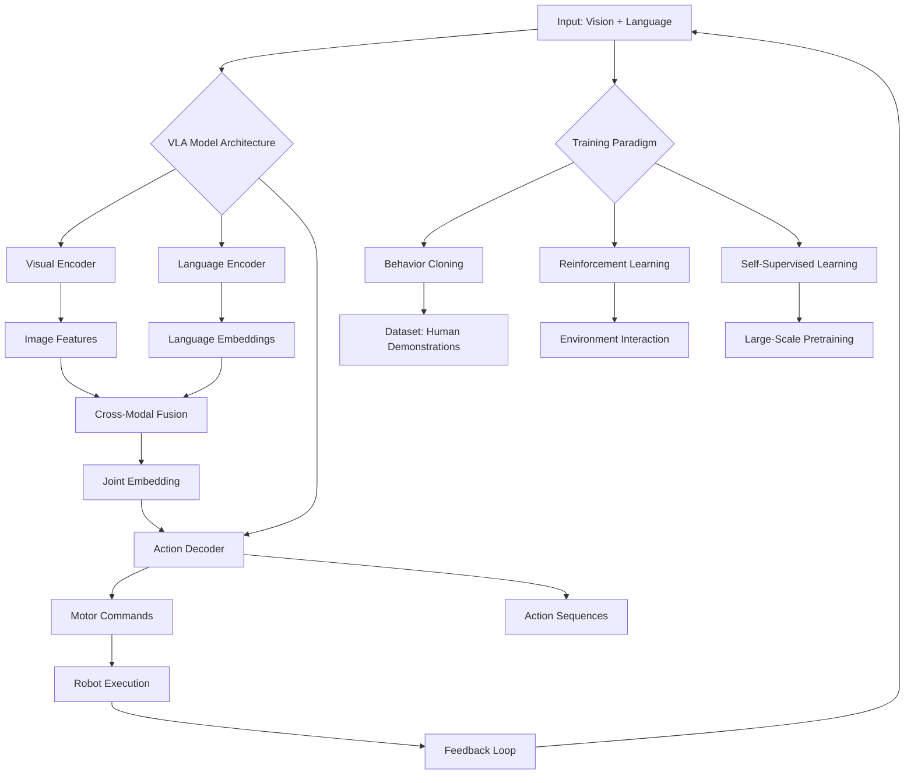

import Tabs from '@theme/Tabs';
import TabItem from '@theme/TabItem';

## Learning Outcomes

After completing this chapter, you will be able to:
1. Explain the fundamental concepts and architecture of Vision-Language-Action (VLA) models.
2. Analyze the integration of vision, language, and action modalities in embodied AI systems.
3. Evaluate the role of cross-modal alignment in VLA models for robotic applications.
4. Implement basic VLA model components using deep learning frameworks.
5. Design interfaces between VLA models and robotic control systems.
6. Assess the challenges in scaling VLA models for complex robotic tasks.
7. Compare different approaches to VLA model training and fine-tuning.
8. Evaluate the ethical implications and safety considerations in VLA-driven robotic systems.

## Gherkin Specifications

<Tabs
  defaultValue="spec1"
  values={[
    {label: 'Specification 1', value: 'spec1'},
    {label: 'Specification 2', value: 'spec2'},
    {label: 'Specification 3', value: 'spec3'},
    {label: 'Specification 4', value: 'spec4'},
    {label: 'Specification 5', value: 'spec5'},
  ]}>
  <TabItem value="spec1">

### Given visual and language inputs, When processing with VLA model, Then it should generate appropriate actions

```gherkin
Given a robot equipped with cameras and a VLA model
When presented with visual input and a natural language command
Then the VLA model should output appropriate low-level actions for the robot
```

  </TabItem>
  <TabItem value="spec2">

### Given multimodal input, When VLA model processes, Then it should maintain alignment across modalities

```gherkin
Given visual, linguistic, and action inputs to a VLA model
When the model processes these inputs simultaneously
Then it should maintain consistent representations across vision, language, and action spaces
```

  </TabItem>
  <TabItem value="spec3">

### Given a novel robotic task, When using pre-trained VLA model, Then it should generalize to execute the task

```gherkin
Given a VLA model trained on multiple robotic tasks
When presented with a new but related task and appropriate language command
Then it should execute the task successfully without additional training
```

  </TabItem>
  <TabItem value="spec4">

### Given safety constraints, When VLA model generates actions, Then it should respect safety boundaries

```gherkin
Given a VLA model integrated with safety monitoring
When generating action sequences for the robot
Then it should produce actions that respect predefined safety constraints
```

  </TabItem>
  <TabItem value="spec5">

### Given ambiguous language command, When processing with VLA model, Then it should seek clarification

```gherkin
Given a robot with VLA model and ambiguous language input
When the model interprets the command as uncertain
Then it should request clarification from the human operator
```

  </TabItem>
</Tabs>

## Theory & Intuition

Vision-Language-Action (VLA) models represent the cutting edge of embodied artificial intelligence, bridging the gap between high-level human communication and low-level robotic control. Think of a VLA model as a sophisticated interpreter that can listen to a human instruction ("Put the red cup on the table"), see the environment (recognizing the red cup, the table, and other objects), and translate this into a sequence of specific robotic actions (move to cup, grasp, move to table, place).

Traditional robotics approaches required programming specific behaviors for each task. VLA models change this paradigm by learning to connect visual observations, linguistic commands, and appropriate actions from large datasets of human demonstrations. This enables robots to understand and execute complex, natural language instructions without explicit programming for each possible scenario.

The core insight behind VLA models is that vision, language, and action share fundamental commonalities. Both visual scenes and linguistic descriptions can be understood as representations of objects, relationships, and transformations. A VLA model learns to map between these representations, allowing it to understand that "move the ball to the left" in language corresponds to a similar concept as recognizing motion in visual space.

Cross-modal alignment is crucial for VLA models. They must learn that the word "red" connects to the visual concept of redness, that "cup" corresponds to a specific category of objects, and that "place" relates to action sequences that cause objects to change positions. This alignment is learned through exposure to large datasets where vision, language, and action are appropriately paired.

VLA models typically use a transformer architecture or similar deep learning framework that can process sequences of inputs. They often include separate encoders for vision and language, which map these modalities to a shared embedding space. An action decoder then generates appropriate motor commands based on this joint representation. The entire system is trained end-to-end on datasets of human demonstrations.

## Core Concepts

<Tabs
  defaultValue="diagram"
  values={[
    {label: 'Mermaid Diagram', value: 'diagram'},
    {label: 'Concept Table', value: 'table'},
  ]}>
  <TabItem value="diagram">



  </TabItem>
  <TabItem value="table">

| Concept | Definition | Application |
|--------|------------|-------------|
| Cross-Modal Alignment | Learning correspondences between vision, language, and action | Understanding that "red cup" refers to visual concept |
| Joint Embedding Space | Shared representation space where modalities are aligned | Enabling translation between vision and language |
| Multimodal Fusion | Combining information from different modalities | Integrating visual scene with language command |
| Embodied Learning | Learning from physical interaction with environment | Improving VLA models through robot experience |
| Language Grounding | Connecting words to physical entities and actions | Ensuring "left" means appropriate direction |
| Action Space Mapping | Translating high-level commands to low-level motor actions | Converting "pick up" to specific joint movements |

  </TabItem>
</Tabs>

## Hands-On Labs

<Tabs
  defaultValue="lab1"
  values={[
    {label: 'Lab 1: VLA Model Architecture Implementation', value: 'lab1'},
    {label: 'Lab 2: Cross-Modal Alignment with CLIP', value: 'lab2'},
    {label: 'Lab 3: Vision-Language-to-Action Pipeline', value: 'lab3'},
  ]}>
  <TabItem value="lab1">

### Lab 1: Implementing a Basic VLA Model Architecture

#### Objective
Build a simplified Vision-Language-Action model that can connect visual input and language commands to simple actions.

#### Prerequisites
- Knowledge of PyTorch
- Basic understanding of neural networks
- Familiarity with computer vision and NLP concepts

#### Steps
1. Implement visual and language encoders
2. Create a fusion mechanism for multimodal inputs
3. Build an action decoder
4. Test with simple synthetic data

#### Code Example
```python
#!/usr/bin/env python3
import torch
import torch.nn as nn
import torch.optim as optim
import numpy as np
from torchvision import models
import clip  # CLIP for vision-language alignment
from transformers import AutoTokenizer, AutoModel

class VisionEncoder(nn.Module):
    """Encoder for visual inputs"""
    def __init__(self, pretrained=True):
        super(VisionEncoder, self).__init__()
        # Use a pre-trained ResNet and modify for our needs
        self.backbone = models.resnet18(pretrained=pretrained)
        # Remove the final classification layer
        self.backbone.fc = nn.Identity()
        
        # Additional layers to map to our desired embedding size
        self.projection = nn.Linear(512, 512)
    
    def forward(self, x):
        features = self.backbone(x)
        projected = self.projection(features)
        # Normalize features
        return nn.functional.normalize(projected, p=2, dim=1)

class LanguageEncoder(nn.Module):
    """Encoder for language inputs"""
    def __init__(self, vocab_size=30522, embedding_dim=512, hidden_dim=512):
        super(LanguageEncoder, self).__init__()
        self.embedding = nn.Embedding(vocab_size, embedding_dim)
        self.lstm = nn.LSTM(embedding_dim, hidden_dim, batch_first=True)
        self.projection = nn.Linear(hidden_dim, 512)
        
    def forward(self, x):
        embedded = self.embedding(x)
        lstm_out, (hidden, _) = self.lstm(embedded)
        # Use the last hidden state
        projected = self.projection(hidden[-1])
        return nn.functional.normalize(projected, p=2, dim=1)

class ActionDecoder(nn.Module):
    """Decoder that maps joint embedding to actions"""
    def __init__(self, joint_dim=512, action_dim=4):  # 4D action space (x, y, z, gripper)
        super(ActionDecoder, self).__init__()
        self.fc_layers = nn.Sequential(
            nn.Linear(joint_dim, 256),
            nn.ReLU(),
            nn.Linear(256, 128),
            nn.ReLU(),
            nn.Linear(128, 64),
            nn.ReLU(),
            nn.Linear(64, action_dim)
        )
        
    def forward(self, joint_embedding):
        return self.fc_layers(joint_embedding)

class VLAModel(nn.Module):
    """Vision-Language-Action Model"""
    def __init__(self, vocab_size=30522, action_dim=4):
        super(VLAModel, self).__init__()
        self.visual_encoder = VisionEncoder()
        self.lang_encoder = LanguageEncoder(vocab_size=vocab_size)
        self.action_decoder = ActionDecoder(action_dim=action_dim)
        
        # Learnable fusion parameters
        self.visual_weight = nn.Parameter(torch.tensor(0.5))
        self.lang_weight = nn.Parameter(torch.tensor(0.5))
    
    def forward(self, image, text):
        # Encode visual and language inputs
        visual_features = self.visual_encoder(image)
        lang_features = self.lang_encoder(text)
        
        # Simple weighted fusion
        joint_embedding = self.visual_weight * visual_features + self.lang_weight * lang_features
        
        # Generate actions
        actions = self.action_decoder(joint_embedding)
        return actions

# Training setup
def train_vla_model():
    # Initialize model
    model = VLAModel(vocab_size=30522, action_dim=4)
    
    # Define loss function and optimizer
    criterion = nn.MSELoss()
    optimizer = optim.Adam(model.parameters(), lr=0.001)
    
    # Generate mock training data (in practice, you'd load real data)
    batch_size = 8
    img_channels, img_height, img_width = 3, 224, 224
    seq_len = 10  # max sequence length for text
    action_dim = 4  # (x, y, z, gripper)
    
    # Mock data - in practice, you would load real data
    images = torch.randn(batch_size, img_channels, img_height, img_width)
    text_inputs = torch.randint(0, 30522, (batch_size, seq_len))  # random token IDs
    target_actions = torch.randn(batch_size, action_dim)
    
    # Training loop
    model.train()
    for epoch in range(10):
        optimizer.zero_grad()
        
        # Forward pass
        predicted_actions = model(images, text_inputs)
        
        # Calculate loss
        loss = criterion(predicted_actions, target_actions)
        
        # Backward pass
        loss.backward()
        optimizer.step()
        
        print(f'Epoch {epoch}, Loss: {loss.item():.4f}')

if __name__ == "__main__":
    train_vla_model()
```

#### Expected Outcome
A simple VLA model that learns to combine visual and language inputs to generate appropriate action vectors, demonstrating the basic architecture of multimodal learning.

  </TabItem>
  <TabItem value="lab2">

### Lab 2: Cross-Modal Alignment with CLIP-based Approach

#### Objective
Implement a system that demonstrates cross-modal alignment between vision and language using a CLIP-like approach.

#### Prerequisites
- Understanding of contrastive learning
- PyTorch knowledge
- Basic understanding of vision-language models

#### Steps
1. Set up image and text encoders
2. Implement contrastive loss function
3. Train on image-text pairs
4. Test alignment with retrieval tasks

#### Code Example
```python
#!/usr/bin/env python3
import torch
import torch.nn as nn
import torch.optim as optim
import torch.nn.functional as F
import numpy as np
from torchvision import models, transforms
from PIL import Image
import clip

class CLIPVLA(nn.Module):
    """Simplified CLIP-like model for vision-language alignment"""
    def __init__(self, embed_dim=512):
        super(CLIPVLA, self).__init__()
        # Vision encoder (using ResNet)
        vision_model = models.resnet18(pretrained=True)
        vision_model.fc = nn.Identity()
        self.visual_encoder = vision_model
        self.visual_projection = nn.Linear(512, embed_dim)
        
        # Text encoder (simplified transformer-like)
        self.tokenizer = clip.tokenize if clip else None
        self.text_encoder = nn.Sequential(
            nn.Embedding(49408, 512),  # CLIP vocab size
            nn.TransformerEncoder(
                nn.TransformerEncoderLayer(d_model=512, nhead=8, batch_first=True),
                num_layers=4
            )
        )
        self.text_projection = nn.Linear(512, embed_dim)
        
        # Temperature parameter for contrastive loss
        self.logit_scale = nn.Parameter(torch.ones([]) * np.log(1 / 0.07))
    
    def encode_images(self, images):
        features = self.visual_encoder(images)
        projected = self.visual_projection(features)
        return F.normalize(projected, dim=1)
    
    def encode_texts(self, texts):
        # If texts are strings, convert to tokens
        if isinstance(texts, list) and isinstance(texts[0], str):
            # Tokenize texts (simplified approach)
            text_tokens = []
            for text in texts:
                # Simple tokenization (in practice, use proper tokenizer)
                tokens = [hash(word) % 49408 for word in text.lower().split()]
                # Pad or truncate to fixed length
                tokens = tokens[:77] + [0] * max(0, 77 - len(tokens))
                text_tokens.append(tokens)
            texts = torch.tensor(text_tokens, dtype=torch.long)
        
        features = self.text_encoder(texts)
        # Use mean pooling for sequence
        features = torch.mean(features, dim=1)
        projected = self.text_projection(features)
        return F.normalize(projected, dim=1)
    
    def forward(self, images, texts):
        image_features = self.encode_images(images)
        text_features = self.encode_texts(texts)
        
        # Logits for contrastive loss
        logits_per_image = torch.matmul(image_features, text_features.t()) * self.logit_scale
        logits_per_text = torch.matmul(text_features, image_features.t()) * self.logit_scale
        
        return logits_per_image, logits_per_text

def contrastive_loss(image_logits, text_logits):
    """Calculate contrastive loss for image-text alignment"""
    device = image_logits.device
    
    # Create ground truth labels
    batch_size = image_logits.shape[0]
    ground_truth = torch.arange(batch_size, dtype=torch.long, device=device)
    
    # Calculate loss
    loss_i = F.cross_entropy(image_logits, ground_truth)
    loss_t = F.cross_entropy(text_logits, ground_truth)
    
    # Symmetric loss
    loss = (loss_i + loss_t) / 2
    return loss

# Training function
def train_clip_vla():
    model = CLIPVLA(embed_dim=512)
    optimizer = optim.Adam(model.parameters(), lr=0.001)
    
    # Mock data - in practice, you would load real image-text pairs
    batch_size = 4
    img_channels, img_height, img_width = 3, 224, 224
    
    # Generate mock images and text descriptions
    images = torch.randn(batch_size, img_channels, img_height, img_width)
    text_descriptions = [
        "a red ball",
        "a blue cube", 
        "a green cylinder",
        "a yellow pyramid"
    ]
    
    # Training loop
    model.train()
    for epoch in range(5):
        optimizer.zero_grad()
        
        # Forward pass
        logits_per_image, logits_per_text = model(images, text_descriptions)
        
        # Calculate contrastive loss
        loss = contrastive_loss(logits_per_image, logits_per_text)
        
        # Backward pass
        loss.backward()
        optimizer.step()
        
        print(f'Epoch {epoch}, Contrastive Loss: {loss.item():.4f}')
    
    # Test retrieval: given an image, find the best matching text
    print("\nTesting retrieval capability...")
    with torch.no_grad():
        img_features = model.encode_images(images)
        txt_features = model.encode_texts(text_descriptions)
        
        # Similarity scores
        similarities = torch.matmul(img_features, txt_features.t())
        print("Similarity matrix:")
        print(similarities)

if __name__ == "__main__":
    train_clip_vla()
```

#### Expected Outcome
A vision-language model that can align visual and linguistic concepts, enabling retrieval tasks where the model can match images to appropriate text descriptions.

  </TabItem>
  <TabItem value="lab3">

### Lab 3: Vision-Language-to-Action Pipeline

#### Objective
Create a complete pipeline that takes visual input and language commands and outputs robotic actions.

#### Prerequisites
- Understanding of robot kinematics and control
- Knowledge of ROS 2
- Experience with computer vision and NLP

#### Steps
1. Integrate vision-language understanding with action generation
2. Implement action space mapping
3. Test pipeline with simulated robotic commands
4. Evaluate alignment between commands and actions

#### Code Example
```python
#!/usr/bin/env python3
import rclpy
from rclpy.node import Node
from sensor_msgs.msg import Image
from std_msgs.msg import String
from geometry_msgs.msg import Twist, Point
from geometry_msgs.msg import Pose
import torch
import torch.nn as nn
import numpy as np
from PIL import Image as PILImage
import io
import torch.nn.functional as F
from torchvision import transforms

class VLAActionGenerator(Node):
    def __init__(self):
        super().__init__('vla_action_generator')
        
        # Initialize vision encoder
        self.vision_encoder = self.initialize_vision_encoder()
        
        # Initialize language encoder
        self.lang_encoder = self.initialize_lang_encoder()
        
        # Initialize action decoder
        self.action_decoder = self.initialize_action_decoder()
        
        # Subscribers for vision and language inputs
        self.image_sub = self.create_subscription(
            Image, '/camera/image_raw', self.image_callback, 10)
        self.command_sub = self.create_subscription(
            String, '/command_input', self.command_callback, 10)
        
        # Publisher for actions
        self.action_pub = self.create_publisher(Pose, '/robot_action', 10)
        
        # Store latest inputs
        self.latest_image = None
        self.latest_command = None
        
        # Process timer
        self.timer = self.create_timer(1.0, self.process_inputs)
        
        self.get_logger().info("VLA Action Generator initialized")
    
    def initialize_vision_encoder(self):
        """Initialize a simple CNN-based vision encoder"""
        class SimpleVisionEncoder(nn.Module):
            def __init__(self):
                super().__init__()
                self.conv_layers = nn.Sequential(
                    nn.Conv2d(3, 32, kernel_size=8, stride=4),
                    nn.ReLU(),
                    nn.Conv2d(32, 64, kernel_size=4, stride=2),
                    nn.ReLU(),
                    nn.Conv2d(64, 64, kernel_size=3, stride=1),
                    nn.ReLU(),
                    nn.Flatten(),
                    nn.Linear(64 * 7 * 7, 512),  # Adjust based on input size
                    nn.ReLU()
                )
                self.projection = nn.Linear(512, 256)
            
            def forward(self, x):
                features = self.conv_layers(x)
                return F.normalize(self.projection(features), p=2, dim=1)
        
        return SimpleVisionEncoder()
    
    def initialize_lang_encoder(self):
        """Initialize language encoder (simplified word embedding approach)"""
        class SimpleLangEncoder(nn.Module):
            def __init__(self, vocab_size=1000, embed_dim=256, hidden_dim=256):
                super().__init__()
                self.embedding = nn.Embedding(vocab_size, embed_dim)
                self.lstm = nn.LSTM(embed_dim, hidden_dim, batch_first=True)
                self.projection = nn.Linear(hidden_dim, 256)
                
            def forward(self, x):
                embedded = self.embedding(x)
                lstm_out, (hidden, _) = self.lstm(embedded)
                output = self.projection(hidden[-1])
                return F.normalize(output, p=2, dim=1)
        
        return SimpleLangEncoder()
    
    def initialize_action_decoder(self):
        """Initialize action decoder"""
        class ActionDecoder(nn.Module):
            def __init__(self, joint_dim=512, action_dim=6):  # 6D for 3D pos + 3D orientation
                super().__init__()
                self.fc_layers = nn.Sequential(
                    nn.Linear(joint_dim, 256),
                    nn.ReLU(),
                    nn.Linear(256, 128),
                    nn.ReLU(),
                    nn.Linear(128, action_dim)
                )
                
            def forward(self, joint_embedding):
                return self.fc_layers(joint_embedding)
        
        # Joint dimension is sum of visual and language embeddings (256+256=512)
        return ActionDecoder(joint_dim=512, action_dim=6)
    
    def image_callback(self, msg):
        """Process incoming image"""
        # Convert ROS Image to PyTorch tensor
        # This is a simplified conversion - proper conversion would require handling the encoding
        try:
            # Convert the image message format to a format we can work with
            # For this example, we'll create a dummy tensor 
            # (in practice, convert msg.data to proper format)
            image_tensor = torch.randn(1, 3, 224, 224)  # dummy tensor
            self.latest_image = image_tensor
        except Exception as e:
            self.get_logger().error(f"Error processing image: {e}")
    
    def command_callback(self, msg):
        """Process incoming command"""
        command_text = msg.data
        self.get_logger().info(f"Received command: {command_text}")
        
        # Convert text to tokens (simplified)
        # In practice, use proper tokenizer
        word_to_idx = {
            'move': 1, 'forward': 2, 'backward': 3, 'left': 4, 'right': 5,
            'pick': 6, 'up': 7, 'place': 8, 'down': 9, 'go': 10, 'to': 11,
            'the': 12, 'red': 13, 'blue': 14, 'green': 15, 'object': 16,
            'table': 17, 'box': 18
        }
        
        # Tokenize command
        tokens = [word_to_idx.get(word.lower(), 0) for word in command_text.split()]
        # Pad or truncate to fixed length
        max_len = 10
        tokens = tokens[:max_len] + [0] * max(0, max_len - len(tokens))
        
        token_tensor = torch.tensor([tokens], dtype=torch.long)
        self.latest_command = token_tensor
    
    def process_inputs(self):
        """Process latest image and command to generate action"""
        if self.latest_image is None or self.latest_command is None:
            return
        
        try:
            # Encode visual and language inputs
            visual_features = self.vision_encoder(self.latest_image)
            lang_features = self.lang_encoder(self.latest_command)
            
            # Concatenate features (joint embedding)
            joint_features = torch.cat([visual_features, lang_features], dim=1)
            
            # Generate action
            action_output = self.action_decoder(joint_features)
            
            # Convert action output to ROS message
            action_msg = Pose()
            # Map 6D output to position and orientation
            action_msg.position.x = float(action_output[0][0])
            action_msg.position.y = float(action_output[0][1])
            action_msg.position.z = float(action_output[0][2])
            # Simple mapping for orientation (in practice, use quaternions)
            action_msg.orientation.x = float(action_output[0][3])
            action_msg.orientation.y = float(action_output[0][4])
            action_msg.orientation.z = float(action_output[0][5])
            # Normalize orientation (simplified)
            norm = torch.norm(action_output[0][3:6])
            if norm > 0:
                action_msg.orientation.w = float(1.0)  # As a placeholder
            
            # Publish action
            self.action_pub.publish(action_msg)
            
            self.get_logger().info(f"Generated action: pos=({action_msg.position.x:.2f}, "
                                 f"{action_msg.position.y:.2f}, {action_msg.position.z:.2f})")
            
        except Exception as e:
            self.get_logger().error(f"Error generating action: {e}")

class VLACommandSender(Node):
    """Node to send test commands for the VLA system"""
    def __init__(self, command_publisher):
        super().__init__('vla_command_sender')
        self.command_publisher = command_publisher
        
        # Timer to send test commands
        self.timer = self.create_timer(5.0, self.send_test_command)
        self.command_idx = 0
        self.test_commands = [
            "move forward",
            "turn left", 
            "pick up the red object",
            "go to the blue box",
            "place down"
        ]
    
    def send_test_command(self):
        if self.command_idx < len(self.test_commands):
            cmd_msg = String()
            cmd_msg.data = self.test_commands[self.command_idx]
            self.command_publisher.publish(cmd_msg)
            self.get_logger().info(f"Sent test command: {cmd_msg.data}")
            self.command_idx += 1

def main(args=None):
    rclpy.init(args=args)
    
    # Create VLA action generator node
    action_generator = VLAActionGenerator()
    
    # Create command sender node
    command_sender = VLACommandSender(action_generator.command_sub)
    
    # Use multi-threaded executor to run both nodes
    executor = rclpy.executors.MultiThreadedExecutor()
    executor.add_node(action_generator)
    executor.add_node(command_sender)
    
    try:
        executor.spin()
    except KeyboardInterrupt:
        pass
    finally:
        action_generator.destroy_node()
        command_sender.destroy_node()
        rclpy.shutdown()

if __name__ == '__main__':
    main()
```

#### Expected Outcome
A complete pipeline that takes visual input and natural language commands and outputs appropriate robotic actions, demonstrating the full vision-language-action loop.

  </TabItem>
</Tabs>

## Sim-to-Real Notes

When implementing Vision-Language-Action models on real hardware, several practical considerations become critical:

1. **Computational Requirements**: VLA models are computationally intensive. For the Jetson Orin Nano, optimize models using TensorRT for inference acceleration. Consider using model quantization to reduce memory and computation requirements while maintaining performance. Offload intensive processing to the GPU when possible.

2. **Real-Time Performance**: VLA models must run within real-time constraints. Implement efficient batching and consider running models at appropriate frequencies. Use techniques like model distillation to create efficient versions for real-time deployment.

3. **Sensor Integration**: Real robots have diverse sensor modalities. Ensure VLA models can handle the actual camera feeds, frame rates, and image quality of the robot's cameras. Account for sensor noise and calibration differences.

4. **Action Space Mapping**: Map the continuous outputs of VLA models to the discrete action space of real robots. Implement appropriate discretization and scaling mechanisms to ensure safe and effective robot control.

5. **Safety Considerations**: Implement safety rails and bounds checking to ensure VLA-generated actions are safe. Define safety constraints that the model must respect and implement monitoring systems to detect and prevent unsafe behaviors.

6. **Data Efficiency**: Real-world training data is expensive to collect. Implement techniques like domain randomization, sim-to-real transfer, and few-shot learning to maximize the effectiveness of limited real-world data.

For the Unitree robot platforms, consider the dynamic nature of legged locomotion when designing VLA models. Account for the robot's balance and stability requirements when generating actions, and ensure that the model's outputs are appropriate for the robot's physical capabilities.

## Multiple Choice Questions

<Tabs
  defaultValue="mcq1"
  values={[
    {label: 'Q1-3', value: 'mcq1'},
    {label: 'Q4-6', value: 'mcq2'},
    {label: 'Q7-9', value: 'mcq3'},
    {label: 'Q10-12', value: 'mcq4'},
    {label: 'Q13-15', value: 'mcq5'},
  ]}>
  <TabItem value="mcq1">

1. **What is the primary function of Vision-Language-Action (VLA) models in robotics?**
   - A) To create visual effects for robot displays
   - B) To connect visual perception, language understanding, and robotic action
   - C) To record robot behavior for analysis
   - D) To design robot hardware

   **Correct Answer: B** - VLA models connect visual perception, language understanding, and robotic action to enable natural human-robot interaction.

2. **What does 'cross-modal alignment' mean in the context of VLA models?**
   - A) Aligning the robot's sensors
   - B) Learning correspondences between different modalities like vision and language
   - C) Synchronizing robot movements
   - D) Calibrating cameras

   **Correct Answer: B** - Cross-modal alignment refers to learning correspondences between different modalities like connecting visual concepts with language.

3. **Which of the following is a key component of VLA model architecture?**
   - A) Visual encoder only
   - B) Language encoder only
   - C) Separate encoders for vision and language, with an action decoder
   - D) Action encoder only

   **Correct Answer: C** - VLA models typically include separate encoders for vision and language with a joint representation that feeds an action decoder.

  </TabItem>
  <TabItem value="mcq2">

4. **What is the purpose of joint embedding space in VLA models?**
   - A) To store robot hardware specifications
   - B) To provide a shared representation space where modalities are aligned
   - C) To store raw sensor data
   - D) To manage robot software packages

   **Correct Answer: B** - The joint embedding space provides a shared representation where vision, language, and action modalities are aligned.

5. **What is 'language grounding' in VLA models?**
   - A) Connecting words to physical entities and actions
   - B) Grounding the robot to prevent electrical issues
   - C) Teaching robots to speak
   - D) Connecting to the internet

   **Correct Answer: A** - Language grounding is the process of connecting linguistic concepts to physical entities and actions in the environment.

6. **Which concept is essential for a VLA model to understand that 'red ball' refers to a visual concept?**
   - A) Cross-modal alignment
   - B) Single-modal processing
   - C) Hardware optimization
   - D) Static programming

   **Correct Answer: A** - Cross-modal alignment enables the model to connect linguistic concepts like 'red ball' with visual concepts.

  </TabItem>
  <TabItem value="mcq3">

7. **In VLA models, what does the action decoder typically do?**
   - A) Processes visual input
   - B) Converts joint embedding to motor commands
   - C) Generates language descriptions
   - D) Calibrates sensors

   **Correct Answer: B** - The action decoder converts the joint embedding from vision and language into appropriate motor commands or actions.

8. **What is a major challenge in deploying VLA models on resource-constrained robotic platforms?**
   - A) Too much available memory
   - B) High computational requirements of these models
   - C) Lack of programming languages
   - D) Excessive sensor accuracy

   **Correct Answer: B** - VLA models are computationally intensive, which poses challenges for resource-constrained robotic platforms.

9. **What does 'embodied learning' mean in the context of VLA models?**
   - A) Learning through physical interaction with the environment
   - B) Learning about human bodies
   - C) Learning by watching videos
   - D) Learning through text only

   **Correct Answer: A** - Embodied learning refers to learning based on physical interaction with the environment, which is crucial for VLA models.

  </TabItem>
  <TabItem value="mcq4">

10. **Which training approach is commonly used for VLA models?**
    - A) Supervised learning only
    - B) Reinforcement learning only
    - C) Behavior cloning from human demonstrations
    - D) Unsupervised learning only

    **Correct Answer: C** - Behavior cloning from human demonstrations is a common approach for training VLA models.

11. **What is a critical safety consideration when deploying VLA models on real robots?**
    - A) Model training speed
    - B) Ensuring generated actions respect safety constraints
    - C) Camera resolution
    - D) Network bandwidth

    **Correct Answer: B** - Ensuring that VLA-generated actions respect safety constraints is critical for real-world deployment.

12. **How do VLA models differ from traditional robotic programming approaches?**
    - A) They use less computation
    - B) They learn to connect vision, language and action from data instead of explicit programming
    - C) They require more sensors
    - D) They operate more slowly

    **Correct Answer: B** - VLA models learn to connect vision, language, and action from data, rather than requiring explicit programming for each behavior.

  </TabItem>
  <TabItem value="mcq5">

13. **What is the purpose of multimodal fusion in VLA models?**
    - A) To combine information from different modalities
    - B) To reduce the number of sensors
    - C) To increase computation speed
    - D) To store data more efficiently

    **Correct Answer: A** - Multimodal fusion combines information from different modalities (vision, language) to form a coherent understanding.

14. **Which type of neural network architecture is commonly used in VLA models?**
    - A) Only convolutional networks
    - B) Only recurrent networks
    - C) Transformer-based architectures
    - D) Only fully connected networks

    **Correct Answer: C** - Transformer-based architectures are commonly used in modern VLA models due to their effectiveness with sequences.

15. **What is a key advantage of using VLA models for human-robot interaction?**
    - A) They reduce robot cost
    - B) They enable robots to understand natural language commands in visual contexts
    - C) They eliminate the need for sensors
    - D) They make robots move faster

    **Correct Answer: B** - VLA models enable robots to understand natural language commands in the context of visual scenes, making interaction more natural.

  </TabItem>
</Tabs>

## Further Reading

<Tabs
  defaultValue="ref1"
  values={[
    {label: 'Research Papers', value: 'ref1'},
    {label: 'Books', value: 'ref2'},
    {label: 'Tutorials', value: 'ref3'},
    {label: 'Tools & Frameworks', value: 'ref4'},
  ]}>
  <TabItem value="ref1">

### Research Papers

1. [RT-1: Robotics Transformer for Real-World Control at Scale](https://arxiv.org/abs/2212.06817) - A foundational paper on using transformer-based models for robotic control.

2. [Do As I Can, Not As I Say: Grounding Language in Robotic Affordances](https://arxiv.org/abs/2204.01691) - Introduction to the RT-2 model family that connects language to robotic actions.

3. [CLIPort: What and Where Pathways for Robotic Manipulation](https://arxiv.org/abs/2109.12098) - Vision-language approach to robotic manipulation tasks.

4. [Language-Conditioned Learning for Robotic Manipulation with Visual Skill Networks](https://arxiv.org/abs/2203.06844) - Language grounding for manipulation tasks.

5. [Embodied AI: Past, Present and Future](https://ieeexplore.ieee.org/document/9562697) - Overview of embodied AI, including VLA models.

  </TabItem>
  <TabItem value="ref2">

### Books

1. [Artificial Intelligence: A Modern Approach](https://aima.cs.berkeley.edu/) by Russell & Norvig - Covers fundamental concepts in AI relevant to VLA models.

2. [Deep Learning](https://www.deeplearningbook.org/) by Goodfellow, Bengio, and Courville - Foundational text on deep learning applicable to VLA models.

3. [Introduction to Autonomous Robots](https://www.koganpage.com/product/introduction-to-autonomous-robots-second-edition-9781680834083) - Covers integration of perception, planning, and action.

4. [Computer Vision: Algorithms and Applications](http://szeliski.org/Book/) by Szeliski - Comprehensive text covering computer vision techniques.

5. [Natural Language Processing with Python](https://www.nltk.org/book/) - Covers NLP concepts relevant to language grounding in robots.

  </TabItem>
  <TabItem value="ref3">

### Tutorials

1. [Deep Learning for Robotics: A Tutorial](https://github.com/AtsushiSakai/PyRoboLearn) - Practical tutorials on applying deep learning to robotics.

2. [Vision-Language Models for Robotics](https://github.com/flow-project/flow-tutorials) - Hands-on examples of vision-language integration.

3. [PyTorch for AI and Robotics](https://pytorch.org/tutorials/beginner/blitz/tensor_tutorial.html) - Practical introduction to using PyTorch for AI applications.

4. [ROS 2 and AI Integration](https://navigation.ros.org/tutorials/index.html) - Tutorials on integrating AI capabilities with ROS 2.

5. [Multimodal Machine Learning](https://cmu-multicomp-lab.github.io/mmml-tutorial/) - Comprehensive tutorial on multimodal learning approaches.

  </TabItem>
  <TabItem value="ref4">

### Tools & Frameworks

1. [Hugging Face Transformers](https://huggingface.co/docs/transformers/index) - Library containing pre-trained models useful for VLA research.

2. [Stable Baselines3](https://stable-baselines3.readthedocs.io/) - Reinforcement learning library with multimodal capabilities.

3. [ROS 2 Manipulation Stack](https://github.com/ros-planning/moveit2) - Framework for robotic manipulation with AI integration.

4. [OpenVLA](https://github.com/openvla/openvla) - Open-source implementation of vision-language-action models.

5. [RoboTurk](https://roboturk.stanford.edu/) - Platform for collecting human demonstration data for VLA training.

  </TabItem>
</Tabs>