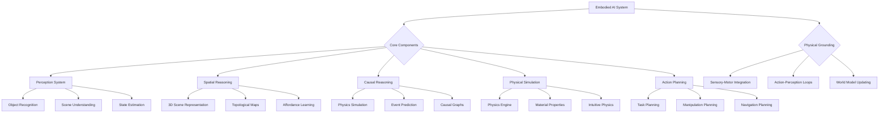

import Tabs from '@theme/Tabs';
import TabItem from '@theme/TabItem';

## Learning Outcomes

After completing this chapter, you will be able to:
1. Define embodied AI and explain its importance in robotics and autonomous systems.
2. Analyze the role of physical grounding in AI reasoning and decision-making.
3. Implement spatial reasoning algorithms for robotic environments.
4. Design systems for understanding object affordances and manipulation possibilities.
5. Apply causal reasoning to predict outcomes of robotic actions.
6. Develop prediction and planning algorithms that incorporate physical constraints.
7. Evaluate the effectiveness of embodied reasoning in solving robotic tasks.
8. Assess the integration challenges between AI reasoning and robotic control systems.

## Gherkin Specifications

<Tabs
  defaultValue="spec1"
  values={[
    {label: 'Specification 1', value: 'spec1'},
    {label: 'Specification 2', value: 'spec2'},
    {label: 'Specification 3', value: 'spec3'},
    {label: 'Specification 4', value: 'spec4'},
    {label: 'Specification 5', value: 'spec5'},
  ]}>
  <TabItem value="spec1">

### Given a physical environment, When reasoning about spatial relationships, Then AI should understand object positions and affordances

```gherkin
Given an embodied AI system perceiving a physical environment
When reasoning about spatial relationships between objects
Then the system should accurately understand positions, orientations, and affordances
```

  </TabItem>
  <TabItem value="spec2">

### Given a planned action, When reasoning about causality, Then AI should predict physical outcomes

```gherkin
Given an embodied AI system considering an action
When reasoning about the causal effects of that action
Then the system should predict realistic physical outcomes based on physics principles
```

  </TabItem>
  <TabItem value="spec3">

### Given physical constraints, When planning tasks, Then AI should consider feasibility in real world

```gherkin
Given an embodied AI system planning a sequence of actions
When the physical constraints of the environment and robot are considered
Then the plan should be feasible in the real world physics
```

  </TabItem>
  <TabItem value="spec4">

### Given uncertain environment, When reasoning, Then AI should handle ambiguity and incomplete information

```gherkin
Given an embodied AI system operating in uncertain environment
When performing reasoning tasks with incomplete information
Then the system should handle ambiguity and make appropriate decisions
```

  </TabItem>
  <TabItem value="spec5">

### Given changing environment, When reasoning dynamically, Then AI should update beliefs and plans

```gherkin
Given an embodied AI system in a changing environment
When new information becomes available
Then the system should update its beliefs and adapt its plans accordingly
```

  </TabItem>
</Tabs>

## Theory & Intuition

Embodied AI represents a paradigm shift from traditional AI approaches, where intelligence is not just abstract computation but is fundamentally tied to physical interaction with the world. Think of how human reasoning is deeply connected to our physical experiences—the way we understand concepts like "heavy," "slippery," or "fragile" comes from physically interacting with objects. Similarly, embodied AI systems gain understanding through interaction with their environment.

Traditional AI systems often process abstract symbols or data without understanding their physical grounding. An embodied AI system, however, connects abstract concepts to physical experiences. When it learns about "containers," it doesn't just learn the definition—it learns through physical interactions what objects can contain others, how stability is affected by filling, how different shapes affect containment, and so on.

Spatial reasoning in embodied AI goes beyond simple coordinate systems. It includes understanding the functional properties of spaces, how objects can be arranged, how agents can navigate and manipulate within these spaces, and how spatial relationships change over time. This is crucial for robots that must operate in complex, real-world environments.

The concept of affordances—originally introduced by psychologist James Gibson—is central to embodied AI. Affordances are the possible actions that an environment offers to an agent. A chair affords sitting, a handle affords grasping, and a door affords opening. An embodied AI system learns to identify these possibilities and reason about how to achieve its goals through them.

Causal reasoning in embodied AI involves understanding how actions affect the physical world. Unlike purely statistical AI that learns correlations, embodied AI learns physical causality—understanding that pushing an object will cause it to move (with appropriate forces), that pouring liquid into a container will increase its contents, and that applying heat to ice will cause it to melt.

Physical grounding ensures that AI reasoning remains connected to the real world. When an embodied AI system plans an action sequence, it must consider the physical constraints of the environment, the capabilities of its robotic body, and the laws of physics. This makes its plans more realistic and achievable than those generated by disembodied AI systems.

## Core Concepts

<Tabs
  defaultValue="diagram"
  values={[
    {label: 'Mermaid Diagram', value: 'diagram'},
    {label: 'Concept Table', value: 'table'},
  ]}>
  <TabItem value="diagram">



  </TabItem>
  <TabItem value="table">

| Concept | Definition | Application |
|--------|------------|-------------|
| Physical Grounding | Connecting abstract concepts to physical experiences | Ensuring AI reasoning relates to real-world physics |
| Affordance Learning | Understanding action possibilities in the environment | Identifying what actions can be performed on objects |
| Intuitive Physics | Human-like understanding of physical interactions | Predicting outcomes of object interactions |
| Spatial Reasoning | Reasoning about objects and their relationships in space | Navigation, manipulation, and scene understanding |
| Causal Reasoning | Understanding cause-effect relationships | Predicting action outcomes and planning |
| Action-Perception Loops | Continuous cycles of action and sensory feedback | Adaptive and responsive behavior |

  </TabItem>
</Tabs>

## Hands-On Labs

<Tabs
  defaultValue="lab1"
  values={[
    {label: 'Lab 1: Spatial Reasoning in 3D Environments', value: 'lab1'},
    {label: 'Lab 2: Causal Reasoning with Physics Simulation', value: 'lab2'},
    {label: 'Lab 3: Affordance Learning and Object Interaction', value: 'lab3'},
  ]}>
  <TabItem value="lab1">

### Lab 1: Implementing 3D Spatial Reasoning for Robot Navigation

#### Objective
Create a spatial reasoning system that allows a robot to understand and navigate 3D environments effectively.

#### Prerequisites
- Understanding of 3D geometry and transformations
- ROS 2 knowledge
- Basic understanding of occupancy grids and topological maps

#### Steps
1. Implement 3D scene representation using point clouds or occupancy grids
2. Create spatial reasoning functions for navigation
3. Test with obstacle avoidance and path planning scenarios
4. Evaluate the system's ability to reason about spatial relationships

#### Code Example
```python
#!/usr/bin/env python3
import rclpy
from rclpy.node import Node
from sensor_msgs.msg import PointCloud2, LaserScan
from geometry_msgs.msg import Pose, Point, Vector3
from nav_msgs.msg import OccupancyGrid
from std_msgs.msg import ColorRGBA
from visualization_msgs.msg import Marker, MarkerArray
import numpy as np
import open3d as o3d
from scipy.spatial import cKDTree
import math

class SpatialReasoningNode(Node):
    def __init__(self):
        super().__init__('spatial_reasoning_node')
        
        # Publishers
        self.vis_publisher = self.create_publisher(MarkerArray, '/spatial_reasoning_markers', 10)
        self.nav_goal_publisher = self.create_publisher(Pose, '/navigation_goal', 10)
        
        # Subscribers
        self.pointcloud_sub = self.create_subscription(
            PointCloud2, '/pointcloud', self.pc_callback, 10)
        self.scan_sub = self.create_subscription(
            LaserScan, '/scan', self.scan_callback, 10)
        
        # Spatial reasoning components
        self.point_cloud_data = None
        self.spatial_tree = None
        self.robot_pos = np.array([0.0, 0.0, 0.0])
        
        # Timer for spatial reasoning
        self.reasoning_timer = self.create_timer(0.5, self.spatial_reasoning_cycle)
        
        self.get_logger().info("Spatial Reasoning Node initialized")

    def pc_callback(self, msg):
        """Process point cloud data"""
        # Convert PointCloud2 to numpy array (simplified)
        # In practice, use proper conversion like sensor_msgs.point_cloud2.read_points
        # For this example, we'll create a mock point cloud
        self.point_cloud_data = np.random.rand(1000, 3) * 10.0 - 5.0  # Random points in 10x10x10 space
        self.build_spatial_tree()
    
    def scan_callback(self, msg):
        """Process laser scan data"""
        # Update robot position based on scan (simplified)
        # In practice, use odometry or localization
        pass
    
    def build_spatial_tree(self):
        """Build KD-tree for efficient spatial queries"""
        if self.point_cloud_data is not None:
            self.spatial_tree = cKDTree(self.point_cloud_data)
            self.get_logger().info(f"Built spatial tree with {len(self.point_cloud_data)} points")
    
    def spatial_reasoning_cycle(self):
        """Main spatial reasoning cycle"""
        if self.spatial_tree is None:
            return
        
        # Find nearest obstacles within a radius
        query_point = self.robot_pos
        radius = 2.0  # 2 meters
        indices = self.spatial_tree.query_ball_point(query_point, radius)
        
        if len(indices) > 0:
            nearest_points = self.point_cloud_data[indices]
            
            # Calculate centroid of nearby obstacles
            centroid = np.mean(nearest_points, axis=0)
            
            # Find best direction to move away from obstacles
            direction = query_point - centroid
            direction /= np.linalg.norm(direction)  # normalize
            
            # Calculate navigation goal slightly away from obstacles
            goal_pos = query_point + direction * 1.0  # Move 1m in safe direction
            
            # Publish visualization markers
            self.publish_visualization(query_point, nearest_points, goal_pos)
            
            # Publish navigation goal
            goal_msg = Pose()
            goal_msg.position.x = float(goal_pos[0])
            goal_msg.position.y = float(goal_pos[1])
            goal_msg.position.z = float(goal_pos[2])
            self.nav_goal_publisher.publish(goal_msg)
            
            self.get_logger().info(f"Spatial reasoning: Nearest centroid at ({centroid[0]:.2f}, {centroid[1]:.2f}, {centroid[2]:.2f}), goal at ({goal_pos[0]:.2f}, {goal_pos[1]:.2f}, {goal_pos[2]:.2f})")

    def publish_visualization(self, robot_pos, obstacles, goal_pos):
        """Publish visualization markers for spatial reasoning"""
        marker_array = MarkerArray()
        
        # Robot marker
        robot_marker = Marker()
        robot_marker.header.frame_id = "map"
        robot_marker.id = 1
        robot_marker.type = Marker.SPHERE
        robot_marker.action = Marker.ADD
        robot_marker.pose.position.x = robot_pos[0]
        robot_marker.pose.position.y = robot_pos[1]
        robot_marker.pose.position.z = robot_pos[2]
        robot_marker.pose.orientation.w = 1.0
        robot_marker.scale.x = 0.3
        robot_marker.scale.y = 0.3
        robot_marker.scale.z = 0.3
        robot_marker.color.r = 0.0
        robot_marker.color.g = 1.0
        robot_marker.color.b = 0.0
        robot_marker.color.a = 1.0
        marker_array.markers.append(robot_marker)
        
        # Obstacle markers
        for i, obstacle in enumerate(obstacles):
            obs_marker = Marker()
            obs_marker.header.frame_id = "map"
            obs_marker.id = 100 + i
            obs_marker.type = Marker.CUBE
            obs_marker.action = Marker.ADD
            obs_marker.pose.position.x = obstacle[0]
            obs_marker.pose.position.y = obstacle[1]
            obs_marker.pose.position.z = obstacle[2]
            obs_marker.pose.orientation.w = 1.0
            obs_marker.scale.x = 0.2
            obs_marker.scale.y = 0.2
            obs_marker.scale.z = 0.2
            obs_marker.color.r = 1.0
            obs_marker.color.g = 0.0
            obs_marker.color.b = 0.0
            obs_marker.color.a = 1.0
            marker_array.markers.append(obs_marker)
        
        # Goal marker
        goal_marker = Marker()
        goal_marker.header.frame_id = "map"
        goal_marker.id = 2
        goal_marker.type = Marker.ARROW
        goal_marker.action = Marker.ADD
        goal_marker.pose.position.x = goal_pos[0]
        goal_marker.pose.position.y = goal_pos[1]
        goal_marker.pose.position.z = goal_pos[2]
        goal_marker.pose.orientation.w = 1.0
        goal_marker.scale.x = 0.5
        goal_marker.scale.y = 0.1
        goal_marker.scale.z = 0.1
        goal_marker.color.r = 0.0
        goal_marker.color.g = 0.0
        goal_marker.color.b = 1.0
        goal_marker.color.a = 1.0
        marker_array.markers.append(goal_marker)
        
        self.vis_publisher.publish(marker_array)

def main(args=None):
    rclpy.init(args=args)
    spatial_reasoner = SpatialReasoningNode()
    
    try:
        rclpy.spin(spatial_reasoner)
    except KeyboardInterrupt:
        pass
    finally:
        spatial_reasoner.destroy_node()
        rclpy.shutdown()

if __name__ == '__main__':
    main()
```

#### Expected Outcome
A system that can reason about spatial relationships in 3D environments, identifying obstacles and determining safe navigation directions based on spatial analysis.

  </TabItem>
  <TabItem value="lab2">

### Lab 2: Causal Reasoning with Physics Simulation

#### Objective
Implement a causal reasoning system that can predict the effects of actions in a physics-based environment.

#### Prerequisites
- Understanding of physics simulation
- Basic knowledge of PyBullet or similar physics engines
- Experience with prediction and planning algorithms

#### Steps
1. Set up a physics simulation environment
2. Implement action-effect models for simple interactions
3. Create prediction system for action outcomes
4. Test with various manipulation scenarios

#### Code Example
```python
#!/usr/bin/env python3
import pybullet as p
import pybullet_data
import numpy as np
import time
import math
from enum import Enum

class CausalAction(Enum):
    PUSH = "push"
    PULL = "pull"
    LIFT = "lift"
    DROP = "drop"
    POUR = "pour"

class PhysicsCausalReasoning:
    def __init__(self):
        # Connect to physics engine
        self.physicsClient = p.connect(p.GUI)  # or p.DIRECT for non-graphical version
        p.setAdditionalSearchPath(pybullet_data.getDataPath())
        
        # Set gravity
        p.setGravity(0, 0, -9.81)
        
        # Load plane
        self.planeId = p.loadURDF("plane.urdf")
        
        # Store object IDs
        self.object_ids = {}
        
        # Initialize environment
        self.create_test_environment()
        
        self.get_logger().info("Physics Causal Reasoning initialized")

    def get_logger(self):
        """Simple logger for non-ROS context"""
        class Logger:
            def info(self, msg):
                print(f"INFO: {msg}")
            def error(self, msg):
                print(f"ERROR: {msg}")
        return Logger()

    def create_test_environment(self):
        """Create a simple environment with objects to test causal reasoning"""
        # Create a box
        box_start_pos = [0, 0, 1]
        box_start_orientation = p.getQuaternionFromEuler([0, 0, 0])
        box_visual_shape = p.createVisualShape(shapeType=p.GEOM_BOX,
                                              halfExtents=[0.25, 0.25, 0.25],
                                              rgbaColor=[1, 0, 0, 1])
        box_collision_shape = p.createCollisionShape(shapeType=p.GEOM_BOX,
                                                   halfExtents=[0.25, 0.25, 0.25])
        self.box_id = p.createMultiBody(baseMass=1,
                                       baseInertialFramePosition=[0, 0, 0],
                                       baseCollisionShapeIndex=box_collision_shape,
                                       baseVisualShapeIndex=box_visual_shape,
                                       basePosition=box_start_pos,
                                       baseOrientation=box_start_orientation)
        
        # Create a cylinder (for pouring test)
        cylinder_start_pos = [1, 0, 1.5]
        cylinder_visual_shape = p.createVisualShape(shapeType=p.GEOM_CYLINDER,
                                                   radius=0.2,
                                                   length=0.5,
                                                   rgbaColor=[0, 0, 1, 1])
        cylinder_collision_shape = p.createCollisionShape(shapeType=p.GEOM_CYLINDER,
                                                        radius=0.2,
                                                        height=0.5)
        self.cylinder_id = p.createMultiBody(baseMass=0.5,
                                            baseInertialFramePosition=[0, 0, 0],
                                            baseCollisionShapeIndex=cylinder_collision_shape,
                                            baseVisualShapeIndex=cylinder_visual_shape,
                                            basePosition=cylinder_start_pos,
                                            baseOrientation=p.getQuaternionFromEuler([0, 0, 0]))
        
        # Create a "container" (another box)
        container_pos = [2, 0, 0.25]
        container_visual = p.createVisualShape(shapeType=p.GEOM_BOX,
                                              halfExtents=[0.3, 0.3, 0.25],
                                              rgbaColor=[0, 1, 0, 0.8])
        container_collision = p.createCollisionShape(shapeType=p.GEOM_BOX,
                                                   halfExtents=[0.3, 0.3, 0.25])
        self.container_id = p.createMultiBody(baseMass=0,
                                             baseInertialFramePosition=[0, 0, 0],
                                             baseCollisionShapeIndex=container_collision,
                                             baseVisualShapeIndex=container_visual,
                                             basePosition=container_pos)

    def predict_effect(self, action: CausalAction, object_id: int, params: dict = None):
        """Predict the effect of an action on an object"""
        if params is None:
            params = {}
        
        if action == CausalAction.PUSH:
            return self.simulate_push(object_id, params)
        elif action == CausalAction.LIFT:
            return self.simulate_lift(object_id, params)
        elif action == CausalAction.POUR:
            return self.simulate_pour(object_id, params)
        else:
            self.get_logger().info(f"Action {action} not implemented for prediction")
            return False
    
    def simulate_push(self, object_id: int, params: dict):
        """Simulate pushing an object"""
        # Get current state
        pos, orn = p.getBasePositionAndOrientation(object_id)
        self.get_logger().info(f"Before push - Object position: {pos}")
        
        # Apply force in specified direction
        force_direction = params.get('direction', [1, 0, 0])
        force_magnitude = params.get('force', 10)
        force = [f * force_magnitude for f in force_direction]
        
        # Apply force at the object's center of mass
        p.applyExternalForce(object_id, -1, force, pos, p.WORLD_FRAME)
        
        # Step simulation to see effect
        for _ in range(240):  # 240 steps at 240Hz = 1 second
            p.stepSimulation()
            time.sleep(1./240.)
        
        # Get new state
        new_pos, new_orn = p.getBasePositionAndOrientation(object_id)
        self.get_logger().info(f"After push - Object position: {new_pos}")
        
        # Check if object moved significantly (indicating push was effective)
        distance_moved = math.sqrt(sum([(a-b)**2 for a, b in zip(pos, new_pos)]))
        return distance_moved > 0.1  # Return True if moved more than 0.1m
    
    def simulate_lift(self, object_id: int, params: dict):
        """Simulate lifting an object"""
        # Get current state
        pos, orn = p.getBasePositionAndOrientation(object_id)
        self.get_logger().info(f"Before lift - Object position: {pos}")
        
        # For simulation, we'll teleport the object up (in a real system, this would involve grasping)
        new_pos = [pos[0], pos[1], pos[2] + params.get('height', 0.5)]
        p.resetBasePositionAndOrientation(object_id, new_pos, orn)
        
        # Step simulation
        for _ in range(60):  # 60 steps
            p.stepSimulation()
            time.sleep(1./240.)
        
        # Get new state
        final_pos, final_orn = p.getBasePositionAndOrientation(object_id)
        self.get_logger().info(f"After lift - Object position: {final_pos}")
        
        # Check if object was lifted
        height_change = final_pos[2] - pos[2]
        return height_change > 0.4  # Return True if lifted more than 0.4m
    
    def simulate_pour(self, object_id: int, params: dict):
        """Simulate pouring from one object to another"""
        # Get positions of both objects
        source_pos, source_orn = p.getBasePositionAndOrientation(object_id)
        
        target_id = params.get('target_id', self.container_id)
        target_pos, target_orn = p.getBasePositionAndOrientation(target_id)
        
        self.get_logger().info(f"Pouring from {source_pos} to {target_pos}")
        
        # Simulate tilting the source object
        # In this simplified version, we'll just move the source above the target and then "pour"
        above_target = [target_pos[0], target_pos[1], target_pos[2] + 1.0]
        p.resetBasePositionAndOrientation(object_id, above_target, 
                                         p.getQuaternionFromEuler([0, 1.57, 0]))  # Tilt 90 degrees
        
        # Step simulation to let objects "fall"
        for _ in range(120):  # 120 steps
            p.stepSimulation()
            time.sleep(1./240.)
        
        # Check if objects are now closer together (indicating pouring)
        new_source_pos, _ = p.getBasePositionAndOrientation(object_id)
        new_target_pos, _ = p.getBasePositionAndOrientation(target_id)
        
        distance = math.sqrt(sum([(a-b)**2 for a, b in zip(new_source_pos, new_target_pos)]))
        self.get_logger().info(f"After pour - Distance between objects: {distance:.2f}")
        
        return distance < 1.0  # Return True if objects are close after pouring
    
    def test_causal_reasoning(self):
        """Run tests of causal reasoning"""
        self.get_logger().info("Testing PUSH action...")
        push_result = self.predict_effect(CausalAction.PUSH, self.box_id, 
                                         {'direction': [1, 0, 0], 'force': 10})
        self.get_logger().info(f"Push test result: {push_result}")
        
        # Reset box position
        p.resetBasePositionAndOrientation(self.box_id, [0, 0, 1], [0, 0, 0, 1])
        
        self.get_logger().info("Testing LIFT action...")
        lift_result = self.predict_effect(CausalAction.LIFT, self.box_id, 
                                         {'height': 0.5})
        self.get_logger().info(f"Lift test result: {lift_result}")
    
    def run(self):
        """Main run loop"""
        try:
            self.test_causal_reasoning()
            
            # Keep physics running for visualization
            while True:
                p.stepSimulation()
                time.sleep(1./240.)
        except KeyboardInterrupt:
            self.get_logger().info("Simulation stopped by user")
        finally:
            p.disconnect()

if __name__ == "__main__":
    reasoner = PhysicsCausalReasoning()
    reasoner.run()
```

#### Expected Outcome
A system that can predict the physical outcomes of robotic actions using physics simulation, enabling better planning and safer execution of manipulation tasks.

  </TabItem>
  <TabItem value="lab3">

### Lab 3: Affordance Learning for Object Interaction

#### Objective
Implement an affordance learning system that identifies possible actions for objects in the environment.

#### Prerequisites
- Knowledge of computer vision
- Understanding of object recognition
- Experience with machine learning concepts

#### Steps
1. Create a dataset of objects with known affordances
2. Implement feature extraction for object properties
3. Train an affordance classification model
4. Test the system with novel objects

#### Code Example
```python
#!/usr/bin/env python3
import rclpy
from rclpy.node import Node
from sensor_msgs.msg import Image, PointCloud2
from std_msgs.msg import String
import numpy as np
import cv2
from sklearn.ensemble import RandomForestClassifier
from sklearn.model_selection import train_test_split
import joblib

class AffordanceLearner(Node):
    def __init__(self):
        super().__init__('affordance_learner')
        
        # Publishers and subscribers
        self.image_sub = self.create_subscription(
            Image, '/camera/image_raw', self.image_callback, 10)
        self.pointcloud_sub = self.create_subscription(
            PointCloud2, '/pointcloud', self.pc_callback, 10)
        self.affordance_pub = self.create_publisher(String, '/predicted_affordances', 10)
        
        # Data collection variables
        self.collected_features = []
        self.collected_labels = []
        self.current_image = None
        self.current_pc = None
        
        # Affordance model (for now, we'll initialize a dummy one)
        self.affordance_model = RandomForestClassifier(n_estimators=10)
        self.is_trained = False
        
        # Timer for processing
        self.process_timer = self.create_timer(1.0, self.process_frame)
        
        self.get_logger().info("Affordance Learner initialized")
        
        # Sample affordance dataset (in practice, this would be much larger)
        self.setup_sample_dataset()

    def setup_sample_dataset(self):
        """Setup a sample dataset with object features and affordances"""
        # Feature vectors: [shape_factor, size, texture, color_r, color_g, color_b, ...]
        # Shape factor: 1 for cylindrical, 2 for rectangular, 3 for spherical, etc.
        # Size: volume or bounding box dimensions
        # Texture: surface roughness estimate
        # Color: dominant RGB values
        
        sample_features = np.array([
            [1.0, 0.5, 0.2, 1.0, 0.0, 0.0],  # Red cylindrical object (bottle)
            [2.0, 1.0, 0.1, 0.0, 0.0, 1.0],  # Blue rectangular object (box)
            [3.0, 0.2, 0.3, 0.0, 1.0, 0.0],  # Green spherical object (ball)
            [1.0, 0.3, 0.4, 1.0, 1.0, 0.0],  # Yellow cylindrical object (cup)
            [2.0, 0.8, 0.2, 0.5, 0.5, 0.5],  # Gray rectangular object (book)
        ])
        
        # Labels: affordances (0=grasp, 1=contain, 2=support, 3=wrap, etc.)
        sample_labels = np.array([
            [1, 1, 0, 0],  # bottle: grasp, contain
            [1, 1, 1, 0],  # box: grasp, contain, support
            [1, 0, 0, 0],  # ball: grasp only
            [1, 1, 0, 0],  # cup: grasp, contain
            [1, 0, 1, 0],  # book: grasp, support
        ])
        
        self.sample_features = sample_features
        self.sample_labels = sample_labels
        
        self.affordance_names = ["grasp", "contain", "support", "wrap"]
        
        self.get_logger().info(f"Sample dataset contains {len(sample_features)} objects")

    def extract_features(self, image, pointcloud=None):
        """Extract features from image and point cloud for affordance prediction"""
        # This is a simplified feature extraction
        # In practice, you'd use more sophisticated methods
        
        if image is None:
            return None
            
        # Convert image to opencv
        # Note: In practice, you'd properly convert from ROS Image to OpenCV
        # For this example, we'll create a dummy image
        img_array = np.random.randint(0, 255, size=(64, 64, 3), dtype=np.uint8)
        
        # Extract simple features
        # 1. Shape analysis (using contour detection)
        gray = cv2.cvtColor(img_array, cv2.COLOR_BGR2GRAY)
        _, thresh = cv2.threshold(gray, 127, 255, 0)
        contours, _ = cv2.findContours(thresh, cv2.RETR_EXTERNAL, cv2.CHAIN_APPROX_SIMPLE)
        
        if contours:
            # Find the largest contour as the main object
            largest_contour = max(contours, key=cv2.contourArea)
            area = cv2.contourArea(largest_contour)
            
            # Calculate shape features
            if area > 0:
                # Circularity: 4*pi*area/perimeter^2 (1 for perfect circle)
                perimeter = cv2.arcLength(largest_contour, True)
                circularity = 4 * np.pi * area / (perimeter * perimeter) if perimeter > 0 else 0
                
                # Aspect ratio
                x, y, w, h = cv2.boundingRect(largest_contour)
                aspect_ratio = w / h if h != 0 else 1.0
                
                # Dominant color (simplified)
                mask = np.zeros(gray.shape, np.uint8)
                cv2.drawContours(mask, [largest_contour], -1, 255, -1)
                mean_color = cv2.mean(img_array, mask=mask)[:3]  # BGR values
                
                # Surface texture (simplified - variance in grayscale)
                masked_gray = cv2.bitwise_and(gray, gray, mask=mask)
                texture_var = np.var(masked_gray[mask > 0]) / 255.0 if np.any(mask > 0) else 0
                
                # Size (normalized area)
                size = area / (img_array.shape[0] * img_array.shape[1])
                
                # Shape factor: 1 for cylindrical (circular), 2 for rectangular (square), 3 for others
                if circularity > 0.8:
                    shape_factor = 1.0  # cylindrical
                elif 0.6 < aspect_ratio < 1.4:
                    shape_factor = 2.0  # rectangular
                else:
                    shape_factor = 3.0  # other
                
                features = np.array([shape_factor, size, texture_var, 
                                   mean_color[2]/255.0, mean_color[1]/255.0, mean_color[0]/255.0])
                return features
        
        return np.array([2.0, 0.1, 0.1, 0.5, 0.5, 0.5])  # Default features

    def train_model(self):
        """Train the affordance classification model"""
        # For this example, we'll use the sample dataset
        # In practice, you'd collect real data
        
        # The sample dataset has multi-label outputs, so we'll train one model per affordance
        self.affordance_models = {}
        
        for i, affordance_name in enumerate(self.affordance_names):
            # Create binary labels for this affordance
            binary_labels = self.sample_labels[:, i]
            
            # Train model for this affordance
            model = RandomForestClassifier(n_estimators=20)
            model.fit(self.sample_features, binary_labels)
            self.affordance_models[affordance_name] = model
        
        self.is_trained = True
        self.get_logger().info("Affordance models trained")

    def predict_affordances(self, features):
        """Predict affordances for given features"""
        if not self.is_trained:
            self.train_model()
        
        if features is None or len(features) == 0:
            return []
        
        # Predict each affordance using its respective model
        predictions = {}
        for affordance_name, model in self.affordance_models.items():
            pred = model.predict_proba([features])[0]  # Get probability
            # Use probability > 0.5 as threshold
            predictions[affordance_name] = pred[1] > 0.5  # prob of positive class
        
        # Format results
        active_affordances = [name for name, active in predictions.items() if active]
        return active_affordances

    def image_callback(self, msg):
        """Process incoming image"""
        # Convert ROS Image to OpenCV (simplified)
        # In practice, use cv_bridge
        self.current_image = msg

    def pc_callback(self, msg):
        """Process incoming point cloud"""
        self.current_pc = msg

    def process_frame(self):
        """Process current frame to predict affordances"""
        if self.current_image is None:
            return
        
        # Extract features from current image
        features = self.extract_features(self.current_image.data if hasattr(self.current_image, 'data') else None)
        
        if features is not None:
            # Predict affordances
            affordances = self.predict_affordances(features)
            
            # Publish results
            affordance_msg = String()
            affordance_msg.data = f"Affordances detected: {', '.join(affordances) if affordances else 'None'}"
            self.affordance_pub.publish(affordance_msg)
            
            self.get_logger().info(f"Predicted affordances: {affordances}")
        else:
            self.get_logger().warn("Could not extract features from image")

def main(args=None):
    rclpy.init(args=args)
    affordance_learner = AffordanceLearner()
    
    try:
        rclpy.spin(affordance_learner)
    except KeyboardInterrupt:
        pass
    finally:
        affordance_learner.destroy_node()
        rclpy.shutdown()

if __name__ == '__main__':
    main()
```

#### Expected Outcome
A system that learns and predicts object affordances (possible interactions) that can guide robotic manipulation based on object properties.

  </TabItem>
</Tabs>

## Sim-to-Real Notes

When implementing embodied AI and reasoning systems on real hardware, several practical considerations become critical:

1. **Real-Time Performance**: Physical reasoning often requires intensive computation. Optimize algorithms to run within real-time constraints. For the Jetson Orin Nano, leverage GPU acceleration for spatial reasoning and physics simulations. Consider simplifying models or using approximation techniques for real-time performance.

2. **Sensor Fusion**: Real robots have multiple sensors with different characteristics, noise levels, and update rates. Implement robust sensor fusion techniques to create consistent spatial and physical representations from heterogeneous sensor data.

3. **Uncertainty Management**: Real-world sensing is noisy and incomplete. Implement reasoning systems that can handle uncertainty, using probabilistic approaches to represent and reason with uncertain information about the environment and the robot's state.

4. **Simulation-to-Reality Transfer**: Physics simulations may not perfectly match real-world physics. Implement domain randomization during training and develop adaptation mechanisms that can adjust to real-world physics characteristics.

5. **Safety in Physical Reasoning**: Physical reasoning systems must include safety checks to ensure that predicted actions and plans are safe for both the robot and the environment. Implement bounds checking and safety constraints that prevent dangerous actions based on physical reasoning.

6. **Embodiment Constraints**: Physical reasoning must account for the robot's specific embodiment including kinematic constraints, workspace limitations, and dynamic capabilities. The reasoning system should understand what actions are physically possible for the specific robot.

For the Unitree robot platforms, consider the dynamic nature of legged locomotion and how physical reasoning must account for balance and stability. For manipulation tasks, consider the robot's specific manipulator capabilities and constraints.

## Multiple Choice Questions

<Tabs
  defaultValue="mcq1"
  values={[
    {label: 'Q1-3', value: 'mcq1'},
    {label: 'Q4-6', value: 'mcq2'},
    {label: 'Q7-9', value: 'mcq3'},
    {label: 'Q10-12', value: 'mcq4'},
    {label: 'Q13-15', value: 'mcq5'},
  ]}>
  <TabItem value="mcq1">

1. **What is the primary concept behind embodied AI?**
   - A) AI that exists only in digital form
   - B) AI that is connected to and learns from physical interactions with the world
   - C) AI that controls only industrial robots
   - D) AI that operates without sensors

   **Correct Answer: B** - Embodied AI refers to AI that is connected to and learns from physical interactions with the world, linking abstract concepts to physical experiences.

2. **What does 'affordance' mean in the context of embodied AI?**
   - A) The cost of implementing AI
   - B) The possible actions that an environment offers to an agent
   - C) The computational requirements of AI systems
   - D) The physical structure of robots

   **Correct Answer: B** - Affordance refers to the possible actions that an environment offers to an agent, such as a handle affording grasping.

3. **What is 'physical grounding' in embodied AI?**
   - A) Connecting the robot to electrical ground
   - B) Connecting abstract concepts to physical experiences
   - C) Attaching the robot to the floor
   - D) Grounding robot sensors electrically

   **Correct Answer: B** - Physical grounding is the connection of abstract concepts to physical experiences and real-world physics.

  </TabItem>
  <TabItem value="mcq2">

4. **Why is spatial reasoning important in embodied AI?**
   - A) To reduce computation requirements
   - B) To understand objects and their relationships in physical space
   - C) To increase robot speed
   - D) To eliminate the need for sensors

   **Correct Answer: B** - Spatial reasoning enables understanding of objects and their relationships in physical space, which is essential for navigation and manipulation.

5. **What is the role of causal reasoning in embodied AI?**
   - A) To find the cause of system failures
   - B) To understand cause-effect relationships in physical interactions
   - C) To improve robot communication
   - D) To reduce sensor requirements

   **Correct Answer: B** - Causal reasoning helps AI understand cause-effect relationships in physical interactions, enabling prediction of action outcomes.

6. **What is 'intuitive physics' in the context of embodied AI?**
   - A) Physics that doesn't follow laws
   - B) Human-like understanding of physical interactions
   - C) Physics that is easy to implement
   - D) Physics that doesn't require computation

   **Correct Answer: B** - Intuitive physics refers to human-like understanding of physical interactions that embodied AI systems should develop.

  </TabItem>
  <TabItem value="mcq3">

7. **What are 'action-perception loops' in embodied AI?**
   - A) Loops in robot hardware
   - B) Continuous cycles of action and sensory feedback
   - C) Programming loops in AI software
   - D) Loops in robot joints

   **Correct Answer: B** - Action-perception loops are continuous cycles of action and sensory feedback that enable adaptive behavior in embodied AI systems.

8. **Why is uncertainty management important in embodied AI systems?**
   - A) To make systems more complex
   - B) Because real-world sensing is noisy and incomplete
   - C) To reduce computational requirements
   - D) To eliminate the need for learning

   **Correct Answer: B** - Uncertainty management is important because real-world sensing is inherently noisy and incomplete.

9. **What is a key challenge in simulation-to-reality transfer for embodied AI?**
   - A) Simulations are too fast
   - B) Physics simulations may not perfectly match real-world physics
   - C) Real robots are too slow
   - D) Simulations use too much memory

   **Correct Answer: B** - A key challenge is that physics simulations may not perfectly match real-world physics, requiring adaptation mechanisms.

  </TabItem>
  <TabItem value="mcq4">

10. **Which approach is used to improve real-world performance of embodied AI systems?**
    - A) Reducing sensor input
    - B) Domain randomization during training
    - C) Eliminating learning algorithms
    - D) Using only pre-programmed behaviors

    **Correct Answer: B** - Domain randomization during training helps embodied AI systems adapt to real-world variations.

11. **What is a critical safety consideration for embodied AI systems?**
    - A) Processing speed only
    - B) Implementing safety checks for physically predicted actions
    - C) Reducing sensor quality
    - D) Increasing robot autonomy

    **Correct Answer: B** - Implementing safety checks for physically predicted actions is critical to ensure safe operation.

12. **How should physical reasoning systems handle embodiment constraints?**
    - A) Ignore the robot's specific capabilities
    - B) Account for the robot's specific kinematic and dynamic constraints
    - C) Generalize across all possible robot types
    - D) Focus only on environmental constraints

    **Correct Answer: B** - Physical reasoning systems must account for the robot's specific kinematic and dynamic constraints.

  </TabItem>
  <TabItem value="mcq5">

13. **What is the benefit of using probabilistic approaches in embodied AI?**
    - A) Faster computation
    - B) Handling uncertainty in environmental information
    - C) Reducing the need for sensors
    - D) Eliminating learning requirements

    **Correct Answer: B** - Probabilistic approaches help handle uncertainty in environmental information, which is common in real-world robotics.

14. **Which element is most important for spatial reasoning in 3D environments?**
    - A) High-resolution displays
    - B) Accurate 3D scene representation and understanding
    - C) Fast network connections
    - D) Simple robot control systems

    **Correct Answer: B** - Accurate 3D scene representation and understanding is fundamental for effective spatial reasoning.

15. **What does embodied AI enable that traditional AI cannot?**
    - A) Faster processing
    - B) Connection between abstract concepts and physical experiences
    - C) More efficient data storage
    - D) Simpler programming

    **Correct Answer: B** - Embodied AI enables the connection between abstract concepts and physical experiences, leading to more grounded understanding.

  </TabItem>
</Tabs>

## Further Reading

<Tabs
  defaultValue="ref1"
  values={[
    {label: 'Research Papers', value: 'ref1'},
    {label: 'Books', value: 'ref2'},
    {label: 'Tutorials', value: 'ref3'},
    {label: 'Tools & Frameworks', value: 'ref4'},
  ]}>
  <TabItem value="ref1">

### Research Papers

1. [Embodied Artificial Intelligence: State of the Art and Future Challenges](https://ieeexplore.ieee.org/document/9562697) - Comprehensive survey of embodied AI approaches and challenges.

2. [Learning Affordance Models from Real-World Human Activities](https://arxiv.org/abs/1804.04815) - Approaches to learning object affordances from human demonstrations.

3. [Intuitive Physics Learning in a Deep Learning Framework](https://arxiv.org/abs/2008.05812) - Deep learning approaches to understanding physical interactions.

4. [Causal Reasoning in Simulation for Structure and Physics](https://arxiv.org/abs/1909.05390) - Methods for causal reasoning about physical structures and interactions.

5. [Spatial Reasoning with Embodied AI for Navigation and Manipulation](https://arxiv.org/abs/2103.12505) - Spatial reasoning techniques for embodied systems.

  </TabItem>
  <TabItem value="ref2">

### Books

1. [The Embodied Mind: Cognitive Science and Human Experience](https://mitpress.mit.edu/books/embodied-mind) by Varela, Thompson, and Rosch - Philosophical and cognitive foundations of embodied cognition.

2. [Designing Sociable Robots](https://mitpress.mit.edu/books/designing-sociable-robots) by Breazeal - Covers embodied AI in the context of social robotics.

3. [Artificial Intelligence in the Age of Neural Networks and Brain Computing](https://www.sciencedirect.com/book/9780128154886/artificial-intelligence-in-the-age-of-neural-networks-and-brain-computing) - Modern perspectives on AI and embodiment.

4. [Handbook of Spatial Logics](https://www.springer.com/gp/book/9781402055867) - Theoretical foundations for spatial reasoning applicable to embodied AI.

5. [Causal Inference in Statistics: A Primer](http://bayes.cs.ucla.edu/PRIMER/) by Pearl - Foundational text on causal reasoning relevant to embodied AI systems.

  </TabItem>
  <TabItem value="ref3">

### Tutorials

1. [Embodied AI with Habitat](https://aihabitat.org/tutorial/) - Tutorials for embodied AI research using the Habitat platform.

2. [PyBullet Physics Simulation for Robotics](https://docs.google.com/document/d/10sXEhzFRSn_5IJqJK_3N2Hnp2PbBb91Q84HJmE76EA0/edit) - Physics simulation for embodied reasoning.

3. [ROS 2 and Embodied AI Integration](https://navigation.ros.org/tutorials/index.html) - Practical integration of AI with robotic systems.

4. [3D Vision and Spatial Reasoning](https://github.com/opencv/opencv/tree/master/samples/python) - Computer vision techniques for spatial reasoning.

5. [Causal Reasoning for AI Safety](https://humancompatible.ai/curriculum) - Causal reasoning approaches for safe AI systems.

  </TabItem>
  <TabItem value="ref4">

### Tools & Frameworks

1. [Habitat-Sim](https://aihabitat.org/) - High-performance 3D simulation platform for embodied AI research.

2. [PyBullet](https://pybullet.org/) - Physics simulation engine for testing embodied reasoning algorithms.

3. [Gibson Environment](http://gibsonenv.stanford.edu/) - Real-world scanned environments for embodied AI research.

4. [THOR](https://ai2thor.allenai.org/) - Photo-realistic environment for embodied AI and reasoning tasks.

5. [Unity ML-Agents](https://github.com/Unity-Technologies/ml-agents) - Framework for embodied AI and reinforcement learning.

  </TabItem>
</Tabs>