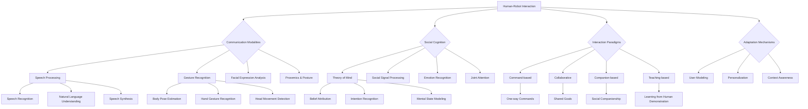

import Tabs from '@theme/Tabs';
import TabItem from '@theme/TabItem';

## Learning Outcomes

After completing this chapter, you will be able to:
1. Analyze the principles and challenges of effective human-robot interaction (HRI).
2. Implement multimodal communication interfaces combining speech, gesture, and visual feedback.
3. Design systems that interpret human intent from natural language and non-verbal cues.
4. Evaluate and implement social conventions for appropriate robot behavior.
5. Apply theory of mind concepts to enable robots to model human beliefs and intentions.
6. Create adaptive systems that adjust interaction style based on user preferences.
7. Assess the safety and ethical considerations in human-robot communication systems.
8. Design collaborative interfaces that enable effective human-robot teamwork.

## Gherkin Specifications

<Tabs
  defaultValue="spec1"
  values={[
    {label: 'Specification 1', value: 'spec1'},
    {label: 'Specification 2', value: 'spec2'},
    {label: 'Specification 3', value: 'spec3'},
    {label: 'Specification 4', value: 'spec4'},
    {label: 'Specification 5', value: 'spec5'},
  ]}>
  <TabItem value="spec1">

### Given human command, When processing with HRI system, Then robot should interpret intent correctly

```gherkin
Given a human-robot interaction system with natural language understanding
When a human provides a command in natural language
Then the robot should correctly interpret the intent and respond appropriately
```

  </TabItem>
  <TabItem value="spec2">

### Given social context, When robot interacts, Then it should follow appropriate social conventions

```gherkin
Given a robot operating in a human-populated environment
When engaging in interactions with humans
Then it should follow appropriate social conventions and etiquette
```

  </TabItem>
  <TabItem value="spec3">

### Given multimodal input, When processing, Then robot should integrate multiple communication channels

```gherkin
Given a robot receiving input from speech, gesture, and visual cues
When processing the communication
Then it should integrate information from all modalities for better understanding
```

  </TabItem>
  <TabItem value="spec4">

### Given different users, When interacting, Then robot should adapt communication style

```gherkin
Given a robot interacting with different users with varying preferences
When engaging in communication
Then it should adapt its communication style to match user preferences
```

  </TabItem>
  <TabItem value="spec5">

### Given collaborative task, When executing, Then robot should communicate progress and needs

```gherkin
Given humans and robot collaborating on a task
When executing the task steps
Then the robot should communicate progress, needs, and intentions appropriately
```

  </TabItem>
</Tabs>

## Theory & Intuition

Human-Robot Interaction (HRI) sits at the intersection of robotics, cognitive science, psychology, and computer science. The goal is to create robots that can interact naturally and effectively with humans, understanding not just the literal meaning of words but also context, intent, social cues, and emotional states. Think of how humans naturally communicate with each other using a combination of speech, gesture, facial expressions, and contextual understanding—HRI aims to endow robots with similar capabilities.

The fundamental challenge in HRI is that humans and robots operate with different cognitive architectures, communication modalities, and expectations. Humans naturally expect robots to understand implicit meanings, follow social conventions, and respond appropriately to non-verbal cues, while robots must be explicitly programmed to recognize and respond to these complex social signals.

Multimodal communication is essential in HRI because humans naturally communicate through multiple channels simultaneously. When you ask someone to pass the salt, you might say "Pass the salt, please" while pointing to it, making eye contact, and using appropriate facial expressions. An effective HRI system must process all these modalities together to understand the complete communication.

Social signal processing involves recognizing and interpreting human social behaviors like head nods, eye contact, gestures, and proxemics (personal space). These signals convey important information about attention, agreement, disagreement, and emotional states that are crucial for effective interaction.

Theory of Mind (ToM) in robots refers to the ability to attribute mental states—beliefs, intents, desires, emotions, knowledge—to humans and to understand that others have beliefs and perspectives that are different from their own. This enables robots to predict human behavior and respond appropriately.

Trust and transparency are critical elements in HRI. Humans need to understand what the robot is doing, why it's doing it, and what it's going to do next. Explainable AI techniques help robots communicate their decision-making processes to humans, building trust and enabling more effective collaboration.

## Core Concepts

<Tabs
  defaultValue="diagram"
  values={[
    {label: 'Mermaid Diagram', value: 'diagram'},
    {label: 'Concept Table', value: 'table'},
  ]}>
  <TabItem value="diagram">



  </TabItem>
  <TabItem value="table">

| Concept | Definition | Application |
|--------|------------|-------------|
| Multimodal Communication | Integration of multiple communication channels | Combining speech, gesture, and visual cues |
| Theory of Mind | Modeling human beliefs and intentions | Predicting human behavior and responses |
| Social Signal Processing | Recognition of human social behaviors | Detecting gestures, gaze, and emotional states |
| Joint Attention | Shared focus of attention between human and robot | Collaborative task execution |
| Proxemics | Study of personal space and distances | Appropriate robot positioning during interaction |
| Trust Building | Establishing confidence in robot behavior | Transparency in decision-making processes |

  </TabItem>
</Tabs>

## Hands-On Labs

<Tabs
  defaultValue="lab1"
  values={[
    {label: 'Lab 1: Multimodal Human-Robot Communication Interface', value: 'lab1'},
    {label: 'Lab 2: Intent Recognition from Natural Language and Gesture', value: 'lab2'},
    {label: 'Lab 3: Socially-Aware Robot Navigation', value: 'lab3'},
  ]}>
  <TabItem value="lab1">

### Lab 1: Implementing a Multimodal Communication Interface

#### Objective
Create a communication interface that integrates speech, gesture recognition, and visual feedback for human-robot interaction.

#### Prerequisites
- Understanding of ROS 2
- Knowledge of speech recognition and synthesis
- Basic computer vision knowledge

#### Steps
1. Set up speech recognition and synthesis modules
2. Implement gesture recognition using computer vision
3. Create visual feedback mechanisms
4. Integrate modalities into a unified HRI system

#### Code Example
```python
#!/usr/bin/env python3
import rclpy
from rclpy.node import Node
from std_msgs.msg import String
from sensor_msgs.msg import Image, CameraInfo
from geometry_msgs.msg import Point
from visualization_msgs.msg import Marker
import numpy as np
import cv2
import speech_recognition as sr
import pyttsx3
import threading
import queue

class MultimodalHRI(Node):
    def __init__(self):
        super().__init__('multimodal_hri')
        
        # Publishers
        self.speech_publisher = self.create_publisher(String, '/robot_speech', 10)
        self.gesture_publisher = self.create_publisher(String, '/detected_gestures', 10)
        self.visual_feedback_pub = self.create_publisher(Marker, '/visual_feedback', 10)
        self.command_publisher = self.create_publisher(String, '/robot_commands', 10)
        
        # Subscribers
        self.image_sub = self.create_subscription(Image, '/camera/image_raw', self.image_callback, 10)
        self.audio_sub = self.create_subscription(String, '/audio_input', self.audio_callback, 10)
        
        # Initialize speech recognition and synthesis
        self.speech_recognizer = sr.Recognizer()
        self.speech_recognizer.energy_threshold = 3000  # Adjust sensitivity
        self.text_to_speech_engine = pyttsx3.init()
        
        # State variables
        self.current_image = None
        self.command_queue = queue.Queue()
        self.gesture_history = []
        
        # Start speech recognition thread
        self.speech_thread = threading.Thread(target=self.speech_recognition_worker)
        self.speech_thread.daemon = True
        self.speech_thread.start()
        
        self.get_logger().info("Multimodal HRI system initialized")

    def speech_recognition_worker(self):
        """Background thread for continuous speech recognition"""
        with sr.Microphone() as source:
            self.speech_recognizer.adjust_for_ambient_noise(source)
            
            while rclpy.ok():
                try:
                    # Listen for speech with timeout
                    audio = self.speech_recognizer.listen(source, timeout=1.0, phrase_time_limit=5.0)
                    
                    # Recognize speech
                    text = self.speech_recognizer.recognize_google(audio)
                    self.get_logger().info(f"Recognized: {text}")
                    
                    # Publish to ROS system
                    speech_msg = String()
                    speech_msg.data = text
                    self.command_queue.put(text)
                    
                except sr.WaitTimeoutError:
                    # Expected timeout when no speech detected
                    continue
                except sr.UnknownValueError:
                    self.get_logger().info("Could not understand audio")
                except sr.RequestError as e:
                    self.get_logger().error(f"Speech recognition error: {e}")

    def image_callback(self, msg):
        """Process incoming image for gesture recognition"""
        # Convert ROS Image to OpenCV (simplified - would use cv_bridge in practice)
        # For this example, we'll create a dummy image processing
        self.current_image = msg
        self.process_gestures()

    def process_gestures(self):
        """Process current image to detect gestures"""
        if self.current_image is None:
            return
        
        # Simplified gesture detection (in practice, use proper computer vision algorithms)
        # For this example, we'll simulate gesture detection
        detected_gestures = []
        
        # Simulate detecting hand gestures (in practice, use OpenCV, MediaPipe, etc.)
        # Detect if hand is in upper part of image (pointing gesture)
        hand_up = np.random.random() > 0.7  # Random simulation
        if hand_up:
            detected_gestures.append("pointing_up")
        
        # Detect if hand is in lower part of image
        hand_down = np.random.random() > 0.7
        if hand_down:
            detected_gestures.append("pointing_down")
        
        # Detect if two hands are visible (clapping gesture)
        clap = np.random.random() > 0.8
        if clap:
            detected_gestures.append("clap")
        
        # Publish detected gestures
        if detected_gestures:
            gesture_msg = String()
            gesture_msg.data = ", ".join(detected_gestures)
            self.gesture_publisher.publish(gesture_msg)
            self.gesture_history.extend(detected_gestures)
            
            self.get_logger().info(f"Detected gestures: {detected_gestures}")

    def audio_callback(self, msg):
        """Process audio input from microphone"""
        self.get_logger().info(f"Audio command received: {msg.data}")
        self.process_command(msg.data)

    def process_command(self, command_text):
        """Process combined speech and gesture commands"""
        # Check recent gestures
        recent_gestures = self.gesture_history[-5:]  # Last 5 gestures
        
        # Simple rule-based processing (in practice, use more sophisticated NLU)
        if "move" in command_text.lower():
            if "pointing_up" in recent_gestures:
                action = "move_forward"
            elif "pointing_down" in recent_gestures:
                action = "move_backward"
            else:
                action = "move_forward"  # default
        elif "stop" in command_text.lower():
            action = "stop"
        elif "turn" in command_text.lower():
            action = "turn"
        else:
            action = "unknown"
        
        # Publish robot command
        cmd_msg = String()
        cmd_msg.data = action
        self.command_publisher.publish(cmd_msg)
        
        # Provide visual feedback
        self.provide_visual_feedback(action)
        
        self.get_logger().info(f"Processed command resulted in action: {action}")

    def provide_visual_feedback(self, action):
        """Provide visual feedback using markers"""
        marker = Marker()
        marker.header.frame_id = "base_link"
        marker.header.stamp = self.get_clock().now().to_msg()
        marker.ns = "hri_feedback"
        marker.id = 0
        marker.type = Marker.TEXT_VIEW_FACING
        marker.action = Marker.ADD
        
        # Position feedback marker above the robot
        marker.pose.position.x = 0.0
        marker.pose.position.y = 0.0
        marker.pose.position.z = 1.0
        marker.pose.orientation.w = 1.0
        
        # Scale and color
        marker.scale.z = 0.3
        marker.color.a = 1.0
        marker.color.r = 1.0
        marker.color.g = 1.0
        marker.color.b = 1.0
        
        # Set text based on action
        marker.text = f"Action: {action}"
        self.visual_feedback_pub.publish(marker)

def main(args=None):
    rclpy.init(args=args)
    hri_node = MultimodalHRI()
    
    try:
        rclpy.spin(hri_node)
    except KeyboardInterrupt:
        pass
    finally:
        hri_node.destroy_node()
        rclpy.shutdown()

if __name__ == '__main__':
    main()
```

#### Expected Outcome
A system that can receive and process speech commands and gestures, integrating both modalities to understand and respond to human requests appropriately.

  </TabItem>
  <TabItem value="lab2">

### Lab 2: Intent Recognition from Natural Language and Gesture

#### Objective
Implement a system that recognizes human intent by combining natural language processing and gesture recognition.

#### Prerequisites
- Knowledge of NLP and computer vision
- Experience with machine learning
- Understanding of intent recognition

#### Steps
1. Create intent recognition models for language and gestures
2. Implement multimodal fusion techniques
3. Test with combined language and gesture inputs
4. Evaluate the effectiveness of multimodal recognition

#### Code Example
```python
#!/usr/bin/env python3
import rclpy
from rclpy.node import Node
from std_msgs.msg import String
from geometry_msgs.msg import Twist
import numpy as np
from sklearn.feature_extraction.text import TfidfVectorizer
from sklearn.svm import SVC
from sklearn.naive_bayes import GaussianNB
from sklearn.model_selection import train_test_split
from sklearn.metrics import classification_report
import nltk
from nltk.corpus import stopwords
import re
import joblib

class IntentRecognitionNode(Node):
    def __init__(self):
        super().__init__('intent_recognition_node')
        
        # Publishers and subscribers
        self.command_publisher = self.create_publisher(Twist, '/cmd_vel', 10)
        self.intent_publisher = self.create_publisher(String, '/recognized_intent', 10)
        
        self.language_sub = self.create_subscription(String, '/language_input', self.language_callback, 10)
        self.gesture_sub = self.create_subscription(String, '/gesture_input', self.gesture_callback, 10)
        
        # Store current inputs
        self.current_language = ""
        self.current_gesture = ""
        
        # Initialize intent recognition model
        self.intent_model = None
        self.vectorizer = None
        self.setup_intent_recognition()
        
        # Timer for processing combined inputs
        self.process_timer = self.create_timer(0.5, self.process_combined_inputs)
        
        self.get_logger().info("Intent Recognition Node initialized")

    def setup_intent_recognition(self):
        """Setup intent recognition with sample training data"""
        # Sample training data (in practice, you'd have much more data)
        language_samples = [
            "move forward", "go forward", "move ahead", "go ahead",
            "move backward", "go back", "move back", "reverse",
            "turn left", "turn left please", "rotate left", "pivot left",
            "turn right", "turn right please", "rotate right", "pivot right",
            "stop", "stop now", "halt", "freeze"
        ]
        
        gesture_samples = [
            "pointing_forward", "pointing_forward", "pointing_forward", "pointing_forward",
            "pointing_backward", "pointing_backward", "pointing_backward", "pointing_backward",
            "swiping_left", "swiping_left", "swiping_left", "swiping_left",
            "swiping_right", "swiping_right", "swiping_right", "swiping_right",
            "palm_stop", "palm_stop", "palm_stop", "palm_stop"
        ]
        
        # Combined inputs and labels
        combined_features = [(lang, gest) for lang, gest in zip(language_samples, gesture_samples)]
        intent_labels = [
            "move_forward", "move_forward", "move_forward", "move_forward",
            "move_backward", "move_backward", "move_backward", "move_backward",
            "turn_left", "turn_left", "turn_left", "turn_left",
            "turn_right", "turn_right", "turn_right", "turn_right",
            "stop", "stop", "stop", "stop"
        ]
        
        # Extract features from language (simplified TF-IDF approach)
        language_texts = [lang.lower() for lang, _ in combined_features]
        self.vectorizer = TfidfVectorizer(stop_words='english', ngram_range=(1, 2))
        language_features = self.vectorizer.fit_transform(language_texts).toarray()
        
        # Encode gestures as categorical features
        gesture_encoder = {}
        for gesture in set(gest for _, gest in combined_features):
            gesture_encoder[gesture] = len(gesture_encoder)
        
        gesture_features = np.array([gesture_encoder[gest] for _, gest in combined_features]).reshape(-1, 1)
        
        # Create combined feature matrix
        combined_language_gesture = np.hstack([language_features, gesture_features])
        
        # Train model
        self.intent_model = SVC(kernel='rbf', probability=True)
        self.intent_model.fit(combined_language_gesture, intent_labels)
        
        self.get_logger().info(f"Intent recognition model trained with {len(language_samples)} samples")
        
        # Store gesture encoder
        self.gesture_encoder = gesture_encoder

    def language_callback(self, msg):
        """Process incoming language input"""
        self.current_language = msg.data
        self.get_logger().info(f"Received language: {self.current_language}")

    def gesture_callback(self, msg):
        """Process incoming gesture input"""
        self.current_gesture = msg.data
        self.get_logger().info(f"Received gesture: {self.current_gesture}")

    def process_combined_inputs(self):
        """Process combined language and gesture inputs to recognize intent"""
        if not self.current_language or not self.current_gesture:
            return
        
        # Extract features from current language input
        language_vector = self.vectorizer.transform([self.current_language.lower()]).toarray()
        
        # Encode current gesture
        gesture_encoded = self.gesture_encoder.get(self.current_gesture, -1)
        if gesture_encoded == -1:
            # Unknown gesture, assign to a default class
            gesture_encoded = len(self.gesture_encoder)  # Use max index + 1 for unknown
    
        gesture_vector = np.array([[gesture_encoded]])
        
        # Combine features
        combined_input = np.hstack([language_vector, gesture_vector])
        
        # Predict intent
        predicted_intent = self.intent_model.predict(combined_input)[0]
        prediction_probs = self.intent_model.predict_proba(combined_input)[0]
        confidence = max(prediction_probs)
        
        # Publish recognized intent
        intent_msg = String()
        intent_msg.data = f"{predicted_intent} (confidence: {confidence:.2f})"
        self.intent_publisher.publish(intent_msg)
        
        # Execute appropriate action based on intent
        self.execute_robot_action(predicted_intent)
        
        self.get_logger().info(f"Recognized intent: {predicted_intent} with confidence: {confidence:.2f}")

    def execute_robot_action(self, intent):
        """Execute appropriate robot action based on recognized intent"""
        cmd = Twist()
        
        if intent == "move_forward":
            cmd.linear.x = 0.5
        elif intent == "move_backward":
            cmd.linear.x = -0.5
        elif intent == "turn_left":
            cmd.angular.z = 0.5
        elif intent == "turn_right":
            cmd.angular.z = -0.5
        elif intent == "stop":
            cmd.linear.x = 0.0
            cmd.angular.z = 0.0
        
        self.command_publisher.publish(cmd)
        
        self.get_logger().info(f"Executing action for intent: {intent}")

def main(args=None):
    rclpy.init(args=args)
    intent_node = IntentRecognitionNode()
    
    try:
        rclpy.spin(intent_node)
    except KeyboardInterrupt:
        pass
    finally:
        intent_node.destroy_node()
        rclpy.shutdown()

if __name__ == '__main__':
    main()
```

#### Expected Outcome
A system that can recognize human intent by combining natural language understanding and gesture recognition, leading to more robust and accurate interpretation of human commands.

  </TabItem>
  <TabItem value="lab3">

### Lab 3: Socially-Aware Robot Navigation

#### Objective
Implement a navigation system that considers social conventions and human-aware path planning.

#### Prerequisites
- Knowledge of ROS 2 navigation stack
- Understanding of social robotics concepts
- Experience with path planning algorithms

#### Steps
1. Implement social force model for human-aware navigation
2. Create personal space detection for humans
3. Develop socially appropriate navigation behaviors
4. Test navigation in environments with humans

#### Code Example
```python
#!/usr/bin/env python3
import rclpy
from rclpy.node import Node
from geometry_msgs.msg import PoseWithCovarianceStamped, Twist, Point
from sensor_msgs.msg import LaserScan
from nav_msgs.msg import Odometry
from std_msgs.msg import String
from visualization_msgs.msg import Marker, MarkerArray
import numpy as np
import math

class SociallyAwareNavigation(Node):
    def __init__(self):
        super().__init__('socially_aware_navigation')
        
        # Publishers
        self.cmd_vel_publisher = self.create_publisher(Twist, '/cmd_vel', 10)
        self.visual_publisher = self.create_publisher(MarkerArray, '/social_navigation_markers', 10)
        
        # Subscribers
        self.odom_sub = self.create_subscription(Odometry, '/odom', self.odom_callback, 10)
        self.scan_sub = self.create_subscription(LaserScan, '/scan', self.scan_callback, 10)
        self.goal_sub = self.create_subscription(PoseWithCovarianceStamped, '/move_base_simple/goal', 
                                                self.goal_callback, 10)
        
        # Robot state
        self.robot_pos = Point()
        self.robot_yaw = 0.0
        self.human_positions = []
        self.target_goal = None
        self.social_space_radius = 1.0  # Personal space radius in meters
        
        # Navigation parameters
        self.linear_speed = 0.3
        self.angular_speed = 0.5
        self.min_distance_to_human = 0.8  # Minimum distance to maintain from humans
        
        # Navigation timer
        self.nav_timer = self.create_timer(0.1, self.social_navigation_cycle)
        
        self.get_logger().info("Socially Aware Navigation initialized")

    def odom_callback(self, msg):
        """Update robot position from odometry"""
        self.robot_pos.x = msg.pose.pose.position.x
        self.robot_pos.y = msg.pose.pose.position.y
        
        # Convert quaternion to yaw
        quat = msg.pose.pose.orientation
        siny_cosp = 2 * (quat.w * quat.z + quat.x * quat.y)
        cosy_cosp = 1 - 2 * (quat.y * quat.y + quat.z * quat.z)
        self.robot_yaw = math.atan2(siny_cosp, cosy_cosp)

    def scan_callback(self, msg):
        """Detect humans from laser scan data"""
        # This is a simplified approach
        # In practice, use computer vision or more sophisticated human detection
        self.human_positions = []
        
        # Convert scan data to Cartesian coordinates
        angle_min = msg.angle_min
        angle_increment = msg.angle_increment
        
        for i, range_val in enumerate(msg.ranges):
            if not (math.isnan(range_val) or math.isinf(range_val)):
                # Only consider ranges within reasonable distance
                if 0.5 < range_val < 3.0:  # Between 0.5m and 3m
                    angle = angle_min + i * angle_increment
                    x = self.robot_pos.x + range_val * math.cos(self.robot_yaw + angle)
                    y = self.robot_pos.y + range_val * math.sin(self.robot_yaw + angle)
                    
                    # In a real system, you'd use more sophisticated methods to detect humans
                    # For this example, we'll consider any object in a certain distance range as a "human"
                    self.human_positions.append(Point(x=x, y=y, z=0.0))
    
    def goal_callback(self, msg):
        """Receive navigation goal"""
        self.target_goal = msg.pose.pose.position
        self.get_logger().info(f"Received navigation goal: ({self.target_goal.x:.2f}, {self.target_goal.y:.2f})")

    def calculate_social_force(self, human_pos):
        """Calculate repulsive force from a human"""
        # Calculate vector from robot to human
        dx = human_pos.x - self.robot_pos.x
        dy = human_pos.y - self.robot_pos.y
        distance = math.sqrt(dx*dx + dy*dy)
        
        # If too close, apply strong repulsive force
        if distance < self.min_distance_to_human:
            # Normalize direction vector (from human to robot)
            if distance > 0:
                dx /= distance
                dy /= distance
            else:
                # If at same position, use arbitrary direction
                dx, dy = 1.0, 0.0
            
            # Calculate repulsive force (stronger when closer)
            force_magnitude = 5.0 / (distance + 0.1)  # +0.1 to avoid division by zero
            return dx * force_magnitude, dy * force_magnitude
        
        return 0.0, 0.0

    def calculate_navigation_force(self):
        """Calculate attractive force toward navigation goal"""
        if self.target_goal is None:
            return 0.0, 0.0
        
        # Calculate vector from robot to goal
        dx = self.target_goal.x - self.robot_pos.x
        dy = self.target_goal.y - self.robot_pos.y
        distance = math.sqrt(dx*dx + dy*dy)
        
        # Normalize and scale
        if distance > 0:
            dx /= distance
            dy /= distance
        
        # Scale based on distance (weaker when closer to goal)
        force_magnitude = min(1.0, distance)  # Max force when far away
        return dx * force_magnitude, dy * force_magnitude

    def social_navigation_cycle(self):
        """Main navigation cycle with social awareness"""
        if self.target_goal is None:
            return
        
        # Calculate navigation force (attractive to goal)
        nav_force_x, nav_force_y = self.calculate_navigation_force()
        
        # Calculate social forces from humans (repulsive)
        social_force_x, social_force_y = 0.0, 0.0
        
        for human_pos in self.human_positions:
            hfx, hfy = self.calculate_social_force(human_pos)
            social_force_x += hfx
            social_force_y += hfy
        
        # Combine forces
        total_force_x = nav_force_x + social_force_x
        total_force_y = nav_force_y + social_force_y
        
        # Normalize total force
        total_force_mag = math.sqrt(total_force_x*total_force_x + total_force_y*total_force_y)
        if total_force_mag > 0:
            target_angle = math.atan2(total_force_y, total_force_x)
        else:
            target_angle = self.robot_yaw  # Keep current heading if no force
        
        # Calculate robot's current heading error
        angle_error = target_angle - self.robot_yaw
        # Normalize angle to [-pi, pi]
        while angle_error > math.pi:
            angle_error -= 2 * math.pi
        while angle_error < -math.pi:
            angle_error += 2 * math.pi
        
        # Create command based on heading error
        cmd = Twist()
        
        # If we're close to the goal, reduce speed
        goal_distance = math.sqrt((self.target_goal.x - self.robot_pos.x)**2 + 
                                 (self.target_goal.y - self.robot_pos.y)**2)
        
        if goal_distance < 0.5:
            cmd.linear.x = 0.0
            cmd.angular.z = 0.0
        else:
            # Apply angular velocity based on heading error
            cmd.angular.z = max(-self.angular_speed, min(self.angular_speed, angle_error * 2.0))
            
            # Apply linear velocity based on social context
            # Reduce speed when close to humans
            min_human_dist = float('inf')
            for human_pos in self.human_positions:
                dist = math.sqrt((human_pos.x - self.robot_pos.x)**2 + 
                               (human_pos.y - self.robot_pos.y)**2)
                min_human_dist = min(min_human_dist, dist)
            
            # Reduce speed when close to humans
            speed_factor = max(0.2, min(1.0, (min_human_dist - 0.3) / 1.0))
            cmd.linear.x = max(0.0, self.linear_speed * speed_factor)
        
        # Publish command
        self.cmd_vel_publisher.publish(cmd)
        
        # Publish visualization markers
        self.publish_visualization(nav_force_x, nav_force_y, social_force_x, social_force_y)
        
        self.get_logger().info(f"Social Nav - Linear: {cmd.linear.x:.2f}, Angular: {cmd.angular.z:.2f}")

    def publish_visualization(self, nav_force_x, nav_force_y, social_force_x, social_force_y):
        """Publish visualization markers for forces"""
        marker_array = MarkerArray()
        
        # Robot marker
        robot_marker = Marker()
        robot_marker.header.frame_id = "map"
        robot_marker.id = 1
        robot_marker.type = Marker.SPHERE
        robot_marker.action = Marker.ADD
        robot_marker.pose.position = self.robot_pos
        robot_marker.pose.orientation.w = 1.0
        robot_marker.scale.x = 0.3
        robot_marker.scale.y = 0.3
        robot_marker.scale.z = 0.3
        robot_marker.color.r = 0.0
        robot_marker.color.g = 1.0
        robot_marker.color.b = 0.0
        robot_marker.color.a = 1.0
        marker_array.markers.append(robot_marker)
        
        # Human markers
        for i, human_pos in enumerate(self.human_positions):
            human_marker = Marker()
            human_marker.header.frame_id = "map"
            human_marker.id = 100 + i
            human_marker.type = Marker.CYLINDER
            human_marker.action = Marker.ADD
            human_marker.pose.position = human_pos
            human_marker.pose.position.z = 0.5  # Make it visible above ground
            human_marker.pose.orientation.w = 1.0
            human_marker.scale.x = 0.4
            human_marker.scale.y = 0.4
            human_marker.scale.z = 1.0
            human_marker.color.r = 1.0
            human_marker.color.g = 1.0
            human_marker.color.b = 0.0
            human_marker.color.a = 1.0
        marker_array.markers.append(human_marker)
        
        # Navigation force marker
        nav_force_marker = Marker()
        nav_force_marker.header.frame_id = "map"
        nav_force_marker.id = 200
        nav_force_marker.type = Marker.ARROW
        nav_force_marker.action = Marker.ADD
        nav_force_marker.pose.position = self.robot_pos
        nav_force_marker.pose.orientation.w = 1.0
        nav_force_marker.scale.x = math.sqrt(nav_force_x**2 + nav_force_y**2) * 2.0
        nav_force_marker.scale.y = 0.1
        nav_force_marker.scale.z = 0.1
        nav_force_marker.color.r = 0.0
        nav_force_marker.color.g = 0.0
        nav_force_marker.color.b = 1.0
        nav_force_marker.color.a = 1.0
        marker_array.markers.append(nav_force_marker)
        
        # Social force marker
        social_force_marker = Marker()
        social_force_marker.header.frame_id = "map"
        social_force_marker.id = 201
        social_force_marker.type = Marker.ARROW
        social_force_marker.action = Marker.ADD
        social_force_marker.pose.position = self.robot_pos
        social_force_marker.pose.orientation.w = 1.0
        social_force_marker.scale.x = math.sqrt(social_force_x**2 + social_force_y**2) * 2.0
        social_force_marker.scale.y = 0.1
        social_force_marker.scale.z = 0.1
        social_force_marker.color.r = 1.0
        social_force_marker.color.g = 0.0
        social_force_marker.color.b = 1.0
        social_force_marker.color.a = 1.0
        marker_array.markers.append(social_force_marker)
        
        self.visual_publisher.publish(marker_array)

def main(args=None):
    rclpy.init(args=args)
    nav_node = SociallyAwareNavigation()
    
    try:
        rclpy.spin(nav_node)
    except KeyboardInterrupt:
        pass
    finally:
        nav_node.destroy_node()
        rclpy.shutdown()

if __name__ == '__main__':
    main()
```

#### Expected Outcome
A navigation system that can navigate around humans while respecting personal space and following socially appropriate behaviors like yielding and adjusting speed near humans.

  </TabItem>
</Tabs>

## Sim-to-Real Notes

When implementing human-robot interaction systems on real hardware, several practical considerations become critical:

1. **Real-Time Performance**: HRI systems often require processing multiple input modalities simultaneously. Optimize speech recognition, gesture detection, and language processing to run within real-time constraints. For the Jetson Orin Nano, leverage GPU acceleration for computationally intensive tasks like computer vision.

2. **Robustness to Environmental Conditions**: Real-world lighting, noise, and acoustic conditions vary significantly. Implement adaptive algorithms that can adjust to different environments. For speech recognition, consider noise cancellation and beamforming techniques.

3. **Privacy Considerations**: HRI systems often use cameras and microphones, raising privacy concerns. Implement privacy-preserving techniques where possible, such as local processing instead of cloud-based processing for sensitive interactions.

4. **Cultural Sensitivity**: Social conventions and communication styles vary across cultures. Design HRI systems that can be adapted to different cultural contexts and user preferences.

5. **Safety in Close Proximity**: When robots operate in close proximity to humans, implement additional safety measures. This includes collision avoidance, emergency stops, and ensuring robot movements are predictable and safe.

6. **Calibration and Adaptation**: Real sensors and effectors require calibration. Implement automatic calibration procedures and adaptation mechanisms that can adjust to individual users and changing conditions.

For the Unitree robot platforms, consider the dynamic nature of legged locomotion when designing interaction systems. Ensure that the robot's responses to human commands are appropriate for its current state (standing, walking, etc.).

## Multiple Choice Questions

<Tabs
  defaultValue="mcq1"
  values={[
    {label: 'Q1-3', value: 'mcq1'},
    {label: 'Q4-6', value: 'mcq2'},
    {label: 'Q7-9', value: 'mcq3'},
    {label: 'Q10-12', value: 'mcq4'},
    {label: 'Q13-15', value: 'mcq5'},
  ]}>
  <TabItem value="mcq1">

1. **What is the primary goal of Human-Robot Interaction (HRI)?**
   - A) To replace humans with robots
   - B) To create robots that can interact naturally and effectively with humans
   - C) To make robots faster than humans
   - D) To reduce the cost of robots

   **Correct Answer: B** - The primary goal of HRI is to create robots that can interact naturally and effectively with humans, understanding various communication modalities.

2. **What does 'multimodal communication' mean in HRI?**
   - A) Communication using only speech
   - B) Integration of multiple communication channels like speech, gesture, and visual cues
   - C) Communication with multiple robots
   - D) Communication using multiple languages

   **Correct Answer: B** - Multimodal communication involves integrating multiple communication channels like speech, gesture, and visual cues.

3. **What does 'Theory of Mind' refer to in robot systems?**
   - A) The robot's understanding of its own hardware
   - B) The robot's ability to attribute mental states to humans
   - C) The robot's memory capacity
   - D) The robot's computational speed

   **Correct Answer: B** - Theory of Mind refers to the robot's ability to attribute mental states (beliefs, intents, desires) to humans.

  </TabItem>
  <TabItem value="mcq2">

4. **Why is 'joint attention' important in HRI?**
   - A) To synchronize robot movements
   - B) To enable shared focus of attention between human and robot
   - C) To improve robot vision
   - D) To increase robot processing speed

   **Correct Answer: B** - Joint attention enables shared focus of attention between human and robot, which is important for collaboration.

5. **What is 'proxemics' in the context of HRI?**
   - A) The study of robot programming
   - B) The study of personal space and distances in interaction
   - C) The speed of robot movement
   - D) The power consumption of robots

   **Correct Answer: B** - Proxemics is the study of personal space and distances in human interaction, important for appropriate robot positioning.

6. **What is the purpose of 'social signal processing' in HRI?**
   - A) Processing robot control signals
   - B) Recognizing and interpreting human social behaviors like gestures and gaze
   - C) Improving robot communication with other robots
   - D) Reducing robot computational load

   **Correct Answer: B** - Social signal processing involves recognizing and interpreting human social behaviors like gestures and gaze.

  </TabItem>
  <TabItem value="mcq3">

7. **What is a critical aspect of trust building in HRI?**
   - A) Making robots move faster
   - B) Ensuring transparency in robot decision-making processes
   - C) Reducing robot cost
   - D) Increasing robot autonomy

   **Correct Answer: B** - Trust building in HRI requires transparency in robot decision-making processes so humans can understand robot behavior.

8. **Which interaction paradigm focuses on humans and robots working together toward shared goals?**
   - A) Command-based
   - B) Collaborative
   - C) Companion-based
   - D) Teaching-based

   **Correct Answer: B** - The collaborative interaction paradigm focuses on humans and robots working together toward shared goals.

9. **What is 'social navigation' in the context of HRI?**
   - A) Navigation using GPS signals
   - B) Navigation that considers social conventions and human-aware path planning
   - C) Navigation in large groups
   - D) Navigation using social media data

   **Correct Answer: B** - Social navigation involves navigation that considers social conventions and human-aware path planning.

  </TabItem>
  <TabItem value="mcq4">

10. **What is a significant challenge for real-time HRI systems?**
    - A) Too much available processing power
    - B) Processing multiple input modalities simultaneously within time constraints
    - C) Excessive network bandwidth
    - D) Lack of programming languages

    **Correct Answer: B** - Processing multiple input modalities simultaneously while meeting real-time constraints is a significant challenge for HRI systems.

11. **Why is cultural sensitivity important in HRI systems?**
    - A) To reduce computational requirements
    - B) Because social conventions and communication styles vary across cultures
    - C) To increase robot speed
    - D) To reduce robot manufacturing costs

    **Correct Answer: B** - Cultural sensitivity is important because social conventions and communication styles vary significantly across different cultures.

12. **What safety consideration is especially important in close-proximity HRI?**
    - A) Network security
    - B) Ensuring robot movements are predictable and safe around humans
    - C) Data encryption
    - D) Reducing robot weight

    **Correct Answer: B** - Ensuring robot movements are predictable and safe around humans is especially important in close-proximity HRI.

  </TabItem>
  <TabItem value="mcq5">

13. **What does 'personalization' in HRI refer to?**
    - A) Customizing robot hardware
    - B) Adjusting robot behavior based on individual user preferences
    - C) Painting robots in different colors
    - D) Increasing robot processing power

    **Correct Answer: B** - Personalization in HRI refers to adjusting robot behavior based on individual user preferences.

14. **Which approach best describes multimodal intent recognition?**
    - A) Using only speech commands
    - B) Combining multiple input modalities like language and gesture for better intent understanding
    - C) Using multiple robots simultaneously
    - D) Implementing multiple programming languages

    **Correct Answer: B** - Multimodal intent recognition combines multiple input modalities like language and gesture for better intent understanding.

15. **What is the main benefit of explainable AI in HRI?**
    - A) Faster processing
    - B) Building trust by making robot decision-making transparent to humans
    - C) Reducing computational requirements
    - D) Increasing robot autonomy

    **Correct Answer: B** - Explainable AI in HRI helps build trust by making robot decision-making transparent to humans.

  </TabItem>
</Tabs>

## Further Reading

<Tabs
  defaultValue="ref1"
  values={[
    {label: 'Research Papers', value: 'ref1'},
    {label: 'Books', value: 'ref2'},
    {label: 'Tutorials', value: 'ref3'},
    {label: 'Tools & Frameworks', value: 'ref4'},
  ]}>
  <TabItem value="ref1">

### Research Papers

1. [A Survey of Socially Interactive Robots](https://www.sciencedirect.com/science/article/pii/S0921889002003654) - Comprehensive overview of HRI research and design principles.

2. [Social Signal Processing for Human-Robot Interaction](https://ieeexplore.ieee.org/document/8465561) - Techniques for recognizing and interpreting human social signals.

3. [Trust in Human-Robot Interaction: A Review](https://link.springer.com/article/10.1007/s12369-021-00786-0) - Analysis of trust-building mechanisms in HRI.

4. [Multimodal Human-Robot Interaction: A Survey](https://arxiv.org/abs/2004.04335) - Comprehensive review of multimodal HRI approaches.

5. [Social Navigation: A Robot Navigation Approach for Human Environments](https://ieeexplore.ieee.org/document/6630965) - Methods for socially appropriate robot navigation.

  </TabItem>
  <TabItem value="ref2">

### Books

1. [Handbook of Robotics](https://www.springer.com/gp/book/9783319915300) by Siciliano and Khatib - Includes comprehensive section on human-robot interaction.

2. [Collaborative Mobile Robotics](https://www.wiley.com/en-us/Collaborative+Mobile+Robotics-p-9781119608422) by Cherubini - Covers human-robot collaboration concepts.

3. [Social Robotics: An Introduction](https://www.mit.edu/~air/pub/IntroductionSocialRobotics.pdf) by Breazeal - Foundational text on social robotics principles.

4. [The Social Machine: Designs for Living Online](https://mitpress.mit.edu/books/social-machine) - Relevant for understanding human interaction patterns.

5. [Designing Human-Robot Interaction: A Protocol-Based Approach](https://www.springer.com/gp/book/9783030505320) - Practical approaches to HRI design.

  </TabItem>
  <TabItem value="ref3">

### Tutorials

1. [ROS 2 Navigation for HRI](https://navigation.ros.org/tutorials/docs/get_back_to_the_future.html) - Tutorials on implementing navigation systems with HRI considerations.

2. [Speech Recognition for Robotics](https://github.com/Uberi/speech_recognition) - Practical tutorials for integrating speech recognition in robots.

3. [Gesture Recognition with MediaPipe](https://google.github.io/mediapipe/solutions/hands.html) - Tutorials for hand gesture recognition in HRI systems.

4. [Human-Robot Interaction with ROS](https://github.com/ros-hri/hri) - ROS packages and tutorials for HRI.

5. [Socially Assistive Robotics Course](https://sailing.cs.cmu.edu/courses/sar_fall2020/) - University course materials on social robotics.

  </TabItem>
  <TabItem value="ref4">

### Tools & Frameworks

1. [HRI Middleware](https://github.com/ros-hri/hri) - ROS 2 packages for human-robot interaction.

2. [OpenVINO Toolkit](https://software.intel.com/content/www/us/en/develop/tools/openvino-toolkit.html) - For optimizing speech and vision processing on Intel hardware.

3. [AISoy Robotics Emotion Engine](https://github.com/aisoy/robotics) - Framework for expressive robotic behaviors.

4. [Ginger NLP](https://ginger-nlp.github.io/) - Natural language processing toolkit for HRI applications.

5. [Social Robot Navigation](https://github.com/mrpt-ros-pkg/mrpt_navigation) - Navigation packages with social awareness.

  </TabItem>
</Tabs>