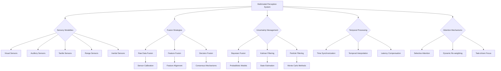

import Tabs from '@theme/Tabs';
import TabItem from '@theme/TabItem';

## Learning Outcomes

After completing this chapter, you will be able to:
1. Implement sensor fusion techniques to integrate information from multiple sensory modalities.
2. Design temporal alignment mechanisms for synchronizing asynchronous sensor data.
3. Apply uncertainty quantification methods to represent confidence in multimodal perception.
4. Create attention mechanisms that selectively focus on relevant sensory information.
5. Develop active sensing strategies for optimal information gathering.
6. Evaluate the effectiveness of multimodal perception systems in robotic applications.
7. Assess the computational requirements and trade-offs in multimodal processing.
8. Design robust perception systems that handle sensor failures and limitations.

## Gherkin Specifications

<Tabs
  defaultValue="spec1"
  values={[
    {label: 'Specification 1', value: 'spec1'},
    {label: 'Specification 2', value: 'spec2'},
    {label: 'Specification 3', value: 'spec3'},
    {label: 'Specification 4', value: 'spec4'},
    {label: 'Specification 5', value: 'spec5'},
  ]}>
  <TabItem value="spec1">

### Given multimodal sensor inputs, When processing with fusion algorithm, Then system should integrate information coherently

```gherkin
Given a robot with multiple sensors (camera, LIDAR, IMU, etc.)
When multimodal sensor fusion processes the inputs simultaneously
Then the system should produce a coherent and accurate perception of the environment
```

  </TabItem>
  <TabItem value="spec2">

### Given sensor failure, When detecting, Then system should adapt and use remaining sensors effectively

```gherkin
Given a multimodal perception system operating with multiple sensors
When one sensor fails or provides degraded data
Then the system should adapt by relying more heavily on remaining sensors
```

  </TabItem>
  <TabItem value="spec3">

### Given uncertain sensor data, When processing, Then system should quantify and represent uncertainty

```gherkin
Given a multimodal perception system with noisy sensor inputs
When processing the sensor data
Then the system should quantify and represent the uncertainty in its estimates
```

  </TabItem>
  <TabItem value="spec4">

### Given multiple sensory inputs, When processing, Then system should focus attention on relevant information

```gherkin
Given a robot receiving inputs from multiple sensors
When processing these inputs for a specific task
Then the system should selectively attend to the most relevant sensory information
```

  </TabItem>
  <TabItem value="spec5">

### Given environment information, When planning sensing actions, Then system should choose informative sensing modalities

```gherkin
Given a robot with multiple sensing capabilities
When deciding where and how to sense the environment
Then the system should choose sensing actions that provide maximum information gain
```

  </TabItem>
</Tabs>

## Theory & Intuition

Multimodal perception is the cognitive and computational process of integrating information from multiple sensory modalities to form a coherent understanding of the environment. Just as humans use vision, hearing, touch, and other senses simultaneously to navigate and interact with the world, robots must combine data from various sensors to achieve robust perception.

The fundamental principle behind multimodal perception is that information from different sensors is complementary. A camera can provide rich visual information about object appearance and scene structure, but may be limited in low-light conditions or by occlusions. A LIDAR sensor provides accurate depth information but with limited appearance details. By combining these modalities, a robot can achieve a more complete and robust understanding than with any single sensor.

Sensor fusion is the core technique behind multimodal perception, involving the integration of data from multiple sensors to produce more accurate and reliable estimates than would be possible with individual sensors. The fusion can occur at different levels: raw data fusion (combining raw sensor measurements), feature-level fusion (combining extracted features), or decision-level fusion (combining final decisions or classifications).

Temporal alignment is crucial for multimodal perception, as sensors often operate at different frequencies and may have varying latencies. For example, a camera might operate at 30 Hz while an IMU operates at 1000 Hz. Effective multimodal systems must synchronize and interpolate sensor readings to ensure that the fused perception accurately reflects the state of the environment at a common time.

Uncertainty reasoning is essential in multimodal perception. Each sensor provides measurements with different levels of accuracy and reliability. A good multimodal system quantifies this uncertainty and uses it to weight the contributions of different sensors appropriately. When one sensor experiences poor conditions (e.g., camera in darkness), the system should rely more heavily on other sensors.

Attention mechanisms in multimodal perception allow systems to selectively focus computational resources on the most relevant sensory information for a task. Just as humans don't process all sensory inputs with equal attention, robots can improve efficiency and performance by directing their processing toward the most informative modalities.

Active sensing refers to the intelligent control of sensor parameters and sensing actions to maximize information gain. This includes adjusting camera focus, zoom, or viewing direction, changing LIDAR resolution, or selecting which sensors to activate based on the current situation and task requirements.

## Core Concepts

<Tabs
  defaultValue="diagram"
  values={[
    {label: 'Mermaid Diagram', value: 'diagram'},
    {label: 'Concept Table', value: 'table'},
  ]}>
  <TabItem value="diagram">



  </TabItem>
  <TabItem value="table">

| Concept | Definition | Application |
|--------|------------|-------------|
| Sensor Fusion | Combining data from multiple sensors for better estimates | Improving accuracy and robustness of perception |
| Temporal Alignment | Synchronizing measurements from sensors operating at different rates | Coherent integration of asynchronous sensor data |
| Uncertainty Quantification | Representing confidence levels in perception estimates | Robust decision-making under uncertainty |
| Active Sensing | Intelligent control of sensors to maximize information gain | Efficient and targeted information gathering |
| Attention Mechanisms | Selective focus on relevant sensory information | Computational efficiency and improved performance |
| Cross-Modal Correspondence | Understanding relationships between different sensory modalities | Coherent interpretation of multimodal inputs |

  </TabItem>
</Tabs>

## Hands-On Labs

<Tabs
  defaultValue="lab1"
  values={[
    {label: 'Lab 1: Sensor Fusion for Localization', value: 'lab1'},
    {label: 'Lab 2: Temporal Alignment and Interpolation', value: 'lab2'},
    {label: 'Lab 3: Active Sensing for Information Gain', value: 'lab3'},
  ]}>
  <TabItem value="lab1">

### Lab 1: Implementing Sensor Fusion for Robot Localization

#### Objective
Create a sensor fusion system that combines visual, LIDAR, and IMU data for improved robot localization.

#### Prerequisites
- Understanding of ROS 2 and sensor messages
- Knowledge of Kalman filtering
- Experience with coordinate transformations

#### Steps
1. Set up subscribers for camera, LIDAR, and IMU sensors
2. Implement an Extended Kalman Filter (EKF) for sensor fusion
3. Test the fused localization in a simulated environment
4. Compare the performance with single-sensor approaches

#### Code Example
```python
#!/usr/bin/env python3
import rclpy
from rclpy.node import Node
from sensor_msgs.msg import Image, LaserScan, Imu
from nav_msgs.msg import Odometry
from geometry_msgs.msg import PoseWithCovarianceStamped, TwistWithCovarianceStamped
from tf2_ros import TransformBroadcaster
import numpy as np
from scipy.spatial.transform import Rotation as R
import math

class MultimodalSensorFusion(Node):
    def __init__(self):
        super().__init__('multimodal_sensor_fusion')
        
        # Publishers
        self.pose_pub = self.create_publisher(PoseWithCovarianceStamped, '/fused_pose', 10)
        self.odom_pub = self.create_publisher(Odometry, '/fused_odom', 10)
        
        # Subscribers
        self.image_sub = self.create_subscription(Image, '/camera/image_raw', self.image_callback, 10)
        self.scan_sub = self.create_subscription(LaserScan, '/scan', self.scan_callback, 10)
        self.imu_sub = self.create_subscription(Imu, '/imu', self.imu_callback, 10)
        
        # EKF state: [x, y, theta, vx, vy, omega]
        self.state = np.zeros(6)
        # State covariance matrix
        self.covariance = np.diag([1.0, 1.0, 0.1, 1.0, 1.0, 0.1])  # Start with some uncertainty
        
        # Sensor measurements cache
        self.imu_data = None
        self.visual_pose = None
        self.lidar_pose = None
        
        # Process noise covariance
        self.Q = np.diag([0.1, 0.1, 0.01, 0.2, 0.2, 0.05])  # Process noise
        
        # Timer for prediction and update
        self.fusion_timer = self.create_timer(0.05, self.prediction_step)  # 20 Hz
        self.update_timer = self.create_timer(0.1, self.update_step)       # 10 Hz
        
        # State transition model parameters
        self.dt = 0.05  # Time step based on prediction rate
        
        self.get_logger().info("Multimodal Sensor Fusion node initialized")

    def prediction_step(self):
        """Prediction step of the EKF"""
        if self.imu_data is not None:
            # Get IMU data
            ax = self.imu_data.linear_acceleration.x
            ay = self.imu_data.linear_acceleration.y
            wz = self.imu_data.angular_velocity.z
            
            # State transition model
            # For simplicity, using constant velocity model with IMU-based acceleration
            # x_{k+1} = x_k + vx_k * dt
            # y_{k+1} = y_k + vy_k * dt
            # theta_{k+1} = theta_k + omega_k * dt
            # vx_{k+1} = vx_k + ax * dt
            # vy_{k+1} = vy_k + ay * dt
            # omega_{k+1} = omega_k + alpha * dt (alpha assumed 0 for simplicity)
            
            F = np.array([
                [1, 0, -self.state[3]*self.dt, self.dt, 0, 0],
                [0, 1, -self.state[4]*self.dt, 0, self.dt, 0],
                [0, 0, 1, 0, 0, self.dt],
                [0, 0, 0, 1, 0, 0],
                [0, 0, 0, 0, 1, 0],
                [0, 0, 0, 0, 0, 1]
            ])
            
            # Update state
            self.state[0] += self.state[3] * self.dt
            self.state[1] += self.state[4] * self.dt
            self.state[2] += self.state[5] * self.dt
            self.state[3] += ax * self.dt
            self.state[4] += ay * self.dt
            # Angular velocity assumed constant
            
            # Update covariance
            self.covariance = F @ self.covariance @ F.T + self.Q

    def update_step(self):
        """Update step of the EKF with sensor measurements"""
        # Fuse different sensor measurements
        measurements = []
        R_matrices = []
        
        # Add visual pose measurement if available
        if self.visual_pose is not None:
            # Visual measurement: [x, y, theta]
            visual_z = np.array([self.visual_pose[0], self.visual_pose[1], self.visual_pose[2]])
            visual_R = np.diag([0.5, 0.5, 0.1])  # Visual measurement noise
            measurements.append(visual_z)
            R_matrices.append(visual_R)
        
        # Add LIDAR pose measurement if available
        if self.lidar_pose is not None:
            # LIDAR measurement: [x, y, theta]
            lidar_z = np.array([self.lidar_pose[0], self.lidar_pose[1], self.lidar_pose[2]])
            lidar_R = np.diag([0.3, 0.3, 0.15])  # LIDAR measurement noise
            measurements.append(lidar_z)
            R_matrices.append(lidar_R)
        
        # Perform measurement updates (simplified - assumes same measurement model)
        for i, z in enumerate(measurements):
            R_matrix = R_matrices[i]
            # Measurement model H (assuming direct measurement of x, y, theta)
            H = np.array([
                [1, 0, 0, 0, 0, 0],  # x measurement
                [0, 1, 0, 0, 0, 0],  # y measurement
                [0, 0, 1, 0, 0, 0]   # theta measurement
            ])
            
            # Calculate Kalman gain
            S = H @ self.covariance @ H.T + R_matrix
            K = self.covariance @ H.T @ np.linalg.inv(S)
            
            # Innovation
            y = z - H @ self.state[:3]  # Only x, y, theta part of state
            
            # Update state and covariance
            self.state[:3] += K[:3] @ y
            self.covariance = (np.eye(6) - K @ H) @ self.covariance

        # Publish the fused state
        self.publish_fused_state()

    def image_callback(self, msg):
        """Process visual odometry input (simplified)"""
        # In a real system, this would come from visual odometry
        # For this example, we'll simulate visual pose estimation
        self.visual_pose = [self.state[0] + np.random.normal(0, 0.1),
                           self.state[1] + np.random.normal(0, 0.1),
                           self.state[2] + np.random.normal(0, 0.02)]

    def scan_callback(self, msg):
        """Process LIDAR scan data"""
        # In a real system, this would come from LIDAR-based localization
        # For this example, we'll simulate LIDAR pose estimation
        self.lidar_pose = [self.state[0] + np.random.normal(0, 0.15),
                          self.state[1] + np.random.normal(0, 0.15),
                          self.state[2] + np.random.normal(0, 0.03)]

    def imu_callback(self, msg):
        """Process IMU data"""
        self.imu_data = msg

    def publish_fused_state(self):
        """Publish the fused state"""
        # Create and publish pose with covariance
        pose_msg = PoseWithCovarianceStamped()
        pose_msg.header.stamp = self.get_clock().now().to_msg()
        pose_msg.header.frame_id = "map"
        
        pose_msg.pose.pose.position.x = float(self.state[0])
        pose_msg.pose.pose.position.y = float(self.state[1])
        pose_msg.pose.pose.position.z = 0.0  # Assuming 2D
        
        # Convert heading to quaternion
        q = R.from_euler('z', self.state[2]).as_quat()
        pose_msg.pose.pose.orientation.x = float(q[0])
        pose_msg.pose.pose.orientation.y = float(q[1])
        pose_msg.pose.pose.orientation.z = float(q[2])
        pose_msg.pose.pose.orientation.w = float(q[3])
        
        # Flatten covariance matrix to 36-element array
        cov_2d = np.zeros((6, 6))
        # Only the position and orientation parts of the full 6x6 state covariance
        cov_2d[0:2, 0:2] = self.covariance[0:2, 0:2]  # x, y covariance
        cov_2d[5, 5] = self.covariance[2, 2]  # theta variance
        pose_msg.pose.covariance = cov_2d.flatten().tolist()
        
        self.pose_pub.publish(pose_msg)

def main(args=None):
    rclpy.init(args=args)
    fusion_node = MultimodalSensorFusion()
    
    try:
        rclpy.spin(fusion_node)
    except KeyboardInterrupt:
        pass
    finally:
        fusion_node.destroy_node()
        rclpy.shutdown()

if __name__ == '__main__':
    main()
```

#### Expected Outcome
A sensor fusion system that provides more accurate and robust robot localization by combining information from visual, LIDAR, and IMU sensors than any single sensor alone.

  </TabItem>
  <TabItem value="lab2">

### Lab 2: Temporal Alignment and Interpolation for Multimodal Data

#### Objective
Implement temporal alignment mechanisms to synchronize and interpolate asynchronous sensor data from multiple modalities.

#### Prerequisites
- Understanding of time-based data synchronization
- Knowledge of interpolation techniques
- Experience with ROS 2 time management

#### Steps
1. Create a data structure to store sensor readings with timestamps
2. Implement interpolation algorithms for different sensor types
3. Develop a temporal alignment algorithm
4. Test with simulated sensors operating at different frequencies

#### Code Example
```python
#!/usr/bin/env python3
import rclpy
from rclpy.node import Node
from sensor_msgs.msg import Image, LaserScan, Imu
from std_msgs.msg import Header
from geometry_msgs.msg import Vector3
from message_filters import ApproximateTimeSynchronizer, Subscriber
import numpy as np
from scipy.interpolate import interp1d
from collections import deque
import threading
import time
from enum import Enum

class SensorType(Enum):
    CAMERA = "camera"
    LIDAR = "lidar"
    IMU = "imu"
    GPS = "gps"

class SensorReading:
    def __init__(self, sensor_type, data, timestamp):
        self.sensor_type = sensor_type
        self.data = data
        self.timestamp = timestamp

class TemporalAligner(Node):
    def __init__(self):
        super().__init__('temporal_aligner')
        
        # Publishers for aligned data
        self.aligned_pub = self.create_publisher(
            # In practice, would create a custom message type
            # For this example, we'll just log the aligned data
        )
        
        # Subscribers
        self.image_sub = self.create_subscription(
            Image, '/camera/image_raw', self.image_callback, 10)
        self.scan_sub = self.create_subscription(
            LaserScan, '/scan', self.scan_callback, 10)
        self.imu_sub = self.create_subscription(
            Imu, '/imu', self.imu_callback, 10)
        
        # Storage for sensor readings
        self.sensor_buffer = {sensor_type: deque(maxlen=100) for sensor_type in SensorType}
        
        # Lock for thread safety
        self.buffer_lock = threading.Lock()
        
        # Timer for temporal alignment
        self.align_timer = self.create_timer(0.1, self.temporal_alignment)
        
        # Target frequency for aligned output
        self.target_frequency = 10  # Hz
        self.target_period = 1.0 / self.target_frequency
        
        self.get_logger().info("Temporal Aligner initialized")

    def image_callback(self, msg):
        """Process incoming image data"""
        timestamp = msg.header.stamp.sec + msg.header.stamp.nanosec / 1e9
        image_data = {
            'width': msg.width,
            'height': msg.height,
            'encoding': msg.encoding,
            # In practice, would also store image data
        }
        
        reading = SensorReading(SensorType.CAMERA, image_data, timestamp)
        with self.buffer_lock:
            self.sensor_buffer[SensorType.CAMERA].append(reading)
    
    def scan_callback(self, msg):
        """Process incoming LIDAR scan data"""
        timestamp = msg.header.stamp.sec + msg.header.stamp.nanosec / 1e9
        scan_data = {
            'ranges': list(msg.ranges),
            'angle_min': msg.angle_min,
            'angle_max': msg.angle_max,
            'angle_increment': msg.angle_increment
        }
        
        reading = SensorReading(SensorType.LIDAR, scan_data, timestamp)
        with self.buffer_lock:
            self.sensor_buffer[SensorType.LIDAR].append(reading)
    
    def imu_callback(self, msg):
        """Process incoming IMU data"""
        timestamp = msg.header.stamp.sec + msg.header.stamp.nanosec / 1e9
        imu_data = {
            'linear_acceleration': [msg.linear_acceleration.x, 
                                   msg.linear_acceleration.y, 
                                   msg.linear_acceleration.z],
            'angular_velocity': [msg.angular_velocity.x, 
                                msg.angular_velocity.y, 
                                msg.angular_velocity.z],
            'orientation': [msg.orientation.x, 
                           msg.orientation.y, 
                           msg.orientation.z, 
                           msg.orientation.w]
        }
        
        reading = SensorReading(SensorType.IMU, imu_data, timestamp)
        with self.buffer_lock:
            self.sensor_buffer[SensorType.IMU].append(reading)

    def temporal_alignment(self):
        """Perform temporal alignment of sensor data"""
        # Get current time as target for alignment
        current_time = self.get_clock().now().nanoseconds / 1e9
        
        # Create aligned bundle of sensor readings
        aligned_bundle = {}
        
        with self.buffer_lock:
            # For each sensor type, find the closest readings to the target time
            for sensor_type in SensorType:
                readings = list(self.sensor_buffer[sensor_type])
                
                if len(readings) == 0:
                    continue
                
                # Find closest readings around the target time
                if len(readings) == 1:
                    # Only one reading, use it as is
                    aligned_bundle[sensor_type] = readings[0]
                else:
                    # Find closest readings for interpolation
                    closest_reading = min(readings, key=lambda r: abs(r.timestamp - current_time))
                    aligned_bundle[sensor_type] = closest_reading
        
        # Log the alignment
        self.get_logger().info(f"Temporal alignment at {current_time:.3f}s:")
        for sensor_type, reading in aligned_bundle.items():
            time_diff = abs(reading.timestamp - current_time)
            self.get_logger().info(f"  {sensor_type.value}: {reading.timestamp:.3f}s (diff: {time_diff:.3f}s)")
        
        # In a real system, we would process the aligned bundle
        self.process_aligned_bundle(aligned_bundle, current_time)

    def process_aligned_bundle(self, aligned_bundle, target_time):
        """Process the temporally aligned sensor bundle"""
        # In this example, we'll just interpolate IMU data to the target time
        # if we have enough readings
        if SensorType.IMU in aligned_bundle:
            imu_reading = aligned_bundle[SensorType.IMU]
            
            with self.buffer_lock:
                imu_readings = list(self.sensor_buffer[SensorType.IMU])
            
            if len(imu_readings) >= 2:
                # Perform temporal interpolation for IMU data
                # Collect timestamps and values
                timestamps = [r.timestamp for r in imu_readings]
                linear_accs = [r.data['linear_acceleration'] for r in imu_readings]
                angular_vels = [r.data['angular_velocity'] for r in imu_readings]
                
                # Interpolate linear acceleration
                if len(timestamps) > 1:
                    acc_x = [acc[0] for acc in linear_accs]
                    acc_y = [acc[1] for acc in linear_accs]
                    acc_z = [acc[2] for acc in linear_accs]
                    
                    # Create interpolators
                    try:
                        f_acc_x = interp1d(timestamps, acc_x, kind='linear', 
                                         fill_value='extrapolate')
                        f_acc_y = interp1d(timestamps, acc_y, kind='linear', 
                                         fill_value='extrapolate')
                        f_acc_z = interp1d(timestamps, acc_z, kind='linear', 
                                         fill_value='extrapolate')
                        
                        # Interpolate to target time
                        interpolated_acc = [
                            float(f_acc_x(target_time)),
                            float(f_acc_y(target_time)),
                            float(f_acc_z(target_time))
                        ]
                        
                        self.get_logger().info(f"Interpolated IMU acceleration at {target_time:.3f}s: {interpolated_acc}")
                        
                    except Exception as e:
                        self.get_logger().warn(f"Interpolation error: {e}")

class SimulatedSensors(Node):
    """Node to simulate sensors operating at different frequencies"""
    def __init__(self, aligner_node):
        super().__init__('simulated_sensors')
        self.aligner = aligner_node
        
        # Publishers with different frequencies
        self.cam_pub = self.create_publisher(Image, '/camera/image_raw', 10)
        self.lidar_pub = self.create_publisher(LaserScan, '/scan', 10)
        self.imu_pub = self.create_publisher(Imu, '/imu', 10)
        
        # Timers for different sensors
        self.cam_timer = self.create_timer(0.1, self.publish_camera)  # 10Hz
        self.lidar_timer = self.create_timer(0.05, self.publish_lidar)  # 20Hz
        self.imu_timer = self.create_timer(0.01, self.publish_imu)  # 100Hz
        
        self.seq_counter = 0
        
    def publish_camera(self):
        """Publish simulated camera data"""
        msg = Image()
        msg.header = Header()
        msg.header.stamp = self.get_clock().now().to_msg()
        msg.header.frame_id = "camera_link"
        msg.header.stamp.sec = int(self.seq_counter * 0.1)  # Simulate time
        msg.encoding = "rgb8"
        msg.width = 640
        msg.height = 480
        msg.step = 640 * 3  # Width * bytes per pixel
        msg.data = bytes([i % 255 for i in range(640 * 480 * 3)])  # Dummy data
        self.cam_pub.publish(msg)
        self.seq_counter += 1
    
    def publish_lidar(self):
        """Publish simulated LIDAR data"""
        msg = LaserScan()
        msg.header = Header()
        msg.header.stamp = self.get_clock().now().to_msg()
        msg.header.frame_id = "lidar_link"
        msg.angle_min = -1.57  # -90 degrees
        msg.angle_max = 1.57   # 90 degrees
        msg.angle_increment = 0.1
        msg.range_min = 0.1
        msg.range_max = 10.0
        num_readings = int((msg.angle_max - msg.angle_min) / msg.angle_increment) + 1
        msg.ranges = [1.0 + 0.1 * np.sin(i * 0.1 + self.seq_counter * 0.1) 
                     for i in range(num_readings)]
        self.lidar_pub.publish(msg)
    
    def publish_imu(self):
        """Publish simulated IMU data"""
        msg = Imu()
        msg.header = Header()
        msg.header.stamp = self.get_clock().now().to_msg()
        msg.header.frame_id = "imu_link"
        msg.linear_acceleration.x = 0.1 * np.sin(self.seq_counter * 0.01)
        msg.linear_acceleration.y = 0.1 * np.cos(self.seq_counter * 0.01)
        msg.linear_acceleration.z = 9.8 + 0.1 * np.sin(self.seq_counter * 0.02)
        msg.angular_velocity.z = 0.05 * np.cos(self.seq_counter * 0.01)
        self.imu_pub.publish(msg)

def main(args=None):
    rclpy.init(args=args)
    
    aligner = TemporalAligner()
    sensor_sim = SimulatedSensors(aligner)
    
    # Create executor with both nodes
    executor = rclpy.executors.MultiThreadedExecutor()
    executor.add_node(aligner)
    executor.add_node(sensor_sim)
    
    try:
        executor.spin()
    except KeyboardInterrupt:
        pass
    finally:
        aligner.destroy_node()
        sensor_sim.destroy_node()
        rclpy.shutdown()

if __name__ == '__main__':
    main()
```

#### Expected Outcome
A temporal alignment system that synchronizes and interpolates sensor data from multiple modalities operating at different frequencies, providing coherent, time-aligned information for perception tasks.

  </TabItem>
  <TabItem value="lab3">

### Lab 3: Active Sensing for Information Gain

#### Objective
Implement an active sensing strategy that controls sensor parameters to maximize information gain for specific tasks.

#### Prerequisites
- Understanding of information theory concepts
- Knowledge of sensor models and their parameters
- Experience with optimization techniques

#### Steps
1. Create a model of sensor information gain
2. Implement an active sensing controller
3. Test with different sensing strategies
4. Evaluate information gain versus computational cost

#### Code Example
```python
#!/usr/bin/env python3
import rclpy
from rclpy.node import Node
from sensor_msgs.msg import Image, LaserScan, CameraInfo
from geometry_msgs.msg import Twist, Point
from visualization_msgs.msg import MarkerArray
import numpy as np
import math
from scipy.stats import entropy
from enum import Enum

class SensingAction(Enum):
    ADJUST_FOV = "adjust_fov"
    CHANGE_GAIN = "change_gain"
    CHANGE_EXPOSURE = "change_exposure"
    MOVE_SENSOR = "move_sensor"
    FOCUS_CAMERA = "focus_camera"

class ActiveSensingNode(Node):
    def __init__(self):
        super().__init__('active_sensing_node')
        
        # Publishers
        self.cmd_pub = self.create_publisher(Twist, '/cmd_vel', 10)
        self.camera_info_pub = self.create_publisher(CameraInfo, '/camera/camera_info', 10)
        self.visual_pub = self.create_publisher(MarkerArray, '/sensing_markers', 10)
        
        # Subscribers
        self.image_sub = self.create_subscription(Image, '/camera/image_raw', self.image_callback, 10)
        self.scan_sub = self.create_subscription(LaserScan, '/scan', self.scan_callback, 10)
        
        # State variables
        self.current_image = None
        self.current_scan = None
        self.entropy_history = []
        
        # Active sensing parameters
        self.camera_fov = 1.0  # current FOV in radians
        self.camera_resolution = (640, 480)  # current resolution
        self.target_object_pos = Point(x=2.0, y=0.5, z=0.0)  # Target position relative to robot
        
        # Active sensing timer
        self.sensing_timer = self.create_timer(0.5, self.active_sensing_cycle)
        
        # Information gain threshold
        self.info_gain_threshold = 0.1
        
        self.get_logger().info("Active Sensing Node initialized")

    def image_callback(self, msg):
        """Process incoming image for information content analysis"""
        # Convert image to numpy array (simplified)
        # In practice, use cv_bridge to properly convert ROS Image to OpenCV
        # For this example, we'll simulate processing
        
        # Calculate image entropy as a measure of information content
        # In a real system, this would involve more sophisticated analysis
        simulated_entropy = np.random.random()  # Placeholder for actual entropy calculation
        self.entropy_history.append(simulated_entropy)
        
        # Keep history to a reasonable size
        if len(self.entropy_history) > 20:
            self.entropy_history.pop(0)
        
        self.current_image = msg

    def scan_callback(self, msg):
        """Process LIDAR scan for spatial information content"""
        # Calculate information content of the scan
        # A simple approach: entropy of range measurements
        # In practice, this would involve more sophisticated spatial information analysis
        ranges = [r for r in msg.ranges if not (math.isnan(r) or math.isinf(r))]
        if ranges:
            # Calculate histogram of ranges to estimate entropy
            hist, _ = np.histogram(ranges, bins=20)
            hist = hist / np.sum(hist)  # Normalize to probability distribution
            scan_entropy = entropy(hist + 1e-10)  # Add small value to avoid log(0)
        else:
            scan_entropy = 0
        
        # Consider this in the information gain calculation
        self.current_scan = msg

    def calculate_information_gain(self, action, params):
        """Calculate expected information gain for a sensing action"""
        # This is a simplified model of information gain
        # In practice, this would be based on sensor models and task requirements
        
        if action == SensingAction.ADJUST_FOV:
            # Adjusting FOV affects the amount of scene information captured
            new_fov = params['fov']
            # Information gain increases with FOV up to a point, then decreases due to lower resolution
            gain = 0.5 * min(new_fov, 1.5) - 0.1 * max(0, new_fov - 1.0)**2
            return gain
        
        elif action == SensingAction.MOVE_SENSOR:
            # Moving sensor toward target increases information about target
            target_distance = math.sqrt(
                (self.target_object_pos.x)**2 + 
                (self.target_object_pos.y)**2 + 
                (self.target_object_pos.z)**2
            )
            # Information gain increases as inverse of distance
            gain = 1.0 / (target_distance + 0.5)  # +0.5 to prevent division by zero
            return gain
        
        elif action == SensingAction.CHANGE_EXPOSURE:
            # Changing exposure affects visibility and detail
            exposure_change = abs(params['exposure'] - 1.0)  # Assuming 1.0 is neutral
            gain = 0.2 * exposure_change  # Simplified model
            return gain
        
        elif action == SensingAction.FOCUS_CAMERA:
            # Focusing on target object improves information about it
            distance_to_target = math.sqrt(
                (self.target_object_pos.x)**2 + 
                (self.target_object_pos.y)**2
            )
            # Information gain is highest when focused at the right distance
            optimal_focus = distance_to_target
            current_focus = params['focus_distance']
            focus_misalignment = abs(current_focus - optimal_focus)
            gain = max(0, 1.0 - 0.3 * focus_misalignment)  # Max gain when well-focused
            return gain
        
        else:
            return 0.0

    def select_optimal_sensing_action(self):
        """Select the sensing action with highest expected information gain"""
        # Define possible actions and parameters
        possible_actions = [
            {
                'action': SensingAction.ADJUST_FOV,
                'params': {'fov': max(0.5, min(2.0, self.camera_fov * 1.1))}
            },
            {
                'action': SensingAction.ADJUST_FOV,
                'params': {'fov': max(0.5, min(2.0, self.camera_fov * 0.9))}
            },
            {
                'action': SensingAction.MOVE_SENSOR,
                'params': {'direction': 'toward_target', 'distance': 0.2}
            },
            {
                'action': SensingAction.CHANGE_EXPOSURE,
                'params': {'exposure': 1.2}
            },
            {
                'action': SensingAction.CHANGE_EXPOSURE,
                'params': {'exposure': 0.8}
            },
            {
                'action': SensingAction.FOCUS_CAMERA,
                'params': {'focus_distance': math.sqrt(
                    self.target_object_pos.x**2 + 
                    self.target_object_pos.y**2
                )}
            }
        ]
        
        # Evaluate each action
        best_action = None
        best_gain = -float('inf')
        
        for action_data in possible_actions:
            gain = self.calculate_information_gain(
                action_data['action'], 
                action_data['params']
            )
            
            if gain > best_gain:
                best_gain = gain
                best_action = action_data
        
        return best_action, best_gain

    def execute_sensing_action(self, action_data):
        """Execute the selected sensing action"""
        action = action_data['action']
        params = action_data['params']
        
        if action == SensingAction.ADJUST_FOV:
            # Simulate adjusting camera FOV
            self.camera_fov = params['fov']
            self.get_logger().info(f"Adjusted camera FOV to {self.camera_fov:.2f} radians")
            
            # Update camera info message
            cam_info = CameraInfo()
            cam_info.header.stamp = self.get_clock().now().to_msg()
            cam_info.header.frame_id = "camera_link"
            cam_info.height = self.camera_resolution[1]
            cam_info.width = self.camera_resolution[0]
            # Simplified focal length from FOV
            focal_length = self.camera_resolution[0] / (2 * math.tan(self.camera_fov / 2))
            cam_info.k = [focal_length, 0.0, self.camera_resolution[0]/2,
                          0.0, focal_length, self.camera_resolution[1]/2,
                          0.0, 0.0, 1.0]
            self.camera_info_pub.publish(cam_info)
        
        elif action == SensingAction.MOVE_SENSOR:
            # Move robot toward target
            cmd = Twist()
            cmd.linear.x = 0.2  # Move forward
            cmd.angular.z = math.atan2(self.target_object_pos.y, self.target_object_pos.x) * 0.5
            self.cmd_pub.publish(cmd)
        
        elif action == SensingAction.CHANGE_EXPOSURE:
            self.get_logger().info(f"Changed exposure to {params['exposure']}")
        
        elif action == SensingAction.FOCUS_CAMERA:
            self.get_logger().info(f"Focused camera at distance {params['focus_distance']:.2f}")

    def active_sensing_cycle(self):
        """Main active sensing cycle"""
        # Determine if we should take an active sensing action
        if self.entropy_history:
            avg_recent_entropy = np.mean(self.entropy_history)
            
            # If information content is low, consider taking an active sensing action
            if avg_recent_entropy < 0.3:  # Threshold for low information
                best_action, best_gain = self.select_optimal_sensing_action()
                
                if best_action and best_gain > self.info_gain_threshold:
                    self.get_logger().info(f"Taking active sensing action: {best_action.value}, "
                                         f"expected gain: {best_gain:.3f}")
                    self.execute_sensing_action(best_action)
                else:
                    self.get_logger().info(f"No beneficial action found. Best gain: {best_gain:.3f}")
            else:
                self.get_logger().info(f"Information content adequate: {avg_recent_entropy:.3f}")
        else:
            # No information yet, try to get closer to target
            cmd = Twist()
            cmd.linear.x = 0.1  # Move toward target
            cmd.angular.z = math.atan2(self.target_object_pos.y, self.target_object_pos.x) * 0.2
            self.cmd_pub.publish(cmd)

def main(args=None):
    rclpy.init(args=args)
    sensing_node = ActiveSensingNode()
    
    try:
        rclpy.spin(sensing_node)
    except KeyboardInterrupt:
        pass
    finally:
        sensing_node.destroy_node()
        rclpy.shutdown()

if __name__ == '__main__':
    main()
```

#### Expected Outcome
An active sensing system that intelligently controls sensor parameters and positioning to maximize information gain for specific tasks, improving the efficiency and effectiveness of perception.

  </TabItem>
</Tabs>

## Sim-to-Real Notes

When implementing multimodal perception systems on real hardware, several practical considerations become critical:

1. **Synchronization Challenges**: Real sensors have different operating frequencies, latencies, and clock drifts. Implement robust time synchronization mechanisms, potentially using hardware timestamps and interpolation to align measurements from different modalities.

2. **Calibration Requirements**: Sensors must be calibrated both intrinsically (internal parameters) and extrinsically (spatial relationships between sensors). Regular recalibration may be needed due to mechanical vibrations or thermal effects.

3. **Computational Constraints**: Multimodal processing is computationally intensive. Optimize algorithms for the Jetson Orin Nano's capabilities, using GPU acceleration where appropriate for vision processing and parallel computation for sensor fusion.

4. **Sensor Failure Handling**: Design systems that can gracefully degrade when individual sensors fail or provide poor data. Implement monitoring systems to detect sensor failures and adjust fusion weights accordingly.

5. **Data Association**: In multimodal systems, correctly associating measurements from different modalities to the same physical entity is challenging. Implement robust data association algorithms with appropriate scoring mechanisms.

6. **Uncertainty Modeling**: Real sensors have complex uncertainty patterns that vary with environmental conditions. Develop models that accurately represent these uncertainties and their correlations across modalities.

For the Unitree robot platforms, consider how legged locomotion introduces additional challenges for multimodal perception, such as vibration-induced sensor noise and changing viewpoints during dynamic movement.

## Multiple Choice Questions

<Tabs
  defaultValue="mcq1"
  values={[
    {label: 'Q1-3', value: 'mcq1'},
    {label: 'Q4-6', value: 'mcq2'},
    {label: 'Q7-9', value: 'mcq3'},
    {label: 'Q10-12', value: 'mcq4'},
    {label: 'Q13-15', value: 'mcq5'},
  ]}>
  <TabItem value="mcq1">

1. **What is the primary benefit of multimodal perception compared to single-modal approaches?**
   - A) Lower computational requirements
   - B) More accurate and robust understanding by combining complementary information
   - C) Reduced sensor cost
   - D) Simpler system design

   **Correct Answer: B** - Multimodal perception provides more accurate and robust understanding by combining complementary information from different sensors.

2. **What does 'sensor fusion' refer to in multimodal perception?**
   - A) Combining multiple sensors into one physical device
   - B) Integration of data from multiple sensors to produce better estimates
   - C) Connecting sensors to a network
   - D) Powering multiple sensors from one source

   **Correct Answer: B** - Sensor fusion is the integration of data from multiple sensors to produce more accurate and reliable estimates than individual sensors.

3. **What are the three main levels at which sensor fusion can occur?**
   - A) Hardware, software, and network levels
   - B) Raw data, feature, and decision levels
   - C) Visual, auditory, and tactile levels
   - D) Fast, medium, and slow processing levels

   **Correct Answer: B** - The three main levels of sensor fusion are raw data fusion, feature fusion, and decision fusion.

  </TabItem>
  <TabItem value="mcq2">

4. **Why is temporal alignment important in multimodal perception?**
   - A) To reduce power consumption
   - B) Because sensors often operate at different frequencies and have varying latencies
   - C) To improve visual quality
   - D) To reduce sensor cost

   **Correct Answer: B** - Temporal alignment is important because sensors often operate at different frequencies and have varying latencies.

5. **What does 'uncertainty quantification' involve in multimodal systems?**
   - A) Eliminating all uncertainty in sensor measurements
   - B) Representing confidence levels in perception estimates
   - C) Reducing sensor resolution
   - D) Increasing computational speed

   **Correct Answer: B** - Uncertainty quantification involves representing confidence levels in perception estimates.

6. **What is 'active sensing' in the context of multimodal perception?**
   - A) Using sensors that require power
   - B) Intelligent control of sensors to maximize information gain
   - C) Sensors that move physically
   - D) Using multiple sensors simultaneously

   **Correct Answer: B** - Active sensing refers to intelligent control of sensors to maximize information gain for specific tasks.

  </TabItem>
  <TabItem value="mcq3">

7. **What is the purpose of attention mechanisms in multimodal perception?**
   - A) To make sensors consume less power
   - B) To selectively focus on relevant sensory information
   - C) To connect sensors to networks
   - D) To reduce the number of sensors needed

   **Correct Answer: B** - Attention mechanisms allow the system to selectively focus on the most relevant sensory information.

8. **Which filtering approach is commonly used for sensor fusion with uncertainty?**
   - A) Low-pass filtering only
   - B) Kalman filtering and its variants
   - C) High-pass filtering only
   - D) Band-stop filtering

   **Correct Answer: B** - Kalman filtering and its variants (EKF, UKF, particle filters) are commonly used for sensor fusion with uncertainty.

9. **What is 'cross-modal correspondence' in multimodal perception?**
   - A) Communication between different robot systems
   - B) Understanding relationships between different sensory modalities
   - C) Cross-platform sensor compatibility
   - D) Network communication between sensors

   **Correct Answer: B** - Cross-modal correspondence refers to understanding relationships between different sensory modalities.

  </TabItem>
  <TabItem value="mcq4">

10. **What is a major challenge in implementing multimodal perception on resource-constrained platforms?**
    - A) Too much available power
    - B) High computational requirements of processing multiple modalities
    - C) Excessive sensor accuracy
    - D) Lack of programming languages

    **Correct Answer: B** - High computational requirements for processing multiple modalities simultaneously is a challenge for resource-constrained platforms.

11. **Why is sensor calibration important in multimodal systems?**
    - A) To reduce sensor cost
    - B) To establish accurate spatial and temporal relationships between sensors
    - C) To increase sensor speed
    - D) To reduce network traffic

    **Correct Answer: B** - Sensor calibration is important to establish accurate spatial and temporal relationships between sensors.

12. **How should multimodal systems handle sensor failures?**
    - A) Stop all operations immediately
    - B) Continue operating by relying more heavily on remaining sensors
    - C) Increase sensor power
    - D) Reduce the number of tasks

    **Correct Answer: B** - Multimodal systems should be designed to continue operating by relying more heavily on remaining sensors when one fails.

  </TabItem>
  <TabItem value="mcq5">

13. **What is 'data association' in multimodal perception?**
    - A) Connecting sensors to databases
    - B) Associating measurements from different modalities to the same physical entity
    - C) Associating sensors with network addresses
    - D) Associating power supplies with sensors

    **Correct Answer: B** - Data association is the process of associating measurements from different modalities to the same physical entity.

14. **Why is it important to model uncertainty correlations across modalities?**
    - A) To reduce computation speed
    - B) Because errors in different sensors may be related
    - C) To increase sensor cost
    - D) To reduce sensor count

    **Correct Answer: B** - Uncertainty correlations across modalities are important because errors in different sensors may be related, affecting fusion accuracy.

15. **What is a benefit of selective attention in multimodal systems?**
    - A) Increased sensor cost
    - B) Improved computational efficiency and better focus on relevant information
    - C) Reduced sensor accuracy
    - D) More sensors required

    **Correct Answer: B** - Selective attention improves computational efficiency and focuses processing on the most relevant information.

  </TabItem>
</Tabs>

## Further Reading

<Tabs
  defaultValue="ref1"
  values={[
    {label: 'Research Papers', value: 'ref1'},
    {label: 'Books', value: 'ref2'},
    {label: 'Tutorials', value: 'ref3'},
    {label: 'Tools & Frameworks', value: 'ref4'},
  ]}>
  <TabItem value="ref1">

### Research Papers

1. [Multimodal Sensor Fusion: A Survey](https://ieeexplore.ieee.org/document/9445843) - Comprehensive survey of sensor fusion techniques and applications.

2. [Deep Multimodal Fusion: A Survey](https://arxiv.org/abs/2005.13805) - Review of deep learning approaches to multimodal fusion.

3. [Temporal Alignment in Multimodal Perception Systems](https://www.mdpi.com/1424-8220/21/6/2077) - Techniques for synchronizing asynchronous sensor data.

4. [Active Perception: A Stochastic Control Approach](https://ieeexplore.ieee.org/document/8460814) - Methods for active sensing and information gain maximization.

5. [Uncertainty Quantification in Multimodal Perception](https://ieeexplore.ieee.org/document/9561847) - Approaches to representing and handling uncertainty in multimodal systems.

  </TabItem>
  <TabItem value="ref2">

### Books

1. [Sensor Data Fusion: Algorithms and Applications](https://www.wiley.com/en-us/Sensor+Data+Fusion%3A+Algorithms+and+Applications-p-9780471246306) by Hall and Llinas - Foundational text on sensor fusion techniques.

2. [Probabilistic Robotics](https://mitpress.mit.edu/books/probabilistic-robotics) by Thrun, Burgard, and Fox - Covers uncertainty and filtering for robotic perception.

3. [Multimodal Processing and Interaction: Algorithms, Architectures and Applications](https://www.springer.com/gp/book/9780387763515) - Technical approaches to multimodal systems.

4. [Handbook of Multisensor Data Fusion](https://www.crcpress.com/Handbook-of-Multisensor-Data-Fusion-Theory-and-Practice-Stanley-Hall/Stanley-Hall/p/book/9780849381494) - Comprehensive reference on data fusion techniques.

5. [Time-Triggered Communication Networks for Real-Time Systems](https://www.springer.com/gp/book/9783642066174) - Relevant for temporal alignment in sensor networks.

  </TabItem>
  <TabItem value="ref3">

### Tutorials

1. [ROS 2 Sensor Fusion Tutorials](https://navigation.ros.org/tutorials/docs/robot_localization.html) - Practical tutorials on implementing sensor fusion with ROS 2.

2. [Kalman Filter Tutorial for Sensor Fusion](https://www.bzarg.com/p/how-a-kalman-filter-works-in-pictures/) - Visual introduction to Kalman filtering for sensor fusion.

3. [Point Cloud Processing for Multimodal Perception](https://github.com/PointCloudLibrary/pcl_tutorial) - Tutorials for processing LIDAR and depth sensor data.

4. [Multimodal Deep Learning Tutorial](https://julianmca.github.io/multimodal_tutorial/) - Deep learning approaches to multimodal fusion.

5. [Computer Vision and LIDAR Fusion](https://github.com/PRBonn/lidar_multimodal_fusion) - Practical examples of fusing visual and range data.

  </TabItem>
  <TabItem value="ref4">

### Tools & Frameworks

1. [Robot Operating System (ROS/ROS2)](https://www.ros.org/) - Standard middleware for sensor integration and fusion.

2. [Point Cloud Library (PCL)](https://pointclouds.org/) - Library for processing 3D point cloud data from multimodal sensors.

3. [OpenCV](https://opencv.org/) - Computer vision library essential for visual sensor processing.

4. [MRPT (Mobile Robot Programming Toolkit)](https://www.mrpt.org/) - C++ library with sensor fusion capabilities.

5. [Bayes++](https://bayes-library.readthedocs.io/) - C++ library for Bayesian filtering used in sensor fusion.

  </TabItem>
</Tabs>