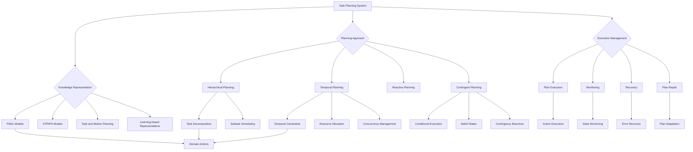

import Tabs from '@theme/Tabs';
import TabItem from '@theme/TabItem';

## Learning Outcomes

After completing this chapter, you will be able to:
1. Design hierarchical task planning systems that decompose complex goals into executable actions.
2. Implement temporal planning algorithms that handle concurrent and sequential task execution.
3. Create plan refinement mechanisms that adapt high-level plans to execution constraints.
4. Implement robust execution monitoring and recovery systems.
5. Design planning algorithms that handle uncertainty in action outcomes.
6. Integrate human-in-the-loop planning for collaborative task execution.
7. Evaluate the effectiveness and efficiency of planning algorithms in robotic applications.
8. Assess the trade-offs between planning complexity and execution performance.

## Gherkin Specifications

<Tabs
  defaultValue="spec1"
  values={[
    {label: 'Specification 1', value: 'spec1'},
    {label: 'Specification 2', value: 'spec2'},
    {label: 'Specification 3', value: 'spec3'},
    {label: 'Specification 4', value: 'spec4'},
    {label: 'Specification 5', value: 'spec5'},
  ]}>
  <TabItem value="spec1">

### Given a high-level task, When planning, Then system should generate executable action sequence

```gherkin
Given a robot with capabilities and a high-level task goal
When the task planning system processes the goal
Then it should generate a sequence of executable actions to achieve the goal
```

  </TabItem>
  <TabItem value="spec2">

### Given plan execution, When encountering failure, Then system should adapt and recover

```gherkin
Given a robot executing a planned sequence of actions
When an action fails or environmental conditions change
Then the system should adapt the plan or recover appropriately
```

  </TabItem>
  <TabItem value="spec3">

### Given resource constraints, When planning, Then system should respect temporal and capability limits

```gherkin
Given a robot with resource and capability constraints
When generating a task plan
Then the plan should respect temporal and physical constraints
```

  </TabItem>
  <TabItem value="spec4">

### Given uncertainty in action outcomes, When planning, Then system should consider probabilistic effects

```gherkin
Given a planning system with uncertain action models
When generating plans
Then it should account for potential stochastic action outcomes
```

  </TabItem>
  <TabItem value="spec5">

### Given human collaboration, When planning, Then system should coordinate with human actions

```gherkin
Given a human-robot collaborative environment
When planning robot tasks
Then the system should consider human activities and intentions
```

  </TabItem>
</Tabs>

## Theory & Intuition

Task planning and execution form the cognitive core of autonomous robotic systems, bridging high-level goals with low-level motor commands. Think of task planning as the robot's "thinking" process—when a human asks a robot to "set the table for dinner," the task planning system must decompose this high-level request into a sequence of specific actions like "pick up plate," "move to table," "place plate," and so on, accounting for spatial relationships, object affordances, and execution constraints.

The fundamental challenge in task planning is the gap between abstract goals and physical execution. Unlike simple reactive systems, task planning requires the robot to consider multiple possible action sequences, evaluate their feasibility and effectiveness, and select the best course of action. This involves reasoning about the state of the world before, during, and after actions, anticipating the effects of actions, and handling the complexity of multiple interacting objects and constraints.

Hierarchical task planning decomposes complex goals into manageable subtasks arranged in a hierarchy. At the top level, we might have high-level goals like "prepare dinner," which decomposes into "set table," "cook food," and "serve drinks." Each of these decomposes further into primitive actions that the robot can execute. This hierarchy makes complex planning problems tractable and allows for modular development of planning components.

Temporal planning considers the timing aspects of task execution, including concurrent actions, resource sharing, and temporal constraints. A robot might be able to perform "move arm" and "grip object" simultaneously, but cannot "open door" and "close door" at the same time. Temporal planning ensures that actions are scheduled appropriately, respecting both precedence constraints and resource limitations.

Plan refinement bridges the gap between abstract plans and executable details. A high-level plan might say "navigate to kitchen," but refinement transforms this into specific motor commands with intermediate waypoints, obstacle avoidance, and collision checks. This process often happens dynamically as the robot gains more information about the environment during execution.

Execution monitoring is critical for robust task execution. The real world differs from the planning model, so robots must continuously monitor execution, detect deviations, and take corrective actions. If a planned grasp fails, the monitoring system should detect this and trigger appropriate recovery behavior.

## Core Concepts

<Tabs
  defaultValue="diagram"
  values={[
    {label: 'Mermaid Diagram', value: 'diagram'},
    {label: 'Concept Table', value: 'table'},
  ]}>
  <TabItem value="diagram">



  </TabItem>
  <TabItem value="table">

| Concept | Definition | Application |
|--------|------------|-------------|
| Hierarchical Planning | Decomposition of tasks into subtasks in a hierarchy | Managing complexity of high-level goals |
| Temporal Planning | Planning with timing constraints and concurrency | Coordinating multi-step tasks with timing requirements |
| Plan Refinement | Transformation of abstract plans to executable actions | Bridging high-level goals to low-level commands |
| Execution Monitoring | Continuous assessment of plan execution | Detecting failures and deviations during execution |
| Plan Repair | Dynamic modification of plans during execution | Handling unexpected conditions during task execution |
| Contingent Planning | Planning with conditional branches for uncertainty | Handling probabilistic action outcomes |

  </TabItem>
</Tabs>

## Hands-On Labs

<Tabs
  defaultValue="lab1"
  values={[
    {label: 'Lab 1: Hierarchical Task Planner Implementation', value: 'lab1'},
    {label: 'Lab 2: Temporal Planning with Resource Constraints', value: 'lab2'},
    {label: 'Lab 3: Execution Monitoring and Recovery', value: 'lab3'},
  ]}>
  <TabItem value="lab1">

### Lab 1: Implementing a Hierarchical Task Planner

#### Objective
Create a hierarchical task planner that can decompose high-level goals into executable actions.

#### Prerequisites
- Understanding of ROS 2 and actionlib
- Knowledge of planning algorithms
- Experience with state representation

#### Steps
1. Define a hierarchical task structure with high-level goals and primitive actions
2. Implement a task decomposition algorithm
3. Create a plan execution system
4. Test with complex multi-step tasks

#### Code Example
```python
#!/usr/bin/env python3
import rclpy
from rclpy.node import Node
from action_msgs.msg import GoalStatus
from std_msgs.msg import String
from geometry_msgs.msg import Pose, Point
from typing import List, Dict, Any, Optional
from enum import Enum
import time

class TaskStatus(Enum):
    PENDING = 0
    RUNNING = 1
    SUCCESS = 2
    FAILURE = 3
    CANCELLED = 4

class Task:
    def __init__(self, name: str, action_name: str = None, subtasks: List['Task'] = None):
        self.name = name
        self.action_name = action_name  # For primitive tasks
        self.subtasks = subtasks or []  # For composite tasks
        self.status = TaskStatus.PENDING
        self.parameters = {}
        
    def is_primitive(self) -> bool:
        return len(self.subtasks) == 0 and self.action_name is not None

class HierarchicalPlanner(Node):
    def __init__(self):
        super().__init__('hierarchical_planner')
        
        # Publishers for task execution
        self.task_pub = self.create_publisher(String, '/current_task', 10)
        self.status_pub = self.create_publisher(String, '/task_status', 10)
        
        # Task queue
        self.task_queue = []
        self.current_task = None
        
        # Timer for task execution
        self.execution_timer = self.create_timer(0.1, self.execute_next_task)
        
        self.get_logger().info("Hierarchical Planner initialized")

    def create_task_structure(self) -> Task:
        """Create a sample hierarchical task structure"""
        # High-level: set table for dinner
        set_table_task = Task("set_table_for_dinner")
        
        # Decompose into subtasks
        get_plates_task = Task("get_plates")
        get_cups_task = Task("get_cups")
        place_items_task = Task("place_items")
        
        # Further decompose get_plates_task
        go_to_cabinet_task = Task("go_to_cabinet", action_name="navigate")
        go_to_cabinet_task.parameters = {"target_location": "cabinet"}
        
        pick_plates_task = Task("pick_plates", action_name="grasp_object")
        pick_plates_task.parameters = {"object": "plates"}
        
        bring_plates_task = Task("bring_plates", action_name="navigate")
        bring_plates_task.parameters = {"target_location": "table"}
        
        get_plates_subtasks = [go_to_cabinet_task, pick_plates_task, bring_plates_task]
        get_plates_task.subtasks = get_plates_subtasks
        
        # Further decompose get_cups_task
        go_to_cupboard_task = Task("go_to_cupboard", action_name="navigate")
        go_to_cupboard_task.parameters = {"target_location": "cupboard"}
        
        pick_cups_task = Task("pick_cups", action_name="grasp_object")
        pick_cups_task.parameters = {"object": "cups"}
        
        bring_cups_task = Task("bring_cups", action_name="navigate")
        bring_cups_task.parameters = {"target_location": "table"}
        
        get_cups_subtasks = [go_to_cupboard_task, pick_cups_task, bring_cups_task]
        get_cups_task.subtasks = get_cups_subtasks
        
        # Further decompose place_items_task
        place_plates_task = Task("place_plates", action_name="place_object")
        place_plates_task.parameters = {"object": "plates", "location": "table_center"}
        
        place_cups_task = Task("place_cups", action_name="place_object")
        place_cups_task.parameters = {"object": "cups", "location": "table_sides"}
        
        place_items_task.subtasks = [place_plates_task, place_cups_task]
        
        # Set the overall task structure
        set_table_task.subtasks = [get_plates_task, get_cups_task, place_items_task]
        
        return set_table_task

    def expand_task(self, task: Task) -> List[Task]:
        """Expand a composite task into its subtasks"""
        if task.is_primitive():
            return [task]
        
        expanded_tasks = []
        for subtask in task.subtasks:
            expanded_tasks.extend(self.expand_task(subtask))
        
        return expanded_tasks

    def execute_next_task(self):
        """Execute the next task in the queue"""
        if not self.task_queue and self.current_task is None:
            # If no tasks queued and no current task, get a new plan
            root_task = self.create_task_structure()
            expanded_tasks = self.expand_task(root_task)
            self.task_queue.extend(expanded_tasks)
            
            # Publish status
            status_msg = String()
            status_msg.data = f"Created plan with {len(expanded_tasks)} primitive tasks"
            self.status_pub.publish(status_msg)
            self.get_logger().info(f"Created plan with {len(expanded_tasks)} primitive tasks")
        
        if self.current_task is None and self.task_queue:
            # Start next task
            self.current_task = self.task_queue.pop(0)
            self.current_task.status = TaskStatus.RUNNING
            
            task_msg = String()
            task_msg.data = f"Starting: {self.current_task.name} - {self.current_task.action_name}"
            self.task_pub.publish(task_msg)
            self.get_logger().info(f"Starting task: {self.current_task.name}")
            
            # Simulate task execution
            self.simulate_task_execution()
    
    def simulate_task_execution(self):
        """Simulate execution of the current primitive task"""
        if self.current_task is None:
            return
        
        # In a real system, this would call actual robot actions via action servers
        # For simulation, we'll just mark success after a delay
        success = self.execute_primitive_action(
            self.current_task.action_name, 
            self.current_task.parameters
        )
        
        if success:
            self.current_task.status = TaskStatus.SUCCESS
            self.get_logger().info(f"Successfully completed task: {self.current_task.name}")
        else:
            self.current_task.status = TaskStatus.FAILURE
            self.get_logger().error(f"Failed task: {self.current_task.name}")
        
        # Publish status
        status_msg = String()
        status_msg.data = f"Completed: {self.current_task.name} - Status: {self.current_task.status.name}"
        self.status_pub.publish(status_msg)
        
        # Clear current task to allow next task execution
        self.current_task = None

    def execute_primitive_action(self, action_name: str, parameters: Dict[str, Any]) -> bool:
        """Execute a primitive action (simulated)"""
        # Simulate action execution with some probability of success
        import random
        success_probability = 0.9  # 90% success rate for simulation
        
        # Simulate execution time
        time.sleep(0.5)
        
        # For demonstration, simulate occasional failures
        return random.random() < success_probability

def main(args=None):
    rclpy.init(args=args)
    planner = HierarchicalPlanner()
    
    try:
        rclpy.spin(planner)
    except KeyboardInterrupt:
        pass
    finally:
        planner.destroy_node()
        rclpy.shutdown()

if __name__ == '__main__':
    main()
```

#### Expected Outcome
A hierarchical task planning system that can decompose complex goals into sequences of primitive actions, demonstrating how high-level tasks are systematically broken down for robot execution.

  </TabItem>
  <TabItem value="lab2">

### Lab 2: Temporal Planning with Resource Constraints

#### Objective
Implement a temporal planner that schedules tasks while respecting resource constraints and temporal dependencies.

#### Prerequisites
- Understanding of constraint satisfaction problems
- Knowledge of temporal reasoning
- Experience with scheduling algorithms

#### Steps
1. Define tasks with temporal constraints and resource requirements
2. Implement a temporal planning algorithm
3. Create a resource allocation system
4. Test with concurrent tasks sharing resources

#### Code Example
```python
#!/usr/bin/env python3
import rclpy
from rclpy.node import Node
from std_msgs.msg import String
from typing import List, Dict, Tuple
import heapq
from dataclasses import dataclass
from enum import Enum

class ResourceType(Enum):
    ARM = "robot_arm"
    NAVIGATION = "navigation_system"
    GRIPPER = "gripper"
    CAMERA = "camera"

@dataclass
class TaskResource:
    resource_type: ResourceType
    duration: float  # in seconds

@dataclass
class TemporalTask:
    id: str
    name: str
    duration: float
    resources: List[TaskResource]
    earliest_start: float
    latest_end: float
    predecessors: List[str]  # IDs of tasks that must complete first
    priority: int = 1  # Higher number = higher priority

    def __lt__(self, other):
        """For priority queue (lower priority number = higher priority)"""
        return self.priority < other.priority

class TemporalPlanner(Node):
    def __init__(self):
        super().__init__('temporal_planner')
        
        # Publishers
        self.schedule_pub = self.create_publisher(String, '/task_schedule', 10)
        self.resource_pub = self.create_publisher(String, '/resource_allocation', 10)
        
        # Resources with availability tracking
        self.resources = {
            ResourceType.ARM: [],
            ResourceType.NAVIGATION: [],
            ResourceType.GRIPPER: [],
            ResourceType.CAMERA: []
        }
        
        # Tasks to schedule
        self.tasks: List[TemporalTask] = []
        self.schedule: Dict[str, Tuple[float, float]] = {}  # task_id -> (start_time, end_time)
        
        # Timer for planning
        self.planning_timer = self.create_timer(1.0, self.generate_schedule)
        
        self.get_logger().info("Temporal Planner initialized")

    def create_sample_tasks(self) -> List[TemporalTask]:
        """Create sample tasks with temporal and resource constraints"""
        tasks = [
            TemporalTask(
                id="task1",
                name="Navigate to shelf",
                duration=5.0,
                resources=[TaskResource(ResourceType.NAVIGATION, 5.0)],
                earliest_start=0.0,
                latest_end=20.0,
                predecessors=[],
                priority=1
            ),
            TemporalTask(
                id="task2",
                name="Grasp object",
                duration=3.0,
                resources=[TaskResource(ResourceType.ARM, 2.0), TaskResource(ResourceType.GRIPPER, 3.0)],
                earliest_start=5.0,  # Can only start after navigation
                latest_end=25.0,
                predecessors=["task1"],  # Depends on task1
                priority=2
            ),
            TemporalTask(
                id="task3",
                name="Navigate to destination",
                duration=6.0,
                resources=[TaskResource(ResourceType.NAVIGATION, 6.0)],
                earliest_start=8.0,  # Can only start after grasp
                latest_end=30.0,
                predecessors=["task2"],
                priority=1
            ),
            TemporalTask(
                id="task4",
                name="Place object",
                duration=2.0,
                resources=[TaskResource(ResourceType.ARM, 1.5), TaskResource(ResourceType.GRIPPER, 2.0)],
                earliest_start=14.0,
                latest_end=35.0,
                predecessors=["task3"],
                priority=2
            ),
            # Additional task that can run concurrently with others
            TemporalTask(
                id="task5",
                name="Visual inspection",
                duration=4.0,
                resources=[TaskResource(ResourceType.CAMERA, 4.0)],
                earliest_start=0.0,
                latest_end=15.0,
                predecessors=[],
                priority=3  # High priority
            )
        ]
        return tasks

    def check_resource_availability(self, task: TemporalTask, start_time: float) -> bool:
        """Check if required resources are available for the task during its duration"""
        end_time = start_time + task.duration
        
        for res_req in task.resources:
            resource_list = self.resources[res_req.resource_type]
            
            # Check for conflicts with existing allocations
            for existing_start, existing_end in resource_list:
                # Check if intervals overlap
                if not (end_time <= existing_start or start_time >= existing_end):
                    return False  # Resource conflict
        
        return True

    def allocate_resources(self, task: TemporalTask, start_time: float):
        """Allocate resources for the task"""
        end_time = start_time + task.duration
        
        for res_req in task.resources:
            self.resources[res_req.resource_type].append((start_time, end_time))
            # Sort by start time
            self.resources[res_req.resource_type].sort()

    def generate_schedule(self):
        """Generate a temporal schedule respecting resource constraints"""
        # Get sample tasks
        self.tasks = self.create_sample_tasks()
        
        # Clear previous schedule and resource allocations
        self.schedule.clear()
        for res_type in self.resources:
            self.resources[res_type].clear()
        
        # Sort tasks by earliest start time, then by priority
        sorted_tasks = sorted(self.tasks, key=lambda t: (t.earliest_start, -t.priority))
        
        # Schedule tasks using a greedy approach respecting dependencies
        for task in sorted_tasks:
            # Check if all predecessors are scheduled
            all_predecessors_scheduled = all(
                pred_id in self.schedule for pred_id in task.predecessors
            )
            
            if not all_predecessors_scheduled:
                self.get_logger().warn(f"Task {task.name} has unscheduled predecessors")
                continue
            
            # Find the earliest start time considering predecessors and constraints
            min_start = task.earliest_start
            
            # Ensure predecessors finish before this task starts
            for pred_id in task.predecessors:
                pred_end_time = self.schedule[pred_id][1]
                min_start = max(min_start, pred_end_time)
            
            # Find first available time slot for required resources
            start_time = self.find_available_slot(task, min_start)
            
            if start_time is not None:
                # Check if this fits within the latest end constraint
                end_time = start_time + task.duration
                if end_time <= task.latest_end:
                    # Schedule the task
                    self.schedule[task.id] = (start_time, end_time)
                    self.allocate_resources(task, start_time)
                    
                    self.get_logger().info(
                        f"Scheduled {task.name} from {start_time:.2f}s to {end_time:.2f}s"
                    )
                else:
                    self.get_logger().warn(
                        f"Task {task.name} cannot meet latest end constraint ({task.latest_end}s)"
                    )
            else:
                self.get_logger().warn(f"No available time slot for task {task.name}")
        
        # Publish schedule information
        self.publish_schedule()

    def find_available_slot(self, task: TemporalTask, earliest_start: float) -> Optional[float]:
        """Find the earliest time slot where the task can be scheduled"""
        # For simplicity, we'll use a greedy approach
        # In practice, more sophisticated algorithms might be needed
        
        # Start checking from the earliest possible start time
        check_time = earliest_start
        
        # Try times until we find an available slot or exceed constraints
        max_time = max(task.latest_end - task.duration, earliest_start + 20.0)  # Cap search time
        
        while check_time <= max_time:
            if self.check_resource_availability(task, check_time):
                return check_time
            check_time += 0.1  # Check every 0.1 seconds
        
        return None

    def publish_schedule(self):
        """Publish the generated schedule"""
        schedule_str = "Task Schedule:\n"
        for task_id, (start, end) in self.schedule.items():
            task = next(t for t in self.tasks if t.id == task_id)
            schedule_str += f"  {task.name}: {start:.2f}s - {end:.2f}s (Duration: {end-start:.2f}s)\n"
        
        schedule_msg = String()
        schedule_msg.data = schedule_str
        self.schedule_pub.publish(schedule_msg)
        
        resource_str = "Resource Allocations:\n"
        for res_type, allocations in self.resources.items():
            resource_str += f"  {res_type.value}: {len(allocations)} allocations\n"
        
        resource_msg = String()
        resource_msg.data = resource_str
        self.resource_pub.publish(resource_msg)

def main(args=None):
    rclpy.init(args=args)
    planner = TemporalPlanner()
    
    # Run planning once
    planner.generate_schedule()
    
    # Keep running to allow for dynamic updates
    try:
        rclpy.spin(planner)
    except KeyboardInterrupt:
        pass
    finally:
        planner.destroy_node()
        rclpy.shutdown()

if __name__ == '__main__':
    main()
```

#### Expected Outcome
A temporal planning system that creates schedules for tasks while respecting resource constraints and temporal dependencies, allowing for concurrent task execution when resources permit.

  </TabItem>
  <TabItem value="lab3">

### Lab 3: Execution Monitoring and Recovery

#### Objective
Implement a monitoring system that detects execution failures and triggers appropriate recovery actions.

#### Prerequisites
- Understanding of robot state monitoring
- Experience with behavior trees or similar execution frameworks
- Knowledge of failure detection and recovery strategies

#### Steps
1. Create a task execution monitor
2. Implement failure detection mechanisms
3. Design recovery strategies
4. Test with simulated failures

#### Code Example
```python
#!/usr/bin/env python3
import rclpy
from rclpy.node import Node
from std_msgs.msg import String, Bool
from geometry_msgs.msg import Pose
from sensor_msgs.msg import LaserScan
import time
import random
from enum import Enum
from typing import Dict, List, Any, Optional

class TaskState(Enum):
    IDLE = 0
    EXECUTING = 1
    SUCCESS = 2
    FAILURE = 3
    RECOVERING = 4

class FailureType(Enum):
    EXECUTION_ERROR = 0
    PERCEPTION_ERROR = 1
    RESOURCE_UNAVAILABLE = 2
    TIMEOUT = 3
    OBSTACLE_DETECTED = 4

class ExecutionMonitor(Node):
    def __init__(self):
        super().__init__('execution_monitor')
        
        # Publishers
        self.status_pub = self.create_publisher(String, '/execution_status', 10)
        self.recovery_pub = self.create_publisher(String, '/recovery_action', 10)
        self.emergency_stop_pub = self.create_publisher(Bool, '/emergency_stop', 10)
        
        # Subscribers
        self.laser_sub = self.create_subscription(
            LaserScan, '/scan', self.laser_callback, 10)
        self.robot_state_sub = self.create_subscription(
            String, '/robot_state', self.state_callback, 10)
        
        # State variables
        self.current_task_state = TaskState.IDLE
        self.current_task_name = ""
        self.current_task_start_time = 0.0
        self.task_timeout = 10.0  # seconds
        self.last_laser_scan = None
        self.obstacle_detected = False
        self.recovery_attempts = 0
        self.max_recovery_attempts = 3
        
        # Recovery strategies
        self.recovery_strategies = {
            FailureType.EXECUTION_ERROR: ["retry", "alternative_path"],
            FailureType.PERCEPTION_ERROR: ["relocalize", "recalibrate_sensors"],
            FailureType.RESOURCE_UNAVAILABLE: ["wait", "use_alternative"],
            FailureType.TIMEOUT: ["skip", "extend_timeout"],
            FailureType.OBSTACLE_DETECTED: ["wait", "plan_around", "report"]
        }
        
        # Timer for monitoring
        self.monitor_timer = self.create_timer(0.1, self.monitor_execution)
        
        self.get_logger().info("Execution Monitor initialized")

    def start_task(self, task_name: str):
        """Start monitoring for a task"""
        self.current_task_name = task_name
        self.current_task_state = TaskState.EXECUTING
        self.current_task_start_time = self.get_clock().now().nanoseconds / 1e9
        
        status_msg = String()
        status_msg.data = f"Started monitoring for task: {task_name}"
        self.status_pub.publish(status_msg)
        self.get_logger().info(f"Started monitoring for task: {task_name}")

    def stop_task(self, success: bool):
        """Stop monitoring for current task"""
        if success:
            self.current_task_state = TaskState.SUCCESS
            self.get_logger().info(f"Task {self.current_task_name} completed successfully")
        else:
            self.current_task_state = TaskState.FAILURE
            self.get_logger().info(f"Task {self.current_task_name} failed")
        
        status_msg = String()
        status_msg.data = f"Task {self.current_task_name} {'completed' if success else 'failed'}"
        self.status_pub.publish(status_msg)

    def detect_failure(self) -> Optional[FailureType]:
        """Detect potential failures in execution"""
        current_time = self.get_clock().now().nanoseconds / 1e9
        
        # Check for timeout
        if (current_time - self.current_task_start_time) > self.task_timeout:
            return FailureType.TIMEOUT
        
        # Check for obstacles (using laser data)
        if self.obstacle_detected:
            return FailureType.OBSTACLE_DETECTED
        
        # Simulate other failure conditions
        # In a real system, you would check actual robot feedback
        if random.random() < 0.01:  # 1% chance of execution error per cycle
            return FailureType.EXECUTION_ERROR
        
        # Check if robot is stuck (simplified check)
        # In real system, compare actual vs expected motion
        if random.random() < 0.005:  # 0.5% chance of perception error
            return FailureType.PERCEPTION_ERROR
        
        return None

    def execute_recovery(self, failure_type: FailureType):
        """Execute recovery strategy for detected failure"""
        if self.recovery_attempts >= self.max_recovery_attempts:
            self.get_logger().error(f"Max recovery attempts reached, aborting task")
            self.emergency_stop()
            return
        
        strategies = self.recovery_strategies.get(failure_type, [])
        if not strategies:
            self.get_logger().error(f"No recovery strategy for {failure_type}")
            self.emergency_stop()
            return
        
        # Select a recovery strategy (for simplicity, pick first one)
        strategy = strategies[0]
        
        self.get_logger().info(f"Attempting recovery: {strategy} for {failure_type}")
        recovery_msg = String()
        recovery_msg.data = f"Recovery: {strategy} for {failure_type.name}"
        self.recovery_pub.publish(recovery_msg)
        
        # Mark as recovering
        self.current_task_state = TaskState.RECOVERING
        
        # Simulate recovery action
        if strategy == "retry":
            self.get_logger().info("Retrying current task...")
            # Reset start time
            self.current_task_start_time = self.get_clock().now().nanoseconds / 1e9
            self.current_task_state = TaskState.EXECUTING
            self.recovery_attempts += 1
            
        elif strategy == "alternative_path":
            self.get_logger().info("Planning alternative path...")
            # In real system, this would call path planner
            time.sleep(0.5)  # Simulate planning time
            self.current_task_state = TaskState.EXECUTING
            self.recovery_attempts += 1
            
        elif strategy == "relocalize":
            self.get_logger().info("Relocalizing robot...")
            # In real system, this would call localization system
            time.sleep(0.5)  # Simulate localization time
            self.current_task_state = TaskState.EXECUTING
            self.recovery_attempts += 1
            
        elif strategy == "plan_around":
            self.get_logger().info("Planning around obstacle...")
            # In real system, this would call obstacle avoidance planner
            time.sleep(0.5)  # Simulate planning time
            self.current_task_state = TaskState.EXECUTING
            self.recovery_attempts += 1
        else:
            # Unknown strategy
            self.get_logger().warn(f"Unknown recovery strategy: {strategy}")
            self.emergency_stop()

    def emergency_stop(self):
        """Trigger emergency stop"""
        stop_msg = Bool()
        stop_msg.data = True
        self.emergency_stop_pub.publish(stop_msg)
        self.get_logger().error("Emergency stop triggered!")
        
        # Reset
        self.current_task_state = TaskState.FAILURE
        self.recovery_attempts = 0

    def laser_callback(self, msg):
        """Process laser scan for obstacle detection"""
        # Detect obstacles in front of robot (simplified)
        front_scan = msg.ranges[len(msg.ranges)//2-10 : len(msg.ranges)//2+10]  # Front 20 readings
        min_distance = min(front_scan) if front_scan else float('inf')
        
        # Consider obstacle if distance is small
        if min_distance < 0.5:  # 0.5m threshold
            self.obstacle_detected = True
        else:
            self.obstacle_detected = False
        
        self.last_laser_scan = msg

    def state_callback(self, msg):
        """Process robot state updates"""
        # In a real system, this would monitor actual robot state
        # For simulation, we'll just log the state
        pass

    def monitor_execution(self):
        """Main monitoring cycle"""
        if self.current_task_state == TaskState.EXECUTING:
            failure_type = self.detect_failure()
            
            if failure_type is not None:
                self.get_logger().warn(f"Detected failure: {failure_type}")
                self.execute_recovery(failure_type)
            else:
                # Task is progressing normally
                elapsed = self.get_clock().now().nanoseconds / 1e9 - self.current_task_start_time
                self.get_logger().debug(f"Task '{self.current_task_name}' running for {elapsed:.2f}s")
                
                # Simulate task completion (for demonstration)
                # In real system, this would be based on actual execution feedback
                if elapsed > 3.0 and random.random() < 0.05:  # Small chance of success
                    self.stop_task(success=True)
                    self.current_task_state = TaskState.IDLE
                    self.recovery_attempts = 0

def ExecutionMonitorDemo(Node):
    """Demo node to trigger tasks and monitor execution"""
    def __init__(self, monitor):
        super().__init__('execution_monitor_demo')
        self.monitor = monitor
        
        # Timer to start tasks periodically
        self.demo_timer = self.create_timer(5.0, self.start_demo_task)
        self.task_counter = 0
        
    def start_demo_task(self):
        """Start a demo task for monitoring"""
        task_name = f"demo_task_{self.task_counter}"
        self.get_logger().info(f"Starting demo task: {task_name}")
        self.monitor.start_task(task_name)
        self.task_counter += 1

def main(args=None):
    rclpy.init(args=args)
    
    monitor = ExecutionMonitor()
    demo = ExecutionMonitorDemo(monitor)
    
    # Create executor with both nodes
    executor = rclpy.executors.MultiThreadedExecutor()
    executor.add_node(monitor)
    executor.add_node(demo)
    
    try:
        executor.spin()
    except KeyboardInterrupt:
        pass
    finally:
        monitor.destroy_node()
        demo.destroy_node()
        rclpy.shutdown()

if __name__ == '__main__':
    main()
```

#### Expected Outcome
A robust execution monitoring system that detects failures during task execution and implements appropriate recovery strategies, ensuring continuous operation despite unexpected conditions.

  </TabItem>
</Tabs>

## Sim-to-Real Notes

When implementing task planning and execution systems on real hardware, several practical considerations become critical:

1. **Real-Time Performance**: Planning algorithms must operate within real-time constraints. Optimize planning algorithms for the Jetson Orin Nano's capabilities, potentially using hierarchical approaches to decompose complex planning problems into manageable parts that can be solved in real-time.

2. **Execution Uncertainty**: Real robots experience uncertainty in action outcomes, sensor readings, and environmental conditions. Implement probabilistic planning and execution monitoring to handle this uncertainty. Plan for contingencies and include recovery behaviors.

3. **Resource Management**: Real robots have limited computational, power, and physical resources. Implement resource-aware planning that considers these constraints. For example, plan energy-efficient paths for battery-powered robots like Unitree platforms.

4. **Failure Handling**: Real-world execution will encounter failures. Implement robust monitoring and recovery mechanisms. Design fallback behaviors that maintain safety when primary plans fail.

5. **Human-Robot Coordination**: In collaborative environments, planning systems must account for human actions and intentions. Implement human-aware planning that considers the presence and activities of humans.

6. **Model Fidelity**: Real-world robot dynamics and environmental interactions often differ from planning models. Implement model adaptation and online learning mechanisms to improve planning accuracy over time.

For the Unitree robot platforms, consider the specific dynamics and constraints of legged locomotion in task planning, including balance requirements and terrain adaptability.

## Multiple Choice Questions

<Tabs
  defaultValue="mcq1"
  values={[
    {label: 'Q1-3', value: 'mcq1'},
    {label: 'Q4-6', value: 'mcq2'},
    {label: 'Q7-9', value: 'mcq3'},
    {label: 'Q10-12', value: 'mcq4'},
    {label: 'Q13-15', value: 'mcq5'},
  ]}>
  <TabItem value="mcq1">

1. **What is the primary purpose of hierarchical task planning?**
   - A) To make robots move faster
   - B) To decompose complex goals into manageable subtasks
   - C) To reduce the number of sensors needed
   - D) To eliminate the need for planning

   **Correct Answer: B** - Hierarchical task planning decomposes complex goals into manageable subtasks arranged in a hierarchy to manage complexity.

2. **What does temporal planning consider in task execution?**
   - A) Only the sequence of tasks
   - B) Timing constraints, concurrency, and resource sharing
   - C) Only the final goal state
   - D) Only computational requirements

   **Correct Answer: B** - Temporal planning considers timing constraints, concurrency, and resource sharing for effective task scheduling.

3. **What is 'plan refinement' in task planning systems?**
   - A) Making plans smaller in size
   - B) Transforming abstract plans to executable details
   - C) Eliminating all possible plans except one
   - D) Reducing the number of tasks

   **Correct Answer: B** - Plan refinement transforms abstract plans into executable details that account for specific robot capabilities and environmental constraints.

  </TabItem>
  <TabItem value="mcq2">

4. **What is the role of execution monitoring in task planning?**
   - A) To plan tasks more efficiently
   - B) To continuously assess plan execution and detect deviations
   - C) To reduce computational requirements
   - D) To increase task complexity

   **Correct Answer: B** - Execution monitoring continuously assesses plan execution and detects deviations or failures during task execution.

5. **What is 'plan repair' in the context of task execution?**
   - A) Fixing broken robots
   - B) Dynamic modification of plans during execution
   - C) Creating backup plans before execution
   - D) Reducing the number of tasks in a plan

   **Correct Answer: B** - Plan repair refers to dynamic modification of plans during execution to handle unexpected conditions.

6. **What is 'contingent planning'?**
   - A) Planning with no backup options
   - B) Planning with conditional branches for uncertainty
   - C) Planning only for the most likely scenario
   - D) Planning with fixed execution order

   **Correct Answer: B** - Contingent planning involves creating plans with conditional branches to handle uncertainty and possible future states.

  </TabItem>
  <TabItem value="mcq3">

7. **Why is resource constraint handling important in temporal planning?**
   - A) To reduce the number of robots needed
   - B) Because robots have limited computational and physical resources
   - C) To increase planning complexity
   - D) To eliminate the need for scheduling

   **Correct Answer: B** - Resource constraint handling is important because robots have limited computational and physical resources that must be allocated efficiently.

8. **What is a key challenge in planning for uncertain environments?**
   - A) Too much available information
   - B) Handling uncertainty in action outcomes and environmental states
   - C) Excessive computational power
   - D) Too many sensors

   **Correct Answer: B** - A key challenge is handling uncertainty in action outcomes and environmental states, which may not match the planning model.

9. **What is 'human-aware planning'?**
   - A) Planning that excludes humans
   - B) Planning that considers human activities and intentions
   - C) Planning done only by humans
   - D) Planning that increases human workload

   **Correct Answer: B** - Human-aware planning considers human activities and intentions when generating robot task plans for collaboration.

  </TabItem>
  <TabItem value="mcq4">

10. **What is a benefit of hierarchical planning approaches?**
    - A) Increased computational complexity
    - B) Managing complexity of high-level goals through decomposition
    - C) Reduced flexibility in task execution
    - D) More sensors required

    **Correct Answer: B** - Hierarchical planning manages complexity of high-level goals by decomposing them into manageable subtasks.

11. **Why is plan adaptation important during execution?**
    - A) To make execution slower
    - B) To handle discrepancies between plan and real-world conditions
    - C) To eliminate the need for monitoring
    - D) To reduce robot capabilities

    **Correct Answer: B** - Plan adaptation is important to handle discrepancies between the plan and real-world conditions that emerge during execution.

12. **What should execution monitoring systems do when failures are detected?**
    - A) Stop all operations immediately
    - B) Trigger appropriate recovery or replanning behaviors
    - C) Ignore the failures
    - D) Increase task complexity

    **Correct Answer: B** - Execution monitoring systems should trigger appropriate recovery or replanning behaviors when failures are detected.

  </TabItem>
  <TabItem value="mcq5">

13. **What is a key consideration for planning on resource-constrained platforms?**
    - A) Using the maximum possible computational complexity
    - B) Balancing planning quality with computational requirements
    - C) Eliminating all planning steps
    - D) Increasing robot speed requirements

    **Correct Answer: B** - On resource-constrained platforms, it's important to balance planning quality with computational requirements.

14. **What does 'temporal consistency' mean in task planning?**
    - A) All tasks taking the same amount of time
    - B) Ensuring tasks are scheduled respecting temporal constraints and dependencies
    - C) Tasks executing at regular intervals
    - D) Eliminating all timing considerations

    **Correct Answer: B** - Temporal consistency means ensuring tasks are scheduled respecting temporal constraints and dependencies between them.

15. **Why is uncertainty handling important in real-world task planning?**
    - A) Because real-world conditions are always predictable
    - B) Because real-world conditions often differ from planning models
    - C) To increase planning speed
    - D) To reduce sensor requirements

    **Correct Answer: B** - Uncertainty handling is important because real-world conditions often differ from planning models, requiring robust approaches.

  </TabItem>
</Tabs>

## Further Reading

<Tabs
  defaultValue="ref1"
  values={[
    {label: 'Research Papers', value: 'ref1'},
    {label: 'Books', value: 'ref2'},
    {label: 'Tutorials', value: 'ref3'},
    {label: 'Tools & Frameworks', value: 'ref4'},
  ]}>
  <TabItem value="ref1">

### Research Papers

1. [Hierarchical Task Network Planning: Formal Analysis and Efficient Implementation](https://www.aaai.org/Papers/ICAPS/2003/ICAPS03-004.pdf) - Foundational paper on hierarchical planning approaches.

2. [Temporal Planning with Resource Constraints: A Survey](https://www.sciencedirect.com/science/article/pii/S000437021500042X) - Comprehensive review of temporal and resource-constrained planning.

3. [Contingent Planning for Robotic Tasks under Uncertainty](https://jair.org/index.php/jair/article/view/10968) - Methods for planning under uncertainty with conditional branches.

4. [Execution Monitoring and Replanning in Autonomous Robotic Systems](https://ieeexplore.ieee.org/document/8460786) - Approaches for monitoring and adapting plans during execution.

5. [Human-Aware Task Planning for Collaborative Robotics](https://arxiv.org/abs/1904.11332) - Planning approaches that consider human activities and intentions.

  </TabItem>
  <TabItem value="ref2">

### Books

1. [Automated Planning: Theory and Practice](https://www.morganclaypool.com/doi/abs/10.2200/S00388ED1V01Y201109AIM014) by Ghallab, Nau, and Traverso - Comprehensive text on planning theory and algorithms.

2. [Planning Algorithms](https://lavalle.pl/planning/) by LaValle - Detailed treatment of motion and task planning algorithms.

3. [Decision Making Under Uncertainty: Theory and Application](https://mitpress.mit.edu/books/decision-making-under-uncertainty) by Kochenderfer - For planning under uncertainty.

4. [Introduction to Autonomous Robots](https://www.koganpage.com/product/introduction-to-autonomous-robots-second-edition-9781680834083) - Relevant chapters on planning and execution.

5. [Robotics: Vision, Thinking, and Action](https://www.springer.com/gp/book/9783319056985) - Covers planning in the context of robot control.

  </TabItem>
  <TabItem value="ref3">

### Tutorials

1. [ROS 2 Navigation and Task Planning](https://navigation.ros.org/tutorials/index.html) - Practical tutorials on implementing planning with ROS 2.

2. [PDDL and Planning Tutorial](https://planning.wiki/) - Tutorials on using PDDL for robotic task planning.

3. [Behavior Trees for Robotics](https://docs.ros.org/en/rolling/Tutorials/Behavior-Trees.html) - Tutorials on using behavior trees for task execution.

4. [Temporal Planning with Temporal PDDL](https://github.com/agi46/tpp) - Tutorials on temporal planning.

5. [PyBullet for Planning Simulation](https://pybullet.org/) - Tutorials on simulating planning and execution.

  </TabItem>
  <TabItem value="ref4">

### Tools & Frameworks

1. [ROS 2 Navigation2](https://navigation.ros.org/) - Planning and execution stack for mobile robots.

2. [PDDL4J](https://liris.cnrs.fr/~pacaud/pddl4j/) - Java library for PDDL-based planning.

3. [ROS2 Control](https://control.ros.org/) - Framework for robot control and execution.

4. [BehaviorTree.CPP](https://www.barkhauseninstitut.org/sw/blog/2021/02/01/bt-tutorial/) - Behavior tree framework for task execution.

5. [ROS Plan Executor](https://github.com/plan-executor/plan_executor) - Framework for executing robot plans.

  </TabItem>
</Tabs>