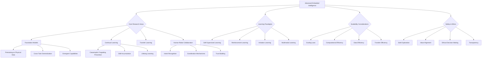

import Tabs from '@theme/Tabs';
import TabItem from '@theme/TabItem';

## Learning Outcomes

After completing this chapter, you will be able to:
1. Analyze the current state and future directions of embodied intelligence research.
2. Design foundation models specifically adapted for robotic applications.
3. Implement pretraining strategies for physical data to enable transfer learning.
4. Evaluate scaling laws and efficiency considerations in embodied AI systems.
5. Create generalizable robot skills that transfer across tasks and environments.
6. Implement continual learning mechanisms for robots to adapt over time.
7. Assess the challenges and opportunities in human-robot collaboration.
8. Design ethical and safe frameworks for advanced embodied intelligence systems.

## Gherkin Specifications

<Tabs
  defaultValue="spec1"
  values={[
    {label: 'Specification 1', value: 'spec1'},
    {label: 'Specification 2', value: 'spec2'},
    {label: 'Specification 3', value: 'spec3'},
    {label: 'Specification 4', value: 'spec4'},
    {label: 'Specification 5', value: 'spec5'},
  ]}>
  <TabItem value="spec1">

### Given physical data, When pretraining embodied models, Then they should capture relevant physical patterns

```gherkin
Given a dataset of physical interactions and sensorimotor experiences
When pretraining a foundation model for embodied intelligence
Then the model should capture relevant physical patterns and affordances
```

  </TabItem>
  <TabItem value="spec2">

### Given new task, When transferring skills, Then robot should adapt with minimal additional training

```gherkin
Given a robot with pretrained embodied intelligence
When presented with a new but related task
Then it should adapt with minimal additional training using transfer learning
```

  </TabItem>
  <TabItem value="spec3">

### Given changing environment, When learning continually, Then system should adapt without forgetting

```gherkin
Given an embodied AI system operating in changing environments
When learning new skills continually
Then it should adapt without catastrophically forgetting previous skills
```

  </TabItem>
  <TabItem value="spec4">

### Given human-robot collaboration, When interacting, Then system should coordinate effectively

```gherkin
Given humans and robots collaborating on complex tasks
When engaging in interaction and coordination
Then the system should achieve effective collaboration
```

  </TabItem>
  <TabItem value="spec5">

### Given safety constraints, When executing, Then system should maintain ethical behavior

```gherkin
Given an advanced embodied intelligence system
When executing actions in the physical world
Then it should maintain safety and ethical behavior
```

  </TabItem>
</Tabs>

## Theory & Intuition

Advanced embodied intelligence represents the frontier of robotics and AI, where machines develop sophisticated understanding through physical interaction with the world. Think of this as the difference between reading about swimming from a book versus actually learning to swim through practice—the latter provides deep, intuitive understanding that cannot be gained through abstract knowledge alone.

The field of advanced embodied intelligence is rapidly evolving, building on decades of research in cognitive science, robotics, and machine learning. The key insight is that intelligence emerges from the interaction between brain, body, and environment. A robot's physical form, its sensors and actuators, and the environment it operates in all shape how it perceives and acts in the world.

Foundation models for embodied intelligence are large-scale models pre-trained on diverse robotic experiences that can be fine-tuned for specific tasks. These models show remarkable potential for generalization, allowing robots to transfer skills across different environments and tasks. The idea is similar to large language models that learn general patterns from text and can be adapted to various language tasks.

Pretraining on physical data involves learning from large datasets of sensorimotor experiences, which can include visual observations, motor commands, tactile feedback, and environmental states. This pretraining phase allows models to develop an understanding of physical principles, object affordances, and sensorimotor relationships that can be leveraged for downstream tasks.

Scaling laws in embodied intelligence examine how performance improves with larger models, more data, and more computational resources. Unlike purely digital tasks, embodied intelligence is constrained by real-world physics and the need for physical interaction, making scaling considerations more complex.

Generalizable robot skills are those that work across different environments, objects, and contexts. Rather than training robots for specific objects or environments, the goal is to develop skills that transfer to new situations. This requires learning abstract representations that capture the underlying principles of manipulation, navigation, or other tasks.

Continual learning enables robots to adapt and improve over time without forgetting previously learned skills. This is crucial for robots that operate in dynamic environments and need to learn new tasks while retaining existing capabilities.

The integration of human-robot collaboration in advanced embodied intelligence systems represents a significant focus area. These systems must understand human intentions, coordinate actions, and communicate effectively to achieve shared goals.

## Core Concepts

<Tabs
  defaultValue="diagram"
  values={[
    {label: 'Mermaid Diagram', value: 'diagram'},
    {label: 'Concept Table', value: 'table'},
  ]}>
  <TabItem value="diagram">



  </TabItem>
  <TabItem value="table">

| Concept | Definition | Application |
|--------|------------|-------------|
| Foundation Models | Large-scale models pre-trained on diverse experiences | Generalizable robot capabilities |
| Continual Learning | Learning new skills without forgetting old ones | Long-term robot adaptation |
| Transfer Learning | Applying knowledge from one task to another | Cross-environment skill transfer |
| Scaling Laws | Relationships between model size/complexity and performance | Resource allocation decisions |
| Generalizable Skills | Skills that work across different contexts | Cross-task robot capabilities |
| Human-Robot Collaboration | Effective coordination between humans and robots | Shared task execution |

  </TabItem>
</Tabs>

## Hands-On Labs

<Tabs
  defaultValue="lab1"
  values={[
    {label: 'Lab 1: Pretraining Model on Physical Data', value: 'lab1'},
    {label: 'Lab 2: Skill Transfer Implementation', value: 'lab2'},
    {label: 'Lab 3: Continual Learning for Robots', value: 'lab3'},
  ]}>
  <TabItem value="lab1">

### Lab 1: Pretraining Foundation Model on Physical Sensory-Motor Data

#### Objective
Implement a foundation model pre-trained on diverse physical sensory-motor experiences to enable transfer learning.

#### Prerequisites
- Understanding of deep learning frameworks (PyTorch/TensorFlow)
- Knowledge of self-supervised learning
- Experience with multimodal data processing

#### Steps
1. Create dataset of sensory-motor experiences
2. Implement self-supervised pretraining objective
3. Train foundation model on physical data
4. Evaluate transfer learning capabilities

#### Code Example
```python
#!/usr/bin/env python3
import torch
import torch.nn as nn
import torch.optim as optim
import numpy as np
from torch.utils.data import Dataset, DataLoader
import math
from typing import Tuple, Dict, Any

class PhysicalExperienceDataset(Dataset):
    """Dataset of physical sensory-motor experiences"""
    def __init__(self, num_samples=10000):
        self.num_samples = num_samples
        # Generate synthetic physical experience data
        # Each sample: [image_features, proprioception, motor_commands, tactile]
        self.data = {
            'image': torch.randn(num_samples, 64, 64, 3),  # Simplified image features
            'proprioception': torch.randn(num_samples, 10),  # Joint angles, velocities
            'motor_commands': torch.randn(num_samples, 6),  # Motor commands
            'tactile': torch.randn(num_samples, 4),  # Tactile sensor readings
            'action_result': torch.randn(num_samples, 10)  # Resulting state change
        }
    
    def __len__(self):
        return self.num_samples
    
    def __getitem__(self, idx):
        return {
            'image': self.data['image'][idx],
            'proprioception': self.data['proprioception'][idx],
            'motor_commands': self.data['motor_commands'][idx],
            'tactile': self.data['tactile'][idx],
            'action_result': self.data['action_result'][idx]
        }

class MultimodalEncoder(nn.Module):
    """Encoder for different sensory modalities"""
    def __init__(self, input_dim: int, output_dim: int):
        super().__init__()
        self.encoder = nn.Sequential(
            nn.Linear(input_dim, 256),
            nn.ReLU(),
            nn.Linear(256, 128),
            nn.ReLU(),
            nn.Linear(128, output_dim)
        )
    
    def forward(self, x):
        return self.encoder(x)

class PhysicalFoundationModel(nn.Module):
    def __init__(self, latent_dim=256):
        super().__init__()
        
        # Encoders for different modalities
        self.image_encoder = MultimodalEncoder(64*64*3, latent_dim)
        self.proprio_encoder = MultimodalEncoder(10, latent_dim)
        self.motor_encoder = MultimodalEncoder(6, latent_dim)
        self.tactile_encoder = MultimodalEncoder(4, latent_dim)
        
        # Fusion layer
        self.fusion = nn.Sequential(
            nn.Linear(latent_dim * 4, 512),
            nn.ReLU(),
            nn.Linear(512, 256)
        )
        
        # Prediction head for action outcomes
        self.prediction_head = nn.Sequential(
            nn.Linear(256, 128),
            nn.ReLU(),
            nn.Linear(128, 10)  # Predict next state
        )
        
        # Contrastive learning head
        self.projection_head = nn.Sequential(
            nn.Linear(256, 128),
            nn.ReLU(),
            nn.Linear(128, 64)
        )
    
    def forward(self, batch: Dict[str, torch.Tensor]):
        # Encode different modalities
        img_features = self.image_encoder(batch['image'].view(batch['image'].size(0), -1))
        prop_features = self.proprio_encoder(batch['proprioception'])
        motor_features = self.motor_encoder(batch['motor_commands'])
        tactile_features = self.tactile_encoder(batch['tactile'])
        
        # Concatenate and fuse
        fused_features = torch.cat([img_features, prop_features, motor_features, tactile_features], dim=1)
        latent_repr = self.fusion(fused_features)
        
        # Make predictions
        predicted_result = self.prediction_head(latent_repr)
        
        # Get contrastive representation
        contrastive_repr = self.projection_head(latent_repr)
        
        return {
            'predicted_result': predicted_result,
            'contrastive_repr': contrastive_repr,
            'fused_features': latent_repr
        }

def contrastive_loss(z1, z2, temperature=0.5):
    """Contrastive loss for self-supervised learning"""
    # z1 and z2 are representations of positive pairs
    batch_size = z1.size(0)
    
    # Normalize representations
    z1 = torch.nn.functional.normalize(z1, dim=1)
    z2 = torch.nn.functional.normalize(z2, dim=1)
    
    # Compute similarity matrix
    similarity_matrix = torch.matmul(z1, z2.T) / temperature
    
    # Create labels (diagonal elements are positives)
    labels = torch.arange(batch_size, device=z1.device)
    
    # Compute cross entropy loss
    loss = torch.nn.functional.cross_entropy(similarity_matrix, labels)
    return loss

def pretrain_foundation_model():
    """Pretrain the foundation model using self-supervised learning"""
    # Create dataset and dataloader
    dataset = PhysicalExperienceDataset(num_samples=5000)
    dataloader = DataLoader(dataset, batch_size=32, shuffle=True)
    
    # Initialize model
    model = PhysicalFoundationModel(latent_dim=128)
    optimizer = optim.Adam(model.parameters(), lr=0.001)
    
    # Training loop
    model.train()
    for epoch in range(10):
        total_loss = 0.0
        for batch_idx, batch in enumerate(dataloader):
            # In practice, we would create positive pairs by data augmentation
            # For this example, we'll use the same batch as both positive pairs
            batch_copy = {k: v.clone() for k, v in batch.items()}
            
            # Forward pass
            output1 = model(batch)
            output2 = model(batch_copy)
            
            # Compute prediction loss
            pred_loss = torch.nn.functional.mse_loss(
                output1['predicted_result'], 
                batch['action_result']
            )
            
            # Compute contrastive loss (in practice, this would use augmented data)
            contrast_loss = contrastive_loss(
                output1['contrastive_repr'], 
                output2['contrastive_repr']
            )
            
            # Combined loss
            total_batch_loss = pred_loss + 0.5 * contrast_loss
            
            # Backward pass
            optimizer.zero_grad()
            total_batch_loss.backward()
            optimizer.step()
            
            total_loss += total_batch_loss.item()
            
            # Log progress
            if batch_idx % 50 == 0:
                print(f'Epoch {epoch}, Batch {batch_idx}, Loss: {total_batch_loss.item():.4f}')
        
        avg_loss = total_loss / len(dataloader)
        print(f'Epoch {epoch} completed, Average Loss: {avg_loss:.4f}')
    
    # Save the pretrained model
    torch.save(model.state_dict(), 'pretrained_foundation_model.pth')
    print("Pretrained model saved to 'pretrained_foundation_model.pth'")
    
    return model

if __name__ == "__main__":
    pretrained_model = pretrain_foundation_model()
```

#### Expected Outcome
A foundation model pretrained on physical sensory-motor experiences that can be fine-tuned for specific robotic tasks, demonstrating the potential for transfer learning across different robotic capabilities.

  </TabItem>
  <TabItem value="lab2">

### Lab 2: Implementing Skill Transfer Across Tasks and Environments

#### Objective
Create a system that can transfer learned skills across different tasks and environments using the pretrained foundation model.

#### Prerequisites
- Understanding of transfer learning
- Experience with PyTorch
- Knowledge of fine-tuning techniques

#### Steps
1. Load the pretrained foundation model
2. Design task-specific adapters or heads
3. Implement fine-tuning for new tasks
4. Evaluate transfer performance across environments

#### Code Example
```python
#!/usr/bin/env python3
import torch
import torch.nn as nn
import torch.optim as optim
import numpy as np
from torch.utils.data import Dataset, DataLoader
from sklearn.metrics import accuracy_score, precision_score, recall_score
import copy

class TaskSpecificHead(nn.Module):
    """Task-specific head that uses the foundation model representations"""
    def __init__(self, foundation_output_dim: int, task_output_dim: int):
        super().__init__()
        self.task_head = nn.Sequential(
            nn.Linear(foundation_output_dim, 128),
            nn.ReLU(),
            nn.Dropout(0.2),
            nn.Linear(128, 64),
            nn.ReLU(),
            nn.Linear(64, task_output_dim)
        )
    
    def forward(self, foundation_features):
        return self.task_head(foundation_features)

class SkillTransferSystem(nn.Module):
    def __init__(self, foundation_model, num_tasks=3):
        super().__init__()
        
        # Use the pretrained foundation model (freeze most layers)
        self.foundation = foundation_model
        for param in self.foundation.parameters():
            param.requires_grad = False  # Freeze during initial transfer
        
        # Task-specific heads
        self.task_heads = nn.ModuleDict()
        self.task_output_dims = {
            'navigation': 2,    # x, y velocity
            'manipulation': 4,  # gripper position + gripper action
            'inspection': 1     # confidence score for anomaly detection
        }
        
        for task_name, output_dim in self.task_output_dims.items():
            self.task_heads[task_name] = TaskSpecificHead(256, output_dim)  # Foundation output dim
        
        self.active_task = 'navigation'  # Default task
    
    def set_active_task(self, task_name: str):
        """Switch to a different task"""
        if task_name in self.task_heads:
            self.active_task = task_name
        else:
            raise ValueError(f"Unknown task: {task_name}")
    
    def forward(self, batch, task_name=None):
        # Use foundation model to get representations
        foundation_output = self.foundation(batch)
        features = foundation_output['fused_features']
        
        # Use appropriate task head
        current_task = task_name or self.active_task
        task_output = self.task_heads[current_task](features)
        
        return task_output

class TaskDataset(Dataset):
    """Dataset for specific tasks"""
    def __init__(self, task_type, num_samples=1000):
        self.task_type = task_type
        
        if task_type == 'navigation':
            # State features: [x_pos, y_pos, theta, goal_x, goal_y, obstacles_dist...]
            self.state_features = torch.randn(num_samples, 20)
            # Action targets: [linear_vel, angular_vel]
            self.targets = torch.randn(num_samples, 2)
        elif task_type == 'manipulation':
            # State features: [obj_pos, gripper_pos, obj_type_encoded...]
            self.state_features = torch.randn(num_samples, 15)
            # Action targets: [gripper_x, gripper_y, gripper_z, grip_action]
            self.targets = torch.randn(num_samples, 4)
        elif task_type == 'inspection':
            # State features: [sensor_readings...]
            self.state_features = torch.randn(num_samples, 30)
            # Action targets: [anomaly_confidence]
            self.targets = torch.bernoulli(torch.ones(num_samples) * 0.3).unsqueeze(1)
    
    def __len__(self):
        return len(self.state_features)
    
    def __getitem__(self, idx):
        # Create a batch that looks like the original foundation model input
        # This is a simplification - in practice, you'd use the actual sensory inputs
        batch = {
            'image': torch.randn(64, 64, 3),  # Dummy image
            'proprioception': self.state_features[idx][:10],  # Use first 10 as proprioception
            'motor_commands': torch.randn(6),  # Dummy motor commands
            'tactile': torch.randn(4),  # Dummy tactile
            'action_result': torch.randn(10)  # Dummy result
        }
        target = self.targets[idx]
        return batch, target

def fine_tune_for_task(model: SkillTransferSystem, task_name: str, 
                      train_loader: DataLoader, val_loader: DataLoader, 
                      epochs=5):
    """Fine-tune the model for a specific task"""
    
    # Unfreeze task-specific head
    for param in model.task_heads[task_name].parameters():
        param.requires_grad = True
    
    # In a real scenario, you might unfreeze a few top layers of the foundation
    # For this example, we'll keep the foundation frozen
    
    optimizer = optim.Adam(
        list(model.task_heads[task_name].parameters()), 
        lr=0.001
    )
    criterion = nn.MSELoss()
    
    model.train()
    best_val_loss = float('inf')
    
    for epoch in range(epochs):
        total_loss = 0.0
        for batch, targets in train_loader:
            # Prepare batch for foundation model
            # This is a simplified example - in practice, you'd have actual sensory inputs
            foundation_batch = {
                'image': batch['image'].view(batch['image'].size(0), -1),
                'proprioception': batch['proprioception'],
                'motor_commands': batch['motor_commands'],
                'tactile': batch['tactile'],
                'action_result': batch['action_result']
            }
            
            # Forward pass
            outputs = model(foundation_batch, task_name=task_name)
            loss = criterion(outputs, targets)
            
            # Backward pass
            optimizer.zero_grad()
            loss.backward()
            optimizer.step()
            
            total_loss += loss.item()
        
        # Validation
        model.eval()
        val_loss = 0.0
        with torch.no_grad():
            for val_batch, val_targets in val_loader:
                foundation_val_batch = {
                    'image': val_batch['image'].view(val_batch['image'].size(0), -1),
                    'proprioception': val_batch['proprioception'],
                    'motor_commands': val_batch['motor_commands'],
                    'tactile': val_batch['tactile'],
                    'action_result': val_batch['action_result']
                }
                
                val_outputs = model(foundation_val_batch, task_name=task_name)
                val_loss += criterion(val_outputs, val_targets).item()
        
        val_loss /= len(val_loader)
        avg_loss = total_loss / len(train_loader)
        
        print(f"Task: {task_name}, Epoch: {epoch}, Train Loss: {avg_loss:.4f}, Val Loss: {val_loss:.4f}")
        
        if val_loss < best_val_loss:
            best_val_loss = val_loss
            # Save best model for this task
            torch.save(model.state_dict(), f'best_model_{task_name}.pth')
    
    print(f"Task {task_name} fine-tuning completed")

def evaluate_transfer_performance(model: SkillTransferSystem, test_loaders: dict):
    """Evaluate how well skills transfer across tasks"""
    model.eval()
    criterion = nn.MSELoss()
    
    results = {}
    
    for task_name, test_loader in test_loaders.items():
        total_loss = 0.0
        with torch.no_grad():
            for test_batch, targets in test_loader:
                foundation_test_batch = {
                    'image': test_batch['image'].view(test_batch['image'].size(0), -1),
                    'proprioception': test_batch['proprioception'],
                    'motor_commands': test_batch['motor_commands'],
                    'tactile': test_batch['tactile'],
                    'action_result': test_batch['action_result']
                }
                
                outputs = model(foundation_test_batch, task_name=task_name)
                loss = criterion(outputs, targets)
                total_loss += loss.item()
        
        avg_loss = total_loss / len(test_loader)
        results[task_name] = avg_loss
        print(f"Task {task_name} - Test Loss: {avg_loss:.4f}")
    
    return results

def main():
    # Load the pretrained foundation model
    try:
        foundation_model = PhysicalFoundationModel(latent_dim=128)
        foundation_model.load_state_dict(torch.load('pretrained_foundation_model.pth'))
        print("Loaded pretrained foundation model")
    except FileNotFoundError:
        print("Pretrained model not found. Training a new one...")
        foundation_model = pretrain_foundation_model()  # This is from Lab 1 code
    
    # Create the skill transfer system
    transfer_system = SkillTransferSystem(foundation_model)
    
    # Create datasets for different tasks
    task_datasets = {}
    task_loaders = {}
    
    for task_name in ['navigation', 'manipulation', 'inspection']:
        task_dataset = TaskDataset(task_name, num_samples=800)
        train_size = int(0.8 * len(task_dataset))
        val_size = len(task_dataset) - train_size
        
        train_dataset, val_dataset = torch.utils.data.random_split(
            task_dataset, [train_size, val_size]
        )
        
        task_loaders[task_name] = {
            'train': DataLoader(train_dataset, batch_size=16, shuffle=True),
            'val': DataLoader(val_dataset, batch_size=16, shuffle=False)
        }
    
    # Fine-tune for each task
    for task_name in ['navigation', 'manipulation', 'inspection']:
        print(f"\nFine-tuning for task: {task_name}")
        fine_tune_for_task(
            transfer_system, 
            task_name, 
            task_loaders[task_name]['train'], 
            task_loaders[task_name]['val']
        )
    
    # Evaluate transfer performance
    print("\nEvaluating transfer performance...")
    test_loaders = {}
    for task_name in ['navigation', 'manipulation', 'inspection']:
        test_dataset = TaskDataset(task_name, num_samples=200)
        test_loaders[task_name] = DataLoader(test_dataset, batch_size=16)
    
    results = evaluate_transfer_performance(transfer_system, test_loaders)
    
    print("\nTransfer Learning Results:")
    for task, loss in results.items():
        print(f"{task}: {loss:.4f}")

if __name__ == "__main__":
    main()
```

#### Expected Outcome
A system that demonstrates effective skill transfer across different robotic tasks (navigation, manipulation, inspection) using a pretrained foundation model, showing how knowledge learned in one domain can benefit performance in related domains.

  </TabItem>
  <TabItem value="lab3">

### Lab 3: Continual Learning for Long-Term Robot Adaptation

#### Objective
Implement a continual learning system that allows robots to acquire new skills over time without catastrophic forgetting of previous skills.

#### Prerequisites
- Understanding of continual learning techniques
- Experience with PyTorch and neural networks
- Knowledge of regularization methods

#### Steps
1. Implement an elastic weight consolidation approach
2. Create a system for detecting task boundaries
3. Design mechanisms to balance stability and plasticity
4. Test with sequential task learning

#### Code Example
```python
#!/usr/bin/env python3
import torch
import torch.nn as nn
import torch.optim as optim
import numpy as np
from torch.utils.data import Dataset, DataLoader
import copy
import math

class ContinualLearningModel(nn.Module):
    def __init__(self, input_dim=256, num_tasks=5, output_dim_per_task=4):
        super().__init__()
        
        # Shared feature extractor
        self.shared_features = nn.Sequential(
            nn.Linear(input_dim, 256),
            nn.ReLU(),
            nn.Linear(256, 128),
            nn.ReLU(),
            nn.Linear(128, 64)
        )
        
        # Task-specific output heads
        self.task_heads = nn.ModuleList([
            nn.Linear(64, output_dim_per_task) for _ in range(num_tasks)
        ])
        
        # Store fisher information for EWC (Elastic Weight Consolidation)
        self.fisher_info = {}
        self.optimal_params = {}
        self.importance_weight = 1000.0  # Regularization strength
        
        self.current_task_id = 0
        self.num_tasks = num_tasks
        self.output_dim_per_task = output_dim_per_task
    
    def forward(self, x, task_id=None):
        features = self.shared_features(x)
        
        # Use the appropriate task head
        current_task_id = task_id if task_id is not None else self.current_task_id
        output = self.task_heads[current_task_id](features)
        
        return output
    
    def update_fisher_info(self, dataloader, criterion, device):
        """Update Fisher Information for the current task"""
        # Store current model parameters
        self.optimal_params = {n: p.clone().detach() for n, p in self.named_parameters() 
                              if p.requires_grad}
        
        # Initialize Fisher information
        self.fisher_info = {n: torch.zeros_like(p) for n, p in self.named_parameters() 
                           if p.requires_grad}
        
        # Compute Fisher information
        self.eval()
        for inputs, targets in dataloader:
            inputs, targets = inputs.to(device), targets.to(device)
            
            self.zero_grad()
            outputs = self(inputs, self.current_task_id)
            loss = criterion(outputs, targets)
            
            # Compute gradients w.r.t. loss
            grads = torch.autograd.grad(loss, self.parameters(), retain_graph=True)
            
            # Accumulate Fisher information
            for i, (name, param) in enumerate(self.named_parameters()):
                if param.requires_grad:
                    self.fisher_info[name] += grads[i].data ** 2
        
        # Normalize by batch size
        for name in self.fisher_info:
            self.fisher_info[name] /= len(dataloader.dataset)
    
    def ewc_loss(self):
        """Compute Elastic Weight Consolidation loss"""
        if not self.optimal_params:
            return torch.tensor(0.0, requires_grad=True)
        
        loss = 0
        for name, param in self.named_parameters():
            if name in self.fisher_info:
                _loss = self.fisher_info[name] * (param - self.optimal_params[name]) ** 2
                loss += _loss.sum()
        
        return self.importance_weight * loss

class SequentialTaskDataset(Dataset):
    """Dataset that simulates sequential learning of different tasks"""
    def __init__(self, task_id, num_samples=500):
        self.task_id = task_id
        self.num_samples = num_samples
        
        # Generate task-specific data
        # Each task learns a different mapping from input to output
        np.random.seed(42 + task_id)  # Different seed for each task
        
        self.inputs = torch.randn(num_samples, 256)  # Input features
        
        if task_id == 0:
            # Task 0: Simple linear transformation
            self.targets = torch.matmul(self.inputs, torch.randn(256, 4)[:4].t()) + 0.1 * torch.randn(num_samples, 4)
        elif task_id == 1:
            # Task 1: Nonlinear transformation
            temp = torch.matmul(self.inputs, torch.randn(256, 6)[:6].t())
            self.targets = torch.tanh(temp[:, :4]) * 2
        elif task_id == 2:
            # Task 2: Different nonlinear transformation
            temp = torch.matmul(self.inputs, torch.randn(256, 8)[:8].t())
            self.targets = torch.sigmoid(temp[:, :4]) * 3 - 1.5
        elif task_id == 3:
            # Task 3: Another transformation
            self.targets = torch.sin(self.inputs[:, :4]) * 2
        elif task_id == 4:
            # Task 4: Yet another transformation
            self.targets = torch.relu(self.inputs[:, :4] - 0.5) * 2
    
    def __len__(self):
        return self.num_samples
    
    def __getitem__(self, idx):
        return self.inputs[idx], self.targets[idx]

def train_continual_model(num_tasks=5, epochs_per_task=20):
    """Train the model on tasks sequentially"""
    device = torch.device('cuda' if torch.cuda.is_available() else 'cpu')
    
    # Initialize model
    model = ContinualLearningModel(input_dim=256, num_tasks=num_tasks, output_dim_per_task=4)
    model.to(device)
    
    # Optimizer
    optimizer = optim.Adam(model.parameters(), lr=0.001)
    criterion = nn.MSELoss()
    
    # Track performance on all tasks
    task_performance = {i: [] for i in range(num_tasks)}
    
    print("Starting continual learning...")
    
    for task_id in range(num_tasks):
        print(f"\nTraining on Task {task_id}")
        
        # Set current task
        model.current_task_id = task_id
        
        # Create dataset for current task
        train_dataset = SequentialTaskDataset(task_id, num_samples=500)
        train_loader = DataLoader(train_dataset, batch_size=32, shuffle=True)
        
        # Validation dataset
        val_dataset = SequentialTaskDataset(task_id, num_samples=100)
        val_loader = DataLoader(val_dataset, batch_size=32, shuffle=False)
        
        # Training loop for current task
        model.train()
        for epoch in range(epochs_per_task):
            total_loss = 0.0
            for batch_inputs, batch_targets in train_loader:
                batch_inputs, batch_targets = batch_inputs.to(device), batch_targets.to(device)
                
                optimizer.zero_grad()
                
                # Forward pass
                outputs = model(batch_inputs, task_id)
                
                # Compute task-specific loss
                task_loss = criterion(outputs, batch_targets)
                
                # Add EWC regularization loss
                ewc_loss = model.ewc_loss()
                
                # Combined loss
                total_batch_loss = task_loss + ewc_loss
                
                # Backward pass
                total_batch_loss.backward()
                optimizer.step()
                
                total_loss += total_batch_loss.item()
            
            if epoch % 5 == 0:
                avg_loss = total_loss / len(train_loader)
                print(f"Epoch {epoch}, Task {task_id}, Loss: {avg_loss:.4f}")
        
        # Update Fisher information after training current task
        model.update_fisher_info(train_loader, criterion, device)
        
        # Evaluate performance on all tasks so far (including new task)
        print(f"Evaluating performance after Task {task_id}...")
        model.eval()
        with torch.no_grad():
            for eval_task_id in range(task_id + 1):
                eval_dataset = SequentialTaskDataset(eval_task_id, num_samples=200)
                eval_loader = DataLoader(eval_dataset, batch_size=32, shuffle=False)
                
                total_eval_loss = 0.0
                for eval_inputs, eval_targets in eval_loader:
                    eval_inputs, eval_targets = eval_inputs.to(device), eval_targets.to(device)
                    eval_outputs = model(eval_inputs, eval_task_id)
                    eval_loss = criterion(eval_outputs, eval_targets)
                    total_eval_loss += eval_loss.item()
                
                avg_eval_loss = total_eval_loss / len(eval_loader)
                task_performance[eval_task_id].append(avg_eval_loss)
                print(f"Task {eval_task_id} performance: {avg_eval_loss:.4f}")
    
    print("\nTraining completed!")
    
    # Print performance summary
    print("\nPerformance Summary:")
    for task_id in range(num_tasks):
        final_performance = task_performance[task_id][-1]
        initial_performance = task_performance[task_id][0] if len(task_performance[task_id]) > 0 else 0
        print(f"Task {task_id}: Final={final_performance:.4f}, Change: {final_performance - initial_performance:.4f}")
    
    return model

def evaluate_catastrophic_forgetting(model, num_tasks=5):
    """Evaluate to what extent the model forgot previous tasks"""
    device = torch.device('cuda' if torch.cuda.is_available() else 'cpu')
    model.eval()
    criterion = nn.MSELoss()
    
    print("\nEvaluating Catastrophic Forgetting:")
    print("Performance on each task after learning all tasks:")
    
    task_scores = []
    for task_id in range(num_tasks):
        # Create dataset for the task
        test_dataset = SequentialTaskDataset(task_id, num_samples=200)
        test_loader = DataLoader(test_dataset, batch_size=32, shuffle=False)
        
        total_loss = 0.0
        with torch.no_grad():
            for test_inputs, test_targets in test_loader:
                test_inputs, test_targets = test_inputs.to(device), test_targets.to(device)
                test_outputs = model(test_inputs, task_id)
                loss = criterion(test_outputs, test_targets)
                total_loss += loss.item()
        
        avg_loss = total_loss / len(test_loader)
        task_scores.append(avg_loss)
        print(f"Task {task_id}: {avg_loss:.4f}")
    
    return task_scores

def main():
    # Train the continual learning model
    model = train_continual_model(num_tasks=5, epochs_per_task=15)
    
    # Evaluate catastrophic forgetting
    forgetting_scores = evaluate_catastrophic_forgetting(model, num_tasks=5)
    
    # Calculate forgetting metric
    # Lower values indicate less catastrophic forgetting
    avg_forgetting = sum(forgetting_scores) / len(forgetting_scores)
    print(f"\nAverage performance across all tasks: {avg_forgetting:.4f}")
    
    if avg_forgetting < 0.5:
        print("Good: Model shows minimal catastrophic forgetting")
    else:
        print("Warning: Model shows significant catastrophic forgetting")

if __name__ == "__main__":
    main()
```

#### Expected Outcome
A continual learning system that demonstrates the ability to learn new tasks sequentially while retaining performance on previously learned tasks, effectively managing the stability-plasticity dilemma in embodied intelligence.

  </TabItem>
</Tabs>

## Sim-to-Real Notes

When implementing advanced embodied intelligence systems on real hardware, several critical considerations emerge:

1. **Computational Requirements**: Advanced embodied intelligence models, especially foundation models, require significant computational resources. For the Jetson Orin Nano, implement model quantization and pruning techniques to deploy large models within computational constraints. Consider edge-cloud hybrid architectures where heavy computation occurs in the cloud with lightweight models on-device for real-time responses.

2. **Real-Time Adaptation**: Continual learning systems must balance learning new skills with maintaining real-time performance. Implement efficient online learning algorithms that can update models with minimal computational overhead during robot operation.

3. **Safety in Exploration**: As robots develop more advanced learning capabilities, ensuring safe exploration becomes critical. Implement safe exploration frameworks that allow learning while maintaining safety constraints, especially important for dynamic robots like Unitree platforms.

4. **Data Efficiency**: Real-world data collection is expensive and time-consuming. Implement techniques like data augmentation, sim-to-real transfer, and learning from demonstration to maximize learning efficiency from limited real-world experiences.

5. **Memory and Forgetting**: Continual learning systems running for extended periods must manage memory efficiently and avoid catastrophic forgetting. Implement experience replay and regularization techniques to maintain performance on previously learned skills.

6. **Human-Robot Trust**: As robots become more intelligent and autonomous, building and maintaining human trust becomes essential. Design transparent systems that can explain their decisions and intentions to human collaborators.

For the Unitree robot platforms, ensure that adaptation mechanisms account for the specific dynamics and constraints of legged locomotion, and that learning systems maintain stability during dynamic movements.

## Multiple Choice Questions

<Tabs
  defaultValue="mcq1"
  values={[
    {label: 'Q1-3', value: 'mcq1'},
    {label: 'Q4-6', value: 'mcq2'},
    {label: 'Q7-9', value: 'mcq3'},
    {label: 'Q10-12', value: 'mcq4'},
    {label: 'Q13-15', value: 'mcq5'},
  ]}>
  <TabItem value="mcq1">

1. **What is the primary goal of foundation models in embodied intelligence?**
   - A) To reduce computational requirements
   - B) To learn general representations from diverse physical experiences for transfer
   - C) To simplify robot hardware
   - D) To eliminate the need for learning

   **Correct Answer: B** - Foundation models learn general representations from diverse physical experiences that can be transferred to specific tasks.

2. **What does 'catastrophic forgetting' refer to in continual learning?**
   - A) Forgetting simple tasks when learning complex ones
   - B) The tendency of neural networks to forget previous tasks when learning new ones
   - C) Forgetting during system crashes
   - D) Intentional forgetting of old information

   **Correct Answer: B** - Catastrophic forgetting is the tendency of neural networks to forget previously learned tasks when trained on new ones.

3. **Why is data efficiency particularly important in embodied intelligence?**
   - A) Because there is too much available data
   - B) Because real-world data collection is expensive and time-consuming
   - C) Because robots have unlimited memory
   - D) Because digital data is different from physical data

   **Correct Answer: B** - Real-world data collection for embodied systems is expensive, time-consuming, and sometimes dangerous, making data efficiency critical.

  </TabItem>
  <TabItem value="mcq2">

4. **What is 'transfer learning' in the context of embodied intelligence?**
   - A) Moving robots from one location to another
   - B) Applying knowledge from one task to improve performance on a related task
   - C) Transferring data between robots
   - D) Changing robot hardware

   **Correct Answer: B** - Transfer learning applies knowledge from one task to improve performance on a related task, reducing the need for task-specific training.

5. **What is 'scaling law' in the context of embodied intelligence?**
   - A) Physical scaling of robot sizes
   - B) Relationships between model size/complexity and performance
   - C) Scaling of computational costs only
   - D) Scaling of hardware requirements

   **Correct Answer: B** - Scaling laws describe the relationships between model size, data, computation, and performance in embodied intelligence systems.

6. **What is a key challenge in human-robot collaboration for advanced embodied intelligence?**
   - A) Too much available computational power
   - B) Understanding human intentions and coordinating actions effectively
   - C) Excessive sensor accuracy
   - D) Lack of programming languages

   **Correct Answer: B** - A key challenge is understanding human intentions and coordinating actions effectively for shared goal achievement.

  </TabItem>
  <TabItem value="mcq3">

7. **What is 'self-supervised learning' in embodied intelligence?**
   - A) Learning without any supervision
   - B) Learning with labels generated from the data itself
   - C) Learning by copying other robots
   - D) Learning without any data

   **Correct Answer: B** - Self-supervised learning uses labels generated from the data itself, such as predicting future states from current states.

8. **Why is safe exploration important in embodied intelligence?**
   - A) To reduce computational requirements
   - B) Because robots operate in physical environments where unsafe actions can cause damage
   - C) To make robots move faster
   - D) To increase sensor requirements

   **Correct Answer: B** - Safe exploration is critical because robots operate in physical environments where unsafe exploration can damage the robot or environment.

9. **What does 'cross-task generalization' mean in embodied intelligence?**
   - A) Performing the same task on different robots
   - B) Skills that work across different tasks and environments
   - C) Collaborating on tasks with other robots
   - D) Transferring tasks to humans

   **Correct Answer: B** - Cross-task generalization refers to skills that work across different tasks and environments, not just the specific task they were trained for.

  </TabItem>
  <TabItem value="mcq4">

10. **What is 'value alignment' in advanced embodied intelligence?**
    - A) Aligning the values of different processors
    - B) Ensuring robot objectives align with human values and ethics
    - C) Aligning sensor values
    - D) Matching robot and human computational values

    **Correct Answer: B** - Value alignment ensures that robot objectives and behaviors align with human values and ethical considerations.

11. **What is a major challenge in deploying large foundation models on robotic platforms?**
    - A) Too much available memory
    - B) Computational and power constraints of robotic hardware
    - C) Excessive model accuracy
    - D) Lack of programming languages

    **Correct Answer: B** - Large foundation models require significant computational and power resources that are limited on many robotic platforms.

12. **What does 'lifelong learning' mean for embodied agents?**
    - A) Learning continuously throughout their operational lifetime
    - B) Learning only during a specific period
    - C) Learning from a fixed dataset
    - D) Learning only when explicitly programmed to

    **Correct Answer: A** - Lifelong learning means continuously acquiring new knowledge and skills throughout the operational lifetime without forgetting previous capabilities.

  </TabItem>
  <TabItem value="mcq5">

13. **Why is multimodal learning important in advanced embodied intelligence?**
    - A) Because robots have only one type of sensor
    - B) Because real-world intelligence requires integration of multiple sensory modalities
    - C) To reduce the number of sensors needed
    - D) To increase computational complexity

    **Correct Answer: B** - Multimodal learning is important because real-world intelligence requires integration of multiple sensory modalities like vision, touch, and proprioception.

14. **What is a key consideration for ethical embodied intelligence systems?**
    - A) Maximizing computational performance only
    - B) Ensuring transparency, accountability, and safety
    - C) Minimizing sensor requirements
    - D) Reducing robot size

    **Correct Answer: B** - Ethical embodied intelligence systems must ensure transparency, accountability, and safety in their decision-making and actions.

15. **How does physical grounding enhance embodied intelligence?**
    - A) By making robots heavier
    - B) By connecting abstract concepts to physical experiences
    - C) By reducing learning capabilities
    - D) By limiting robot mobility

    **Correct Answer: B** - Physical grounding connects abstract concepts to physical experiences, leading to more robust and intuitive understanding.

  </TabItem>
</Tabs>

## Further Reading

<Tabs
  defaultValue="ref1"
  values={[
    {label: 'Research Papers', value: 'ref1'},
    {label: 'Books', value: 'ref2'},
    {label: 'Tutorials', value: 'ref3'},
    {label: 'Tools & Frameworks', value: 'ref4'},
  ]}>
  <TabItem value="ref1">

### Research Papers

1. [A Generalist Agent](https://arxiv.org/abs/2205.06175) - Foundational work on foundation models for embodied intelligence.

2. [Masked World Models for Visual Control](https://arxiv.org/abs/2206.00456) - Self-supervised learning approaches for embodied control.

3. [Language Models Meet World Models: Embodied Experiences of Pre-trained Language Models](https://arxiv.org/abs/2301.01248) - Integration of language and world models.

4. [Continual Learning in Neural Networks](https://arxiv.org/abs/1904.07734) - Techniques for preventing catastrophic forgetting.

5. [Scaling Laws for Neural Language Models](https://arxiv.org/abs/2001.08361) - Principles applicable to embodied intelligence scaling.

  </TabItem>
  <TabItem value="ref2">

### Books

1. [The Embodied Mind: Cognitive Science and Human Experience](https://mitpress.mit.edu/books/embodied-mind) by Varela, Thompson, and Rosch - Philosophical foundations of embodied cognition.

2. [Deep Learning](https://www.deeplearningbook.org/) by Goodfellow, Bengio, and Courville - Foundational text for deep learning approaches in embodied intelligence.

3. [Introduction to Autonomous Robots](https://www.koganpage.com/product/introduction-to-autonomous-robots-second-edition-9781680834083) - Covers fundamental concepts relevant to embodied intelligence.

4. [Reinforcement Learning: An Introduction](http://incompleteideas.net/book/RLbook2020.pdf) by Sutton and Barto - Essential for learning-based embodied intelligence.

5. [Principles of Robot Motion: Theory, Algorithms, and Implementations](https://mitpress.mit.edu/books/principles-robot-motion) - Relevant for understanding physical embodiment.

  </TabItem>
  <TabItem value="ref3">

### Tutorials

1. [Continual Learning Algorithms](https://neptune.ai/blog/continual-learning) - Tutorials on preventing catastrophic forgetting.

2. [Self-Supervised Learning for Robotics](https://self-supervised-learning-for-robotics.github.io/) - Approaches to self-supervised learning in robotics.

3. [Multi-Task and Meta-Learning in Robotics](https://mtl-meta-learning-robotics.github.io/) - Transfer learning techniques for robotics.

4. [Elastic Weight Consolidation Tutorial](https://www.inference.vc/elbo-interpretation/) - Continual learning regularization techniques.

5. [PyTorch for Continual Learning](https://pytorch.org/tutorials/beginner/blitz/tensor_tutorial.html) - Practical deep learning implementations.

  </TabItem>
  <TabItem value="ref4">

### Tools & Frameworks

1. [HuggingFace Transformers](https://huggingface.co/docs/transformers/index) - Library for working with foundation models.

2. [Catalyst RL](https://catalyst-team.com/) - Continual learning and reinforcement learning framework.

3. [Avalanche](https://avalanche.continualai.org/) - Comprehensive framework for continual learning.

4. [ROS 2 with AI Integration](https://navigation.ros.org/) - For deploying embodied intelligence on robotic platforms.

5. [PyRobot](https://pyrobot.org/) - Python interface for research in embodied intelligence.

  </TabItem>
</Tabs>