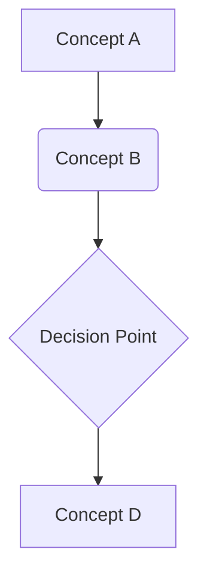

# Quickstart Guide: Physical AI & Humanoid Robotics Textbook

## Prerequisites

Before starting with the Physical AI & Humanoid Robotics textbook, ensure you have:

- Basic programming knowledge (Python or C++)
- Fundamental understanding of linear algebra and calculus
- Familiarity with Linux command line (helpful but not required)

## Environment Setup

### 1. Clone the Repository
```bash
git clone <repository-url>
cd physical-ai-humanoid-robotics
```

### 2. Install Dependencies
```bash
# Install Node.js (version 16 or higher)
# Install npm (usually comes with Node.js)

# Install project dependencies
npm install

# Install Docusaurus globally (if not already installed)
npm install -g @docusaurus/core
```

### 3. Configure RAG Settings
The textbook uses Retrieval-Augmented Generation for the AI chatbot. The configuration is already set as per requirements:
- chunk_size: 1024
- overlap: 200

## Local Development

### 1. Start the Development Server
```bash
npm start
```
This command starts a local development server and opens the textbook in your default browser at `http://localhost:3000`.

### 2. Navigate the Textbook
- Use the sidebar to navigate between modules and chapters
- Use the "Next" and "Previous" buttons at the bottom of each page to move through content sequentially
- Use the search bar to find specific topics using the RAG-powered chatbot

## Content Structure

The textbook follows this structure:

```
docs/
├── modules/
│   ├── module-1-ros/
│   │   ├── chapter-1-intro-ros/
│   │   ├── chapter-2-nodes-communication/
│   │   └── ...
│   ├── module-2-simulation/
│   ├── module-3-ai-brain/
│   └── module-4-vla/
└── ...
```

## Creating New Content

### 1. Add a New Chapter
To add a new chapter, create a markdown file in the appropriate module directory:

```markdown
---
id: chapter-x-title
title: Chapter Title
sidebar_label: Chapter X
---

import Tabs from '@theme/Tabs';
import TabItem from '@theme/TabItem';

## Learning Outcomes

After completing this chapter, you will be able to:
1. [Learning outcome 1]
2. [Learning outcome 2]
3. [Learning outcome 3]

## Theory & Intuition

[Provide theoretical background with analogies]

## Core Concepts

<Tabs
  defaultValue="diagram"
  values={[
    {label: 'Mermaid Diagram', value: 'diagram'},
    {label: 'Table', value: 'table'},
  ]}>
  <TabItem value="diagram">



  </TabItem>
  <TabItem value="table">

| Term | Definition | Example |
|------|------------|---------|
| Example | Definition | Usage |

  </TabItem>
</Tabs>

## Hands-On Labs

<Tabs
  defaultValue="lab1"
  values={[
    {label: 'Lab 1', value: 'lab1'},
    {label: 'Lab 2', value: 'lab2'},
  ]}>
  <TabItem value="lab1">

### Lab 1: [Title]

#### Objective
[Describe what the lab teaches]

#### Steps
1. [Step 1]
2. [Step 2]
3. [Step 3]

#### Code Example
```python
# Example code
print("Hello, Robotics!")
```

  </TabItem>
  <TabItem value="lab2">
    <!-- Additional lab content -->
  </TabItem>
</Tabs>

## Sim-to-Real Notes

[Notes on how to apply this concept to real hardware, such as Jetson Orin Nano or Unitree G1/Go2]

## Multiple Choice Questions

1. Question text?
   - A) Option A
   - B) Option B
   - C) Option C
   - D) Option D

   **Correct Answer: B** - Explanation of why B is correct

[Continue with 11-14 more MCQs]

## Further Reading

1. [Title of resource](link-to-resource) - Description
2. [Title of resource](link-to-resource) - Description
3. [Title of resource](link-to-resource) - Description
```

### 2. Update Navigation
Add the new chapter to the appropriate `sidebars.js` file:

```javascript
module.exports = {
  textbook: [
    {
      type: 'category',
      label: 'Module 1: The Robotic Nervous System (ROS 2)',
      items: [
        'modules/module-1-ros/chapter-1-intro-ros',
        'modules/module-1-ros/chapter-2-nodes-communication',
        // Add your new chapter here
        'modules/module-1-ros/chapter-x-title',
      ],
    },
    // ... other modules
  ],
};
```

## Working with the AI Chatbot

The textbook includes an AI chatbot powered by RAG (Retrieval-Augmented Generation):

1. Use the search bar at the top of any page
2. Ask questions about the content in natural language
3. The chatbot will reference specific sections of the textbook in its responses
4. If the question spans multiple chapters, the chatbot will cite relevant sources

## Personalization Features

1. Complete the background survey when prompted
2. The system will adapt content recommendations based on your learning pace
3. Track your progress through completed chapters
4. Receive personalized reading suggestions

## Multilingual Support

1. Click the language toggle in the top navigation bar
2. Select from available languages (English/Urdu)
3. All content, including code examples and MCQs, will be translated

## Testing Your Changes

1. Before submitting changes, ensure the site builds without errors:
```bash
npm run build
```

2. Run content validation:
```bash
npm test
```

3. Verify all links work correctly in your content:
```bash
npm run serve
```
Then navigate to the pages you've created to ensure all links work.

## Deploying Changes

For maintainers deploying to production:

1. Build the site:
```bash
npm run build
```

2. Deploy to your hosting platform (GitHub Pages, Netlify, etc.)

The site is now ready for content development and deployment following all the requirements specified in the constitution and feature specification.